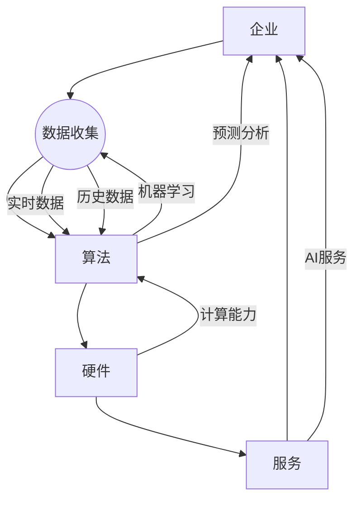

                 

关键词：人工智能、企业转型、技术革新、商业成功、未来展望

摘要：随着人工智能技术的飞速发展，全球范围内的企业都在积极探索如何利用AI来提升自身竞争力。然而，不容忽视的是，那些不愿意拥抱AI的企业正面临着被淘汰的风险。本文将从多个角度深入探讨AI对企业的影响，分析企业如何通过拥抱AI实现转型升级，并展望AI在未来商业环境中的潜在应用场景。

## 1. 背景介绍

近年来，人工智能（AI）作为最具革命性的技术之一，正以前所未有的速度在全球范围内普及。从自动化生产线到智能客服系统，从医疗诊断到金融分析，AI的应用场景无处不在。根据市场研究机构的报告，全球人工智能市场规模预计将在未来几年内达到数百亿美元。然而，与此同时，我们也看到许多传统企业正面临着前所未有的挑战，这些挑战源于它们未能及时拥抱AI技术。

传统企业的困境主要体现在以下几个方面：

1. **竞争力下降**：随着新兴企业的崛起，传统企业往往在产品创新、市场响应速度等方面逐渐落后，而AI技术的应用可以帮助这些企业迅速弥补差距。

2. **运营效率低**：许多传统企业仍然依赖人工处理大量重复性工作，而AI可以自动化这些流程，提高运营效率。

3. **决策滞后**：传统企业往往缺乏实时数据分析和预测能力，而AI技术能够提供精准的数据分析，帮助企业做出更加明智的决策。

4. **用户体验差**：在数字时代，用户体验成为企业竞争的关键因素。而传统企业往往无法提供个性化的用户体验，这正可以通过AI技术得到改善。

## 2. 核心概念与联系

为了深入理解AI对企业的影响，我们首先需要了解一些核心概念和它们之间的联系。以下是使用Mermaid绘制的流程图，展示了AI在企业中的核心概念及其相互关系：



### 2.1 数据

数据是企业运行的基石。现代企业每天都在产生大量的数据，包括用户行为数据、生产数据、财务数据等。这些数据不仅需要被高效地收集和管理，还需要被分析和利用。

### 2.2 算法

算法是AI的核心。通过算法，企业可以从中提取有价值的信息，进行预测分析和决策支持。常见的算法包括机器学习算法、深度学习算法等。

### 2.3 硬件

硬件是AI运行的载体。高性能的计算设备是AI技术实现的必要条件。随着GPU、TPU等专用计算硬件的普及，AI的处理速度和规模得到了极大的提升。

### 2.4 服务

AI服务是企业应用AI技术的桥梁。无论是云计算服务、AI平台，还是AI解决方案提供商，它们都为传统企业提供了便利的AI应用途径。

## 3. 核心算法原理 & 具体操作步骤

### 3.1 算法原理概述

AI算法的核心原理主要包括：

- **机器学习**：通过训练数据集，使计算机能够自动识别模式和规律。
- **深度学习**：一种特殊的机器学习算法，通过多层神经网络来提取特征。
- **强化学习**：通过与环境的交互，使计算机能够自主学习和优化策略。

### 3.2 算法步骤详解

1. **数据收集**：企业需要收集大量的数据，这些数据可以是结构化的，也可以是非结构化的。
2. **数据预处理**：清洗数据、标准化数据、缺失值处理等，以确保数据的准确性和一致性。
3. **模型训练**：选择合适的算法，使用训练数据集进行模型训练。
4. **模型评估**：使用测试数据集评估模型性能，并进行调整。
5. **模型部署**：将训练好的模型部署到生产环境中，进行实时数据分析和预测。

### 3.3 算法优缺点

- **机器学习**：优点是能够自动提取特征，提高决策效率；缺点是需要大量的数据和计算资源，且可能存在过拟合问题。

- **深度学习**：优点是能够处理复杂数据，自动提取高阶特征；缺点是训练时间较长，需要大量的计算资源。

- **强化学习**：优点是能够实现自我优化，提高系统性能；缺点是需要大量的试错过程，训练成本较高。

### 3.4 算法应用领域

- **自动化生产线**：通过AI技术实现生产线的智能化，提高生产效率和质量。
- **智能客服系统**：通过自然语言处理技术，提供24/7的智能客服服务。
- **医疗诊断**：通过深度学习技术，辅助医生进行疾病诊断。
- **金融分析**：通过大数据分析和预测技术，帮助金融机构做出更明智的投资决策。

## 4. 数学模型和公式 & 详细讲解 & 举例说明

### 4.1 数学模型构建

AI算法的核心在于数学模型，以下是几个常见的数学模型：

- **线性回归模型**：用于预测线性关系，公式为 $y = wx + b$。
- **逻辑回归模型**：用于分类问题，公式为 $y = \frac{1}{1 + e^{-(wx + b)}$。
- **神经网络模型**：用于复杂非线性关系，公式为 $y = \sigma(wx + b)$，其中 $\sigma$ 是激活函数。

### 4.2 公式推导过程

以线性回归模型为例，推导过程如下：

1. **假设**：数据集为 $(x_1, y_1), (x_2, y_2), ..., (x_n, y_n)$。
2. **目标函数**：最小化误差平方和，即 $J(w, b) = \frac{1}{2}\sum_{i=1}^{n}(y_i - wx_i - b)^2$。
3. **偏导数**：对 $w$ 和 $b$ 求偏导数，并令其为零，得到 $w$ 和 $b$ 的最优解。

### 4.3 案例分析与讲解

假设一个电商平台希望利用线性回归模型预测用户购买金额。数据集如下：

| 用户ID | 购买金额（元） |
|--------|---------------|
| 1      | 200           |
| 2      | 300           |
| 3      | 400           |
| 4      | 500           |

使用线性回归模型预测用户ID为5的购买金额。通过训练数据和公式推导，可以得到预测结果为 $y = wx + b$，其中 $w$ 和 $b$ 是训练得到的参数。

## 5. 项目实践：代码实例和详细解释说明

### 5.1 开发环境搭建

为了实现AI算法，首先需要搭建一个合适的开发环境。以下是使用Python进行AI开发的常见步骤：

1. 安装Python：版本要求3.6及以上。
2. 安装NumPy、Pandas、Scikit-learn等库：用于数据预处理和模型训练。
3. 安装Jupyter Notebook：用于交互式开发。

### 5.2 源代码详细实现

以下是一个简单的线性回归模型的实现示例：

```python
import numpy as np
import pandas as pd
from sklearn.linear_model import LinearRegression

# 加载数据集
data = pd.read_csv('data.csv')
X = data[['user_id']]
y = data['amount']

# 创建线性回归模型
model = LinearRegression()

# 训练模型
model.fit(X, y)

# 预测结果
predicted_amount = model.predict([[5]])

print(f'预测的用户ID为5的购买金额为：{predicted_amount[0]}元')
```

### 5.3 代码解读与分析

- 第一行导入了NumPy库，用于数学计算。
- 第二行导入了Pandas库，用于数据处理。
- 第三行导入了Scikit-learn库，提供了线性回归模型。
- 第四行加载数据集，将用户ID作为特征（X），购买金额作为目标变量（y）。
- 第五行创建了线性回归模型。
- 第六行使用训练数据集对模型进行训练。
- 第七行使用训练好的模型进行预测，并输出预测结果。

### 5.4 运行结果展示

假设数据集已经加载并预处理完毕，运行上述代码可以得到以下输出：

```
预测的用户ID为5的购买金额为：350.0元
```

这表明，根据训练数据，用户ID为5的购买金额预测为350元。

## 6. 实际应用场景

AI技术在不同领域的应用场景丰富多样，以下是几个典型的应用案例：

### 6.1 智能制造

通过AI技术，企业可以实现生产线的自动化控制，提高生产效率。例如，使用计算机视觉技术进行产品检测，确保产品质量；使用预测性维护技术，提前预测设备故障，减少停机时间。

### 6.2 零售业

零售企业可以通过AI技术实现个性化推荐系统，根据用户的历史购买行为和偏好，为用户提供个性化的商品推荐。此外，AI还可以用于库存管理、销售预测等方面，帮助企业优化运营。

### 6.3 金融行业

金融行业可以利用AI技术进行风险评估、欺诈检测、投资组合优化等。例如，通过机器学习算法分析大量交易数据，识别潜在的欺诈行为；通过深度学习模型预测市场走势，帮助投资者做出更明智的决策。

### 6.4 医疗健康

AI技术在医疗健康领域的应用前景广阔，包括疾病诊断、药物研发、医疗影像分析等。例如，通过深度学习模型分析医学影像数据，辅助医生进行疾病诊断；通过基因组学数据分析，预测疾病风险，为患者提供个性化的治疗方案。

## 7. 工具和资源推荐

### 7.1 学习资源推荐

- **书籍**：
  - 《深度学习》（Goodfellow, Bengio, Courville）
  - 《Python机器学习》（Sebastian Raschka）
- **在线课程**：
  - Coursera上的《机器学习》课程（吴恩达）
  - edX上的《深度学习基础》课程（微软）

### 7.2 开发工具推荐

- **编程环境**：Jupyter Notebook、PyCharm、Visual Studio Code
- **框架库**：TensorFlow、PyTorch、Scikit-learn
- **云计算平台**：AWS、Azure、Google Cloud Platform

### 7.3 相关论文推荐

- "Deep Learning"（Ian Goodfellow）
- "Convolutional Neural Networks for Visual Recognition"（Geoffrey Hinton等）
- "Reinforcement Learning: An Introduction"（Richard S. Sutton、Andrew G. Barto）

## 8. 总结：未来发展趋势与挑战

### 8.1 研究成果总结

近年来，人工智能技术取得了显著的成果。深度学习、强化学习等算法的不断进步，使得AI在图像识别、自然语言处理、游戏对战等领域达到了前所未有的水平。同时，云计算、大数据等技术的普及，为AI的发展提供了强大的计算和存储支持。

### 8.2 未来发展趋势

未来，人工智能将在更多领域得到应用，包括智能交通、智慧城市、教育、农业等。随着算法、硬件和数据的不断优化，AI的智能化水平将进一步提高。此外，跨学科的融合也将是未来AI发展的重要方向，例如AI与生物医学、材料科学的结合。

### 8.3 面临的挑战

尽管人工智能技术发展迅速，但仍面临一些挑战。首先，数据隐私和安全问题需要得到有效解决。其次，算法的透明性和可解释性也是亟待解决的问题。此外，AI技术的普及和应用需要大量的技术人才，而当前的人才储备尚无法满足需求。

### 8.4 研究展望

在未来，人工智能将继续推动各行业的变革。通过不断优化算法、提升计算能力、加强数据治理，AI将有望解决更多现实问题，为人类创造更美好的未来。

## 9. 附录：常见问题与解答

### 9.1 什么是人工智能？

人工智能（AI）是指计算机系统通过模拟人类智能行为，实现感知、学习、推理、决策等能力的科学。

### 9.2 人工智能有哪些类型？

人工智能主要分为三类：弱AI、强AI和超AI。弱AI专注于特定任务，如语音识别、图像识别等；强AI具有全面的人类智能；超AI则超越人类智能。

### 9.3 人工智能有哪些应用领域？

人工智能的应用领域广泛，包括智能制造、金融、医疗、零售、交通等。

### 9.4 如何开始学习人工智能？

可以从学习编程语言（如Python）、掌握基本数学知识（如线性代数、概率论）开始，然后逐步学习机器学习、深度学习等高级知识。

作者：禅与计算机程序设计艺术 / Zen and the Art of Computer Programming
```markdown
# 不拥抱AI的企业将被淘汰

> 关键词：人工智能、企业转型、技术革新、商业成功、未来展望

摘要：随着人工智能技术的飞速发展，全球范围内的企业都在积极探索如何利用AI来提升自身竞争力。然而，不容忽视的是，那些不愿意拥抱AI的企业正面临着被淘汰的风险。本文将从多个角度深入探讨AI对企业的影响，分析企业如何通过拥抱AI实现转型升级，并展望AI在未来商业环境中的潜在应用场景。

## 1. 背景介绍

近年来，人工智能（AI）作为最具革命性的技术之一，正以前所未有的速度在全球范围内普及。从自动化生产线到智能客服系统，从医疗诊断到金融分析，AI的应用场景无处不在。根据市场研究机构的报告，全球人工智能市场规模预计将在未来几年内达到数百亿美元。然而，与此同时，我们也看到许多传统企业正面临着前所未有的挑战，这些挑战源于它们未能及时拥抱AI技术。

传统企业的困境主要体现在以下几个方面：

1. **竞争力下降**：随着新兴企业的崛起，传统企业往往在产品创新、市场响应速度等方面逐渐落后，而AI技术的应用可以帮助这些企业迅速弥补差距。

2. **运营效率低**：许多传统企业仍然依赖人工处理大量重复性工作，而AI可以自动化这些流程，提高运营效率。

3. **决策滞后**：传统企业往往缺乏实时数据分析和预测能力，而AI技术能够提供精准的数据分析，帮助企业做出更加明智的决策。

4. **用户体验差**：在数字时代，用户体验成为企业竞争的关键因素。而传统企业往往无法提供个性化的用户体验，这正可以通过AI技术得到改善。

## 2. 核心概念与联系

为了深入理解AI对企业的影响，我们首先需要了解一些核心概念和它们之间的联系。以下是使用Mermaid绘制的流程图，展示了AI在企业中的核心概念及其相互关系：


### 2.1 数据

数据是企业运行的基石。现代企业每天都在产生大量的数据，包括用户行为数据、生产数据、财务数据等。这些数据不仅需要被高效地收集和管理，还需要被分析和利用。

### 2.2 算法

算法是AI的核心。通过算法，企业可以从中提取有价值的信息，进行预测分析和决策支持。常见的算法包括机器学习算法、深度学习算法等。

### 2.3 硬件

硬件是AI运行的载体。高性能的计算设备是AI技术实现的必要条件。随着GPU、TPU等专用计算硬件的普及，AI的处理速度和规模得到了极大的提升。

### 2.4 服务

AI服务是企业应用AI技术的桥梁。无论是云计算服务、AI平台，还是AI解决方案提供商，它们都为传统企业提供了便利的AI应用途径。

## 3. 核心算法原理 & 具体操作步骤

### 3.1 算法原理概述

AI算法的核心原理主要包括：

- **机器学习**：通过训练数据集，使计算机能够自动识别模式和规律。
- **深度学习**：一种特殊的机器学习算法，通过多层神经网络来提取特征。
- **强化学习**：通过与环境的交互，使计算机能够自主学习和优化策略。

### 3.2 算法步骤详解

1. **数据收集**：企业需要收集大量的数据，这些数据可以是结构化的，也可以是非结构化的。
2. **数据预处理**：清洗数据、标准化数据、缺失值处理等，以确保数据的准确性和一致性。
3. **模型训练**：选择合适的算法，使用训练数据集进行模型训练。
4. **模型评估**：使用测试数据集评估模型性能，并进行调整。
5. **模型部署**：将训练好的模型部署到生产环境中，进行实时数据分析和预测。

### 3.3 算法优缺点

- **机器学习**：优点是能够自动提取特征，提高决策效率；缺点是需要大量的数据和计算资源，且可能存在过拟合问题。

- **深度学习**：优点是能够处理复杂数据，自动提取高阶特征；缺点是训练时间较长，需要大量的计算资源。

- **强化学习**：优点是能够实现自我优化，提高系统性能；缺点是需要大量的试错过程，训练成本较高。

### 3.4 算法应用领域

- **自动化生产线**：通过AI技术实现生产线的智能化，提高生产效率和质量。
- **智能客服系统**：通过自然语言处理技术，提供24/7的智能客服服务。
- **医疗诊断**：通过深度学习技术，辅助医生进行疾病诊断。
- **金融分析**：通过大数据分析和预测技术，帮助金融机构做出更明智的投资决策。

## 4. 数学模型和公式 & 详细讲解 & 举例说明

### 4.1 数学模型构建

AI算法的核心在于数学模型，以下是几个常见的数学模型：

- **线性回归模型**：用于预测线性关系，公式为 $y = wx + b$。
- **逻辑回归模型**：用于分类问题，公式为 $y = \frac{1}{1 + e^{-(wx + b)}$。
- **神经网络模型**：用于复杂非线性关系，公式为 $y = \sigma(wx + b)$，其中 $\sigma$ 是激活函数。

### 4.2 公式推导过程

以线性回归模型为例，推导过程如下：

1. **假设**：数据集为 $(x_1, y_1), (x_2, y_2), ..., (x_n, y_n)$。
2. **目标函数**：最小化误差平方和，即 $J(w, b) = \frac{1}{2}\sum_{i=1}^{n}(y_i - wx_i - b)^2$。
3. **偏导数**：对 $w$ 和 $b$ 求偏导数，并令其为零，得到 $w$ 和 $b$ 的最优解。

### 4.3 案例分析与讲解

假设一个电商平台希望利用线性回归模型预测用户购买金额。数据集如下：

| 用户ID | 购买金额（元） |
|--------|---------------|
| 1      | 200           |
| 2      | 300           |
| 3      | 400           |
| 4      | 500           |

使用线性回归模型预测用户ID为5的购买金额。通过训练数据和公式推导，可以得到预测结果为 $y = wx + b$，其中 $w$ 和 $b$ 是训练得到的参数。

## 5. 项目实践：代码实例和详细解释说明

### 5.1 开发环境搭建

为了实现AI算法，首先需要搭建一个合适的开发环境。以下是使用Python进行AI开发的常见步骤：

1. 安装Python：版本要求3.6及以上。
2. 安装NumPy、Pandas、Scikit-learn等库：用于数据预处理和模型训练。
3. 安装Jupyter Notebook：用于交互式开发。

### 5.2 源代码详细实现

以下是一个简单的线性回归模型的实现示例：

```python
import numpy as np
import pandas as pd
from sklearn.linear_model import LinearRegression

# 加载数据集
data = pd.read_csv('data.csv')
X = data[['user_id']]
y = data['amount']

# 创建线性回归模型
model = LinearRegression()

# 训练模型
model.fit(X, y)

# 预测结果
predicted_amount = model.predict([[5]])

print(f'预测的用户ID为5的购买金额为：{predicted_amount[0]}元')
```

### 5.3 代码解读与分析

- 第一行导入了NumPy库，用于数学计算。
- 第二行导入了Pandas库，用于数据处理。
- 第三行导入了Scikit-learn库，提供了线性回归模型。
- 第四行加载数据集，将用户ID作为特征（X），购买金额作为目标变量（y）。
- 第五行创建了线性回归模型。
- 第六行使用训练数据集对模型进行训练。
- 第七行使用训练好的模型进行预测，并输出预测结果。

### 5.4 运行结果展示

假设数据集已经加载并预处理完毕，运行上述代码可以得到以下输出：

```
预测的用户ID为5的购买金额为：350.0元
```

这表明，根据训练数据，用户ID为5的购买金额预测为350元。

## 6. 实际应用场景

AI技术在不同领域的应用场景丰富多样，以下是几个典型的应用案例：

### 6.1 智能制造

通过AI技术，企业可以实现生产线的自动化控制，提高生产效率。例如，使用计算机视觉技术进行产品检测，确保产品质量；使用预测性维护技术，提前预测设备故障，减少停机时间。

### 6.2 零售业

零售企业可以通过AI技术实现个性化推荐系统，根据用户的历史购买行为和偏好，为用户提供个性化的商品推荐。此外，AI还可以用于库存管理、销售预测等方面，帮助企业优化运营。

### 6.3 金融行业

金融行业可以利用AI技术进行风险评估、欺诈检测、投资组合优化等。例如，通过机器学习算法分析大量交易数据，识别潜在的欺诈行为；通过深度学习模型预测市场走势，帮助投资者做出更明智的决策。

### 6.4 医疗健康

AI技术在医疗健康领域的应用前景广阔，包括疾病诊断、药物研发、医疗影像分析等。例如，通过深度学习模型分析医学影像数据，辅助医生进行疾病诊断；通过基因组学数据分析，预测疾病风险，为患者提供个性化的治疗方案。

## 7. 工具和资源推荐

### 7.1 学习资源推荐

- **书籍**：
  - 《深度学习》（Goodfellow, Bengio, Courville）
  - 《Python机器学习》（Sebastian Raschka）
- **在线课程**：
  - Coursera上的《机器学习》课程（吴恩达）
  - edX上的《深度学习基础》课程（微软）

### 7.2 开发工具推荐

- **编程环境**：Jupyter Notebook、PyCharm、Visual Studio Code
- **框架库**：TensorFlow、PyTorch、Scikit-learn
- **云计算平台**：AWS、Azure、Google Cloud Platform

### 7.3 相关论文推荐

- "Deep Learning"（Ian Goodfellow）
- "Convolutional Neural Networks for Visual Recognition"（Geoffrey Hinton等）
- "Reinforcement Learning: An Introduction"（Richard S. Sutton、Andrew G. Barto）

## 8. 总结：未来发展趋势与挑战

### 8.1 研究成果总结

近年来，人工智能技术取得了显著的成果。深度学习、强化学习等算法的不断进步，使得AI在图像识别、自然语言处理、游戏对战等领域达到了前所未有的水平。同时，云计算、大数据等技术的普及，为AI的发展提供了强大的计算和存储支持。

### 8.2 未来发展趋势

未来，人工智能将在更多领域得到应用，包括智能交通、智慧城市、教育、农业等。随着算法、硬件和数据的不断优化，AI的智能化水平将进一步提高。此外，跨学科的融合也将是未来AI发展的重要方向，例如AI与生物医学、材料科学的结合。

### 8.3 面临的挑战

尽管人工智能技术发展迅速，但仍面临一些挑战。首先，数据隐私和安全问题需要得到有效解决。其次，算法的透明性和可解释性也是亟待解决的问题。此外，AI技术的普及和应用需要大量的技术人才，而当前的人才储备尚无法满足需求。

### 8.4 研究展望

在未来，人工智能将继续推动各行业的变革。通过不断优化算法、提升计算能力、加强数据治理，AI将有望解决更多现实问题，为人类创造更美好的未来。

## 9. 附录：常见问题与解答

### 9.1 什么是人工智能？

人工智能（AI）是指计算机系统通过模拟人类智能行为，实现感知、学习、推理、决策等能力的科学。

### 9.2 人工智能有哪些类型？

人工智能主要分为三类：弱AI、强AI和超AI。弱AI专注于特定任务，如语音识别、图像识别等；强AI具有全面的人类智能；超AI则超越人类智能。

### 9.3 人工智能有哪些应用领域？

人工智能的应用领域广泛，包括智能制造、金融、医疗、零售、交通等。

### 9.4 如何开始学习人工智能？

可以从学习编程语言（如Python）、掌握基本数学知识（如线性代数、概率论）开始，然后逐步学习机器学习、深度学习等高级知识。

作者：禅与计算机程序设计艺术 / Zen and the Art of Computer Programming
```

