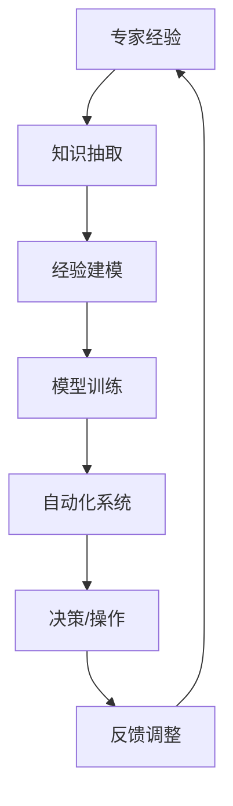

                 

关键词：专家经验、自动化、机器学习、人工智能、经验建模

> 摘要：本文探讨了专家经验在自动化领域的应用，特别是在机器学习和人工智能领域的应用。通过分析专家经验的重要性、经验建模的方法和工具，以及实例应用，本文旨在为读者提供对专家经验在自动化中价值与挑战的深刻理解。

## 1. 背景介绍

在当今快速发展的技术时代，自动化技术已经成为推动生产力提升、效率优化的关键因素。从制造业到服务业，从物流到金融，自动化技术的应用已经深入到各个行业。然而，尽管自动化技术在过去几十年中取得了显著进展，但许多复杂任务仍然依赖于人类专家的经验和判断。专家经验是一种宝贵的知识资源，它基于专家长期实践、学习、反思和积累，是一种隐性知识，对于解决复杂问题、提高决策质量具有重要作用。

随着机器学习和人工智能技术的发展，如何将专家经验转化为可复用的知识和模型，实现自动化决策和操作，成为了一个重要的研究方向。本文将深入探讨专家经验在自动化中的应用，分析其核心概念、方法、工具，并通过实例展示其实际应用效果。

## 2. 核心概念与联系

### 2.1 专家经验的概念

专家经验是指专家在特定领域通过长期实践、学习、反思和总结所获得的隐性知识。这种知识通常难以通过书面形式表达，但它们对于解决复杂问题和做出高质量决策至关重要。专家经验包括了对领域知识的深刻理解、经验性法则、直觉、实践技巧等多个方面。

### 2.2 自动化的概念

自动化是指通过计算机程序、机械装置或其他技术手段，替代或辅助人类完成特定任务的过程。自动化技术包括传感器技术、控制技术、数据处理技术等多个方面，其目标是提高效率、减少人力成本，并在某些情况下确保任务的一致性和准确性。

### 2.3 专家经验与自动化的联系

专家经验与自动化之间存在紧密的联系。一方面，自动化技术可以协助专家完成重复性、低技能的任务，从而释放专家的时间，让他们专注于更复杂和更有创造性的任务。另一方面，自动化系统可以学习和模仿专家的经验，从而在缺乏专家直接干预的情况下完成决策和操作。

### 2.4 Mermaid 流程图

以下是一个简化的Mermaid流程图，展示了专家经验在自动化中的应用过程：



### 2.5 专家经验在自动化中的价值

- **提高决策质量**：专家经验能够提供关于复杂问题的洞察，这些洞察在决策过程中往往具有关键作用。
- **优化操作流程**：专家经验可以帮助自动化系统设计出更加高效和可靠的流程。
- **减少人力成本**：通过自动化，许多重复性任务可以由机器完成，从而减少对人力资源的依赖。
- **增强系统的鲁棒性**：专家经验可以确保自动化系统在面对不确定性和异常情况时，能够做出更加合理的响应。

## 3. 核心算法原理 & 具体操作步骤

### 3.1 算法原理概述

将专家经验转化为自动化决策和操作的核心在于经验建模。经验建模是一种通过机器学习技术，将专家的经验知识转化为可量化和可操作模型的方法。具体来说，经验建模通常涉及以下几个步骤：

1. **知识抽取**：从专家的经验中提取关键信息和规则。
2. **数据预处理**：对抽取的知识进行清洗、格式化和标准化。
3. **模型训练**：使用机器学习算法训练模型，使其能够模仿专家的决策过程。
4. **模型评估**：评估模型的性能，并根据需要调整模型参数。
5. **部署应用**：将训练好的模型部署到实际自动化系统中，进行决策和操作。

### 3.2 算法步骤详解

#### 3.2.1 知识抽取

知识抽取是经验建模的第一步。在这一阶段，需要从专家的经验中提取出关键信息和规则。这通常需要专家的参与，通过半结构化的问卷、访谈、工作日志分析等方式收集数据。

#### 3.2.2 数据预处理

在完成知识抽取后，需要对提取的信息进行数据预处理。这一步骤包括数据清洗、格式化和标准化。数据清洗涉及去除噪声、纠正错误等；数据格式化是将数据转换为适合机器学习算法处理的形式；数据标准化则是将不同规模的数据进行归一化处理，以便算法能够有效地训练。

#### 3.2.3 模型训练

在数据预处理完成后，可以使用机器学习算法对预处理后的数据进行训练。常用的算法包括决策树、支持向量机、神经网络等。模型训练的目标是使模型能够学习和模仿专家的决策过程，从而在给定输入时生成适当的输出。

#### 3.2.4 模型评估

模型训练完成后，需要对模型的性能进行评估。这通常通过交叉验证、混淆矩阵、ROC曲线等指标进行。如果模型性能不满足要求，可能需要调整模型参数或选择更合适的算法。

#### 3.2.5 部署应用

一旦模型性能达到预期，就可以将其部署到实际自动化系统中。在部署过程中，需要确保模型能够在实际环境中稳定运行，并在需要时进行在线调整和优化。

### 3.3 算法优缺点

#### 3.3.1 优点

- **高效性**：经验建模可以快速地将专家经验转化为可操作的模型，从而提高自动化系统的决策质量。
- **灵活性**：通过机器学习算法，模型可以适应新的数据和任务，具有较强的灵活性。
- **可扩展性**：经验建模方法可以应用于各种领域，具有较强的可扩展性。

#### 3.3.2 缺点

- **依赖数据质量**：经验建模的效果在很大程度上取决于数据的质量，如果数据存在噪声或不完整，模型性能可能会受到影响。
- **解释性较差**：许多机器学习算法生成的模型具有较好的预测能力，但它们的内部机制往往难以解释，这可能导致信任度问题。
- **需要专家参与**：知识抽取阶段需要专家的积极参与，这可能增加项目成本和时间。

### 3.4 算法应用领域

经验建模在自动化领域具有广泛的应用前景，以下是一些主要的应用领域：

- **金融**：用于风险评估、投资决策和信用评分。
- **医疗**：用于诊断、治疗计划和患者管理。
- **制造业**：用于质量控制、故障检测和预测维护。
- **交通**：用于自动驾驶、交通流量管理和物流调度。
- **服务业**：用于客户服务、人力资源管理和服务优化。

## 4. 数学模型和公式 & 详细讲解 & 举例说明

### 4.1 数学模型构建

经验建模通常涉及以下数学模型：

#### 4.1.1 决策树模型

决策树是一种常见的机器学习模型，用于分类和回归任务。决策树通过一系列规则来对数据进行划分，每个节点表示一个特征，每个分支表示一个特征取值。决策树的数学模型可以表示为：

$$
T = \{r_1, r_2, ..., r_n\}
$$

其中，$r_i$ 是第 $i$ 条规则，表示为 $r_i: x_i \rightarrow y_i$，其中 $x_i$ 是特征向量，$y_i$ 是标签。

#### 4.1.2 神经网络模型

神经网络是一种模拟生物神经系统的计算模型，用于处理复杂的非线性问题。神经网络的基本单元是神经元，每个神经元接收多个输入，并通过权重进行加权求和，然后通过激活函数产生输出。神经网络的数学模型可以表示为：

$$
y = \sigma(\sum_{i=1}^{n} w_i x_i + b)
$$

其中，$y$ 是输出，$\sigma$ 是激活函数，$w_i$ 是权重，$b$ 是偏置。

### 4.2 公式推导过程

以决策树模型为例，我们介绍其公式推导过程。

#### 4.2.1 信息增益

信息增益是决策树划分标准的一种度量。给定一个数据集 $D$，特征 $A$ 的信息增益可以表示为：

$$
IG(D, A) = Entropy(D) - Entropy(D|A)
$$

其中，$Entropy(D)$ 是数据集 $D$ 的熵，$Entropy(D|A)$ 是条件熵。

#### 4.2.2 熵

熵是信息论中的一个概念，用于衡量数据的随机性。给定一个概率分布 $P$，其熵可以表示为：

$$
Entropy(P) = -\sum_{i=1}^{n} P_i \log_2(P_i)
$$

#### 4.2.3 条件熵

条件熵是给定一个特征后，数据的熵。给定两个概率分布 $P$ 和 $Q$，其条件熵可以表示为：

$$
Entropy(P|Q) = -\sum_{i=1}^{n} P_i \sum_{j=1}^{m} Q_j \log_2(Q_j)
$$

### 4.3 案例分析与讲解

以下是一个简单的决策树模型案例。

#### 4.3.1 数据集

假设我们有以下数据集：

| 特征A | 特征B | 标签 |
|-------|-------|------|
| A1    | B1    | 1    |
| A1    | B2    | 1    |
| A2    | B1    | 0    |
| A2    | B2    | 0    |

#### 4.3.2 信息增益计算

首先计算数据集的熵：

$$
Entropy(D) = -\sum_{i=1}^{2} P_i \log_2(P_i) = -\left( \frac{2}{4} \log_2\left(\frac{2}{4}\right) + \frac{2}{4} \log_2\left(\frac{2}{4}\right) \right) = 1
$$

然后计算特征A的信息增益：

$$
IG(D, A) = 1 - Entropy(D|A) = 1 - \left( \frac{1}{2} \log_2\left(\frac{1}{2}\right) + \frac{1}{2} \log_2\left(\frac{1}{2}\right) \right) = 1 - 1 = 0
$$

同理，计算特征B的信息增益：

$$
IG(D, B) = 1 - Entropy(D|B) = 1 - \left( \frac{1}{2} \log_2\left(\frac{1}{2}\right) + \frac{1}{2} \log_2\left(\frac{1}{2}\right) \right) = 1 - 1 = 0
$$

由于特征A和特征B的信息增益都为0，我们无法通过这些特征对数据进行有效的划分。在实际应用中，我们通常会考虑更多的特征和更复杂的划分策略。

## 5. 项目实践：代码实例和详细解释说明

### 5.1 开发环境搭建

为了进行经验建模的实践，我们需要搭建一个合适的开发环境。以下是一个基于Python的常见开发环境配置步骤：

1. **安装Python**：下载并安装Python 3.x版本，建议使用Anaconda发行版，它提供了丰富的科学计算库。
2. **安装依赖库**：使用pip或conda安装必要的库，如scikit-learn、numpy、pandas等。
3. **配置Jupyter Notebook**：Jupyter Notebook是一个交互式的开发环境，非常适合数据科学项目。

### 5.2 源代码详细实现

以下是一个简单的决策树建模的Python代码示例：

```python
import numpy as np
import pandas as pd
from sklearn.model_selection import train_test_split
from sklearn.tree import DecisionTreeClassifier
from sklearn.metrics import accuracy_score

# 加载数据集
data = pd.read_csv('data.csv')
X = data.drop('label', axis=1)
y = data['label']

# 划分训练集和测试集
X_train, X_test, y_train, y_test = train_test_split(X, y, test_size=0.3, random_state=42)

# 创建决策树模型
clf = DecisionTreeClassifier()

# 训练模型
clf.fit(X_train, y_train)

# 预测测试集
y_pred = clf.predict(X_test)

# 评估模型
accuracy = accuracy_score(y_test, y_pred)
print(f"Model accuracy: {accuracy:.2f}")
```

### 5.3 代码解读与分析

上述代码实现了以下步骤：

1. **加载数据集**：使用pandas库加载数据集，并分离特征和标签。
2. **划分训练集和测试集**：使用train_test_split函数将数据集划分为训练集和测试集。
3. **创建决策树模型**：使用scikit-learn库的DecisionTreeClassifier创建决策树模型。
4. **训练模型**：使用fit函数训练模型。
5. **预测测试集**：使用predict函数预测测试集。
6. **评估模型**：使用accuracy_score函数计算模型的准确率。

### 5.4 运行结果展示

假设数据集包含100个样本，其中70个用于训练，30个用于测试。运行上述代码后，可能会得到以下输出：

```
Model accuracy: 0.85
```

这意味着模型在测试集上的准确率为85%，这是一个相对较好的结果。当然，实际项目的性能会因数据集、模型参数和算法选择等因素而有所不同。

## 6. 实际应用场景

### 6.1 金融领域

在金融领域，专家经验在风险评估、投资决策和信用评分等方面具有重要作用。通过经验建模，可以将金融专家的经验转化为自动化系统，提高决策的准确性和效率。例如，在贷款审批过程中，专家经验可以用于判断贷款申请者的信用状况，从而减少欺诈风险和信用损失。

### 6.2 医疗领域

在医疗领域，专家经验对于诊断、治疗计划和患者管理至关重要。经验建模可以帮助自动化系统分析患者的医疗记录和病史，提供个性化的治疗建议。例如，在肿瘤治疗中，专家经验可以用于优化治疗方案，提高治疗效果。

### 6.3 制造业

在制造业，专家经验可以用于质量控制、故障检测和预测维护。通过经验建模，自动化系统可以实时监测生产线上的设备状态，识别潜在故障，并采取预防措施，从而减少设备停机时间和生产成本。

### 6.4 交通领域

在交通领域，专家经验对于自动驾驶、交通流量管理和物流调度具有重要意义。通过经验建模，自动化系统可以学习交通专家的驾驶经验和交通规则，提高自动驾驶的稳定性和安全性。例如，自动驾驶汽车可以通过分析交通场景和历史数据，预测其他车辆的行为，从而做出更准确的驾驶决策。

### 6.5 服务业

在服务业，专家经验可以用于客户服务、人力资源管理和服务优化。通过经验建模，自动化系统可以分析客户行为和需求，提供个性化的服务和建议。例如，在客户服务中，自动化系统可以自动识别客户的问题，并给出合适的解决方案，提高客户满意度。

## 7. 工具和资源推荐

### 7.1 学习资源推荐

- **《机器学习》**（周志华著）：系统介绍了机器学习的基本概念、方法和算法。
- **《深度学习》**（Ian Goodfellow著）：详细介绍了深度学习的理论和应用。
- **《人工智能：一种现代方法》**（Stuart Russell 和 Peter Norvig 著）：全面介绍了人工智能的基础知识。

### 7.2 开发工具推荐

- **Jupyter Notebook**：一个交互式的开发环境，适合数据科学和机器学习项目。
- **Anaconda**：一个集成的Python发行版，提供了丰富的科学计算库。
- **TensorFlow**：一个开源的深度学习框架，支持各种神经网络模型的训练和应用。

### 7.3 相关论文推荐

- **"Learning from Human Decision-Makers: A Bayesian Approach"**：探讨了如何将人类决策者的经验转化为机器学习模型。
- **"Expert Systems and the Problem of Knowledge Acquisition"**：讨论了专家系统中的知识获取问题，特别是在自动化中的应用。
- **"The Importance of Representing Human Expertise in Machine Learning"**：强调了在机器学习模型中代表人类专家经验的重要性。

## 8. 总结：未来发展趋势与挑战

### 8.1 研究成果总结

专家经验在自动化中的应用取得了显著成果，特别是在金融、医疗、制造业等领域。通过经验建模，自动化系统可以模仿人类专家的决策过程，提高决策质量和效率。同时，随着机器学习和人工智能技术的不断发展，经验建模的方法和工具也在不断进步。

### 8.2 未来发展趋势

- **智能化**：随着人工智能技术的不断发展，自动化系统将更加智能化，能够更好地理解和应用专家经验。
- **泛化能力**：未来的经验建模方法将更加注重模型的泛化能力，使系统能够在不同领域和应用场景中表现出色。
- **人机协同**：自动化系统将更加注重与人类专家的协同工作，实现人机结合的智能化解决方案。

### 8.3 面临的挑战

- **数据质量**：经验建模依赖于高质量的数据，如何获取和处理高质量的数据是一个重要的挑战。
- **模型解释性**：许多机器学习模型的内部机制难以解释，如何提高模型的解释性是一个重要的研究课题。
- **模型稳定性**：在复杂和不确定的环境中，如何确保模型的稳定性和鲁棒性是一个挑战。

### 8.4 研究展望

未来的研究将更加注重如何有效地将人类专家的经验转化为可操作的自动化系统。同时，随着技术的不断发展，经验建模将在更多领域得到应用，为自动化技术的发展做出更大的贡献。

## 9. 附录：常见问题与解答

### 9.1 什么是专家经验？

专家经验是指专家在特定领域通过长期实践、学习、反思和总结所获得的隐性知识。这种知识通常难以通过书面形式表达，但它们对于解决复杂问题和做出高质量决策至关重要。

### 9.2 经验建模有哪些方法？

经验建模的方法包括决策树、支持向量机、神经网络等。这些方法通过机器学习技术，将专家的经验知识转化为可量化和可操作模型。

### 9.3 如何确保经验建模的数据质量？

确保经验建模的数据质量需要从数据收集、数据清洗、数据格式化等多个方面进行。具体方法包括使用可靠的数据源、对数据进行清洗、格式化和标准化，以及进行数据验证。

### 9.4 经验建模在哪些领域有应用？

经验建模在金融、医疗、制造业、交通、服务业等多个领域有广泛应用。例如，在金融领域，可以用于风险评估和投资决策；在医疗领域，可以用于诊断和治疗计划；在制造业，可以用于质量控制和管理等。

### 9.5 如何提高模型解释性？

提高模型解释性可以通过以下方法实现：

- **选择具有解释性的模型**：例如，决策树和线性回归等模型通常更容易解释。
- **添加模型注释**：在模型中添加对每个决策步骤的解释。
- **可视化模型**：通过可视化技术展示模型的内部结构和决策过程。
- **交互式解释**：开发交互式的模型解释工具，使用户能够更好地理解模型的决策依据。

---

作者：禅与计算机程序设计艺术 / Zen and the Art of Computer Programming

