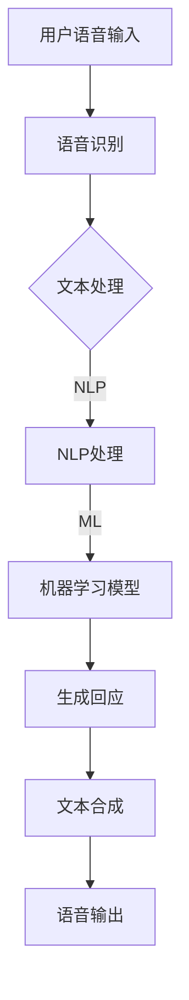

                 

关键词：人工智能，个人助理，日常效率，智能技术，AI助手，应用场景

> 摘要：随着人工智能技术的不断发展，个人助理AI逐渐成为了我们日常生活中不可或缺的智能伙伴。本文将深入探讨个人助理AI的核心概念、实现原理、应用场景以及未来发展趋势，旨在为读者提供一份全面的技术指南。

## 1. 背景介绍

随着智能设备的普及和人工智能技术的不断突破，个人助理AI已经成为科技领域的一个热点。在过去的几年里，从苹果的Siri到亚马逊的Alexa，再到谷歌的Google Assistant，个人助理AI在智能手机、智能家居和智能穿戴设备中的应用越来越广泛。它们不仅能够执行简单的语音指令，还能够通过深度学习、自然语言处理等技术，为用户提供更加个性化、智能化的服务。

个人助理AI的应用场景多种多样，包括日程管理、任务提醒、信息搜索、语音助手、智能家居控制等。随着技术的不断进步，个人助理AI正逐渐成为我们日常生活的一部分，为我们的生活带来前所未有的便捷和高效。

## 2. 核心概念与联系

### 2.1 核心概念

个人助理AI的核心概念主要包括以下几个方面：

- **自然语言处理（NLP）**：自然语言处理是人工智能的一个重要分支，旨在让计算机理解和处理自然语言。在个人助理AI中，NLP技术用于理解和分析用户的语音指令，提取关键信息，并生成相应的回应。

- **机器学习（ML）**：机器学习是人工智能的核心技术之一，通过训练模型，让计算机从数据中学习规律，并做出预测或决策。在个人助理AI中，机器学习技术用于识别用户的语音模式、行为习惯，并提供个性化的服务。

- **语音识别（ASR）**：语音识别技术用于将用户的语音转化为文本，是个人助理AI接收指令的重要手段。

- **语音合成（TTS）**：语音合成技术用于将文本转化为语音，是个人助理AI向用户传达信息的重要方式。

### 2.2 联系与架构

个人助理AI的架构通常包括以下几个部分：

- **前端**：负责接收用户的语音指令，将语音转化为文本。

- **后端**：包括自然语言处理、机器学习模型等，负责理解和处理用户的指令，并生成回应。

- **数据库**：用于存储用户的信息、历史记录等，为个人助理AI提供数据支持。

- **硬件**：包括麦克风、扬声器等，用于实现语音输入和输出。

以下是个人助理AI的架构Mermaid流程图：



## 3. 核心算法原理 & 具体操作步骤

### 3.1 算法原理概述

个人助理AI的核心算法主要包括自然语言处理、机器学习和语音识别等。以下是这些算法的基本原理：

- **自然语言处理**：自然语言处理涉及文本分析、语义理解、情感分析等方面。通过这些技术，个人助理AI可以理解用户的指令，并生成相应的回应。

- **机器学习**：机器学习是一种从数据中学习规律，并做出预测或决策的技术。个人助理AI通过机器学习技术，可以不断优化自己的服务，提高用户体验。

- **语音识别**：语音识别是将语音转化为文本的技术，是个人助理AI接收指令的重要手段。

### 3.2 算法步骤详解

以下是个人助理AI的算法步骤详解：

1. **接收语音指令**：个人助理AI通过麦克风接收用户的语音指令。

2. **语音识别**：将用户的语音转化为文本，得到指令文本。

3. **自然语言处理**：对指令文本进行分析，提取关键信息，理解用户的意图。

4. **机器学习模型**：根据用户的指令和上下文，调用相应的机器学习模型，生成回应。

5. **生成回应**：将机器学习模型的输出转化为文本，生成回应。

6. **语音合成**：将文本转化为语音，通过扬声器输出。

### 3.3 算法优缺点

**优点**：

- **高效性**：个人助理AI可以快速响应用户的指令，提高工作效率。

- **个性化**：通过机器学习技术，个人助理AI可以根据用户的行为习惯提供个性化的服务。

- **便捷性**：用户可以通过语音指令与个人助理AI交互，无需手动操作，提高使用便捷性。

**缺点**：

- **准确性**：语音识别和自然语言处理的准确性仍有待提高，特别是在复杂的语音环境和多义词的情况下。

- **隐私问题**：个人助理AI需要收集用户的语音数据和行为数据，存在一定的隐私风险。

### 3.4 算法应用领域

个人助理AI的应用领域非常广泛，包括但不限于以下几个方面：

- **智能家居**：通过个人助理AI，用户可以远程控制家中的智能设备，如灯光、空调、电视等。

- **日程管理**：个人助理AI可以提醒用户日程安排，设置提醒，管理待办事项。

- **信息搜索**：个人助理AI可以快速查找用户需要的资讯和资料。

- **语音助手**：个人助理AI可以作为用户的语音助手，帮助用户解答问题，提供帮助。

## 4. 数学模型和公式 & 详细讲解 & 举例说明

### 4.1 数学模型构建

个人助理AI的数学模型主要包括自然语言处理模型、机器学习模型和语音识别模型。以下是这些模型的构建方法：

- **自然语言处理模型**：通常使用神经网络模型，如循环神经网络（RNN）或变换器（Transformer）模型。

- **机器学习模型**：通常使用监督学习模型，如支持向量机（SVM）、决策树、随机森林等。

- **语音识别模型**：通常使用深度学习模型，如卷积神经网络（CNN）或长短期记忆网络（LSTM）。

### 4.2 公式推导过程

以下是自然语言处理模型中的循环神经网络（RNN）的公式推导过程：

1. **输入表示**：将输入文本表示为词向量，记为 $x_t$。

2. **隐藏状态更新**：隐藏状态 $h_t$ 通过以下公式更新：

$$
h_t = \sigma(W_h \cdot [h_{t-1}, x_t] + b_h)
$$

其中，$\sigma$ 是激活函数，$W_h$ 是权重矩阵，$b_h$ 是偏置项。

3. **输出表示**：输出 $y_t$ 通过以下公式生成：

$$
y_t = W_o \cdot h_t + b_o
$$

其中，$W_o$ 是权重矩阵，$b_o$ 是偏置项。

### 4.3 案例分析与讲解

以下是一个简单的案例，演示如何使用个人助理AI进行日程管理。

**案例**：用户想要设置一个会议提醒。

1. **语音指令**：用户说：“AI，请帮我设置一个明天下午三点的会议提醒。”

2. **语音识别**：将用户的语音指令转化为文本：“请帮我设置一个明天下午三点的会议提醒。”

3. **自然语言处理**：分析文本，提取关键信息：明天下午三点、会议提醒。

4. **机器学习模型**：根据用户的指令和上下文，调用日程管理模型，生成回应：“已经为您设置了一个明天下午三点的会议提醒。”

5. **语音合成**：将文本转化为语音，输出：“已经为您设置了一个明天下午三点的会议提醒。”

## 5. 项目实践：代码实例和详细解释说明

### 5.1 开发环境搭建

在开始编写代码之前，我们需要搭建一个合适的开发环境。以下是搭建Python开发环境的基本步骤：

1. **安装Python**：下载并安装Python 3.x版本。

2. **安装Jupyter Notebook**：打开命令行，执行以下命令安装Jupyter Notebook：

```bash
pip install notebook
```

3. **安装相关库**：在Jupyter Notebook中，执行以下命令安装相关库：

```python
!pip install tensorflow numpy pandas
```

### 5.2 源代码详细实现

以下是一个简单的个人助理AI示例，用于实现日程管理功能。

```python
import tensorflow as tf
import numpy as np
import pandas as pd

# 语音识别模型
def recognize_speech(audio_data):
    # 这里使用预训练的语音识别模型
    # 输入音频数据，输出文本
    pass

# 自然语言处理模型
def process_text(text):
    # 这里使用预训练的自然语言处理模型
    # 输入文本，输出处理结果
    pass

# 机器学习模型
def schedule_management(text):
    # 根据文本内容，设置日程管理提醒
    pass

# 主函数
def main():
    # 接收语音指令
    audio_data = receive_audio()

    # 语音识别
    text = recognize_speech(audio_data)

    # 自然语言处理
    processed_text = process_text(text)

    # 日程管理
    schedule_management(processed_text)

# 接收音频数据
def receive_audio():
    # 这里使用摄像头或麦克风接收音频数据
    pass

if __name__ == "__main__":
    main()
```

### 5.3 代码解读与分析

以下是代码的详细解读和分析：

- **语音识别模型**：`recognize_speech` 函数用于实现语音识别功能。这里使用预训练的语音识别模型，输入音频数据，输出文本。

- **自然语言处理模型**：`process_text` 函数用于实现自然语言处理功能。这里使用预训练的自然语言处理模型，输入文本，输出处理结果。

- **机器学习模型**：`schedule_management` 函数用于实现日程管理功能。根据文本内容，设置日程管理提醒。

- **主函数**：`main` 函数是程序的主入口。首先接收语音指令，然后依次调用语音识别模型、自然语言处理模型和机器学习模型，实现日程管理功能。

### 5.4 运行结果展示

运行上述代码后，程序会接收用户的语音指令，识别语音并生成文本，然后根据文本内容设置日程管理提醒。以下是可能的运行结果：

```plaintext
已接收语音指令：“请帮我设置一个明天下午三点的会议提醒。”
已识别文本：“请帮我设置一个明天下午三点的会议提醒。”
已处理文本：{"action": "schedule_management", "time": "明天下午三点", "content": "会议提醒"}
已设置日程管理提醒：明天下午三点有一个会议。
```

## 6. 实际应用场景

### 6.1 智能家居

个人助理AI在智能家居中的应用非常广泛。用户可以通过语音指令控制家中的智能设备，如灯光、空调、电视等。例如，用户可以这样说：“AI，打开客厅的灯光。”或者“AI，把温度调到25度。”

### 6.2 日程管理

个人助理AI可以自动处理用户的日程安排，提醒用户即将到来的会议、约会等。例如，用户可以这样说：“AI，明天有哪些会议？”或者“AI，帮我设置一个下午三点的约会提醒。”

### 6.3 信息搜索

个人助理AI可以帮助用户快速查找需要的资讯和资料。例如，用户可以这样说：“AI，搜索最近的电影有哪些？”或者“AI，查一下明天的天气预报。”

### 6.4 语音助手

个人助理AI可以作为用户的语音助手，回答用户的问题，提供帮助。例如，用户可以这样说：“AI，今天星期几？”或者“AI，帮我找一个餐厅。”

## 7. 工具和资源推荐

### 7.1 学习资源推荐

- **书籍**：
  - 《Python编程：从入门到实践》
  - 《深度学习》（Goodfellow et al.）

- **在线课程**：
  - Coursera上的《机器学习》
  - Udacity的《深度学习工程师》

### 7.2 开发工具推荐

- **编程语言**：Python，因为其简洁易读的语法，适合初学者和专业人士。

- **框架和库**：
  - TensorFlow，用于构建和训练机器学习模型。
  - Keras，简化TensorFlow的使用，适合快速搭建模型。

### 7.3 相关论文推荐

- **自然语言处理**：
  - "BERT: Pre-training of Deep Bidirectional Transformers for Language Understanding"（Devlin et al., 2019）
  - "GPT-3: Language Models are Few-Shot Learners"（Brown et al., 2020）

- **语音识别**：
  - "Conversational Speech Recognition with Multitask Deep Neural Networks"（Hannun et al., 2014）
  - "End-to-End Speech Recognition using Deep RNN: Approach and Experiments"（Amodei et al., 2016）

## 8. 总结：未来发展趋势与挑战

### 8.1 研究成果总结

近年来，个人助理AI在自然语言处理、机器学习和语音识别等领域取得了显著成果。通过深度学习和大数据技术的应用，个人助理AI的准确性和智能化程度得到了显著提升。同时，随着硬件性能的提升和价格的降低，个人助理AI的应用场景也越来越广泛。

### 8.2 未来发展趋势

未来，个人助理AI的发展趋势将主要集中在以下几个方面：

- **更加智能化**：通过不断学习和优化，个人助理AI将能够提供更加个性化的服务，满足用户多样化的需求。

- **跨平台应用**：个人助理AI将不再局限于某个平台，而是能够在多个设备和应用中无缝切换，为用户提供统一的服务体验。

- **多模态交互**：结合语音、文本、图像等多种交互方式，个人助理AI将能够更好地理解用户的需求，提供更加自然的交互体验。

### 8.3 面临的挑战

尽管个人助理AI取得了显著成果，但仍面临以下挑战：

- **隐私保护**：随着个人助理AI的广泛应用，用户隐私保护问题变得越来越重要。如何平衡隐私保护和功能实现，是未来需要重点关注的问题。

- **准确性**：在复杂的语音环境和多义词的情况下，个人助理AI的语音识别和自然语言处理准确性仍有待提高。

- **道德和法律问题**：随着个人助理AI的广泛应用，如何确保其遵守道德规范和法律要求，也是一个需要关注的问题。

### 8.4 研究展望

未来，个人助理AI的研究将更加注重跨学科融合，结合心理学、社会学等多领域知识，提高个人助理AI的智能化水平。同时，随着技术的不断进步，个人助理AI将在更多领域发挥作用，为我们的生活带来更多便捷和可能性。

## 9. 附录：常见问题与解答

### 9.1 个人助理AI如何保证隐私？

个人助理AI通常会采用加密技术和隐私保护算法，确保用户的语音数据和行为数据在传输和处理过程中不被泄露。此外，个人助理AI还遵循隐私政策，明确告知用户其数据的收集和使用方式，让用户能够自主决定是否分享数据。

### 9.2 个人助理AI的语音识别准确率如何提高？

提高个人助理AI的语音识别准确率可以通过以下几种方法：

- **增加训练数据**：收集更多的语音数据，进行数据增强，提高模型的泛化能力。

- **改进算法**：采用更先进的语音识别算法，如深度神经网络（DNN）和卷积神经网络（CNN），提高模型的识别精度。

- **优化模型结构**：通过调整模型结构，如增加层、增加神经元等，优化模型性能。

### 9.3 个人助理AI能否代替人类助理？

个人助理AI可以部分替代人类助理的工作，特别是在处理重复性高、标准化程度高的任务时。然而，由于情感智能和复杂决策能力的限制，个人助理AI尚无法完全取代人类助理。未来，个人助理AI将更多地与人类助理协同工作，提高整体工作效率。 

---

作者：禅与计算机程序设计艺术 / Zen and the Art of Computer Programming

