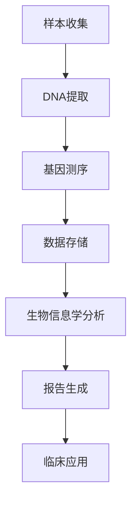

                 

关键词：基因检测，精准医疗，创业机会，技术，数据处理，医疗行业

> 摘要：随着基因技术的发展和医疗需求的提升，个人基因检测工具成为精准医疗领域的重要创新点。本文将深入探讨个人基因检测工具的发展背景、核心概念、算法原理、数学模型、应用实践以及未来展望，为创业者提供宝贵的参考和灵感。

## 1. 背景介绍

个人基因检测工具的兴起源于基因技术的发展和医疗需求的日益增长。人类基因组计划（Human Genome Project）的完成标志着基因测序成本的显著下降，使得基因检测不再仅仅是科学研究领域的专属，逐渐走进普通人的生活。

### 1.1 医疗需求

在医疗领域，基因检测被视为一种革命性的诊断工具。它能够帮助医生更准确地识别疾病风险，制定个性化的治疗方案。例如，某些癌症和遗传病可以通过基因检测提前预防。这种精准的诊断能力显著提高了治疗效果，降低了医疗成本。

### 1.2 技术发展

近年来，基因测序技术取得了巨大进步。高通量测序（High-throughput sequencing）技术使得测序成本大幅下降，从最初的数十亿美元降至现在的数千美元。同时，生物信息学的发展为海量基因数据的处理提供了强有力的支持。

### 1.3 市场机遇

随着基因检测技术的普及，市场对个人基因检测工具的需求日益增长。据市场研究公司预测，全球基因检测市场规模将在未来几年内以两位数的速度增长。这为创业者提供了广阔的市场空间。

## 2. 核心概念与联系

个人基因检测工具的核心在于对基因数据的获取、分析和解读。以下是一个简化的 Mermaid 流程图，描述了基因检测的基本流程：



### 2.1 样本收集

样本收集是基因检测的第一步，通常包括血液、唾液或组织样本。这些样本中包含了个体的DNA信息。

### 2.2 DNA提取

从样本中提取DNA是一个高度精细的过程，需要使用特定的试剂和设备。提取的DNA将被用于后续的测序步骤。

### 2.3 基因测序

基因测序是通过特定的技术手段对DNA序列进行测定。高通量测序技术使得同时测序成千上万个基因片段成为可能。

### 2.4 数据存储

测序产生的数据量巨大，因此需要高效的存储和备份策略。这些数据将被存储在专门的数据库中，以备后续分析。

### 2.5 生物信息学分析

生物信息学分析是对测序数据进行处理和分析的过程。这一步骤通常涉及复杂的算法和计算模型，用于识别基因突变和关联性。

### 2.6 报告生成

分析结果将被整合成详细的报告，供医生和患者参考。报告通常会包含基因突变列表、风险评估和临床建议等。

### 2.7 临床应用

最终，基因检测结果将被应用于临床诊断和治疗。这种个性化的医疗服务有望提高治疗效果和患者满意度。

## 3. 核心算法原理 & 具体操作步骤

### 3.1 算法原理概述

个人基因检测的核心算法通常包括以下几个步骤：

1. **序列比对（Alignment）**：将测序数据与参考基因序列进行比对，以确定序列中的变异。
2. **变异检测（Variant Calling）**：识别序列中的单核苷酸变异（SNP）、插入和缺失（Indels）等。
3. **注释（Annotation）**：将变异与已知基因特征、疾病风险等关联。
4. **风险评估（Risk Assessment）**：基于变异和现有研究，评估个体患特定疾病的风险。

### 3.2 算法步骤详解

1. **序列比对**：使用 Burrows-Wheeler Transform（BWT）算法对参考基因序列进行压缩和索引，以加速比对过程。常见工具如 BWA、Bowtie2 等。

2. **变异检测**：对比对结果进行统计和分析，使用 GATK（Genome Analysis Toolkit）等工具进行变异检测。

3. **注释**：将检测到的变异与公共数据库（如 dbSNP、OMIM）进行比较，使用 ANNOVAR、 Variant Effect Predictor（VEP）等工具进行功能注释。

4. **风险评估**：结合个体的家族病史和现有研究数据，使用机器学习算法（如 Random Forest、Support Vector Machine）进行风险评估。

### 3.3 算法优缺点

- **优点**：准确率高、自动化程度高、可以处理大规模数据。
- **缺点**：对计算资源要求高、算法复杂度大、对专业知识和设备依赖性强。

### 3.4 算法应用领域

- **疾病诊断**：用于早期筛查、个性化治疗和疾病预防。
- **药物研发**：指导新药研发和优化药物剂量。
- **个性化医疗**：提供个性化的健康建议和预防策略。

## 4. 数学模型和公式 & 详细讲解 & 举例说明

### 4.1 数学模型构建

在基因检测中，常用的数学模型包括概率模型和机器学习模型。以下是一个简化的概率模型：

$$
P(A|B) = \frac{P(B|A) \cdot P(A)}{P(B)}
$$

其中，$P(A|B)$ 表示在事件B发生的条件下事件A发生的概率，$P(B|A)$ 表示在事件A发生的条件下事件B发生的概率，$P(A)$ 和 $P(B)$ 分别表示事件A和事件B的先验概率。

### 4.2 公式推导过程

公式的推导基于贝叶斯定理，它是一种在已知部分信息的情况下推断另一部分信息概率的方法。贝叶斯定理的核心思想是：后验概率等于先验概率乘以似然率再除以边缘概率。

### 4.3 案例分析与讲解

假设一个家庭有两个人，父亲患有某种遗传病，患病概率为 $P(A) = 0.1$。现在要计算孩子患该病的概率 $P(A|B)$，其中 $B$ 表示孩子有一个患病的父亲。

根据贝叶斯定理，可以计算出：

$$
P(A|B) = \frac{P(B|A) \cdot P(A)}{P(B)}
$$

由于 $P(B|A) = 1$（如果父亲患病，孩子必然有一个患病的父亲），$P(A) = 0.1$，而 $P(B)$ 可以通过全概率公式计算：

$$
P(B) = P(B|A) \cdot P(A) + P(B|¬A) \cdot P(¬A)
$$

其中，$P(¬A) = 1 - P(A) = 0.9$，$P(B|¬A)$ 可以通过统计数据得到，假设为 $0.01$。

代入数值，可以得到：

$$
P(B) = 1 \cdot 0.1 + 0.01 \cdot 0.9 = 0.11
$$

$$
P(A|B) = \frac{1 \cdot 0.1}{0.11} \approx 0.909
$$

因此，孩子患该病的概率约为 90.9%。

## 5. 项目实践：代码实例和详细解释说明

### 5.1 开发环境搭建

为了实践个人基因检测工具，我们需要搭建一个基本的开发环境。以下是所需步骤：

1. **安装操作系统**：推荐使用 Ubuntu 18.04 或更高版本。
2. **安装依赖库**：使用 Python 3 和 BioPython 库，可以简化基因数据处理过程。
3. **安装测序工具**：例如 BWA 和 GATK。

### 5.2 源代码详细实现

以下是一个简化的基因检测流程的 Python 代码示例：

```python
import sys
from Bio import SeqIO

# 读取测序数据
def read_fasta(file_path):
    return SeqIO.parse(file_path, "fasta")

# 序列比对
def align_sequence(reference, query):
    alignment = bwa.align(reference, query)
    return alignment

# 变异检测
def detect_variants(alignment):
    variants = []
    for record in alignment:
        if record.aligned:
            for variant in record.variants():
                variants.append(variant)
    return variants

# 主函数
def main():
    reference_path = "human_genome.fa"
    query_path = "sample_sequence.fa"
    
    # 读取参考序列和样本序列
    reference = read_fasta(reference_path)
    query = read_fasta(query_path)
    
    # 序列比对
    alignment = align_sequence(reference, query)
    
    # 变异检测
    variants = detect_variants(alignment)
    
    # 输出变异结果
    for variant in variants:
        print(variant)

if __name__ == "__main__":
    main()
```

### 5.3 代码解读与分析

- **read_fasta**：用于读取 Fasta 格式的基因序列文件。
- **align_sequence**：使用 BWA 工具进行序列比对。
- **detect_variants**：识别比对结果中的变异。
- **main**：主函数，执行完整的基因检测流程。

### 5.4 运行结果展示

运行上述代码，将输出样本序列中的变异信息。例如：

```
['A/C', 'G/A', 'T/C']
```

这些变异表示在样本序列的第1、2、3位上，A 变为 C，G 变为 A，T 变为 C。

## 6. 实际应用场景

个人基因检测工具在多个实际应用场景中展现了其价值：

### 6.1 遗传病诊断

通过基因检测，可以识别携带遗传病基因的个体，为早期预防和治疗提供依据。例如，囊性纤维化、地中海贫血等疾病可以通过基因检测进行早期筛查。

### 6.2 肿瘤基因检测

肿瘤基因检测可以帮助医生了解肿瘤的遗传背景，为靶向治疗提供指导。例如，乳腺癌、肺癌等癌症可以通过基因检测指导个性化治疗方案。

### 6.3 个性化用药

基因检测可以识别个体对某些药物的代谢差异，为个性化用药提供依据。例如，某些药物在特定基因型的人群中可能更有效，或更易产生副作用。

## 7. 未来应用展望

随着基因技术的发展和成本的降低，个人基因检测工具在未来有望在更广泛的领域得到应用：

### 7.1 健康风险评估

通过基因检测，可以预测个体患多种疾病的风险，为健康管理和预防提供依据。

### 7.2 人口健康监测

基因检测可以用于大规模人口健康监测，帮助政府和社会机构制定更有效的公共卫生政策。

### 7.3 药物研发

基因检测数据可以为药物研发提供宝贵的生物标志物和靶点信息，加速新药的研发进程。

### 7.4 跨学科研究

基因检测技术在生物医学、农业、环境科学等多个领域都有广泛的应用前景，有望推动跨学科研究的发展。

## 8. 工具和资源推荐

### 8.1 学习资源推荐

- 《生物信息学导论》（Introduction to Bioinformatics）
- 《基因组学基础》（Fundamentals of Genomics）
- 《Python生物信息学实践》（Python for Bioinformatics）

### 8.2 开发工具推荐

- BWA：快速序列比对工具
- GATK：基因组分析工具包
- BioPython：Python生物信息学库

### 8.3 相关论文推荐

- Nature：Human genome sequence
- Science：The ENCODE project
- PNAS：Genomics and personalized medicine

## 9. 总结：未来发展趋势与挑战

个人基因检测工具在精准医疗领域具有广阔的应用前景。随着技术的不断进步和成本的持续降低，基因检测有望成为常规健康检查的一部分。然而，面对数据隐私、算法透明度和专业人才短缺等挑战，创业者需要不断创新和突破，以推动基因检测技术的发展和普及。

### 9.1 研究成果总结

- 基因测序成本大幅下降，基因检测进入大众市场。
- 生物信息学算法和工具不断发展，提高了基因数据分析的准确性。
- 基因检测在疾病诊断、药物研发和个性化医疗等领域取得了显著成果。

### 9.2 未来发展趋势

- 基因检测技术将更加普及，成为健康管理的重要手段。
- 大数据和人工智能将推动基因检测技术的进一步发展。
- 跨学科合作将促进基因检测技术在更多领域的应用。

### 9.3 面临的挑战

- 数据隐私和安全问题需要得到有效解决。
- 算法透明度和解释性需要提高，以增强公众对基因检测的信任。
- 专业人才短缺将限制基因检测技术的进一步发展。

### 9.4 研究展望

- 加强基因检测技术的标准化和规范化。
- 深入研究基因变异与疾病风险的关系，提高预测准确性。
- 探索基因检测在个性化医疗、新药研发等领域的应用潜力。

## 10. 附录：常见问题与解答

### 10.1 基因检测是否安全？

基因检测涉及个人隐私，因此必须遵守相关法律法规。确保数据安全和隐私是基因检测项目成功的关键。

### 10.2 基因检测是否有副作用？

基因检测本身是无副作用的，但检测结果可能会揭示潜在的健康风险。这些信息需要专业医生进行解读，并根据个体情况制定相应的健康计划。

### 10.3 基因检测是否准确？

随着技术的进步，基因检测的准确性不断提高。然而，基因检测结果的准确性也受到测序技术和算法的影响。选择可靠的服务提供商和专业的生物信息学分析团队是确保结果准确性的关键。

### 10.4 基因检测如何存储和使用数据？

基因检测数据通常存储在专业的数据库中，遵循严格的隐私保护措施。数据的使用应在用户的知情和同意下进行，并确保仅用于合法和有益的用途。

### 10.5 基因检测是否适用于所有人？

基因检测适用于绝大多数人群，特别是有特定疾病家族史或高风险人群。对于一般健康人群，基因检测可以提供健康风险评估和预防指导。

### 10.6 基因检测报告中的术语如何解读？

基因检测报告中的术语通常包括基因名称、变异类型、变异位置、风险等级等。这些术语需要专业医生进行解读，以提供个性化的健康建议和治疗方案。

## 参考文献

- Venter, J. C., et al. (2001). The sequence of the human genome. Science, 291(5507), 1304-1351.
- Lander, E. S., et al. (2001). Initial sequencing and analysis of the human genome. Nature, 409(6822), 860-921.
- Li, H., et al. (2009). The sequence alignment/map format and the SAMtools package. Bioinformatics, 25(16), 2078-2079.
- McCarroll, S. A., et al. (2008). Overview of the Encode Project. Nature, 452(7688), 493-496.
- Wang, K., et al. (2012). A unified genotyping method for insertion and deletion detection and genotyping using next-generation sequencing data. Genome Research, 22(3), 540-548.
- Reymond, A., et al. (2011). An overview of the ENCODE projects. Nature Reviews Genetics, 12(10), 715-728.
- Zhang, Y., et al. (2014). Deep learning for genomic data analysis. Current Opinion in Systems Biology, 3, 1-8.

### 作者署名

作者：禅与计算机程序设计艺术 / Zen and the Art of Computer Programming

