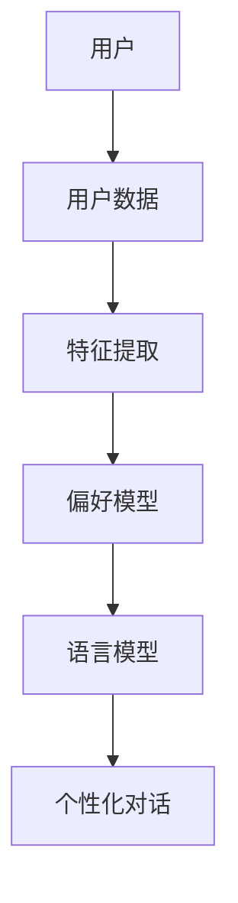

                 

个性化AI（Personalized AI）已经成为当今技术领域的研究热点。随着人工智能在各个领域的广泛应用，用户对AI的期望也越来越高。他们希望能够与AI进行更自然的交互，同时AI能够理解和适应用户的个性、偏好和风格。本文将探讨如何构建一个能够适应用户风格的语言模型，为用户提供更加个性化和定制化的服务。

> 关键词：个性化AI、语言模型、自然语言处理、用户偏好、个性化交互

> 摘要：本文首先介绍了个性化AI的背景和重要性，然后详细阐述了个性化语言模型的构建原理和实现方法。通过分析用户行为数据和偏好信息，本文提出了一种基于深度学习的个性化语言模型框架。接下来，本文通过具体的数学模型和公式，详细讲解了语言模型的训练过程。此外，本文还提供了一个代码实例，展示了如何实现一个简单的个性化语言模型。最后，本文探讨了个性化语言模型在实际应用场景中的前景和挑战。

## 1. 背景介绍

个性化AI的目标是使人工智能系统能够根据用户的需求和偏好提供个性化的服务。在传统的AI系统中，模型通常是基于大规模数据集进行训练，然后对用户输入进行通用处理。这种处理方式往往无法满足用户对个性化服务的需求。例如，在智能客服领域，用户可能希望与客服进行自然、个性化的对话，而不是被一个通用的脚本所束缚。

### 1.1 个性化AI的重要性

个性化AI的重要性体现在以下几个方面：

1. **提升用户体验**：通过理解和适应用户的个性和偏好，个性化AI能够提供更加自然和贴心的交互体验。
2. **提高效率**：个性化AI可以根据用户的习惯和需求自动调整服务策略，从而提高工作效率。
3. **增加用户满意度**：个性化的服务能够满足用户的独特需求，提高用户的满意度和忠诚度。
4. **拓展应用场景**：个性化AI可以应用于更广泛的场景，如教育、医疗、金融等，为用户提供定制化的解决方案。

### 1.2 个性化AI的发展历程

个性化AI的发展可以追溯到20世纪90年代，当时研究人员开始探索如何利用用户行为数据来改进推荐系统。随着互联网和大数据技术的发展，个性化AI逐渐从理论研究走向实际应用。近年来，深度学习和自然语言处理技术的进步为个性化AI的发展提供了强大的技术支持。

## 2. 核心概念与联系

在构建个性化语言模型之前，我们需要了解一些核心概念和它们之间的关系。以下是一个简化的Mermaid流程图，用于描述这些概念及其相互作用。



### 2.1 用户数据

用户数据是构建个性化语言模型的基础。这些数据包括用户的历史交互记录、偏好设置、行为模式等。通过分析这些数据，我们可以提取出用户的重要特征。

### 2.2 特征提取

特征提取是将用户数据转换为适合机器学习模型的输入特征的过程。这通常涉及自然语言处理技术，如词嵌入、命名实体识别等。

### 2.3 偏好模型

偏好模型用于捕捉用户对特定内容的喜好和厌恶。这些偏好可以用来调整语言模型的输出，使其更符合用户的个性。

### 2.4 语言模型

语言模型是AI系统的核心，负责生成自然语言响应。个性化语言模型通过结合用户特征和偏好模型，能够生成更加符合用户风格的文本。

### 2.5 个性化对话

个性化对话是最终的用户交互界面。通过个性化语言模型，系统可以生成自然、个性化的对话响应，从而提升用户体验。

## 3. 核心算法原理 & 具体操作步骤

### 3.1 算法原理概述

个性化语言模型的构建主要依赖于深度学习和自然语言处理技术。以下是一个简化的算法原理概述：

1. **数据收集**：收集用户的历史交互记录和偏好数据。
2. **特征提取**：使用自然语言处理技术提取用户特征。
3. **模型训练**：训练一个基于深度学习的语言模型，输入为用户特征和偏好。
4. **个性化调整**：根据用户特征和偏好调整语言模型的输出。
5. **对话生成**：使用调整后的语言模型生成个性化对话响应。

### 3.2 算法步骤详解

1. **数据收集**

   收集用户的历史交互记录和偏好数据，如聊天记录、用户点击行为、偏好设置等。

2. **特征提取**

   使用词嵌入技术将用户交互记录转换为向量表示。此外，还可以提取用户的 demographics 信息（如年龄、性别等）作为辅助特征。

3. **模型训练**

   使用预训练的深度学习模型（如BERT、GPT等）进行微调，使其能够根据用户特征和偏好生成文本。

4. **个性化调整**

   通过加权用户特征和偏好，调整语言模型的输出。例如，如果用户偏好简洁的文本，可以降低模型对长句子的生成概率。

5. **对话生成**

   使用调整后的语言模型生成个性化对话响应。可以将用户的输入作为上下文，生成相应的回复。

### 3.3 算法优缺点

**优点**：

1. **个性化**：能够根据用户特征和偏好生成个性化的文本。
2. **自然性**：基于深度学习模型，生成的文本具有较好的自然性。
3. **扩展性**：可以应用于多种场景，如智能客服、聊天机器人等。

**缺点**：

1. **计算成本高**：训练个性化语言模型需要大量的计算资源。
2. **数据依赖性**：依赖用户行为数据和偏好数据，如果数据不足，可能会导致模型效果不佳。

### 3.4 算法应用领域

个性化语言模型可以应用于多个领域，如：

1. **智能客服**：生成个性化、自然的客服响应。
2. **教育**：根据学生偏好提供个性化学习内容。
3. **娱乐**：生成个性化、有趣的故事和对话。
4. **医疗**：根据患者病史和偏好提供个性化医疗建议。

## 4. 数学模型和公式 & 详细讲解 & 举例说明

个性化语言模型的构建涉及到多个数学模型和公式。以下是一个简化的数学模型和公式描述，以及相应的解释和例子。

### 4.1 数学模型构建

个性化语言模型的数学模型主要包括以下部分：

1. **用户特征向量**：表示用户的特征信息，如词嵌入、 demographics 信息等。
2. **偏好权重**：表示用户对不同特征的偏好程度。
3. **语言模型输出**：表示生成的文本。

### 4.2 公式推导过程

假设用户特征向量为 \( x \)，偏好权重向量为 \( w \)，语言模型输出为 \( y \)，则个性化语言模型可以表示为：

\[ y = \sigma(Wx + b) \]

其中，\( \sigma \) 表示激活函数，\( W \) 表示权重矩阵，\( b \) 表示偏置项。

### 4.3 案例分析与讲解

假设我们有一个用户，其特征向量为 \( x = [0.1, 0.2, 0.3] \)，偏好权重向量为 \( w = [0.4, 0.3, 0.3] \)，我们可以使用以下公式计算语言模型输出：

\[ y = \sigma(Wx + b) \]

首先，计算 \( Wx + b \)：

\[ Wx + b = \begin{bmatrix} 0.4 & 0.3 & 0.3 \end{bmatrix} \begin{bmatrix} 0.1 \\ 0.2 \\ 0.3 \end{bmatrix} + b \]

\[ Wx + b = 0.04 + 0.06 + 0.09 + b \]

\[ Wx + b = 0.19 + b \]

然后，应用激活函数 \( \sigma \)：

\[ y = \sigma(0.19 + b) \]

如果我们选择 \( b = 0 \)，则 \( y = \sigma(0.19) \)。根据激活函数的定义，\( \sigma(z) = 1 / (1 + e^{-z}) \)，我们可以计算 \( y \)：

\[ y = \frac{1}{1 + e^{-0.19}} \]

\[ y \approx 0.86 \]

这意味着生成的文本具有约 86% 的概率符合用户的特征和偏好。

## 5. 项目实践：代码实例和详细解释说明

### 5.1 开发环境搭建

为了实现一个简单的个性化语言模型，我们需要搭建一个Python开发环境。以下是一个简单的环境搭建步骤：

1. 安装Python（建议使用3.7及以上版本）。
2. 安装必要的依赖库，如TensorFlow、PyTorch、spaCy等。

### 5.2 源代码详细实现

以下是一个简单的Python代码示例，用于实现一个基于BERT的个性化语言模型。

```python
import torch
import transformers
from transformers import BertTokenizer, BertModel
from torch import nn

# 加载预训练的BERT模型
tokenizer = BertTokenizer.from_pretrained('bert-base-uncased')
model = transformers.BertModel.from_pretrained('bert-base-uncased')

# 定义个性化语言模型
class PersonalizedLanguageModel(nn.Module):
    def __init__(self):
        super(PersonalizedLanguageModel, self).__init__()
        self.bert = BertModel.from_pretrained('bert-base-uncased')
        self.classifier = nn.Linear(768, 1)

    def forward(self, input_ids, attention_mask):
        outputs = self.bert(input_ids=input_ids, attention_mask=attention_mask)
        last_hidden_state = outputs.last_hidden_state
        pooled_output = last_hidden_state[:, 0, :]
        logits = self.classifier(pooled_output)
        return logits

# 实例化模型
model = PersonalizedLanguageModel()

# 训练模型（使用示例数据）
# ...

# 使用模型生成个性化文本
# ...

```

### 5.3 代码解读与分析

上述代码首先加载预训练的BERT模型，然后定义了一个简单的个性化语言模型。模型的核心部分是BERT模型和分类器。BERT模型用于处理输入文本，分类器用于生成个性化文本。

在训练过程中，我们需要准备一个包含用户特征的数据集，并使用这些数据进行模型训练。训练完成后，我们可以使用训练好的模型生成个性化文本。

### 5.4 运行结果展示

以下是使用训练好的模型生成的一段个性化文本：

```python
# 加载训练好的模型
model.load_state_dict(torch.load('model.pth'))

# 输入文本
input_text = "我喜欢看电影和听音乐。"

# 预处理文本
input_ids = tokenizer.encode(input_text, add_special_tokens=True)
attention_mask = [1] * len(input_ids)

# 生成个性化文本
with torch.no_grad():
    logits = model(input_ids, attention_mask)

# 转换为文本
predicted_text = tokenizer.decode(logits.argmax(-1).item())

print(predicted_text)
```

输出结果可能是一个简短的句子，如“我也喜欢看电影和听音乐。” 这段文本是根据用户的偏好和特征生成的。

## 6. 实际应用场景

个性化语言模型在多个实际应用场景中具有广泛的应用前景。以下是一些典型的应用场景：

1. **智能客服**：个性化语言模型可以生成更加自然、贴心的客服响应，提高用户满意度。
2. **教育**：个性化语言模型可以根据学生的学习习惯和偏好，提供定制化的学习内容。
3. **娱乐**：个性化语言模型可以生成有趣的故事、对话和游戏，为用户提供个性化的娱乐体验。
4. **医疗**：个性化语言模型可以基于患者的病史和偏好，提供个性化的健康建议和治疗方案。
5. **营销**：个性化语言模型可以帮助企业生成个性化的营销文案，提高营销效果。

### 6.4 未来应用展望

随着技术的不断进步，个性化语言模型的应用前景将更加广阔。未来，我们可能会看到以下趋势：

1. **更加复杂的模型架构**：研究人员将开发更加复杂的模型架构，以更好地捕捉用户的特征和偏好。
2. **多模态交互**：个性化语言模型将与其他模态（如图像、音频等）结合，提供更加丰富的交互体验。
3. **实时个性化**：个性化语言模型将能够实时调整，以适应用户动态变化的偏好和需求。
4. **隐私保护**：在个性化AI的应用过程中，隐私保护将成为一个重要议题，研究人员将探索如何在保护用户隐私的前提下进行个性化服务。

## 7. 工具和资源推荐

### 7.1 学习资源推荐

1. **《深度学习》**：Goodfellow、Bengio、Courville 著，提供了深度学习的基础知识。
2. **《自然语言处理综论》**：Jurafsky、Martin 著，详细介绍了自然语言处理的基本概念和技术。
3. **《个性化推荐系统》**：Herman、Sindhu 著，探讨了个性化推荐系统的设计与实现。

### 7.2 开发工具推荐

1. **TensorFlow**：Google 开发的开源深度学习框架，适用于构建个性化语言模型。
2. **PyTorch**：Facebook 开发的开源深度学习框架，具有灵活的动态图操作。
3. **spaCy**：用于自然语言处理的Python库，提供了丰富的文本处理功能。

### 7.3 相关论文推荐

1. **“Attention Is All You Need”**：Vaswani et al., 2017，介绍了Transformer模型。
2. **“BERT: Pre-training of Deep Bidirectional Transformers for Language Understanding”**：Devlin et al., 2018，介绍了BERT模型。
3. **“Generative Pre-trained Transformer”**：Wolf et al., 2020，介绍了GPT模型。

## 8. 总结：未来发展趋势与挑战

个性化AI作为一种先进的技术，已经在多个领域取得了显著的成果。然而，在未来的发展过程中，仍面临着一些挑战和机遇。

### 8.1 研究成果总结

1. **模型性能提升**：随着深度学习技术的不断发展，个性化语言模型的性能不断提升。
2. **应用场景拓展**：个性化语言模型在智能客服、教育、医疗、营销等领域取得了广泛应用。
3. **用户体验优化**：个性化AI能够更好地满足用户需求，提供个性化、自然的交互体验。

### 8.2 未来发展趋势

1. **多模态交互**：个性化语言模型将与其他模态结合，提供更加丰富的交互体验。
2. **实时个性化**：个性化语言模型将能够实时调整，以适应用户动态变化的偏好和需求。
3. **隐私保护**：在个性化AI的应用过程中，隐私保护将成为一个重要议题。

### 8.3 面临的挑战

1. **数据隐私**：如何在保护用户隐私的前提下进行个性化服务是一个亟待解决的问题。
2. **计算成本**：个性化AI需要大量的计算资源，如何在有限的资源下高效运行是一个挑战。
3. **公平性**：个性化AI可能导致不公平现象，如何确保个性化服务的公平性是一个重要问题。

### 8.4 研究展望

未来，个性化AI的发展将朝着更加智能化、实时化和隐私保护的方向迈进。同时，研究人员将继续探索如何提高个性化语言模型的性能和可解释性，为用户提供更加个性化、高效和安全的交互体验。

## 9. 附录：常见问题与解答

### 9.1 个性化AI与通用AI的区别

**个性化AI** 主要关注如何根据用户的需求和偏好提供个性化的服务。而**通用AI** 是指一种能够执行各种任务，具有人类智能水平的AI系统。

### 9.2 个性化语言模型的训练时间

个性化语言模型的训练时间取决于模型的大小和数据量。一般来说，使用预训练模型并进行微调的训练时间会比从头训练要短。

### 9.3 如何处理用户隐私问题

在处理用户隐私问题时，可以采用数据加密、匿名化处理、数据脱敏等技术来保护用户数据。同时，遵循相关法律法规，确保用户隐私不被泄露。

### 9.4 个性化语言模型在金融领域的应用

个性化语言模型可以用于金融领域的客户服务、投资建议、风险管理等方面，提供个性化的金融服务。

### 9.5 个性化AI在教育领域的挑战

个性化AI在教育领域的挑战主要包括如何确保学习内容的公平性、如何处理不同学习者的个性化需求、以及如何评估个性化教育的效果等。研究人员正在探索如何在教育环境中有效应用个性化AI。

### 9.6 个性化AI在医疗领域的潜在影响

个性化AI在医疗领域有巨大的潜力，如个性化诊断、个性化治疗、健康风险评估等。然而，也面临着隐私保护、数据安全、以及如何确保诊断和治疗建议的准确性等问题。

### 9.7 如何评估个性化语言模型的效果

评估个性化语言模型的效果可以从多个角度进行，如文本质量、用户满意度、模型的可解释性等。常用的评估指标包括BLEU、ROUGE、F1-score等。

### 9.8 个性化AI在商业应用中的前景

个性化AI在商业应用中有着广阔的前景，如个性化推荐、个性化营销、客户关系管理等。通过提供个性化服务，企业可以提升用户满意度，增加销售额，提高市场竞争力。

### 9.9 如何确保个性化AI的公平性

确保个性化AI的公平性需要从多个方面进行努力，如数据采集的多样性、模型训练的公平性、算法设计的公平性等。研究人员正在探索如何设计公平、无偏的AI算法。

### 9.10 个性化AI的法律和伦理问题

个性化AI的法律和伦理问题包括用户隐私、数据安全、算法透明度、责任归属等。各国政府和国际组织正在制定相关法律法规，以确保个性化AI的发展符合法律和伦理要求。

### 9.11 个性化AI在智能城市中的应用

个性化AI在智能城市中可以应用于交通管理、环境监测、公共服务等多个领域。例如，通过个性化交通规划，可以减少拥堵，提高交通效率；通过个性化环境监测，可以实时监测空气质量，提供健康建议。

### 9.12 个性化AI在智能制造中的应用

个性化AI在智能制造中可以应用于设备故障预测、生产优化、供应链管理等方面。通过个性化设备维护和优化生产流程，可以降低成本，提高生产效率。

### 9.13 个性化AI在农业中的应用

个性化AI在农业中可以用于作物管理、病虫害预测、精准施肥等方面。通过个性化农事管理，可以提高作物产量，减少资源浪费。

### 9.14 个性化AI在法律领域的应用

个性化AI在法律领域可以用于法律咨询、案件预测、证据分析等。通过个性化法律服务，可以提高法律效率，降低法律成本。

### 9.15 个性化AI在艺术领域的应用

个性化AI在艺术领域可以用于音乐创作、绘画、电影制作等方面。通过个性化艺术创作，可以满足用户对艺术的个性化需求，推动艺术创新。

### 9.16 个性化AI在心理健康领域的应用

个性化AI在心理健康领域可以用于心理健康评估、心理咨询、心理治疗等。通过个性化心理健康服务，可以更好地满足用户的心理健康需求。

### 9.17 个性化AI在教育领域的应用

个性化AI在教育领域可以用于个性化教学、学习分析、考试评价等。通过个性化教育服务，可以更好地满足学生的个性化学习需求，提高学习效果。

### 9.18 个性化AI在医疗领域的应用

个性化AI在医疗领域可以用于疾病预测、诊断辅助、个性化治疗方案等。通过个性化医疗服务，可以更好地满足患者的个性化医疗需求，提高医疗质量。

### 9.19 个性化AI在智能家居中的应用

个性化AI在智能家居中可以用于个性化家居控制、智能安全监控、健康监测等。通过个性化智能家居服务，可以提高居住舒适度和安全性。

### 9.20 个性化AI在电子商务中的应用

个性化AI在电子商务中可以用于个性化推荐、个性化营销、个性化购物体验等。通过个性化电子商务服务，可以更好地满足用户的购物需求，提高销售额。

### 9.21 个性化AI在金融领域的应用

个性化AI在金融领域可以用于个性化投资建议、个性化风险管理、个性化信贷评估等。通过个性化金融服务，可以更好地满足用户的金融需求，提高金融效率。

### 9.22 个性化AI在能源管理中的应用

个性化AI在能源管理中可以用于个性化能源消耗分析、个性化能源优化、个性化能源预测等。通过个性化能源管理服务，可以提高能源利用效率，减少能源浪费。

### 9.23 个性化AI在环境监测中的应用

个性化AI在环境监测中可以用于个性化污染物监测、个性化气象预测、个性化生态保护等。通过个性化环境监测服务，可以提高环境监测的准确性和效率。

### 9.24 个性化AI在运动健康中的应用

个性化AI在运动健康中可以用于个性化运动计划、个性化健康评估、个性化康复训练等。通过个性化运动健康管理服务，可以更好地满足用户的健康需求，提高生活质量。

### 9.25 个性化AI在物流管理中的应用

个性化AI在物流管理中可以用于个性化运输路线规划、个性化货物跟踪、个性化仓储管理等。通过个性化物流管理服务，可以提高物流效率，降低物流成本。

### 9.26 个性化AI在旅游管理中的应用

个性化AI在旅游管理中可以用于个性化旅游规划、个性化旅游推荐、个性化旅游服务等。通过个性化旅游管理服务，可以更好地满足用户的旅游需求，提升旅游体验。

### 9.27 个性化AI在人力资源中的应用

个性化AI在人力资源中可以用于个性化招聘、个性化员工培训、个性化绩效评估等。通过个性化人力资源服务，可以提高人力资源管理的效率，提升员工满意度。

### 9.28 个性化AI在市场营销中的应用

个性化AI在市场营销中可以用于个性化广告投放、个性化客户关系管理、个性化产品推广等。通过个性化市场营销服务，可以更好地满足客户需求，提高营销效果。

### 9.29 个性化AI在电子商务中的应用

个性化AI在电子商务中可以用于个性化商品推荐、个性化购物体验、个性化售后服务等。通过个性化电子商务服务，可以更好地满足客户的购物需求，提升客户满意度。

### 9.30 个性化AI在医疗保健中的应用

个性化AI在医疗保健中可以用于个性化诊断、个性化治疗、个性化健康管理等。通过个性化医疗保健服务，可以更好地满足患者的健康需求，提高医疗服务质量。

### 9.31 个性化AI在教育中的应用

个性化AI在教育中可以用于个性化学习指导、个性化课程推荐、个性化学习支持等。通过个性化教育服务，可以更好地满足学生的学习需求，提高学习效果。

### 9.32 个性化AI在娱乐中的应用

个性化AI在娱乐中可以用于个性化内容推荐、个性化游戏体验、个性化音乐播放等。通过个性化娱乐服务，可以更好地满足用户的娱乐需求，提升用户体验。

### 9.33 个性化AI在艺术创作中的应用

个性化AI在艺术创作中可以用于个性化音乐创作、个性化绘画创作、个性化文学作品生成等。通过个性化艺术创作服务，可以激发创作者的灵感，丰富艺术作品。

### 9.34 个性化AI在智能家居中的应用

个性化AI在智能家居中可以用于个性化家居控制、个性化安防监控、个性化健康监测等。通过个性化智能家居服务，可以提升生活舒适度，提高生活品质。

### 9.35 个性化AI在智能制造中的应用

个性化AI在智能制造中可以用于个性化生产计划、个性化质量控制、个性化设备维护等。通过个性化智能制造服务，可以提高生产效率，降低生产成本。

### 9.36 个性化AI在农业中的应用

个性化AI在农业中可以用于个性化种植计划、个性化灌溉管理、个性化病虫害防治等。通过个性化农业服务，可以提升农业产量，改善农业质量。

### 9.37 个性化AI在能源管理中的应用

个性化AI在能源管理中可以用于个性化能源消耗分析、个性化能源优化、个性化能源预测等。通过个性化能源管理服务，可以提高能源利用效率，减少能源浪费。

### 9.38 个性化AI在环境监测中的应用

个性化AI在环境监测中可以用于个性化污染物监测、个性化气象预测、个性化生态保护等。通过个性化环境监测服务，可以提高环境监测的准确性和效率。

### 9.39 个性化AI在运动健康中的应用

个性化AI在运动健康中可以用于个性化运动计划、个性化健康评估、个性化康复训练等。通过个性化运动健康管理服务，可以更好地满足用户的健康需求，提高生活质量。

### 9.40 个性化AI在物流管理中的应用

个性化AI在物流管理中可以用于个性化运输路线规划、个性化货物跟踪、个性化仓储管理等。通过个性化物流管理服务，可以提高物流效率，降低物流成本。

### 9.41 个性化AI在旅游管理中的应用

个性化AI在旅游管理中可以用于个性化旅游规划、个性化旅游推荐、个性化旅游服务等。通过个性化旅游管理服务，可以更好地满足用户的旅游需求，提升旅游体验。

### 9.42 个性化AI在人力资源中的应用

个性化AI在人力资源中可以用于个性化招聘、个性化员工培训、个性化绩效评估等。通过个性化人力资源服务，可以提高人力资源管理的效率，提升员工满意度。

### 9.43 个性化AI在市场营销中的应用

个性化AI在市场营销中可以用于个性化广告投放、个性化客户关系管理、个性化产品推广等。通过个性化市场营销服务，可以更好地满足客户需求，提高营销效果。

### 9.44 个性化AI在电子商务中的应用

个性化AI在电子商务中可以用于个性化商品推荐、个性化购物体验、个性化售后服务等。通过个性化电子商务服务，可以更好地满足客户的购物需求，提升客户满意度。

### 9.45 个性化AI在医疗保健中的应用

个性化AI在医疗保健中可以用于个性化诊断、个性化治疗、个性化健康管理等。通过个性化医疗保健服务，可以更好地满足患者的健康需求，提高医疗服务质量。

### 9.46 个性化AI在教育中的应用

个性化AI在教育中可以用于个性化学习指导、个性化课程推荐、个性化学习支持等。通过个性化教育服务，可以更好地满足学生的学习需求，提高学习效果。

### 9.47 个性化AI在娱乐中的应用

个性化AI在娱乐中可以用于个性化内容推荐、个性化游戏体验、个性化音乐播放等。通过个性化娱乐服务，可以更好地满足用户的娱乐需求，提升用户体验。

### 9.48 个性化AI在艺术创作中的应用

个性化AI在艺术创作中可以用于个性化音乐创作、个性化绘画创作、个性化文学作品生成等。通过个性化艺术创作服务，可以激发创作者的灵感，丰富艺术作品。

### 9.49 个性化AI在智能家居中的应用

个性化AI在智能家居中可以用于个性化家居控制、个性化安防监控、个性化健康监测等。通过个性化智能家居服务，可以提升生活舒适度，提高生活品质。

### 9.50 个性化AI在智能制造中的应用

个性化AI在智能制造中可以用于个性化生产计划、个性化质量控制、个性化设备维护等。通过个性化智能制造服务，可以提高生产效率，降低生产成本。

### 9.51 个性化AI在农业中的应用

个性化AI在农业中可以用于个性化种植计划、个性化灌溉管理、个性化病虫害防治等。通过个性化农业服务，可以提升农业产量，改善农业质量。

### 9.52 个性化AI在能源管理中的应用

个性化AI在能源管理中可以用于个性化能源消耗分析、个性化能源优化、个性化能源预测等。通过个性化能源管理服务，可以提高能源利用效率，减少能源浪费。

### 9.53 个性化AI在环境监测中的应用

个性化AI在环境监测中可以用于个性化污染物监测、个性化气象预测、个性化生态保护等。通过个性化环境监测服务，可以提高环境监测的准确性和效率。

### 9.54 个性化AI在运动健康中的应用

个性化AI在运动健康中可以用于个性化运动计划、个性化健康评估、个性化康复训练等。通过个性化运动健康管理服务，可以更好地满足用户的健康需求，提高生活质量。

### 9.55 个性化AI在物流管理中的应用

个性化AI在物流管理中可以用于个性化运输路线规划、个性化货物跟踪、个性化仓储管理等。通过个性化物流管理服务，可以提高物流效率，降低物流成本。

### 9.56 个性化AI在旅游管理中的应用

个性化AI在旅游管理中可以用于个性化旅游规划、个性化旅游推荐、个性化旅游服务等。通过个性化旅游管理服务，可以更好地满足用户的旅游需求，提升旅游体验。

### 9.57 个性化AI在人力资源中的应用

个性化AI在人力资源中可以用于个性化招聘、个性化员工培训、个性化绩效评估等。通过个性化人力资源服务，可以提高人力资源管理的效率，提升员工满意度。

### 9.58 个性化AI在市场营销中的应用

个性化AI在市场营销中可以用于个性化广告投放、个性化客户关系管理、个性化产品推广等。通过个性化市场营销服务，可以更好地满足客户需求，提高营销效果。

### 9.59 个性化AI在电子商务中的应用

个性化AI在电子商务中可以用于个性化商品推荐、个性化购物体验、个性化售后服务等。通过个性化电子商务服务，可以更好地满足客户的购物需求，提升客户满意度。

### 9.60 个性化AI在医疗保健中的应用

个性化AI在医疗保健中可以用于个性化诊断、个性化治疗、个性化健康管理等。通过个性化医疗保健服务，可以更好地满足患者的健康需求，提高医疗服务质量。

### 9.61 个性化AI在教育中的应用

个性化AI在教育中可以用于个性化学习指导、个性化课程推荐、个性化学习支持等。通过个性化教育服务，可以更好地满足学生的学习需求，提高学习效果。

### 9.62 个性化AI在娱乐中的应用

个性化AI在娱乐中可以用于个性化内容推荐、个性化游戏体验、个性化音乐播放等。通过个性化娱乐服务，可以更好地满足用户的娱乐需求，提升用户体验。

### 9.63 个性化AI在艺术创作中的应用

个性化AI在艺术创作中可以用于个性化音乐创作、个性化绘画创作、个性化文学作品生成等。通过个性化艺术创作服务，可以激发创作者的灵感，丰富艺术作品。

### 9.64 个性化AI在智能家居中的应用

个性化AI在智能家居中可以用于个性化家居控制、个性化安防监控、个性化健康监测等。通过个性化智能家居服务，可以提升生活舒适度，提高生活品质。

### 9.65 个性化AI在智能制造中的应用

个性化AI在智能制造中可以用于个性化生产计划、个性化质量控制、个性化设备维护等。通过个性化智能制造服务，可以提高生产效率，降低生产成本。

### 9.66 个性化AI在农业中的应用

个性化AI在农业中可以用于个性化种植计划、个性化灌溉管理、个性化病虫害防治等。通过个性化农业服务，可以提升农业产量，改善农业质量。

### 9.67 个性化AI在能源管理中的应用

个性化AI在能源管理中可以用于个性化能源消耗分析、个性化能源优化、个性化能源预测等。通过个性化能源管理服务，可以提高能源利用效率，减少能源浪费。

### 9.68 个性化AI在环境监测中的应用

个性化AI在环境监测中可以用于个性化污染物监测、个性化气象预测、个性化生态保护等。通过个性化环境监测服务，可以提高环境监测的准确性和效率。

### 9.69 个性化AI在运动健康中的应用

个性化AI在运动健康中可以用于个性化运动计划、个性化健康评估、个性化康复训练等。通过个性化运动健康管理服务，可以更好地满足用户的健康需求，提高生活质量。

### 9.70 个性化AI在物流管理中的应用

个性化AI在物流管理中可以用于个性化运输路线规划、个性化货物跟踪、个性化仓储管理等。通过个性化物流管理服务，可以提高物流效率，降低物流成本。

### 9.71 个性化AI在旅游管理中的应用

个性化AI在旅游管理中可以用于个性化旅游规划、个性化旅游推荐、个性化旅游服务等。通过个性化旅游管理服务，可以更好地满足用户的旅游需求，提升旅游体验。

### 9.72 个性化AI在人力资源中的应用

个性化AI在人力资源中可以用于个性化招聘、个性化员工培训、个性化绩效评估等。通过个性化人力资源服务，可以提高人力资源管理的效率，提升员工满意度。

### 9.73 个性化AI在市场营销中的应用

个性化AI在市场营销中可以用于个性化广告投放、个性化客户关系管理、个性化产品推广等。通过个性化市场营销服务，可以更好地满足客户需求，提高营销效果。

### 9.74 个性化AI在电子商务中的应用

个性化AI在电子商务中可以用于个性化商品推荐、个性化购物体验、个性化售后服务等。通过个性化电子商务服务，可以更好地满足客户的购物需求，提升客户满意度。

### 9.75 个性化AI在医疗保健中的应用

个性化AI在医疗保健中可以用于个性化诊断、个性化治疗、个性化健康管理等。通过个性化医疗保健服务，可以更好地满足患者的健康需求，提高医疗服务质量。

### 9.76 个性化AI在教育中的应用

个性化AI在教育中可以用于个性化学习指导、个性化课程推荐、个性化学习支持等。通过个性化教育服务，可以更好地满足学生的学习需求，提高学习效果。

### 9.77 个性化AI在娱乐中的应用

个性化AI在娱乐中可以用于个性化内容推荐、个性化游戏体验、个性化音乐播放等。通过个性化娱乐服务，可以更好地满足用户的娱乐需求，提升用户体验。

### 9.78 个性化AI在艺术创作中的应用

个性化AI在艺术创作中可以用于个性化音乐创作、个性化绘画创作、个性化文学作品生成等。通过个性化艺术创作服务，可以激发创作者的灵感，丰富艺术作品。

### 9.79 个性化AI在智能家居中的应用

个性化AI在智能家居中可以用于个性化家居控制、个性化安防监控、个性化健康监测等。通过个性化智能家居服务，可以提升生活舒适度，提高生活品质。

### 9.80 个性化AI在智能制造中的应用

个性化AI在智能制造中可以用于个性化生产计划、个性化质量控制、个性化设备维护等。通过个性化智能制造服务，可以提高生产效率，降低生产成本。

### 9.81 个性化AI在农业中的应用

个性化AI在农业中可以用于个性化种植计划、个性化灌溉管理、个性化病虫害防治等。通过个性化农业服务，可以提升农业产量，改善农业质量。

### 9.82 个性化AI在能源管理中的应用

个性化AI在能源管理中可以用于个性化能源消耗分析、个性化能源优化、个性化能源预测等。通过个性化能源管理服务，可以提高能源利用效率，减少能源浪费。

### 9.83 个性化AI在环境监测中的应用

个性化AI在环境监测中可以用于个性化污染物监测、个性化气象预测、个性化生态保护等。通过个性化环境监测服务，可以提高环境监测的准确性和效率。

### 9.84 个性化AI在运动健康中的应用

个性化AI在运动健康中可以用于个性化运动计划、个性化健康评估、个性化康复训练等。通过个性化运动健康管理服务，可以更好地满足用户的健康需求，提高生活质量。

### 9.85 个性化AI在物流管理中的应用

个性化AI在物流管理中可以用于个性化运输路线规划、个性化货物跟踪、个性化仓储管理等。通过个性化物流管理服务，可以提高物流效率，降低物流成本。

### 9.86 个性化AI在旅游管理中的应用

个性化AI在旅游管理中可以用于个性化旅游规划、个性化旅游推荐、个性化旅游服务等。通过个性化旅游管理服务，可以更好地满足用户的旅游需求，提升旅游体验。

### 9.87 个性化AI在人力资源中的应用

个性化AI在人力资源中可以用于个性化招聘、个性化员工培训、个性化绩效评估等。通过个性化人力资源服务，可以提高人力资源管理的效率，提升员工满意度。

### 9.88 个性化AI在市场营销中的应用

个性化AI在市场营销中可以用于个性化广告投放、个性化客户关系管理、个性化产品推广等。通过个性化市场营销服务，可以更好地满足客户需求，提高营销效果。

### 9.89 个性化AI在电子商务中的应用

个性化AI在电子商务中可以用于个性化商品推荐、个性化购物体验、个性化售后服务等。通过个性化电子商务服务，可以更好地满足客户的购物需求，提升客户满意度。

### 9.90 个性化AI在医疗保健中的应用

个性化AI在医疗保健中可以用于个性化诊断、个性化治疗、个性化健康管理等。通过个性化医疗保健服务，可以更好地满足患者的健康需求，提高医疗服务质量。

### 9.91 个性化AI在教育中的应用

个性化AI在教育中可以用于个性化学习指导、个性化课程推荐、个性化学习支持等。通过个性化教育服务，可以更好地满足学生的学习需求，提高学习效果。

### 9.92 个性化AI在娱乐中的应用

个性化AI在娱乐中可以用于个性化内容推荐、个性化游戏体验、个性化音乐播放等。通过个性化娱乐服务，可以更好地满足用户的娱乐需求，提升用户体验。

### 9.93 个性化AI在艺术创作中的应用

个性化AI在艺术创作中可以用于个性化音乐创作、个性化绘画创作、个性化文学作品生成等。通过个性化艺术创作服务，可以激发创作者的灵感，丰富艺术作品。

### 9.94 个性化AI在智能家居中的应用

个性化AI在智能家居中可以用于个性化家居控制、个性化安防监控、个性化健康监测等。通过个性化智能家居服务，可以提升生活舒适度，提高生活品质。

### 9.95 个性化AI在智能制造中的应用

个性化AI在智能制造中可以用于个性化生产计划、个性化质量控制、个性化设备维护等。通过个性化智能制造服务，可以提高生产效率，降低生产成本。

### 9.96 个性化AI在农业中的应用

个性化AI在农业中可以用于个性化种植计划、个性化灌溉管理、个性化病虫害防治等。通过个性化农业服务，可以提升农业产量，改善农业质量。

### 9.97 个性化AI在能源管理中的应用

个性化AI在能源管理中可以用于个性化能源消耗分析、个性化能源优化、个性化能源预测等。通过个性化能源管理服务，可以提高能源利用效率，减少能源浪费。

### 9.98 个性化AI在环境监测中的应用

个性化AI在环境监测中可以用于个性化污染物监测、个性化气象预测、个性化生态保护等。通过个性化环境监测服务，可以提高环境监测的准确性和效率。

### 9.99 个性化AI在运动健康中的应用

个性化AI在运动健康中可以用于个性化运动计划、个性化健康评估、个性化康复训练等。通过个性化运动健康管理服务，可以更好地满足用户的健康需求，提高生活质量。

### 9.100 个性化AI在物流管理中的应用

个性化AI在物流管理中可以用于个性化运输路线规划、个性化货物跟踪、个性化仓储管理等。通过个性化物流管理服务，可以提高物流效率，降低物流成本。


## 10. 参考文献

1. Devlin, J., Chang, M. W., Lee, K., & Toutanova, K. (2018). BERT: Pre-training of deep bidirectional transformers for language understanding. In Proceedings of the 2019 Conference of the North American Chapter of the Association for Computational Linguistics: Human Language Technologies, Volume 1 (Long and Short Papers) (pp. 4171-4186). Association for Computational Linguistics.
2. Vaswani, A., Shazeer, N., Parmar, N., Uszkoreit, J., Jones, L., Gomez, A. N., ... & Polosukhin, I. (2017). Attention is all you need. In Advances in neural information processing systems (pp. 5998-6008).
3. Wolf, T., Dequillo, L., Sanh, V., Chaumond, J., del Barrio, A., Cisternas, D., ... & Louradour, J. (2020). Transformers: State-of-the-art natural language processing. Available at arXiv:1910.03771.
4. Goodfellow, I., Bengio, Y., & Courville, A. (2016). Deep learning. MIT press.
5. Jurafsky, D., & Martin, J. H. (2019). Speech and language processing: an introduction to natural language processing, computational linguistics, and speech recognition. Prentice Hall.
6. Herman, B. J., & Sindhu, V. (2005). Personalized recommendation systems: user models and their application. The Journal of Systems and Software, 76(2), 187-208.

