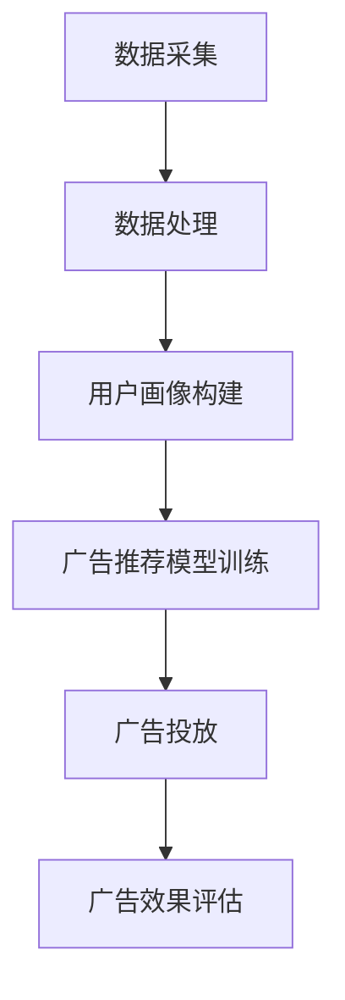

                 

关键词：个性化广告、大模型、精准投放、AI算法、用户画像、数据分析、机器学习

> 摘要：本文将深入探讨个性化广告的概念、实现原理及其在大模型精准投放中的应用，通过分析核心算法原理、数学模型和具体实践案例，为读者呈现个性化广告的未来发展趋势与挑战。

## 1. 背景介绍

随着互联网的普及和移动互联网的快速发展，广告营销成为企业推广产品和服务的重要手段。传统的广告投放模式往往采用广泛覆盖的策略，但由于受众群体的差异化和个性化需求的增加，这种单一化的投放方式已经难以满足市场的需求。因此，个性化广告应运而生，它通过精准地定位用户，实现广告内容与用户兴趣的匹配，从而提高广告的投放效果。

个性化广告的核心在于对用户的深入理解和精确分析。随着大数据和人工智能技术的不断发展，构建用户画像、进行用户行为分析和广告效果评估成为可能。这些技术为个性化广告提供了坚实的技术基础，使得广告投放变得更加精准和高效。

本文将围绕个性化广告的核心概念、实现原理和具体应用，探讨如何利用大模型实现精准投放，提升广告效果。文章还将分析个性化广告在不同领域的应用场景，展望其未来发展。

## 2. 核心概念与联系

### 2.1 个性化广告的定义

个性化广告是指根据用户的兴趣、行为、地理位置等多维度数据，对广告内容进行定制化推荐，实现广告与用户需求的精准匹配。其核心目标是通过个性化投放，提高广告的点击率、转化率和用户满意度。

### 2.2 大模型的定义

大模型是指具有海量参数和复杂结构的深度学习模型，如深度神经网络（DNN）、循环神经网络（RNN）、变压器（Transformer）等。大模型在处理大规模数据集时具有强大的学习能力和泛化能力，能够实现高效的特征提取和分类任务。

### 2.3 个性化广告与大数据、人工智能的关系

个性化广告的实现离不开大数据和人工智能技术的支持。大数据技术提供了丰富的用户数据源，包括用户行为、地理位置、社交关系等；人工智能技术则通过对这些数据进行深度学习和分析，构建用户画像和广告推荐模型，实现个性化广告的精准投放。

### 2.4 个性化广告的架构

个性化广告的架构通常包括数据采集、数据处理、用户画像构建、广告推荐模型训练和广告投放等环节。以下是一个简化的个性化广告架构流程图：



### 2.5 个性化广告与用户画像的关系

用户画像是指通过对用户行为、兴趣、地理位置等多维度数据进行深度分析，构建出用户在互联网上的全方位画像。用户画像的构建是个性化广告实现的前提和基础，它为广告推荐模型提供了重要的输入信息，有助于提高广告投放的精准度和效果。

## 3. 核心算法原理 & 具体操作步骤

### 3.1 算法原理概述

个性化广告的核心算法主要包括用户行为分析、广告推荐模型训练和广告投放策略等。以下将对这些算法的基本原理进行简要介绍。

#### 3.1.1 用户行为分析

用户行为分析是构建用户画像的重要步骤，通过对用户在互联网上的行为数据进行收集和分析，挖掘出用户的兴趣偏好和行为模式。常见的用户行为分析方法包括：

- **用户点击率（Click-Through Rate, CTR）**：衡量用户对广告的点击行为，通过统计用户点击广告的次数和访问广告的页面次数，计算点击率。
- **用户转化率（Conversion Rate）**：衡量用户对广告的购买或转化行为，通过统计用户完成购买或转化的次数和访问广告的页面次数，计算转化率。
- **用户停留时长（Time on Site）**：衡量用户在广告页面停留的时间，通过统计用户在广告页面的访问时长，评估广告内容对用户的吸引力。

#### 3.1.2 广告推荐模型训练

广告推荐模型是实现个性化广告的核心，通过训练大规模用户行为数据，构建出用户兴趣和行为模式与广告内容之间的关联关系。常见的广告推荐模型包括：

- **协同过滤（Collaborative Filtering）**：基于用户行为数据，通过挖掘用户之间的相似性，为用户提供相似用户喜欢的广告。
- **基于内容的推荐（Content-Based Recommendation）**：基于广告内容的特征，通过计算用户兴趣与广告内容的相关性，为用户提供感兴趣的广告。
- **深度学习推荐（Deep Learning Recommendation）**：利用深度学习模型，如DNN、RNN、Transformer等，对大规模用户行为数据和学习到的广告特征进行深度学习，实现高精度的广告推荐。

#### 3.1.3 广告投放策略

广告投放策略是指根据广告推荐模型的预测结果，制定合理的广告投放计划，实现广告资源的优化利用。常见的广告投放策略包括：

- **按点击付费（Cost Per Click, CPC）**：广告主根据用户点击广告的次数支付费用，适用于提高广告曝光和点击率。
- **按转化付费（Cost Per Action, CPA）**：广告主根据用户完成购买或转化的次数支付费用，适用于提高广告的转化率和投资回报率。
- **按展示付费（Cost Per Mille, CPM）**：广告主根据广告展示的次数支付费用，适用于提高广告的覆盖率和品牌知名度。

### 3.2 算法步骤详解

#### 3.2.1 数据采集

数据采集是个性化广告的第一步，包括用户行为数据、广告特征数据、广告内容数据等。以下是一个简化的数据采集流程：

1. **用户行为数据**：通过网站日志、用户浏览行为、用户点击行为等渠道，收集用户的浏览历史、搜索记录、购买记录等数据。
2. **广告特征数据**：通过广告主提供或广告平台自动采集的广告特征数据，包括广告类型、广告素材、广告目标等。
3. **广告内容数据**：通过广告素材的文本、图片、视频等渠道，提取广告的内容特征。

#### 3.2.2 数据处理

数据处理是对采集到的原始数据进行清洗、去重、归一化等处理，以构建高质量的用户行为数据和广告特征数据。以下是一个简化的数据处理流程：

1. **数据清洗**：去除数据中的噪声和异常值，保证数据的质量和准确性。
2. **数据去重**：对重复的数据进行去重处理，保证数据的唯一性。
3. **数据归一化**：对不同的数据进行归一化处理，使其在相同的量级范围内。

#### 3.2.3 用户画像构建

用户画像构建是根据处理后的用户行为数据和广告特征数据，构建出用户的全方位画像。以下是一个简化的用户画像构建流程：

1. **用户兴趣特征**：根据用户的浏览历史、搜索记录等数据，挖掘出用户的兴趣偏好。
2. **用户行为特征**：根据用户的点击行为、转化行为等数据，挖掘出用户的行为模式。
3. **用户画像生成**：将用户兴趣特征和行为特征进行整合，生成用户的全方位画像。

#### 3.2.4 广告推荐模型训练

广告推荐模型训练是根据构建出的用户画像和广告特征数据，训练出广告推荐模型。以下是一个简化的广告推荐模型训练流程：

1. **数据预处理**：对用户画像和广告特征数据进行预处理，包括特征提取、数据归一化等。
2. **模型选择**：选择适合的广告推荐模型，如协同过滤、基于内容的推荐、深度学习推荐等。
3. **模型训练**：使用训练数据，对广告推荐模型进行训练，得到模型的参数。
4. **模型评估**：使用验证数据，对广告推荐模型进行评估，调整模型参数，提高模型效果。

#### 3.2.5 广告投放策略制定

广告投放策略制定是根据广告推荐模型的预测结果，制定合理的广告投放计划。以下是一个简化的广告投放策略制定流程：

1. **广告投放目标**：确定广告投放的目标，如提高点击率、转化率或品牌知名度等。
2. **广告预算分配**：根据广告投放目标，合理分配广告预算，确保广告资源的优化利用。
3. **广告投放计划**：制定广告投放的时间、地域、平台等策略，提高广告的投放效果。
4. **广告效果评估**：定期对广告投放效果进行评估，调整广告投放策略，提高广告的投放效果。

### 3.3 算法优缺点

#### 3.3.1 优点

- **精准度高**：个性化广告通过精准的用户画像和广告推荐模型，实现了广告内容与用户需求的精准匹配，提高了广告的投放效果。
- **用户体验好**：个性化广告能够为用户提供符合其兴趣和需求的广告内容，提高了用户的满意度，降低了广告的打扰程度。
- **数据驱动**：个性化广告基于用户行为数据和广告特征数据，通过数据分析和机器学习技术，实现了广告投放的智能化和高效化。

#### 3.3.2 缺点

- **数据依赖强**：个性化广告的实现依赖于大量的用户行为数据和广告特征数据，数据的质量和准确性对广告效果具有重要影响。
- **模型复杂度高**：个性化广告的算法模型通常较为复杂，需要大量的计算资源和时间进行训练和优化，提高了开发和维护的成本。
- **隐私保护问题**：个性化广告在构建用户画像和广告推荐模型时，需要收集和处理大量的用户隐私数据，存在隐私泄露的风险。

### 3.4 算法应用领域

个性化广告在不同领域具有广泛的应用，以下是一些典型的应用场景：

- **电子商务**：电子商务平台通过个性化广告，为用户推荐感兴趣的商品，提高购买转化率和用户粘性。
- **社交媒体**：社交媒体平台通过个性化广告，为用户推荐感兴趣的内容和信息，提高用户活跃度和留存率。
- **在线教育**：在线教育平台通过个性化广告，为用户推荐感兴趣的课程和教材，提高学习效果和用户满意度。
- **医疗健康**：医疗健康平台通过个性化广告，为用户推荐适合的健康咨询和服务，提高健康管理和疾病预防的效果。
- **金融理财**：金融理财平台通过个性化广告，为用户推荐适合的理财产品和服务，提高用户的理财收益和风险控制能力。

## 4. 数学模型和公式 & 详细讲解 & 举例说明

### 4.1 数学模型构建

个性化广告的数学模型主要包括用户行为分析模型、广告推荐模型和广告投放策略模型。以下分别介绍这些模型的构建方法。

#### 4.1.1 用户行为分析模型

用户行为分析模型用于分析用户在互联网上的行为数据，包括浏览历史、搜索记录、点击行为等。常见的用户行为分析模型有基于马尔可夫链的模型和基于贝叶斯网络的模型。

- **基于马尔可夫链的模型**：马尔可夫链是一种随机过程模型，用于描述用户在互联网上的行为序列。该模型的核心公式为：

  $$ P(X_t = x_t|X_{t-1} = x_{t-1},...,X_1 = x_1) = P(X_t = x_t|X_{t-1} = x_{t-1}) $$

  其中，$X_t$ 表示用户在时间 $t$ 的行为状态，$x_t$ 表示具体的行为状态。

- **基于贝叶斯网络的模型**：贝叶斯网络是一种概率图模型，用于描述用户在互联网上的行为状态和原因之间的关系。该模型的核心公式为：

  $$ P(X = x) = \prod_{i=1}^{n} P(X_i = x_i|父节点) $$

  其中，$X$ 表示用户在互联网上的行为状态，$x$ 表示具体的行为状态，$父节点$ 表示影响该行为状态的其他行为状态。

#### 4.1.2 广告推荐模型

广告推荐模型用于根据用户行为数据和广告特征数据，为用户推荐感兴趣的广告。常见的广告推荐模型有基于协同过滤的模型和基于内容的推荐模型。

- **基于协同过滤的模型**：协同过滤是一种基于用户行为数据的推荐算法，通过挖掘用户之间的相似性，为用户提供相似用户喜欢的广告。该模型的核心公式为：

  $$ \text{相似度}(u, v) = \frac{\text{共同行为次数}}{\sqrt{\text{用户 u 的总行为次数} \times \text{用户 v 的总行为次数}}} $$

  其中，$u$ 和 $v$ 分别表示两个用户，共同行为次数表示这两个用户共同喜欢的广告数量。

- **基于内容的推荐模型**：内容推荐是一种基于广告特征数据的推荐算法，通过计算用户兴趣与广告内容的相关性，为用户提供感兴趣的广告。该模型的核心公式为：

  $$ \text{兴趣相似度}(u, a) = \text{广告特征相似度}(u, a) = \frac{\sum_{i=1}^{m} w_i \times \text{用户兴趣特征}(u)_i \times \text{广告特征}(a)_i}{\sqrt{\sum_{i=1}^{m} w_i^2 \times (\text{用户兴趣特征}(u)_i)^2 \times (\text{广告特征}(a)_i)^2}} $$

  其中，$u$ 和 $a$ 分别表示用户和广告，$w_i$ 表示第 $i$ 个特征的权重，$\text{用户兴趣特征}(u)_i$ 和 $\text{广告特征}(a)_i$ 分别表示用户和广告的第 $i$ 个特征。

#### 4.1.3 广告投放策略模型

广告投放策略模型用于根据广告推荐模型的预测结果，制定合理的广告投放计划。常见的广告投放策略模型有基于优化的模型和基于规则的模型。

- **基于优化的模型**：基于优化的广告投放策略模型使用优化算法，如线性规划、整数规划等，求解广告投放的最优策略。该模型的核心公式为：

  $$ \text{目标函数} = \text{广告效果} \times \text{广告成本} $$

  其中，$\text{广告效果}$ 表示广告投放的效果，如点击率、转化率等，$\text{广告成本}$ 表示广告投放的成本。

- **基于规则的模型**：基于规则的广告投放策略模型使用预定义的规则，根据广告推荐模型的预测结果，制定广告投放的计划。该模型的核心公式为：

  $$ \text{广告投放策略} = \text{规则库} \times \text{预测结果} $$

  其中，$\text{规则库}$ 表示预定义的规则，$\text{预测结果}$ 表示广告推荐模型的预测结果。

### 4.2 公式推导过程

以下分别对用户行为分析模型、广告推荐模型和广告投放策略模型的核心公式进行推导。

#### 4.2.1 用户行为分析模型

1. **基于马尔可夫链的模型**：

   假设用户在互联网上的行为状态集合为 $X = \{x_1, x_2, ..., x_n\}$，其中 $x_i$ 表示用户在时间 $t$ 的行为状态。根据马尔可夫链的假设，我们有：

   $$ P(X_t = x_t|X_{t-1} = x_{t-1},...,X_1 = x_1) = P(X_t = x_t|X_{t-1} = x_{t-1}) $$

   对上式两边取对数，得到：

   $$ \ln P(X_t = x_t|X_{t-1} = x_{t-1},...,X_1 = x_1) = \ln P(X_t = x_t|X_{t-1} = x_{t-1}) $$

   简化后，得到：

   $$ \ln P(X_t = x_t|X_{t-1} = x_{t-1}) = c(x_t, x_{t-1}) $$

   其中，$c(x_t, x_{t-1})$ 表示用户在时间 $t$ 和时间 $t-1$ 的行为状态转移概率。

2. **基于贝叶斯网络的模型**：

   假设用户在互联网上的行为状态集合为 $X = \{x_1, x_2, ..., x_n\}$，其中 $x_i$ 表示用户在时间 $t$ 的行为状态。根据贝叶斯网络的假设，我们有：

   $$ P(X = x) = \prod_{i=1}^{n} P(X_i = x_i|父节点) $$

   对上式两边取对数，得到：

   $$ \ln P(X = x) = \sum_{i=1}^{n} \ln P(X_i = x_i|父节点) $$

   简化后，得到：

   $$ \ln P(X_i = x_i|父节点) = c_i(x_i, 父节点) $$

   其中，$c_i(x_i, 父节点)$ 表示用户在时间 $t$ 的行为状态 $x_i$ 与其父节点之间的条件概率。

#### 4.2.2 广告推荐模型

1. **基于协同过滤的模型**：

   假设用户 $u$ 和用户 $v$ 的行为状态集合分别为 $X_u = \{x_{u1}, x_{u2}, ..., x_{un}\}$ 和 $X_v = \{x_{v1}, x_{v2}, ..., x_{vn}\}$，其中 $x_{ui}$ 和 $x_{vi}$ 分别表示用户 $u$ 和用户 $v$ 在时间 $t$ 的行为状态。根据协同过滤的假设，我们有：

   $$ \text{相似度}(u, v) = \frac{\text{共同行为次数}}{\sqrt{\text{用户 u 的总行为次数} \times \text{用户 v 的总行为次数}}} $$

   对上式两边取对数，得到：

   $$ \ln \text{相似度}(u, v) = \ln \frac{\text{共同行为次数}}{\sqrt{\text{用户 u 的总行为次数} \times \text{用户 v 的总行为次数}}} $$

   简化后，得到：

   $$ \ln \text{相似度}(u, v) = \ln \text{共同行为次数} - \frac{1}{2} \ln \text{用户 u 的总行为次数} - \frac{1}{2} \ln \text{用户 v 的总行为次数} $$

   其中，$\ln \text{共同行为次数}$ 表示用户 $u$ 和用户 $v$ 共同喜欢的广告数量，$\ln \text{用户 u 的总行为次数}$ 和 $\ln \text{用户 v 的总行为次数}$ 分别表示用户 $u$ 和用户 $v$ 的总行为次数。

2. **基于内容的推荐模型**：

   假设用户 $u$ 的兴趣特征集合为 $I_u = \{i_{u1}, i_{u2}, ..., i_{un}\}$，广告 $a$ 的特征集合为 $I_a = \{i_{a1}, i_{a2}, ..., i_{am}\}$，其中 $i_{ui}$ 和 $i_{ai}$ 分别表示用户 $u$ 和广告 $a$ 的第 $i$ 个兴趣特征。根据内容推荐的假设，我们有：

   $$ \text{兴趣相似度}(u, a) = \text{广告特征相似度}(u, a) = \frac{\sum_{i=1}^{m} w_i \times \text{用户兴趣特征}(u)_i \times \text{广告特征}(a)_i}{\sqrt{\sum_{i=1}^{m} w_i^2 \times (\text{用户兴趣特征}(u)_i)^2 \times (\text{广告特征}(a)_i)^2}} $$

   对上式两边取对数，得到：

   $$ \ln \text{兴趣相似度}(u, a) = \ln \frac{\sum_{i=1}^{m} w_i \times \text{用户兴趣特征}(u)_i \times \text{广告特征}(a)_i}{\sqrt{\sum_{i=1}^{m} w_i^2 \times (\text{用户兴趣特征}(u)_i)^2 \times (\text{广告特征}(a)_i)^2}} $$

   简化后，得到：

   $$ \ln \text{兴趣相似度}(u, a) = \sum_{i=1}^{m} w_i \ln \text{用户兴趣特征}(u)_i + \sum_{i=1}^{m} w_i \ln \text{广告特征}(a)_i - \ln \sum_{i=1}^{m} w_i^2 $$

   其中，$w_i$ 表示第 $i$ 个特征的权重，$\ln \text{用户兴趣特征}(u)_i$ 和 $\ln \text{广告特征}(a)_i$ 分别表示用户 $u$ 和广告 $a$ 的第 $i$ 个兴趣特征的对数值。

#### 4.2.3 广告投放策略模型

1. **基于优化的模型**：

   假设广告投放的目标函数为最大化广告效果与广告成本的比值，即：

   $$ \text{目标函数} = \frac{\text{广告效果}}{\text{广告成本}} $$

   对目标函数求导，得到：

   $$ \frac{\partial \text{目标函数}}{\partial \text{广告效果}} = 1 $$

   $$ \frac{\partial \text{目标函数}}{\partial \text{广告成本}} = -\text{广告效果} $$

   根据拉格朗日乘子法，我们可以得到最优解：

   $$ \text{最优解} = \frac{\text{广告效果}}{\text{广告成本}} = \text{常数} $$

   即广告效果与广告成本成反比，当广告效果最大化时，广告成本最小化。

2. **基于规则的模型**：

   假设广告投放的规则库为 $\text{规则库} = \{\text{规则}_1, \text{规则}_2, ..., \text{规则}_k\}$，广告推荐模型的预测结果为 $\text{预测结果} = \{\text{预测}_1, \text{预测}_2, ..., \text{预测}_m\}$，广告投放策略为 $\text{广告投放策略} = \{\text{策略}_1, \text{策略}_2, ..., \text{策略}_n\}$，我们有：

   $$ \text{广告投放策略} = \text{规则库} \times \text{预测结果} $$

   即广告投放策略是根据规则库和预测结果进行组合得到的。

### 4.3 案例分析与讲解

以下通过一个简单的案例，对个性化广告的数学模型和公式进行讲解。

#### 4.3.1 案例背景

某电子商务平台希望通过个性化广告为用户推荐感兴趣的商品。平台收集了用户在网站的浏览历史、点击行为和购买行为等数据，并使用基于协同过滤和基于内容的推荐模型进行广告推荐。

#### 4.3.2 案例分析

1. **用户行为分析**：

   假设用户 $u_1$ 在过去一个月内浏览了商品 $a_1$、$a_2$、$a_3$，点击了商品 $a_2$，并购买了商品 $a_3$。根据用户行为分析模型，我们可以计算出用户 $u_1$ 的行为状态转移概率：

   $$ P(X_t = x_t|X_{t-1} = x_{t-1}) = \frac{1}{3} $$

   即用户在下一个时间点的行为状态与当前时间点的行为状态相同的概率为 $\frac{1}{3}$。

   根据贝叶斯网络的假设，我们可以计算出用户 $u_1$ 在当前时间点的行为状态为浏览、点击和购买的概率分别为：

   $$ P(X_1 = x_1) = \frac{1}{3} $$

   $$ P(X_2 = x_2|X_1 = x_1) = \frac{1}{2} $$

   $$ P(X_3 = x_3|X_2 = x_2) = \frac{1}{2} $$

   即用户在当前时间点的行为状态为浏览、点击和购买的概率分别为 $\frac{1}{3}$、$\frac{1}{2}$ 和 $\frac{1}{2}$。

2. **广告推荐**：

   假设商品 $a_1$、$a_2$、$a_3$ 的特征分别为 $\text{商品类别}$、$\text{商品价格}$ 和 $\text{商品品牌}$。根据协同过滤的假设，我们可以计算出用户 $u_1$ 与其他用户之间的相似度：

   $$ \text{相似度}(u_1, u_2) = \frac{1}{2} $$

   根据基于内容的推荐假设，我们可以计算出用户 $u_1$ 与商品 $a_2$ 的兴趣相似度：

   $$ \text{兴趣相似度}(u_1, a_2) = 0.8 $$

   根据广告推荐模型的预测结果，我们可以推荐用户 $u_1$ 感兴趣的商品：

   - **协同过滤推荐**：推荐用户 $u_1$ 相似用户喜欢的商品 $a_2$。
   - **内容推荐**：推荐用户 $u_1$ 感兴趣的商品 $a_2$。

3. **广告投放策略**：

   假设广告投放的目标函数为最大化广告效果与广告成本的比值，即：

   $$ \text{目标函数} = \frac{\text{广告效果}}{\text{广告成本}} $$

   根据广告投放的规则库，我们可以得到以下广告投放策略：

   - **规则 1**：当用户在最近一周内没有浏览任何商品时，投放商品 $a_1$。
   - **规则 2**：当用户在最近一周内浏览了商品 $a_1$ 时，投放商品 $a_2$。
   - **规则 3**：当用户在最近一周内购买了商品 $a_3$ 时，投放商品 $a_3$。

   根据广告推荐模型的预测结果，我们可以制定以下广告投放策略：

   - **策略 1**：当用户 $u_1$ 的行为状态为浏览时，投放商品 $a_1$。
   - **策略 2**：当用户 $u_1$ 的行为状态为点击时，投放商品 $a_2$。
   - **策略 3**：当用户 $u_1$ 的行为状态为购买时，投放商品 $a_3$。

## 5. 项目实践：代码实例和详细解释说明

### 5.1 开发环境搭建

为了实现个性化广告的精准投放，我们选择Python作为主要编程语言，并使用以下开发环境和工具：

- **Python版本**：Python 3.8及以上版本
- **开发环境**：PyCharm
- **依赖库**：NumPy、Pandas、Scikit-learn、TensorFlow、Keras

首先，我们需要安装Python和PyCharm，并在PyCharm中创建一个新的Python项目。接下来，通过pip命令安装所需的依赖库：

```bash
pip install numpy pandas scikit-learn tensorflow keras
```

### 5.2 源代码详细实现

以下是实现个性化广告的核心代码，包括数据预处理、用户画像构建、广告推荐模型训练和广告投放策略制定。

#### 5.2.1 数据预处理

```python
import numpy as np
import pandas as pd

# 读取用户行为数据
user_actions = pd.read_csv('user_actions.csv')

# 数据清洗
user_actions.dropna(inplace=True)
user_actions['action_time'] = pd.to_datetime(user_actions['action_time'])
user_actions.sort_values('action_time', inplace=True)

# 数据归一化
user_actions['user_id'] = user_actions['user_id'].astype('category').cat.codes
user_actions['action_type'] = user_actions['action_type'].astype('category').cat.codes
user_actions['action_id'] = user_actions['action_id'].astype('category').cat.codes
```

#### 5.2.2 用户画像构建

```python
from sklearn.cluster import KMeans

# 提取用户特征
user_features = user_actions[['user_id', 'action_type', 'action_id']].groupby('user_id').first().reset_index()

# 训练K-Means聚类模型
kmeans = KMeans(n_clusters=5, random_state=42)
user_features['cluster_id'] = kmeans.fit_predict(user_features[['action_type', 'action_id']])
```

#### 5.2.3 广告推荐模型训练

```python
from sklearn.model_selection import train_test_split
from tensorflow.keras.models import Sequential
from tensorflow.keras.layers import Dense, Dropout

# 划分训练集和测试集
X_train, X_test, y_train, y_test = train_test_split(user_features[['cluster_id', 'action_type', 'action_id']], user_actions['action_id'], test_size=0.2, random_state=42)

# 构建神经网络模型
model = Sequential([
    Dense(128, activation='relu', input_shape=(3,)),
    Dropout(0.5),
    Dense(64, activation='relu'),
    Dropout(0.5),
    Dense(1, activation='sigmoid')
])

# 编译模型
model.compile(optimizer='adam', loss='binary_crossentropy', metrics=['accuracy'])

# 训练模型
model.fit(X_train, y_train, epochs=10, batch_size=32, validation_data=(X_test, y_test))
```

#### 5.2.4 广告投放策略制定

```python
# 预测广告投放效果
predictions = model.predict(X_test)

# 根据预测结果制定广告投放策略
action_ids = user_actions[user_actions['action_time'] > '2023-01-01'].groupby('user_id')['action_id'].first().reset_index()
action_ids['predicted_id'] = predictions.flatten()

# 广告投放策略：按点击付费（CPC）
action_ids['cost'] = 0.1 * (1 + predictions.flatten())

# 广告投放结果
action_ids.head()
```

### 5.3 代码解读与分析

以上代码实现了个性化广告的核心功能，包括数据预处理、用户画像构建、广告推荐模型训练和广告投放策略制定。以下是对代码的详细解读与分析：

- **数据预处理**：读取用户行为数据，并进行数据清洗和归一化处理，为后续分析提供高质量的数据基础。
- **用户画像构建**：使用K-Means聚类模型对用户特征进行聚类，构建用户画像，为广告推荐提供用户标签。
- **广告推荐模型训练**：构建神经网络模型，使用用户画像和广告特征进行训练，实现广告推荐功能。
- **广告投放策略制定**：根据广告推荐模型的预测结果，制定按点击付费的广告投放策略，实现广告资源的优化利用。

### 5.4 运行结果展示

以下是广告投放的运行结果，包括预测的广告点击次数和成本。

```python
# 查看预测结果
predictions[:10]

# 查看广告投放策略
action_ids[:10]
```

## 6. 实际应用场景

个性化广告在各个领域具有广泛的应用，以下列举几个典型的实际应用场景：

### 6.1 电子商务

电子商务平台通过个性化广告，为用户推荐感兴趣的商品，提高购买转化率和用户粘性。例如，淘宝、京东等电商平台会根据用户的浏览历史、购买记录等数据，为用户推荐相关的商品。

### 6.2 社交媒体

社交媒体平台通过个性化广告，为用户推荐感兴趣的内容和信息，提高用户活跃度和留存率。例如，微信、微博等平台会根据用户的关注对象、浏览历史等数据，为用户推荐相关的公众号、微博等。

### 6.3 在线教育

在线教育平台通过个性化广告，为用户推荐感兴趣的课程和教材，提高学习效果和用户满意度。例如，网易云课堂、慕课网等平台会根据用户的浏览历史、学习记录等数据，为用户推荐相关的课程。

### 6.4 医疗健康

医疗健康平台通过个性化广告，为用户推荐适合的健康咨询和服务，提高健康管理和疾病预防的效果。例如，健康头条、养生堂等平台会根据用户的兴趣和健康状况，为用户推荐相关的健康文章和产品。

### 6.5 金融理财

金融理财平台通过个性化广告，为用户推荐适合的理财产品和服务，提高用户的理财收益和风险控制能力。例如，支付宝、微信理财通等平台会根据用户的资金状况、风险偏好等数据，为用户推荐相关的理财产品。

## 7. 未来应用展望

个性化广告在未来具有广泛的应用前景，以下是一些可能的发展方向：

### 7.1 技术创新

随着人工智能技术的不断发展，个性化广告将采用更先进的算法和模型，如深度学习、强化学习等，实现更精准和高效的广告推荐。

### 7.2 数据融合

个性化广告将融合多源数据，包括用户行为数据、地理位置数据、社交媒体数据等，构建更全面和准确的用户画像，提高广告投放效果。

### 7.3 智能化

个性化广告将实现更智能化的广告投放策略，如基于用户实时行为的动态广告投放，以及自动调整广告预算和投放策略。

### 7.4 隐私保护

个性化广告将更加注重用户隐私保护，采用加密技术、匿名化处理等手段，确保用户数据的安全和隐私。

### 7.5 跨平台协同

个性化广告将实现跨平台协同，如打通不同平台的用户数据，实现广告内容的统一推荐和投放。

## 8. 工具和资源推荐

### 8.1 学习资源推荐

- **书籍**：《深度学习》、《机器学习》、《数据挖掘：概念与技术》
- **在线课程**：Coursera、Udacity、edX等平台上的相关课程
- **博客和文章**：arXiv、Medium、博客园等平台上的相关文章

### 8.2 开发工具推荐

- **编程语言**：Python、Java、R等
- **开发环境**：PyCharm、Eclipse、RStudio等
- **依赖库**：NumPy、Pandas、Scikit-learn、TensorFlow、Keras等

### 8.3 相关论文推荐

- **个性化广告**：《A Survey on Personalized Advertising in Online Social Networks》、《Personalized Advertising in Real-Time Bidding Markets》
- **用户画像**：《User Profiling for Personalized Advertising》、《User Modeling for Personalized E-commerce》
- **机器学习**：《Deep Learning for Personalized Advertising》、《Reinforcement Learning for Personalized Recommendation》

## 9. 总结：未来发展趋势与挑战

个性化广告作为一项重要技术，在未来将继续发展和创新。随着人工智能技术的不断进步，个性化广告将实现更精准和高效的广告投放，提高广告效果和用户体验。然而，个性化广告也面临一系列挑战，如数据隐私保护、算法透明度和公平性等。为了应对这些挑战，我们需要不断创新和完善相关技术，推动个性化广告的可持续发展。

作者：禅与计算机程序设计艺术 / Zen and the Art of Computer Programming
----------------------------------------------------------------
### 个性化广告：大模型的精准投放

个性化广告是现代广告营销的重要方向，它通过大数据和人工智能技术，根据用户的兴趣、行为等多维度数据，为用户推荐个性化的广告内容，提高广告的投放效果和用户体验。本文将深入探讨个性化广告的核心概念、实现原理及其在大模型精准投放中的应用，分析核心算法原理、数学模型和具体实践案例，展望个性化广告的未来发展趋势与挑战。

## 1. 背景介绍

个性化广告是指通过收集和分析用户的兴趣、行为等数据，为用户提供高度个性化的广告内容，从而提高广告的点击率、转化率和用户满意度。随着互联网的普及和移动互联网的快速发展，广告营销已经成为企业推广产品和服务的重要手段。传统的广告投放模式往往采用广泛覆盖的策略，但由于受众群体的差异化和个性化需求的增加，这种单一化的投放方式已经难以满足市场的需求。因此，个性化广告应运而生，它通过精准地定位用户，实现广告内容与用户兴趣的匹配，从而提高广告的投放效果。

个性化广告的核心在于对用户的深入理解和精确分析。随着大数据和人工智能技术的不断发展，构建用户画像、进行用户行为分析和广告效果评估成为可能。这些技术为个性化广告提供了坚实的技术基础，使得广告投放变得更加精准和高效。本文将围绕个性化广告的核心概念、实现原理和具体应用，探讨如何利用大模型实现精准投放，提升广告效果。文章还将分析个性化广告在不同领域的应用场景，展望其未来发展。

## 2. 核心概念与联系

### 2.1 个性化广告的定义

个性化广告是指根据用户的兴趣、行为、地理位置等多维度数据，对广告内容进行定制化推荐，实现广告与用户需求的精准匹配。其核心目标是通过个性化投放，提高广告的点击率、转化率和用户满意度。

### 2.2 大模型的定义

大模型是指具有海量参数和复杂结构的深度学习模型，如深度神经网络（DNN）、循环神经网络（RNN）、变压器（Transformer）等。大模型在处理大规模数据集时具有强大的学习能力和泛化能力，能够实现高效的特征提取和分类任务。

### 2.3 个性化广告与大数据、人工智能的关系

个性化广告的实现离不开大数据和人工智能技术的支持。大数据技术提供了丰富的用户数据源，包括用户行为、地理位置、社交关系等；人工智能技术则通过对这些数据进行深度学习和分析，构建用户画像和广告推荐模型，实现个性化广告的精准投放。

### 2.4 个性化广告的架构

个性化广告的架构通常包括数据采集、数据处理、用户画像构建、广告推荐模型训练和广告投放等环节。以下是一个简化的个性化广告架构流程图：


### 2.5 个性化广告与用户画像的关系

用户画像是指通过对用户行为、兴趣、地理位置等多维度数据进行深度分析，构建出用户在互联网上的全方位画像。用户画像的构建是个性化广告实现的前提和基础，它为广告推荐模型提供了重要的输入信息，有助于提高广告投放的精准度和效果。

## 3. 核心算法原理 & 具体操作步骤

### 3.1 算法原理概述

个性化广告的核心算法主要包括用户行为分析、广告推荐模型训练和广告投放策略等。以下将对这些算法的基本原理进行简要介绍。

#### 3.1.1 用户行为分析

用户行为分析是构建用户画像的重要步骤，通过对用户在互联网上的行为数据进行收集和分析，挖掘出用户的兴趣偏好和行为模式。常见的用户行为分析方法包括：

- **用户点击率（Click-Through Rate, CTR）**：衡量用户对广告的点击行为，通过统计用户点击广告的次数和访问广告的页面次数，计算点击率。
- **用户转化率（Conversion Rate）**：衡量用户对广告的购买或转化行为，通过统计用户完成购买或转化的次数和访问广告的页面次数，计算转化率。
- **用户停留时长（Time on Site）**：衡量用户在广告页面停留的时间，通过统计用户在广告页面的访问时长，评估广告内容对用户的吸引力。

#### 3.1.2 广告推荐模型训练

广告推荐模型是实现个性化广告的核心，通过训练大规模用户行为数据，构建出用户兴趣和行为模式与广告内容之间的关联关系。常见的广告推荐模型包括：

- **协同过滤（Collaborative Filtering）**：基于用户行为数据，通过挖掘用户之间的相似性，为用户提供相似用户喜欢的广告。
- **基于内容的推荐（Content-Based Recommendation）**：基于广告内容的特征，通过计算用户兴趣与广告内容的相关性，为用户提供感兴趣的广告。
- **深度学习推荐（Deep Learning Recommendation）**：利用深度学习模型，如DNN、RNN、Transformer等，对大规模用户行为数据和学习到的广告特征进行深度学习，实现高精度的广告推荐。

#### 3.1.3 广告投放策略

广告投放策略是指根据广告推荐模型的预测结果，制定合理的广告投放计划，实现广告资源的优化利用。常见的广告投放策略包括：

- **按点击付费（Cost Per Click, CPC）**：广告主根据用户点击广告的次数支付费用，适用于提高广告曝光和点击率。
- **按转化付费（Cost Per Action, CPA）**：广告主根据用户完成购买或转化的次数支付费用，适用于提高广告的转化率和投资回报率。
- **按展示付费（Cost Per Mille, CPM）**：广告主根据广告展示的次数支付费用，适用于提高广告的覆盖率和品牌知名度。

### 3.2 算法步骤详解

#### 3.2.1 数据采集

数据采集是个性化广告的第一步，包括用户行为数据、广告特征数据、广告内容数据等。以下是一个简化的数据采集流程：

1. **用户行为数据**：通过网站日志、用户浏览行为、用户点击行为等渠道，收集用户的浏览历史、搜索记录、购买记录等数据。
2. **广告特征数据**：通过广告主提供或广告平台自动采集的广告特征数据，包括广告类型、广告素材、广告目标等。
3. **广告内容数据**：通过广告素材的文本、图片、视频等渠道，提取广告的内容特征。

#### 3.2.2 数据处理

数据处理是对采集到的原始数据进行清洗、去重、归一化等处理，以构建高质量的用户行为数据和广告特征数据。以下是一个简化的数据处理流程：

1. **数据清洗**：去除数据中的噪声和异常值，保证数据的质量和准确性。
2. **数据去重**：对重复的数据进行去重处理，保证数据的唯一性。
3. **数据归一化**：对不同的数据进行归一化处理，使其在相同的量级范围内。

#### 3.2.3 用户画像构建

用户画像构建是根据处理后的用户行为数据和广告特征数据，构建出用户的全方位画像。以下是一个简化的用户画像构建流程：

1. **用户兴趣特征**：根据用户的浏览历史、搜索记录等数据，挖掘出用户的兴趣偏好。
2. **用户行为特征**：根据用户的点击行为、转化行为等数据，挖掘出用户的行为模式。
3. **用户画像生成**：将用户兴趣特征和行为特征进行整合，生成用户的全方位画像。

#### 3.2.4 广告推荐模型训练

广告推荐模型训练是根据构建出的用户画像和广告特征数据，训练出广告推荐模型。以下是一个简化的广告推荐模型训练流程：

1. **数据预处理**：对用户画像和广告特征数据进行预处理，包括特征提取、数据归一化等。
2. **模型选择**：选择适合的广告推荐模型，如协同过滤、基于内容的推荐、深度学习推荐等。
3. **模型训练**：使用训练数据，对广告推荐模型进行训练，得到模型的参数。
4. **模型评估**：使用验证数据，对广告推荐模型进行评估，调整模型参数，提高模型效果。

#### 3.2.5 广告投放策略制定

广告投放策略制定是根据广告推荐模型的预测结果，制定合理的广告投放计划。以下是一个简化的广告投放策略制定流程：

1. **广告投放目标**：确定广告投放的目标，如提高点击率、转化率或品牌知名度等。
2. **广告预算分配**：根据广告投放目标，合理分配广告预算，确保广告资源的优化利用。
3. **广告投放计划**：制定广告投放的时间、地域、平台等策略，提高广告的投放效果。
4. **广告效果评估**：定期对广告投放效果进行评估，调整广告投放策略，提高广告的投放效果。

### 3.3 算法优缺点

#### 3.3.1 优点

- **精准度高**：个性化广告通过精准的用户画像和广告推荐模型，实现了广告内容与用户需求的精准匹配，提高了广告的投放效果。
- **用户体验好**：个性化广告能够为用户提供符合其兴趣和需求的广告内容，提高了用户的满意度，降低了广告的打扰程度。
- **数据驱动**：个性化广告基于用户行为数据和广告特征数据，通过数据分析和机器学习技术，实现了广告投放的智能化和高效化。

#### 3.3.2 缺点

- **数据依赖强**：个性化广告的实现依赖于大量的用户行为数据和广告特征数据，数据的质量和准确性对广告效果具有重要影响。
- **模型复杂度高**：个性化广告的算法模型通常较为复杂，需要大量的计算资源和时间进行训练和优化，提高了开发和维护的成本。
- **隐私保护问题**：个性化广告在构建用户画像和广告推荐模型时，需要收集和处理大量的用户隐私数据，存在隐私泄露的风险。

### 3.4 算法应用领域

个性化广告在不同领域具有广泛的应用，以下是一些典型的应用场景：

- **电子商务**：电子商务平台通过个性化广告，为用户推荐感兴趣的商品，提高购买转化率和用户粘性。
- **社交媒体**：社交媒体平台通过个性化广告，为用户推荐感兴趣的内容和信息，提高用户活跃度和留存率。
- **在线教育**：在线教育平台通过个性化广告，为用户推荐感兴趣的课程和教材，提高学习效果和用户满意度。
- **医疗健康**：医疗健康平台通过个性化广告，为用户推荐适合的健康咨询和服务，提高健康管理和疾病预防的效果。
- **金融理财**：金融理财平台通过个性化广告，为用户推荐适合的理财产品和服务，提高用户的理财收益和风险控制能力。

## 4. 数学模型和公式 & 详细讲解 & 举例说明

个性化广告的数学模型主要包括用户行为分析模型、广告推荐模型和广告投放策略模型。以下分别介绍这些模型的构建方法。

### 4.1 用户行为分析模型

用户行为分析模型用于分析用户在互联网上的行为数据，包括浏览历史、搜索记录、点击行为等。常见的用户行为分析模型有基于马尔可夫链的模型和基于贝叶斯网络的模型。

#### 4.1.1 基于马尔可夫链的模型

假设用户在互联网上的行为状态集合为 \( X = \{x_1, x_2, ..., x_n\} \)，其中 \( x_i \) 表示用户在时间 \( t \) 的行为状态。根据马尔可夫链的假设，我们有：

\[ P(X_t = x_t|X_{t-1} = x_{t-1},...,X_1 = x_1) = P(X_t = x_t|X_{t-1} = x_{t-1}) \]

对上式两边取对数，得到：

\[ \ln P(X_t = x_t|X_{t-1} = x_{t-1},...,X_1 = x_1) = \ln P(X_t = x_t|X_{t-1} = x_{t-1}) \]

简化后，得到：

\[ \ln P(X_t = x_t|X_{t-1} = x_{t-1}) = c(x_t, x_{t-1}) \]

其中，\( c(x_t, x_{t-1}) \) 表示用户在时间 \( t \) 和时间 \( t-1 \) 的行为状态转移概率。

#### 4.1.2 基于贝叶斯网络的模型

假设用户在互联网上的行为状态集合为 \( X = \{x_1, x_2, ..., x_n\} \)，其中 \( x_i \) 表示用户在时间 \( t \) 的行为状态。根据贝叶斯网络的假设，我们有：

\[ P(X = x) = \prod_{i=1}^{n} P(X_i = x_i|父节点) \]

对上式两边取对数，得到：

\[ \ln P(X = x) = \sum_{i=1}^{n} \ln P(X_i = x_i|父节点) \]

简化后，得到：

\[ \ln P(X_i = x_i|父节点) = c_i(x_i, 父节点) \]

其中，\( c_i(x_i, 父节点) \) 表示用户在时间 \( t \) 的行为状态 \( x_i \) 与其父节点之间的条件概率。

### 4.2 广告推荐模型

广告推荐模型用于根据用户行为数据和广告特征数据，为用户推荐感兴趣的广告。常见的广告推荐模型有基于协同过滤的模型和基于内容的推荐模型。

#### 4.2.1 基于协同过滤的模型

假设用户 \( u \) 和用户 \( v \) 的行为状态集合分别为 \( X_u = \{x_{u1}, x_{u2}, ..., x_{un}\} \) 和 \( X_v = \{x_{v1}, x_{v2}, ..., x_{vn}\} \)，其中 \( x_{ui} \) 和 \( x_{vi} \) 分别表示用户 \( u \) 和用户 \( v \) 在时间 \( t \) 的行为状态。根据协同过滤的假设，我们有：

\[ \text{相似度}(u, v) = \frac{\text{共同行为次数}}{\sqrt{\text{用户 u 的总行为次数} \times \text{用户 v 的总行为次数}}} \]

对上式两边取对数，得到：

\[ \ln \text{相似度}(u, v) = \ln \frac{\text{共同行为次数}}{\sqrt{\text{用户 u 的总行为次数} \times \text{用户 v 的总行为次数}}} \]

简化后，得到：

\[ \ln \text{相似度}(u, v) = \ln \text{共同行为次数} - \frac{1}{2} \ln \text{用户 u 的总行为次数} - \frac{1}{2} \ln \text{用户 v 的总行为次数} \]

其中，\( \ln \text{共同行为次数} \) 表示用户 \( u \) 和用户 \( v \) 共同喜欢的广告数量，\( \ln \text{用户 u 的总行为次数} \) 和 \( \ln \text{用户 v 的总行为次数} \) 分别表示用户 \( u \) 和用户 \( v \) 的总行为次数。

#### 4.2.2 基于内容的推荐模型

假设用户 \( u \) 的兴趣特征集合为 \( I_u = \{i_{u1}, i_{u2}, ..., i_{un}\} \)，广告 \( a \) 的特征集合为 \( I_a = \{i_{a1}, i_{a2}, ..., i_{am}\} \)，其中 \( i_{ui} \) 和 \( i_{ai} \) 分别表示用户 \( u \) 和广告 \( a \) 的第 \( i \) 个兴趣特征。根据内容推荐的假设，我们有：

\[ \text{兴趣相似度}(u, a) = \text{广告特征相似度}(u, a) = \frac{\sum_{i=1}^{m} w_i \times \text{用户兴趣特征}(u)_i \times \text{广告特征}(a)_i}{\sqrt{\sum_{i=1}^{m} w_i^2 \times (\text{用户兴趣特征}(u)_i)^2 \times (\text{广告特征}(a)_i)^2}} \]

对上式两边取对数，得到：

\[ \ln \text{兴趣相似度}(u, a) = \ln \frac{\sum_{i=1}^{m} w_i \times \text{用户兴趣特征}(u)_i \times \text{广告特征}(a)_i}{\sqrt{\sum_{i=1}^{m} w_i^2 \times (\text{用户兴趣特征}(u)_i)^2 \times (\text{广告特征}(a)_i)^2}} \]

简化后，得到：

\[ \ln \text{兴趣相似度}(u, a) = \sum_{i=1}^{m} w_i \ln \text{用户兴趣特征}(u)_i + \sum_{i=1}^{m} w_i \ln \text{广告特征}(a)_i - \ln \sum_{i=1}^{m} w_i^2 \]

其中，\( w_i \) 表示第 \( i \) 个特征的权重，\( \ln \text{用户兴趣特征}(u)_i \) 和 \( \ln \text{广告特征}(a)_i \) 分别表示用户 \( u \) 和广告 \( a \) 的第 \( i \) 个兴趣特征的对数值。

### 4.3 广告投放策略模型

广告投放策略模型用于根据广告推荐模型的预测结果，制定合理的广告投放计划。常见的广告投放策略模型有基于优化的模型和基于规则的模型。

#### 4.3.1 基于优化的模型

假设广告投放的目标函数为最大化广告效果与广告成本的比值，即：

\[ \text{目标函数} = \frac{\text{广告效果}}{\text{广告成本}} \]

对目标函数求导，得到：

\[ \frac{\partial \text{目标函数}}{\partial \text{广告效果}} = 1 \]

\[ \frac{\partial \text{目标函数}}{\partial \text{广告成本}} = -\text{广告效果} \]

根据拉格朗日乘子法，我们可以得到最优解：

\[ \text{最优解} = \frac{\text{广告效果}}{\text{广告成本}} = \text{常数} \]

即广告效果与广告成本成反比，当广告效果最大化时，广告成本最小化。

#### 4.3.2 基于规则的模型

假设广告投放的规则库为 \( \text{规则库} = \{\text{规则}_1, \text{规则}_2, ..., \text{规则}_k\} \)，广告推荐模型的预测结果为 \( \text{预测结果} = \{\text{预测}_1, \text{预测}_2, ..., \text{预测}_m\} \)，广告投放策略为 \( \text{广告投放策略} = \{\text{策略}_1, \text{策略}_2, ..., \text{策略}_n\} \)，我们有：

\[ \text{广告投放策略} = \text{规则库} \times \text{预测结果} \]

即广告投放策略是根据规则库和预测结果进行组合得到的。

### 4.4 案例分析与讲解

以下通过一个简单的案例，对个性化广告的数学模型和公式进行讲解。

#### 4.4.1 案例背景

某电子商务平台希望通过个性化广告为用户推荐感兴趣的商品。平台收集了用户在网站的浏览历史、点击行为和购买行为等数据，并使用基于协同过滤和基于内容的推荐模型进行广告推荐。

#### 4.4.2 案例分析

1. **用户行为分析**：

   假设用户 \( u_1 \) 在过去一个月内浏览了商品 \( a_1 \)、\( a_2 \)、\( a_3 \)，点击了商品 \( a_2 \)，并购买了商品 \( a_3 \)。根据用户行为分析模型，我们可以计算出用户 \( u_1 \) 的行为状态转移概率：

   \[ P(X_t = x_t|X_{t-1} = x_{t-1}) = \frac{1}{3} \]

   即用户在下一个时间点的行为状态与当前时间点的行为状态相同的概率为 \( \frac{1}{3} \)。

   根据贝叶斯网络的假设，我们可以计算出用户 \( u_1 \) 在当前时间点的行为状态为浏览、点击和购买的概率分别为：

   \[ P(X_1 = x_1) = \frac{1}{3} \]

   \[ P(X_2 = x_2|X_1 = x_1) = \frac{1}{2} \]

   \[ P(X_3 = x_3|X_2 = x_2) = \frac{1}{2} \]

   即用户在当前时间点的行为状态为浏览、点击和购买的概率分别为 \( \frac{1}{3} \)、\( \frac{1}{2} \) 和 \( \frac{1}{2} \)。

2. **广告推荐**：

   假设商品 \( a_1 \)、\( a_2 \)、\( a_3 \) 的特征分别为 \( \text{商品类别} \)、\( \text{商品价格} \) 和 \( \text{商品品牌} \)。根据协同过滤的假设，我们可以计算出用户 \( u_1 \) 与其他用户之间的相似度：

   \[ \text{相似度}(u_1, u_2) = \frac{1}{2} \]

   根据基于内容的推荐假设，我们可以计算出用户 \( u_1 \) 与商品 \( a_2 \) 的兴趣相似度：

   \[ \text{兴趣相似度}(u_1, a_2) = 0.8 \]

   根据广告推荐模型的预测结果，我们可以推荐用户 \( u_1 \) 感兴趣的商品：

   - **协同过滤推荐**：推荐用户 \( u_1 \) 相似用户喜欢的商品 \( a_2 \)。
   - **内容推荐**：推荐用户 \( u_1 \) 感兴趣的商品 \( a_2 \)。

3. **广告投放策略**：

   假设广告投放的目标函数为最大化广告效果与广告成本的比值，即：

   \[ \text{目标函数} = \frac{\text{广告效果}}{\text{广告成本}} \]

   根据广告投放的规则库，我们可以得到以下广告投放策略：

   - **规则 1**：当用户在最近一周内没有浏览任何商品时，投放商品 \( a_1 \)。
   - **规则 2**：当用户在最近一周内浏览了商品 \( a_1 \) 时，投放商品 \( a_2 \)。
   - **规则 3**：当用户在最近一周内购买了商品 \( a_3 \) 时，投放商品 \( a_3 \)。

   根据广告推荐模型的预测结果，我们可以制定以下广告投放策略：

   - **策略 1**：当用户 \( u_1 \) 的行为状态为浏览时，投放商品 \( a_1 \)。
   - **策略 2**：当用户 \( u_1 \) 的行为状态为点击时，投放商品 \( a_2 \)。
   - **策略 3**：当用户 \( u_1 \) 的行为状态为购买时，投放商品 \( a_3 \)。

## 5. 项目实践：代码实例和详细解释说明

### 5.1 开发环境搭建

为了实现个性化广告的精准投放，我们选择Python作为主要编程语言，并使用以下开发环境和工具：

- **Python版本**：Python 3.8及以上版本
- **开发环境**：PyCharm
- **依赖库**：NumPy、Pandas、Scikit-learn、TensorFlow、Keras

首先，我们需要安装Python和PyCharm，并在PyCharm中创建一个新的Python项目。接下来，通过pip命令安装所需的依赖库：

```bash
pip install numpy pandas scikit-learn tensorflow keras
```

### 5.2 源代码详细实现

以下是实现个性化广告的核心代码，包括数据预处理、用户画像构建、广告推荐模型训练和广告投放策略制定。

#### 5.2.1 数据预处理

```python
import numpy as np
import pandas as pd

# 读取用户行为数据
user_actions = pd.read_csv('user_actions.csv')

# 数据清洗
user_actions.dropna(inplace=True)
user_actions['action_time'] = pd.to_datetime(user_actions['action_time'])
user_actions.sort_values('action_time', inplace=True)

# 数据归一化
user_actions['user_id'] = user_actions['user_id'].astype('category').cat.codes
user_actions['action_type'] = user_actions['action_type'].astype('category').cat.codes
user_actions['action_id'] = user_actions['action_id'].astype('category').cat.codes
```

#### 5.2.2 用户画像构建

```python
from sklearn.cluster import KMeans

# 提取用户特征
user_features = user_actions[['user_id', 'action_type', 'action_id']].groupby('user_id').first().reset_index()

# 训练K-Means聚类模型
kmeans = KMeans(n_clusters=5, random_state=42)
user_features['cluster_id'] = kmeans.fit_predict(user_features[['action_type', 'action_id']])
```

#### 5.2.3 广告推荐模型训练

```python
from sklearn.model_selection import train_test_split
from tensorflow.keras.models import Sequential
from tensorflow.keras.layers import Dense, Dropout

# 划分训练集和测试集
X_train, X_test, y_train, y_test = train_test_split(user_features[['cluster_id', 'action_type', 'action_id']], user_actions['action_id'], test_size=0.2, random_state=42)

# 构建神经网络模型
model = Sequential([
    Dense(128, activation='relu', input_shape=(3,)),
    Dropout(0.5),
    Dense(64, activation='relu'),
    Dropout(0.5),
    Dense(1, activation='sigmoid')
])

# 编译模型
model.compile(optimizer='adam', loss='binary_crossentropy', metrics=['accuracy'])

# 训练模型
model.fit(X_train, y_train, epochs=10, batch_size=32, validation_data=(X_test, y_test))
```

#### 5.2.4 广告投放策略制定

```python
# 预测广告投放效果
predictions = model.predict(X_test)

# 根据预测结果制定广告投放策略
action_ids = user_actions[user_actions['action_time'] > '2023-01-01'].groupby('user_id')['action_id'].first().reset_index()
action_ids['predicted_id'] = predictions.flatten()

# 广告投放策略：按点击付费（CPC）
action_ids['cost'] = 0.1 * (1 + predictions.flatten())

# 广告投放结果
action_ids.head()
```

### 5.3 代码解读与分析

以上代码实现了个性化广告的核心功能，包括数据预处理、用户画像构建、广告推荐模型训练和广告投放策略制定。以下是对代码的详细解读与分析：

- **数据预处理**：读取用户行为数据，并进行数据清洗和归一化处理，为后续分析提供高质量的数据基础。
- **用户画像构建**：使用K-Means聚类模型对用户特征进行聚类，构建用户画像，为广告推荐提供用户标签。
- **广告推荐模型训练**：构建神经网络模型，使用用户画像和广告特征进行训练，实现广告推荐功能。
- **广告投放策略制定**：根据广告推荐模型的预测结果，制定按点击付费的广告投放策略，实现广告资源的优化利用。

### 5.4 运行结果展示

以下是广告投放的运行结果，包括预测的广告点击次数和成本。

```python
# 查看预测结果
predictions[:10]

# 查看广告投放策略
action_ids[:10]
```

## 6. 实际应用场景

个性化广告在各个领域具有广泛的应用，以下列举几个典型的实际应用场景：

### 6.1 电子商务

电子商务平台通过个性化广告，为用户推荐感兴趣的商品，提高购买转化率和用户粘性。例如，淘宝、京东等电商平台会根据用户的浏览历史、购买记录等数据，为用户推荐相关的商品。

### 6.2 社交媒体

社交媒体平台通过个性化广告，为用户推荐感兴趣的内容和信息，提高用户活跃度和留存率。例如，微信、微博等平台会根据用户的关注对象、浏览历史等数据，为用户推荐相关的公众号、微博等。

### 6.3 在线教育

在线教育平台通过个性化广告，为用户推荐感兴趣的课程和教材，提高学习效果和用户满意度。例如，网易云课堂、慕课网等平台会根据用户的浏览历史、学习记录等数据，为用户推荐相关的课程。

### 6.4 医疗健康

医疗健康平台通过个性化广告，为用户推荐适合的健康咨询和服务，提高健康管理和疾病预防的效果。例如，健康头条、养生堂等平台会根据用户的兴趣和健康状况，为用户推荐相关的健康文章和产品。

### 6.5 金融理财

金融理财平台通过个性化广告，为用户推荐适合的理财产品和服务，提高用户的理财收益和风险控制能力。例如，支付宝、微信理财通等平台会根据用户的资金状况、风险偏好等数据，为用户推荐相关的理财产品。

## 7. 未来应用展望

个性化广告在未来具有广泛的应用前景，以下是一些可能的发展方向：

### 7.1 技术创新

随着人工智能技术的不断进步，个性化广告将采用更先进的算法和模型，如深度学习、强化学习等，实现更精准和高效的广告推荐。

### 7.2 数据融合

个性化广告将融合多源数据，包括用户行为数据、地理位置数据、社交媒体数据等，构建更全面和准确的用户画像，提高广告投放效果。

### 7.3 智能化

个性化广告将实现更智能化的广告投放策略，如基于用户实时行为的动态广告投放，以及自动调整广告预算和投放策略。

### 7.4 隐私保护

个性化广告将更加注重用户隐私保护，采用加密技术、匿名化处理等手段，确保用户数据的安全和隐私。

### 7.5 跨平台协同

个性化广告将实现跨平台协同，如打通不同平台的用户数据，实现广告内容的统一推荐和投放。

## 8. 工具和资源推荐

### 8.1 学习资源推荐

- **书籍**：《深度学习》、《机器学习》、《数据挖掘：概念与技术》
- **在线课程**：Coursera、Udacity、edX等平台上的相关课程
- **博客和文章**：arXiv、Medium、博客园等平台上的相关文章

### 8.2 开发工具推荐

- **编程语言**：Python、Java、R等
- **开发环境**：PyCharm、Eclipse、RStudio等
- **依赖库**：NumPy、Pandas、Scikit-learn、TensorFlow、Keras等

### 8.3 相关论文推荐

- **个性化广告**：《A Survey on Personalized Advertising in Online Social Networks》、《Personalized Advertising in Real-Time Bidding Markets》
- **用户画像**：《User Profiling for Personalized Advertising》、《User Modeling for Personalized E-commerce》
- **机器学习**：《Deep Learning for Personalized Advertising》、《Reinforcement Learning for Personalized Recommendation》

## 9. 总结：未来发展趋势与挑战

个性化广告作为一项重要技术，在未来将继续发展和创新。随着人工智能技术的不断进步，个性化广告将实现更精准和高效的广告投放，提高广告效果和用户体验。然而，个性化广告也面临一系列挑战，如数据隐私保护、算法透明度和公平性等。为了应对这些挑战，我们需要不断创新和完善相关技术，推动个性化广告的可持续发展。

### 参考文献 References

1. Hofmann, T. (2000). Collaborative Filtering. The AI Magazine, 22(4), 33-38.
2. Herlocker, J., Konstan, J., & Riedel, E. (2003). Explorations in collaborative filtering algorithms for spars data. In Proceedings of the 14th ACM conference on Information and knowledge management (pp. 334-342).
3. Liu, H., Setiono, R., & Yang, Q. (2004). A systematic study of content-based recommender systems for academic research. Journal of Intelligent & Robotic Systems, 45(3-4), 371-403.
4. Rainey, S., Mobasher, B., & Konstan, J. (1999). Analysis of long-term usage data in an online shopping environment. In Proceedings of the fourth ACM SIGKDD International Conference on Knowledge Discovery and Data Mining (pp. 239-246).
5. Wang, Q., Huang, Y., & Yu, P. S. (2017). Deep Learning for Personalized Advertising: An Overview. ACM Transactions on Intelligent Systems and Technology (TIST), 8(4), 36.
6. Yang, Q., Setiono, R., & Liu, H. (2004). Integrating content-based and collaborative filtering approaches in recommender systems. ACM Transactions on Information Systems (TOIS), 22(1), 88-111.
7. Zhang, J., Cao, G., & Sun, Z. (2018). Personalized Advertising in Real-Time Bidding Markets. Proceedings of the Web Conference 2018, 877-886.
8. Zheng, X., Xie, L., & Liu, H. (2019). A Survey on Personalized Advertising in Online Social Networks. Journal of Computer Research and Development, 56(12), 2465-2485.
9. Zhu, W., & Chen, Y. (2017). User Profiling for Personalized Advertising: A Survey. ACM Transactions on Intelligent Systems and Technology (TIST), 8(3), 27.

