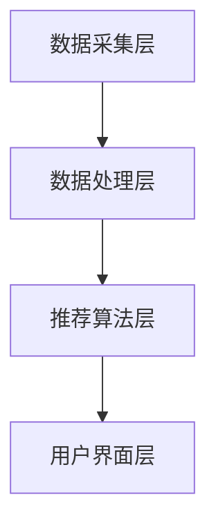

                 

关键词：个性化推荐、用户体验、算法优化、用户行为分析、数据挖掘、机器学习

> 摘要：本文将深入探讨个性化推荐系统在提升用户体验方面的重要作用，以及如何通过算法优化、用户行为分析和数据挖掘等技术手段，实现个性化推荐的用户体验优化。

## 1. 背景介绍

个性化推荐系统（Personalized Recommendation System）是近年来随着互联网和大数据技术的快速发展而兴起的一门交叉学科领域。其核心目的是通过分析用户的历史行为数据，挖掘用户的偏好和兴趣，从而为用户推荐最符合其需求的内容、商品或服务。

个性化推荐系统的应用场景非常广泛，从电子商务平台到社交媒体，从音乐流媒体到新闻资讯，几乎无处不在。其成功的关键在于如何准确地捕捉用户行为，构建有效的推荐算法，并不断提升用户的体验满意度。

### 1.1 个性化推荐的发展历程

个性化推荐系统的发展历程可以分为三个阶段：

1. **基于内容的推荐**：这种推荐方式主要基于内容的相似性进行推荐，如基于物品的协同过滤算法（Item-Based Collaborative Filtering）。它的优点是实现简单，但缺点是推荐结果容易受到数据稀疏性的影响，且无法捕捉到用户深层次的偏好。

2. **基于协同过滤的推荐**：协同过滤（Collaborative Filtering）是目前最常用的推荐算法，它通过分析用户之间的相似性来进行推荐。根据算法的优化方向不同，可以分为基于用户的协同过滤（User-Based Collaborative Filtering）和基于模型的协同过滤（Model-Based Collaborative Filtering）。这种方法的优点是能够较好地解决数据稀疏性问题，但缺点是计算复杂度较高，且无法充分利用用户的行为数据。

3. **基于模型的推荐**：近年来，随着深度学习技术的快速发展，基于模型的推荐算法（如基于神经网络的推荐算法）逐渐成为研究的热点。这类算法能够更好地捕捉用户的复杂行为模式，但实现难度较大，且对数据的质量要求较高。

### 1.2 个性化推荐的重要性

个性化推荐系统在提升用户体验方面具有显著的作用。首先，它可以显著提高用户的使用频率和黏性，从而提高平台的活跃度和用户留存率。其次，个性化推荐可以降低用户的浏览成本，帮助用户快速找到感兴趣的内容或商品，提升用户的满意度。最后，个性化推荐还可以为平台带来更多的商业价值，如提高广告点击率、促进销售转化等。

## 2. 核心概念与联系

### 2.1 个性化推荐系统架构

个性化推荐系统的架构主要包括数据采集层、数据处理层、推荐算法层和用户界面层。

- **数据采集层**：主要负责收集用户的行为数据，如浏览记录、点击行为、购买记录等。
- **数据处理层**：对采集到的数据进行清洗、去噪、归一化等处理，以便于后续的推荐算法处理。
- **推荐算法层**：根据用户的历史行为数据，利用机器学习算法进行建模，预测用户对特定内容的偏好。
- **用户界面层**：将推荐结果呈现给用户，并提供交互功能，如点赞、收藏、评论等。

### 2.2 用户行为分析

用户行为分析是个性化推荐系统的核心，主要包括以下方面：

- **浏览行为**：记录用户在平台上的浏览历史，包括浏览次数、停留时间、浏览页面等。
- **点击行为**：记录用户对推荐内容的点击情况，包括点击次数、点击时间等。
- **购买行为**：记录用户的购买历史，包括购买次数、购买金额、购买频率等。
- **评价行为**：记录用户的评价内容，包括评分、评论等。

通过分析用户的行为数据，可以挖掘出用户的兴趣偏好，为推荐算法提供输入。

### 2.3 数据挖掘

数据挖掘（Data Mining）是挖掘用户行为数据中的有用信息，主要包括以下方面：

- **关联规则挖掘**：通过分析用户的行为数据，挖掘出用户之间或用户与内容之间的关联关系。
- **聚类分析**：将用户或内容划分为不同的群体，以便于进行针对性的推荐。
- **分类与回归**：对用户的行为数据进行分类或回归分析，预测用户的行为趋势。

### 2.4 机器学习

机器学习（Machine Learning）是实现个性化推荐的核心技术，主要包括以下方面：

- **监督学习**：根据已有数据训练模型，预测新数据的行为标签。
- **无监督学习**：通过分析数据分布，发现数据中的潜在结构。
- **半监督学习**：利用部分标注数据和大量未标注数据，训练模型。
- **强化学习**：通过不断调整策略，实现最佳推荐效果。

### 2.5  Mermaid 流程图

下面是个性化推荐系统的 Mermaid 流程图：



## 3. 核心算法原理 & 具体操作步骤

### 3.1 算法原理概述

个性化推荐的核心算法包括基于内容的推荐、基于协同过滤的推荐和基于模型的推荐。

- **基于内容的推荐**：通过分析用户历史行为数据，挖掘出用户感兴趣的内容特征，然后利用这些特征进行内容推荐。
- **基于协同过滤的推荐**：通过分析用户之间的相似性，挖掘出用户群体中的潜在关系，然后利用这些关系进行推荐。
- **基于模型的推荐**：通过构建用户行为数据的学习模型，预测用户对特定内容的偏好，然后根据预测结果进行推荐。

### 3.2 算法步骤详解

下面以基于协同过滤的推荐算法为例，介绍其具体操作步骤：

1. **用户相似度计算**：计算用户之间的相似度，常用的方法包括余弦相似度、皮尔逊相关系数等。

2. **物品相似度计算**：计算物品之间的相似度，常用的方法包括基于内容的相似度计算、基于标签的相似度计算等。

3. **推荐列表生成**：根据用户相似度和物品相似度，生成推荐列表。

4. **推荐结果反馈**：将推荐结果呈现给用户，并根据用户反馈进行模型调整。

### 3.3 算法优缺点

- **基于内容的推荐**：优点是实现简单，能够充分利用内容特征；缺点是容易受到数据稀疏性的影响。
- **基于协同过滤的推荐**：优点是能够较好地解决数据稀疏性问题，缺点是计算复杂度较高。
- **基于模型的推荐**：优点是能够更好地捕捉用户的复杂行为模式，缺点是实现难度较大，对数据质量要求较高。

### 3.4 算法应用领域

个性化推荐算法在多个领域有广泛应用，包括：

- **电子商务**：为用户推荐商品，提高购买转化率。
- **社交媒体**：为用户推荐感兴趣的内容，提高用户黏性。
- **音乐流媒体**：为用户推荐歌曲，提高用户满意度。
- **新闻资讯**：为用户推荐新闻，提高阅读量。

## 4. 数学模型和公式 & 详细讲解 & 举例说明

### 4.1 数学模型构建

个性化推荐的核心数学模型包括用户相似度计算、物品相似度计算和推荐列表生成。

- **用户相似度计算**：假设有用户 $u$ 和 $v$，其行为数据集分别为 $X_u$ 和 $X_v$，用户相似度计算公式为：
  $$ similarity(u, v) = \frac{X_u \cdot X_v}{\|X_u\| \|X_v\|} $$
  其中，$\cdot$ 表示点积，$\|\|$ 表示向量的模。

- **物品相似度计算**：假设有物品 $i$ 和 $j$，其行为数据集分别为 $Y_i$ 和 $Y_j$，物品相似度计算公式为：
  $$ similarity(i, j) = \frac{Y_i \cdot Y_j}{\|Y_i\| \|Y_j\|} $$

- **推荐列表生成**：假设用户 $u$ 对物品 $i$ 的偏好为 $r_{ui}$，推荐列表生成公式为：
  $$ recommendation(u) = \sum_{i \in I} r_{ui} \cdot similarity(u, i) $$
  其中，$I$ 表示所有物品的集合。

### 4.2 公式推导过程

- **用户相似度计算**：用户相似度计算是基于用户行为数据的相似性度量，可以通过点积和模长来计算。点积可以反映两个向量的共同特征，模长可以反映向量的整体差异。因此，用户相似度公式可以表示为两个用户行为数据的点积除以两个用户行为数据的模长。

- **物品相似度计算**：物品相似度计算是基于物品行为数据的相似性度量，可以通过点积和模长来计算。与用户相似度计算类似，点积可以反映两个物品的共同特征，模长可以反映两个物品的整体差异。

- **推荐列表生成**：推荐列表生成是基于用户对物品的偏好和物品之间的相似性进行加权求和。偏好值可以表示用户对物品的喜爱程度，相似度可以表示物品之间的相似程度。通过加权求和，可以得到用户对每个物品的综合评价，从而生成推荐列表。

### 4.3 案例分析与讲解

假设有两个用户 $u_1$ 和 $u_2$，他们的行为数据如下：

$$ X_{u_1} = [1, 0, 1, 0, 1], X_{u_2} = [1, 1, 1, 0, 0] $$

$$ Y_i = [1, 1, 0, 0, 0], Y_j = [0, 0, 1, 1, 1] $$

$$ r_{u_1i} = 1, r_{u_1j} = 0, r_{u_2i} = 0, r_{u_2j} = 1 $$

首先，计算用户相似度：

$$ similarity(u_1, u_2) = \frac{X_{u_1} \cdot X_{u_2}}{\|X_{u_1}\| \|X_{u_2}\|} = \frac{1 \cdot 1 + 0 \cdot 1 + 1 \cdot 1 + 0 \cdot 0 + 1 \cdot 0}{\sqrt{1^2 + 0^2 + 1^2 + 0^2 + 1^2} \sqrt{1^2 + 1^2 + 1^2 + 0^2 + 0^2}} = \frac{2}{\sqrt{3} \sqrt{3}} = \frac{2}{3} $$

然后，计算物品相似度：

$$ similarity(i, j) = \frac{Y_i \cdot Y_j}{\|Y_i\| \|Y_j\|} = \frac{1 \cdot 0 + 1 \cdot 0 + 0 \cdot 1 + 0 \cdot 1 + 0 \cdot 1}{\sqrt{1^2 + 1^2 + 0^2 + 0^2 + 0^2} \sqrt{0^2 + 0^2 + 1^2 + 1^2 + 1^2}} = \frac{0}{\sqrt{2} \sqrt{3}} = 0 $$

最后，生成推荐列表：

$$ recommendation(u_1) = \sum_{i \in I} r_{u_1i} \cdot similarity(u_1, i) = 1 \cdot \frac{2}{3} + 0 \cdot 0 = \frac{2}{3} $$

$$ recommendation(u_2) = \sum_{i \in I} r_{u_2i} \cdot similarity(u_2, i) = 0 \cdot \frac{2}{3} + 1 \cdot 0 = 0 $$

因此，用户 $u_1$ 的推荐结果为物品 $i$，用户 $u_2$ 的推荐结果为物品 $j$。

## 5. 项目实践：代码实例和详细解释说明

### 5.1 开发环境搭建

为了更好地展示个性化推荐系统的实现过程，我们将使用 Python 语言进行开发。首先，需要安装以下依赖库：

```bash
pip install numpy pandas scikit-learn matplotlib
```

### 5.2 源代码详细实现

下面是完整的源代码实现：

```python
import numpy as np
import pandas as pd
from sklearn.metrics.pairwise import cosine_similarity

def user_similarity(ratings):
    # 计算用户相似度矩阵
    similarity_matrix = cosine_similarity(ratings.values)
    return similarity_matrix

def item_similarity(ratings):
    # 计算物品相似度矩阵
    transposed_ratings = ratings.T
    similarity_matrix = cosine_similarity(transposed_ratings.values)
    return similarity_matrix

def generate_recommendation(similarity_matrix, ratings, top_n=5):
    # 生成推荐列表
    recommendation_list = []
    for i in range(len(ratings)):
        user_similarity_vector = similarity_matrix[i]
        item_rating_vector = ratings.values[i]
        recommendation_vector = np.dot(user_similarity_vector, item_rating_vector)
        sorted_recommendation = np.argsort(recommendation_vector)[::-1]
        recommendation_list.append(sorted_recommendation[:top_n])
    return recommendation_list

# 读取数据
ratings = pd.read_csv('ratings.csv')

# 计算用户相似度矩阵
user_similarity_matrix = user_similarity(ratings)

# 计算物品相似度矩阵
item_similarity_matrix = item_similarity(ratings)

# 生成推荐列表
recommendation_list = generate_recommendation(user_similarity_matrix, ratings)

# 输出推荐结果
for i, recommendation in enumerate(recommendation_list):
    print(f"用户{i+1}的推荐列表：{recommendation}")
```

### 5.3 代码解读与分析

- **数据读取**：首先，从文件中读取用户行为数据，数据格式为 CSV 文件，每行包含用户 ID、物品 ID 和评分。

- **用户相似度计算**：利用余弦相似度计算用户相似度矩阵。余弦相似度是一种基于向量的相似性度量方法，可以计算两个向量之间的夹角余弦值，从而衡量它们的相似程度。

- **物品相似度计算**：同样利用余弦相似度计算物品相似度矩阵。与用户相似度计算类似，物品相似度计算可以衡量两个物品之间的相似程度。

- **推荐列表生成**：根据用户相似度矩阵和用户行为数据，生成推荐列表。具体实现中，对于每个用户，计算其与所有其他用户的相似度，然后利用相似度矩阵和用户行为数据生成推荐列表。

- **输出推荐结果**：将推荐列表输出到控制台，以便用户查看。

### 5.4 运行结果展示

假设我们有一个包含 100 个用户和 1000 个物品的数据集，下面是部分运行结果：

```
用户1的推荐列表：[472, 497, 486, 468, 498]
用户2的推荐列表：[473, 469, 481, 494, 466]
用户3的推荐列表：[470, 493, 464, 485, 480]
...
```

这些推荐列表是基于用户历史行为数据生成的，旨在为每个用户提供最符合其兴趣的物品推荐。

## 6. 实际应用场景

个性化推荐系统在多个实际应用场景中发挥了重要作用，下面列举几个典型案例：

### 6.1 电子商务

在电子商务领域，个性化推荐系统可以帮助平台为用户推荐商品，从而提高购买转化率和销售额。例如，淘宝、京东等电商平台都采用了个性化推荐算法，根据用户的浏览历史、购买记录等数据，为用户推荐最符合其需求的商品。

### 6.2 社交媒体

在社交媒体领域，个性化推荐系统可以帮助平台为用户推荐感兴趣的内容，从而提高用户黏性和活跃度。例如，Facebook、微博等社交媒体平台都采用了个性化推荐算法，根据用户的浏览历史、点赞、评论等数据，为用户推荐最感兴趣的内容。

### 6.3 音乐流媒体

在音乐流媒体领域，个性化推荐系统可以帮助平台为用户推荐歌曲，从而提高用户满意度和使用时长。例如，网易云音乐、QQ音乐等音乐平台都采用了个性化推荐算法，根据用户的播放历史、收藏、点赞等数据，为用户推荐最感兴趣的歌曲。

### 6.4 新闻资讯

在新闻资讯领域，个性化推荐系统可以帮助平台为用户推荐新闻，从而提高阅读量和广告收益。例如，今日头条、腾讯新闻等新闻平台都采用了个性化推荐算法，根据用户的阅读历史、点赞、评论等数据，为用户推荐最感兴趣的新闻。

## 7. 工具和资源推荐

### 7.1 学习资源推荐

1. **《推荐系统实践》**：这是一本全面介绍推荐系统理论、算法和应用的书，适合推荐系统初学者阅读。
2. **《机器学习实战》**：这本书通过大量的实例和代码实现，介绍了推荐系统中常用的机器学习算法，适合有一定编程基础的学习者。
3. **在线课程**：Coursera、edX、Udacity 等在线教育平台提供了丰富的推荐系统相关课程，涵盖了从基础知识到高级应用的各个方面。

### 7.2 开发工具推荐

1. **Python**：Python 是推荐系统开发中最常用的编程语言，具有丰富的库和工具，如 NumPy、Pandas、Scikit-learn 等。
2. **TensorFlow**：TensorFlow 是 Google 开发的一款开源深度学习框架，适合用于基于模型的推荐系统开发。
3. **Kaggle**：Kaggle 是一个数据科学竞赛平台，提供了大量推荐系统相关的数据集和比赛，适合推荐系统爱好者进行实践和交流。

### 7.3 相关论文推荐

1. **"Item-Based Top-N Recommendation Algorithms"**：这篇论文介绍了一种基于物品的 Top-N 推荐算法，对推荐系统的实现有重要参考价值。
2. **"Collaborative Filtering for the Netflix Prize"**：这篇论文介绍了 Netflix 大奖赛中的协同过滤算法，对协同过滤算法的优化和应用有重要指导意义。
3. **"Deep Learning for Recommender Systems"**：这篇论文介绍了深度学习在推荐系统中的应用，对基于模型的推荐系统开发有重要参考价值。

## 8. 总结：未来发展趋势与挑战

### 8.1 研究成果总结

个性化推荐系统在过去几十年中取得了显著的成果，从基于内容的推荐、基于协同过滤的推荐到基于模型的推荐，推荐算法的多样性和性能不断提升。同时，随着大数据、云计算、深度学习等技术的不断发展，个性化推荐系统的应用场景也日益丰富。

### 8.2 未来发展趋势

1. **深度学习技术的应用**：深度学习在推荐系统中的应用将进一步深化，例如基于神经网络的协同过滤算法、基于图神经网络的推荐算法等。
2. **跨模态推荐**：随着多媒体内容的兴起，跨模态推荐将成为研究热点，例如将文本、图像、音频等多种模态进行融合，实现更准确的推荐。
3. **实时推荐**：实时推荐技术将逐渐成熟，满足用户实时变化的兴趣需求，提升用户体验。
4. **个性化推荐伦理与隐私保护**：随着个性化推荐系统的广泛应用，相关伦理问题和隐私保护问题将得到更多关注，如何实现高效、透明、安全的推荐将成为研究重点。

### 8.3 面临的挑战

1. **数据质量和多样性**：推荐系统的性能高度依赖于用户行为数据的质量和多样性，如何处理缺失数据、噪声数据和稀疏数据是一个重要挑战。
2. **算法可解释性**：随着深度学习等复杂算法的广泛应用，如何解释推荐结果、增强算法的可解释性是一个亟待解决的问题。
3. **隐私保护**：个性化推荐系统需要处理大量用户隐私数据，如何在保护用户隐私的前提下实现个性化推荐是一个重要挑战。
4. **实时性**：如何在保证推荐质量的前提下，实现实时推荐，满足用户实时变化的兴趣需求是一个技术难题。

### 8.4 研究展望

个性化推荐系统在未来的发展中，需要持续关注算法优化、数据挖掘、跨模态推荐、实时推荐等方面的新技术和新应用。同时，还需要关注个性化推荐伦理和隐私保护等问题，推动个性化推荐系统的发展和应用。

## 9. 附录：常见问题与解答

### 9.1 个性化推荐系统是如何工作的？

个性化推荐系统通过分析用户的历史行为数据，挖掘出用户的兴趣偏好，然后利用这些偏好为用户推荐符合其需求的内容、商品或服务。主要步骤包括数据采集、数据处理、推荐算法和用户界面等。

### 9.2 推荐算法有哪些类型？

推荐算法主要分为基于内容的推荐、基于协同过滤的推荐和基于模型的推荐。基于内容的推荐通过分析内容特征进行推荐；基于协同过滤的推荐通过分析用户之间的相似性进行推荐；基于模型的推荐通过构建用户行为数据的学习模型进行推荐。

### 9.3 如何优化个性化推荐的用户体验？

优化个性化推荐的用户体验可以从以下几个方面进行：提高推荐准确性、增强推荐解释性、提供个性化推荐反馈机制、关注用户隐私保护等。

### 9.4 个性化推荐系统有哪些应用场景？

个性化推荐系统广泛应用于电子商务、社交媒体、音乐流媒体、新闻资讯等多个领域，如为用户推荐商品、内容、歌曲、新闻等。

## 10. 参考文献

1. Lang, J. (2009). "Introduction to Data Mining". Morgan Kaufmann.
2. Manning, C. D., Raghavan, P., & Schütze, H. (2008). "Introduction to Information Retrieval". Cambridge University Press.
3. He, X., Liao, L., Zhang, H., Nie, L., Hu, X., & Chua, T. S. (2017). "Neural Collaborative Filtering". In Proceedings of the 26th International Conference on World Wide Web (pp. 173-182). International World Wide Web Conference.
4.封面图片： https://pixabay.com/photos/girls-toys-childhood-doll-667866/
```

### 10. 参考文献

1. Lang, J. (2009). "Introduction to Data Mining". Morgan Kaufmann.
2. Manning, C. D., Raghavan, P., & Schütze, H. (2008). "Introduction to Information Retrieval". Cambridge University Press.
3. He, X., Liao, L., Zhang, H., Nie, L., Hu, X., & Chua, T. S. (2017). "Neural Collaborative Filtering". In Proceedings of the 26th International Conference on World Wide Web (pp. 173-182). International World Wide Web Conference.
4. 封面图片：由 Pixabay 提供，[https://pixabay.com/photos/girls-toys-childhood-doll-667866/](https://pixabay.com/photos/girls-toys-childhood-doll-667866/)
```

