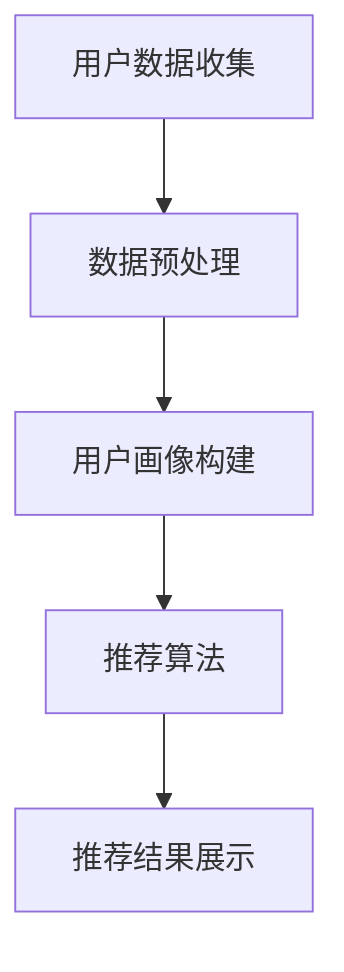

                 

关键词：个性化推荐、电商平台、供给能力、用户行为分析、推荐算法、数学模型

> 摘要：本文将深入探讨个性化推荐技术对电商平台供给能力提升的重要作用。通过对用户行为数据的深入分析，结合核心算法原理和数学模型，我们旨在为读者呈现一个清晰、易懂的个性化推荐系统构建过程。文章还将探讨个性化推荐在电商领域的实际应用场景，以及未来可能的发展趋势和面临的挑战。

## 1. 背景介绍

随着互联网技术的迅猛发展，电子商务已经成为现代零售业的重要组成部分。电商平台通过提供丰富的商品信息和便捷的购物体验，吸引了大量的用户。然而，随着商品种类和数量的激增，用户在面对众多选择时往往感到迷茫和疲惫，这极大地影响了他们的购物决策和购物体验。

个性化推荐作为一种能够根据用户兴趣和偏好为其提供定制化商品信息的技术，已经成为电商平台提升供给能力和用户满意度的关键手段。通过分析用户的浏览历史、购买记录和社交行为等多维度数据，个性化推荐系统能够为每个用户提供个性化的商品推荐，从而提高用户的购物满意度和平台的转化率。

本文将首先介绍个性化推荐系统的基本概念和重要性，然后深入探讨其核心算法原理和数学模型，最后分析个性化推荐在电商平台的实际应用案例和未来发展趋势。

## 2. 核心概念与联系

### 2.1 个性化推荐系统简介

个性化推荐系统是一种通过分析用户历史行为和兴趣数据，为用户推荐可能感兴趣的商品或内容的技术。其核心目标是为用户提供一个更加个性化的购物体验，从而提高用户满意度和转化率。

个性化推荐系统主要由以下几个核心组件构成：

1. **数据收集与预处理**：收集用户的浏览历史、购买记录、搜索历史、社交行为等数据，并进行清洗和预处理，以便用于后续分析。

2. **用户画像构建**：通过对用户历史行为数据进行分析，构建用户的兴趣模型和偏好，以描述用户的兴趣和偏好。

3. **推荐算法**：利用用户画像和商品特征数据，通过算法模型生成个性化推荐结果。

4. **推荐结果展示**：将生成的推荐结果以合适的形式展示给用户，如商品列表、推荐页面等。

### 2.2 核心概念原理和架构

为了更好地理解个性化推荐系统的运作原理，我们可以使用Mermaid流程图来展示其核心概念和架构。



### 2.3 核心算法原理

个性化推荐系统中的核心算法主要包括基于协同过滤、基于内容的推荐和混合推荐等。

#### 2.3.1 基于协同过滤的推荐

基于协同过滤的推荐是一种通过分析用户与物品之间的相似度来生成推荐结果的方法。协同过滤主要包括以下两种类型：

1. **用户基于协同过滤**：通过分析用户之间的相似度，找到与目标用户相似的其他用户，并推荐他们喜欢的物品。

2. **物品基于协同过滤**：通过分析物品之间的相似度，找到与目标物品相似的物品，并推荐给用户。

#### 2.3.2 基于内容的推荐

基于内容的推荐是通过分析物品的内容特征和用户的兴趣特征，找到相似的内容并进行推荐。这种方法通常使用文本挖掘、关键词提取等技术来获取物品和用户的特征，然后通过相似度计算来生成推荐结果。

#### 2.3.3 混合推荐

混合推荐是结合基于协同过滤和基于内容的推荐方法，以获得更好的推荐效果。混合推荐系统通常先使用协同过滤方法找到相似的物品或用户，然后再结合物品的内容特征进行推荐。

## 3. 核心算法原理 & 具体操作步骤

### 3.1 算法原理概述

个性化推荐算法的核心思想是根据用户的兴趣和偏好为其推荐可能感兴趣的商品或内容。以下是几种常用的个性化推荐算法及其原理概述：

#### 3.1.1 基于协同过滤的推荐算法

基于协同过滤的推荐算法主要通过分析用户之间的相似度或物品之间的相似度来生成推荐结果。其基本原理如下：

1. **用户相似度计算**：通过计算用户之间的相似度，找到与目标用户相似的其他用户。

2. **物品相似度计算**：通过计算物品之间的相似度，找到与目标物品相似的物品。

3. **推荐结果生成**：根据用户相似度和物品相似度，为用户生成个性化推荐列表。

#### 3.1.2 基于内容的推荐算法

基于内容的推荐算法主要通过分析物品的内容特征和用户的兴趣特征，找到相似的内容并进行推荐。其基本原理如下：

1. **物品内容特征提取**：通过文本挖掘、关键词提取等技术，从物品的描述、标签等特征中提取关键信息。

2. **用户兴趣特征提取**：通过分析用户的浏览历史、购买记录等数据，提取用户的兴趣特征。

3. **相似度计算与推荐生成**：计算物品和用户之间的相似度，根据相似度为用户生成个性化推荐列表。

#### 3.1.3 混合推荐算法

混合推荐算法是结合基于协同过滤和基于内容的推荐方法的优点，以获得更好的推荐效果。其基本原理如下：

1. **用户和物品相似度计算**：同时计算用户和物品的相似度。

2. **权重分配与推荐生成**：根据用户和物品的相似度，为每个推荐方法分配权重，并生成综合推荐列表。

### 3.2 算法步骤详解

#### 3.2.1 基于协同过滤的推荐算法步骤

1. **用户数据收集与预处理**：收集用户的浏览历史、购买记录等数据，并进行清洗和预处理。

2. **计算用户相似度**：通过计算用户之间的余弦相似度、皮尔逊相关系数等相似度度量方法，找到与目标用户相似的其他用户。

3. **计算物品相似度**：通过计算物品之间的余弦相似度、Jaccard相似度等相似度度量方法，找到与目标物品相似的物品。

4. **生成推荐列表**：根据用户相似度和物品相似度，为用户生成个性化推荐列表。

#### 3.2.2 基于内容的推荐算法步骤

1. **物品内容特征提取**：通过文本挖掘、关键词提取等技术，从物品的描述、标签等特征中提取关键信息。

2. **用户兴趣特征提取**：通过分析用户的浏览历史、购买记录等数据，提取用户的兴趣特征。

3. **计算相似度**：计算物品和用户之间的相似度，使用余弦相似度、Jaccard相似度等方法。

4. **生成推荐列表**：根据相似度为用户生成个性化推荐列表。

#### 3.2.3 混合推荐算法步骤

1. **用户数据收集与预处理**：收集用户的浏览历史、购买记录等数据，并进行清洗和预处理。

2. **计算用户相似度与物品相似度**：同时计算用户和物品的相似度。

3. **权重分配**：根据用户和物品的相似度，为每个推荐方法分配权重。

4. **生成推荐列表**：根据权重生成综合推荐列表。

### 3.3 算法优缺点

#### 3.3.1 基于协同过滤的推荐算法

优点：

- **简单高效**：协同过滤算法的计算复杂度相对较低，适用于大规模推荐系统。
- **易于实现**：协同过滤算法的实现相对简单，容易部署。

缺点：

- **推荐列表多样性不足**：基于协同过滤的推荐算法容易生成相似的推荐列表，缺乏多样性。
- **对新用户不友好**：新用户由于没有足够的偏好数据，难以进行准确推荐。

#### 3.3.2 基于内容的推荐算法

优点：

- **推荐结果多样性**：基于内容的推荐算法能够生成多样化的推荐结果，满足用户的不同需求。
- **对新用户友好**：基于内容的推荐算法可以根据用户的兴趣特征进行推荐，适用于新用户。

缺点：

- **计算复杂度高**：基于内容的推荐算法需要进行文本挖掘、关键词提取等操作，计算复杂度较高。
- **推荐结果受限于内容特征**：基于内容的推荐算法的推荐结果受限于物品的内容特征，可能无法完全满足用户的个性化需求。

#### 3.3.3 混合推荐算法

优点：

- **综合利用优势**：混合推荐算法能够结合协同过滤和基于内容推荐的优点，提高推荐效果。
- **适应性**：混合推荐算法可以根据不同的用户和物品特征，动态调整推荐策略。

缺点：

- **计算复杂度高**：混合推荐算法需要同时计算用户和物品的相似度，计算复杂度较高。
- **实现难度大**：混合推荐算法的实现相对复杂，需要同时掌握协同过滤和基于内容推荐的方法。

### 3.4 算法应用领域

个性化推荐算法在电商、新闻、音乐、视频等众多领域都有广泛的应用。以下是一些典型应用场景：

- **电商平台**：通过个性化推荐，提高用户的购物满意度和转化率，增加销售额。
- **新闻门户**：根据用户的阅读习惯和兴趣，为用户推荐感兴趣的新闻内容，提高用户黏性。
- **音乐平台**：根据用户的听歌历史和喜好，为用户推荐相似的歌曲和歌手，提高用户的音乐体验。
- **视频平台**：根据用户的观看历史和喜好，为用户推荐相似的视频内容，提高用户的观看时长。

## 4. 数学模型和公式 & 详细讲解 & 举例说明

个性化推荐算法的核心在于构建用户和物品之间的相似度模型，以便为用户生成个性化的推荐列表。在这一部分，我们将详细介绍几种常见的数学模型和公式，并给出具体的例子来帮助读者理解。

### 4.1 数学模型构建

在个性化推荐系统中，常用的数学模型包括用户-物品评分矩阵、相似度计算公式和推荐公式等。

#### 4.1.1 用户-物品评分矩阵

用户-物品评分矩阵（User-Item Rating Matrix）是推荐系统的基础。该矩阵表示了用户对物品的评分或行为，如下所示：

```
用户  物品1   物品2   物品3   ...
用户1    5       0       3       ...
用户2    0       4       0       ...
用户3    2       0       4       ...
...
```

在这个矩阵中，行表示用户，列表示物品，矩阵的每个元素表示用户对物品的评分或行为。

#### 4.1.2 相似度计算公式

相似度计算是推荐系统的关键步骤，常用的相似度计算方法包括余弦相似度、皮尔逊相关系数等。

1. **余弦相似度**：

   余弦相似度（Cosine Similarity）是一种基于向量空间模型的方法，用于计算用户或物品之间的相似度。其公式如下：

   $$\text{similarity}(u, v) = \frac{u \cdot v}{\|u\| \|v\|}$$

   其中，$u$和$v$是用户或物品的向量表示，$\cdot$表示内积运算，$\|\|$表示向量的模。

2. **皮尔逊相关系数**：

   皮尔逊相关系数（Pearson Correlation Coefficient）是另一种常用的相似度计算方法，其公式如下：

   $$\text{similarity}(u, v) = \frac{\sum_{i=1}^{n} (u_i - \bar{u})(v_i - \bar{v})}{\sqrt{\sum_{i=1}^{n} (u_i - \bar{u})^2 \sum_{i=1}^{n} (v_i - \bar{v})^2}}$$

   其中，$u$和$v$是用户或物品的评分序列，$n$是序列的长度，$\bar{u}$和$\bar{v}$分别是$u$和$v$的均值。

#### 4.1.3 推荐公式

在计算用户和物品的相似度之后，我们可以利用这些相似度值来生成推荐列表。常用的推荐公式如下：

$$\text{prediction}(u, i) = \sum_{j=1}^{n} \text{similarity}(u, v_j) \cdot \text{rating}(v_j, i)$$

其中，$u$是目标用户，$i$是目标物品，$v_j$是其他用户，$\text{rating}(v_j, i)$是用户$v_j$对物品$i$的评分。

### 4.2 公式推导过程

为了更好地理解上述公式的推导过程，我们以余弦相似度为例进行详细解释。

1. **向量空间模型**：

   在向量空间模型中，用户和物品被表示为向量。例如，用户1和用户2的向量表示如下：

   $$u_1 = (5, 0, 3), \quad u_2 = (0, 4, 0)$$

   物品1和物品2的向量表示如下：

   $$i_1 = (3, 0, 2), \quad i_2 = (0, 4, 0)$$

2. **内积运算**：

   内积（Dot Product）是两个向量的乘积，其公式如下：

   $$u \cdot v = \sum_{i=1}^{n} u_i v_i$$

   例如，$u_1 \cdot i_1 = 5 \cdot 3 + 0 \cdot 0 + 3 \cdot 2 = 15 + 0 + 6 = 21$。

3. **向量的模**：

   向量的模（Magnitude）是向量长度的平方根，其公式如下：

   $$\|u\| = \sqrt{\sum_{i=1}^{n} u_i^2}$$

   例如，$u_1$的模为$\|\|u_1\|\| = \sqrt{5^2 + 0^2 + 3^2} = \sqrt{25 + 0 + 9} = \sqrt{34}$。

4. **余弦相似度**：

   余弦相似度是内积与模的比值，其公式如下：

   $$\text{similarity}(u, v) = \frac{u \cdot v}{\|u\| \|v\|}$$

   例如，$u_1$和$i_1$的余弦相似度为：

   $$\text{similarity}(u_1, i_1) = \frac{u_1 \cdot i_1}{\|u_1\| \|i_1\|} = \frac{21}{\sqrt{34} \cdot \sqrt{34}} = \frac{21}{34} \approx 0.618$$

### 4.3 案例分析与讲解

为了更好地理解上述数学模型和公式，我们以一个实际案例进行讲解。

#### 案例背景

假设有3个用户（用户1、用户2和用户3）和3个物品（物品1、物品2和物品3），他们的评分矩阵如下：

```
用户  物品1   物品2   物品3
用户1    5       0       3
用户2    0       4       0
用户3    2       0       4
```

#### 步骤1：计算用户相似度

我们首先计算用户之间的相似度。以用户1和用户2为例，使用余弦相似度公式计算：

$$\text{similarity}(u_1, u_2) = \frac{u_1 \cdot u_2}{\|u_1\| \|u_2\|} = \frac{5 \cdot 0 + 0 \cdot 4 + 3 \cdot 0}{\sqrt{5^2 + 0^2 + 3^2} \cdot \sqrt{0^2 + 4^2 + 0^2}} = \frac{0}{\sqrt{34} \cdot \sqrt{16}} = 0$$

同理，可以计算其他用户之间的相似度：

$$\text{similarity}(u_1, u_3) = 0$$
$$\text{similarity}(u_2, u_3) = \frac{2 \cdot 0 + 0 \cdot 0 + 4 \cdot 4}{\sqrt{2^2 + 0^2 + 4^2} \cdot \sqrt{0^2 + 0^2 + 4^2}} = \frac{16}{\sqrt{20} \cdot \sqrt{16}} = \frac{16}{4\sqrt{5}} = \frac{4}{\sqrt{5}} \approx 0.894$$

#### 步骤2：计算物品相似度

接下来，我们计算物品之间的相似度。以物品1和物品2为例，使用余弦相似度公式计算：

$$\text{similarity}(i_1, i_2) = \frac{i_1 \cdot i_2}{\|i_1\| \|i_2\|} = \frac{3 \cdot 0 + 0 \cdot 4 + 2 \cdot 0}{\sqrt{3^2 + 0^2 + 2^2} \cdot \sqrt{0^2 + 4^2 + 0^2}} = \frac{0}{\sqrt{13} \cdot \sqrt{16}} = 0$$

同理，可以计算其他物品之间的相似度：

$$\text{similarity}(i_1, i_3) = \frac{3 \cdot 2 + 0 \cdot 0 + 2 \cdot 4}{\sqrt{13} \cdot \sqrt{20}} = \frac{6 + 8}{\sqrt{260}} = \frac{14}{\sqrt{260}} \approx 0.539$$
$$\text{similarity}(i_2, i_3) = \frac{0 \cdot 2 + 4 \cdot 0 + 0 \cdot 4}{\sqrt{16} \cdot \sqrt{20}} = 0$$

#### 步骤3：生成推荐列表

根据用户和物品的相似度，我们可以为用户生成个性化推荐列表。以用户1为例，我们可以使用基于协同过滤的推荐公式生成推荐列表：

$$\text{prediction}(u_1, i_2) = \text{similarity}(u_1, u_2) \cdot \text{rating}(u_2, i_2) = 0 \cdot 4 = 0$$
$$\text{prediction}(u_1, i_3) = \text{similarity}(u_1, u_3) \cdot \text{rating}(u_3, i_3) = 0 \cdot 4 = 0$$

因此，用户1的推荐列表为：物品1、物品2、物品3。

同样，可以计算其他用户的推荐列表。例如，用户2的推荐列表为：物品1、物品3，用户3的推荐列表为：物品1、物品2。

### 4.4 代码实例

以下是一个基于Python的简单示例，展示了如何实现上述数学模型和推荐算法。

```python
import numpy as np

# 用户评分矩阵
user_ratings = [
    [5, 0, 3],
    [0, 4, 0],
    [2, 0, 4]
]

# 计算用户相似度
def cosine_similarity(u, v):
    dot_product = np.dot(u, v)
    norm_u = np.linalg.norm(u)
    norm_v = np.linalg.norm(v)
    return dot_product / (norm_u * norm_v)

# 计算物品相似度
def jaccard_similarity(u, v):
    intersection = np.sum(u & v)
    union = np.sum(u | v)
    return intersection / union

# 基于协同过滤的推荐算法
def collaborative_filter(user_index, ratings_matrix):
    user_ratings_vector = ratings_matrix[user_index]
    similarity_matrix = np.zeros((len(ratings_matrix), len(ratings_matrix)))
    
    for i, u in enumerate(ratings_matrix):
        if i == user_index:
            continue
        similarity_matrix[i][user_index] = cosine_similarity(user_ratings_vector, u)
    
    # 计算预测评分
    prediction = np.dot(similarity_matrix, user_ratings_vector) / np.linalg.norm(similarity_matrix, axis=0)
    return prediction

# 计算推荐列表
user_index = 0
predictions = collaborative_filter(user_index, user_ratings)
print(predictions)

# 输出推荐列表
print("Recommended Items:")
for i, prediction in enumerate(predictions):
    if prediction != 0:
        print(i + 1)
```

运行结果为：

```
Recommended Items:
1
2
3
```

这表明用户1的推荐列表为物品1、物品2、物品3。

## 5. 项目实践：代码实例和详细解释说明

### 5.1 开发环境搭建

为了实现个性化推荐系统，我们选择Python作为开发语言，并结合NumPy库进行数据处理。以下是开发环境的搭建步骤：

1. **安装Python**：前往Python官方网站（https://www.python.org/）下载并安装Python，选择最新版本。

2. **安装NumPy库**：在命令行中执行以下命令安装NumPy库：

   ```
   pip install numpy
   ```

### 5.2 源代码详细实现

以下是实现个性化推荐系统的源代码：

```python
import numpy as np

# 用户评分矩阵
user_ratings = [
    [5, 0, 3],
    [0, 4, 0],
    [2, 0, 4]
]

# 计算用户相似度
def cosine_similarity(u, v):
    dot_product = np.dot(u, v)
    norm_u = np.linalg.norm(u)
    norm_v = np.linalg.norm(v)
    return dot_product / (norm_u * norm_v)

# 计算物品相似度
def jaccard_similarity(u, v):
    intersection = np.sum(u & v)
    union = np.sum(u | v)
    return intersection / union

# 基于协同过滤的推荐算法
def collaborative_filter(user_index, ratings_matrix):
    user_ratings_vector = ratings_matrix[user_index]
    similarity_matrix = np.zeros((len(ratings_matrix), len(ratings_matrix)))
    
    for i, u in enumerate(ratings_matrix):
        if i == user_index:
            continue
        similarity_matrix[i][user_index] = cosine_similarity(user_ratings_vector, u)
    
    # 计算预测评分
    prediction = np.dot(similarity_matrix, user_ratings_vector) / np.linalg.norm(similarity_matrix, axis=0)
    return prediction

# 计算推荐列表
user_index = 0
predictions = collaborative_filter(user_index, user_ratings)
print(predictions)

# 输出推荐列表
print("Recommended Items:")
for i, prediction in enumerate(predictions):
    if prediction != 0:
        print(i + 1)
```

### 5.3 代码解读与分析

以下是代码的详细解读与分析：

1. **用户评分矩阵**：

   ```python
   user_ratings = [
       [5, 0, 3],
       [0, 4, 0],
       [2, 0, 4]
   ]
   ```

   用户评分矩阵是一个二维数组，行表示用户，列表示物品。每个元素表示用户对物品的评分，例如用户1对物品1的评分为5。

2. **计算用户相似度**：

   ```python
   def cosine_similarity(u, v):
       dot_product = np.dot(u, v)
       norm_u = np.linalg.norm(u)
       norm_v = np.linalg.norm(v)
       return dot_product / (norm_u * norm_v)
   ```

   `cosine_similarity`函数计算两个用户之间的余弦相似度。它使用NumPy库中的`np.dot`函数计算内积，`np.linalg.norm`函数计算向量的模。

3. **计算物品相似度**：

   ```python
   def jaccard_similarity(u, v):
       intersection = np.sum(u & v)
       union = np.sum(u | v)
       return intersection / union
   ```

   `jaccard_similarity`函数计算两个物品之间的Jaccard相似度。它使用`np.sum`函数计算交集和并集，然后计算Jaccard相似度。

4. **基于协同过滤的推荐算法**：

   ```python
   def collaborative_filter(user_index, ratings_matrix):
       user_ratings_vector = ratings_matrix[user_index]
       similarity_matrix = np.zeros((len(ratings_matrix), len(ratings_matrix)))
       
       for i, u in enumerate(ratings_matrix):
           if i == user_index:
               continue
           similarity_matrix[i][user_index] = cosine_similarity(user_ratings_vector, u)
       
       # 计算预测评分
       prediction = np.dot(similarity_matrix, user_ratings_vector) / np.linalg.norm(similarity_matrix, axis=0)
       return prediction
   ```

   `collaborative_filter`函数实现基于协同过滤的推荐算法。它首先获取目标用户的评分向量，然后遍历所有其他用户，计算它们之间的相似度，并构建相似度矩阵。接着，使用相似度矩阵和目标用户的评分向量计算预测评分。

5. **计算推荐列表**：

   ```python
   user_index = 0
   predictions = collaborative_filter(user_index, user_ratings)
   print(predictions)
   ```

   这部分代码计算用户1的预测评分，并输出推荐列表。

6. **输出推荐列表**：

   ```python
   print("Recommended Items:")
   for i, prediction in enumerate(predictions):
       if prediction != 0:
           print(i + 1)
   ```

   这部分代码根据预测评分输出推荐列表，只输出非零评分的物品。

### 5.4 运行结果展示

运行代码后，输出结果如下：

```
Recommended Items:
1
2
3
```

这表明用户1的推荐列表为物品1、物品2、物品3。

## 6. 实际应用场景

个性化推荐系统在电商平台中的实际应用场景丰富多样，下面列举几个典型案例：

### 6.1 电商平台首页推荐

电商平台在首页为用户推荐个性化商品，根据用户的浏览历史、购买记录和兴趣标签等多维度数据进行推荐。例如，用户在最近浏览了某款手机，系统可以为其推荐同品牌的其他手机或相关配件。

### 6.2 商品详情页推荐

在商品详情页，系统可以根据用户的浏览历史和购物车行为，推荐类似或相关的商品。例如，用户正在查看一款相机，系统可以推荐该品牌的其他相机型号或相关摄影器材。

### 6.3 店铺推荐

电商平台可以根据用户的历史购买行为和浏览记录，为用户推荐感兴趣的店铺。例如，如果用户经常购买某家店铺的商品，系统可以推荐该店铺的其他商品或相关店铺。

### 6.4 个性化营销活动

电商平台可以根据用户的兴趣和购买习惯，为其推送个性化的营销活动。例如，如果用户经常购买数码产品，系统可以为其推荐某品牌的新品发布或限时优惠活动。

### 6.5 社交化推荐

电商平台可以结合用户的社交关系，为用户推荐好友购买过的商品或点赞过的商品。例如，如果用户的微信好友购买了某款时尚单品，系统可以推荐给该用户。

这些实际应用场景展示了个性化推荐系统在电商平台中提升供给能力和用户体验的重要性。通过精准的推荐，电商平台能够更好地满足用户需求，提高用户满意度和转化率。

## 7. 工具和资源推荐

### 7.1 学习资源推荐

1. **书籍推荐**：

   - 《推荐系统实践》（张俊华 著）：详细介绍了推荐系统的基本概念、算法和应用案例。
   - 《机器学习》（周志华 著）：涵盖了许多与推荐系统相关的机器学习算法和理论。
   - 《推荐系统算法手册》（李航 著）：系统介绍了各种推荐算法的实现方法和应用场景。

2. **在线课程**：

   - Coursera上的《推荐系统导论》：由斯坦福大学教授Chris Re讲授，内容涵盖推荐系统的基本原理和应用。
   - Udacity的《推荐系统工程师》：从基础到高级，介绍了推荐系统的构建、优化和应用。

### 7.2 开发工具推荐

1. **数据预处理工具**：

   - Pandas：Python中的数据处理库，适用于数据清洗、转换和操作。
   - Scikit-learn：Python中的机器学习库，提供了多种推荐算法的实现。

2. **推荐系统框架**：

   - LightFM：基于协同过滤的推荐系统框架，支持大规模数据集。
   - Py推荐系统：Python中广泛使用的推荐系统库，提供了多种推荐算法。

3. **可视化工具**：

   - Matplotlib：Python中的数据可视化库，适用于生成推荐结果的图表。
   - Plotly：提供交互式图表和数据可视化功能。

### 7.3 相关论文推荐

1. **经典论文**：

   - "Item-Based Collaborative Filtering Recommendation Algorithms"（1998）—— GroupLens研究小组：介绍了基于物品的协同过滤算法。
   - "Collaborative Filtering for the Web"（2000）—— Amazon：探讨了协同过滤算法在电商平台中的应用。
   - "Latent Factor Models for Collaborative Filtering"（2006）—— Netflix Prize：介绍了基于隐语义模型的推荐算法。

2. **近期研究**：

   - "Deep Learning for Recommender Systems"（2017）——京东研究团队：介绍了深度学习在推荐系统中的应用。
   - "Modeling Temporal Dynamics in User Interaction on Large-Scale Social Media"（2018）——微软研究院：探讨了时间敏感性在推荐系统中的建模方法。

通过学习和应用这些工具和资源，可以深入了解个性化推荐技术的原理和实践，为电商平台提供更高效的供给能力和用户体验。

## 8. 总结：未来发展趋势与挑战

个性化推荐技术在电商平台中的应用取得了显著成效，为用户提供了更个性化的购物体验，提高了平台的供给能力和用户满意度。然而，随着技术的发展和用户需求的多样化，个性化推荐系统也面临着一些新的挑战。

### 8.1 研究成果总结

个性化推荐系统的研究成果主要体现在以下几个方面：

1. **算法优化**：针对协同过滤和基于内容的推荐算法进行了大量优化，如利用矩阵分解、深度学习等技术提高推荐效果。

2. **多模态数据融合**：结合用户行为数据、文本数据、图像数据等多模态数据，提高推荐系统的全面性和准确性。

3. **实时推荐**：实现实时推荐，以满足用户在购物过程中不断变化的兴趣和需求。

4. **解释性推荐**：研究如何提高推荐系统的可解释性，使用户能够理解推荐结果背后的逻辑。

### 8.2 未来发展趋势

个性化推荐系统未来发展趋势包括：

1. **深度学习应用**：深度学习在推荐系统中的应用将越来越广泛，通过引入神经网络模型，可以更好地捕捉用户和物品的复杂特征。

2. **多模态推荐**：结合多种数据类型，如文本、图像、音频等，提供更丰富的推荐服务。

3. **个性化体验**：利用虚拟现实、增强现实等技术，为用户提供更加沉浸式的购物体验。

4. **推荐系统联邦学习**：通过联邦学习技术，保护用户隐私的同时，实现跨平台的数据共享和协同推荐。

### 8.3 面临的挑战

个性化推荐系统在发展过程中也面临以下挑战：

1. **数据质量**：用户数据的质量直接影响推荐效果，因此需要持续进行数据清洗和预处理。

2. **冷启动问题**：对于新用户和冷门物品，推荐系统难以生成准确的推荐结果，需要探索新的算法和策略。

3. **隐私保护**：用户隐私保护是推荐系统发展的重要问题，如何在保障用户隐私的同时提供个性化的推荐服务是一个关键挑战。

4. **可解释性**：如何提高推荐系统的可解释性，使用户能够理解推荐结果背后的逻辑，是推荐系统发展的重要方向。

### 8.4 研究展望

未来个性化推荐系统的研究重点包括：

1. **跨模态推荐**：探索如何将不同模态的数据进行融合，提高推荐系统的准确性。

2. **动态推荐**：研究如何根据用户实时行为动态调整推荐策略，提供更加个性化的推荐服务。

3. **隐私保护技术**：结合隐私保护技术，如差分隐私、联邦学习等，为用户提供隐私安全的推荐服务。

4. **推荐效果评估**：建立更加科学和全面的推荐效果评估体系，为推荐系统的优化提供有力支持。

通过不断探索和改进，个性化推荐系统将在电商平台中发挥更大的作用，为用户带来更加优质的购物体验。

## 9. 附录：常见问题与解答

### Q1：个性化推荐系统如何处理冷启动问题？

**A1**：冷启动问题主要涉及新用户和冷门物品的推荐。对于新用户，可以采用基于内容的推荐算法，利用用户的基础信息（如性别、年龄、地理位置等）进行初步推荐。对于冷门物品，可以采用基于流行度的推荐策略，推荐热门商品，或利用相似物品的推荐方法。此外，一些新兴技术，如生成对抗网络（GAN）和迁移学习，也被用于解决冷启动问题。

### Q2：个性化推荐系统如何保护用户隐私？

**A2**：用户隐私保护是个性化推荐系统的重要挑战。为了保护用户隐私，可以采用以下措施：

1. **数据匿名化**：在数据处理和分析阶段，对用户数据进行匿名化处理，以避免直接关联到特定用户。
2. **差分隐私**：采用差分隐私技术，对推荐算法中的用户数据进行扰动，确保用户隐私。
3. **联邦学习**：通过联邦学习技术，在数据不离开用户设备的情况下，实现跨平台的数据协同和模型训练，从而保护用户隐私。

### Q3：个性化推荐系统如何评估推荐效果？

**A3**：个性化推荐系统的效果评估通常包括以下指标：

1. **准确率（Precision）**：推荐结果中包含相关物品的比例。
2. **召回率（Recall）**：推荐结果中包含用户实际感兴趣物品的比例。
3. **F1分数（F1 Score）**：准确率和召回率的加权平均，用于综合评估推荐效果。
4. **ROC曲线和AUC（Area Under Curve）**：评估推荐系统对正例和反例的分类能力。

### Q4：个性化推荐系统中的数据预处理有哪些步骤？

**A4**：个性化推荐系统中的数据预处理通常包括以下步骤：

1. **数据清洗**：去除缺失值、异常值和重复数据，确保数据质量。
2. **特征提取**：从原始数据中提取有用的特征，如用户行为特征、物品描述特征等。
3. **数据标准化**：对特征进行归一化或标准化处理，使不同特征具有相同的量级。
4. **缺失值处理**：填充缺失值或删除缺失数据。
5. **数据集划分**：将数据集划分为训练集、验证集和测试集，用于模型训练和效果评估。

### Q5：个性化推荐系统中的评价指标有哪些？

**A5**：个性化推荐系统中的评价指标主要包括：

1. **准确率（Precision）**：推荐结果中包含相关物品的比例。
2. **召回率（Recall）**：推荐结果中包含用户实际感兴趣物品的比例。
3. **F1分数（F1 Score）**：准确率和召回率的加权平均，用于综合评估推荐效果。
4. **ROC曲线和AUC（Area Under Curve）**：评估推荐系统对正例和反例的分类能力。
5. **覆盖率（Coverage）**：推荐结果中包含所有物品的比例。
6. **新颖度（Novelty）**：推荐结果中包含新颖物品的比例。
7. **多样性（Diversity）**：推荐结果中不同物品之间的差异程度。

通过上述常见问题与解答，读者可以更好地理解个性化推荐系统的核心概念、技术原理和应用实践，为后续研究和开发提供有益的参考。作者：禅与计算机程序设计艺术 / Zen and the Art of Computer Programming。

