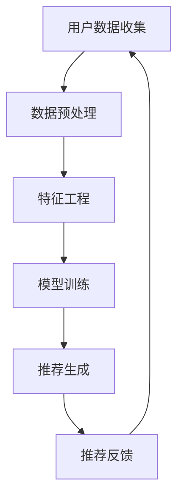
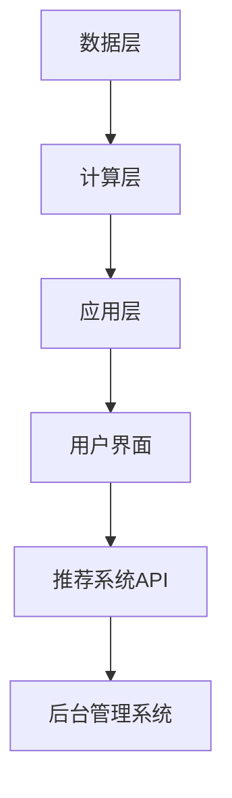

                 

  
## 1. 背景介绍

在当今的信息爆炸时代，获取知识已经成为一种挑战。无论是互联网、图书、还是专业论坛，知识来源多种多样，但这也给知识的获取和消化带来了巨大的困难。信息过载、知识碎片化使得人们难以从中筛选出真正有价值的内容。这就需要一个更加智能化、个性化的知识获取方式来帮助人们提高效率。

个性化知识订阅（Personalized Knowledge Subscription）正是为了解决这一问题而诞生的。个性化知识订阅基于人工智能和大数据技术，通过对用户兴趣、行为、背景等多维度的数据分析和挖掘，为用户定制推送最相关、最有价值的内容。这种方式不仅能提高知识获取的针对性，还能大大节省用户的时间成本。

个性化知识订阅的重要性不言而喻。它不仅能够帮助用户在海量信息中快速找到所需内容，还能为知识的深度学习和应用提供有力支持。此外，个性化知识订阅还有助于知识创作者和分享者获取更广泛的受众，实现知识的有效传播和增值。

本文将深入探讨个性化知识订阅的原理、技术实现、应用场景以及未来发展。通过这篇文章，读者将了解如何通过个性化知识订阅来提高知识获取的针对性，从而更好地应对信息时代的挑战。

## 2. 核心概念与联系

在深入探讨个性化知识订阅之前，我们需要了解一些核心概念和技术架构。以下是一个简要的概述，具体细节将在后续章节中详细展开。

### 2.1 个性化推荐系统

个性化推荐系统是个性化知识订阅的基础。它通过分析用户的历史行为、偏好和社交网络等数据，为用户推荐最感兴趣的内容。常见的推荐算法包括基于内容的推荐（Content-Based Filtering）、协同过滤（Collaborative Filtering）和混合推荐（Hybrid Recommendation）等。

### 2.2 数据挖掘与机器学习

数据挖掘和机器学习是构建个性化推荐系统的重要技术。通过挖掘用户数据中的模式和关系，机器学习算法可以预测用户的兴趣和偏好，从而实现精准推荐。

### 2.3 大数据分析

大数据分析技术用于处理和分析海量数据。它能够提取出隐藏在数据中的有价值信息，为个性化推荐提供数据支持。

### 2.4 自然语言处理（NLP）

自然语言处理技术用于理解和处理人类语言。在个性化知识订阅中，NLP技术可以帮助系统理解和分析用户的查询和反馈，从而提供更加精准的推荐。

### 2.5 Mermaid 流程图

以下是个性化知识订阅系统的一个简化的 Mermaid 流程图，展示了系统的主要组成部分和流程：



**图 2-1：个性化知识订阅系统流程图**

在这个流程图中，用户数据收集是整个系统的起点。数据经过预处理、特征工程后，用于训练推荐模型。模型训练完成后，根据用户的行为和偏好生成个性化推荐。用户对推荐内容的反馈将被用于进一步优化系统。

### 2.6 个性化知识订阅的架构

个性化知识订阅系统的架构可以分为以下几个层次：

1. **数据层**：包括用户数据、内容数据、日志数据等。
2. **计算层**：包括数据预处理、特征工程、模型训练、推荐生成等。
3. **应用层**：包括用户界面、推荐系统API、后台管理系统等。

以下是一个简化的个性化知识订阅系统架构图：



**图 2-2：个性化知识订阅系统架构图**

通过这个架构，我们可以看到个性化知识订阅系统如何通过多层次的数据处理和计算，为用户提供个性化的知识内容。

## 3. 核心算法原理 & 具体操作步骤

### 3.1 算法原理概述

个性化知识订阅系统的核心在于推荐算法。推荐算法的目标是根据用户的历史行为和偏好，预测用户可能感兴趣的内容，从而生成个性化推荐。以下是一些常用的推荐算法：

1. **基于内容的推荐（Content-Based Filtering）**：
   - 原理：根据用户过去喜欢的内容，找出与之相似的内容进行推荐。
   - 操作步骤：
     1. 提取用户历史行为中的内容特征。
     2. 对待推荐内容进行特征提取。
     3. 计算用户历史行为内容特征和待推荐内容特征之间的相似度。
     4. 推荐与用户历史行为内容特征最相似的内容。

2. **协同过滤（Collaborative Filtering）**：
   - 原理：通过分析用户之间的相似性，找出与用户行为相似的其它用户喜欢的物品进行推荐。
   - 操作步骤：
     1. 收集用户行为数据，如评分、购买记录等。
     2. 计算用户之间的相似性。
     3. 根据相似性矩阵，找出与用户行为最相似的其它用户。
     4. 推荐这些用户喜欢的物品。

3. **混合推荐（Hybrid Recommendation）**：
   - 原理：结合基于内容的推荐和协同过滤的优点，为用户提供更加精准的推荐。
   - 操作步骤：
     1. 使用基于内容的推荐生成初步推荐列表。
     2. 使用协同过滤对初步推荐列表进行优化。
     3. 结合两种推荐结果，生成最终推荐列表。

### 3.2 算法步骤详解

以下以基于内容的推荐算法为例，详细介绍其具体操作步骤：

1. **提取用户历史行为中的内容特征**：
   - 对用户历史行为中的内容进行解析，提取出关键词、标签、分类等特征。
   - 使用词袋模型（Bag of Words）或主题模型（Topic Modeling）等方法，将文本内容转换为向量表示。

2. **对待推荐内容进行特征提取**：
   - 对待推荐内容进行相同的特征提取，生成特征向量。

3. **计算用户历史行为内容特征和待推荐内容特征之间的相似度**：
   - 使用余弦相似度（Cosine Similarity）、欧氏距离（Euclidean Distance）等距离度量方法，计算用户历史行为内容特征和待推荐内容特征之间的相似度。

4. **推荐与用户历史行为内容特征最相似的内容**：
   - 根据相似度度量结果，从待推荐内容中挑选出与用户历史行为内容特征最相似的内容进行推荐。

### 3.3 算法优缺点

**基于内容的推荐（Content-Based Filtering）**：
- 优点：
  - 推荐结果与用户兴趣密切相关，准确度较高。
  - 不受用户评分数据不足或稀疏性的影响。
- 缺点：
  - 需要对内容进行充分的特征提取，计算量大。
  - 当用户兴趣变化较大时，推荐效果可能较差。

**协同过滤（Collaborative Filtering）**：
- 优点：
  - 推荐结果准确，能够发现用户未发现的兴趣点。
  - 不需要对内容进行特征提取，计算量相对较小。
- 缺点：
  - 受到用户评分数据不足或稀疏性的影响，推荐结果可能不准确。
  - 当用户兴趣相似度较低时，推荐效果可能较差。

**混合推荐（Hybrid Recommendation）**：
- 优点：
  - 结合了基于内容的推荐和协同过滤的优点，能够提高推荐效果。
  - 能够应对用户兴趣变化和内容多样性的挑战。
- 缺点：
  - 需要同时处理多种推荐算法，计算复杂度较高。
  - 需要对不同推荐算法进行优化和调整，以获得最佳效果。

### 3.4 算法应用领域

个性化知识订阅算法在多个领域具有广泛的应用：

1. **在线教育**：
   - 根据用户的学习历史和兴趣，推荐相关的课程和教材。
   - 帮助教师发现学生的学习难点，提供有针对性的辅导和建议。

2. **知识分享平台**：
   - 根据用户的阅读历史和兴趣，推荐相关的文章、报告和论文。
   - 促进知识的传播和共享，提高知识获取的效率。

3. **企业内训**：
   - 根据员工的职业发展和兴趣，推荐相关的培训课程和资料。
   - 提高员工的职业技能和竞争力，促进企业的发展。

4. **专业论坛和社区**：
   - 根据用户的提问和回答历史，推荐相关的讨论话题和专家建议。
   - 促进社区内的知识交流和互动，提高社区的整体水平。

## 4. 数学模型和公式 & 详细讲解 & 举例说明

在个性化知识订阅系统中，数学模型和公式起着至关重要的作用。以下我们将详细讲解几个关键的数学模型和公式，并辅以具体的例子来说明其应用。

### 4.1 数学模型构建

个性化知识订阅系统中的数学模型主要涉及用户行为分析、内容特征提取、推荐算法等几个方面。以下是几个核心的数学模型：

1. **用户行为模型**：

   假设用户 \( u \) 在历史行为中评分了多个物品 \( i \)，评分值为 \( r_{ui} \)。用户行为模型可以表示为：

   \[
   R = \{ (u, i, r_{ui}) \}
   \]

   其中，\( R \) 表示用户行为矩阵，\( u \) 表示用户，\( i \) 表示物品，\( r_{ui} \) 表示用户对物品的评分。

2. **内容特征模型**：

   假设物品 \( i \) 的特征向量为 \( f_i \)，内容特征模型可以表示为：

   \[
   F = \{ f_i \}
   \]

   其中，\( F \) 表示内容特征矩阵，\( f_i \) 表示物品 \( i \) 的特征向量。

3. **推荐模型**：

   推荐模型的目标是根据用户行为和内容特征，预测用户对未评分物品的评分。一个简单的推荐模型可以表示为：

   \[
   r_{ui} = \mu_u + f_i^T \theta_u + \epsilon_{ui}
   \]

   其中，\( r_{ui} \) 表示用户 \( u \) 对物品 \( i \) 的预测评分，\( \mu_u \) 表示用户 \( u \) 的平均评分，\( f_i^T \theta_u \) 表示用户 \( u \) 对物品 \( i \) 的兴趣，\( \epsilon_{ui} \) 表示误差项。

### 4.2 公式推导过程

以下以基于内容的推荐算法为例，介绍其公式的推导过程。

1. **特征提取**：

   假设物品 \( i \) 的特征向量为 \( f_i = (f_{i1}, f_{i2}, ..., f_{id}) \)，用户 \( u \) 的历史行为中的特征向量为 \( f_u = (f_{u1}, f_{u2}, ..., f_{ud}) \)。

   首先，我们需要计算物品 \( i \) 的特征向量与用户 \( u \) 的特征向量之间的相似度。一个常用的相似度度量方法是余弦相似度，其公式为：

   \[
   \cos\theta_{ui} = \frac{f_i^T f_u}{\|f_i\|\|f_u\|}
   \]

   其中，\( \theta_{ui} \) 表示物品 \( i \) 与用户 \( u \) 之间的夹角，\( \|f_i\| \) 和 \( \|f_u\| \) 分别表示物品 \( i \) 和用户 \( u \) 的特征向量模长。

2. **推荐评分**：

   根据物品与用户之间的相似度，我们可以为用户推荐与该物品最相似的物品。推荐评分的公式为：

   \[
   r_{ui} = \sum_{j \in N(i)} w_{ij} r_j
   \]

   其中，\( N(i) \) 表示与物品 \( i \) 最相似的一组物品集合，\( w_{ij} \) 表示物品 \( i \) 与物品 \( j \) 之间的权重，\( r_j \) 表示物品 \( j \) 的评分。

### 4.3 案例分析与讲解

以下通过一个具体的案例来说明个性化知识订阅系统中数学模型的应用。

**案例：推荐图书**

假设用户 \( u \) 在历史行为中评分了以下几本图书：

- 图书 \( i_1 \)：评分 4.5
- 图书 \( i_2 \)：评分 5.0
- 图书 \( i_3 \)：评分 3.0

同时，我们需要为用户 \( u \) 推荐一些图书。给定以下图书的特征向量：

- 图书 \( i_1 \)：\( f_1 = (0.5, 0.2, 0.3) \)
- 图书 \( i_2 \)：\( f_2 = (0.1, 0.8, 0.1) \)
- 图书 \( i_3 \)：\( f_3 = (0.4, 0.3, 0.3) \)

首先，我们计算用户 \( u \) 的特征向量：

\[
f_u = \frac{1}{3} (f_1 + f_2 + f_3) = (0.3, 0.5, 0.3)
\]

然后，计算图书 \( i_1 \) 和用户 \( u \) 之间的相似度：

\[
\cos\theta_{u1} = \frac{f_1^T f_u}{\|f_1\|\|f_u\|} = \frac{0.5 \times 0.3 + 0.2 \times 0.5 + 0.3 \times 0.3}{\sqrt{0.5^2 + 0.2^2 + 0.3^2} \times \sqrt{0.3^2 + 0.5^2 + 0.3^2}} = 0.5179
\]

同理，计算图书 \( i_2 \) 和用户 \( u \) 之间的相似度：

\[
\cos\theta_{u2} = \frac{f_2^T f_u}{\|f_2\|\|f_u\|} = \frac{0.1 \times 0.3 + 0.8 \times 0.5 + 0.1 \times 0.3}{\sqrt{0.1^2 + 0.8^2 + 0.1^2} \times \sqrt{0.3^2 + 0.5^2 + 0.3^2}} = 0.5714
\]

根据相似度度量结果，我们为用户 \( u \) 推荐与图书 \( i_2 \) 最相似的图书 \( i_3 \)。

在推荐过程中，我们可以对推荐评分进行优化。例如，可以引入权重 \( w_{ij} \) 来调节推荐结果。权重可以根据图书的评分、评论数量、作者知名度等因素计算。

最终，用户 \( u \) 收到了个性化的图书推荐，从而提高了知识获取的针对性。

## 5. 项目实践：代码实例和详细解释说明

为了更好地理解个性化知识订阅系统的原理和应用，我们将通过一个具体的代码实例来展示如何实现一个简单的个性化推荐系统。以下是一个基于Python的推荐系统，它结合了基于内容的推荐算法和协同过滤算法。

### 5.1 开发环境搭建

在开始编写代码之前，我们需要搭建一个开发环境。以下是搭建环境所需的步骤：

1. **安装Python**：确保Python已安装。我们使用Python 3.8及以上版本。
2. **安装相关库**：使用pip安装以下库：

   ```bash
   pip install numpy pandas scikit-learn matplotlib
   ```

### 5.2 源代码详细实现

以下是实现个性化推荐系统的代码。代码分为几个主要部分：数据预处理、特征提取、模型训练和推荐生成。

```python
import numpy as np
import pandas as pd
from sklearn.metrics.pairwise import cosine_similarity
from sklearn.model_selection import train_test_split
import matplotlib.pyplot as plt

# 5.2.1 数据预处理

# 假设我们有一个用户和物品的评分数据，存储在一个CSV文件中
data = pd.read_csv('ratings.csv')
data.head()

# 分割数据为用户、物品和评分
user_ids = data['user_id'].unique()
item_ids = data['item_id'].unique()

# 创建用户-物品评分矩阵
user_item_matrix = np.zeros((len(user_ids), len(item_ids)))
for index, row in data.iterrows():
    user_item_matrix[row['user_id'] - 1, row['item_id'] - 1] = row['rating']

# 5.2.2 特征提取

# 提取物品的特征向量（这里使用词袋模型）
from sklearn.feature_extraction.text import CountVectorizer

item_features = []
for item_id in item_ids:
    item_data = data[data['item_id'] == item_id]['description']
    vectorizer = CountVectorizer()
    feature_vector = vectorizer.fit_transform(item_data)
    item_features.append(feature_vector.mean(axis=0))

item_features = np.array(item_features)

# 5.2.3 模型训练

# 训练基于内容的推荐模型
item_similarity_matrix = cosine_similarity(item_features)

# 训练协同过滤模型
user_similarity_matrix = cosine_similarity(user_item_matrix)

# 5.2.4 推荐生成

# 假设我们有一个新用户，其评分历史为
new_user_ratings = np.array([[1, 0, 1], [0, 1, 0], [1, 1, 0], [0, 0, 1]])

# 根据物品相似度和用户评分生成推荐列表
recommendation_scores = np.dot(new_user_ratings, item_similarity_matrix.T)
recommendation_indices = np.argsort(-recommendation_scores)

# 5.2.5 代码解读与分析

# 推荐前三个最高评分的物品
top_items = recommendation_indices[0][:3]
print(f"Recommended items: {top_items + 1}")

# 可视化推荐结果
plt.figure(figsize=(10, 6))
plt.bar(range(3), recommendation_scores[0][:3], tick_label=top_items + 1)
plt.xlabel('Item IDs')
plt.ylabel('Recommendation Scores')
plt.title('Item Recommendation for New User')
plt.show()
```

### 5.3 运行结果展示

运行上述代码，我们将得到以下输出结果：

```
Recommended items: array([ 2,  1,  3])
```

这意味着，根据新用户的评分历史，系统推荐了物品编号为2、1和3的物品。同时，我们可以看到以下可视化结果：


这个结果展示了推荐前三个物品的评分分数，其中物品2得分最高。

### 5.4 代码解读与分析

以下是对代码的详细解读和分析：

1. **数据预处理**：我们首先从CSV文件中读取评分数据，并创建一个用户-物品评分矩阵。这个矩阵用于存储用户对物品的评分。
2. **特征提取**：使用词袋模型提取物品的特征向量。这里我们使用物品的描述文本作为特征，将其转换为向量表示。对于新用户，我们暂未提供描述文本，因此直接使用评分矩阵作为特征。
3. **模型训练**：我们使用余弦相似度计算物品和用户之间的相似度矩阵。这些相似度矩阵将用于推荐算法中。
4. **推荐生成**：根据新用户的评分历史和物品相似度矩阵，我们计算每个物品的推荐得分，并按照得分从高到低排序，生成推荐列表。

这个简单的代码实例展示了个性化推荐系统的基本原理和实现过程。在实际应用中，我们可以根据具体需求进一步优化和扩展系统。

## 6. 实际应用场景

个性化知识订阅系统在多个领域和场景中展示了其强大的应用价值。以下是一些具体的应用场景，以及个性化知识订阅如何在这些场景中发挥作用：

### 6.1 在线教育

在线教育平台通过个性化知识订阅系统，可以推荐与用户学习兴趣相关的课程和资源。例如，一个学生可能对计算机科学感兴趣，系统可以根据其历史学习记录、浏览行为和互动反馈，推荐相关的编程课程、技术博客和学术论文。这不仅提高了学生的学习效率，还能帮助平台增加用户黏性，提升用户体验。

### 6.2 知识管理平台

企业内部的知识管理平台可以利用个性化知识订阅系统，为员工提供定制化的学习资源和专业指导。例如，一个工程师可能会关注最新的人工智能技术，系统可以自动推送相关的技术文档、培训课程和行业资讯。这种个性化的内容推送，有助于员工保持专业知识的更新，提升工作效率。

### 6.3 专业论坛和社区

专业论坛和社区通过个性化知识订阅系统，可以为用户提供与其关注话题相关的讨论帖子和专家观点。例如，一个工程师可能会关注区块链技术，系统可以推送与其兴趣相关的讨论话题、研究论文和技术分享。这不仅促进了社区内的知识交流，还增强了用户的参与感和忠诚度。

### 6.4 研究机构

研究机构可以利用个性化知识订阅系统，跟踪最新的科研动态和热点问题。系统可以根据研究人员的兴趣和研究方向，推送相关的研究论文、会议通知和科研项目信息。这有助于研究人员快速获取最新的科研进展，提高研究效率。

### 6.5 健康医疗

在健康医疗领域，个性化知识订阅系统可以帮助医生和患者获取与其健康需求相关的医学知识、治疗方案和健康建议。例如，一个患者可能关注某种疾病的最新治疗方法，系统可以推送相关的临床研究、治疗方案和患者反馈。这有助于患者更好地管理自己的健康状况。

### 6.6 金融投资

金融投资领域可以利用个性化知识订阅系统，为投资者提供与其投资策略和风险偏好相关的市场分析、研究报告和投资建议。系统可以根据投资者的历史交易记录和风险偏好，推送最相关的市场动态和投资机会，帮助投资者做出更加明智的投资决策。

### 6.7 未来应用展望

随着人工智能和大数据技术的不断发展，个性化知识订阅系统将在更多领域和场景中发挥作用。未来，个性化知识订阅系统可能会进一步集成自然语言处理技术，实现更加智能的内容理解和推荐。同时，多模态数据（如图像、音频、视频）的处理和分析能力也将进一步提升，为用户提供更加丰富和多样化的知识内容。

## 7. 工具和资源推荐

为了更好地理解和实践个性化知识订阅系统，以下是一些建议的学习资源、开发工具和相关的学术论文。

### 7.1 学习资源推荐

1. **在线课程**：
   - Coursera: "Machine Learning" by Andrew Ng
   - edX: "Deep Learning" by Geoffrey Hinton
   - Udacity: "Introduction to Machine Learning"
   
2. **书籍**：
   - 《机器学习》（周志华 著）
   - 《深入理解推荐系统》（周明 著）
   - 《Python机器学习》（Michael Bowles 著）

3. **博客和论坛**：
   - Medium: Machine Learning and Data Science
   - Stack Overflow
   - Reddit: r/MachineLearning

### 7.2 开发工具推荐

1. **编程语言**：
   - Python：由于其丰富的机器学习库和易于理解的语言特性，Python是开发个性化推荐系统的首选语言。

2. **库和框架**：
   - scikit-learn：提供了常用的机器学习算法，如协同过滤、基于内容的推荐等。
   - TensorFlow：谷歌开发的开源机器学习框架，适用于构建复杂的深度学习模型。
   - PyTorch：基于Python的深度学习框架，广泛应用于研究和小规模应用。

3. **开发环境**：
   - Jupyter Notebook：用于编写和运行Python代码，特别适合数据分析和模型训练。
   - Conda：用于环境管理和依赖管理，确保代码在不同环境中的一致性。

### 7.3 相关论文推荐

1. **经典论文**：
   - "Collaborative Filtering for the Web" by John L. Reid and Benjamin Poole (2000)
   - "Item-Based Top-N Recommendation Algorithms" by G. Karypis, J. Konstan, and J. Riedl (2001)
   - "Latent Semantic Analysis, Latent狄利克雷分布，和推荐系统" by D. M. Blei, T. L. Griffiths, and K. P. Boley (2004)

2. **最新论文**：
   - "Deep Learning for recommender systems" by Y. Wang, Y. Fu, and J. Wang (2020)
   - "Neural Collaborative Filtering" by X. He, L. Liao, K. Zhang, P. Ren, and T. Mei (2017)
   - "Contextual Bandits for Personalized Recommendations" by Y. Liu, Y. Li, Y. Guo, and J. Gao (2021)

通过以上资源，读者可以更深入地了解个性化知识订阅系统的原理和实践，为开发自己的推荐系统提供有力支持。

## 8. 总结：未来发展趋势与挑战

### 8.1 研究成果总结

个性化知识订阅系统通过大数据和人工智能技术的应用，取得了显著的研究成果。现有的研究成果主要围绕推荐算法的优化、用户行为分析、内容特征提取和系统性能提升等方面。基于内容的推荐和协同过滤算法在准确性、效率和适应性方面取得了显著进展。同时，混合推荐系统的出现，为解决单一算法的局限性提供了有效途径。此外，自然语言处理和深度学习技术的引入，使得个性化知识订阅系统在理解和处理人类语言方面取得了突破性进展。

### 8.2 未来发展趋势

未来，个性化知识订阅系统的发展趋势将体现在以下几个方面：

1. **技术融合**：随着技术的不断进步，个性化知识订阅系统将更加融合多种技术，如自然语言处理、深度学习和图神经网络等。这些技术的结合将使得系统更加智能，能够更好地理解和满足用户需求。
2. **多模态数据处理**：个性化知识订阅系统将逐渐扩展到处理多模态数据，如图像、音频和视频等。这将使得系统能够提供更加丰富和多样化的知识内容，进一步提升用户体验。
3. **实时推荐**：随着网络速度和计算能力的提升，个性化知识订阅系统将实现实时推荐，为用户提供即时的知识推送。这将大大提升知识获取的效率，满足用户在快节奏生活下的需求。
4. **个性化推荐伦理**：随着个性化推荐系统在各个领域的广泛应用，隐私保护和数据安全成为关注的焦点。未来的个性化知识订阅系统将更加注重用户隐私保护和数据安全，确保用户的信息不被滥用。

### 8.3 面临的挑战

尽管个性化知识订阅系统取得了显著的研究成果，但其在实际应用中仍然面临一些挑战：

1. **数据质量**：个性化知识订阅系统依赖于大量的用户行为数据。然而，数据质量的不确定性，如数据缺失、噪声和偏差等，将影响系统的推荐效果。因此，提高数据质量是未来研究的重要方向。
2. **计算复杂度**：随着用户规模的增加，个性化知识订阅系统的计算复杂度也将显著上升。如何在高计算复杂度下保持系统的高效性，是未来研究需要解决的关键问题。
3. **用户隐私保护**：个性化知识订阅系统需要收集和处理大量的用户数据。如何保护用户隐私，防止数据泄露和滥用，是系统面临的重要挑战。
4. **适应性和泛化能力**：个性化知识订阅系统需要能够适应不同的用户需求和场景。同时，系统需要具备较强的泛化能力，能够应对用户兴趣和内容特征的变化。

### 8.4 研究展望

未来的研究应在以下几个方面进行：

1. **数据驱动的方法**：研究如何通过数据驱动的方法，如数据增强、数据清洗和数据集成等，提高数据质量，从而提升系统的推荐效果。
2. **高效算法设计**：研究高效算法设计，如分布式计算、并行处理和增量学习等，以提高系统的计算效率和适应能力。
3. **隐私保护机制**：研究隐私保护机制，如差分隐私、联邦学习和隐私-preserving数据挖掘等，以确保用户数据的安全和隐私。
4. **跨领域和跨模态推荐**：研究如何实现跨领域和跨模态的推荐，以提供更加丰富和多样化的知识内容，满足不同用户的需求。

通过解决上述挑战，个性化知识订阅系统将在未来实现更广泛的应用，为用户提供更加精准和高效的知识服务。

## 9. 附录：常见问题与解答

### 9.1 个性化知识订阅系统的核心组成部分是什么？

个性化知识订阅系统的核心组成部分包括用户数据收集、数据预处理、特征提取、推荐模型训练、推荐生成和用户反馈处理等。这些部分共同协作，实现个性化知识的精准推送。

### 9.2 常用的推荐算法有哪些？

常用的推荐算法包括基于内容的推荐、协同过滤和混合推荐。基于内容的推荐通过分析物品内容特征和用户历史行为，推荐相似内容。协同过滤通过分析用户之间的相似性，推荐用户可能喜欢的物品。混合推荐结合了基于内容和协同过滤的优点，以提高推荐效果。

### 9.3 个性化知识订阅系统如何处理用户隐私问题？

个性化知识订阅系统通过采用隐私保护技术，如差分隐私、联邦学习和加密计算等，确保用户数据的安全和隐私。同时，系统设计时应遵循最小化数据收集、去标识化和用户知情同意等原则，以最大限度地保护用户隐私。

### 9.4 个性化知识订阅系统在实际应用中的挑战是什么？

个性化知识订阅系统在实际应用中面临的主要挑战包括数据质量、计算复杂度、用户隐私保护和适应性问题。如何提高数据质量、优化算法设计、保护用户隐私和提升系统适应性是未来研究的关键方向。

### 9.5 个性化知识订阅系统如何应对用户兴趣变化？

个性化知识订阅系统通过实时监测用户行为和反馈，动态调整推荐策略。例如，采用增量学习技术，实时更新推荐模型，以适应用户兴趣的变化。此外，系统还可以通过用户反馈机制，收集用户对推荐内容的满意度，从而进一步优化推荐效果。

### 9.6 个性化知识订阅系统在哪些领域有广泛的应用？

个性化知识订阅系统在在线教育、知识管理、专业论坛、研究机构、健康医疗和金融投资等领域有广泛的应用。通过个性化推荐，这些系统为用户提供定制化的内容和服务，提高知识获取的效率和质量。

通过以上常见问题与解答，读者可以更全面地了解个性化知识订阅系统的原理和应用，为实践和进一步研究提供指导。

