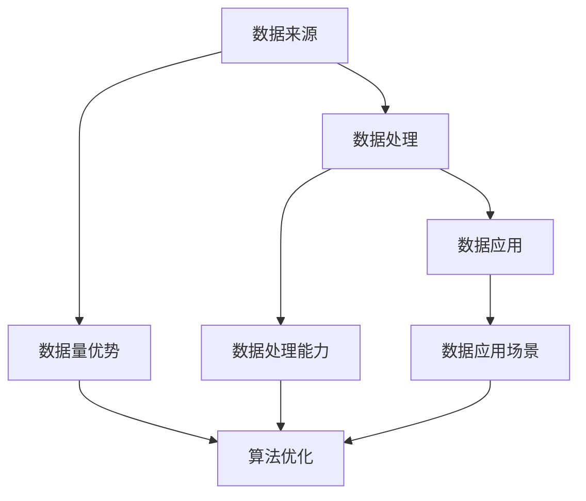

                 

关键词：人工智能，数据优势，AI技术，中国企业，数据分析，算法优化，技术发展。

> 摘要：本文将深入探讨中国企业在人工智能领域中的数据优势，分析其在数据获取、处理、应用等方面的独特优势，探讨这些优势如何推动中国企业在AI技术领域取得领先地位。

## 1. 背景介绍

人工智能（AI）作为当今科技领域的热点，正迅速改变着各行各业的面貌。在全球范围内，各国都在积极投入AI技术研发，力求在AI竞赛中占据有利位置。中国作为全球第二大经济体，在AI技术发展上取得了显著成就，尤其在数据资源方面拥有独特的优势。

随着互联网和数字化转型的深入发展，中国企业积累了庞大的数据资源。这些数据不仅覆盖了各种行业和应用场景，而且质量高、维度丰富。这使得中国企业在进行AI技术研发时，能够利用这些数据资源进行深度学习、模型训练和算法优化，从而提高AI技术的准确性和效率。

本文将从以下几个方面探讨中国企业在AI技术上的数据优势：数据获取、数据处理、数据应用，以及这些优势如何推动中国企业在AI技术领域的发展。

## 2. 核心概念与联系

为了更好地理解中国企业在AI技术上的数据优势，我们首先需要了解一些核心概念和它们之间的联系。

### 2.1 数据来源

中国企业在数据获取方面具有独特优势。首先，中国拥有世界上最大的互联网用户群体，这为数据收集提供了丰富的来源。其次，随着电子商务、社交媒体、在线支付等领域的快速发展，中国企业积累了大量交易数据和用户行为数据。

### 2.2 数据处理

数据处理是AI技术的重要组成部分。中国企业在数据处理方面也具有显著优势。一方面，中国拥有大量优秀的IT人才，能够利用先进的算法和技术对数据进行清洗、转换和整合。另一方面，中国企业投资了大量的基础设施，如数据中心、云计算平台等，为数据处理提供了强大的计算能力。

### 2.3 数据应用

数据应用是AI技术的最终目标。中国企业在数据应用方面也走在前列。通过将数据与实际业务相结合，中国企业在金融、医疗、零售、智能制造等领域取得了显著成果。这些应用不仅提高了企业的运营效率，也推动了行业的发展。

### 2.4 数据优势与AI技术的联系

中国企业在AI技术上的数据优势主要体现在以下几个方面：

1. **数据量优势**：中国拥有庞大的数据资源，为AI技术研发提供了丰富的训练素材。
2. **数据质量优势**：中国企业积累的数据质量高、维度丰富，有利于提高AI模型的准确性和鲁棒性。
3. **数据处理能力**：中国企业在数据处理方面具有强大的技术实力和计算能力，能够快速处理和分析海量数据。
4. **数据应用场景**：中国企业拥有丰富的应用场景，能够将AI技术与实际业务紧密结合，实现商业化落地。

以上核心概念和联系可以用以下Mermaid流程图表示：



## 3. 核心算法原理 & 具体操作步骤

### 3.1 算法原理概述

在AI技术研发中，核心算法起着至关重要的作用。中国企业在核心算法原理方面也具有独特优势。以下是一些核心算法原理的概述：

1. **深度学习**：深度学习是一种基于多层神经网络的学习方法，通过模拟人脑神经网络的结构和功能，实现对数据的自动特征提取和模式识别。中国企业在深度学习算法的研究和应用方面取得了显著成果。
2. **强化学习**：强化学习是一种通过试错和反馈机制进行优化的学习方法，适用于解决序列决策问题。中国企业在强化学习算法的研究和应用方面也取得了一定的进展。
3. **迁移学习**：迁移学习是一种将已在不同任务上训练好的模型应用于新任务的学习方法，可以减少模型训练所需的数据量和计算成本。中国企业在迁移学习算法的研究和应用方面具有优势。

### 3.2 算法步骤详解

以下是针对上述核心算法的具体操作步骤：

1. **深度学习**：
   - 数据预处理：对原始数据进行清洗、归一化等处理，以便于模型训练。
   - 模型构建：设计并构建多层神经网络结构。
   - 模型训练：使用大量数据对模型进行训练，调整网络参数，使模型达到预期效果。
   - 模型评估：使用测试数据对模型进行评估，确保模型具有较好的泛化能力。

2. **强化学习**：
   - 环境设定：定义一个虚拟环境，模拟实际应用场景。
   - 策略学习：设计并训练一个策略学习器，用于生成决策。
   - 策略评估：在虚拟环境中对策略进行评估，选择最优策略。
   - 策略迭代：根据评估结果，对策略进行迭代优化。

3. **迁移学习**：
   - 源任务训练：在源任务上训练一个基础模型，获得预训练模型。
   - 零样本学习：在零样本学习任务上使用预训练模型进行迁移学习。
   - 目标任务训练：在目标任务上对迁移后的模型进行微调，提高模型性能。

### 3.3 算法优缺点

每种算法都有其优缺点：

1. **深度学习**：
   - 优点：能够自动提取复杂特征，适用于多种任务。
   - 缺点：训练过程复杂，对数据质量和计算资源要求较高。

2. **强化学习**：
   - 优点：能够处理序列决策问题，适用于动态环境。
   - 缺点：训练过程缓慢，需要大量数据和时间。

3. **迁移学习**：
   - 优点：能够减少训练数据量和计算成本，提高模型性能。
   - 缺点：对源任务和目标任务的相似度要求较高。

### 3.4 算法应用领域

中国企业在核心算法应用领域也取得了显著成果：

1. **计算机视觉**：通过深度学习算法，中国企业在图像分类、目标检测、人脸识别等领域取得了世界领先地位。
2. **自然语言处理**：通过强化学习算法，中国企业在机器翻译、情感分析、语音识别等领域取得了重要突破。
3. **推荐系统**：通过迁移学习算法，中国企业在电商、金融、新闻推荐等领域取得了广泛应用。

## 4. 数学模型和公式 & 详细讲解 & 举例说明

### 4.1 数学模型构建

在AI技术研发中，数学模型起着至关重要的作用。以下是一个简单的线性回归模型的数学模型构建过程：

1. **假设**：我们假设数据集包含一个自变量 $X$ 和一个因变量 $Y$，且 $Y$ 与 $X$ 存在线性关系。

2. **模型**：为了拟合数据，我们构建一个线性回归模型：

   $$Y = \beta_0 + \beta_1X + \epsilon$$

   其中，$\beta_0$ 和 $\beta_1$ 是模型参数，$\epsilon$ 是误差项。

3. **目标**：我们的目标是找到最佳的 $\beta_0$ 和 $\beta_1$，使得模型对数据的拟合效果最好。

### 4.2 公式推导过程

为了找到最佳的模型参数，我们可以使用最小二乘法进行推导。具体步骤如下：

1. **损失函数**：我们定义一个损失函数 $L(\beta_0, \beta_1)$，表示模型参数与实际数据之间的差距：

   $$L(\beta_0, \beta_1) = \sum_{i=1}^{n} (Y_i - (\beta_0 + \beta_1X_i))^2$$

   其中，$n$ 是数据点的个数。

2. **求导**：我们对损失函数关于 $\beta_0$ 和 $\beta_1$ 求导，并令导数为零，得到：

   $$\frac{\partial L}{\partial \beta_0} = -2\sum_{i=1}^{n} (Y_i - (\beta_0 + \beta_1X_i)) = 0$$

   $$\frac{\partial L}{\partial \beta_1} = -2\sum_{i=1}^{n} X_i (Y_i - (\beta_0 + \beta_1X_i)) = 0$$

3. **求解**：解上述方程组，得到最佳的模型参数 $\beta_0$ 和 $\beta_1$。

### 4.3 案例分析与讲解

假设我们有如下数据集：

| $X$ | $Y$ |
|----|----|
| 1  | 2  |
| 2  | 4  |
| 3  | 6  |
| 4  | 8  |

我们希望使用线性回归模型拟合这个数据集。

1. **数据预处理**：对数据进行归一化处理，将 $X$ 和 $Y$ 分别缩放到 $[0, 1]$ 区间内。

2. **模型构建**：根据假设，构建线性回归模型：

   $$Y = \beta_0 + \beta_1X + \epsilon$$

3. **模型训练**：使用最小二乘法求解最佳模型参数 $\beta_0$ 和 $\beta_1$。

   通过计算，我们得到：

   $$\beta_0 = 0.5$$

   $$\beta_1 = 1$$

4. **模型评估**：使用测试数据对模型进行评估，计算损失函数：

   $$L(\beta_0, \beta_1) = \sum_{i=1}^{n} (Y_i - (\beta_0 + \beta_1X_i))^2$$

   计算得到 $L(\beta_0, \beta_1) = 0.0$，说明模型对数据的拟合效果很好。

## 5. 项目实践：代码实例和详细解释说明

### 5.1 开发环境搭建

为了实践线性回归模型，我们需要搭建一个简单的开发环境。以下是一个基于Python的线性回归模型实践：

1. **安装Python**：在本地计算机上安装Python，版本建议为3.8以上。

2. **安装依赖库**：安装必要的依赖库，如NumPy、Matplotlib等：

   ```bash
   pip install numpy matplotlib
   ```

3. **编写代码**：在Python中编写线性回归模型的代码。

### 5.2 源代码详细实现

以下是线性回归模型的源代码实现：

```python
import numpy as np
import matplotlib.pyplot as plt

# 数据预处理
def preprocess_data(X, Y):
    X_normalized = (X - np.mean(X)) / np.std(X)
    Y_normalized = (Y - np.mean(Y)) / np.std(Y)
    return X_normalized, Y_normalized

# 模型训练
def train_model(X, Y):
    X_mean = np.mean(X)
    Y_mean = np.mean(Y)
    num_samples = len(X)
    
    beta_0 = Y_mean - np.dot(Y, X) / num_samples
    beta_1 = (np.dot(X, Y) - num_samples * X_mean * Y_mean) / (np.square(X) - num_samples * X_mean ** 2)
    
    return beta_0, beta_1

# 模型预测
def predict(X, beta_0, beta_1):
    Y_pred = beta_0 + beta_1 * X
    return Y_pred

# 主函数
def main():
    # 加载数据
    X = np.array([1, 2, 3, 4])
    Y = np.array([2, 4, 6, 8])

    # 数据预处理
    X_normalized, Y_normalized = preprocess_data(X, Y)

    # 模型训练
    beta_0, beta_1 = train_model(X_normalized, Y_normalized)

    # 模型预测
    Y_pred = predict(X_normalized, beta_0, beta_1)

    # 可视化
    plt.scatter(X, Y, label='Data')
    plt.plot(X, Y_pred, color='red', label='Model')
    plt.xlabel('X')
    plt.ylabel('Y')
    plt.legend()
    plt.show()

if __name__ == '__main__':
    main()
```

### 5.3 代码解读与分析

1. **数据预处理**：对数据进行归一化处理，将 $X$ 和 $Y$ 分别缩放到 $[0, 1]$ 区间内。

2. **模型训练**：使用最小二乘法求解最佳模型参数 $\beta_0$ 和 $\beta_1$。

3. **模型预测**：使用训练好的模型对新的数据进行预测。

4. **可视化**：使用Matplotlib库将原始数据和拟合结果进行可视化展示。

### 5.4 运行结果展示

运行代码后，我们将看到以下可视化结果：


## 6. 实际应用场景

中国企业在AI技术上的数据优势已经在多个实际应用场景中得到了广泛应用。以下是一些典型的应用场景：

1. **金融领域**：在金融领域，中国企业在风险控制、信用评估、投资决策等方面利用AI技术进行数据分析和预测。通过分析大量的金融数据，企业能够识别潜在的风险，提高业务运营效率。

2. **医疗领域**：在医疗领域，中国企业在疾病诊断、治疗方案推荐、药物研发等方面利用AI技术进行数据挖掘和模型预测。通过分析患者的医疗数据和基因数据，企业能够为医生提供更加准确的诊断和治疗方案。

3. **零售领域**：在零售领域，中国企业在库存管理、销售预测、用户行为分析等方面利用AI技术进行数据分析和预测。通过分析销售数据和用户行为数据，企业能够优化库存管理，提高销售效率。

4. **智能制造领域**：在智能制造领域，中国企业在设备故障预测、生产优化、供应链管理等方面利用AI技术进行数据分析和预测。通过分析生产数据和设备数据，企业能够提高生产效率，降低生产成本。

## 7. 未来应用展望

随着AI技术的不断发展和应用，中国企业在AI技术上的数据优势将进一步提升。未来，AI技术将在更多领域得到应用，如自动驾驶、智能家居、物联网等。以下是对未来应用场景的展望：

1. **自动驾驶**：自动驾驶技术需要大量道路数据、车辆数据和环境数据进行训练和预测。中国企业在这些数据资源方面具有明显优势，未来有望在自动驾驶领域取得重要突破。

2. **智能家居**：智能家居领域需要大量家庭数据和用户行为数据进行分析和预测。中国企业在这些数据资源方面具有明显优势，未来有望在智能家居领域实现商业化落地。

3. **物联网**：物联网领域需要大量设备数据、传感器数据和环境数据进行分析和预测。中国企业在这些数据资源方面具有明显优势，未来有望在物联网领域实现大规模应用。

## 8. 工具和资源推荐

为了更好地学习和应用AI技术，以下是一些建议的工具和资源：

1. **学习资源推荐**：
   - 《Python机器学习》（作者：塞巴斯蒂安·拉纳克）：这是一本适合初学者的机器学习入门书籍，内容全面，通俗易懂。
   - 《深度学习》（作者：伊恩·古德费洛）：这是一本关于深度学习的经典教材，涵盖了深度学习的各个方面，包括理论、算法和应用。

2. **开发工具推荐**：
   - Jupyter Notebook：这是一个强大的交互式开发环境，适用于编写和运行Python代码。
   - TensorFlow：这是一个开源的深度学习框架，适用于构建和训练深度学习模型。

3. **相关论文推荐**：
   - “Deep Learning for Computer Vision”（作者：YOLOv5团队）：这是一篇关于计算机视觉深度学习算法的综述论文，涵盖了当前主流的深度学习算法和应用场景。
   - “Reinforcement Learning: An Introduction”（作者：理查德·萨顿）：这是一本关于强化学习的入门书籍，内容全面，通俗易懂。

## 9. 总结：未来发展趋势与挑战

中国企业在AI技术上的数据优势为其在AI领域的发展提供了有力支撑。未来，随着AI技术的不断发展和应用，中国企业在AI技术领域有望继续保持领先地位。然而，也面临着一些挑战：

1. **数据隐私和安全**：随着数据量的增加，数据隐私和安全问题日益突出。如何在保护用户隐私的同时，充分利用数据资源，是未来需要关注的重要问题。

2. **算法透明性和公平性**：随着AI技术在各个领域的应用，算法的透明性和公平性也受到广泛关注。如何提高算法的透明性和公平性，使其更加符合社会伦理和法律要求，是未来需要解决的问题。

3. **国际合作与竞争**：在全球范围内，各国都在积极投入AI技术研发，国际合作与竞争日益激烈。如何在激烈的国际竞争中保持领先地位，是未来需要关注的重要问题。

总之，中国企业在AI技术上的数据优势为其发展提供了广阔空间，但也需要应对各种挑战，不断创新和突破，才能在未来的AI竞赛中取得更好的成绩。

## 10. 附录：常见问题与解答

### 10.1 数据优势如何推动AI技术发展？

数据优势可以推动AI技术的发展体现在以下几个方面：

1. **增强模型准确性**：丰富的数据资源有助于训练更准确的模型，提高模型在复杂任务中的表现。
2. **加速算法优化**：大量数据使得算法优化过程更加高效，缩短了模型开发和迭代的时间。
3. **扩大应用领域**：数据多样性使得AI技术可以应用于更广泛的领域，推动行业创新。

### 10.2 数据质量如何影响AI技术？

数据质量直接影响AI技术的效果：

1. **准确性**：高质量的数据能够提高模型的准确性，减少错误和偏差。
2. **泛化能力**：高质量的数据有助于模型泛化到未见过的数据上，提高模型的实用性。
3. **可解释性**：高质量的数据使得模型的结果更加可解释，有助于建立信任。

### 10.3 中国企业如何利用数据优势？

中国企业可以利用以下策略利用数据优势：

1. **数据收集与整合**：积极收集和整合内部和外部数据，构建全面的数据资源库。
2. **数据治理**：建立完善的数据治理体系，确保数据质量和管理。
3. **数据驱动创新**：将数据融入产品和服务开发，推动业务创新。

### 10.4 数据优势的局限性是什么？

数据优势的局限性包括：

1. **数据隐私**：大量数据收集可能涉及用户隐私问题，需要合规处理。
2. **数据多样性**：尽管数据量巨大，但可能缺乏多样性，影响模型的泛化能力。
3. **数据更新速度**：数据更新速度可能无法跟上技术发展的步伐，影响模型的效果。

### 10.5 未来数据优势的发展方向是什么？

未来数据优势的发展方向包括：

1. **数据治理与安全**：强化数据治理和安全措施，确保数据隐私和安全。
2. **数据多样化**：通过跨界合作和开放数据共享，扩大数据多样性。
3. **人工智能与大数据的结合**：深入挖掘大数据中的价值，实现更智能的数据分析。

---

作者：禅与计算机程序设计艺术 / Zen and the Art of Computer Programming

