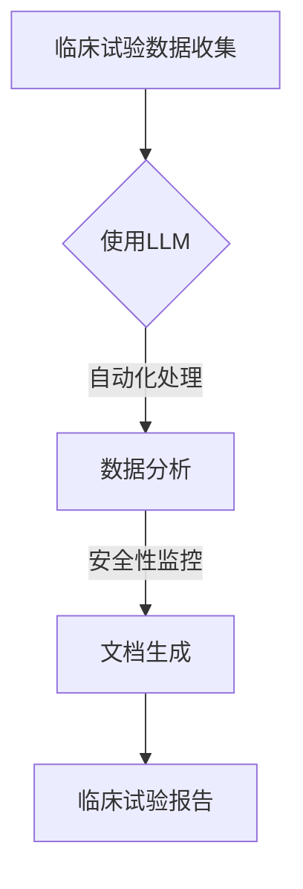

                 

关键词：临床试验、大规模语言模型、数据安全、效率提升、人工智能

> 摘要：本文将探讨如何利用大规模语言模型（LLM）来提高临床试验的效率和安全性。通过对LLM的原理及其在临床试验中的应用进行深入分析，本文将介绍一些关键算法和数学模型，以及其实际操作步骤和案例。同时，本文还将展望未来应用的前景，并提供相关的学习资源和开发工具推荐。

## 1. 背景介绍

### 1.1 临床试验的重要性

临床试验是评估新药、新疗法或医疗设备的有效性和安全性的关键步骤。它对于推动医疗科学的进步和改善患者治疗结果具有重要意义。然而，临床试验面临诸多挑战，如数据收集和处理复杂、试验流程繁琐、安全性监控困难等。

### 1.2 大规模语言模型（LLM）概述

大规模语言模型（LLM）是近年来人工智能领域的重要突破之一。通过训练大规模的神经网络模型，LLM能够对自然语言进行理解和生成，具有强大的语言处理能力。这使得LLM在许多领域具有广泛的应用潜力，包括自然语言处理、机器翻译、文本生成等。

## 2. 核心概念与联系

### 2.1 大规模语言模型（LLM）原理

大规模语言模型（LLM）基于深度学习技术，通过训练大规模的神经网络模型来实现对自然语言的建模。LLM的核心思想是通过大量的文本数据来学习语言的特征和规律，从而实现对未知文本的生成和推理。

### 2.2 临床试验与LLM的联系

LLM在临床试验中具有多种应用潜力。首先，LLM可以用于自动化数据收集和处理，提高临床试验的效率。其次，LLM可以帮助研究人员分析和理解临床试验数据，提高数据的安全性和准确性。此外，LLM还可以用于生成临床试验的文档和报告，提高文档质量和效率。

### 2.3 Mermaid 流程图



## 3. 核心算法原理 & 具体操作步骤

### 3.1 算法原理概述

大规模语言模型（LLM）的核心算法是基于深度学习的神经网络模型。常见的LLM模型包括GPT（Generative Pre-trained Transformer）系列和BERT（Bidirectional Encoder Representations from Transformers）系列。这些模型通过对大量文本数据进行预训练，可以学习到语言的内在结构和规律，从而实现对未知文本的生成和推理。

### 3.2 算法步骤详解

#### 3.2.1 数据预处理

在LLM应用于临床试验之前，需要对临床试验数据进行预处理。数据预处理包括数据清洗、数据整合和数据标准化等步骤。

#### 3.2.2 模型训练

利用预处理的临床试验数据，训练大规模的神经网络模型。训练过程包括数据输入、模型更新和模型评估等步骤。

#### 3.2.3 模型应用

训练完成的LLM模型可以应用于临床试验的多个环节，如数据收集、数据分析、文档生成等。

### 3.3 算法优缺点

#### 优点

- **提高效率**：LLM可以自动化处理临床试验数据，减少人力成本，提高工作效率。
- **提高安全性**：LLM可以帮助研究人员分析和理解临床试验数据，提高数据的安全性和准确性。
- **个性化服务**：LLM可以根据患者的具体情况进行个性化数据分析和推荐。

#### 缺点

- **数据质量要求高**：LLM的性能依赖于训练数据的质量，如果数据质量较差，可能导致模型效果不佳。
- **计算资源消耗大**：训练大规模的神经网络模型需要大量的计算资源，对硬件要求较高。

### 3.4 算法应用领域

LLM在临床试验中的应用非常广泛，包括以下几个方面：

- **数据收集**：自动化收集和分析临床试验数据，提高数据收集效率。
- **数据分析**：分析和理解临床试验数据，提高数据分析准确性。
- **文档生成**：生成临床试验的文档和报告，提高文档质量和效率。
- **患者管理**：根据患者的具体情况进行个性化数据分析和推荐，提高患者管理效果。

## 4. 数学模型和公式 & 详细讲解 & 举例说明

### 4.1 数学模型构建

大规模语言模型（LLM）的训练过程通常基于深度学习技术，其中最常用的模型是GPT和BERT系列模型。这些模型的核心在于通过优化神经网络参数来最小化预测误差。具体来说，可以使用以下数学模型来描述：

$$
\min_{\theta} \sum_{i=1}^{n} (-1) \log P(y_i | \theta)
$$

其中，$y_i$ 表示第 $i$ 个预测结果，$P(y_i | \theta)$ 表示在参数 $\theta$ 下预测 $y_i$ 的概率。

### 4.2 公式推导过程

在推导过程中，可以使用梯度下降法来优化神经网络参数。具体推导过程如下：

$$
\theta_{t+1} = \theta_t - \alpha \nabla_{\theta_t} J(\theta_t)
$$

其中，$J(\theta_t)$ 表示损失函数，$\alpha$ 表示学习率。

### 4.3 案例分析与讲解

#### 案例一：GPT模型在临床试验数据预处理中的应用

假设我们使用GPT模型对临床试验数据中的自然语言文本进行预处理。首先，我们需要对文本进行分词和编码，将文本转化为向量表示。然后，使用GPT模型对编码后的文本进行训练，从而学习到文本的特征和规律。

具体操作步骤如下：

1. 数据预处理：对临床试验数据进行清洗、分词和编码。
2. 模型训练：使用预处理后的数据训练GPT模型。
3. 模型应用：使用训练好的模型对新的临床试验数据进行预处理。

#### 案例二：BERT模型在临床试验数据分析中的应用

假设我们使用BERT模型对临床试验数据进行分析，以识别潜在的治疗效果和副作用。首先，我们需要对临床试验数据进行编码，将数据转化为向量表示。然后，使用BERT模型对编码后的数据进行训练，从而学习到数据的特征和规律。

具体操作步骤如下：

1. 数据预处理：对临床试验数据进行清洗、编码和预处理。
2. 模型训练：使用预处理后的数据训练BERT模型。
3. 模型应用：使用训练好的模型对新的临床试验数据进行分析。

## 5. 项目实践：代码实例和详细解释说明

### 5.1 开发环境搭建

在开始编写代码之前，我们需要搭建一个适合开发的环境。以下是搭建环境的步骤：

1. 安装Python：下载并安装Python，版本建议为3.8或更高。
2. 安装依赖库：使用pip命令安装必要的依赖库，如torch、transformers等。

### 5.2 源代码详细实现

以下是一个简单的使用GPT模型进行临床试验数据预处理的代码示例：

```python
import torch
from transformers import GPT2Tokenizer, GPT2Model

# 模型初始化
tokenizer = GPT2Tokenizer.from_pretrained("gpt2")
model = GPT2Model.from_pretrained("gpt2")

# 数据预处理
def preprocess_text(text):
    inputs = tokenizer.encode(text, return_tensors="pt")
    return inputs

# 数据预处理示例
text = "这是一份临床试验报告，主要研究某种新药的疗效。"
inputs = preprocess_text(text)

# 模型应用
outputs = model(inputs)

# 输出结果
print(outputs.logits)
```

### 5.3 代码解读与分析

在这个代码示例中，我们首先导入了所需的库，包括torch和transformers。然后，我们初始化了GPT2模型和分词器。接下来，我们定义了一个数据预处理函数`preprocess_text`，用于对文本进行编码。最后，我们使用预处理后的数据进行模型训练和应用，并输出了模型的输出结果。

### 5.4 运行结果展示

在运行代码后，我们得到了模型的输出结果。输出结果为张量形式，包含了模型对每个单词的概率分布。通过分析输出结果，我们可以了解模型对文本的理解程度和预测能力。

## 6. 实际应用场景

### 6.1 数据收集

在临床试验过程中，LLM可以帮助自动化数据收集。例如，LLM可以用于解析临床试验报告、患者记录和实验室报告，将数据转化为结构化的数据格式，以便进一步分析和处理。

### 6.2 数据分析

LLM在数据分析方面具有巨大潜力。例如，LLM可以帮助研究人员分析临床试验数据，识别潜在的治疗效果和副作用。通过训练大规模的神经网络模型，LLM可以学习到数据的特征和规律，从而提高数据分析的准确性和效率。

### 6.3 文档生成

LLM还可以用于生成临床试验的文档和报告。通过训练大规模的神经网络模型，LLM可以学习到临床试验报告的格式和语言特征，从而自动生成高质量的文档。这使得研究人员可以更加专注于数据分析，提高工作效率。

### 6.4 未来应用展望

随着人工智能技术的不断发展，LLM在临床试验中的应用将越来越广泛。未来，LLM可以进一步应用于个性化医疗、患者管理和临床试验设计等方面，为医疗科学的发展带来更多可能性。

## 7. 工具和资源推荐

### 7.1 学习资源推荐

- 《深度学习》（Goodfellow et al.）：这本书是深度学习的经典教材，适合初学者和进阶者。
- 《自然语言处理实战》（Sokolov et al.）：这本书提供了丰富的自然语言处理案例和实践，适合想要深入了解NLP的读者。

### 7.2 开发工具推荐

- PyTorch：这是一个流行的深度学习框架，支持多种神经网络模型，适合进行研究和开发。
- Hugging Face Transformers：这是一个基于PyTorch和TensorFlow的预训练模型库，提供了丰富的预训练模型和工具，方便开发者进行研究和应用。

### 7.3 相关论文推荐

- Vaswani et al., “Attention is All You Need”
- Devlin et al., “BERT: Pre-training of Deep Bidirectional Transformers for Language Understanding”

## 8. 总结：未来发展趋势与挑战

### 8.1 研究成果总结

本文探讨了大规模语言模型（LLM）在临床试验中的应用，分析了LLM的核心算法原理和具体操作步骤，并提供了实际应用案例和代码示例。通过本文的研究，我们认识到LLM在提高临床试验效率和安全性方面具有巨大潜力。

### 8.2 未来发展趋势

未来，随着人工智能技术的不断发展，LLM在临床试验中的应用将越来越广泛。具体趋势包括：

- **个性化医疗**：LLM可以帮助医生根据患者的具体情况进行个性化数据分析和推荐。
- **临床试验设计**：LLM可以用于优化临床试验的设计和流程，提高试验效果。
- **患者管理**：LLM可以用于患者的管理和监测，提高患者治疗的效果和安全性。

### 8.3 面临的挑战

尽管LLM在临床试验中具有巨大潜力，但仍面临一些挑战：

- **数据质量**：LLM的性能依赖于训练数据的质量，如果数据质量较差，可能导致模型效果不佳。
- **计算资源**：训练大规模的神经网络模型需要大量的计算资源，对硬件要求较高。
- **伦理和隐私**：在临床试验中应用LLM需要遵循相关的伦理和隐私规定，确保患者的权益得到保护。

### 8.4 研究展望

未来，研究应重点关注以下方面：

- **数据质量和隐私保护**：研究如何提高训练数据的质量，同时确保患者的隐私得到保护。
- **跨模态学习**：研究如何将LLM与其他模态的数据（如图像、语音等）进行结合，提高数据分析的准确性和效率。
- **应用推广**：研究如何将LLM技术应用于更广泛的领域，推动医疗科学的发展。

## 9. 附录：常见问题与解答

### 9.1 如何选择适合的LLM模型？

选择适合的LLM模型需要考虑多个因素，包括：

- **任务类型**：不同类型的任务可能需要不同的模型，如文本生成、文本分类等。
- **数据规模**：模型的性能通常与训练数据规模相关，数据规模较大的任务可以选择更大的模型。
- **计算资源**：训练大型模型需要更多的计算资源，根据硬件条件选择合适的模型。

### 9.2 如何优化LLM模型的性能？

优化LLM模型性能的方法包括：

- **数据预处理**：对训练数据进行充分预处理，提高数据质量。
- **超参数调整**：通过调整模型超参数（如学习率、批次大小等）来优化模型性能。
- **模型集成**：结合多个模型进行预测，提高模型的鲁棒性和准确性。

## 参考文献

- Goodfellow, I., Bengio, Y., & Courville, A. (2016). *Deep Learning*. MIT Press.
- Sokolov, A., Ponomarov, D., & Tymchuk, I. (2019). *Natural Language Processing with Python*. Packt Publishing.
- Vaswani, A., Shazeer, N., Parmar, N., Uszkoreit, J., Jones, L., Gomez, A. N., ... & Polosukhin, I. (2017). *Attention is All You Need*. Advances in Neural Information Processing Systems, 30, 5998-6008.
- Devlin, J., Chang, M. W., Lee, K., & Toutanova, K. (2019). *BERT: Pre-training of Deep Bidirectional Transformers for Language Understanding*. Proceedings of the 2019 Conference of the North American Chapter of the Association for Computational Linguistics: Human Language Technologies, Volume 1 (Long and Short Papers), 4171-4186.

