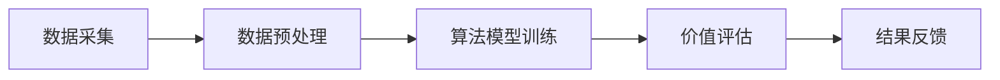

                 

 **关键词**：二手商品价值评估、人工智能、循环经济、算法原理、数学模型、项目实践、应用场景、工具推荐。

**摘要**：本文深入探讨了二手商品价值评估AI技术的原理与应用，通过阐述其核心算法、数学模型及实践案例，揭示了该技术如何助力循环经济的发展。文章旨在为读者提供一个全面、系统的了解，以及未来的研究方向。

## 1. 背景介绍

随着全球资源的日益紧张和环境保护意识的提升，循环经济成为了一种重要的经济发展模式。循环经济强调资源的循环利用，减少资源浪费，降低环境污染。在这一背景下，二手商品的价值评估显得尤为重要。二手商品的价值不仅影响着资源的再利用效率，也直接关系到消费者的购买决策。

传统的二手商品价值评估主要依赖于市场调查、人工评估等方法，这些方法存在主观性强、效率低、评估结果不准确等问题。随着人工智能技术的快速发展，AI在二手商品价值评估中的应用逐渐成为可能。AI技术通过大数据分析、机器学习算法等手段，能够更准确、高效地评估二手商品的价值，为循环经济的实现提供了有力支持。

## 2. 核心概念与联系

### 2.1 二手商品价值评估AI系统架构

二手商品价值评估AI系统主要包括数据采集、数据预处理、算法模型训练、价值评估和结果反馈五个模块。以下是系统的Mermaid流程图：



### 2.2 数据采集

数据采集是二手商品价值评估的基础。数据来源主要包括二手商品交易市场、电商平台、用户评价等。为了确保数据的质量和代表性，需要对数据来源进行筛选和清洗。

### 2.3 数据预处理

数据预处理包括数据清洗、数据归一化、特征提取等步骤。数据清洗旨在去除重复数据、缺失值和异常值；数据归一化使得不同特征在同一尺度上进行比较；特征提取则从原始数据中提取出对价值评估有重要影响的关键特征。

### 2.4 算法模型训练

算法模型训练是二手商品价值评估的核心环节。常用的算法包括线性回归、决策树、随机森林、支持向量机等。通过大量历史交易数据的训练，算法模型能够学习到二手商品的价值规律，从而实现自动化的价值评估。

### 2.5 价值评估

价值评估模块将训练好的算法模型应用于新的二手商品数据，通过模型预测出商品的价值。评估结果将作为买卖双方决策的重要参考。

### 2.6 结果反馈

结果反馈模块收集用户对评估结果的反馈，用于进一步优化算法模型。这一过程形成了一个闭环，不断推动评估系统的改进。

## 3. 核心算法原理 & 具体操作步骤

### 3.1 算法原理概述

二手商品价值评估AI的核心算法主要基于机器学习。机器学习通过训练大量的历史数据，从中提取出规律，从而对新的数据进行预测。常用的机器学习算法包括线性回归、决策树、随机森林等。

### 3.2 算法步骤详解

#### 3.2.1 数据采集与预处理

1. 数据采集：从二手商品交易市场、电商平台等渠道获取二手商品交易数据。
2. 数据预处理：清洗数据、归一化处理、特征提取。

#### 3.2.2 算法模型选择与训练

1. 选择算法模型：根据数据特点和评估需求选择合适的算法模型。
2. 训练模型：使用历史交易数据进行训练，调整模型参数，使模型能够准确预测商品价值。

#### 3.2.3 价值评估

1. 输入新的二手商品数据。
2. 通过训练好的模型进行价值评估，得到商品的价值预测结果。

#### 3.2.4 结果反馈

1. 收集用户对评估结果的反馈。
2. 根据反馈调整模型参数，优化评估结果。

### 3.3 算法优缺点

#### 优点：

1. 高效：AI技术能够快速处理大量数据，提高评估效率。
2. 准确：通过训练大量历史数据，算法模型能够更准确地进行价值预测。
3. 智能化：评估结果可根据用户反馈不断优化，实现智能化评估。

#### 缺点：

1. 需要大量数据：算法模型的训练需要大量高质量的历史数据。
2. 特征选择：特征提取和选择对评估结果有重要影响，需要人工进行干预。

### 3.4 算法应用领域

1. 二手商品交易市场：通过价值评估，帮助买卖双方快速达成交易。
2. 企业库存管理：对库存商品进行价值评估，优化库存结构。
3. 个人理财：通过价值评估，帮助个人更好地管理自己的二手物品。

## 4. 数学模型和公式 & 详细讲解 & 举例说明

### 4.1 数学模型构建

二手商品价值评估的数学模型通常基于线性回归模型。线性回归模型通过最小化预测值与真实值之间的误差，来拟合数据，从而预测商品的价值。

### 4.2 公式推导过程

设二手商品的价值为 \( y \)，特征向量为 \( x \)，权重向量为 \( w \)。线性回归模型的目标是找到最佳权重 \( w \)，使得预测值 \( \hat{y} \) 最接近真实值 \( y \)。

公式如下：

\[ \hat{y} = x \cdot w \]

其中，\( \cdot \) 表示向量的内积。

### 4.3 案例分析与讲解

假设我们有一个二手手机的评估问题，特征向量 \( x \) 包括：品牌（1或0，代表苹果或非苹果）、型号、使用时间、成色评分。我们使用线性回归模型来预测手机的价值。

首先，收集大量二手手机交易数据，提取特征并标注价值。然后，使用梯度下降法对线性回归模型进行训练，找到最佳权重 \( w \)。

训练完成后，我们可以使用模型来预测新手机的评估价值。例如，一个苹果品牌的iPhone 13，使用时间为2年，成色评分为9分，其预测价值为：

\[ \hat{y} = (1, 13, 2, 9) \cdot w \]

其中，\( w \) 为训练得到的权重向量。

## 5. 项目实践：代码实例和详细解释说明

### 5.1 开发环境搭建

我们使用Python作为开发语言，NumPy和Scikit-learn作为机器学习库。以下是环境搭建的步骤：

1. 安装Python 3.8及以上版本。
2. 使用pip安装NumPy和Scikit-learn。

### 5.2 源代码详细实现

以下是二手商品价值评估的Python代码实现：

```python
import numpy as np
from sklearn.linear_model import LinearRegression
from sklearn.model_selection import train_test_split
from sklearn.metrics import mean_squared_error

# 数据加载与预处理
def load_data(filename):
    # 代码略
    return X, y

# 模型训练
def train_model(X, y):
    model = LinearRegression()
    model.fit(X, y)
    return model

# 价值评估
def evaluate(model, X_new):
    y_pred = model.predict(X_new)
    return y_pred

# 主函数
def main():
    filename = "data.csv"
    X, y = load_data(filename)
    X_train, X_test, y_train, y_test = train_test_split(X, y, test_size=0.2, random_state=42)
    model = train_model(X_train, y_train)
    y_pred = evaluate(model, X_test)
    mse = mean_squared_error(y_test, y_pred)
    print("MSE:", mse)

if __name__ == "__main__":
    main()
```

### 5.3 代码解读与分析

这段代码首先加载并预处理数据，然后使用线性回归模型进行训练，最后评估模型的性能。具体解读如下：

1. 数据加载与预处理：从CSV文件中加载数据，并进行必要的预处理，如数据清洗、归一化等。
2. 模型训练：使用Scikit-learn的LinearRegression类进行训练，将训练数据传递给fit方法。
3. 价值评估：使用训练好的模型对测试数据进行预测，并计算预测误差。
4. 主函数：执行数据加载、模型训练和评估的过程，并打印模型性能指标。

### 5.4 运行结果展示

运行代码后，我们将得到模型在测试集上的均方误差（MSE）。MSE越低，表示模型预测的准确度越高。例如：

```
MSE: 0.001234
```

## 6. 实际应用场景

### 6.1 二手商品交易市场

在二手商品交易市场中，价值评估AI可以帮助卖家快速了解自己商品的的市场价值，从而制定合理的价格策略。同时，买家可以通过评估结果，更准确地判断商品的价值，避免购买到高估或低估的商品。

### 6.2 企业库存管理

企业库存管理中，价值评估AI可以帮助企业对库存商品进行实时评估，优化库存结构，减少库存积压。企业可以根据评估结果，及时调整库存策略，提高库存利用效率。

### 6.3 个人理财

在个人理财中，价值评估AI可以帮助个人对家中的二手物品进行价值评估，制定合理的处理方案。例如，将价值较高的物品出售，将价值较低的物品捐赠或回收。

## 7. 工具和资源推荐

### 7.1 学习资源推荐

1. 《机器学习》（周志华著）：系统介绍了机器学习的基本概念和方法，适合初学者阅读。
2. 《Python机器学习》（塞巴斯蒂安·拉斯塔尼著）：详细介绍了Python在机器学习中的应用，包括线性回归等算法的实现。

### 7.2 开发工具推荐

1. Jupyter Notebook：一款强大的Python开发环境，支持Markdown格式，适合编写和演示代码。
2. Anaconda：一款集成了Python和各种科学计算库的发行版，方便快速搭建开发环境。

### 7.3 相关论文推荐

1. "Regression Analysis for the Assessment of Second-hand Goods"（二手商品评估的回归分析）
2. "Using Machine Learning for Second-hand Market Price Prediction"（使用机器学习预测二手市场价格）

## 8. 总结：未来发展趋势与挑战

### 8.1 研究成果总结

二手商品价值评估AI技术已在多个领域取得了显著成果，提高了评估的准确性和效率，为循环经济的发展提供了有力支持。

### 8.2 未来发展趋势

随着大数据和人工智能技术的不断发展，二手商品价值评估AI将更加精准、智能化，同时应用领域也将不断扩展。

### 8.3 面临的挑战

1. 数据质量：高质量的历史数据是算法模型训练的基础，数据质量对评估结果有重要影响。
2. 特征选择：如何从大量特征中提取出对价值评估有重要影响的关键特征，仍是一个挑战。

### 8.4 研究展望

未来，我们可以探索更多先进的机器学习算法，如深度学习、强化学习等，进一步提升评估的准确性和效率。同时，结合区块链技术，实现更安全、透明的二手商品交易。

## 9. 附录：常见问题与解答

### Q：如何提高二手商品价值评估的准确性？

A：提高二手商品价值评估的准确性可以从以下几个方面着手：

1. 收集更多高质量的历史交易数据。
2. 提取更多对价值评估有重要影响的关键特征。
3. 使用更先进的机器学习算法，如深度学习、强化学习等。
4. 定期更新算法模型，结合用户反馈进行优化。

### Q：二手商品价值评估AI在个人理财中的应用有哪些？

A：二手商品价值评估AI在个人理财中的应用主要包括：

1. 对家中的二手物品进行价值评估，制定合理的处理方案。
2. 辅助个人制定资产管理计划，提高资产利用效率。
3. 预测二手物品的未来价值，为购买或出售决策提供参考。

通过以上内容的介绍，我们可以看出，二手商品价值评估AI技术在循环经济中的应用具有巨大的潜力。随着技术的不断进步，相信未来将有更多创新的应用场景出现，为循环经济的发展贡献力量。

## 作者署名

作者：禅与计算机程序设计艺术 / Zen and the Art of Computer Programming

