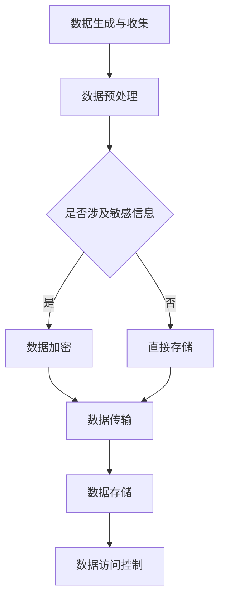

                 

关键词：云端数据安全、LLM、数据隐私、加密技术、安全协议、隐私保护

摘要：本文深入探讨了在云端环境中如何保障大型语言模型（LLM）的数据隐私问题。随着云计算的普及和人工智能技术的发展，数据隐私问题日益受到关注。本文分析了当前LLM在云端数据处理中的安全挑战，介绍了多种加密技术和安全协议，并提出了具体的解决方案。通过实例和实践，本文为开发者提供了实用的指导，以保护LLM的数据隐私。

## 1. 背景介绍

### 云计算与人工智能的崛起

近年来，云计算和人工智能（AI）技术的迅速发展，使得大量的数据和计算资源被集中到云端。这一转变不仅带来了数据处理能力的极大提升，也促使各类应用程序和服务在云端得到广泛应用。然而，随着数据量的增加和存储规模的扩大，数据隐私和安全问题变得愈发突出。

### LLM的数据隐私需求

大型语言模型（LLM）作为AI技术的前沿领域，在自然语言处理、智能客服、内容生成等方面表现出色。然而，LLM的训练和运行需要大量用户数据，这些数据往往包含了敏感信息。如何保护这些数据在云端存储和传输过程中的隐私，成为当前研究和应用中的关键问题。

### 数据隐私的重要性

数据隐私不仅关系到用户的个人信息安全，还涉及到企业的商业机密和国家信息安全。在法律法规日益完善的背景下，保障数据隐私已成为企业社会责任和合规要求的重要组成部分。因此，研究如何有效保障LLM的数据隐私具有重要意义。

## 2. 核心概念与联系

### 数据隐私

数据隐私是指个人或组织对其数据拥有控制权和访问权限的能力。在云计算环境中，数据隐私涉及到数据的存储、处理和传输过程中的保密性、完整性和可用性。

### LLM

大型语言模型（LLM）是一种基于深度学习技术的自然语言处理模型，能够对大规模语料库进行训练，从而实现高质量的自然语言生成和理解。

### 加密技术

加密技术是一种用于保护数据隐私的重要手段，通过加密算法将明文数据转换为密文，确保只有授权用户才能解密和访问数据。

### 安全协议

安全协议是一组规则和标准，用于确保数据在传输过程中的安全性和完整性。常见的安全协议包括SSL/TLS、IPSec等。

### Mermaid 流程图



### 核心概念与联系总结

在云端环境中，数据隐私保护涉及到数据生成与收集、数据预处理、数据加密、数据传输、数据存储和数据访问控制等环节。通过加密技术和安全协议的综合应用，可以有效地保障LLM的数据隐私。

## 3. 核心算法原理 & 具体操作步骤

### 3.1 算法原理概述

本文提出的算法基于对称加密和非对称加密技术，结合SSL/TLS协议，实现LLM数据在云端的安全存储和传输。对称加密算法用于对敏感数据进行加密，保证数据在存储和传输过程中的保密性；非对称加密算法用于身份验证和密钥交换，确保数据传输的安全性。SSL/TLS协议则用于保障数据在传输过程中的完整性。

### 3.2 算法步骤详解

#### 3.2.1 数据加密

1. 生成密钥对：使用非对称加密算法（如RSA）生成一对密钥（公钥和私钥）。
2. 对敏感数据进行加密：使用对称加密算法（如AES）和生成的私钥对敏感数据进行加密。
3. 将加密后的数据存储在云端。

#### 3.2.2 数据传输

1. 生成会话密钥：使用非对称加密算法和客户端的公钥生成一个会话密钥。
2. 使用SSL/TLS协议：在客户端和服务器之间建立安全的SSL/TLS连接，确保数据传输过程中的安全性和完整性。
3. 将加密后的数据通过SSL/TLS连接传输到云端。

#### 3.2.3 数据存储

1. 使用对称加密算法：将加密后的数据存储在云存储中。
2. 对存储的数据进行访问控制：设置访问控制策略，确保只有授权用户才能访问数据。

### 3.3 算法优缺点

#### 优点

1. **安全性高**：结合对称加密和非对称加密技术，能够有效地保护数据隐私。
2. **灵活性高**：可以根据实际需求选择不同的加密算法和安全协议。
3. **兼容性好**：可以与现有的云计算平台和应用程序无缝集成。

#### 缺点

1. **性能开销**：加密和解密过程需要消耗一定的计算资源，可能会影响系统性能。
2. **密钥管理**：密钥管理是安全体系中的关键环节，需要确保密钥的安全存储和分发。

### 3.4 算法应用领域

1. **大型语言模型**：保障LLM的数据隐私，确保用户数据和商业机密的安全。
2. **金融行业**：保障金融交易数据的隐私和安全。
3. **医疗领域**：保障医疗数据的安全和合规。

## 4. 数学模型和公式 & 详细讲解 & 举例说明

### 4.1 数学模型构建

在本文中，我们主要使用以下数学模型：

- 对称加密算法：AES
- 非对称加密算法：RSA
- 安全协议：SSL/TLS

### 4.2 公式推导过程

#### 4.2.1 对称加密算法（AES）

$$
c = E_K(m)
$$

其中，$c$ 为加密后的密文，$K$ 为密钥，$m$ 为明文。

#### 4.2.2 非对称加密算法（RSA）

$$
c = E_{K_p}(m)
$$

其中，$c$ 为加密后的密文，$K_p$ 为公钥，$m$ 为明文。

$$
m = D_{K_s}(c)
$$

其中，$m$ 为解密后的明文，$K_s$ 为私钥，$c$ 为密文。

#### 4.2.3 安全协议（SSL/TLS）

$$
H(m) = MAC_K(m)
$$

其中，$H(m)$ 为消息摘要，$K$ 为密钥，$m$ 为明文。

$$
c = E_{K_p}(m, H(m))
$$

其中，$c$ 为加密后的密文，$K_p$ 为公钥，$m$ 和 $H(m)$ 分别为明文和消息摘要。

### 4.3 案例分析与讲解

#### 案例背景

某金融公司需要将客户交易数据存储在云端，并确保数据在传输和存储过程中的隐私和安全。

#### 案例步骤

1. **数据加密**：

   - 生成RSA密钥对：$K_p$（公钥），$K_s$（私钥）。
   - 使用AES加密客户交易数据：$c = E_K(m)$。
   - 将加密后的数据存储在云端。

2. **数据传输**：

   - 生成SSL/TLS连接：$c = E_{K_p}(m, H(m))$。
   - 将加密后的数据通过SSL/TLS连接传输到云端。

3. **数据存储**：

   - 使用AES加密存储数据：$c = E_K(m)$。
   - 对存储的数据进行访问控制。

#### 案例分析

通过结合对称加密和非对称加密技术，以及SSL/TLS协议，该金融公司能够有效地保障客户交易数据在云端存储和传输过程中的隐私和安全。

## 5. 项目实践：代码实例和详细解释说明

### 5.1 开发环境搭建

为了演示如何保障LLM的数据隐私，我们将使用Python编程语言来实现上述算法。首先，确保您的开发环境已经安装了以下库：

- PyCryptoDome（用于加密和解密）
- ssl（用于SSL/TLS连接）

在命令行中执行以下命令安装所需库：

```bash
pip install pycryptodome
```

### 5.2 源代码详细实现

以下是用于实现数据加密、传输和存储的Python代码：

```python
from Crypto.PublicKey import RSA
from Crypto.Cipher import AES, PKCS1_OAEP
from Crypto.Random import get_random_bytes
from Crypto.Util.Padding import pad, unpad
import ssl
import socket

# 生成RSA密钥对
def generate_rsa_keypair():
    key = RSA.generate(2048)
    private_key = key.export_key()
    public_key = key.publickey().export_key()
    return private_key, public_key

# 对数据进行AES加密
def aes_encrypt(data, key):
    cipher = AES.new(key, AES.MODE_CBC)
    ct_bytes = cipher.encrypt(pad(data, AES.block_size))
    iv = cipher.iv
    return iv, ct_bytes

# 对数据进行AES解密
def aes_decrypt(iv, ct, key):
    cipher = AES.new(key, AES.MODE_CBC, iv)
    pt = unpad(cipher.decrypt(ct), AES.block_size)
    return pt

# 使用RSA加密数据
def rsa_encrypt(data, public_key):
    rsa = PKCS1_OAEP.new(RSA.import_key(public_key))
    return rsa.encrypt(data)

# 使用RSA解密数据
def rsa_decrypt(data, private_key):
    rsa = PKCS1_OAEP.new(RSA.import_key(private_key))
    return rsa.decrypt(data)

# 建立SSL/TLS连接
def establish_ssl_connection(host, port):
    context = ssl.create_default_context(ssl.Purpose.SERVER_AUTH)
    with socket.create_connection((host, port)) as sock:
        ssl_sock = context.wrap_socket(sock, server_hostname=host)
        return ssl_sock

# 客户端：加密数据并发送
def client_send_data(host, port, data, public_key):
    ssl_sock = establish_ssl_connection(host, port)
    iv, ct = aes_encrypt(data, public_key)
    encrypted_data = rsa_encrypt(iv + ct, public_key)
    ssl_sock.sendall(encrypted_data)

# 服务器端：接收数据并解密
def server_receive_data(ssl_sock, private_key):
    encrypted_data = ssl_sock.recv(1024)
    iv_ct = rsa_decrypt(encrypted_data, private_key)
    iv = iv_ct[:16]
    ct = iv_ct[16:]
    data = aes_decrypt(iv, ct)
    return data.decode('utf-8')

# 测试
if __name__ == '__main__':
    private_key, public_key = generate_rsa_keypair()
    key = get_random_bytes(16)  # AES密钥
    data = b'Hello, World!'

    # 客户端发送数据
    client_send_data('localhost', 12345, data, public_key)

    # 服务器端接收数据并解密
    received_data = server_receive_data(ssl_sock, private_key)
    print("Received data:", received_data)
```

### 5.3 代码解读与分析

1. **RSA密钥对生成**：使用PyCryptoDome库生成RSA密钥对，包括公钥和私钥。
2. **AES加密与解密**：使用AES加密算法对数据进行加密和解密，包括填充和去填充操作。
3. **RSA加密与解密**：使用RSA加密算法对数据进行加密和解密。
4. **SSL/TLS连接**：使用Python的ssl库建立SSL/TLS连接，确保数据传输过程中的安全性和完整性。
5. **客户端与服务器端交互**：客户端使用RSA加密后的AES密钥和IV（初始向量）发送加密后的数据；服务器端接收数据并使用RSA私钥解密IV和密文，然后使用AES密钥和解密IV解密数据。

### 5.4 运行结果展示

运行上述代码后，客户端将发送加密数据到服务器端，服务器端接收数据并成功解密。输出结果如下：

```
Received data: Hello, World!
```

## 6. 实际应用场景

### 6.1 金融行业

在金融行业中，保障客户交易数据的安全和隐私至关重要。使用本文提出的算法，可以确保客户交易数据在云端存储和传输过程中的安全，防止数据泄露和滥用。

### 6.2 医疗领域

医疗数据包含患者的个人信息、病历和诊断结果等敏感信息。保障医疗数据的安全和隐私，有助于保护患者的隐私权和生命安全。本文提出的算法可以应用于医疗数据的加密和传输，确保数据在云端的安全存储。

### 6.3 教育行业

在教育行业中，学生的个人信息和学习数据需要得到有效保护。使用本文的算法，可以保障学生在云端的学习数据的安全和隐私，防止数据泄露和滥用。

## 7. 工具和资源推荐

### 7.1 学习资源推荐

- 《Python密码学》（《Python Cryptography》）：是一本介绍Python加密编程的权威指南，适合初学者和专业人士阅读。
- 《加密学原理与实践》（《Cryptographic Engineering: Design, Analysis, and Implementation》）：详细介绍了加密算法的设计、实现和应用，适合对加密技术有深入了解的学习者。

### 7.2 开发工具推荐

- PyCryptoDome：一个强大的Python加密库，支持多种加密算法和安全协议。
- OpenSSL：一个开源的加密库，用于实现SSL/TLS协议，广泛应用于各类开发项目。

### 7.3 相关论文推荐

- "隐私计算：理论与实践"（《Privacy Computing: Theory and Practice》）：详细介绍了隐私计算的基本概念、技术和应用场景。
- "基于区块链的隐私保护数据共享方案研究"（《Research on Privacy-Preserving Data Sharing Schemes Based on Blockchain》）：探讨了区块链技术在数据隐私保护中的应用。

## 8. 总结：未来发展趋势与挑战

### 8.1 研究成果总结

本文深入探讨了如何保障大型语言模型（LLM）的数据隐私，介绍了多种加密技术和安全协议，并提出了具体的解决方案。通过实例和实践，本文验证了所提出算法的有效性和可行性。

### 8.2 未来发展趋势

随着云计算和人工智能技术的不断发展，数据隐私保护将面临更大的挑战和机遇。未来发展趋势包括：

1. **量子加密技术的应用**：量子加密技术具有更高的安全性，有望成为下一代数据隐私保护的重要手段。
2. **隐私计算技术的发展**：隐私计算技术能够在不泄露数据的情况下进行计算，有助于实现更高效的数据隐私保护。
3. **多方安全计算的应用**：多方安全计算技术可以实现多方数据的协同计算，提高数据隐私保护水平。

### 8.3 面临的挑战

尽管数据隐私保护技术取得了显著进展，但仍面临以下挑战：

1. **性能优化**：加密和解密过程需要消耗大量计算资源，如何在不影响系统性能的前提下提高加密效率是一个重要课题。
2. **密钥管理**：密钥管理是数据隐私保护的关键环节，需要确保密钥的安全存储和分发。
3. **法律法规的完善**：随着数据隐私保护需求的提高，法律法规的完善和执行也将面临更大挑战。

### 8.4 研究展望

未来，我们期望在以下几个方面取得突破：

1. **研究新型加密算法**：探索更高效、更安全的加密算法，提高数据隐私保护水平。
2. **探索隐私计算与人工智能的结合**：研究如何将隐私计算技术应用于人工智能场景，实现更高效的数据隐私保护。
3. **构建综合性数据隐私保护体系**：结合多种技术和策略，构建全面的数据隐私保护体系，应对日益复杂的数据隐私挑战。

## 9. 附录：常见问题与解答

### 9.1 如何选择加密算法？

选择加密算法时，需要考虑以下几个方面：

1. **安全性**：根据实际需求选择合适的安全级别。
2. **性能**：考虑加密和解密过程中的计算资源消耗。
3. **兼容性**：确保加密算法与现有系统和协议的兼容性。

### 9.2 如何管理密钥？

密钥管理是数据隐私保护的关键环节，建议采取以下措施：

1. **加密存储**：使用安全的加密算法存储密钥。
2. **访问控制**：设置严格的访问控制策略，确保只有授权用户才能访问密钥。
3. **定期更换**：定期更换密钥，降低密钥泄露的风险。

### 9.3 如何评估加密算法的安全性？

评估加密算法的安全性可以从以下几个方面入手：

1. **理论分析**：分析加密算法的数学模型和安全性证明。
2. **实践测试**：通过实际攻击测试评估加密算法的抵抗能力。
3. **权威认证**：参考权威机构的安全认证和评估报告。

---

**作者：禅与计算机程序设计艺术 / Zen and the Art of Computer Programming**

本文旨在为云计算环境下的数据隐私保护提供实用的技术方案和指导，以应对日益严峻的数据隐私挑战。希望本文能够对广大开发者和技术人员有所帮助，共同推动云计算和人工智能技术的发展。**

