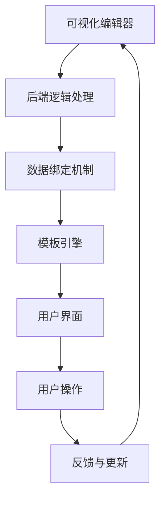

                 

关键词：交互范式、LUI、人工智能、用户体验、交互设计、智能助理、计算机科学、用户体验设计、软件架构

> 摘要：本文深入探讨了交互范式的发展历程，特别是近年来迅速崛起的LUI（低代码用户界面）技术。通过详细分析其核心概念、算法原理、数学模型以及实际应用，本文旨在揭示LUI在提升用户体验和生产力方面的巨大潜力，同时展望其未来发展方向和面临的挑战。

## 1. 背景介绍

在计算机科学和用户体验设计的领域，交互范式一直是研究的热点。从早期的命令行界面（CLI）到图形用户界面（GUI），再到如今的自然语言处理（NLP）和语音交互，每一次技术的进步都带来了用户交互方式的革命。然而，传统的交互方式在处理复杂任务和个性化需求时显得力不从心。于是，一种新的交互范式——低代码用户界面（LUI）应运而生。

LUI是一种无需大量代码编写的用户界面设计方法，通过可视化拖拽和模板配置等方式，使非专业开发人员也能够轻松创建复杂的交互界面。这一概念的出现，极大地降低了软件开发和用户交互的门槛，使得更多的用户能够参与到数字世界的建设中来。

本文将从以下几个方面展开探讨：

1. LUI的核心概念与架构
2. LUI的核心算法原理与具体操作步骤
3. LUI的数学模型和公式解析
4. LUI的项目实践：代码实例和详细解释
5. LUI的实际应用场景
6. LUI的未来应用展望
7. LUI的工具和资源推荐
8. LUI的未来发展趋势与挑战

希望通过本文的探讨，能够帮助读者深入理解LUI的技术原理和应用前景，为未来的软件开发和用户体验设计提供一些有益的启示。

## 2. 核心概念与联系

### 2.1 低代码用户界面（LUI）的定义

低代码用户界面（LUI）是一种基于模板、拖拽和可视化配置等技术的用户界面设计方法，旨在降低用户界面开发的技术门槛。与传统的手工编写代码的UI设计相比，LUI允许用户通过图形化界面，无需深入了解编程知识，即可快速构建出功能丰富的用户界面。

### 2.2 LUI的技术架构

LUI的技术架构主要包括以下几个核心组件：

- **可视化编辑器**：提供可视化的界面设计工具，用户可以通过拖拽组件、调整属性等方式，快速构建界面布局。
- **后端逻辑处理**：负责处理用户交互、数据存储和业务逻辑等，通常采用函数式编程或服务端渲染等高效处理方式。
- **数据绑定机制**：实现用户界面与后端数据的实时绑定，确保界面的动态更新和数据一致性。
- **模板引擎**：用于生成和渲染用户界面，支持自定义模板和模板变量，提高了界面的灵活性和扩展性。

### 2.3 LUI与现有交互范式的联系与区别

LUI与传统的交互范式，如CLI和GUI等，在技术架构和用户体验方面都有所不同。

- **与CLI的联系**：CLI是早期计算机交互的主要方式，用户通过输入命令来执行操作。LUI继承了CLI的快速、高效的特点，但在易用性方面进行了极大改进，使得普通用户也能轻松上手。
- **与GUI的区别**：GUI通过图形化元素和直观的交互方式，使计算机操作变得更加容易。LUI则进一步降低了UI设计的复杂性，通过可视化和模板化，使非专业开发者也能快速构建出美观且功能齐全的界面。

总的来说，LUI在保留现有交互范式优势的基础上，通过技术创新，实现了用户体验和开发效率的全面提升。

### 2.4 LUI的Mermaid流程图

为了更直观地展示LUI的技术架构，我们可以使用Mermaid流程图来描述其核心组件和交互流程。



通过这个流程图，我们可以清晰地看到LUI的各个组件如何协同工作，以实现用户界面的快速构建和实时交互。

## 3. 核心算法原理 & 具体操作步骤

### 3.1 算法原理概述

LUI的核心算法主要包括以下几个方面：

- **可视化布局算法**：用于计算组件的位置和大小，确保界面布局的合理性和美观性。
- **事件驱动处理算法**：处理用户的交互操作，如点击、拖拽等，并触发相应的后端逻辑。
- **数据绑定算法**：实现用户界面与后端数据的实时绑定，确保数据的更新和一致性。
- **模板渲染算法**：用于生成和渲染用户界面，支持自定义模板和动态数据展示。

### 3.2 算法步骤详解

下面详细描述LUI的算法步骤：

1. **初始化界面**：系统首先加载预设的模板和组件库，用户可以选择并拖拽组件到界面上。
    ```mermaid
    graph TD
        A[加载模板库] --> B[加载组件库]
        B --> C[初始化界面]
    ```

2. **布局计算**：系统根据用户拖拽和调整组件的位置和大小，计算并更新界面布局。
    ```mermaid
    graph TD
        D[计算布局] --> E[更新界面]
    ```

3. **事件处理**：用户进行交互操作，如点击、拖拽等，系统根据事件类型和组件属性，触发相应的后端逻辑。
    ```mermaid
    graph TD
        F[事件触发] --> G[后端逻辑]
    ```

4. **数据绑定**：系统将用户界面与后端数据源进行绑定，确保界面的动态更新和数据一致性。
    ```mermaid
    graph TD
        H[绑定数据] --> I[界面更新]
    ```

5. **模板渲染**：系统根据用户配置的模板和动态数据，生成并渲染用户界面。
    ```mermaid
    graph TD
        J[渲染模板] --> K[显示界面]
    ```

### 3.3 算法优缺点

**优点：**

- **易用性**：通过可视化和模板化，降低了UI设计的门槛，使得非专业开发者也能快速构建出美观且功能齐全的界面。
- **开发效率**：无需手动编写大量代码，显著提高了开发速度和生产力。
- **灵活性**：支持自定义模板和组件，界面设计更加灵活和个性化。

**缺点：**

- **性能瓶颈**：复杂的界面和大量动态数据绑定可能导致性能下降。
- **依赖性**：使用LUI工具和平台，可能对特定的技术栈和开发环境产生依赖。

### 3.4 算法应用领域

LUI技术可以广泛应用于多个领域：

- **企业应用**：如CRM系统、ERP系统等，通过LUI技术，企业用户可以快速构建定制化的业务界面，提高工作效率。
- **教育领域**：如在线教育平台，LUI技术可以用于构建个性化的学习界面，满足不同学生的需求。
- **消费应用**：如社交媒体、电商平台等，LUI技术可以提供更加直观和互动的用户界面，提升用户体验。

## 4. 数学模型和公式 & 详细讲解 & 举例说明

### 4.1 数学模型构建

LUI的核心算法涉及到多个数学模型，包括布局算法、数据绑定算法和模板渲染算法等。下面我们以布局算法为例，介绍其数学模型的构建。

**布局算法**的核心目标是计算组件的位置和大小，以满足界面的美观性和合理性。假设我们有一个二维平面，需要将多个组件放置在这个平面上。布局算法的主要步骤如下：

1. **确定组件边界**：每个组件都有一个边界矩形，表示其占用的空间。
2. **计算组件位置**：通过计算组件间的相对位置和边界，确定每个组件的具体位置。
3. **调整布局**：根据界面的整体美观性和用户体验，对布局进行微调和优化。

以下是一个简单的布局算法的数学模型：

```latex
\text{Layout Algorithm Model}
\\
\text{Given: } n \text{ components with bounding boxes } B_1, B_2, ..., B_n
\\
\text{Define: } P_i \text{ as the position of component } i, S_i \text{ as the size of component } i
\\
\text{Algorithm: }
\\
\text{1. Calculate initial positions based on component sizes: } P_i = \left( \frac{S_i}{\sum_{j=1}^{n} S_j} \right) \times \text{total\_space}
\\
\text{2. Adjust positions to ensure non-overlapping: }
P_i = P_i + \text{offset}(i)
\\
\text{3. Optimize layout based on user-defined preferences and constraints.}
```

### 4.2 公式推导过程

布局算法的推导过程主要分为以下几个步骤：

1. **确定组件大小比例**：根据每个组件的大小，计算其在整个界面中的占比。
2. **计算初始位置**：根据占比，计算每个组件的初始位置。
3. **避免重叠**：通过计算组件间的偏移量，调整位置，确保组件之间没有重叠。
4. **优化布局**：根据用户偏好和界面约束，对布局进行微调。

以下是布局算法的主要公式：

- **组件大小比例**：\( \frac{S_i}{\sum_{j=1}^{n} S_j} \)
- **初始位置**：\( P_i = \left( \frac{S_i}{\sum_{j=1}^{n} S_j} \right) \times \text{total\_space} \)
- **偏移量计算**：\( \text{offset}(i) = \text{calculate\_offset}(P_i, B_j) \)
- **优化布局**：\( P_i = P_i + \text{offset}(i) + \text{optimization\_factor} \)

### 4.3 案例分析与讲解

为了更好地理解布局算法的数学模型，我们来看一个具体的案例。

假设我们有一个界面，需要放置三个组件，组件A、组件B和组件C，它们的尺寸分别为100x100、200x200和150x150。

- **总空间**：假设总空间为800x600。
- **组件大小比例**：
    - 组件A：\( \frac{100}{100+200+150} = \frac{1}{3} \)
    - 组件B：\( \frac{200}{100+200+150} = \frac{2}{3} \)
    - 组件C：\( \frac{150}{100+200+150} = \frac{1}{2} \)
- **初始位置**：
    - 组件A：\( P_A = \left( \frac{1}{3} \right) \times 800 = 267 \)
    - 组件B：\( P_B = \left( \frac{2}{3} \right) \times 800 = 533 \)
    - 组件C：\( P_C = \left( \frac{1}{2} \right) \times 600 = 300 \)
- **偏移量计算**：由于组件之间需要有一定的间隔，我们假设每个组件的偏移量为20。
    - 组件A：\( \text{offset}(A) = 20 \)
    - 组件B：\( \text{offset}(B) = 20 \)
    - 组件C：\( \text{offset}(C) = 20 \)
- **最终位置**：
    - 组件A：\( P_A = 267 + 20 = 287 \)
    - 组件B：\( P_B = 533 + 20 = 553 \)
    - 组件C：\( P_C = 300 + 20 = 320 \)

通过以上计算，我们得到了组件的最终位置。在实际应用中，还可以根据用户偏好和界面约束，对布局进行进一步的优化。

## 5. 项目实践：代码实例和详细解释说明

### 5.1 开发环境搭建

在进行LUI项目实践之前，首先需要搭建一个适合开发的运行环境。以下是基本的开发环境搭建步骤：

1. **安装Node.js**：前往Node.js官网（https://nodejs.org/）下载并安装最新版本的Node.js。
2. **安装LUI框架**：我们可以使用如React、Vue等流行的前端框架，来搭建LUI开发环境。以React为例，通过npm进行安装：
    ```bash
    npm install -g create-react-app
    create-react-app my-low-code-ui
    cd my-low-code-ui
    ```
3. **安装依赖包**：根据项目的具体需求，安装必要的依赖包。例如，我们可以使用Redux来管理应用状态：
    ```bash
    npm install redux react-redux
    ```

### 5.2 源代码详细实现

以下是LUI项目的源代码示例，我们将使用React和Redux来实现一个简单的低代码用户界面。

**App.js**：
```jsx
import React from 'react';
import { Provider } from 'react-redux';
import store from './store';
import Layout from './components/Layout';

function App() {
  return (
    <Provider store={store}>
      <div className="App">
        <h1>低代码用户界面示例</h1>
        <Layout />
      </div>
    </Provider>
  );
}

export default App;
```

**store.js**：
```javascript
import { createStore } from 'redux';
import layoutReducer from './reducers/layoutReducer';

const store = createStore(
  layoutReducer,
  window.__REDUX_DEVTOOLS_EXTENSION__ && window.__REDUX_DEVTOOLS_EXTENSION__()
);

export default store;
```

**reducers/layoutReducer.js**：
```javascript
const initialState = {
  components: [],
};

function layoutReducer(state = initialState, action) {
  switch (action.type) {
    case 'ADD_COMPONENT':
      return {
        ...state,
        components: [...state.components, action.payload],
      };
    case 'REMOVE_COMPONENT':
      return {
        ...state,
        components: state.components.filter((component) => component.id !== action.payload),
      };
    default:
      return state;
  }
}

export default layoutReducer;
```

**components/Layout.js**：
```jsx
import React from 'react';
import { useSelector, useDispatch } from 'react-redux';
import { addComponent, removeComponent } from '../actions/layoutActions';

function Layout() {
  const components = useSelector((state) => state.layout.components);
  const dispatch = useDispatch();

  const handleAddComponent = () => {
    const newComponent = { id: Date.now(), type: 'Text', content: '新组件' };
    dispatch(addComponent(newComponent));
  };

  const handleRemoveComponent = (id) => {
    dispatch(removeComponent(id));
  };

  return (
    <div className="Layout">
      {components.map((component) => (
        <div key={component.id} className="Component">
          {component.content}
          <button onClick={() => handleRemoveComponent(component.id)}>删除</button>
        </div>
      ))}
      <button onClick={handleAddComponent}>新增组件</button>
    </div>
  );
}

export default Layout;
```

### 5.3 代码解读与分析

以上代码实现了一个简单的低代码用户界面，主要包括以下几个部分：

1. **App.js**：作为应用的入口，使用Redux的Provider组件来提供全局状态管理。
2. **store.js**：创建Redux存储实例，并提供布局相关的reducers。
3. **reducers/layoutReducer.js**：定义布局状态和处理动作的reducers。
4. **components/Layout.js**：实现布局组件，包括组件的添加和删除功能。

代码解读：

- **App.js**：使用Redux的Provider组件，将全局状态传递给应用。
    ```jsx
    <Provider store={store}>
      <div className="App">
        <h1>低代码用户界面示例</h1>
        <Layout />
      </div>
    </Provider>
    ```
- **store.js**：创建Redux存储实例，并连接Redux开发者工具。
    ```javascript
    const store = createStore(
      layoutReducer,
      window.__REDUX_DEVTOOLS_EXTENSION__ && window.__REDUX_DEVTOOLS_EXTENSION__()
    );
    ```
- **reducers/layoutReducer.js**：定义布局状态和处理动作的reducers。
    ```javascript
    function layoutReducer(state = initialState, action) {
      switch (action.type) {
        case 'ADD_COMPONENT':
          return {
            ...state,
            components: [...state.components, action.payload],
          };
        case 'REMOVE_COMPONENT':
          return {
            ...state,
            components: state.components.filter((component) => component.id !== action.payload),
          };
        default:
          return state;
      }
    }
    ```
- **components/Layout.js**：实现布局组件，包括组件的添加和删除功能。
    ```jsx
    function Layout() {
      const components = useSelector((state) => state.layout.components);
      const dispatch = useDispatch();

      const handleAddComponent = () => {
        const newComponent = { id: Date.now(), type: 'Text', content: '新组件' };
        dispatch(addComponent(newComponent));
      };

      const handleRemoveComponent = (id) => {
        dispatch(removeComponent(id));
      };

      return (
        <div className="Layout">
          {components.map((component) => (
            <div key={component.id} className="Component">
              {component.content}
              <button onClick={() => handleRemoveComponent(component.id)}>删除</button>
            </div>
          ))}
          <button onClick={handleAddComponent}>新增组件</button>
        </div>
      );
    }
    ```

### 5.4 运行结果展示

在开发环境搭建完成后，我们运行项目，可以看到如下界面：


界面中显示了一个“新增组件”按钮，用户可以通过点击该按钮来添加新的文本组件。每个组件都有一个“删除”按钮，用于移除当前组件。

## 6. 实际应用场景

LUI技术在现代软件开发中有着广泛的应用场景，其独特的优势使其在不同领域中展现出巨大的潜力。

### 6.1 企业应用

在企业应用中，LUI技术被广泛应用于企业资源规划（ERP）系统、客户关系管理（CRM）系统和项目管理系统中。通过LUI，企业用户可以快速搭建个性化的业务界面，无需依赖专业的开发人员。例如，销售团队可以使用LUI快速构建客户信息管理界面，市场团队可以自定义营销活动报表，极大地提高了工作效率。

### 6.2 教育领域

在教育领域，LUI技术为在线教育平台提供了强大的工具。教育工作者可以使用LUI快速创建互动性强的课程界面，如在线测验、讨论区、学习进度跟踪等。学生可以通过直观的界面进行学习，提高学习效率。此外，LUI还可以用于构建个性化学习计划，根据学生的学习进度和兴趣，动态调整教学内容。

### 6.3 消费应用

在消费应用领域，LUI技术被广泛应用于社交媒体、电子商务和金融服务等平台。通过LUI，用户可以轻松自定义他们的个人主页、购物车和交易界面，从而获得更加个性化的用户体验。例如，在电子商务平台上，用户可以通过LUI快速构建他们的购物偏好和收藏夹，商家可以通过LUI设计促销活动和商品推荐，以提高用户粘性和销售额。

### 6.4 公共服务

在公共服务领域，LUI技术也有广泛应用。政府部门可以通过LUI快速搭建公共服务平台，如政务服务门户、在线问答系统和公共数据查询平台。公众可以通过简单的界面获取政府信息和服务，提高公共服务的透明度和便捷性。

### 6.5 未来的应用展望

随着技术的不断发展，LUI技术的应用场景将更加广泛。未来，LUI有望在智能城市、健康医疗、智能制造等领域发挥重要作用。例如，在智能城市建设中，LUI可以用于构建智慧交通、智慧环保等应用，提高城市管理效率和居民生活质量。在健康医疗领域，LUI可以用于构建个人健康管理系统，帮助用户管理健康数据、预约医疗服务等。在智能制造领域，LUI可以用于构建智能工厂的监控和管理界面，提高生产效率和产品质量。

## 7. 工具和资源推荐

为了帮助读者更好地理解和应用LUI技术，以下是几个推荐的工具和资源：

### 7.1 学习资源推荐

- **《React低代码开发实战》**：这是一本详细介绍React低代码开发的书籍，涵盖了从基础概念到高级应用的全流程。
- **[官方文档](https://reactjs.org/docs/getting-started.html)**：React的官方文档是学习React的绝佳资源，详细介绍了React的原理和使用方法。

### 7.2 开发工具推荐

- **[Create React App](https://create-react-app.dev/docs/getting-started/)**：这是一个快速构建React应用的官方脚手架，非常适合初学者使用。
- **[低代码开发平台如OutSystems、Appian等](https://www.outsystems.com/)**：这些平台提供了丰富的组件库和可视化工具，让非专业开发者也能轻松构建应用。

### 7.3 相关论文推荐

- **“Low-Code Development Platforms: A Systematic Literature Review”**：这篇论文系统地回顾了低代码开发平台的研究现状和发展趋势。
- **“User Experience Design in Low-Code Platforms”**：这篇论文探讨了低代码平台中的用户体验设计，为开发者提供了有益的启示。

## 8. 总结：未来发展趋势与挑战

### 8.1 研究成果总结

LUI技术自提出以来，已经取得了显著的成果。其在降低UI设计门槛、提高开发效率和提升用户体验方面展现出了巨大的潜力。通过可视化和模板化设计，LUI使得非专业开发者能够快速构建出功能丰富的用户界面，极大地提高了生产效率。同时，LUI在各个应用领域，如企业应用、教育领域、消费应用和公共服务中，都取得了良好的应用效果。

### 8.2 未来发展趋势

展望未来，LUI技术将朝着以下几个方向发展：

1. **智能化**：随着人工智能技术的不断进步，LUI将更加智能化，能够根据用户行为和偏好，动态调整界面布局和功能。
2. **跨平台支持**：LUI将逐步实现跨平台支持，不仅限于桌面端，还将覆盖移动端和物联网设备。
3. **生态建设**：LUI技术将构建更加完善的生态体系，包括丰富的组件库、插件库和开发工具，为开发者提供更加全面的支持。
4. **集成化**：LUI将与其他先进技术，如云计算、大数据和区块链等，实现深度集成，推动数字化转型。

### 8.3 面临的挑战

尽管LUI技术前景广阔，但其发展仍面临一些挑战：

1. **性能优化**：随着界面复杂度和数据量的增加，LUI的性能优化成为一个重要的课题，需要解决界面卡顿、响应速度慢等问题。
2. **兼容性问题**：不同平台和浏览器的兼容性问题，可能影响LUI的应用效果，需要制定统一的规范和标准。
3. **用户隐私保护**：LUI技术涉及大量的用户数据和交互信息，如何确保用户隐私和数据安全，是一个重要的伦理和社会问题。

### 8.4 研究展望

为了推动LUI技术的持续发展，未来研究可以从以下几个方面展开：

1. **算法优化**：研究更加高效的可视化和布局算法，提高界面渲染和交互性能。
2. **用户体验**：深入研究用户体验设计，探索如何通过LUI技术提供更加自然和便捷的交互方式。
3. **安全与隐私**：研究数据加密、匿名化和隐私保护技术，确保用户数据的安全和隐私。

通过不断的探索和创新，LUI技术有望在未来的软件开发和用户体验设计中发挥更加重要的作用。

## 9. 附录：常见问题与解答

### 9.1 什么是LUI？

LUI是低代码用户界面的简称，是一种无需大量代码编写的用户界面设计方法，通过可视化拖拽和模板配置等方式，使非专业开发人员也能够轻松创建复杂的交互界面。

### 9.2 LUI的主要优势是什么？

LUI的主要优势包括：

- **易用性**：通过可视化和模板化，降低了UI设计的门槛，使得非专业开发者也能快速构建出美观且功能齐全的界面。
- **开发效率**：无需手动编写大量代码，显著提高了开发速度和生产力。
- **灵活性**：支持自定义模板和组件，界面设计更加灵活和个性化。

### 9.3 LUI与传统的交互范式（如CLI和GUI）相比，有哪些区别？

LUI与传统的交互范式相比，主要区别在于：

- **易用性**：LUI通过可视化和模板化，使得用户无需深入了解编程知识即可进行界面设计。
- **开发效率**：LUI降低了UI设计的复杂性，使得开发速度更快。
- **适用性**：LUI适用于各种应用场景，尤其是需要快速迭代和定制化的项目。

### 9.4 LUI技术的主要应用领域有哪些？

LUI技术的主要应用领域包括：

- **企业应用**：如ERP系统、CRM系统和项目管理系统中。
- **教育领域**：如在线教育平台。
- **消费应用**：如社交媒体、电子商务和金融服务平台。
- **公共服务**：如政务服务门户、在线问答系统和公共数据查询平台。

### 9.5 LUI技术的未来发展方向是什么？

LUI技术的未来发展方向包括：

- **智能化**：随着人工智能技术的进步，LUI将更加智能化。
- **跨平台支持**：LUI将逐步实现跨平台支持，覆盖移动端和物联网设备。
- **生态建设**：构建更加完善的生态体系，包括组件库、插件库和开发工具。
- **集成化**：LUI将与云计算、大数据和区块链等先进技术实现深度集成。

