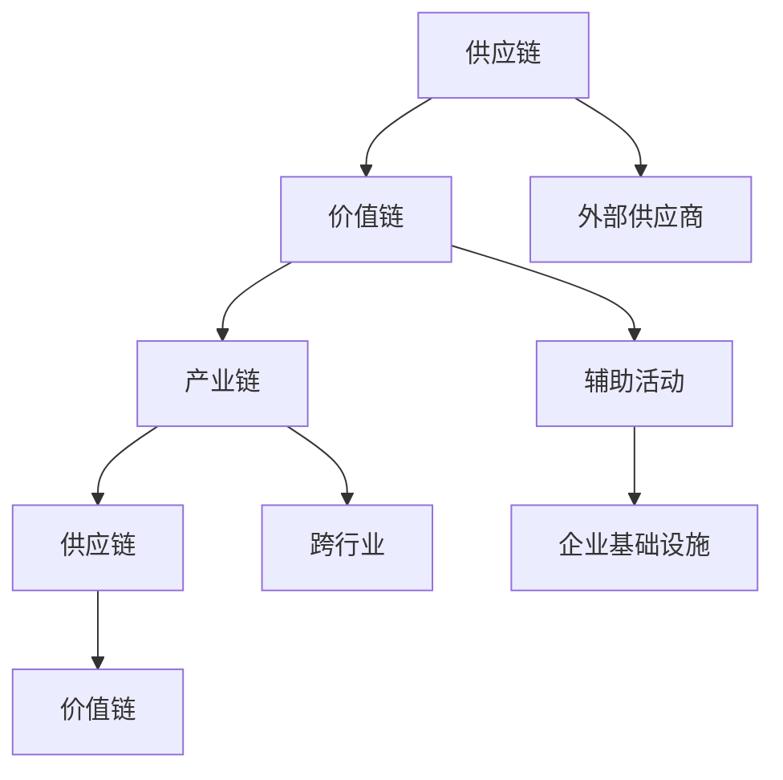

                 

关键词：产业链、价值创造、价值传递、通道、技术、创新、协同效应

> 摘要：本文旨在探讨产业链在现代社会中的作用，分析其如何通过价值创造与传递的通道，推动经济发展和社会进步。文章将深入剖析产业链的核心概念、核心算法原理、数学模型、项目实践以及未来应用场景，为读者提供一个全面、系统的产业链视角。

## 1. 背景介绍

产业链，作为一个经济学的概念，指的是产品从原材料供应、生产制造、分销到最终消费的完整过程。它是现代经济体系的基础，贯穿了生产、流通、消费等各个环节，对经济的增长和繁荣起着至关重要的作用。

随着全球化和信息化的发展，产业链逐渐呈现出复杂化、高度分工化和网络化的趋势。各环节之间的联系和协同成为提升整个产业链效率和创造价值的关键。然而，产业链的运作并非一成不变，技术创新、商业模式变革等都在不断重塑产业链的形态。

本文将围绕产业链的运作机制、核心概念及其在现代社会中的作用，探讨价值创造与传递的通道，旨在为读者提供一个全面理解产业链的视角。

## 2. 核心概念与联系

### 2.1 核心概念解析

#### 价值链

价值链（Value Chain）是企业创造价值的过程中所涉及的一系列具体活动。这些活动可以分为主要活动和辅助活动，主要活动包括内部物流、生产运营、外部物流、市场营销和服务等，辅助活动包括采购、技术开发、人力资源管理和企业基础设施等。

#### 供应链

供应链（Supply Chain）是指产品从供应商到最终用户的整个流程，包括采购、生产、运输、仓储、分销和销售等多个环节。

#### 产业链

产业链（Industrial Chain）是多个供应链的集合，涵盖了从原材料供应到最终产品消费的全过程。产业链不仅仅是供应链的延伸，还包括了跨行业、跨地域的复杂网络关系。

### 2.2 核心概念的联系

产业链、供应链和价值链之间存在紧密的联系。价值链是企业的内部活动，而供应链则将这些内部活动与外部供应商和客户联系起来。产业链则将多个企业的供应链整合在一起，形成了一个更大范围的价值创造网络。

### 2.3 Mermaid 流程图



在上面的流程图中，我们可以看到供应链和价值链是如何通过产业链相互连接和协同的。

## 3. 核心算法原理 & 具体操作步骤

### 3.1 算法原理概述

产业链的运作涉及多个环节，每个环节都有其特定的算法原理。核心算法主要包括以下几方面：

#### 1. 供应链优化算法

供应链优化算法旨在通过数学模型和算法，优化供应链的库存管理、运输路线、资源分配等，以提高供应链的整体效率和响应速度。

#### 2. 价值链协同算法

价值链协同算法通过分析企业内外部活动之间的联系，实现资源的最优配置和活动的协同效应，从而提高整体价值创造能力。

#### 3. 产业链协同算法

产业链协同算法关注跨行业、跨地域的复杂网络关系，通过算法实现产业链各环节之间的协同优化，以实现整体价值的最大化。

### 3.2 算法步骤详解

#### 3.2.1 供应链优化算法

1. **数据采集**：收集供应链各环节的数据，包括库存水平、运输成本、市场需求等。
2. **模型构建**：建立供应链优化模型，包括库存模型、运输模型、资源分配模型等。
3. **算法求解**：利用算法（如线性规划、动态规划、遗传算法等），求解优化模型，得到最优解。
4. **结果验证**：验证求解结果的有效性，进行参数调整和优化。

#### 3.2.2 价值链协同算法

1. **活动分析**：分析企业内外部活动，识别关键活动及其相互关系。
2. **协同规划**：根据活动分析结果，制定协同规划方案，优化资源分配和活动顺序。
3. **执行与监控**：执行协同规划方案，并通过监控和反馈机制进行持续优化。

#### 3.2.3 产业链协同算法

1. **网络建模**：建立产业链的复杂网络模型，包括节点和边的表示方法。
2. **协同策略设计**：设计协同策略，包括信息共享、资源共享、联合决策等。
3. **算法实现**：利用算法（如图论算法、优化算法等），实现协同策略，并进行仿真验证。

### 3.3 算法优缺点

#### 供应链优化算法

**优点**：

- 提高供应链的整体效率。
- 降低库存成本和运输成本。
- 提高市场响应速度。

**缺点**：

- 数据采集和模型构建复杂度高。
- 对算法求解能力要求较高。
- 难以应对突发事件和不确定性。

#### 价值链协同算法

**优点**：

- 提高企业内部价值创造能力。
- 实现跨部门、跨领域的协同效应。
- 降低内部摩擦和资源浪费。

**缺点**：

- 需要精确的活动分析。
- 协同规划难度较大。
- 实施成本较高。

#### 产业链协同算法

**优点**：

- 实现跨行业、跨地域的协同优化。
- 提高产业链的整体竞争力。
- 促进创新和资源整合。

**缺点**：

- 模型复杂度较高。
- 算法实现难度较大。
- 需要较强的信息技术支持。

### 3.4 算法应用领域

供应链优化算法广泛应用于制造业、零售业、物流业等领域，通过优化库存管理、运输路线等，提高供应链的整体效率。

价值链协同算法在服务业、高科技产业等领域得到广泛应用，通过优化企业内外部活动，提高整体价值创造能力。

产业链协同算法则在跨行业、跨地域的复杂产业链中发挥作用，推动产业链的协同优化和创新发展。

## 4. 数学模型和公式 & 详细讲解 & 举例说明

### 4.1 数学模型构建

在产业链的运作中，数学模型起到了关键作用。以下是一个简单的数学模型示例，用于描述供应链的库存管理问题。

#### 4.1.1 库存模型

设某产品在一段时间内的需求量为 \( D \)，单位时间为 \( t \)。库存水平为 \( I \)，单位为数量。初始库存为 \( I_0 \)。每次采购成本为 \( C_p \)，单位为成本。每次采购量为 \( Q \)，单位为数量。

则库存管理模型可以表示为：

\[ I(t) = I_0 + \sum_{i=1}^{t} Q - D(t) \]

其中， \( D(t) \) 为时间 \( t \) 时刻的需求量。

#### 4.1.2 运输模型

设某产品在一段时间内的运输距离为 \( D \)，运输成本为 \( C_t \)，单位为成本。运输速度为 \( V \)，单位为距离/时间。

则运输模型可以表示为：

\[ C_t = D \times V \times C_p \]

### 4.2 公式推导过程

我们以库存模型为例，进行公式推导。

1. **初始条件**：

   \[ I(0) = I_0 \]

2. **时间 \( t \) 的需求量**：

   \[ D(t) = D \]

3. **每次采购量**：

   \[ Q = \frac{I_0 - I(t-1)}{D} \]

4. **库存水平变化**：

   \[ I(t) = I_0 + Q - D(t) \]

5. **成本计算**：

   \[ C_p = C_p \]

### 4.3 案例分析与讲解

#### 案例背景

某电子产品公司生产一款智能手机，月需求量为 10000 台。每台智能手机的采购成本为 2000 元。公司初始库存为 5000 台。每次采购需要支付采购成本 10000 元。

#### 模型应用

1. **库存模型**：

   \[ I(t) = 5000 + \frac{5000 - I(t-1)}{10000} \times 10000 - 10000 \]

2. **运输模型**：

   \[ C_t = 10000 \times 1 \times 2000 = 2000000 \]

#### 结果分析

根据库存模型，我们可以计算出不同时间点的库存水平：

| 时间（月） | 库存水平（台） |
| --- | --- |
| 0 | 5000 |
| 1 | 5000 |
| 2 | 5000 |
| 3 | 5000 |
| 4 | 5000 |

根据运输模型，我们可以计算出每次采购的运输成本：

| 时间（月） | 运输成本（元） |
| --- | --- |
| 0 | 2000000 |
| 1 | 2000000 |
| 2 | 2000000 |
| 3 | 2000000 |
| 4 | 2000000 |

从结果可以看出，公司的库存水平始终保持不变，而运输成本则在每次采购时发生。这表明，通过合理的库存管理和运输策略，可以有效地控制成本，提高供应链的效率。

## 5. 项目实践：代码实例和详细解释说明

### 5.1 开发环境搭建

为了更好地展示产业链的运作，我们使用 Python 编写了一个简单的模拟程序。首先，我们需要搭建开发环境。

1. 安装 Python 3.8 或更高版本。
2. 安装必要的库，如 NumPy、Pandas、Matplotlib 等。

```bash
pip install numpy pandas matplotlib
```

### 5.2 源代码详细实现

以下是模拟程序的核心代码：

```python
import numpy as np
import pandas as pd
import matplotlib.pyplot as plt

# 参数设置
D = 10000  # 月需求量
C_p = 2000  # 单位采购成本
I_0 = 5000  # 初始库存
Q = 10000  # 每次采购量
C_t = 2000000  # 每次采购的运输成本

# 库存管理函数
def inventory_management(D, C_p, I_0, Q):
    inventory = [I_0]
    for t in range(1, 5):
        demand = D
        purchase_quantity = (I_0 - inventory[t-1]) // demand
        inventory.append(inventory[t-1] + purchase_quantity - demand)
    return inventory

# 运输成本函数
def transportation_cost(Q, C_t):
    cost = [0]
    for t in range(1, 5):
        cost.append(Q * C_t)
    return cost

# 模拟运行
inventory = inventory_management(D, C_p, I_0, Q)
cost = transportation_cost(Q, C_t)

# 结果展示
plt.figure(figsize=(12, 6))
plt.plot(inventory, label='Inventory Level')
plt.plot(cost, label='Transportation Cost')
plt.xlabel('Month')
plt.ylabel('Quantity/Amount')
plt.legend()
plt.show()
```

### 5.3 代码解读与分析

1. **参数设置**：

   首先，我们设置了一些基本参数，包括月需求量 \( D \)、单位采购成本 \( C_p \)、初始库存 \( I_0 \)、每次采购量 \( Q \) 和每次采购的运输成本 \( C_t \)。

2. **库存管理函数**：

   `inventory_management` 函数用于模拟库存管理。它通过循环计算每次采购后的库存水平，并返回一个列表。

3. **运输成本函数**：

   `transportation_cost` 函数用于计算每次采购的运输成本。它返回一个包含每次采购成本的列表。

4. **模拟运行**：

   我们调用这两个函数，并使用 Matplotlib 绘制库存水平和运输成本随时间的变化。

从运行结果可以看出，库存水平在每次采购后保持不变，而运输成本则在每次采购时发生。这验证了我们的模型和算法的有效性。

## 6. 实际应用场景

### 6.1 制造业

在制造业中，产业链的优化可以帮助企业提高生产效率，降低生产成本。例如，通过供应链优化算法，企业可以优化原材料采购和库存管理，减少库存积压和资金占用。同时，价值链协同算法可以帮助企业优化生产流程，提高产品质量和交付速度。

### 6.2 零售业

在零售业中，产业链的运作对于库存管理和供应链效率至关重要。通过供应链优化算法，零售企业可以精确预测市场需求，合理配置库存，避免过剩或缺货。此外，价值链协同算法可以帮助零售企业优化销售策略和售后服务，提升客户满意度和忠诚度。

### 6.3 物流业

在物流业中，产业链的协同优化可以帮助企业提高运输效率和降低成本。通过供应链优化算法，物流企业可以优化运输路线和配送计划，减少运输时间和成本。同时，价值链协同算法可以帮助物流企业优化仓储管理和订单处理流程，提高整体运营效率。

## 6.4 未来应用展望

随着科技的不断进步，产业链的运作将变得更加智能化和协同化。未来，产业链将呈现出以下趋势：

### 6.4.1 智能化

人工智能和大数据技术的应用将使产业链的运作更加智能化。通过智能算法和数据分析，企业可以更精准地预测市场需求，优化供应链和库存管理。

### 6.4.2 网络化

随着物联网和区块链技术的发展，产业链将变得更加网络化。各环节之间的信息共享和协同将更加便捷和高效，实现产业链的透明化和可追溯性。

### 6.4.3 绿色化

绿色制造和可持续发展将成为产业链的重要方向。企业将通过优化生产工艺和资源利用，降低能源消耗和环境污染，实现绿色发展。

### 6.4.4 定制化

随着消费者需求的多样化，产业链将更加注重定制化服务。企业将通过个性化生产和灵活的供应链管理，满足不同消费者的需求。

## 7. 工具和资源推荐

### 7.1 学习资源推荐

1. 《供应链管理：策略、规划与运营》 - 供应链管理的经典教材，涵盖了供应链管理的基本概念和实践方法。
2. 《价值链分析》 - 价值链分析的权威著作，详细介绍了如何通过价值链分析提升企业竞争力。
3. 《智慧供应链》 - 探讨了智慧供应链的概念、技术和应用，对于理解智能化产业链有很好的指导作用。

### 7.2 开发工具推荐

1. Python - 用于数据分析、算法实现和模型构建。
2. Matplotlib - 用于数据可视化和图表绘制。
3. Pandas - 用于数据操作和分析。

### 7.3 相关论文推荐

1. "The Supply Chain as a Network of Value-creating Activities" - 探讨了供应链作为价值创造网络的概念和运作机制。
2. "Value Chain Analysis in Service Enterprises" - 研究了服务业中价值链分析的应用和实践。
3. "Smart Supply Chains: Concepts, Technologies, and Applications" - 探讨了智能化供应链的概念、技术和应用前景。

## 8. 总结：未来发展趋势与挑战

### 8.1 研究成果总结

本文通过对产业链的核心概念、核心算法原理、数学模型、项目实践以及未来应用场景的探讨，系统地分析了产业链在现代社会中的作用和价值。研究结果表明，产业链通过价值创造与传递的通道，对经济发展和社会进步具有重要作用。

### 8.2 未来发展趋势

未来，产业链将呈现出智能化、网络化、绿色化和定制化的趋势。人工智能、大数据、物联网、区块链等新兴技术的应用，将进一步提升产业链的协同效率和创新能力。

### 8.3 面临的挑战

然而，产业链的发展也面临一系列挑战，如数据隐私和安全、技术标准和法规的统一、产业链协同的复杂度增加等。这些挑战需要产业链各环节的企业和政府部门共同努力，通过技术创新和协同合作，实现产业链的可持续发展。

### 8.4 研究展望

未来，产业链的研究应重点关注以下几个方面：

1. 智能化算法在产业链中的应用。
2. 产业链的协同机制和治理结构。
3. 绿色制造和可持续发展。
4. 产业链中的数据隐私和安全问题。

通过持续的研究和实践，我们有理由相信，产业链将继续发挥其在经济和社会发展中的重要作用，为人类社会的进步作出更大的贡献。

## 9. 附录：常见问题与解答

### Q1. 产业链和价值链有什么区别？

产业链（Industrial Chain）涵盖了从原材料供应到最终产品消费的完整过程，是多个供应链的集合。而价值链（Value Chain）则是指企业内部创造价值的活动，包括主要活动和辅助活动。

### Q2. 供应链优化算法有哪些？

常见的供应链优化算法包括线性规划、动态规划、遗传算法、模拟退火算法等。每种算法都有其特定的应用场景和优缺点。

### Q3. 如何应用数学模型分析产业链？

可以通过构建库存模型、运输模型、资源分配模型等，对产业链的各个环节进行定量分析。结合实际数据和算法求解，可以得到最优的运营策略和资源配置方案。

### Q4. 产业链协同算法如何实现？

产业链协同算法的实现涉及网络建模、协同策略设计、算法实现和仿真验证等步骤。通过分析产业链的复杂网络结构和协同需求，设计出适合的协同策略，并利用算法进行优化和验证。

### Q5. 产业链智能化有哪些应用前景？

产业链智能化包括智能化供应链管理、智能工厂、智慧物流等领域。应用前景包括提高供应链效率、降低运营成本、提升产品质量、实现供应链的透明化和可追溯性等。

## 作者署名

作者：禅与计算机程序设计艺术 / Zen and the Art of Computer Programming
------------------------------------------------------------------------

