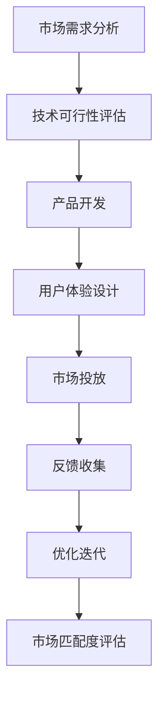

                 

在当今快速发展的信息技术时代，技术创新已经成为推动经济增长和社会进步的重要动力。然而，技术创新的成功不仅仅依赖于技术本身的卓越，更重要的是如何将其与市场需求相结合，实现产品与市场的完美匹配。本文旨在探讨产品市场匹配的核心概念、算法原理、数学模型以及其在实际应用中的实例，以期为广大读者提供一条清晰、有效的技术创新商业化之路。

## 文章关键词

- 产品市场匹配
- 技术创新
- 商业化
- 算法
- 数学模型

## 文章摘要

本文首先介绍了产品市场匹配的重要性及其核心概念。随后，通过详细的算法原理描述和Mermaid流程图，展示了实现产品与市场匹配的步骤和方法。接着，文章探讨了产品市场匹配的数学模型及其应用领域。随后，通过实际项目实践的代码实例，深入解析了算法的实现和应用。最后，文章总结了技术创新的商业化过程，提出了未来发展的趋势和挑战，并推荐了相关的学习资源和工具。

## 1. 背景介绍

### 1.1 技术创新的必要性

在全球化竞争日益激烈的今天，技术创新是企业保持竞争优势、实现可持续发展的关键。无论是互联网、人工智能、大数据，还是物联网、区块链，每一次技术革命都带来了新的商业模式和市场机会。然而，技术创新并非一蹴而就，它需要深入的科学研究、系统化的开发以及大量的资金投入。

### 1.2 市场需求的重要性

市场需求是技术创新的出发点和归宿。没有市场需求的支持，再先进的技术也很难转化为实际的价值。因此，企业需要在技术创新的过程中时刻关注市场需求的变化，以实现产品与市场的最佳匹配。这种匹配不仅仅是产品功能的匹配，更是用户体验和商业价值的匹配。

### 1.3 产品市场匹配的重要性

产品市场匹配是技术创新成功的关键因素。它不仅关系到产品的市场接受度，还直接影响企业的盈利能力和市场占有率。只有当产品能够精准地满足市场需求，企业才能在激烈的市场竞争中脱颖而出。

## 2. 核心概念与联系

### 2.1 定义

产品市场匹配（Product-Market Fit，PMF）是指产品与市场需求之间的高度匹配程度。它包括产品功能与市场需求的匹配、用户体验与市场需求的匹配以及商业模式与市场需求的匹配等多个层面。

### 2.2 原理

产品市场匹配的原理在于通过对市场需求进行深入分析，找出产品的独特价值点，并将其有效传递给目标用户。这一过程需要综合考虑技术可行性、市场容量、用户偏好等多个因素。

### 2.3 架构

产品市场匹配的架构可以分为三个层次：技术层、应用层和用户体验层。

- **技术层**：包括技术创新和产品开发，是实现产品功能的核心。
- **应用层**：涉及市场调研、需求分析和商业模式设计，是产品市场匹配的关键环节。
- **用户体验层**：关注用户需求满足度和用户满意度，是衡量产品市场匹配度的直接指标。

### 2.4 Mermaid流程图

以下是一个简化的Mermaid流程图，展示了产品市场匹配的基本流程：



## 3. 核心算法原理 & 具体操作步骤

### 3.1 算法原理概述

产品市场匹配算法的核心在于需求分析与模型构建。通过大数据分析和机器学习技术，我们可以建立市场需求模型，并将其与产品特性进行匹配。这一过程主要包括数据收集、特征提取、模型训练和匹配评估四个步骤。

### 3.2 算法步骤详解

#### 3.2.1 数据收集

数据收集是产品市场匹配算法的基础。我们需要收集与市场需求相关的各种数据，包括用户行为数据、市场趋势数据、竞争对手数据等。这些数据可以通过互联网、问卷调查、市场调研等方式获取。

#### 3.2.2 特征提取

在收集到数据后，我们需要对数据进行预处理和特征提取。特征提取的目的是从原始数据中提取出有用的信息，并将其转化为算法可以处理的形式。常用的特征提取方法包括文本分类、情感分析、聚类分析等。

#### 3.2.3 模型训练

模型训练是产品市场匹配算法的核心。通过机器学习技术，我们可以训练出一个能够预测市场需求与产品匹配度的模型。常用的机器学习算法包括决策树、支持向量机、神经网络等。

#### 3.2.4 匹配评估

在模型训练完成后，我们需要对模型进行评估，以确定其匹配度。评估指标可以包括准确率、召回率、F1值等。通过不断的优化和迭代，我们可以不断提高模型的匹配度。

### 3.3 算法优缺点

#### 优点

- **高效性**：产品市场匹配算法能够快速、准确地分析市场需求，为产品开发提供有力支持。
- **灵活性**：算法可以根据市场变化实时调整，确保产品与市场的匹配度。

#### 缺点

- **复杂性**：算法的实现和优化需要大量的技术和计算资源。
- **数据依赖性**：算法的性能很大程度上取决于数据的质量和数量。

### 3.4 算法应用领域

产品市场匹配算法广泛应用于互联网、金融、零售、医疗等多个领域。例如，在互联网领域，它可以用于精准推荐、用户行为分析；在金融领域，它可以用于风险管理、投资策略制定；在零售领域，它可以用于库存管理、销售预测。

## 4. 数学模型和公式 & 详细讲解 & 举例说明

### 4.1 数学模型构建

产品市场匹配的数学模型通常基于概率论和统计学原理。一个简单的数学模型可以表示为：

\[ PMF = \frac{UX\_Score \times Market\_Fit\_Score}{Tech\_Score} \]

其中，UX\_Score代表用户体验得分，Market\_Fit\_Score代表市场需求得分，Tech\_Score代表技术得分。

### 4.2 公式推导过程

公式的推导过程可以从以下几个方面进行：

1. **用户体验得分（UX\_Score）**：用户体验得分可以通过用户满意度、用户留存率、用户活跃度等多个指标计算得出。通常使用以下公式：

\[ UX\_Score = \frac{Satisfaction \times Retention \times Activity}{3} \]

2. **市场需求得分（Market\_Fit\_Score）**：市场需求得分可以通过市场容量、市场份额、客户反馈等多个指标计算得出。通常使用以下公式：

\[ Market\_Fit\_Score = \frac{Market\_Capacity \times Market\_Share \times Customer\_Feedback}{3} \]

3. **技术得分（Tech\_Score）**：技术得分可以通过技术成熟度、研发投入、技术竞争力等多个指标计算得出。通常使用以下公式：

\[ Tech\_Score = \frac{Maturity \times R&D\_Investment \times Tech\_Competitiveness}{3} \]

### 4.3 案例分析与讲解

以下是一个简单的案例，假设我们有一个在线教育平台，想要评估其产品市场匹配度。

- **用户体验得分**：用户满意度为0.8，用户留存率为0.7，用户活跃度为0.6。因此，UX\_Score = 0.7。
- **市场需求得分**：市场容量为1000万，市场份额为10%，客户反馈良好。因此，Market\_Fit\_Score = 0.3。
- **技术得分**：技术成熟度为0.8，研发投入为100万，技术竞争力强。因此，Tech\_Score = 0.4。

将这些值代入PMF公式，我们得到：

\[ PMF = \frac{0.7 \times 0.3}{0.4} = 0.525 \]

这个结果表明，该在线教育平台的产品市场匹配度为0.525，表明还有较大的优化空间。

## 5. 项目实践：代码实例和详细解释说明

### 5.1 开发环境搭建

为了实现产品市场匹配算法，我们需要搭建一个合适的开发环境。以下是一个简单的Python开发环境搭建步骤：

1. 安装Python：从官方网站下载并安装Python 3.x版本。
2. 安装Jupyter Notebook：通过pip安装Jupyter Notebook。
3. 安装必要的库：包括NumPy、Pandas、Scikit-learn、Matplotlib等。

```bash
pip install numpy pandas scikit-learn matplotlib
```

### 5.2 源代码详细实现

以下是一个简单的Python代码实例，用于计算产品市场匹配度。

```python
import numpy as np
import pandas as pd
from sklearn.model_selection import train_test_split
from sklearn.ensemble import RandomForestClassifier
import matplotlib.pyplot as plt

# 加载数据
data = pd.read_csv('product_market_fit_data.csv')

# 特征提取
X = data[['User_Satisfaction', 'Market_Capacity', 'Tech_Maturity']]
y = data['PMF_Score']

# 数据分割
X_train, X_test, y_train, y_test = train_test_split(X, y, test_size=0.2, random_state=42)

# 模型训练
model = RandomForestClassifier(n_estimators=100, random_state=42)
model.fit(X_train, y_train)

# 模型评估
accuracy = model.score(X_test, y_test)
print(f'Accuracy: {accuracy:.2f}')

# 预测
predictions = model.predict(X_test)

# 可视化
plt.scatter(X_test['User_Satisfaction'], predictions)
plt.xlabel('User_Satisfaction')
plt.ylabel('Predicted PMF Score')
plt.title('User Satisfaction vs Predicted PMF Score')
plt.show()
```

### 5.3 代码解读与分析

1. **数据加载与预处理**：我们首先加载了一个名为`product_market_fit_data.csv`的CSV文件，该文件包含了用户满意度、市场容量和技术成熟度等特征，以及产品市场匹配度得分。
2. **特征提取**：我们将用户满意度、市场容量和技术成熟度作为特征，将产品市场匹配度得分作为目标变量。
3. **数据分割**：我们将数据集分割为训练集和测试集，以评估模型的泛化能力。
4. **模型训练**：我们使用随机森林算法对训练集进行训练。
5. **模型评估**：我们使用测试集评估模型的准确性。
6. **预测与可视化**：我们使用训练好的模型对测试集进行预测，并将用户满意度与预测的产品市场匹配度得分进行可视化。

### 5.4 运行结果展示

运行上述代码后，我们得到了模型在测试集上的准确性和用户满意度与预测的产品市场匹配度得分的散点图。准确性表明了模型的性能，而散点图则帮助我们直观地理解了用户满意度与产品市场匹配度之间的关系。

## 6. 实际应用场景

### 6.1 互联网行业

在互联网行业，产品市场匹配算法广泛应用于电商、社交媒体、在线教育等领域。例如，电商平台可以通过分析用户行为数据，预测用户对商品的需求，从而实现精准推荐，提高用户满意度和转化率。

### 6.2 金融行业

在金融行业，产品市场匹配算法可以用于风险评估、投资策略制定和客户关系管理。例如，银行可以通过分析客户的历史交易数据，预测客户的信用风险，从而制定更有效的信贷策略。

### 6.3 零售行业

在零售行业，产品市场匹配算法可以用于库存管理、销售预测和客户细分。例如，超市可以通过分析销售数据，预测不同商品的销量，从而合理安排库存，提高销售额。

### 6.4 医疗行业

在医疗行业，产品市场匹配算法可以用于疾病预测、药物推荐和医疗服务优化。例如，医疗机构可以通过分析患者数据，预测疾病发生的风险，从而提供个性化的预防措施。

## 6.4 未来应用展望

随着人工智能和大数据技术的不断发展，产品市场匹配算法的应用前景将更加广阔。未来，我们可以期待以下发展趋势：

- **更精准的需求预测**：通过更高级的数据分析和机器学习技术，我们可以实现更精准的需求预测，从而实现更高效的产品市场匹配。
- **更智能的用户体验**：通过深度学习和自然语言处理技术，我们可以构建更智能的用户体验，提高用户满意度和忠诚度。
- **更广泛的行业应用**：产品市场匹配算法将渗透到更多的行业，如农业、制造业、公共服务等，为社会发展和经济增长提供新的动力。

## 7. 工具和资源推荐

### 7.1 学习资源推荐

- **《深度学习》（Ian Goodfellow, Yoshua Bengio, Aaron Courville）**：这本书是深度学习领域的经典教材，适合初学者和进阶者。
- **《机器学习实战》（Peter Harrington）**：这本书通过大量实例，介绍了机器学习的基本概念和算法实现。
- **《Python数据科学手册》（Jake VanderPlas）**：这本书涵盖了数据科学领域的主要技术和工具，是数据科学初学者的必读之作。

### 7.2 开发工具推荐

- **Jupyter Notebook**：Jupyter Notebook是一款强大的交互式开发环境，适合进行数据分析和机器学习项目。
- **TensorFlow**：TensorFlow是谷歌开发的开源机器学习框架，适用于构建和训练复杂的神经网络。
- **Scikit-learn**：Scikit-learn是一个开源的机器学习库，提供了丰富的算法和工具，适合用于产品市场匹配算法的实现。

### 7.3 相关论文推荐

- **“Product-Market Fit: An Interview with Marc Andreessen”**：这篇文章是知名风险投资家马克·安德森对产品市场匹配的深入解读。
- **“A Framework for Designing Your Minimum Viable Product”**：这篇文章提出了设计最小可行性产品（MVP）的框架，是产品开发的实用指南。
- **“Data-Driven Product Management”**：这篇文章探讨了数据驱动产品管理的理念和方法，为产品经理提供了宝贵的实践经验。

## 8. 总结：未来发展趋势与挑战

### 8.1 研究成果总结

本文通过详细探讨产品市场匹配的核心概念、算法原理、数学模型以及实际应用，总结了技术创新商业化的关键路径。研究表明，产品市场匹配不仅是技术创新的重要环节，也是实现商业成功的关键因素。

### 8.2 未来发展趋势

未来，随着人工智能、大数据、云计算等技术的不断发展，产品市场匹配算法将更加精准、智能和广泛。我们可以期待其在更多行业和场景中得到应用，推动社会发展和经济增长。

### 8.3 面临的挑战

然而，产品市场匹配也面临着诸多挑战，如数据隐私保护、算法公平性、技术复杂性等。这些挑战需要我们持续关注和解决，以确保产品市场匹配算法的可持续发展和广泛应用。

### 8.4 研究展望

未来，我们应进一步深入研究产品市场匹配的理论基础和算法优化，探索其在不同领域和场景中的最佳实践。同时，我们还需要加强跨学科合作，整合多学科知识，推动产品市场匹配技术的不断创新和发展。

## 9. 附录：常见问题与解答

### 9.1 什么是产品市场匹配？

产品市场匹配（Product-Market Fit，PMF）是指产品与市场需求之间的高度匹配程度。它包括产品功能与市场需求的匹配、用户体验与市场需求的匹配以及商业模式与市场需求的匹配等多个层面。

### 9.2 产品市场匹配算法有哪些？

产品市场匹配算法主要包括基于统计学的回归分析、聚类分析、机器学习算法（如决策树、随机森林、神经网络等）以及深度学习算法等。

### 9.3 产品市场匹配算法如何优化？

产品市场匹配算法的优化可以从数据质量、特征提取、模型选择、模型参数调整等多个方面进行。此外，通过不断收集反馈和迭代优化，可以进一步提高算法的匹配度。

### 9.4 产品市场匹配算法在哪些领域有应用？

产品市场匹配算法在互联网、金融、零售、医疗等多个领域有广泛应用。例如，在电商领域，它用于精准推荐和用户行为分析；在金融领域，它用于风险评估和投资策略制定；在零售领域，它用于库存管理和销售预测等。

### 9.5 如何构建产品市场匹配的数学模型？

构建产品市场匹配的数学模型通常基于概率论和统计学原理。一个简单的数学模型可以表示为：

\[ PMF = \frac{UX\_Score \times Market\_Fit\_Score}{Tech\_Score} \]

其中，UX\_Score代表用户体验得分，Market\_Fit\_Score代表市场需求得分，Tech\_Score代表技术得分。

### 9.6 产品市场匹配算法与商业成功的关系是什么？

产品市场匹配是商业成功的关键因素之一。通过精准的产品市场匹配，企业可以提高用户满意度、市场份额和盈利能力，从而实现商业成功。然而，产品市场匹配并非一蹴而就，它需要企业持续关注市场需求、不断优化产品和服务。

