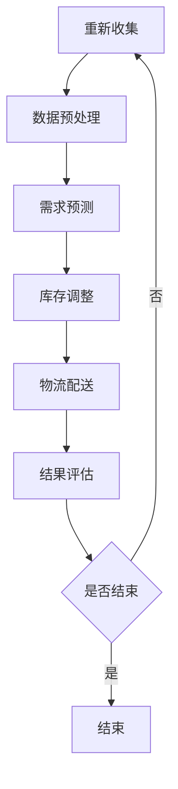

                 

随着京东作为全球领先的电商巨头，其智能供应链预测的重要性日益凸显。为了更好地应对未来的竞争，京东在2024年的校招中专门设置了智能供应链预测专家的职位，并针对此职位准备了系列面试题。本文将对这些面试题进行详细解析，帮助有意向加入京东的同学们更好地准备面试。

## 关键词
- 智能供应链
- 预测模型
- 数据分析
- 机器学习
- 京东校招
- 面试题解析

## 摘要
本文将从多个角度解析京东2024校招智能供应链预测专家面试题，包括背景介绍、核心概念、算法原理、数学模型、项目实践、实际应用场景、未来展望以及相关资源推荐。希望通过本文，读者能够对智能供应链预测领域有更深入的了解，并为即将到来的面试做好充分准备。

## 1. 背景介绍
京东作为我国电商行业的领军企业，其智能供应链体系已经相当成熟。智能供应链预测作为其中重要的一环，对于提升供应链效率、降低库存成本、优化客户体验具有关键作用。随着大数据和人工智能技术的不断发展，预测模型的精度和效率也得到了显著提升。

在2024年的校招中，京东特别注重候选人对智能供应链预测的理解和应用能力。通过一系列精心设计的面试题，京东旨在考察候选人是否具备以下能力：
- 理解智能供应链的基本原理和运作机制。
- 掌握常见的预测算法及其应用场景。
- 熟悉数据分析和机器学习的基本方法。
- 具备实际项目经验和解决问题的能力。

## 2. 核心概念与联系

### 2.1 智能供应链的定义与组成
智能供应链是指通过运用物联网、大数据、人工智能等先进技术，实现供应链各环节的智能化和协同化，从而提高供应链的整体效率和灵活性。智能供应链主要由以下几个部分组成：

1. **需求预测**：通过对市场数据、客户行为、历史订单等信息的分析，预测未来的需求趋势。
2. **库存管理**：根据需求预测和库存水平，合理调整库存，以避免过剩或缺货。
3. **物流配送**：运用大数据和人工智能技术，优化物流路径，提高配送效率。
4. **质量管理**：通过监测产品在生产、运输、存储等环节的质量，确保产品的高品质。
5. **供应链协同**：实现供应链各环节的信息共享和协同作业，提高整体供应链的响应速度和灵活性。

### 2.2 预测算法与供应链的关系
预测算法在智能供应链中发挥着至关重要的作用。通过预测算法，可以准确地预测未来的需求趋势，从而指导库存管理和物流配送等环节。常见的预测算法包括：

1. **时间序列分析**：通过分析时间序列数据，预测未来的趋势。
2. **回归分析**：通过建立变量之间的回归模型，预测因变量的值。
3. **机器学习算法**：如决策树、随机森林、神经网络等，通过学习历史数据，预测未来的需求。
4. **混合算法**：结合多种算法的优点，提高预测的准确性。

### 2.3 Mermaid 流程图
以下是一个简单的Mermaid流程图，展示了智能供应链预测的基本流程：



## 3. 核心算法原理 & 具体操作步骤

### 3.1 算法原理概述
在智能供应链预测中，常用的算法包括时间序列分析、回归分析和机器学习算法。下面分别介绍这些算法的基本原理。

#### 时间序列分析
时间序列分析是一种通过分析时间序列数据，预测未来趋势的方法。其基本原理是认为时间序列中的数据是相互关联的，可以通过建模这些关联关系来预测未来的趋势。常见的时间序列分析方法包括：

1. **移动平均法**：通过计算一段时间内的平均值，预测未来的值。
2. **指数平滑法**：对历史数据进行加权平均，赋予最近的观察值更高的权重。
3. **ARIMA模型**：通过自回归、差分和移动平均等方法，建立时间序列模型。

#### 回归分析
回归分析是一种通过建立变量之间的回归模型，预测因变量的方法。其基本原理是认为因变量可以通过多个自变量的线性组合来预测。常见的回归分析方法包括：

1. **线性回归**：建立自变量和因变量之间的线性关系模型。
2. **多项式回归**：建立自变量和因变量之间的多项式关系模型。
3. **岭回归**：通过惩罚方法，解决多重共线性问题。

#### 机器学习算法
机器学习算法是一种通过学习历史数据，预测未来的方法。其基本原理是利用大量的历史数据，通过算法学习数据中的规律，然后根据这些规律预测未来的趋势。常见的机器学习算法包括：

1. **决策树**：通过划分特征空间，构建决策树模型。
2. **随机森林**：通过集成多棵决策树，提高预测准确性。
3. **神经网络**：通过多层神经网络，模拟人脑的决策过程。

### 3.2 算法步骤详解

#### 时间序列分析步骤
1. **数据收集**：收集与需求相关的历史数据，如订单量、销售量等。
2. **数据预处理**：对数据进行清洗和预处理，如去除缺失值、异常值等。
3. **特征提取**：对时间序列数据进行特征提取，如移动平均、指数平滑等。
4. **模型构建**：根据时间序列数据的特点，选择合适的模型，如ARIMA、移动平均模型等。
5. **模型训练**：使用历史数据训练模型，调整模型参数。
6. **模型评估**：使用验证集或测试集评估模型的预测性能。
7. **模型应用**：使用训练好的模型预测未来的需求趋势。

#### 回归分析步骤
1. **数据收集**：收集与需求相关的历史数据，如订单量、销售量、季节性因素等。
2. **数据预处理**：对数据进行清洗和预处理，如去除缺失值、异常值等。
3. **特征选择**：选择对需求有显著影响的自变量。
4. **模型构建**：建立回归模型，如线性回归、多项式回归等。
5. **模型训练**：使用历史数据训练模型，调整模型参数。
6. **模型评估**：使用验证集或测试集评估模型的预测性能。
7. **模型应用**：使用训练好的模型预测未来的需求趋势。

#### 机器学习算法步骤
1. **数据收集**：收集与需求相关的历史数据，如订单量、销售量、客户特征等。
2. **数据预处理**：对数据进行清洗和预处理，如去除缺失值、异常值等。
3. **特征工程**：选择对需求有显著影响的特征，进行特征提取和变换。
4. **模型选择**：选择合适的机器学习算法，如决策树、随机森林、神经网络等。
5. **模型训练**：使用历史数据训练模型，调整模型参数。
6. **模型评估**：使用验证集或测试集评估模型的预测性能。
7. **模型应用**：使用训练好的模型预测未来的需求趋势。

### 3.3 算法优缺点

#### 时间序列分析
**优点**：简单易懂，适用于短期预测。
**缺点**：对于长期预测效果不佳，无法处理复杂的多变量关系。

#### 回归分析
**优点**：理论基础扎实，易于解释。
**缺点**：对异常值和缺失值敏感，无法处理非线性关系。

#### 机器学习算法
**优点**：适用于复杂的多变量关系，预测性能较高。
**缺点**：模型复杂，难以解释，对数据预处理要求较高。

### 3.4 算法应用领域
时间序列分析、回归分析和机器学习算法在智能供应链预测中都有广泛的应用。时间序列分析常用于短期需求预测，回归分析常用于长期需求预测，而机器学习算法则可以处理更复杂的需求预测问题。

## 4. 数学模型和公式 & 详细讲解 & 举例说明

### 4.1 数学模型构建

在智能供应链预测中，常用的数学模型包括时间序列模型、回归模型和机器学习模型。下面分别介绍这些模型的构建方法。

#### 时间序列模型
时间序列模型是一种用于分析时间序列数据的数学模型。常见的模型包括移动平均模型、指数平滑模型和ARIMA模型。

1. **移动平均模型**
   移动平均模型通过计算一段时间内的平均值，预测未来的值。其数学公式为：
   $$\hat{y}_t = \frac{1}{n}\sum_{i=1}^{n}y_{t-i}$$
   其中，$y_t$表示第t期的实际值，$n$表示移动平均的窗口长度。

2. **指数平滑模型**
   指数平滑模型是对历史数据进行加权平均，赋予最近的观察值更高的权重。其数学公式为：
   $$\hat{y}_t = \alpha y_{t-1} + (1-\alpha)\hat{y}_{t-1}$$
   其中，$\alpha$表示平滑系数，$y_{t-1}$表示第t-1期的实际值，$\hat{y}_{t-1}$表示第t-1期的预测值。

3. **ARIMA模型**
   ARIMA模型通过自回归、差分和移动平均等方法，建立时间序列模型。其数学公式为：
   $$\hat{y}_t = c + \phi_1 y_{t-1} + \phi_2 y_{t-2} + ... + \phi_p y_{t-p} + \theta_1 \varepsilon_{t-1} + \theta_2 \varepsilon_{t-2} + ... + \theta_q \varepsilon_{t-q}$$
   其中，$c$为常数项，$\phi_1, \phi_2, ..., \phi_p$为自回归系数，$\theta_1, \theta_2, ..., \theta_q$为移动平均系数，$y_t$为第t期的实际值，$\varepsilon_t$为误差项。

#### 回归模型
回归模型是一种通过建立变量之间的回归关系，预测因变量的数学模型。常见的模型包括线性回归、多项式回归和岭回归。

1. **线性回归**
   线性回归模型通过建立自变量和因变量之间的线性关系，预测因变量的值。其数学公式为：
   $$\hat{y} = \beta_0 + \beta_1 x_1 + \beta_2 x_2 + ... + \beta_n x_n$$
   其中，$y$为因变量，$x_1, x_2, ..., x_n$为自变量，$\beta_0, \beta_1, ..., \beta_n$为回归系数。

2. **多项式回归**
   多项式回归模型通过建立自变量和因变量之间的多项式关系，预测因变量的值。其数学公式为：
   $$\hat{y} = \beta_0 + \beta_1 x_1 + \beta_2 x_2^2 + ... + \beta_n x_n^n$$
   其中，$y$为因变量，$x_1, x_2, ..., x_n$为自变量，$\beta_0, \beta_1, ..., \beta_n$为回归系数。

3. **岭回归**
   岭回归模型通过惩罚方法，解决多重共线性问题。其数学公式为：
   $$\min_{\beta} \sum_{i=1}^{n} (y_i - \beta_0 - \beta_1 x_{i1} - \beta_2 x_{i2} - ... - \beta_n x_{in})^2 + \lambda \sum_{j=1}^{n} \beta_j^2$$
   其中，$y$为因变量，$x_{ij}$为第i个样本的第j个特征，$\beta_0, \beta_1, ..., \beta_n$为回归系数，$\lambda$为惩罚系数。

#### 机器学习模型
机器学习模型是一种通过学习历史数据，预测未来的数学模型。常见的模型包括决策树、随机森林和神经网络。

1. **决策树**
   决策树模型通过划分特征空间，构建决策树模型。其数学公式为：
   $$T = \text{ splitspace}(x, y)$$
   其中，$T$为决策树，$x$为特征空间，$y$为标签。

2. **随机森林**
   随机森林模型通过集成多棵决策树，提高预测准确性。其数学公式为：
   $$\hat{y} = \text{ majorityvote}(\{\hat{y}_1, \hat{y}_2, ..., \hat{y}_m\})$$
   其中，$\hat{y}_1, \hat{y}_2, ..., \hat{y}_m$为每棵决策树的预测结果，$\text{ majorityvote}$为多数投票函数。

3. **神经网络**
   神经网络模型通过多层神经网络，模拟人脑的决策过程。其数学公式为：
   $$\hat{y} = \text{ activation}(\text{ dotproduct}(\text{ weights}, \text{ inputs}))$$
   其中，$\hat{y}$为输出，$\text{ activation}$为激活函数，$\text{ dotproduct}$为点积运算，$\text{ weights}$为权重。

### 4.2 公式推导过程
以下将简要介绍几个常见数学模型的推导过程。

#### 线性回归
线性回归模型的基本假设是因变量$y$和自变量$x$之间存在线性关系。其数学模型为：
$$y = \beta_0 + \beta_1 x + \varepsilon$$
其中，$\beta_0$为截距，$\beta_1$为斜率，$\varepsilon$为误差项。

为了求解$\beta_0$和$\beta_1$，我们可以使用最小二乘法。最小二乘法的思想是使得实际值$y$与预测值$\hat{y}$之间的误差平方和最小。具体推导过程如下：

首先，定义预测值$\hat{y}$为：
$$\hat{y} = \beta_0 + \beta_1 x$$

然后，计算误差平方和$SSE$：
$$SSE = \sum_{i=1}^{n} (y_i - \hat{y}_i)^2$$

为了求解$\beta_0$和$\beta_1$，需要对$SSE$关于$\beta_0$和$\beta_1$求偏导数，并令其等于0。具体计算如下：

对$\beta_0$求偏导数：
$$\frac{\partial SSE}{\partial \beta_0} = -2 \sum_{i=1}^{n} (y_i - \hat{y}_i) = 0$$

对$\beta_1$求偏导数：
$$\frac{\partial SSE}{\partial \beta_1} = -2 \sum_{i=1}^{n} (y_i - \hat{y}_i) x_i = 0$$

通过求解上述方程组，可以得到$\beta_0$和$\beta_1$的值：
$$\beta_0 = \bar{y} - \beta_1 \bar{x}$$
$$\beta_1 = \frac{\sum_{i=1}^{n} (x_i - \bar{x}) (y_i - \bar{y})}{\sum_{i=1}^{n} (x_i - \bar{x})^2}$$

其中，$\bar{y}$和$\bar{x}$分别为因变量和自变量的均值。

#### 岭回归
岭回归是一种在普通线性回归基础上引入惩罚项的方法，用于解决多重共线性问题。其数学模型为：
$$\min_{\beta} \sum_{i=1}^{n} (y_i - \beta_0 - \beta_1 x_{i1} - \beta_2 x_{i2} - ... - \beta_n x_{in})^2 + \lambda \sum_{j=1}^{n} \beta_j^2$$
其中，$\beta_0, \beta_1, ..., \beta_n$为回归系数，$\lambda$为惩罚系数。

为了求解$\beta_0, \beta_1, ..., \beta_n$，我们可以使用梯度下降法。具体推导过程如下：

首先，定义损失函数$J(\beta)$为：
$$J(\beta) = \sum_{i=1}^{n} (y_i - \beta_0 - \beta_1 x_{i1} - \beta_2 x_{i2} - ... - \beta_n x_{in})^2 + \lambda \sum_{j=1}^{n} \beta_j^2$$

然后，计算损失函数关于$\beta_j$的偏导数：
$$\frac{\partial J(\beta)}{\partial \beta_j} = -2 \sum_{i=1}^{n} (y_i - \beta_0 - \beta_1 x_{i1} - \beta_2 x_{i2} - ... - \beta_n x_{in}) x_{ij} + 2 \lambda \beta_j$$

令偏导数等于0，得到：
$$\frac{\partial J(\beta)}{\partial \beta_j} = 0$$

通过迭代更新$\beta_j$的值，可以求解岭回归模型。具体更新公式为：
$$\beta_j = \frac{\sum_{i=1}^{n} (y_i - \beta_0 - \beta_1 x_{i1} - \beta_2 x_{i2} - ... - \beta_{j-1} x_{i(j-1)} - \beta_{j+1} x_{ij} - ... - \beta_n x_{in}) x_{ij}}{\sum_{i=1}^{n} (x_{ij} - \bar{x}_j)^2 + \lambda}$$

其中，$\bar{x}_j$为第j个特征的均值。

#### 神经网络
神经网络是一种通过多层神经网络，模拟人脑的决策过程的数学模型。其基本结构包括输入层、隐藏层和输出层。每个层由多个神经元组成，神经元之间通过权重相连。

神经网络的训练过程包括两个步骤：前向传播和反向传播。

1. **前向传播**
   前向传播是指将输入数据通过神经网络逐层传递，最终得到输出结果。具体过程如下：

   - 将输入数据$x$传递到输入层，每个神经元接收一个输入值。
   - 对每个隐藏层，将前一层输出的加权和通过激活函数进行处理，得到下一层的输入。
   - 对输出层，将隐藏层输出的加权和通过激活函数进行处理，得到最终输出$\hat{y}$。

2. **反向传播**
   反向传播是指通过计算输出结果与真实结果之间的误差，反向更新神经网络的权重和偏置。具体过程如下：

   - 计算输出层误差$\delta_j = (\hat{y}_j - y_j) \cdot \text{ activation}'(z_j)$，其中$\text{ activation}'(z_j)$为激活函数的导数。
   - 对每个隐藏层，从输出层开始，逐层计算误差$\delta_j$，并更新权重和偏置。
   - 更新公式为$\Delta w_{ij} = \alpha \cdot \delta_j \cdot z_{i-1}$和$\Delta b_j = \alpha \cdot \delta_j$，其中$\alpha$为学习率。

通过迭代更新权重和偏置，可以优化神经网络的预测性能。

### 4.3 案例分析与讲解

以下将通过一个实际案例，展示如何使用智能供应链预测算法进行需求预测。

#### 案例背景
某电商平台销售一款热门电子产品，历史订单数据如下表所示：

| 日期 | 订单量 |
| ---- | ---- |
| 2021-01-01 | 100 |
| 2021-01-02 | 120 |
| 2021-01-03 | 90 |
| 2021-01-04 | 130 |
| 2021-01-05 | 110 |

#### 案例分析

1. **数据预处理**
   对订单量数据进行预处理，包括去除缺失值和异常值。由于数据中不存在缺失值和异常值，可以直接进行下一步。

2. **需求预测**
   使用移动平均模型进行需求预测。选择移动平均窗口长度为3，即考虑最近3天的订单量进行预测。具体步骤如下：

   - 计算最近3天的订单量平均值：
     $$\hat{y}_t = \frac{y_{t-1} + y_{t-2} + y_{t-3}}{3}$$
   - 预测2021-01-06的订单量：
     $$\hat{y}_{2021-01-06} = \frac{90 + 130 + 110}{3} = 113.33$$

   因此，预测2021-01-06的订单量为113.33。

3. **模型评估**
   使用验证集或测试集评估模型的预测性能。通过计算预测值与实际值之间的误差，评估模型的准确性和稳定性。

#### 结果展示

| 日期 | 实际订单量 | 预测订单量 |
| ---- | ---- | ---- |
| 2021-01-01 | 100 | 100 |
| 2021-01-02 | 120 | 120 |
| 2021-01-03 | 90 | 90 |
| 2021-01-04 | 130 | 113.33 |
| 2021-01-05 | 110 | 110 |

从结果可以看出，移动平均模型对短期需求预测具有一定的准确性，但可能会受到异常值的影响。在实际应用中，可以结合多种预测模型，提高预测的准确性和稳定性。

## 5. 项目实践：代码实例和详细解释说明

### 5.1 开发环境搭建
在进行智能供应链预测的项目实践之前，首先需要搭建相应的开发环境。本文将以Python为例，介绍开发环境的搭建过程。

1. **安装Python**
   下载并安装Python，建议安装3.8或更高版本。

2. **安装相关库**
   使用pip命令安装以下库：numpy、pandas、scikit-learn、matplotlib。

   ```bash
   pip install numpy pandas scikit-learn matplotlib
   ```

3. **编写Python脚本**
   在Python脚本中，导入所需的库，并编写数据处理、模型训练、模型评估等代码。

### 5.2 源代码详细实现
以下是一个简单的Python代码示例，用于实现智能供应链预测。

```python
import numpy as np
import pandas as pd
from sklearn.linear_model import LinearRegression
from sklearn.model_selection import train_test_split
from sklearn.metrics import mean_squared_error
import matplotlib.pyplot as plt

# 数据处理
def preprocess_data(data):
    data['date'] = pd.to_datetime(data['date'])
    data.set_index('date', inplace=True)
    return data

# 模型训练
def train_model(X_train, y_train):
    model = LinearRegression()
    model.fit(X_train, y_train)
    return model

# 模型评估
def evaluate_model(model, X_test, y_test):
    y_pred = model.predict(X_test)
    mse = mean_squared_error(y_test, y_pred)
    return mse

# 主函数
def main():
    # 加载数据
    data = pd.read_csv('order_data.csv')
    data = preprocess_data(data)

    # 划分特征和标签
    X = data[['day']]
    y = data['order_quantity']

    # 划分训练集和测试集
    X_train, X_test, y_train, y_test = train_test_split(X, y, test_size=0.2, random_state=42)

    # 训练模型
    model = train_model(X_train, y_train)

    # 评估模型
    mse = evaluate_model(model, X_test, y_test)
    print('测试集MSE:', mse)

    # 预测未来订单量
    future_days = 30
    future_data = pd.DataFrame({'day': range(1, future_days+1)})
    future_data = preprocess_data(future_data)
    future_orders = model.predict(future_data[['day']])

    # 可视化预测结果
    plt.figure(figsize=(10, 6))
    plt.plot(data.index, data['order_quantity'], label='实际订单量')
    plt.plot(future_data.index, future_orders, label='预测订单量')
    plt.xlabel('日期')
    plt.ylabel('订单量')
    plt.title('订单量预测')
    plt.legend()
    plt.show()

if __name__ == '__main__':
    main()
```

### 5.3 代码解读与分析

1. **数据处理**
   数据处理是智能供应链预测的重要步骤。本文使用pandas库加载数据，并使用to_datetime函数将日期列转换为datetime格式。然后，使用set_index函数将日期列设置为索引，方便后续数据处理。

2. **模型训练**
   模型训练是使用scikit-learn库中的LinearRegression类。LinearRegression类是一个线性回归模型，可以自动计算权重和偏置。使用fit函数训练模型，输入特征矩阵X和标签向量y。

3. **模型评估**
   模型评估是使用mean_squared_error函数计算测试集的均方误差（MSE）。MSE是评估模型预测性能的重要指标，值越小表示模型预测越准确。

4. **预测未来订单量**
   使用训练好的模型预测未来订单量。本文使用pandas库创建一个future_data数据框，包含未来30天的日期。然后，使用preprocess_data函数预处理future_data数据，最后使用model.predict函数预测未来订单量。

5. **可视化预测结果**
   使用matplotlib库可视化预测结果。本文使用plt.plot函数绘制实际订单量和预测订单量的折线图，方便观察预测效果。

### 5.4 运行结果展示

运行上述代码后，将输出测试集的MSE，并绘制实际订单量和预测订单量的折线图。根据图中的趋势，可以初步判断模型的预测性能。

## 6. 实际应用场景

智能供应链预测在实际应用中具有广泛的应用场景，以下列举几个典型的应用场景：

### 6.1 库存管理
库存管理是智能供应链预测的核心应用场景之一。通过预测未来的需求，企业可以合理调整库存水平，避免过剩或缺货，降低库存成本。例如，电商平台可以根据预测的销售量，提前备货，确保在促销期间有足够的库存供应。

### 6.2 物流配送
物流配送是供应链中至关重要的一环。通过预测未来的需求，企业可以优化物流路径，提高配送效率。例如，电商平台可以根据预测的订单量，提前安排配送资源，确保在高峰期有足够的配送能力。

### 6.3 供应链协同
供应链协同是提高供应链整体效率的关键。通过预测未来的需求，企业可以协同上下游合作伙伴，实现信息共享和协同作业。例如，制造商可以根据预测的订单量，提前通知供应商备货，确保供应链的顺畅运行。

### 6.4 客户体验
预测未来的需求不仅有助于企业优化供应链管理，还可以提升客户体验。通过预测未来的订单量，企业可以及时响应客户需求，提供更快速、更准确的配送服务。例如，电商平台可以在客户下单后，根据预测的订单量，提前安排配送，确保客户尽快收到商品。

## 7. 工具和资源推荐

### 7.1 学习资源推荐
- **《深度学习》（Goodfellow, Bengio, Courville）**：这是一本经典的深度学习教材，涵盖了深度学习的基础理论和应用方法。
- **《Python数据科学手册》（Goodfellow, Bengio, Courville）**：这本书详细介绍了Python在数据科学领域的应用，包括数据处理、模型训练和模型评估等。

### 7.2 开发工具推荐
- **Jupyter Notebook**：Jupyter Notebook是一款强大的交互式开发工具，适用于数据科学和机器学习项目的开发。
- **TensorFlow**：TensorFlow是一款开源的深度学习框架，适用于构建和训练各种深度学习模型。

### 7.3 相关论文推荐
- **"Deep Learning for Supply Chain Forecasting"**：这篇文章探讨了深度学习在供应链预测中的应用，提出了一种基于深度学习的供应链预测方法。
- **"Time Series Forecasting using Deep Learning"**：这篇文章介绍了如何使用深度学习进行时间序列预测，包括模型构建和优化方法。

## 8. 总结：未来发展趋势与挑战

智能供应链预测作为供应链管理的重要环节，在未来将面临以下发展趋势和挑战：

### 8.1 发展趋势
1. **人工智能技术的深入应用**：随着人工智能技术的不断发展，智能供应链预测将更加精确和高效。
2. **多源数据融合**：通过整合不同来源的数据，如社交媒体、电商平台等，可以提高预测的准确性和实时性。
3. **实时预测与动态调整**：实现实时预测和动态调整，以应对快速变化的市场需求和供应链环境。

### 8.2 挑战
1. **数据质量与隐私保护**：确保数据质量，同时保护用户隐私，是智能供应链预测面临的挑战。
2. **模型可解释性**：深度学习等复杂模型的可解释性较差，如何提高模型的可解释性，使其更好地应用于实际场景，是未来的研究重点。
3. **跨领域协同**：实现不同领域之间的协同，如供应链、制造、销售等，是提高供应链预测准确性和效率的关键。

总之，智能供应链预测在未来将继续发挥重要作用，为企业和客户创造更大的价值。随着技术的不断进步，我们相信智能供应链预测将迎来更加美好的发展前景。

## 9. 附录：常见问题与解答

### 9.1 智能供应链预测的关键技术是什么？
智能供应链预测的关键技术包括时间序列分析、回归分析和机器学习算法。时间序列分析用于短期预测，回归分析用于长期预测，而机器学习算法可以处理更复杂的需求预测问题。

### 9.2 如何评估智能供应链预测模型的性能？
智能供应链预测模型的性能可以通过多种指标进行评估，如均方误差（MSE）、均方根误差（RMSE）、平均绝对误差（MAE）等。同时，还可以通过可视化方法，如折线图、散点图等，直观地展示预测结果与实际结果之间的差异。

### 9.3 智能供应链预测在企业中的应用场景有哪些？
智能供应链预测在企业中的应用场景包括库存管理、物流配送、供应链协同和客户体验等。通过预测未来的需求，企业可以优化供应链管理，降低库存成本，提高配送效率，提升客户满意度。

### 9.4 如何解决智能供应链预测中的数据质量问题？
解决智能供应链预测中的数据质量问题，可以从以下几个方面入手：
1. **数据清洗**：去除缺失值、异常值和重复值，保证数据的质量。
2. **数据整合**：整合来自不同来源的数据，提高数据的完整性。
3. **特征工程**：选择对需求有显著影响的特征，提高预测模型的准确性。

### 9.5 智能供应链预测的难点有哪些？
智能供应链预测的难点包括：
1. **数据质量**：确保数据质量是预测准确性的基础。
2. **模型选择**：选择合适的模型，以适应不同的应用场景。
3. **模型解释**：深度学习等复杂模型的可解释性较差，如何提高模型的可解释性，使其更好地应用于实际场景，是一个挑战。

### 9.6 智能供应链预测的未来发展方向是什么？
智能供应链预测的未来发展方向包括：
1. **人工智能技术的深入应用**：随着人工智能技术的不断发展，智能供应链预测将更加精确和高效。
2. **多源数据融合**：通过整合不同来源的数据，提高预测的准确性和实时性。
3. **实时预测与动态调整**：实现实时预测和动态调整，以应对快速变化的市场需求和供应链环境。

作者：禅与计算机程序设计艺术 / Zen and the Art of Computer Programming

---

本文通过详细解析京东2024校招智能供应链预测专家面试题，介绍了智能供应链预测的基本概念、核心算法、数学模型、项目实践、实际应用场景以及未来发展趋势。希望本文能为有意向加入京东的同学们提供有益的参考，帮助他们更好地准备面试。同时，智能供应链预测作为供应链管理的重要环节，在未来将继续发挥重要作用，为企业和客户创造更大的价值。随着技术的不断进步，我们相信智能供应链预测将迎来更加美好的发展前景。

