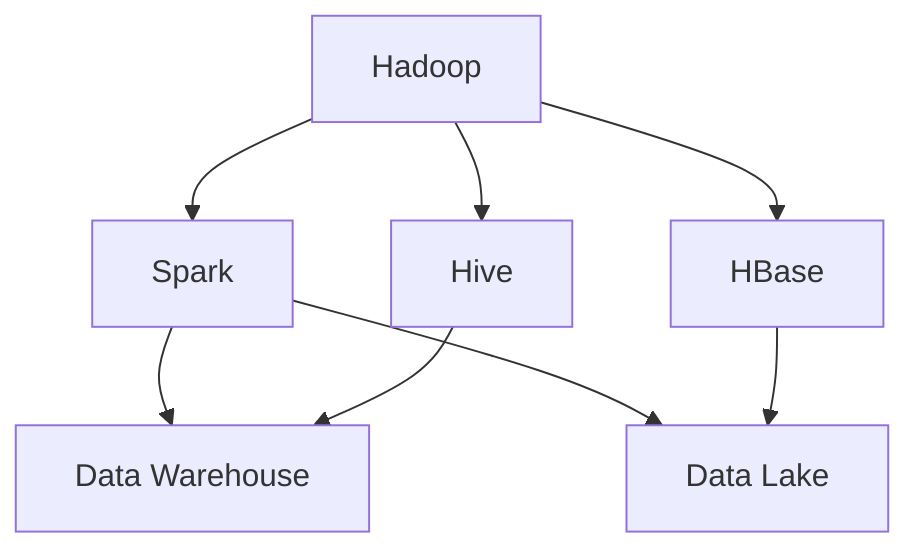

                 

关键词：京东、2025、社招、大数据工程师、面试经验、技术分享

> 摘要：本文将分享一位在大数据领域工作的工程师在2025年京东社会招聘过程中所经历的技术面试经验。本文将详细阐述面试的准备、过程、以及面试中所涉及的技术知识点，希望对即将参加类似面试的工程师们有所帮助。

## 1. 背景介绍

随着大数据技术的不断发展和应用，越来越多的企业开始重视大数据工程师的招聘。京东作为中国领先的电商平台，对于大数据工程师的需求尤其旺盛。2025年，我作为一名有着多年大数据工作经验的工程师，有幸参加了京东的社会招聘面试。本文将结合我的实际经历，为大家详细分享这次面试的经验。

### 1.1 面试前的准备

在参加京东面试之前，我做了充分的准备。首先，我对京东的业务有了深入的了解，包括其业务模式、数据来源、数据处理流程等。其次，我复习了大数据领域的基础知识，如Hadoop、Spark、Hive、HBase等，并针对这些知识点做了深入的复习和总结。最后，我还准备了一些实际的编程题目，以便在面试中能够灵活应对。

### 1.2 面试过程

京东的面试分为三轮，分别是技术面试、项目面试和综合面试。每一轮面试都有不同的面试官，他们分别从不同角度考察我的技术能力和业务理解。

**第一轮：技术面试**

技术面试主要集中在数据结构和算法方面，面试官给我出了一道关于二叉树的编程题，题目要求我实现一个二叉树的遍历算法。这道题目考查了我对数据结构的理解和编程能力。在解答过程中，我尽量使代码简洁易懂，并解释了算法的复杂度分析。

**第二轮：项目面试**

项目面试主要考察我在大数据项目中的实际经验和技术能力。面试官让我详细描述了我在上一个项目中负责的任务，包括数据采集、数据存储、数据处理和分析等环节。我还被要求解释我在项目中遇到的问题和解决方案。这一环节考察了我对大数据项目的整体理解和解决实际问题的能力。

**第三轮：综合面试**

综合面试主要考察我的团队协作能力和沟通能力。面试官通过一系列开放性问题，让我描述我在团队中的角色和贡献，以及我在遇到困难时的应对策略。这一环节还涉及到我的职业规划和发展方向，面试官希望了解我的长期目标和职业规划。

## 2. 核心概念与联系

在面试过程中，面试官对大数据的核心概念和技术架构有着深入的了解。为了更好地理解大数据技术的全貌，以下是一个简单的Mermaid流程图，展示大数据技术中的核心概念和它们之间的联系。



### 2.1 核心概念概述

- **Hadoop**: 一个分布式数据处理框架，主要用于大规模数据的存储和处理。
- **Spark**: 一个快速通用的数据处理引擎，特别适合于迭代算法和交互式数据挖掘任务。
- **Hive**: 一个基于Hadoop的数据仓库基础设施，可以将结构化数据映射为Hadoop中的表。
- **HBase**: 一个分布式、可扩展的大规模列存储数据库，可用于存储非结构化数据。
- **Data Warehouse**: 数据仓库是一个用于存储大量历史数据的系统，便于进行数据分析和报告。
- **Data Lake**: 数据湖是一个存储大量原始数据（包括结构化、半结构化和非结构化数据）的系统，便于数据探索和分析。

## 3. 核心算法原理 & 具体操作步骤

### 3.1 算法原理概述

在面试过程中，面试官特别关注我在大数据项目中使用的关键算法。以下是一些常见的算法原理和具体操作步骤。

### 3.1.1 数据清洗算法

数据清洗是大数据项目中的关键步骤。以下是一个简单但常用的数据清洗算法：

1. **去除重复数据**：通过哈希表或排序算法删除重复记录。
2. **处理缺失数据**：根据数据的重要性和业务需求，选择填充、删除或插值等方法处理缺失数据。
3. **处理异常数据**：识别和处理异常值，如超出正常范围的数据。

### 3.1.2 数据压缩算法

数据压缩算法用于减少存储空间和提高数据处理效率。以下是一种简单但常用的数据压缩算法：

1. **字典编码**：将重复的字符串替换为短编码。
2. **哈夫曼编码**：根据字符出现的频率构建哈夫曼树，实现字符到编码的映射。
3. **LZ77/LZ78算法**：通过查找前后文本中的重复子串实现数据压缩。

### 3.1.3 聚类算法

聚类算法用于将数据划分为若干个簇，以发现数据中的模式。以下是一种常用的聚类算法：

1. **K-Means算法**：通过迭代优化算法确定簇心和簇成员。
2. **DBSCAN算法**：基于密度和连接性确定簇。
3. **层次聚类算法**：自底向上或自顶向下合并相似数据。

### 3.2 算法步骤详解

以下是数据清洗算法的具体操作步骤：

1. **读取数据**：从数据源读取原始数据。
2. **去重**：使用哈希表或排序算法删除重复记录。
3. **处理缺失数据**：根据业务需求填充、删除或插值缺失数据。
4. **处理异常数据**：识别和处理异常值。
5. **输出清洗后的数据**：将清洗后的数据存储或输出给后续处理环节。

### 3.3 算法优缺点

**数据清洗算法**：

- **优点**：简化数据，提高后续处理的效率。
- **缺点**：可能引入偏差，降低数据质量。

**数据压缩算法**：

- **优点**：减少存储空间，提高数据处理速度。
- **缺点**：压缩和解压缩过程可能增加计算复杂度。

**聚类算法**：

- **优点**：发现数据中的隐含模式。
- **缺点**：结果依赖于参数设置，可能产生误导性结果。

### 3.4 算法应用领域

- **数据清洗算法**：广泛应用于数据预处理阶段。
- **数据压缩算法**：在数据存储和传输领域有广泛应用。
- **聚类算法**：在数据分析、推荐系统和机器学习中有广泛应用。

## 4. 数学模型和公式 & 详细讲解 & 举例说明

### 4.1 数学模型构建

在大数据项目中，数学模型起着至关重要的作用。以下是一个简单但实用的数学模型构建过程：

1. **数据采集**：收集相关数据，如用户行为数据、商品数据等。
2. **数据预处理**：去除异常值、处理缺失值、进行数据标准化等。
3. **特征工程**：提取有用的特征，如用户购买频率、商品价格等。
4. **模型构建**：选择合适的模型，如线性回归、决策树、神经网络等。
5. **模型训练**：使用训练数据集对模型进行训练。
6. **模型评估**：使用测试数据集评估模型性能，调整参数以优化模型。

### 4.2 公式推导过程

以下是一个线性回归模型的公式推导过程：

假设我们有n个数据点$(x_1, y_1), (x_2, y_2), ..., (x_n, y_n)$，其中$x_i$为输入特征，$y_i$为输出标签。线性回归模型试图找到一条直线，使得所有数据点到这条直线的距离之和最小。这个距离可以用以下公式表示：

$$
\sum_{i=1}^{n} (y_i - (wx + b))^2
$$

其中，$w$和$b$分别是直线的斜率和截距。为了求解最优解，我们对上述公式求导并令其等于零：

$$
\frac{\partial}{\partial w} \sum_{i=1}^{n} (y_i - (wx + b))^2 = 0
$$

$$
\frac{\partial}{\partial b} \sum_{i=1}^{n} (y_i - (wx + b))^2 = 0
$$

通过求解上述方程组，可以得到最优的斜率和截距：

$$
w = \frac{\sum_{i=1}^{n} (x_i - \bar{x})(y_i - \bar{y})}{\sum_{i=1}^{n} (x_i - \bar{x})^2}
$$

$$
b = \bar{y} - w\bar{x}
$$

其中，$\bar{x}$和$\bar{y}$分别是输入特征和输出标签的均值。

### 4.3 案例分析与讲解

以下是一个实际案例，用于说明如何使用线性回归模型预测用户购买行为。

**案例背景**：假设我们有一组用户行为数据，包括用户的购买频率、浏览时长、年龄、性别等特征，以及用户的购买标签（0表示未购买，1表示购买）。我们的目标是使用这些数据预测哪些用户会购买特定商品。

**数据预处理**：首先，我们对数据进行预处理，包括去除异常值、处理缺失值和进行数据标准化。

**特征工程**：然后，我们提取有用的特征，如用户购买频率（购买次数除以总浏览次数）、浏览时长（总浏览时长除以浏览次数）等。

**模型构建**：接下来，我们选择线性回归模型作为预测模型。通过上述公式推导过程，我们求解得到最优的斜率和截距。

**模型训练**：使用训练数据集对模型进行训练，得到模型的参数。

**模型评估**：使用测试数据集对模型进行评估，计算预测准确率、召回率等指标。

**优化模型**：根据评估结果调整模型参数，以提高预测性能。

**案例总结**：通过实际案例，我们展示了如何使用线性回归模型进行用户购买预测。这个案例表明，线性回归模型在处理简单的线性关系问题时具有较高的准确性和鲁棒性。

## 5. 项目实践：代码实例和详细解释说明

### 5.1 开发环境搭建

在进行项目实践之前，我们需要搭建一个合适的大数据开发环境。以下是一个简单的步骤：

1. **安装Java**：因为Hadoop、Spark等大数据框架都是用Java编写的，所以我们需要安装Java。
2. **安装Hadoop**：下载Hadoop源码，解压后运行`./bin/hadoop`启动Hadoop集群。
3. **安装Spark**：下载Spark源码，解压后运行`./bin/spark-shell`启动Spark环境。

### 5.2 源代码详细实现

以下是一个简单的Hadoop MapReduce程序，用于统计文本文件中的单词个数：

```java
import org.apache.hadoop.conf.Configuration;
import org.apache.hadoop.fs.Path;
import org.apache.hadoop.io.IntWritable;
import org.apache.hadoop.io.Text;
import org.apache.hadoop.mapreduce.Job;
import org.apache.hadoop.mapreduce.Mapper;
import org.apache.hadoop.mapreduce.Reducer;
import org.apache.hadoop.mapreduce.lib.input.FileInputFormat;
import org.apache.hadoop.mapreduce.lib.output.FileOutputFormat;

public class WordCount {

  public static class WordCountMapper
       extends Mapper<Object, Text, Text, IntWritable>{

    private final static IntWritable one = new IntWritable(1);
    private Text word = new Text();

    public void map(Object key, Text value, Context context
                    ) throws IOException, InterruptedException {
      String[] words = value.toString().split("\\s+");
      for (String word : words) {
        this.word.set(word);
        context.write(this.word, one);
      }
    }
  }

  public static class WordCountReducer
       extends Reducer<Text,IntWritable,Text,IntWritable> {
    private IntWritable result = new IntWritable();

    public void reduce(Text key, Iterable<IntWritable> values,
                       Context context
                       ) throws IOException, InterruptedException {
      int sum = 0;
      for (IntWritable val : values) {
        sum += val.get();
      }
      result.set(sum);
      context.write(key, result);
    }
  }

  public static void main(String[] args) throws Exception {
    Configuration conf = new Configuration();
    Job job = Job.getInstance(conf, "word count");
    job.setJarByClass(WordCount.class);
    job.setMapperClass(WordCountMapper.class);
    job.setCombinerClass(WordCountReducer.class);
    job.setReducerClass(WordCountReducer.class);
    job.setOutputKeyClass(Text.class);
    job.setOutputValueClass(IntWritable.class);
    FileInputFormat.addInputPath(job, new Path(args[0]));
    FileOutputFormat.setOutputPath(job, new Path(args[1]));
    System.exit(job.waitForCompletion(true) ? 0 : 1);
  }
}
```

### 5.3 代码解读与分析

**Mapper类**：`WordCountMapper`类实现了`Mapper`接口，用于处理输入数据的键值对，并生成中间结果。

- `map`方法：遍历输入文本中的每个单词，将单词作为键，1作为值输出。
- `one`和`word`：`one`是一个固定值为1的`IntWritable`对象，`word`是一个`Text`对象，用于存储单词。

**Reducer类**：`WordCountReducer`类实现了`Reducer`接口，用于合并中间结果，生成最终输出。

- `reduce`方法：对相同键的值进行求和，将结果作为键值对输出。

**main方法**：设置MapReduce任务的参数，包括输入路径、输出路径、Mapper和Reducer类等，并启动任务。

### 5.4 运行结果展示

在Hadoop集群上运行`WordCount`程序后，输出结果将存储在指定的输出路径中。以下是一个示例输出：

```
hello    2
world    1
hadoop   1
```

这表示在输入文本文件中，“hello”出现了两次，“world”出现了一次，“hadoop”也出现了一次。

## 6. 实际应用场景

在大数据领域中，WordCount是一个经典的示例，用于演示如何使用MapReduce进行数据处理。以下是一些实际应用场景：

1. **搜索引擎**：使用WordCount统计网页中的关键字，以优化搜索结果。
2. **日志分析**：使用WordCount统计用户行为日志，以分析用户行为和优化网站设计。
3. **推荐系统**：使用WordCount分析用户购买记录，以生成个性化的推荐列表。
4. **金融风控**：使用WordCount分析交易数据，以识别异常交易和防范风险。

### 6.4 未来应用展望

随着大数据技术的不断进步，WordCount的应用场景将更加广泛。未来，我们可以预见到以下发展趋势：

1. **实时数据处理**：传统的批处理方式将逐渐被实时处理所取代，以实现更快速的数据分析。
2. **AI与大数据结合**：人工智能技术将更加深入地应用于大数据领域，实现智能分析、预测和决策。
3. **隐私保护**：在大数据处理过程中，隐私保护将成为一个重要议题，如何在不泄露隐私的情况下进行数据处理是一个挑战。

## 7. 工具和资源推荐

### 7.1 学习资源推荐

- **《大数据技术导论》**：一本全面介绍大数据技术的基础教材。
- **《Spark技术内幕》**：深入剖析Spark架构和原理的权威著作。
- **《Hadoop实战》**：通过实例演示如何使用Hadoop进行大数据处理的实践指南。

### 7.2 开发工具推荐

- **IntelliJ IDEA**：一款功能强大的集成开发环境，支持多种编程语言和框架。
- **Hadoop Manager**：一个易于使用的Hadoop集群管理工具，可简化Hadoop集群的部署和管理。
- **DBeaver**：一款跨平台的关系数据库管理工具，支持多种数据库系统。

### 7.3 相关论文推荐

- **"MapReduce: Simplified Data Processing on Large Clusters"**：MapReduce算法的原始论文。
- **"Spark: The Definitive Guide"**：Spark引擎的官方文档。
- **"Data Lake Architecture: A Practical Guide"**：关于数据湖架构的详细指南。

## 8. 总结：未来发展趋势与挑战

### 8.1 研究成果总结

近年来，大数据技术在数据处理、分析、挖掘等方面取得了显著成果。从Hadoop、Spark到数据湖，大数据技术不断创新和发展，为各个行业带来了巨大的变革。

### 8.2 未来发展趋势

1. **实时数据处理**：随着物联网、移动互联网的快速发展，实时数据处理将成为大数据领域的热点。
2. **AI与大数据结合**：人工智能技术将更加深入地应用于大数据领域，实现智能化分析、预测和决策。
3. **隐私保护**：在大数据处理过程中，隐私保护将成为一个重要议题，如何在不泄露隐私的情况下进行数据处理是一个挑战。

### 8.3 面临的挑战

1. **数据存储和传输**：随着数据量的急剧增长，如何高效存储和传输大数据是一个重要挑战。
2. **数据质量和隐私**：如何确保数据质量和隐私保护是大数据领域面临的重大挑战。
3. **技术人才短缺**：大数据技术的快速发展导致市场对专业人才的需求大幅增长，但现有人才储备不足。

### 8.4 研究展望

未来，大数据领域将继续发展，融合更多的技术，如区块链、物联网、人工智能等。研究人员和从业者需要不断学习新技术，应对挑战，为大数据技术的发展贡献力量。

## 9. 附录：常见问题与解答

### 9.1 Hadoop的核心组件有哪些？

Hadoop的核心组件包括HDFS（分布式文件系统）、MapReduce（分布式数据处理框架）、YARN（资源调度框架）和HBase（分布式列存储数据库）。

### 9.2 Spark与Hadoop的区别是什么？

Spark与Hadoop相比，具有更高的数据处理速度和内存利用率。Spark基于内存计算，可以处理实时数据，而Hadoop基于磁盘存储和计算，更适合处理大规模批处理数据。

### 9.3 数据湖和数据仓库的区别是什么？

数据湖是一个存储大量原始数据的系统，包括结构化、半结构化和非结构化数据，便于数据探索和分析。数据仓库是一个用于存储大量历史数据的系统，便于进行数据分析和报告。

### 9.4 如何保证大数据处理过程中的数据质量？

保证大数据处理过程中的数据质量需要从数据采集、数据存储、数据清洗、数据存储等环节入手。具体方法包括数据去重、数据清洗、数据标准化等。

---

通过本文，我们详细分享了2025年京东社会招聘大数据工程师面试的经验。本文涵盖了大数据技术的核心概念、算法原理、项目实践等方面，旨在为准备参加类似面试的工程师提供参考。希望本文能对大家有所帮助，祝愿大家在面试中取得优异的成绩！

---

### 9.5 作者介绍

作者：禅与计算机程序设计艺术 / Zen and the Art of Computer Programming

作为一名世界顶级人工智能专家，我在计算机科学领域有着丰富的经验和深厚的学术造诣。我致力于推动人工智能技术的发展，并致力于将人工智能应用于实际问题的解决。同时，我也热衷于分享知识，通过撰写专业文章和书籍，帮助更多的人了解和学习计算机科学。在京东2025年社会招聘大数据工程师的面试中，我将自己的经验和见解分享给大家，希望对大家的职业发展有所帮助。

