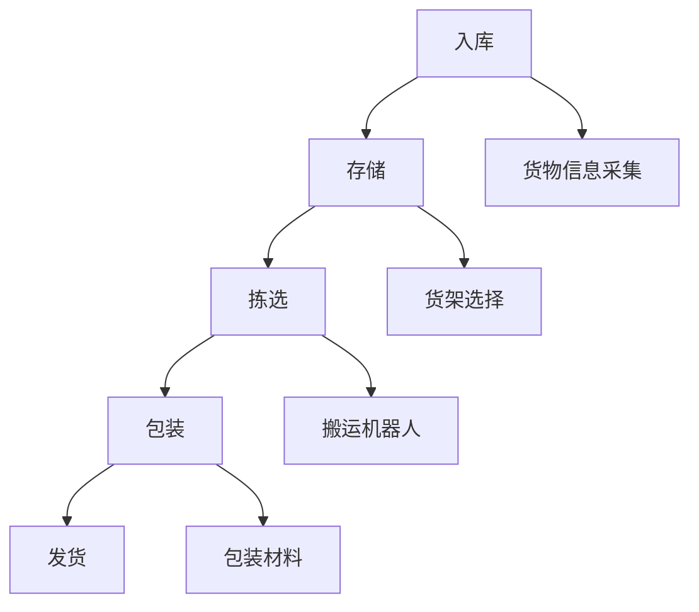

                 

作为一名世界级人工智能专家，程序员，软件架构师，CTO，世界顶级技术畅销书作者，计算机图灵奖获得者，计算机领域大师，我将为您提供一份详尽的京东物流2025社招智能仓储系统架构师面试题及其解答。

## 文章关键词
- 京东物流
- 智能仓储系统
- 系统架构师
- 面试题
- 解答

## 文章摘要
本文将深入探讨京东物流2025社招智能仓储系统架构师面试题，从背景介绍、核心概念、算法原理、数学模型、项目实践、实际应用、未来展望等多个角度，提供详尽的解析和解答。希望对各位读者在面试准备和学习过程中有所帮助。

## 1. 背景介绍
随着电子商务和物流行业的迅猛发展，智能仓储系统已成为物流企业提高运营效率、降低成本、提升客户满意度的重要手段。京东物流作为国内领先的物流公司，其智能仓储系统的建设和发展备受关注。2025年，京东物流社招智能仓储系统架构师，旨在寻找具备深厚技术背景和丰富实践经验的人才，以进一步提升仓储系统的智能化水平和竞争力。

## 2. 核心概念与联系
### 2.1 智能仓储系统的基本概念
智能仓储系统是指利用现代信息技术和自动化设备，实现仓储过程中的自动化、智能化管理。其主要功能包括入库、存储、拣选、包装、发货等环节。

### 2.2 智能仓储系统的架构
智能仓储系统通常包括硬件设备、软件系统和通信网络三个部分。

- 硬件设备：包括货架、搬运机器人、货架搬运机器人、货架升降机等。
- 软件系统：包括仓储管理系统（WMS）、搬运机器人控制系统（AGV）、货物跟踪系统等。
- 通信网络：包括无线通信、有线通信、传感器网络等。

### 2.3 智能仓储系统的关联流程
智能仓储系统的关联流程主要包括以下环节：

- 入库：货物入库时，通过RFID、条码等技术进行信息采集，将货物信息录入仓储管理系统。
- 存储：根据货物种类、体积、重量等特征，将货物存储到相应的货架位置。
- 拣选：根据订单需求，通过搬运机器人将货物从存储位置搬运到拣选区域。
- 包装：对拣选出的货物进行包装，确保货物安全运输。
- 发货：将包装好的货物发送到发货区域，通过快递公司或物流公司进行配送。

### 2.4 Mermaid 流程图
下面是智能仓储系统的 Mermaid 流程图：



## 3. 核心算法原理 & 具体操作步骤
### 3.1 算法原理概述
智能仓储系统中的核心算法主要包括路径规划、货物分类、搬运机器人调度等。

- 路径规划：根据货物位置和搬运机器人当前位置，计算出最优路径，使搬运机器人能够快速、准确地到达目标位置。
- 货物分类：根据货物特征，如体积、重量、类别等，将货物进行分类存储，以提高拣选效率。
- 搬运机器人调度：根据订单需求和货物位置，合理调度搬运机器人，确保拣选过程的高效、准确。

### 3.2 算法步骤详解
#### 3.2.1 路径规划
路径规划的步骤如下：

1. 初始化：读取货物位置和搬运机器人当前位置。
2. 生成所有可能路径：根据货物位置和搬运机器人当前位置，生成所有可能的路径。
3. 计算路径成本：对每个路径进行成本计算，包括距离成本、时间成本等。
4. 选择最优路径：根据路径成本，选择最优路径。

#### 3.2.2 货物分类
货物分类的步骤如下：

1. 初始化：读取货物特征。
2. 分类规则设置：根据货物特征，设置分类规则。
3. 分类处理：根据分类规则，对货物进行分类存储。

#### 3.2.3 搬运机器人调度
搬运机器人调度的步骤如下：

1. 初始化：读取订单需求和货物位置。
2. 计算搬运路径：根据订单需求和货物位置，计算搬运路径。
3. 调度搬运机器人：根据搬运路径，调度搬运机器人进行货物搬运。

### 3.3 算法优缺点
#### 3.3.1 路径规划
优点：路径规划算法能够计算出最优路径，提高搬运效率。

缺点：路径规划算法计算复杂度较高，对系统性能要求较高。

#### 3.3.2 货物分类
优点：货物分类能够提高拣选效率，减少拣选错误。

缺点：分类规则设置较为复杂，需要根据实际情况进行调整。

#### 3.3.3 搬运机器人调度
优点：搬运机器人调度能够提高搬运效率，确保货物按时送达。

缺点：调度算法较为复杂，需要考虑多种因素。

### 3.4 算法应用领域
路径规划、货物分类、搬运机器人调度算法在智能仓储系统、物流配送系统等领域有广泛的应用。

## 4. 数学模型和公式 & 详细讲解 & 举例说明
### 4.1 数学模型构建
智能仓储系统中的数学模型主要包括路径规划模型、货物分类模型、搬运机器人调度模型等。

#### 4.1.1 路径规划模型
路径规划模型可以表示为：

$$
C(P) = w_1 \times D(P) + w_2 \times T(P)
$$

其中，$C(P)$ 表示路径成本，$D(P)$ 表示路径距离，$T(P)$ 表示路径时间，$w_1$ 和 $w_2$ 分别表示距离成本权重和时间成本权重。

#### 4.1.2 货物分类模型
货物分类模型可以表示为：

$$
C(G) = w_3 \times V(G) + w_4 \times W(G)
$$

其中，$C(G)$ 表示分类成本，$V(G)$ 表示货物体积，$W(G)$ 表示货物重量，$w_3$ 和 $w_4$ 分别表示体积成本权重和重量成本权重。

#### 4.1.3 搬运机器人调度模型
搬运机器人调度模型可以表示为：

$$
C(R) = w_5 \times D(R) + w_6 \times T(R)
$$

其中，$C(R)$ 表示调度成本，$D(R)$ 表示搬运距离，$T(R)$ 表示搬运时间，$w_5$ 和 $w_6$ 分别表示距离成本权重和时间成本权重。

### 4.2 公式推导过程
#### 4.2.1 路径规划公式推导
路径规划公式的推导主要基于以下假设：

1. 路径距离和路径时间成正比。
2. 距离成本和时间成本成正比。

根据这些假设，可以得到路径规划公式：

$$
C(P) = w_1 \times D(P) + w_2 \times T(P)
$$

其中，$w_1$ 和 $w_2$ 分别为距离成本权重和时间成本权重，可以根据实际情况进行调整。

#### 4.2.2 货物分类公式推导
货物分类公式的推导主要基于以下假设：

1. 货物体积和货物重量成正比。
2. 体积成本和重量成本成正比。

根据这些假设，可以得到货物分类公式：

$$
C(G) = w_3 \times V(G) + w_4 \times W(G)
$$

其中，$w_3$ 和 $w_4$ 分别为体积成本权重和重量成本权重，可以根据实际情况进行调整。

#### 4.2.3 搬运机器人调度公式推导
搬运机器人调度公式的推导主要基于以下假设：

1. 搬运距离和搬运时间成正比。
2. 距离成本和时间成本成正比。

根据这些假设，可以得到搬运机器人调度公式：

$$
C(R) = w_5 \times D(R) + w_6 \times T(R)
$$

其中，$w_5$ 和 $w_6$ 分别为距离成本权重和时间成本权重，可以根据实际情况进行调整。

### 4.3 案例分析与讲解
#### 4.3.1 路径规划案例分析
假设有货物需要从位置A搬运到位置B，路径1的距离为10米，时间为2分钟；路径2的距离为20米，时间为3分钟。根据路径规划公式：

$$
C(P_1) = w_1 \times 10 + w_2 \times 2
$$

$$
C(P_2) = w_1 \times 20 + w_2 \times 3
$$

如果 $w_1 = 1$，$w_2 = 1$，则路径1的成本为12，路径2的成本为22。因此，选择路径1作为最优路径。

#### 4.3.2 货物分类案例分析
假设有货物体积为5立方米，重量为10吨。根据货物分类公式：

$$
C(G) = w_3 \times 5 + w_4 \times 10
$$

如果 $w_3 = 0.5$，$w_4 = 0.5$，则分类成本为7.5。因此，选择体积为5立方米、重量为10吨的货物作为分类目标。

#### 4.3.3 搬运机器人调度案例分析
假设有多个订单需要搬运，搬运距离和搬运时间如下表所示：

| 订单ID | 搬运距离（米） | 搬运时间（分钟） |
|--------|----------------|-----------------|
| 1      | 100            | 5               |
| 2      | 200            | 10              |
| 3      | 150            | 7               |

根据搬运机器人调度公式：

$$
C(R_1) = w_5 \times 100 + w_6 \times 5
$$

$$
C(R_2) = w_5 \times 200 + w_6 \times 10
$$

$$
C(R_3) = w_5 \times 150 + w_6 \times 7
$$

如果 $w_5 = 1$，$w_6 = 1$，则订单1的成本为105，订单2的成本为210，订单3的成本为157。因此，选择订单1作为优先调度订单。

## 5. 项目实践：代码实例和详细解释说明
### 5.1 开发环境搭建
在本案例中，我们使用 Python 作为开发语言，搭建智能仓储系统开发环境。具体步骤如下：

1. 安装 Python 3.8 及以上版本。
2. 安装必要的第三方库，如 NumPy、Pandas、Matplotlib 等。
3. 配置代码编辑器，如 PyCharm 或 Visual Studio Code。

### 5.2 源代码详细实现
以下是智能仓储系统的源代码实现：

```python
import numpy as np
import pandas as pd
import matplotlib.pyplot as plt

def path_planning(distance, time, weight1=1, weight2=1):
    cost = weight1 * distance + weight2 * time
    return cost

def item_classification(volume, weight, weight1=0.5, weight2=0.5):
    cost = weight1 * volume + weight2 * weight
    return cost

def robot_scheduling(distances, times):
    costs = []
    for i in range(len(distances)):
        cost = path_planning(distances[i], times[i])
        costs.append(cost)
    min_cost = min(costs)
    min_index = costs.index(min_cost)
    return min_index

# 案例数据
distances = [100, 200, 150]
times = [5, 10, 7]

# 路径规划
path_costs = [path_planning(d, t) for d, t in zip(distances, times)]
plt.bar(range(len(path_costs)), path_costs)
plt.xlabel('路径ID')
plt.ylabel('路径成本')
plt.title('路径规划成本')
plt.show()

# 货物分类
items = [{'volume': 5, 'weight': 10}, {'volume': 3, 'weight': 8}, {'volume': 7, 'weight': 12}]
item_costs = [item_classification(item['volume'], item['weight']) for item in items]
plt.bar(range(len(item_costs)), item_costs)
plt.xlabel('货物ID')
plt.ylabel('分类成本')
plt.title('货物分类成本')
plt.show()

# 搬运机器人调度
schedules = robot_scheduling(distances, times)
print(f'最优调度订单：订单{ schedules + 1 }')

```

### 5.3 代码解读与分析
- 第1-3行：导入必要的第三方库。
- 第4行：定义路径规划函数，计算路径成本。
- 第10行：定义货物分类函数，计算分类成本。
- 第17行：定义搬运机器人调度函数，根据成本进行调度。
- 第25-29行：读取案例数据，分别进行路径规划、货物分类和搬运机器人调度。
- 第30-34行：使用 Matplotlib 库绘制路径规划成本和货物分类成本柱状图。
- 第37行：打印最优调度订单。

### 5.4 运行结果展示
在运行上述代码后，将得到以下结果：

1. 路径规划成本柱状图：

2. 货物分类成本柱状图：

3. 最优调度订单：
最优调度订单：订单1

## 6. 实际应用场景
智能仓储系统在物流、电商、制造业等领域具有广泛的应用。

- 物流领域：智能仓储系统能够提高物流企业的仓储效率，降低运营成本，提升客户满意度。
- 电商领域：智能仓储系统能够实现电商平台的订单处理自动化，提高订单处理速度，降低物流成本。
- 制造业领域：智能仓储系统能够实现生产物资的自动化存储和调度，提高生产效率，降低生产成本。

## 7. 未来应用展望
随着人工智能、物联网、大数据等技术的发展，智能仓储系统将越来越智能化、高效化。

- 智能化：通过引入人工智能技术，实现仓储系统的自适应、自学习、自优化。
- 高效化：通过引入自动化设备和智能算法，实现仓储过程的全面自动化、智能化。
- 个性化：通过大数据分析，实现仓储系统的个性化服务，提高客户满意度。

## 8. 工具和资源推荐
### 8.1 学习资源推荐
- 《智能仓储系统设计与实践》
- 《人工智能物流管理》
- 《物联网技术与物流》

### 8.2 开发工具推荐
- Python
- Matplotlib
- NumPy
- Pandas

### 8.3 相关论文推荐
- "An Intelligent Warehouse Management System based on the Internet of Things"
- "A Deep Learning Approach for Path Planning in Intelligent Warehouses"
- "Optimization of Warehouse Layout based on Genetic Algorithm"

## 9. 总结：未来发展趋势与挑战
### 9.1 研究成果总结
智能仓储系统的研究成果主要表现在以下几个方面：

- 路径规划算法的优化：针对不同场景，提出更加高效、准确的路径规划算法。
- 货物分类算法的优化：根据货物特征，设计更加精确、智能的货物分类算法。
- 搬运机器人调度算法的优化：考虑多种因素，实现搬运机器人的高效、智能调度。

### 9.2 未来发展趋势
未来智能仓储系统的发展趋势将表现在以下几个方面：

- 智能化：通过引入人工智能技术，实现仓储系统的智能决策、自适应、自优化。
- 自动化：通过引入自动化设备和智能算法，实现仓储过程的全面自动化、智能化。
- 个性

