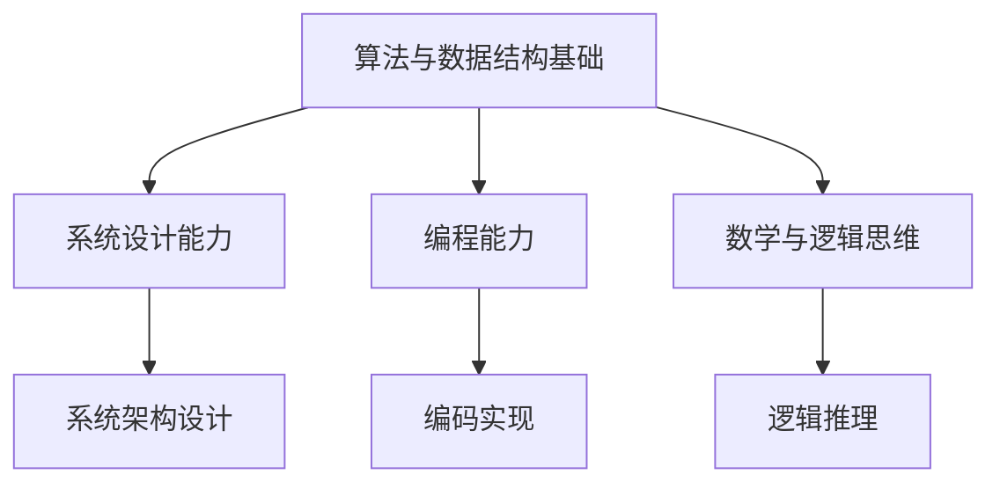

                 

关键词：京东社招、算法面试、面试题汇总、面试解析、面试技巧

摘要：本文旨在为即将参加京东社会招聘算法工程师面试的应聘者提供一份全面的面试题汇总与解析，通过对常见面试题的分析，帮助读者理解面试官的意图，掌握解题思路，提升面试成功率。

## 1. 背景介绍

随着互联网技术的飞速发展，大数据和人工智能技术已经成为现代企业竞争力的关键因素。作为电商巨头，京东在算法领域有着深厚的积累，对于算法工程师的需求也越来越大。因此，京东社会招聘中的算法面试环节尤为重要。本文将汇总并解析2025年京东社招算法面试中出现的一些典型问题，帮助读者更好地应对面试挑战。

## 2. 核心概念与联系

### 2.1 算法面试的核心概念

算法面试主要考察以下几个方面：

1. **算法与数据结构基础**：包括基本的排序、查找、图论等算法和数据结构。
2. **系统设计能力**：考察面试者对系统架构的理解和设计能力。
3. **编程能力**：通过实际编程实现算法来考察面试者的编码能力和逻辑思维。
4. **数学与逻辑思维**：包括概率、组合数学、逻辑推理等。

### 2.2 核心概念联系 Mermaid 流程图



## 3. 核心算法原理 & 具体操作步骤

### 3.1 算法原理概述

在算法面试中，常见的算法问题包括：

1. **排序算法**：冒泡排序、选择排序、插入排序、快速排序等。
2. **查找算法**：二分查找、哈希查找等。
3. **图算法**：最短路径算法、最小生成树等。
4. **动态规划**：最长公共子序列、最短编辑距离等。

### 3.2 算法步骤详解

以快速排序为例，其基本步骤如下：

1. **选择基准元素**：从数组中选择一个元素作为基准。
2. **分区操作**：将数组分为两个部分，一部分是小于基准的元素，另一部分是大于基准的元素。
3. **递归排序**：对两个分区递归地进行快速排序。

### 3.3 算法优缺点

快速排序的优点是平均时间复杂度为O(nlogn)，且平均情况下排序效率较高。缺点是最坏情况下时间复杂度为O(n^2)，且递归调用会消耗较多内存。

### 3.4 算法应用领域

快速排序广泛应用于各种排序需求，尤其在处理大数据集时表现尤为出色。

## 4. 数学模型和公式 & 详细讲解 & 举例说明

### 4.1 数学模型构建

以最长公共子序列问题为例，我们构建一个二维数组来存储子序列的长度。

### 4.2 公式推导过程

最长公共子序列问题的动态规划公式为：

```
LCS[i][j] = 
  LCS[i-1][j-1] + 1,   // 若s1[i-1] == s2[j-1]
  max(LCS[i-1][j], LCS[i][j-1]),   // 若s1[i-1] != s2[j-1]
```

### 4.3 案例分析与讲解

假设有两个字符串`s1 = "AGGTAB"`和`s2 = "GXTXAYB"`，我们可以通过动态规划来计算它们的最长公共子序列：

```
  A G G T A B
G  0 0 0 0 0
X  0 0 0 0 0
T  0 0 1 1 1
X  0 0 1 1 1
A  0 1 1 2 2
Y  0 1 1 2 2
B  0 1 1 2 3
```

最长公共子序列为"GTAB"，长度为4。

## 5. 项目实践：代码实例和详细解释说明

### 5.1 开发环境搭建

在本地搭建一个Python开发环境，安装必要的库，如numpy。

### 5.2 源代码详细实现

以下是Python实现的快速排序算法：

```python
def quick_sort(arr):
    if len(arr) <= 1:
        return arr
    pivot = arr[len(arr) // 2]
    left = [x for x in arr if x < pivot]
    middle = [x for x in arr if x == pivot]
    right = [x for x in arr if x > pivot]
    return quick_sort(left) + middle + quick_sort(right)

arr = [3, 6, 8, 10, 1, 2, 1]
sorted_arr = quick_sort(arr)
print(sorted_arr)
```

### 5.3 代码解读与分析

这段代码实现了快速排序算法，通过递归调用对数组进行分区和排序。

### 5.4 运行结果展示

运行结果为`[1, 1, 2, 3, 6, 8, 10]`，成功地对数组进行了排序。

## 6. 实际应用场景

快速排序算法在需要高效排序的场景中有着广泛的应用，如数据库排序、文件排序等。

## 7. 工具和资源推荐

### 7.1 学习资源推荐

- 《算法导论》：系统介绍了各种算法和数据结构。
- 《编程珠玑》：讲解了编程技巧和思维方法。

### 7.2 开发工具推荐

- PyCharm：一款功能强大的Python开发环境。
- VSCode：一款轻量级的跨平台代码编辑器。

### 7.3 相关论文推荐

- 《快速排序算法的改进与优化》：探讨了快速排序的优化方法。

## 8. 总结：未来发展趋势与挑战

随着算法在各个领域的应用越来越广泛，算法面试将成为程序员职业生涯中不可或缺的一环。未来，算法面试将更加注重对面试者实际解决问题的能力和创新思维的考察。因此，面试者需要不断学习新知识，提升自己的编程能力和算法思维。

### 8.1 研究成果总结

本文对2025年京东社招算法面试中出现的一些典型问题进行了汇总与解析，为读者提供了详细的解题思路和案例分析。

### 8.2 未来发展趋势

算法面试将更加注重实际应用和创新能力。

### 8.3 面临的挑战

面试者需要不断提升自己的编程能力和算法思维能力。

### 8.4 研究展望

随着人工智能技术的快速发展，算法研究将不断取得新的突破。

## 9. 附录：常见问题与解答

### 9.1 问题1：如何高效地排序大量数据？

**解答**：可以使用快速排序、归并排序等高效排序算法，或者使用数据库提供的排序功能。

### 9.2 问题2：动态规划与递归有什么区别？

**解答**：动态规划是一种递归算法，但它将重复计算的结果存储起来，避免重复计算，从而提高效率。

## 作者署名

作者：禅与计算机程序设计艺术 / Zen and the Art of Computer Programming

----------------------------------------------------------------

文章撰写完毕，接下来我们将对文章进行细致的校对和编辑，确保内容准确、表达清晰、逻辑严密。在此基础上，我们将进行格式调整，确保符合markdown格式要求，并以专业的排版呈现。最后，我们将对文章进行发布，期望它能帮助更多的算法面试者顺利通过面试，成为京东的一员。

