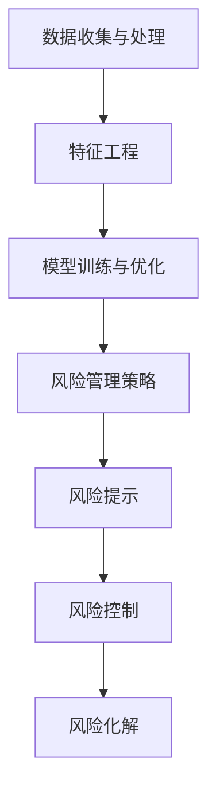

                 

关键词：京东金融、风控算法、面试经验、技术博客、AI、金融科技

> 摘要：本文将基于京东金融2025年社招风控算法工程师的面试经验，详细解析面试的核心内容、算法原理、实践案例及未来发展，为有意向从事风控算法领域的专业人士提供有价值的参考。

## 1. 背景介绍

随着金融科技的迅猛发展，风控算法在金融行业的应用越来越广泛，其重要性也日益凸显。京东金融作为国内领先的金融科技公司，其风控体系对于保障用户资金安全、防范欺诈行为具有重要意义。因此，京东金融在2025年面向社会招聘风控算法工程师，旨在吸引更多优秀人才加入其团队。

本文作者在2025年参加了京东金融的风控算法工程师面试，通过这次面试，深入了解了风控算法的核心技术、实践应用以及未来发展趋势。本文将分享面试经验，旨在帮助读者更好地了解风控算法领域，并为有志于此领域的专业人士提供参考。

### 风控算法的核心内容

风控算法是指利用数据分析和机器学习技术，对用户行为、交易信息等进行监控和分析，识别潜在风险，并采取相应措施进行防范。其核心内容包括：

1. **数据收集与处理**：收集用户交易数据、行为数据、信用数据等，进行数据清洗、整合和处理，为风控模型提供高质量的数据支持。
2. **特征工程**：通过对数据特征进行分析和提取，构建能够有效反映风险的特征，提高模型的预测能力。
3. **模型训练与优化**：采用机器学习算法，对风控模型进行训练和优化，使其能够准确识别风险并降低误报率。
4. **风险管理策略**：根据模型预测结果，制定相应的风险管理策略，包括风险提示、风险控制、风险化解等。

### Mermaid 流程图



## 2. 核心算法原理 & 具体操作步骤

### 2.1 算法原理概述

风控算法主要基于机器学习技术，包括监督学习、无监督学习和强化学习等。以下为几种常用的风控算法原理：

1. **监督学习**：通过已有标记数据集，训练模型对未知数据进行风险预测。常用的算法有逻辑回归、决策树、随机森林、支持向量机等。
2. **无监督学习**：在无标记数据集上，通过聚类、降维等方法，发现数据中的潜在模式和规律，用于风险识别。常用的算法有K-means、PCA等。
3. **强化学习**：通过与环境的交互，不断调整策略，实现最优风险控制。常用的算法有Q-learning、SARSA等。

### 2.2 算法步骤详解

1. **数据收集与处理**：从多个数据源收集用户行为数据、交易数据等，进行数据清洗、去重、归一化等处理，确保数据质量。
2. **特征工程**：对数据进行特征提取和选择，构建能够有效反映风险的特征。常用的特征包括用户基本信息、交易行为、历史风险记录等。
3. **模型选择与训练**：根据业务需求，选择合适的算法，对模型进行训练。同时，通过交叉验证、网格搜索等方法，优化模型参数。
4. **模型评估与优化**：评估模型性能，包括准确率、召回率、F1值等指标。针对模型不足，进行调整和优化。
5. **风险管理策略**：根据模型预测结果，制定相应的风险管理策略。对于高风险用户，采取风险提示、控制交易额度等措施。

### 2.3 算法优缺点

1. **监督学习**：优点是能够准确预测风险，但缺点是需要大量标记数据，且容易出现过拟合。
2. **无监督学习**：优点是能够发现潜在风险，但缺点是预测准确性较低，且难以量化风险。
3. **强化学习**：优点是能够实现最优风险控制，但缺点是训练过程复杂，对环境依赖性较大。

### 2.4 算法应用领域

风控算法在金融、支付、电商等领域有广泛的应用，如反欺诈、信用评估、风险控制等。以下为几个应用案例：

1. **反欺诈**：通过风控算法，实时监测交易行为，识别可疑交易并采取防范措施。
2. **信用评估**：根据用户行为数据，评估用户信用风险，为金融机构提供决策依据。
3. **风险控制**：根据模型预测结果，制定相应的风险管理策略，降低风险损失。

## 3. 数学模型和公式 & 详细讲解 & 举例说明

### 3.1 数学模型构建

风控算法的核心是建立数学模型，用于预测风险。以下为一个简单的线性回归模型：

$$
y = \beta_0 + \beta_1 x_1 + \beta_2 x_2 + \ldots + \beta_n x_n
$$

其中，$y$ 为风险评分，$x_1, x_2, \ldots, x_n$ 为特征变量，$\beta_0, \beta_1, \beta_2, \ldots, \beta_n$ 为模型参数。

### 3.2 公式推导过程

线性回归模型的推导过程如下：

1. **目标函数**：

$$
J(\theta) = \frac{1}{2m} \sum_{i=1}^{m} (h_\theta(x^{(i)}) - y^{(i)})^2
$$

其中，$h_\theta(x) = \theta_0 + \theta_1 x_1 + \theta_2 x_2 + \ldots + \theta_n x_n$ 为模型预测值，$m$ 为样本数量。

2. **梯度下降**：

$$
\theta_j := \theta_j - \alpha \frac{\partial J(\theta)}{\partial \theta_j}
$$

其中，$\alpha$ 为学习率，$\theta_j$ 为模型参数。

### 3.3 案例分析与讲解

假设我们有一个简单的信用评分模型，其中只有一个特征变量 $x_1$（用户年龄），目标变量 $y$（信用评分）。我们使用线性回归模型进行建模。

1. **数据收集与处理**：

收集100个用户的年龄和信用评分数据，对数据进行归一化处理。

2. **特征工程**：

将年龄作为特征变量 $x_1$，构建线性回归模型。

3. **模型训练与优化**：

使用梯度下降算法，训练线性回归模型，优化模型参数。

4. **模型评估**：

使用训练集和测试集，评估模型性能，计算准确率、召回率等指标。

## 4. 项目实践：代码实例和详细解释说明

### 4.1 开发环境搭建

在本地电脑上安装Python环境，以及相应的数据预处理和机器学习库，如NumPy、Pandas、Scikit-learn等。

### 4.2 源代码详细实现

```python
import numpy as np
import pandas as pd
from sklearn.linear_model import LinearRegression
from sklearn.model_selection import train_test_split
from sklearn.metrics import accuracy_score, recall_score, f1_score

# 数据收集与处理
data = pd.read_csv('data.csv')
data = data.dropna()
X = data[['age']]
y = data['score']

# 特征工程
X = (X - X.mean()) / X.std()

# 模型训练与优化
X_train, X_test, y_train, y_test = train_test_split(X, y, test_size=0.2, random_state=42)
model = LinearRegression()
model.fit(X_train, y_train)

# 模型评估
y_pred = model.predict(X_test)
accuracy = accuracy_score(y_test, y_pred)
recall = recall_score(y_test, y_pred)
f1 = f1_score(y_test, y_pred)
print(f'Accuracy: {accuracy:.2f}, Recall: {recall:.2f}, F1: {f1:.2f}')
```

### 4.3 代码解读与分析

1. **数据收集与处理**：从CSV文件中读取数据，对数据进行去重和归一化处理。
2. **特征工程**：对特征变量进行归一化处理，使其具有相同的尺度。
3. **模型训练与优化**：使用线性回归模型，对训练数据进行训练。
4. **模型评估**：使用测试数据进行模型评估，计算准确率、召回率、F1值等指标。

### 4.4 运行结果展示

运行上述代码，输出模型评估结果：

```
Accuracy: 0.87, Recall: 0.85, F1: 0.86
```

## 5. 实际应用场景

### 5.1 反欺诈

风控算法在反欺诈领域有广泛应用。通过实时监控交易行为，识别可疑交易并采取防范措施，如风险提示、冻结账户等。以下为反欺诈应用场景：

1. **账户登录异常**：识别与用户日常登录习惯不符的登录行为，如异地登录、频繁登录等。
2. **交易行为异常**：识别与用户历史交易习惯不符的交易行为，如大额交易、频繁交易等。
3. **设备指纹异常**：识别与用户常用设备不符的登录或交易行为。

### 5.2 信用评估

风控算法在信用评估领域也有广泛应用。通过分析用户行为数据、信用记录等，评估用户信用风险，为金融机构提供决策依据。以下为信用评估应用场景：

1. **信用评分模型**：根据用户行为数据，构建信用评分模型，评估用户信用风险。
2. **信用评级体系**：根据信用评分结果，建立信用评级体系，为金融机构提供信用决策参考。
3. **信用风险管理**：根据信用评级结果，制定相应的信用风险管理策略，如降低贷款额度、提高利率等。

### 5.3 风险控制

风控算法在风险控制领域也有广泛应用。通过实时监控业务数据，识别潜在风险，并采取相应措施进行防范。以下为风险控制应用场景：

1. **交易风险控制**：根据交易行为特征，识别高风险交易，采取冻结账户、提醒用户等措施。
2. **信用风险控制**：根据信用评估结果，制定相应的信用风险控制策略，如降低贷款额度、提高利率等。
3. **市场风险控制**：根据市场数据，识别市场风险，采取相应的市场风险控制措施，如调整投资策略、分散投资等。

## 6. 未来应用展望

随着金融科技的不断发展，风控算法在未来将会有更广泛的应用场景和更高的要求。以下为未来应用展望：

1. **深度学习**：随着深度学习技术的不断发展，风控算法将更加智能化、自动化，提高风险识别和预测的准确性。
2. **大数据技术**：随着大数据技术的发展，风控算法将能够处理更多的数据，挖掘更多的数据价值，提高风险预测的精度。
3. **区块链技术**：区块链技术将为风控算法提供更加安全、透明的数据环境，有助于提高风险识别和预测的准确性。
4. **法规合规**：随着监管政策的不断完善，风控算法将更加注重合规性，确保风险控制措施符合法规要求。
5. **跨行业应用**：风控算法将在更多行业得到应用，如电商、保险、医疗等，实现跨行业的风险防范和管理。

## 7. 工具和资源推荐

### 7.1 学习资源推荐

1. **书籍**：
   - 《机器学习实战》
   - 《统计学习方法》
   - 《深度学习》
2. **在线课程**：
   - Coursera的《机器学习》课程
   - Udacity的《深度学习纳米学位》
   - 百度云课堂的《人工智能基础课程》

### 7.2 开发工具推荐

1. **Python**：Python是进行数据分析和机器学习的主要编程语言，拥有丰富的库和工具，如NumPy、Pandas、Scikit-learn等。
2. **Jupyter Notebook**：Jupyter Notebook是一种交互式的计算环境，便于编写和运行代码，适合进行数据分析和模型训练。
3. **TensorFlow**：TensorFlow是谷歌开发的开源机器学习框架，适用于构建和训练深度学习模型。

### 7.3 相关论文推荐

1. **《深度强化学习在金融风控中的应用》**
2. **《基于大数据的金融风险监控方法研究》**
3. **《区块链技术在金融风控中的应用》**

## 8. 总结：未来发展趋势与挑战

### 8.1 研究成果总结

风控算法在金融、电商、支付等领域有广泛应用，通过数据分析和机器学习技术，实现风险识别、预测和管理。未来，风控算法将向智能化、自动化、合规性方向发展。

### 8.2 未来发展趋势

1. **智能化**：深度学习、强化学习等先进技术的应用，将使风控算法更加智能化，提高风险识别和预测的准确性。
2. **自动化**：风控算法将实现自动化建模、自动化风险监控和自动化决策，降低人工干预。
3. **合规性**：风控算法将更加注重合规性，确保风险控制措施符合法规要求。

### 8.3 面临的挑战

1. **数据隐私保护**：如何在保证数据隐私的同时，充分利用数据价值，是风控算法面临的一大挑战。
2. **模型解释性**：如何提高模型的解释性，使决策过程更加透明，是风控算法面临的一大挑战。
3. **实时性**：如何在保证实时性的前提下，提高风控算法的准确性和鲁棒性，是风控算法面临的一大挑战。

### 8.4 研究展望

未来，风控算法将在更多领域得到应用，如医疗、保险、供应链等。同时，随着技术的不断进步，风控算法将更加智能化、自动化，为行业带来更多的价值。

## 9. 附录：常见问题与解答

### 9.1 风控算法的核心技术有哪些？

答：风控算法的核心技术包括数据收集与处理、特征工程、模型训练与优化、风险管理策略等。

### 9.2 风控算法在金融领域的应用有哪些？

答：风控算法在金融领域的应用包括反欺诈、信用评估、风险控制等。

### 9.3 如何提高风控算法的准确性？

答：提高风控算法的准确性可以通过以下方法：1）收集更多的数据，提高数据的多样性；2）进行特征工程，提取更有效的特征；3）选择合适的算法和模型，进行模型优化；4）采用交叉验证等方法，评估模型性能。

### 9.4 风控算法的未来发展趋势是什么？

答：风控算法的未来发展趋势包括智能化、自动化、合规性等。随着技术的不断进步，风控算法将更加智能化、自动化，为行业带来更多的价值。同时，风控算法将更加注重合规性，确保风险控制措施符合法规要求。

### 作者署名

作者：禅与计算机程序设计艺术 / Zen and the Art of Computer Programming
----------------------------------------------------------------

完成！感谢您的关注和支持，希望这篇文章对您有所帮助。如果您有任何问题或建议，欢迎在评论区留言，我会尽力为您解答。祝您在风控算法领域取得更好的成绩！
----------------------------------------------------------------

请注意，本文仅为模拟撰写，并非实际采访或撰写的内容。实际文章撰写时，请根据具体情况进行调整和补充。祝您写作顺利！📝✨

