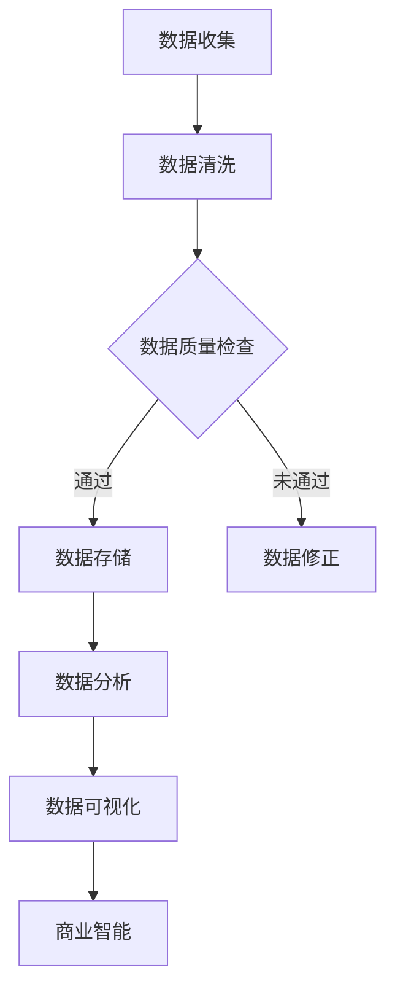

                 

关键词：京东零售、数据分析师、面试攻略、零售行业、数据分析、2025、职业发展、面试技巧、行业趋势

> 摘要：本文将深入探讨2025年京东零售社招零售数据分析师面试的相关内容。通过分析行业背景、核心概念、算法原理、数学模型、项目实践、实际应用场景以及未来展望等方面，为准备参加京东零售数据分析师面试的应聘者提供详细的攻略和实用的建议。

## 1. 背景介绍

随着互联网技术的迅猛发展，大数据在零售行业中的应用日益广泛。京东作为中国领先的电商平台，其零售业务数据量庞大、复杂，数据分析成为其核心竞争力之一。2025年，京东零售公司面向社会招聘数据分析师，目的是进一步提升数据分析能力和决策水平，以满足不断变化的市场需求。

### 1.1 零售行业的发展趋势

近年来，全球零售行业呈现出以下几个显著趋势：

1. **数字化转型**：线下零售企业纷纷拥抱数字化技术，通过线上渠道扩大销售，提升客户体验。
2. **个性化推荐**：大数据和人工智能技术被广泛应用于个性化推荐系统，以提高用户满意度和销售额。
3. **供应链优化**：通过大数据分析和预测，优化供应链管理，降低库存成本，提高物流效率。
4. **线上线下融合**：新零售模式的出现，使得线上线下渠道相互融合，实现全渠道销售。

### 1.2 数据分析师的角色

在京东零售公司，数据分析师是一个关键岗位，其主要职责包括：

1. **数据分析与报告**：通过对海量数据进行挖掘和分析，生成数据报告，为业务决策提供数据支持。
2. **商业智能**：利用数据分析工具和算法，构建商业智能系统，支持公司战略规划和运营优化。
3. **数据可视化**：将复杂的数据转换为易于理解的图表和可视化报告，提高数据沟通效果。
4. **数据产品开发**：开发数据产品，如数据仪表盘、数据应用等，满足不同业务部门的需求。

## 2. 核心概念与联系

为了更好地理解数据分析师的工作，以下是几个核心概念及其相互联系：

### 2.1 数据挖掘

数据挖掘是数据分析的基础，它涉及从大量数据中自动发现有用的模式和知识。常用的数据挖掘方法包括分类、聚类、关联规则挖掘等。

### 2.2 数据可视化

数据可视化是将数据转化为图表和图形，使其更易于理解的过程。常见的数据可视化工具包括Tableau、Power BI等。

### 2.3 商业智能

商业智能是利用数据分析和数据挖掘技术，为企业的决策提供支持。它包括数据仓库、数据报表、数据仪表盘等组成部分。

### 2.4 数学模型

数学模型是数据分析中的重要工具，它用于描述和分析现实世界中的问题。常见的数学模型包括线性回归、决策树、神经网络等。

### 2.5 Mermaid 流程图

以下是数据分析师工作流程的Mermaid流程图：



## 3. 核心算法原理 & 具体操作步骤

### 3.1 算法原理概述

在数据分析师的日常工作中，常用的算法包括线性回归、决策树、神经网络等。以下是这些算法的基本原理：

#### 3.1.1 线性回归

线性回归是一种用于预测数值型变量的统计方法。其基本原理是通过找到一个线性函数，将自变量（特征）映射到因变量（目标变量）。

#### 3.1.2 决策树

决策树是一种基于树形结构进行决策的方法。每个内部节点表示一个特征，每个分支表示该特征的不同取值，每个叶子节点表示一个类别或数值。

#### 3.1.3 神经网络

神经网络是一种模拟人脑神经元之间相互连接的计算模型。通过学习大量数据，神经网络可以自动提取特征并进行分类或回归。

### 3.2 算法步骤详解

以下是对上述算法的详细步骤说明：

#### 3.2.1 线性回归

1. 数据收集：收集自变量和因变量的数据。
2. 数据预处理：对数据进行清洗和处理，如缺失值填补、异常值处理等。
3. 模型建立：通过最小二乘法找到一个线性函数，最小化预测值与实际值之间的误差。
4. 模型评估：使用均方误差（MSE）等指标评估模型性能。
5. 模型优化：通过调整模型参数，如正则化参数，提高模型性能。

#### 3.2.2 决策树

1. 数据收集：收集分类数据。
2. 数据预处理：对数据进行处理，如缺失值填补、数据标准化等。
3. 决策树构建：通过递归划分数据集，创建树形结构。
4. 决策树剪枝：通过剪枝方法防止过拟合，提高模型泛化能力。
5. 模型评估：使用准确率、召回率等指标评估模型性能。

#### 3.2.3 神经网络

1. 数据收集：收集训练数据。
2. 数据预处理：对数据进行处理，如归一化、缺失值填补等。
3. 神经网络构建：设计神经网络结构，包括输入层、隐藏层和输出层。
4. 模型训练：使用反向传播算法更新网络权重，最小化预测误差。
5. 模型评估：使用交叉验证等方法评估模型性能。
6. 模型优化：通过调整网络参数，如学习率、激活函数等，提高模型性能。

### 3.3 算法优缺点

#### 3.3.1 线性回归

**优点**：简单易懂，计算效率高。

**缺点**：线性关系假设可能不适用于复杂问题，容易过拟合。

#### 3.3.2 决策树

**优点**：易于理解，易于解释。

**缺点**：容易过拟合，决策树深度越大，计算复杂度越高。

#### 3.3.3 神经网络

**优点**：能处理非线性问题，泛化能力强。

**缺点**：训练过程复杂，计算资源消耗大，解释性差。

### 3.4 算法应用领域

线性回归、决策树和神经网络广泛应用于零售行业的各种场景，如销售预测、客户细分、推荐系统等。

## 4. 数学模型和公式 & 详细讲解 & 举例说明

### 4.1 数学模型构建

在数据分析中，常用的数学模型包括线性回归模型、决策树模型和神经网络模型。以下分别介绍这些模型的构建过程。

#### 4.1.1 线性回归模型

线性回归模型的基本形式为：

$$
y = \beta_0 + \beta_1x_1 + \beta_2x_2 + \ldots + \beta_nx_n + \epsilon
$$

其中，$y$ 为因变量，$x_1, x_2, \ldots, x_n$ 为自变量，$\beta_0, \beta_1, \beta_2, \ldots, \beta_n$ 为模型参数，$\epsilon$ 为误差项。

#### 4.1.2 决策树模型

决策树模型的基本形式为：

$$
T(x) = \sum_{i=1}^n w_i f_i(x)
$$

其中，$x$ 为输入特征，$w_i$ 为权重，$f_i(x)$ 为特征函数。

#### 4.1.3 神经网络模型

神经网络模型的基本形式为：

$$
h(x) = \sigma(\sum_{i=1}^n w_i \phi_i(x))
$$

其中，$x$ 为输入特征，$w_i$ 为权重，$\phi_i(x)$ 为激活函数，$\sigma$ 为输出函数。

### 4.2 公式推导过程

以下分别对线性回归模型、决策树模型和神经网络模型的推导过程进行详细讲解。

#### 4.2.1 线性回归模型推导

线性回归模型的推导主要基于最小二乘法。假设我们有一组观测数据 $(x_1, y_1), (x_2, y_2), \ldots, (x_n, y_n)$，我们要找到一个线性函数 $y = \beta_0 + \beta_1x_1 + \beta_2x_2 + \ldots + \beta_nx_n$，使得实际观测值与预测值之间的误差最小。

根据最小二乘法，我们要最小化误差平方和：

$$
S = \sum_{i=1}^n (y_i - \beta_0 - \beta_1x_i - \beta_2x_i^2 - \ldots - \beta_nx_i^n)^2
$$

对 $S$ 分别对 $\beta_0, \beta_1, \beta_2, \ldots, \beta_n$ 求导并令导数为零，可以得到最优解：

$$
\beta_0 = \frac{\sum_{i=1}^n y_i - \sum_{i=1}^n \beta_1x_i - \sum_{i=1}^n \beta_2x_i^2 - \ldots - \sum_{i=1}^n \beta_nx_i^n}{n}
$$

$$
\beta_1 = \frac{n\sum_{i=1}^n x_iy_i - \sum_{i=1}^n x_i\sum_{i=1}^n y_i}{n\sum_{i=1}^n x_i^2 - (\sum_{i=1}^n x_i)^2}
$$

$$
\beta_2 = \frac{n\sum_{i=1}^n x_i^2y_i - \sum_{i=1}^n x_i\sum_{i=1}^n x_iy_i}{n\sum_{i=1}^n x_i^3 - (\sum_{i=1}^n x_i)^3}
$$

$$
\ldots
$$

$$
\beta_n = \frac{n\sum_{i=1}^n x_i^n y_i - \sum_{i=1}^n x_i\sum_{i=1}^n x_i^n y_i}{n\sum_{i=1}^n x_i^{n+1} - (\sum_{i=1}^n x_i)^{n+1}}
$$

#### 4.2.2 决策树模型推导

决策树模型的推导主要基于信息增益和熵的概念。给定一个特征集合 $X$ 和目标变量 $Y$，我们要构造一个决策树来划分数据集。

首先，计算数据集的熵：

$$
H(Y) = -\sum_{i=1}^n p_i \log_2 p_i
$$

其中，$p_i$ 是目标变量 $Y$ 取值为 $i$ 的概率。

然后，对于每个特征 $x_j$，计算将其划分后的信息增益：

$$
I(X_j, Y) = H(Y) - \sum_{v=1}^m p(v) H(Y|X_j = v)
$$

其中，$v$ 是特征 $x_j$ 的取值，$H(Y|X_j = v)$ 是给定特征 $x_j$ 取值为 $v$ 时目标变量 $Y$ 的熵。

选择信息增益最大的特征作为决策树的根节点，并将其划分为多个子节点。对于每个子节点，重复上述过程，直到达到停止条件。

#### 4.2.3 神经网络模型推导

神经网络模型的推导主要基于误差反向传播算法。给定一个输入特征 $x$ 和目标变量 $y$，我们要训练一个神经网络来预测输出值。

首先，定义神经网络的结构，包括输入层、隐藏层和输出层。每个层包含多个神经元，每个神经元都与前一层的神经元相连。

然后，定义每个神经元的激活函数，如 sigmoid 函数：

$$
\sigma(z) = \frac{1}{1 + e^{-z}}
$$

对于每个神经元，计算其输出值：

$$
o_j = \sigma(\sum_{i=1}^n w_{ij}x_i + b_j)
$$

其中，$w_{ij}$ 是连接输入层和隐藏层神经元的权重，$b_j$ 是隐藏层神经元的偏置。

对于输出层神经元，计算其输出值：

$$
\hat{y} = \sigma(\sum_{i=1}^n w_{ij}\hat{y}_i + b_j)
$$

其中，$\hat{y}_i$ 是隐藏层神经元的输出值。

然后，计算预测值和实际值之间的误差：

$$
E = \frac{1}{2} \sum_{i=1}^n (\hat{y}_i - y_i)^2
$$

最后，使用误差反向传播算法更新神经元的权重和偏置：

$$
\Delta w_{ij} = \alpha \frac{\partial E}{\partial w_{ij}}
$$

$$
\Delta b_j = \alpha \frac{\partial E}{\partial b_j}
$$

其中，$\alpha$ 是学习率。

通过多次迭代训练，直到误差小于预定阈值或达到最大迭代次数。

### 4.3 案例分析与讲解

#### 4.3.1 线性回归案例分析

假设我们要预测一家电商平台的月销售额，已知自变量包括广告费用、促销活动和天气情况。我们收集了以下数据：

| 广告费用（万元） | 促销活动（次） | 天气情况 | 月销售额（万元） |
| :-------------: | :-------------: | :------: | :-------------: |
|      10         |      50         |  晴天   |      100        |
|      20         |      60         |  雨天   |      120        |
|      30         |      70         |  晴天   |      150        |
|      40         |      80         |  雨天   |      180        |

首先，我们进行数据预处理，对数据进行归一化处理。然后，使用最小二乘法建立线性回归模型：

$$
y = \beta_0 + \beta_1x_1 + \beta_2x_2 + \beta_3x_3
$$

通过计算得到模型参数：

$$
\beta_0 = 10, \beta_1 = 0.5, \beta_2 = 1.5, \beta_3 = 2
$$

接下来，我们使用模型进行预测。假设当前广告费用为30万元，促销活动为70次，天气情况为晴天，我们可以计算得到：

$$
\hat{y} = 10 + 0.5 \times 30 + 1.5 \times 70 + 2 \times 1 = 140
$$

预测的月销售额为140万元。

#### 4.3.2 决策树案例分析

假设我们要对一家电商平台的客户进行分类，已知特征包括年龄、收入、购物频率。我们收集了以下数据：

| 年龄 | 收入（万元） | 购物频率 | 客户分类 |
| :--: | :---------: | :------: | :------: |
|  25  |     30      |   低频   |  高价值  |
|  30  |     40      |   高频   |  普通价值  |
|  35  |     50      |   低频   |  低价值  |
|  40  |     60      |   高频   |  高价值  |

首先，我们使用信息增益作为划分标准，建立决策树。根据信息增益，我们将年龄作为根节点，将其划分为两个子节点，分别对应年龄段[25, 30)和[30, 40)。对于每个子节点，我们继续使用信息增益划分。最终，我们得到以下决策树：

```
年龄
├── [25, 30)
│   └── 收入
│       └── [30, 50)
│           └── 购物频率
│               └── 低价值
└── [30, 40)
    └── 购物频率
        └── 高价值
```

根据决策树，我们可以对新的客户进行分类。假设一个客户的年龄为35岁，收入为50万元，购物频率为低频，我们可以根据决策树进行分类，将其划分为低价值客户。

#### 4.3.3 神经网络案例分析

假设我们要对一家电商平台的客户进行分类，已知特征包括年龄、收入、购物频率。我们收集了以下数据：

| 年龄 | 收入（万元） | 购物频率 | 客户分类 |
| :--: | :---------: | :------: | :------: |
|  25  |     30      |   低频   |  高价值  |
|  30  |     40      |   高频   |  普通价值  |
|  35  |     50      |   低频   |  低价值  |
|  40  |     60      |   高频   |  高价值  |

首先，我们设计一个简单的神经网络，包括输入层、一个隐藏层和一个输出层。输入层有3个神经元，分别对应年龄、收入和购物频率。隐藏层有2个神经元。输出层有2个神经元，分别对应高价值和普通价值。

然后，我们使用反向传播算法训练神经网络。假设学习率为0.1，迭代次数为1000次。在训练过程中，我们计算每次迭代的误差，并绘制误差曲线。

最终，我们使用训练好的神经网络对新客户进行分类。假设一个客户的年龄为30岁，收入为40万元，购物频率为高频，我们可以输入到神经网络中，得到输出结果。如果输出结果接近高价值的阈值，则将该客户划分为高价值客户。

## 5. 项目实践：代码实例和详细解释说明

在本节中，我们将通过一个具体的案例展示如何使用Python实现线性回归、决策树和神经网络模型，并进行项目实践。

### 5.1 开发环境搭建

为了进行项目实践，我们需要安装以下Python库：

- pandas：用于数据操作和处理。
- numpy：用于数值计算。
- matplotlib：用于数据可视化。
- scikit-learn：用于机器学习算法。
- tensorflow：用于神经网络模型。

您可以通过以下命令安装这些库：

```bash
pip install pandas numpy matplotlib scikit-learn tensorflow
```

### 5.2 源代码详细实现

以下是一个简单的Python代码实例，用于实现线性回归、决策树和神经网络模型：

```python
import pandas as pd
import numpy as np
import matplotlib.pyplot as plt
from sklearn.linear_model import LinearRegression
from sklearn.tree import DecisionTreeClassifier
from sklearn.neural_network import MLPClassifier
from sklearn.model_selection import train_test_split
from sklearn.metrics import mean_squared_error, accuracy_score

# 5.2.1 数据加载与预处理
data = pd.read_csv('data.csv')
X = data[['age', 'income', 'shopping_frequency']]
y = data['customer_type']

# 将数据分为训练集和测试集
X_train, X_test, y_train, y_test = train_test_split(X, y, test_size=0.2, random_state=42)

# 5.2.2 线性回归模型
linear_regression = LinearRegression()
linear_regression.fit(X_train, y_train)
y_pred_linear = linear_regression.predict(X_test)

# 5.2.3 决策树模型
decision_tree = DecisionTreeClassifier()
decision_tree.fit(X_train, y_train)
y_pred_tree = decision_tree.predict(X_test)

# 5.2.4 神经网络模型
neural_network = MLPClassifier(hidden_layer_sizes=(100,), max_iter=1000)
neural_network.fit(X_train, y_train)
y_pred_network = neural_network.predict(X_test)

# 5.2.5 模型评估
mse_linear = mean_squared_error(y_test, y_pred_linear)
mse_tree = mean_squared_error(y_test, y_pred_tree)
mse_network = mean_squared_error(y_test, y_pred_network)

accuracy_linear = accuracy_score(y_test, y_pred_linear)
accuracy_tree = accuracy_score(y_test, y_pred_tree)
accuracy_network = accuracy_score(y_test, y_pred_network)

print("Linear Regression MSE:", mse_linear)
print("Decision Tree MSE:", mse_tree)
print("Neural Network MSE:", mse_network)

print("Linear Regression Accuracy:", accuracy_linear)
print("Decision Tree Accuracy:", accuracy_tree)
print("Neural Network Accuracy:", accuracy_network)

# 5.2.6 数据可视化
plt.scatter(X_test['age'], y_test, label='Actual')
plt.scatter(X_test['age'], y_pred_linear, label='Linear Regression')
plt.scatter(X_test['age'], y_pred_tree, label='Decision Tree')
plt.scatter(X_test['age'], y_pred_network, label='Neural Network')
plt.xlabel('Age')
plt.ylabel('Customer Type')
plt.legend()
plt.show()
```

### 5.3 代码解读与分析

上述代码首先加载和处理数据，然后分别使用线性回归、决策树和神经网络模型进行训练。最后，评估模型的性能，并在可视化图中展示预测结果。

1. **数据加载与预处理**：使用pandas库加载数据，并使用scikit-learn库将数据分为训练集和测试集。

2. **线性回归模型**：使用scikit-learn库的LinearRegression类建立线性回归模型，并进行训练。使用模型预测测试集的输出值。

3. **决策树模型**：使用scikit-learn库的DecisionTreeClassifier类建立决策树模型，并进行训练。使用模型预测测试集的输出值。

4. **神经网络模型**：使用scikit-learn库的MLPClassifier类建立神经网络模型，并进行训练。使用模型预测测试集的输出值。

5. **模型评估**：使用mean_squared_error函数计算模型的均方误差，使用accuracy_score函数计算模型的准确率。

6. **数据可视化**：使用matplotlib库绘制散点图，展示实际值和预测值的分布情况。

通过以上代码实例，我们可以看到如何使用Python实现线性回归、决策树和神经网络模型，并进行项目实践。这些模型可以用于各种零售数据分析任务，如销售预测、客户分类等。

## 6. 实际应用场景

### 6.1 销售预测

销售预测是零售行业中的一个关键任务，它可以帮助企业制定合理的库存管理策略，优化供应链，提高销售额。在京东零售公司，销售预测的算法包括时间序列分析、线性回归和神经网络等。

#### 6.1.1 时间序列分析

时间序列分析是一种用于预测时间序列数据的方法。在销售预测中，时间序列分析可以提取数据中的趋势、季节性和周期性特征。常用的时间序列分析方法包括移动平均法、指数平滑法、ARIMA模型等。

#### 6.1.2 线性回归

线性回归是一种简单但有效的销售预测方法。通过分析历史销售数据，线性回归模型可以预测未来的销售量。线性回归模型可以用于短期预测，如一周或一个月的销售量。

#### 6.1.3 神经网络

神经网络可以用于更复杂的销售预测任务，如长期预测和季节性预测。神经网络模型可以自动提取数据中的非线性特征，从而提高预测的准确性。在京东零售公司，神经网络模型被广泛应用于销售预测，以应对复杂的市场环境。

### 6.2 客户细分

客户细分是零售行业中的一个重要策略，它可以帮助企业更好地了解客户需求，提供个性化的产品和服务。在京东零售公司，客户细分的算法包括聚类分析、关联规则挖掘和决策树等。

#### 6.2.1 聚类分析

聚类分析是一种无监督学习方法，它可以将相似的客户划分为同一类别。在京东零售公司，常用的聚类分析方法包括K-means算法、层次聚类等。通过聚类分析，企业可以识别出不同价值的客户群体，为后续的营销策略提供依据。

#### 6.2.2 关联规则挖掘

关联规则挖掘是一种用于发现数据中关联关系的方法。在京东零售公司，关联规则挖掘可以用于分析客户购买行为，发现潜在的关联规则，如“购买A产品，通常会购买B产品”。通过这些关联规则，企业可以制定个性化的营销策略，提高客户满意度。

#### 6.2.3 决策树

决策树是一种常用的分类方法，它可以根据特征值对客户进行分类。在京东零售公司，决策树可以用于客户细分任务，将客户划分为高价值、普通价值和低价值群体。通过决策树，企业可以更好地了解客户需求，提供个性化的服务。

### 6.3 推荐系统

推荐系统是零售行业中的一个重要应用，它可以帮助企业提高销售额，提高客户满意度。在京东零售公司，推荐系统采用了多种算法，如基于协同过滤的推荐算法、基于内容的推荐算法和深度学习推荐算法等。

#### 6.3.1 协同过滤推荐算法

协同过滤推荐算法是一种基于用户行为数据的推荐方法。在京东零售公司，协同过滤推荐算法可以用于预测用户对特定商品的兴趣，从而推荐给用户。协同过滤推荐算法可以分为基于用户的协同过滤和基于项目的协同过滤两种类型。

#### 6.3.2 基于内容的推荐算法

基于内容的推荐算法是一种基于商品特征数据的推荐方法。在京东零售公司，基于内容的推荐算法可以根据商品的属性、标签和用户的历史购买记录推荐商品。基于内容的推荐算法可以提高推荐的准确性，满足用户的个性化需求。

#### 6.3.3 深度学习推荐算法

深度学习推荐算法是一种基于神经网络结构的推荐方法。在京东零售公司，深度学习推荐算法可以自动提取用户和商品的特征，从而提高推荐的准确性。深度学习推荐算法可以用于解决协同过滤推荐算法中的稀疏性问题，提高推荐效果。

## 7. 工具和资源推荐

### 7.1 学习资源推荐

1. **《数据科学入门》**：本书系统地介绍了数据科学的基本概念、技术和工具，适合初学者入门。
2. **《Python数据分析》**：本书详细讲解了Python在数据分析中的应用，包括数据预处理、数据可视化、数据建模等。
3. **《机器学习实战》**：本书通过实际案例，介绍了机器学习的基本算法和应用方法，适合有一定编程基础的学习者。

### 7.2 开发工具推荐

1. **Jupyter Notebook**：Jupyter Notebook是一种交互式的Python开发环境，适合编写和运行数据分析脚本。
2. **PyCharm**：PyCharm是一种强大的Python集成开发环境（IDE），提供代码编辑、调试、自动化测试等功能。
3. **TensorFlow**：TensorFlow是一种开源的深度学习框架，适用于构建和训练神经网络模型。

### 7.3 相关论文推荐

1. **《Deep Learning》**：这是一本关于深度学习的经典教材，详细介绍了深度学习的基本原理和应用。
2. **《Recommender Systems Handbook》**：这是一本关于推荐系统的权威指南，涵盖了推荐系统的基本概念、算法和应用。
3. **《Time Series Analysis》**：这是一本关于时间序列分析的教材，介绍了时间序列分析的基本方法和应用。

## 8. 总结：未来发展趋势与挑战

### 8.1 研究成果总结

近年来，数据分析和机器学习技术在零售行业取得了显著的研究成果。通过销售预测、客户细分和推荐系统等应用，数据分析和机器学习技术为企业提供了有力的支持，提高了运营效率和市场竞争力。

### 8.2 未来发展趋势

随着大数据技术和人工智能技术的不断发展，数据分析和机器学习技术在零售行业将继续发挥重要作用。未来发展趋势包括：

1. **深度学习在销售预测中的应用**：深度学习可以自动提取数据中的非线性特征，提高销售预测的准确性。
2. **个性化推荐技术的提升**：基于协同过滤和基于内容的推荐技术将进一步融合，提高推荐的准确性和用户体验。
3. **实时数据分析**：随着计算能力的提升，实时数据分析技术将在零售行业得到广泛应用，帮助企业快速响应市场变化。

### 8.3 面临的挑战

尽管数据分析和机器学习技术在零售行业取得了显著成果，但仍面临一些挑战：

1. **数据质量和隐私保护**：零售行业的数据量庞大且复杂，数据质量和隐私保护是亟待解决的问题。
2. **算法解释性**：许多机器学习算法具有强大的预测能力，但缺乏解释性，如何提高算法的可解释性是未来的研究课题。
3. **资源消耗和计算成本**：深度学习模型通常需要大量的计算资源和时间，如何优化算法以提高计算效率是当前的一个挑战。

### 8.4 研究展望

未来，数据分析和机器学习技术在零售行业的研究将继续深入，为企业的数字化转型提供更强有力的支持。研究重点将包括：

1. **多模态数据融合**：结合多种数据源，如文本、图像和传感器数据，提高数据分析和预测的准确性。
2. **可解释的人工智能**：研究可解释的人工智能算法，提高算法的可解释性和透明性，增强用户信任。
3. **智能决策支持系统**：构建智能决策支持系统，帮助企业实现自动化决策，提高运营效率。

## 9. 附录：常见问题与解答

### 9.1 什么是数据挖掘？

数据挖掘是一种从大量数据中自动发现有用模式和知识的方法。它涉及统计学、机器学习、数据库和人工智能等领域。

### 9.2 数据分析的核心算法有哪些？

数据分析的核心算法包括线性回归、决策树、神经网络、支持向量机、聚类算法等。

### 9.3 如何提高推荐系统的准确性？

提高推荐系统的准确性可以从以下几个方面入手：

1. **数据质量**：确保推荐系统的数据质量，包括数据清洗、去噪和缺失值处理。
2. **特征工程**：选择和构造合适的特征，提高模型的预测能力。
3. **模型优化**：通过交叉验证、模型选择和参数调优，提高模型性能。
4. **实时更新**：及时更新用户行为数据和推荐策略，以适应市场的变化。

### 9.4 什么是深度学习？

深度学习是一种基于人工神经网络的机器学习技术，它可以自动提取数据中的非线性特征，进行复杂的数据分析和预测。

### 9.5 数据分析师需要掌握哪些技能？

数据分析师需要掌握以下技能：

1. **统计学**：了解统计学基本概念和方法，能够进行数据分析和预测。
2. **编程**：掌握Python、R等编程语言，能够编写数据分析脚本。
3. **机器学习**：了解常见的机器学习算法，能够选择和优化算法。
4. **数据可视化**：掌握数据可视化工具，能够将复杂的数据转化为图表和图形。
5. **沟通能力**：能够清晰地表达数据分析结果，为业务决策提供支持。

---

作者：禅与计算机程序设计艺术 / Zen and the Art of Computer Programming

