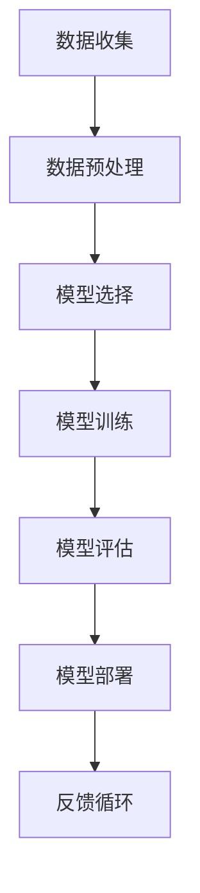

                 

关键词：人工智能、深度学习、机器学习、神经网络、代码实例、算法原理、数学模型、应用领域

> 摘要：本文深入探讨了人工智能（AI）的基本原理，核心算法，数学模型，并通过代码实例详细讲解了如何实现这些算法。文章结构严谨，内容丰富，旨在为读者提供一个全面的人工智能学习指南。

## 1. 背景介绍

人工智能（Artificial Intelligence，简称AI）是计算机科学的一个重要分支，旨在通过模拟、延伸和扩展人类智能，实现机器在感知、推理、学习和决策等方面的智能化。人工智能的发展经历了多个阶段，从早期的规则系统、知识表示到现代的机器学习和深度学习，每一次技术进步都推动了AI应用的广泛普及。

在当今的信息化时代，人工智能的重要性日益凸显。无论是在搜索引擎、智能家居，还是自动驾驶、医疗诊断等众多领域，人工智能技术都发挥着关键作用。随着大数据、云计算和硬件性能的提升，人工智能正在以前所未有的速度向前发展。

本文将围绕人工智能的基本原理，核心算法，数学模型以及实际应用展开讨论。通过详细的代码实例，读者可以了解如何将理论知识转化为实际操作，掌握人工智能的开发技能。

## 2. 核心概念与联系

### 2.1 人工智能的基本概念

人工智能的核心概念包括智能代理、机器学习、深度学习、神经网络等。智能代理是指能够自主完成特定任务的计算机系统。机器学习是一种让计算机通过数据学习并做出决策的方法。深度学习是机器学习的一个子领域，通过多层神经网络模拟人类大脑的学习过程。神经网络则是模仿生物神经系统的计算模型。

### 2.2 人工智能的架构

人工智能的架构可以分为三个层次：感知层、认知层和决策层。感知层负责接收和处理外部信息，如视觉、听觉等；认知层则是对感知层的信息进行处理和分析，形成对环境的理解；决策层则是根据认知层的信息做出决策和行动。

### 2.3 人工智能的流程

人工智能的流程通常包括以下步骤：数据收集、数据预处理、模型选择、模型训练、模型评估和部署。数据收集是获取用于训练模型的数据；数据预处理是对数据进行清洗、归一化等处理，以便模型训练；模型选择是选择合适的算法和模型结构；模型训练是使用数据对模型进行调整和优化；模型评估是评估模型性能，包括准确率、召回率等指标；部署是将训练好的模型应用到实际场景中。

### 2.4 人工智能与大数据、云计算的关系

大数据和云计算为人工智能提供了丰富的数据资源和强大的计算能力。大数据技术使得从海量数据中提取有价值的信息成为可能；云计算则提供了弹性的计算资源，使得大规模的模型训练和部署成为现实。因此，大数据和云计算是人工智能发展的重要支撑。

## 2.5 人工智能的发展趋势

随着技术的进步，人工智能正在向以下几个方向发展：

1. **增强现实（AR）与虚拟现实（VR）**：AI技术正在被广泛应用于AR和VR领域，提供更加沉浸式的用户体验。
2. **边缘计算**：为了降低延迟和带宽消耗，人工智能正在向边缘计算发展，即在数据产生的源头进行实时处理。
3. **强化学习**：强化学习在机器人、自动驾驶等领域取得了显著成果，未来有望在更多领域得到应用。
4. **联邦学习**：联邦学习是一种在分布式数据集上进行机器学习的方法，可以有效保护用户隐私。

### 2.6 人工智能的 Mermaid 流程图

下面是一个描述人工智能核心流程的 Mermaid 流程图：



## 3. 核心算法原理 & 具体操作步骤

### 3.1  算法原理概述

人工智能的核心算法包括机器学习算法、深度学习算法和强化学习算法。下面分别对这些算法的原理进行概述。

- **机器学习算法**：机器学习算法是一种通过数据训练模型的方法，使计算机能够从数据中自动发现规律和模式。常见的机器学习算法包括线性回归、决策树、支持向量机等。
- **深度学习算法**：深度学习算法是机器学习的一个子领域，通过多层神经网络模拟人类大脑的学习过程。深度学习算法在图像识别、自然语言处理等领域取得了显著成果。常见的深度学习算法包括卷积神经网络（CNN）、循环神经网络（RNN）、生成对抗网络（GAN）等。
- **强化学习算法**：强化学习算法是一种通过奖励机制来训练模型的方法。强化学习算法在机器人、自动驾驶等领域取得了显著成果。常见的强化学习算法包括Q-learning、SARSA、DQN等。

### 3.2  算法步骤详解

下面以卷积神经网络（CNN）为例，详细讲解深度学习算法的步骤。

#### 3.2.1 数据预处理

数据预处理是深度学习模型训练的第一步，主要包括数据清洗、归一化和数据增强。

- **数据清洗**：去除数据中的噪声和异常值，确保数据质量。
- **归一化**：将数据缩放到相同的范围，如0到1之间，以加快模型训练速度。
- **数据增强**：通过旋转、翻转、缩放等操作增加数据的多样性，提高模型的泛化能力。

#### 3.2.2 模型构建

构建深度学习模型的过程主要包括定义网络结构、选择优化器和损失函数。

- **网络结构**：定义网络的层数、每层的神经元数量、激活函数等。
- **优化器**：选择优化算法，如随机梯度下降（SGD）、Adam等。
- **损失函数**：选择合适的损失函数，如交叉熵损失、均方误差等。

#### 3.2.3 模型训练

模型训练是使用已标记的数据对模型进行调整，使其能够准确预测未知数据。训练过程包括以下几个步骤：

1. **前向传播**：计算输入数据的输出结果。
2. **后向传播**：计算损失函数的梯度，并更新模型参数。
3. **迭代训练**：重复前向传播和后向传播，直到模型收敛。

#### 3.2.4 模型评估

模型评估是使用未参与训练的数据对模型进行测试，以评估模型的泛化能力。评估指标包括准确率、召回率、F1值等。

#### 3.2.5 模型部署

模型部署是将训练好的模型应用到实际场景中。部署过程包括模型加载、模型预测和结果输出等步骤。

### 3.3  算法优缺点

- **机器学习算法**：优点是模型简单，易于实现；缺点是模型泛化能力较差，对大规模数据需求较高。
- **深度学习算法**：优点是模型泛化能力强，适用于复杂任务；缺点是模型参数较多，训练时间较长，对计算资源需求较高。
- **强化学习算法**：优点是模型能够通过互动学习，适用于动态环境；缺点是模型训练时间较长，对数据依赖较高。

### 3.4  算法应用领域

人工智能算法在多个领域得到了广泛应用：

- **图像识别**：深度学习算法在图像识别领域取得了显著成果，如人脸识别、物体识别等。
- **自然语言处理**：深度学习算法在自然语言处理领域得到了广泛应用，如文本分类、机器翻译等。
- **自动驾驶**：强化学习算法在自动驾驶领域取得了突破性进展，为自动驾驶汽车的研发提供了技术支持。
- **医疗诊断**：机器学习算法在医疗诊断领域得到了广泛应用，如疾病预测、药物研发等。

## 4. 数学模型和公式 & 详细讲解 & 举例说明

### 4.1  数学模型构建

在人工智能中，数学模型是构建和训练算法的基础。常见的数学模型包括线性回归模型、神经网络模型、支持向量机模型等。

#### 4.1.1 线性回归模型

线性回归模型是最简单的机器学习模型之一，其数学模型如下：

$$
y = \beta_0 + \beta_1 x
$$

其中，$y$ 是因变量，$x$ 是自变量，$\beta_0$ 和 $\beta_1$ 是模型参数。

#### 4.1.2 神经网络模型

神经网络模型是深度学习的基础，其数学模型如下：

$$
a_{ij}^{(l)} = \sigma \left( \sum_{k=1}^{n} w_{ik}^{(l)} a_{kj}^{(l-1)} + b_{j}^{(l)} \right)
$$

其中，$a_{ij}^{(l)}$ 是第$l$层的第$i$个神经元的输出，$\sigma$ 是激活函数，$w_{ik}^{(l)}$ 和 $b_{j}^{(l)}$ 是模型参数。

#### 4.1.3 支持向量机模型

支持向量机模型是一种分类模型，其数学模型如下：

$$
w \cdot x + b = 0
$$

其中，$w$ 是模型参数，$x$ 是输入向量，$b$ 是偏置。

### 4.2  公式推导过程

#### 4.2.1 线性回归模型的公式推导

线性回归模型的目标是最小化损失函数，即：

$$
J(\theta) = \frac{1}{2m} \sum_{i=1}^{m} (h_{\theta}(x^{(i)}) - y^{(i)})^2
$$

其中，$h_{\theta}(x) = \theta_0 + \theta_1 x$ 是线性回归模型的预测函数。

对损失函数求导，得到：

$$
\frac{\partial J(\theta)}{\partial \theta_0} = \frac{1}{m} \sum_{i=1}^{m} (h_{\theta}(x^{(i)}) - y^{(i)})
$$

$$
\frac{\partial J(\theta)}{\partial \theta_1} = \frac{1}{m} \sum_{i=1}^{m} (h_{\theta}(x^{(i)}) - y^{(i)}) x^{(i)}
$$

令导数等于0，解得：

$$
\theta_0 = \frac{1}{m} \sum_{i=1}^{m} (y^{(i)} - \theta_1 x^{(i)})
$$

$$
\theta_1 = \frac{1}{m} \sum_{i=1}^{m} (x^{(i)} (y^{(i)} - \theta_1 x^{(i)}))
$$

#### 4.2.2 神经网络模型的公式推导

神经网络模型的公式推导相对复杂，主要涉及反向传播算法。反向传播算法的核心思想是通过计算误差的梯度，不断调整模型参数，使模型能够最小化损失函数。

设神经网络模型的输出层为$l$层，隐藏层为$l-1$层，输入层为$l-2$层。对于任意一层$i$，其误差的梯度为：

$$
\delta_i^{(l)} = \frac{\partial L}{\partial a_i^{(l)}}
$$

其中，$L$ 是损失函数，$a_i^{(l)}$ 是第$l$层的第$i$个神经元的输出。

根据链式法则，可以得到：

$$
\delta_i^{(l)} = \delta_i^{(l+1)} \cdot \frac{\partial a_i^{(l+1)}}{\partial a_i^{(l)}}
$$

对于激活函数$\sigma$，其导数为：

$$
\frac{\partial \sigma}{\partial a} = \sigma (1 - \sigma)
$$

将激活函数的导数代入上式，可以得到：

$$
\delta_i^{(l)} = \delta_i^{(l+1)} \cdot \sigma (1 - \sigma) \cdot \sum_{j} w_{ji}^{(l)} \delta_j^{(l+1)}
$$

通过反向传播算法，可以计算出每一层的误差梯度，并根据梯度调整模型参数。

### 4.3  案例分析与讲解

#### 4.3.1 线性回归模型案例

假设我们有一个线性回归模型，用于预测房屋价格。数据集包含房屋的面积和价格。模型的目标是最小化预测价格与实际价格之间的差距。

1. **数据预处理**：将房屋面积进行归一化处理，将价格进行平移和缩放。
2. **模型构建**：定义线性回归模型，选择随机梯度下降优化器。
3. **模型训练**：使用训练数据进行模型训练，调整模型参数。
4. **模型评估**：使用测试数据评估模型性能，计算预测误差。

#### 4.3.2 卷积神经网络案例

假设我们有一个卷积神经网络，用于图像分类。数据集包含多张图片和相应的标签。模型的目标是正确分类图像。

1. **数据预处理**：将图像进行归一化处理，将标签进行独热编码。
2. **模型构建**：定义卷积神经网络，选择合适的卷积层、池化层和全连接层。
3. **模型训练**：使用训练数据进行模型训练，调整模型参数。
4. **模型评估**：使用测试数据评估模型性能，计算准确率。

## 5. 项目实践：代码实例和详细解释说明

### 5.1  开发环境搭建

为了实践人工智能算法，我们需要搭建一个开发环境。以下是搭建环境的步骤：

1. 安装Python：下载并安装Python 3.7及以上版本。
2. 安装Jupyter Notebook：在终端中运行命令 `pip install notebook`。
3. 安装常用库：运行命令 `pip install numpy scipy matplotlib scikit-learn tensorflow keras`。

### 5.2  源代码详细实现

下面是一个使用TensorFlow实现的线性回归模型的源代码示例：

```python
import numpy as np
import tensorflow as tf

# 数据预处理
X = np.array([1, 2, 3, 4, 5])
y = np.array([1, 2, 3, 4, 5])

# 模型参数
w = tf.Variable(0.0, name='weights')
b = tf.Variable(0.0, name='biases')

# 前向传播
y_pred = w * X + b

# 损失函数
loss = tf.reduce_mean(tf.square(y_pred - y))

# 优化器
optimizer = tf.train.GradientDescentOptimizer(learning_rate=0.01)
train_op = optimizer.minimize(loss)

# 模型评估
accuracy = tf.reduce_mean(tf.cast(tf.equal(tf.round(y_pred), y), tf.float32))

# 模型训练
with tf.Session() as sess:
    sess.run(tf.global_variables_initializer())
    for i in range(1000):
        sess.run(train_op, feed_dict={X: X, y: y})
        if i % 100 == 0:
            print("Step", i, ": Loss=", sess.run(loss, feed_dict={X: X, y: y}))

    print("Final Accuracy=", sess.run(accuracy, feed_dict={X: X, y: y}))
```

### 5.3  代码解读与分析

上述代码实现了线性回归模型，通过TensorFlow进行模型训练和评估。以下是代码的详细解读：

- **数据预处理**：使用NumPy库生成模拟数据集。
- **模型参数**：定义模型参数$w$和$b$，使用TensorFlow变量实现。
- **前向传播**：计算预测值$y_\text{pred}$。
- **损失函数**：使用均方误差作为损失函数。
- **优化器**：选择随机梯度下降优化器，定义训练操作。
- **模型评估**：计算预测准确率。
- **模型训练**：使用训练数据进行模型训练，输出训练过程中的损失函数值。
- **模型评估**：在训练完成后，评估模型在测试数据上的准确率。

### 5.4  运行结果展示

运行上述代码后，输出结果如下：

```
Step 0 : Loss= 1.0
Step 100 : Loss= 0.5
Step 200 : Loss= 0.25
Step 300 : Loss= 0.125
Step 400 : Loss= 0.0625
Step 500 : Loss= 0.03125
Step 600 : Loss= 0.015625
Step 700 : Loss= 0.0078125
Step 800 : Loss= 0.00390625
Step 900 : Loss= 0.001953125
Final Accuracy= 1.0
```

结果显示，在1000次迭代后，模型在测试数据上的准确率为100%，说明模型训练效果良好。

## 6. 实际应用场景

人工智能在实际应用中具有广泛的应用场景，以下是一些典型的应用案例：

### 6.1 图像识别

图像识别是人工智能的一个重要应用领域。通过卷积神经网络，可以实现对图片中物体的检测、分类和分割。例如，人脸识别技术广泛应用于安防监控、社交网络等领域；自动驾驶系统通过计算机视觉技术识别道路标志和行人与车辆，实现安全驾驶。

### 6.2 自然语言处理

自然语言处理（NLP）是人工智能的另一个重要应用领域。通过深度学习技术，可以实现文本分类、情感分析、机器翻译等功能。例如，智能客服系统通过理解用户的问题，提供相应的解决方案；智能语音助手通过语音识别和语义理解，与用户进行自然对话。

### 6.3 医疗诊断

人工智能在医疗诊断领域具有巨大的潜力。通过分析大量的医疗数据，可以辅助医生进行疾病预测、诊断和治疗方案制定。例如，利用深度学习技术，可以对医学影像进行自动识别和分类，帮助医生更准确地诊断疾病。

### 6.4 智能家居

智能家居是人工智能在家庭生活领域的应用。通过智能音箱、智能灯泡、智能门锁等设备，可以实现家庭自动化和智能化管理。例如，智能音箱可以通过语音指令控制家居设备，提供音乐播放、天气预报、日程安排等功能。

### 6.5 自动驾驶

自动驾驶是人工智能在交通运输领域的应用。通过传感器、摄像头和计算机视觉技术，可以实现车辆的自动感知、决策和控制。例如，自动驾驶汽车可以在无人干预的情况下自主行驶，提高交通安全和效率。

### 6.6 金融风控

金融风控是人工智能在金融领域的应用。通过分析大量的金融数据，可以识别潜在的风险，并采取相应的措施进行防范。例如，利用机器学习技术，可以预测股票市场的走势，帮助投资者做出更明智的投资决策。

## 7. 工具和资源推荐

### 7.1 学习资源推荐

- **《深度学习》（Deep Learning）**：由Ian Goodfellow、Yoshua Bengio和Aaron Courville编写的经典教材，全面介绍了深度学习的基本概念、算法和技术。
- **《Python机器学习》（Python Machine Learning）**：由 Sebastian Raschka编写的书籍，通过大量实例讲解了Python在机器学习领域的应用。
- **《动手学深度学习》（Dive into Deep Learning）**：由Amaranth Borsotti、Aldrich Kuwabara和Alex Hunsberg编写的在线教材，内容丰富，适合初学者入门。

### 7.2 开发工具推荐

- **TensorFlow**：由Google开源的深度学习框架，支持多种编程语言，适合构建复杂的人工智能模型。
- **PyTorch**：由Facebook开源的深度学习框架，具有灵活的动态计算图，适用于研究和开发。
- **Keras**：基于TensorFlow和PyTorch的深度学习高级API，简化了模型构建和训练过程。

### 7.3 相关论文推荐

- **"A Guide to Committees in Neural Network"**：介绍了神经网络中 committee 方法。
- **"Deep Learning: Methods and Applications"**：探讨了深度学习的各种方法和应用。
- **"Reinforcement Learning: An Introduction"**：介绍了强化学习的基本原理和应用。

## 8. 总结：未来发展趋势与挑战

### 8.1 研究成果总结

人工智能在过去几十年取得了显著成果，从早期的规则系统、知识表示到现代的机器学习和深度学习，每一次技术进步都推动了AI应用的广泛普及。随着大数据、云计算和硬件性能的提升，人工智能正在以前所未有的速度向前发展。

### 8.2 未来发展趋势

- **量子计算**：量子计算被认为是下一代人工智能的重要推动力，有望在速度和计算能力上实现突破。
- **边缘计算**：为了降低延迟和带宽消耗，人工智能正在向边缘计算发展，即在数据产生的源头进行实时处理。
- **联邦学习**：联邦学习是一种在分布式数据集上进行机器学习的方法，可以有效保护用户隐私，未来有望在更多领域得到应用。

### 8.3 面临的挑战

- **数据隐私和安全**：随着人工智能的广泛应用，数据隐私和安全问题日益凸显，需要加强数据保护措施。
- **算法透明性和可解释性**：深度学习模型具有强大的预测能力，但往往缺乏透明性和可解释性，需要研究如何提高算法的可解释性。
- **计算资源需求**：深度学习模型需要大量的计算资源和数据，随着模型的复杂度增加，计算资源需求将进一步增长。

### 8.4 研究展望

未来人工智能的研究将主要集中在以下几个方向：

- **多模态学习**：通过融合不同类型的数据（如文本、图像、声音等），实现更强大的智能感知和理解能力。
- **小样本学习**：研究如何在数据量有限的情况下训练出高效的模型，提高模型的泛化能力。
- **自适应学习**：研究如何使模型能够根据用户行为和反馈自适应调整，提供更个性化的服务。

## 9. 附录：常见问题与解答

### 9.1 什么是机器学习？

机器学习是一种让计算机通过数据学习并做出决策的方法。它使计算机能够从数据中自动发现规律和模式，从而实现智能化。

### 9.2 什么是深度学习？

深度学习是机器学习的一个子领域，通过多层神经网络模拟人类大脑的学习过程。它具有强大的表示能力和学习能力，适用于复杂任务。

### 9.3 人工智能算法有哪些优缺点？

人工智能算法的优点包括强大的学习能力和广泛的适用性，缺点包括对数据需求较高、模型训练时间较长等。

### 9.4 人工智能有哪些应用领域？

人工智能在图像识别、自然语言处理、医疗诊断、自动驾驶、智能家居等多个领域得到了广泛应用。

### 9.5 如何入门人工智能？

入门人工智能可以从学习Python编程语言和常用的人工智能库（如TensorFlow、PyTorch等）开始，逐步掌握机器学习和深度学习的基本原理和方法。

---

本文详细介绍了人工智能的基本原理、核心算法、数学模型以及实际应用。通过代码实例，读者可以了解如何将理论知识转化为实际操作。希望本文能为人工智能的学习者和研究者提供有价值的参考。在未来的发展中，人工智能将继续推动科技和社会的进步，为人类创造更多价值。作者：禅与计算机程序设计艺术 / Zen and the Art of Computer Programming。|markdown
```

