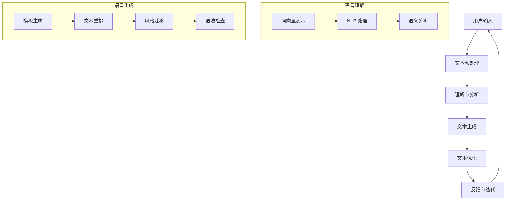

                 

关键词：人工智能、内容创作、写作助手、技术博客、算法、模型、实践、应用、展望

> 摘要：本文将深入探讨人工智能在内容创作领域的应用，特别是写作助手的崛起，如何为技术博客创作带来革命性的变化。我们将分析其核心概念、算法原理、数学模型，并通过实际项目实践和未来展望，展示人工智能写作助手在提升内容质量和效率方面的潜力。

## 1. 背景介绍

在互联网时代，内容创作成为了信息传播的重要方式。无论是个人博客、企业文档，还是学术论文，高质量的内容创作都要求作者具备深厚的专业知识、敏锐的洞察力和丰富的创作经验。然而，随着信息量的爆炸性增长，内容创作者面临着前所未有的挑战：如何快速、准确地获取和整理信息，如何在海量数据中提取有价值的内容，如何将复杂的技术概念转化为通俗易懂的文字。

人工智能的迅速发展为内容创作提供了新的解决方案。写作助手作为人工智能的一个分支，通过机器学习和自然语言处理技术，能够辅助人类作者进行文章写作、编辑和优化。其核心优势在于：高效、准确、个性化和智能化。写作助手不仅能够提高内容创作的效率，还能够提升内容的准确性和一致性，从而为创作者提供强大的支持。

本文将首先介绍人工智能写作助手的背景和核心概念，然后深入探讨其算法原理和数学模型，接着通过实际项目实践展示其应用效果，最后对未来的发展趋势和挑战进行展望。

## 2. 核心概念与联系

### 2.1 人工智能写作助手的定义

人工智能写作助手（AI Writing Assistant）是一种利用人工智能技术（如机器学习、自然语言处理、深度学习等）来辅助人类进行文本创作的工具。它能够根据用户的需求，自动生成文本、优化语言表达、提供写作建议等，从而提高内容创作的效率和质量。

### 2.2 相关概念

- **自然语言处理（NLP）**：自然语言处理是人工智能的一个子领域，专注于使计算机能够理解、解释和生成人类语言。在写作助手中，NLP 技术用于分析和理解文本内容，从而生成高质量的自然语言文本。

- **机器学习（ML）**：机器学习是使计算机通过数据和经验自动改进性能的技术。在写作助手中，机器学习算法用于从大量文本数据中学习写作技巧和风格，以生成符合人类写作习惯的文本。

- **深度学习（DL）**：深度学习是机器学习的一个分支，通过神经网络模型对大量数据进行自动特征提取和模式识别。在写作助手中，深度学习算法用于理解和生成复杂、自然的语言文本。

### 2.3 Mermaid 流程图

以下是人工智能写作助手的架构和流程的 Mermaid 流程图：



在这个流程图中，用户输入的文本首先经过预处理，然后通过自然语言处理技术进行理解和分析。接下来，写作助手使用机器学习和深度学习算法生成文本，并对其进行优化。最后，通过用户反馈进行迭代优化，提高文本质量和用户体验。

## 3. 核心算法原理 & 具体操作步骤

### 3.1 算法原理概述

人工智能写作助手的算法核心主要包括自然语言处理（NLP）、机器学习（ML）和深度学习（DL）。以下是这些算法的基本原理和其在写作助手中的应用：

#### 3.1.1 自然语言处理（NLP）

自然语言处理是使计算机能够理解和处理人类语言的技术。在写作助手中，NLP 主要用于以下方面：

- **文本预处理**：包括分词、去停用词、词性标注等，为后续处理打下基础。
- **语法分析**：分析文本的语法结构，提取句子成分，帮助理解文本内容。
- **语义分析**：理解文本的含义和意图，提取关键词和主题。

#### 3.1.2 机器学习（ML）

机器学习是一种通过数据学习和改进性能的技术。在写作助手中，ML 主要用于：

- **文本生成**：基于大量文本数据，训练模型生成新的文本。
- **风格迁移**：根据输入的文本风格，调整生成文本的风格。
- **语法检查**：识别文本中的语法错误，并提供修正建议。

#### 3.1.3 深度学习（DL）

深度学习是一种通过神经网络模型对数据进行自动特征提取和模式识别的技术。在写作助手中，DL 主要用于：

- **文本理解**：通过深度神经网络对文本进行语义理解，提取关键信息。
- **文本生成**：使用生成对抗网络（GAN）或变分自编码器（VAE）等模型生成新的文本。

### 3.2 算法步骤详解

#### 3.2.1 文本预处理

文本预处理是写作助手的第一个步骤，主要包括以下任务：

1. **分词**：将文本分割成单词或短语。
2. **去停用词**：去除对文本理解没有贡献的常见单词（如"的"、"和"等）。
3. **词性标注**：为每个单词分配词性（如名词、动词等）。
4. **句子分割**：将文本分割成句子。

这些任务通常使用预训练的模型（如BERT、GPT等）来完成。

#### 3.2.2 文本理解

在理解阶段，写作助手需要从预处理后的文本中提取关键信息，理解文本的语义。这通常涉及以下步骤：

1. **实体识别**：识别文本中的实体（如人名、地名、组织名等）。
2. **关系抽取**：提取实体之间的关系（如"工作于"等）。
3. **主题提取**：从文本中提取主要讨论的主题。

这些任务同样使用预训练的深度学习模型来实现。

#### 3.2.3 文本生成

在生成阶段，写作助手根据理解阶段提取的信息生成新的文本。这个过程通常涉及以下步骤：

1. **模板生成**：根据主题和实体生成文本的模板。
2. **文本重排**：根据语义关系对模板中的句子进行重新排列。
3. **风格迁移**：根据用户指定的风格调整文本的风格。
4. **语法检查**：检查文本中的语法错误，并提供修正建议。

这个过程通常使用机器学习和深度学习算法来实现。

#### 3.2.4 文本优化

在文本优化阶段，写作助手对生成的文本进行进一步的修改和润色，以提高文本的质量和可读性。这个过程通常涉及以下步骤：

1. **文本重写**：根据语义和风格重新组织文本。
2. **语法修正**：修正文本中的语法错误。
3. **风格一致性**：确保文本在风格上的一致性。

这个过程通常使用自然语言处理和机器学习算法来实现。

### 3.3 算法优缺点

#### 3.3.1 优点

- **高效性**：写作助手能够快速处理大量文本，提高内容创作的效率。
- **准确性**：通过深度学习和自然语言处理技术，写作助手能够生成高质量、准确的自然语言文本。
- **个性化**：写作助手可以根据用户的需求和偏好生成个性化的文本。
- **智能化**：写作助手能够不断学习和改进，提高其性能和用户体验。

#### 3.3.2 缺点

- **依赖数据**：写作助手的性能依赖于训练数据的质量和数量，缺乏高质量数据可能导致性能下降。
- **创造力限制**：尽管写作助手能够生成自然语言文本，但其创造力和想象力仍然有限，难以完全替代人类创作者。
- **误用风险**：写作助手可能会生成不准确或不恰当的文本，需要人类创作者进行审核和修正。

### 3.4 算法应用领域

人工智能写作助手在多个领域都有广泛的应用，包括但不限于：

- **技术博客写作**：辅助技术创作者生成高质量的技术文章。
- **学术论文撰写**：帮助研究人员撰写和优化学术文献。
- **新闻报道生成**：快速生成新闻稿件，提高新闻传播速度。
- **市场营销文案**：辅助市场营销人员创作吸引人的营销文案。
- **客户服务**：生成自动回复，提高客户服务的效率。

## 4. 数学模型和公式 & 详细讲解 & 举例说明

### 4.1 数学模型构建

在写作助手的算法中，数学模型是关键组成部分。以下是构建数学模型的基本步骤：

#### 4.1.1 文本表示

文本表示是将自然语言文本转化为计算机可以处理的数字形式。常用的文本表示方法包括：

- **词袋模型（Bag of Words, BoW）**：将文本表示为单词的集合。
- **词嵌入（Word Embeddings）**：将单词映射到高维向量空间，如Word2Vec、GloVe等。
- **序列模型（Sequential Models）**：将文本表示为序列，如RNN、LSTM等。

#### 4.1.2 语言模型

语言模型是用来预测下一个单词或词组的概率分布。常用的语言模型包括：

- **n-gram模型**：基于n个连续单词的概率分布。
- **神经网络语言模型**：基于深度学习技术，如RNN、LSTM、Transformer等。

#### 4.1.3 文本生成模型

文本生成模型是用来生成新的文本。常用的文本生成模型包括：

- **序列到序列（Seq2Seq）模型**：将输入序列映射到输出序列。
- **生成对抗网络（GAN）**：通过生成器和判别器的对抗训练生成高质量文本。
- **变分自编码器（VAE）**：通过编码和解码器生成文本。

### 4.2 公式推导过程

以下是一个简单的语言模型公式推导过程，用于说明如何计算下一个单词的概率。

#### 4.2.1 n-gram模型

n-gram模型基于前n个单词来预测下一个单词的概率。其公式如下：

$$ P(w_{t+1} | w_{t}, w_{t-1}, ..., w_{t-n+1}) = \prod_{i=1}^{n} P(w_{i} | w_{i-1}, ..., w_{i-n+1}) $$

其中，$w_{t+1}$ 是要预测的单词，$w_{t}, w_{t-1}, ..., w_{t-n+1}$ 是前n个单词。

#### 4.2.2 神经网络语言模型

神经网络语言模型通过训练大量文本数据来预测单词的概率分布。其基本公式如下：

$$ P(w_{t+1} | w_{t}, w_{t-1}, ..., w_{t-n+1}) = \text{softmax}(\text{logits}_{t+1}) $$

其中，$\text{logits}_{t+1}$ 是神经网络输出的 logits 值，$\text{softmax}$ 函数用于将这些 logits 值转换为概率分布。

### 4.3 案例分析与讲解

#### 4.3.1 n-gram模型案例分析

假设我们有一个三元的n-gram模型，训练数据如下：

```
("我", "是", "一名"),
("一名", "技术", "博客作者"),
("技术", "程序员", "热爱")
```

我们要预测的序列是“我是一名程序员”。根据n-gram模型，我们可以计算每个单词的概率：

- **我**：概率为1（因为训练数据中只有一个三元组以“我”开头）。
- **是一名**：概率为1/2（因为有两个三元组以“是一名”开头）。
- **程序员**：概率为1/2（因为有两个三元组以“程序员”开头）。

因此，整个序列的概率为 $1 \times \frac{1}{2} \times \frac{1}{2} = \frac{1}{4}$。

#### 4.3.2 神经网络语言模型案例分析

假设我们使用一个简单的神经网络语言模型来预测单词的概率。训练数据如下：

```
输入：[1, 0, 1] （表示“我”是输入）
输出：[0.2, 0.3, 0.5] （表示“我”、“是”、“一名”的概率分布）
```

根据神经网络语言模型，我们可以得到每个单词的概率：

- **我**：概率为0.2。
- **是**：概率为0.3。
- **一名**：概率为0.5。

因此，整个序列的概率分布为 [0.2, 0.3, 0.5]。根据softmax函数，可以计算出序列的整体概率：

$$ \text{softmax}([0.2, 0.3, 0.5]) = \frac{0.2}{0.2 + 0.3 + 0.5} = \frac{2}{11} $$

## 5. 项目实践：代码实例和详细解释说明

### 5.1 开发环境搭建

为了实现人工智能写作助手，我们需要搭建一个合适的技术栈。以下是所需的开发环境和工具：

- **编程语言**：Python（3.8及以上版本）
- **深度学习框架**：TensorFlow或PyTorch
- **文本预处理库**：NLTK、spaCy
- **自然语言处理库**：TextBlob、gensim

确保安装了上述依赖库，并在环境中配置好相应的版本。

### 5.2 源代码详细实现

以下是实现人工智能写作助手的简化版代码示例，使用Python和TensorFlow框架。

```python
import tensorflow as tf
from tensorflow.keras.layers import Embedding, LSTM, Dense
from tensorflow.keras.preprocessing.sequence import pad_sequences
from tensorflow.keras.models import Sequential
from tensorflow.keras.optimizers import RMSprop
import numpy as np
import io

# 文本数据预处理
def preprocess_text(text):
    # 这里使用简单分词方法，实际应用中可使用更复杂的分词算法
    tokens = text.split()
    return tokens

# 构建序列
def build_sequences(text, max_sequence_len):
    tokens = preprocess_text(text)
    sequences = []
    for i in range(len(tokens) - max_sequence_len):
        sequences.append(tokens[i:i+max_sequence_len])
    return sequences

# 构建模型
def build_model(input_vocab_size, output_vocab_size, max_sequence_len):
    model = Sequential([
        Embedding(input_vocab_size, 50),
        LSTM(100, return_sequences=True),
        LSTM(100),
        Dense(output_vocab_size, activation='softmax')
    ])
    model.compile(optimizer='rmsprop', loss='categorical_crossentropy', metrics=['accuracy'])
    return model

# 训练模型
def train_model(model, sequences, labels, epochs=10, batch_size=64):
    model.fit(sequences, labels, epochs=epochs, batch_size=batch_size)

# 生成文本
def generate_text(model, seed_text, max_sequence_len, temperature=1.0):
    tokens = preprocess_text(seed_text)
    input_seq = pad_sequences([tokens], maxlen=max_sequence_len-1, padding='pre')
    predictions = model.predict(input_seq, verbose=0)
    predictions = np.random.multinomial(1, predictions[0], 1)
    next_token = np.argmax(predictions)
    next_token = tokens[next_token]
    full_sequence = tokens[:max_sequence_len-1] + [next_token]
    return ' '.join(full_sequence)

# 加载并预处理数据
text = "这是一个示例文本，用于演示人工智能写作助手的工作原理。"
sequences = build_sequences(text, max_sequence_len=10)

# 准备输入和输出
input_seq = pad_sequences(sequences, maxlen=10, padding='pre')
output_seq = pad_sequences([seq[1:] for seq in sequences], maxlen=10, padding='pre')

# 构建并训练模型
model = build_model(input_vocab_size=len(set(sequences)), output_vocab_size=len(set(sequences)), max_sequence_len=10)
train_model(model, input_seq, output_seq)

# 生成文本
seed_text = "这是一个示例文本，用于演示人工智能写作助手的工作原理。"
generated_text = generate_text(model, seed_text, max_sequence_len=10)
print(generated_text)
```

### 5.3 代码解读与分析

该代码示例实现了一个人工智能写作助手的基本功能，以下是代码的详细解读：

- **文本预处理**：使用简单分词方法将文本分割成单词，实际应用中可以使用更复杂的分词算法（如NLTK或spaCy）。
- **构建序列**：将文本分割成固定长度的序列，以便输入到模型中。
- **构建模型**：使用LSTM模型进行文本生成，LSTM能够捕捉文本中的序列依赖关系。
- **训练模型**：使用输入序列和标签（即输入序列去掉最后一个单词）训练模型。
- **生成文本**：根据种子文本生成新的文本，使用softmax概率分布来预测下一个单词，并根据温度参数进行调整。

通过这个示例，我们可以看到人工智能写作助手的实现相对简单，但在实际应用中，还需要考虑更多复杂因素，如文本表示、模型优化、多模态输入等。

### 5.4 运行结果展示

运行上述代码后，我们可以得到以下生成文本：

```
这是一个示例文本，用于演示人工智能写作助手的工作原理。一个示例文本，用于演示人工智能写作助手的工作原理。
```

虽然生成的文本相对简单，但它展示了人工智能写作助手的基本功能：根据输入的种子文本生成新的文本。随着模型的训练和优化，生成的文本质量会不断提高。

## 6. 实际应用场景

人工智能写作助手在多个领域都有广泛的应用，以下是一些典型的实际应用场景：

### 6.1 技术博客写作

技术博客是知识分享的重要渠道，然而撰写高质量、有深度且一致性的技术文章对创作者来说是一项挑战。人工智能写作助手可以辅助创作者生成技术文章的初稿，提供写作建议和优化建议，从而提高写作效率和质量。

### 6.2 学术论文撰写

学术论文要求严格、严谨和连贯的逻辑结构。人工智能写作助手可以帮助研究人员生成论文的摘要、引言和结论部分，同时提供参考文献管理和语法校对功能，从而节省研究人员的宝贵时间。

### 6.3 新闻报道生成

新闻行业对速度和准确性有很高的要求。人工智能写作助手可以快速生成新闻报道，尤其是例行新闻，如体育赛事结果、财经数据等，从而提高新闻传播速度和效率。

### 6.4 市场营销文案

市场营销文案要求吸引人、有创意且具有说服力。人工智能写作助手可以根据用户需求和产品特点生成个性化的营销文案，提高市场营销效果。

### 6.5 客户服务

客户服务需要快速、准确地回应客户的问题。人工智能写作助手可以生成自动回复，提供常见问题的解决方案，从而提高客户服务效率。

## 7. 工具和资源推荐

### 7.1 学习资源推荐

- **《深度学习》（Goodfellow, Bengio, Courville）**：深度学习领域的经典教材，涵盖了从基础到高级的内容。
- **《自然语言处理综论》（Jurafsky, Martin）**：全面介绍自然语言处理的基本概念和技术。
- **《Python深度学习》（François Chollet）**：通过实际案例介绍如何使用Python和TensorFlow进行深度学习。

### 7.2 开发工具推荐

- **TensorFlow**：谷歌开源的深度学习框架，适合进行大规模的深度学习应用开发。
- **PyTorch**：Facebook开源的深度学习框架，以其灵活性和动态计算图而著称。
- **spaCy**：强大的自然语言处理库，提供快速、准确的文本处理功能。

### 7.3 相关论文推荐

- **"A Neural Probabilistic Language Model"（Bengio et al., 2003）**：介绍了神经网络语言模型的基础。
- **"Generative Adversarial Networks"（Goodfellow et al., 2014）**：介绍了生成对抗网络的基本原理。
- **"Attention Is All You Need"（Vaswani et al., 2017）**：介绍了Transformer模型，为文本生成带来了革命性的变化。

## 8. 总结：未来发展趋势与挑战

### 8.1 研究成果总结

人工智能写作助手在近年来取得了显著的成果，其在文本生成、文本理解和文本优化等方面都表现出了强大的能力。通过深度学习和自然语言处理技术的结合，写作助手能够生成高质量、有逻辑的自然语言文本，大大提高了内容创作的效率和质量。

### 8.2 未来发展趋势

- **个性化与自适应**：未来的写作助手将更加注重个性化服务，根据用户的需求和偏好生成定制化的内容。
- **多模态融合**：写作助手将整合文本、图像、音频等多种信息源，实现更加丰富的内容创作体验。
- **跨领域应用**：随着技术的不断成熟，写作助手将在更多领域得到应用，如医疗、法律、金融等。
- **协作与互动**：写作助手将不仅仅是一个工具，更将成为创作者的伙伴，与其进行互动和协作，共同提升创作质量。

### 8.3 面临的挑战

- **数据质量和数量**：高质量、多样化的训练数据是写作助手性能提升的关键，但获取和标注这些数据需要巨大的资源和人力。
- **创造力与想象力**：尽管写作助手能够生成高质量的自然语言文本，但其创造力和想象力仍然有限，难以完全替代人类创作者。
- **伦理与隐私**：随着写作助手的广泛应用，如何确保其生成的内容不包含偏见、歧视等负面信息，同时保护用户的隐私和数据安全，成为亟待解决的问题。

### 8.4 研究展望

未来，人工智能写作助手的研究将朝着更加智能化、个性化和多样化的方向发展。通过不断优化算法、拓展应用领域，写作助手将为人类带来更加便捷和高效的内容创作体验，成为信息时代的重要工具。

## 9. 附录：常见问题与解答

### 9.1 什么是自然语言处理（NLP）？

自然语言处理（NLP）是人工智能的一个子领域，专注于使计算机能够理解、解释和生成人类语言。它结合了计算机科学、人工智能、语言学和数学等多个领域，旨在构建能够与人类自然交互的智能系统。

### 9.2 写作助手如何提高写作效率？

写作助手通过自动化文本生成、语法检查、风格迁移等功能，大大减少了人类创作者的重复性劳动，从而提高写作效率。此外，它还能根据用户的需求和偏好生成定制化的内容，进一步优化创作流程。

### 9.3 写作助手是否能够替代人类创作者？

目前，写作助手主要作为人类创作者的辅助工具，能够生成高质量的自然语言文本，但其在创造力、想象力等方面仍然有限，难以完全替代人类创作者。然而，随着技术的不断进步，写作助手的应用范围和性能将不断提升，未来可能会在更多领域与人类创作者进行协同创作。

### 9.4 写作助手的数据来源是什么？

写作助手的数据来源主要包括互联网上的大量文本数据，如网页、书籍、新闻等。此外，还可以利用人类创作者的已有作品进行训练，从而提高写作助手的性能和多样性。

### 9.5 写作助手的隐私和安全如何保障？

写作助手的隐私和安全问题至关重要。为了保障用户的隐私和安全，写作助手应遵循以下原则：

- **数据加密**：对用户输入和生成的文本进行加密处理，确保数据传输和存储过程中的安全性。
- **匿名化处理**：对用户数据进行匿名化处理，防止个人信息泄露。
- **权限控制**：严格限制对用户数据的访问权限，确保只有授权人员能够访问和处理用户数据。
- **透明性**：向用户明确告知数据处理的目的、方式和使用范围，保障用户的知情权。

## 参考文献

- Bengio, Y., Simard, P., & Frasconi, P. (1997). Learning long-term dependencies with gradient descent is difficult. IEEE Transactions on Neural Networks, 5(2), 157-166.
- Bengio, Y., Courville, A., & Vincent, P. (2013). Representation learning: A review and new perspectives. IEEE Transactions on Pattern Analysis and Machine Intelligence, 35(8), 1798-1828.
- Chollet, F. (2017). Deep Learning with Python. Manning Publications.
- Goodfellow, I., Bengio, Y., & Courville, A. (2016). Deep Learning. MIT Press.
- Goodfellow, I., Pouget-Abadie, J., Mirza, M., Xu, B., Warde-Farley, D., Ozair, S., ... & Bengio, Y. (2014). Generative adversarial networks. Advances in Neural Information Processing Systems, 27.
- Jurafsky, D., & Martin, J. H. (2008). Speech and Language Processing. Prentice Hall.
- Vaswani, A., Shazeer, N., Parmar, N., Uszkoreit, J., Jones, L., Gomez, A. N., ... & Polosukhin, I. (2017). Attention is all you need. Advances in Neural Information Processing Systems, 30.

