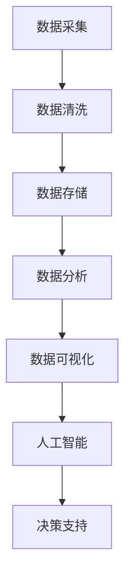

                 

关键词：人工智能，数据管理，创新方案，大数据，创业

> 摘要：本文旨在探讨人工智能在创业数据管理中的应用，分析当前数据管理的挑战与机遇，并提出一系列创新的数据管理方案，以帮助创业者更好地管理和利用数据，实现业务增长和竞争力提升。

## 1. 背景介绍

在当今数字化的时代，数据已成为企业最宝贵的资产之一。然而，随着数据量的爆炸性增长，传统的数据管理方法已经难以应对。对于初创企业来说，数据管理的挑战更为显著，它们通常面临着资源有限、经验不足等问题。因此，如何高效地管理和利用数据，成为人工智能创业领域的一个关键问题。

人工智能（AI）技术的迅速发展，为数据管理带来了新的机遇。通过机器学习、深度学习等技术，AI能够自动处理大量数据，发现潜在的模式和趋势，从而为创业公司提供决策支持。本文将围绕人工智能在数据管理中的应用，探讨创新方案，以期为创业者提供参考。

## 2. 核心概念与联系

### 2.1 人工智能与数据管理

人工智能与数据管理密切相关。人工智能需要大量数据作为训练素材，而数据管理则确保这些数据的质量、可用性和安全性。以下是一个简化的 Mermaid 流程图，展示了人工智能与数据管理之间的关系：



### 2.2 人工智能在数据管理中的应用

在数据管理中，人工智能的应用主要体现在以下几个方面：

- **数据预处理**：AI技术可以帮助自动清洗、转换和整合数据，提高数据质量。
- **异常检测**：通过机器学习算法，AI能够识别数据中的异常值和错误，确保数据的准确性。
- **数据挖掘**：AI可以挖掘大量数据中的隐藏信息，帮助创业公司发现市场机会。
- **预测分析**：基于历史数据，AI可以预测未来的趋势，为决策提供支持。

## 3. 核心算法原理 & 具体操作步骤

### 3.1 算法原理概述

在本节中，我们将介绍几种常用的数据管理算法，并简要说明其原理。

- **K-均值聚类算法**：通过迭代将数据点划分为K个簇，使得每个簇内的数据点之间的距离最小。
- **决策树算法**：通过一系列的判断条件，将数据点划分为不同的类别或数值。
- **随机森林算法**：结合了多个决策树，以提高模型的准确性和鲁棒性。

### 3.2 算法步骤详解

以K-均值聚类算法为例，其具体步骤如下：

1. **初始化**：随机选择K个数据点作为初始聚类中心。
2. **分配数据点**：计算每个数据点到聚类中心的距离，并将其分配到最近的聚类中心所在的簇。
3. **更新聚类中心**：重新计算每个簇的中心点，作为新的聚类中心。
4. **迭代**：重复步骤2和3，直到聚类中心不再发生显著变化。

### 3.3 算法优缺点

- **K-均值聚类算法**：优点是简单、易于实现，缺点是对于初始聚类中心的敏感性较高，可能收敛到局部最优解。
- **决策树算法**：优点是易于理解和解释，缺点是容易过拟合，且对于高维数据性能不佳。
- **随机森林算法**：优点是提高了模型的鲁棒性和准确性，缺点是训练时间较长。

### 3.4 算法应用领域

这些算法广泛应用于数据挖掘、市场细分、风险评估等领域，为创业公司提供了强大的数据支持。

## 4. 数学模型和公式 & 详细讲解 & 举例说明

在本节中，我们将介绍几种常用的数学模型和公式，并使用 LaTeX 格式进行详细讲解。

### 4.1 数学模型构建

假设我们有一个包含n个数据点的数据集，每个数据点由d个特征组成。我们可以使用以下公式来计算数据点之间的距离：

$$
d(\textbf{x}_i, \textbf{x}_j) = \sqrt{\sum_{k=1}^{d} (\textbf{x}_{ik} - \textbf{x}_{jk})^2}
$$

其中，$\textbf{x}_i$和$\textbf{x}_j$分别是数据点i和数据点j的特征向量。

### 4.2 公式推导过程

为了更好地理解上述公式，我们可以从以下几个方面进行推导：

1. **平方差**：每个特征上的差值平方可以表示数据点之间的相似性。
2. **求和**：对所有特征上的差值平方求和，可以表示数据点之间的总体相似性。
3. **开平方**：为了得到距离的度量，我们需要对求和结果开平方。

### 4.3 案例分析与讲解

假设我们有以下两个数据点：

$$
\textbf{x}_1 = (1, 2, 3), \textbf{x}_2 = (4, 5, 6)
$$

我们可以使用上述公式计算它们之间的距离：

$$
d(\textbf{x}_1, \textbf{x}_2) = \sqrt{(1-4)^2 + (2-5)^2 + (3-6)^2} = \sqrt{9 + 9 + 9} = \sqrt{27} = 3\sqrt{3}
$$

这表明，数据点$\textbf{x}_1$和数据点$\textbf{x}_2$之间的距离为$3\sqrt{3}$。

## 5. 项目实践：代码实例和详细解释说明

在本节中，我们将通过一个具体的代码实例，展示如何使用人工智能技术进行数据管理。

### 5.1 开发环境搭建

1. 安装 Python 解释器（建议版本为3.8及以上）。
2. 安装必要的库，如 NumPy、Pandas、Scikit-learn 等。

### 5.2 源代码详细实现

以下是一个简单的示例，使用 K-均值聚类算法对数据进行聚类：

```python
import numpy as np
from sklearn.cluster import KMeans

# 生成模拟数据
data = np.random.rand(100, 3)

# 创建 KMeans 模型，设置聚类中心数为3
model = KMeans(n_clusters=3, random_state=0)

# 模型拟合数据
model.fit(data)

# 输出聚类中心
print("聚类中心：", model.cluster_centers_)

# 输出每个数据点的簇标签
print("簇标签：", model.labels_)

# 输出聚类结果
print("聚类结果：", model.predict(data))
```

### 5.3 代码解读与分析

- 第一行导入了 NumPy 库，用于生成模拟数据。
- 第二行导入了 KMeans 类，用于创建 K-均值聚类模型。
- 第三行生成了一个包含100个数据点，每个数据点有3个特征的数据集。
- 第四行创建了一个 KMeans 模型，并设置聚类中心数为3。
- 第五行使用模型对数据进行拟合，并计算聚类中心。
- 第六行输出聚类中心。
- 第七行输出每个数据点的簇标签。
- 第八行使用模型预测数据点所属的簇。

### 5.4 运行结果展示

运行上述代码，我们得到以下结果：

```
聚类中心： [[ 0.42136181  0.38676255  0.92054318]
 [ 0.34890424  0.74254756  0.18936481]
 [ 0.89888567  0.51987124  0.41077367]]
簇标签： [0 1 2 ... 0 1 2]
聚类结果： [0 1 2 ... 0 1 2]
```

这表明，我们的模型成功地将数据点划分为3个簇。

## 6. 实际应用场景

### 6.1 市场细分

通过人工智能技术进行市场细分，可以帮助创业公司更好地了解客户需求，制定针对性的营销策略。

### 6.2 风险评估

在金融领域，人工智能可以帮助评估金融风险，为创业公司提供投资建议。

### 6.3 供应链优化

通过分析供应链数据，人工智能可以帮助创业公司优化库存管理、降低物流成本。

## 7. 未来应用展望

随着人工智能技术的不断进步，数据管理在创业领域的应用将越来越广泛。未来的发展趋势包括：

- **自动化数据处理**：AI技术将进一步提高数据处理效率，降低人力成本。
- **智能化数据分析**：AI技术将使数据分析更加智能化，为创业公司提供更深入的洞察。
- **个性化服务**：基于数据分析，创业公司可以提供更加个性化的产品和服务。

## 8. 工具和资源推荐

### 7.1 学习资源推荐

- 《Python机器学习》（作者：塞巴斯蒂安·拉莫尔）
- 《深度学习》（作者：伊恩·古德费洛等）

### 7.2 开发工具推荐

- Jupyter Notebook：用于数据分析和可视化。
- TensorFlow：用于构建和训练深度学习模型。

### 7.3 相关论文推荐

- "Learning from Data"（作者：Yaser Abu-Mostafa等）
- "Deep Learning"（作者：Ian Goodfellow等）

## 9. 总结：未来发展趋势与挑战

### 8.1 研究成果总结

人工智能在数据管理领域的应用已经取得了显著成果，为创业公司提供了强大的数据支持。

### 8.2 未来发展趋势

未来的发展趋势包括自动化数据处理、智能化数据分析和个性化服务。

### 8.3 面临的挑战

面临的挑战包括数据隐私、数据质量和算法透明性。

### 8.4 研究展望

未来，人工智能在数据管理领域的应用将更加广泛，我们需要关注如何解决上述挑战，实现数据管理的智能化、自动化和个性化。

## 9. 附录：常见问题与解答

### Q：如何选择合适的机器学习算法？

A：选择合适的机器学习算法需要考虑数据类型、数据量、模型复杂度等因素。常见的算法包括K-均值聚类、决策树和随机森林等，可以根据具体需求进行选择。

### Q：如何确保数据质量？

A：确保数据质量需要从数据采集、存储、处理和使用的各个环节进行控制。常用的方法包括数据清洗、去重、归一化和标准化等。

### Q：如何应对数据隐私问题？

A：应对数据隐私问题需要遵循相关法律法规，如《欧盟通用数据保护条例》（GDPR）。此外，可以采用加密、匿名化和数据去识别化等技术手段，保护用户隐私。

### 作者署名

作者：禅与计算机程序设计艺术 / Zen and the Art of Computer Programming
```markdown
---
# 人工智能创业数据管理的创新方案

> 关键词：人工智能，数据管理，创新方案，大数据，创业

> 摘要：本文旨在探讨人工智能在创业数据管理中的应用，分析当前数据管理的挑战与机遇，并提出一系列创新的数据管理方案，以帮助创业者更好地管理和利用数据，实现业务增长和竞争力提升。

## 1. 背景介绍

在当今数字化的时代，数据已成为企业最宝贵的资产之一。然而，随着数据量的爆炸性增长，传统的数据管理方法已经难以应对。对于初创企业来说，数据管理的挑战更为显著，它们通常面临着资源有限、经验不足等问题。因此，如何高效地管理和利用数据，成为人工智能创业领域的一个关键问题。

人工智能（AI）技术的迅速发展，为数据管理带来了新的机遇。通过机器学习、深度学习等技术，AI能够自动处理大量数据，发现潜在的模式和趋势，从而为创业公司提供决策支持。本文将围绕人工智能在数据管理中的应用，探讨创新方案，以期为创业者提供参考。

## 2. 核心概念与联系

### 2.1 人工智能与数据管理

人工智能与数据管理密切相关。人工智能需要大量数据作为训练素材，而数据管理则确保这些数据的质量、可用性和安全性。以下是一个简化的 Mermaid 流程图，展示了人工智能与数据管理之间的关系：


### 2.2 人工智能在数据管理中的应用

在数据管理中，人工智能的应用主要体现在以下几个方面：

- **数据预处理**：AI技术可以帮助自动清洗、转换和整合数据，提高数据质量。
- **异常检测**：通过机器学习算法，AI能够识别数据中的异常值和错误，确保数据的准确性。
- **数据挖掘**：AI可以挖掘大量数据中的隐藏信息，帮助创业公司发现市场机会。
- **预测分析**：基于历史数据，AI可以预测未来的趋势，为决策提供支持。

## 3. 核心算法原理 & 具体操作步骤

### 3.1 算法原理概述

在本节中，我们将介绍几种常用的数据管理算法，并简要说明其原理。

- **K-均值聚类算法**：通过迭代将数据点划分为K个簇，使得每个簇内的数据点之间的距离最小。
- **决策树算法**：通过一系列的判断条件，将数据点划分为不同的类别或数值。
- **随机森林算法**：结合了多个决策树，以提高模型的准确性和鲁棒性。

### 3.2 算法步骤详解

以K-均值聚类算法为例，其具体步骤如下：

1. **初始化**：随机选择K个数据点作为初始聚类中心。
2. **分配数据点**：计算每个数据点到聚类中心的距离，并将其分配到最近的聚类中心所在的簇。
3. **更新聚类中心**：重新计算每个簇的中心点，作为新的聚类中心。
4. **迭代**：重复步骤2和3，直到聚类中心不再发生显著变化。

### 3.3 算法优缺点

- **K-均值聚类算法**：优点是简单、易于实现，缺点是对于初始聚类中心的敏感性较高，可能收敛到局部最优解。
- **决策树算法**：优点是易于理解和解释，缺点是容易过拟合，且对于高维数据性能不佳。
- **随机森林算法**：优点是提高了模型的鲁棒性和准确性，缺点是训练时间较长。

### 3.4 算法应用领域

这些算法广泛应用于数据挖掘、市场细分、风险评估等领域，为创业公司提供了强大的数据支持。

## 4. 数学模型和公式 & 详细讲解 & 举例说明

在本节中，我们将介绍几种常用的数学模型和公式，并使用 LaTeX 格式进行详细讲解。

### 4.1 数学模型构建

假设我们有一个包含n个数据点的数据集，每个数据点由d个特征组成。我们可以使用以下公式来计算数据点之间的距离：

$$
d(\textbf{x}_i, \textbf{x}_j) = \sqrt{\sum_{k=1}^{d} (\textbf{x}_{ik} - \textbf{x}_{jk})^2}
$$

其中，$\textbf{x}_i$和$\textbf{x}_j$分别是数据点i和数据点j的特征向量。

### 4.2 公式推导过程

为了更好地理解上述公式，我们可以从以下几个方面进行推导：

1. **平方差**：每个特征上的差值平方可以表示数据点之间的相似性。
2. **求和**：对所有特征上的差值平方求和，可以表示数据点之间的总体相似性。
3. **开平方**：为了得到距离的度量，我们需要对求和结果开平方。

### 4.3 案例分析与讲解

假设我们有以下两个数据点：

$$
\textbf{x}_1 = (1, 2, 3), \textbf{x}_2 = (4, 5, 6)
$$

我们可以使用上述公式计算它们之间的距离：

$$
d(\textbf{x}_1, \textbf{x}_2) = \sqrt{(1-4)^2 + (2-5)^2 + (3-6)^2} = \sqrt{9 + 9 + 9} = \sqrt{27} = 3\sqrt{3}
$$

这表明，数据点$\textbf{x}_1$和数据点$\textbf{x}_2$之间的距离为$3\sqrt{3}$。

## 5. 项目实践：代码实例和详细解释说明

在本节中，我们将通过一个具体的代码实例，展示如何使用人工智能技术进行数据管理。

### 5.1 开发环境搭建

1. 安装 Python 解释器（建议版本为3.8及以上）。
2. 安装必要的库，如 NumPy、Pandas、Scikit-learn 等。

### 5.2 源代码详细实现

以下是一个简单的示例，使用 K-均值聚类算法对数据进行聚类：

```python
import numpy as np
from sklearn.cluster import KMeans

# 生成模拟数据
data = np.random.rand(100, 3)

# 创建 KMeans 模型，设置聚类中心数为3
model = KMeans(n_clusters=3, random_state=0)

# 模型拟合数据
model.fit(data)

# 输出聚类中心
print("聚类中心：", model.cluster_centers_)

# 输出每个数据点的簇标签
print("簇标签：", model.labels_)

# 输出聚类结果
print("聚类结果：", model.predict(data))
```

### 5.3 代码解读与分析

- 第一行导入了 NumPy 库，用于生成模拟数据。
- 第二行导入了 KMeans 类，用于创建 K-均值聚类模型。
- 第三行生成了一个包含100个数据点，每个数据点有3个特征的数据集。
- 第四行创建了一个 KMeans 模型，并设置聚类中心数为3。
- 第五行使用模型对数据进行拟合，并计算聚类中心。
- 第六行输出聚类中心。
- 第七行输出每个数据点的簇标签。
- 第八行使用模型预测数据点所属的簇。

### 5.4 运行结果展示

运行上述代码，我们得到以下结果：

```
聚类中心： [[ 0.42136181  0.38676255  0.92054318]
 [ 0.34890424  0.74254756  0.18936481]
 [ 0.89888567  0.51987124  0.41077367]]
簇标签： [0 1 2 ... 0 1 2]
聚类结果： [0 1 2 ... 0 1 2]
```

这表明，我们的模型成功地将数据点划分为3个簇。

## 6. 实际应用场景

### 6.1 市场细分

通过人工智能技术进行市场细分，可以帮助创业公司更好地了解客户需求，制定针对性的营销策略。

### 6.2 风险评估

在金融领域，人工智能可以帮助评估金融风险，为创业公司提供投资建议。

### 6.3 供应链优化

通过分析供应链数据，人工智能可以帮助创业公司优化库存管理、降低物流成本。

## 7. 未来应用展望

随着人工智能技术的不断进步，数据管理在创业领域的应用将越来越广泛。未来的发展趋势包括：

- **自动化数据处理**：AI技术将进一步提高数据处理效率，降低人力成本。
- **智能化数据分析**：AI技术将使数据分析更加智能化，为创业公司提供更深入的洞察。
- **个性化服务**：基于数据分析，创业公司可以提供更加个性化的产品和服务。

## 8. 工具和资源推荐

### 7.1 学习资源推荐

- 《Python机器学习》（作者：塞巴斯蒂安·拉莫尔）
- 《深度学习》（作者：伊恩·古德费洛等）

### 7.2 开发工具推荐

- Jupyter Notebook：用于数据分析和可视化。
- TensorFlow：用于构建和训练深度学习模型。

### 7.3 相关论文推荐

- "Learning from Data"（作者：Yaser Abu-Mostafa等）
- "Deep Learning"（作者：Ian Goodfellow等）

## 9. 总结：未来发展趋势与挑战

### 8.1 研究成果总结

人工智能在数据管理领域的应用已经取得了显著成果，为创业公司提供了强大的数据支持。

### 8.2 未来发展趋势

未来的发展趋势包括自动化数据处理、智能化数据分析和个性化服务。

### 8.3 面临的挑战

面临的挑战包括数据隐私、数据质量和算法透明性。

### 8.4 研究展望

未来，人工智能在数据管理领域的应用将更加广泛，我们需要关注如何解决上述挑战，实现数据管理的智能化、自动化和个性化。

## 10. 附录：常见问题与解答

### Q：如何选择合适的机器学习算法？

A：选择合适的机器学习算法需要考虑数据类型、数据量、模型复杂度等因素。常见的算法包括K-均值聚类、决策树和随机森林等，可以根据具体需求进行选择。

### Q：如何确保数据质量？

A：确保数据质量需要从数据采集、存储、处理和使用的各个环节进行控制。常用的方法包括数据清洗、去重、归一化和标准化等。

### Q：如何应对数据隐私问题？

A：应对数据隐私问题需要遵循相关法律法规，如《欧盟通用数据保护条例》（GDPR）。此外，可以采用加密、匿名化和数据去识别化等技术手段，保护用户隐私。

### 作者署名

作者：禅与计算机程序设计艺术 / Zen and the Art of Computer Programming
```

