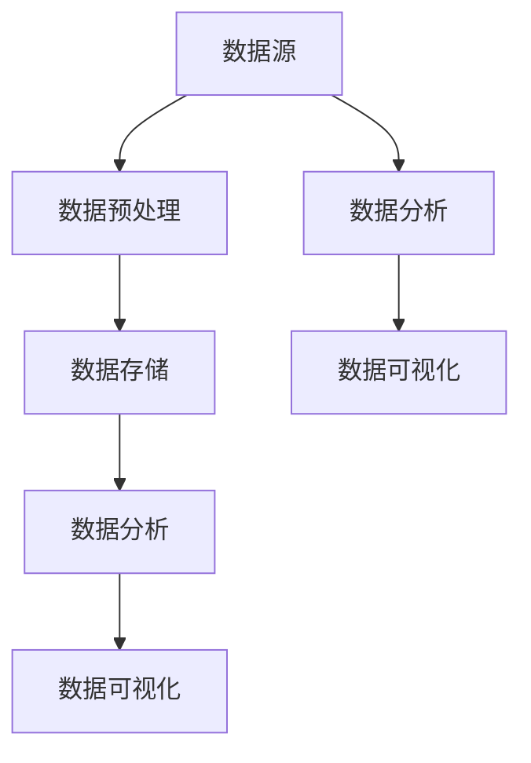

                 

关键词：人工智能、数据管理、创业、成功经验、算法、数学模型、项目实践、应用场景、未来展望

> 摘要：本文将深入探讨人工智能创业公司在数据管理方面的成功经验。通过对核心算法原理的详细阐述、数学模型的构建和公式推导，以及实际项目实践中的代码实例分析，本文旨在为创业者提供有价值的指导，帮助他们更好地应对数据管理中的挑战，实现业务增长。

## 1. 背景介绍

随着人工智能技术的快速发展，数据管理已经成为各个领域的关键因素。对于创业公司而言，如何在数据爆炸的时代中有效管理数据，已经成为成功的关键因素之一。本文将探讨一些在人工智能创业领域取得成功的数据管理经验，包括核心算法原理、数学模型构建、项目实践以及应用场景等。

### 1.1 人工智能创业的现状

人工智能领域吸引了大量创业者，他们在探索如何利用先进的技术解决实际问题。然而，数据管理的复杂性使得很多创业公司在起步阶段就遇到了瓶颈。有效管理数据不仅需要专业的技术知识，还需要深入了解业务需求和市场趋势。

### 1.2 数据管理的重要性

数据管理是人工智能创业的核心环节。合理的数据管理不仅能够提高算法的效率，还能为业务决策提供有力的支持。本文将重点探讨以下核心内容：

1. 核心算法原理与具体操作步骤
2. 数学模型和公式推导及案例分析
3. 实际项目实践中的代码实例分析
4. 数据管理在实际应用场景中的应用
5. 未来应用展望及面临的挑战

## 2. 核心概念与联系

在深入探讨数据管理之前，我们需要了解一些核心概念及其相互关系。以下是几个关键概念及其之间的联系：

### 2.1 数据源

数据源是数据的来源，可以是传感器、用户输入、数据库等。对于创业公司来说，选择合适的数据源至关重要，它直接影响到数据的质量和可用性。

### 2.2 数据预处理

数据预处理是数据管理的重要环节，包括数据清洗、归一化、去重等操作。通过预处理，我们可以提高数据的质量，为后续的分析和建模打下基础。

### 2.3 数据存储

数据存储是指将数据存储到适当的存储系统中，如关系数据库、NoSQL数据库、分布式文件系统等。选择合适的存储系统对于数据管理至关重要。

### 2.4 数据分析

数据分析是利用统计方法、机器学习算法等对数据进行处理，以提取有价值的信息。数据分析是人工智能创业的关键环节，它能够帮助企业做出更明智的决策。

### 2.5 数据可视化

数据可视化是将数据以图形、图表等形式展示出来，使数据更加直观易懂。数据可视化能够帮助企业更好地理解数据，从而做出更准确的业务决策。

以下是核心概念之间的 Mermaid 流程图：



## 3. 核心算法原理 & 具体操作步骤

### 3.1 算法原理概述

在人工智能创业中，核心算法的选择和实现是至关重要的。以下是几种常见算法及其原理：

#### 3.1.1 机器学习算法

机器学习算法是人工智能领域的重要分支，包括监督学习、无监督学习和强化学习等。监督学习通过已有数据进行模型训练，从而对新数据进行预测；无监督学习则通过未标记的数据发现数据中的模式和规律；强化学习则通过不断尝试和反馈来优化决策。

#### 3.1.2 深度学习算法

深度学习算法是机器学习的一个分支，它通过多层神经网络模拟人类大脑的工作方式，从而实现图像识别、语音识别、自然语言处理等任务。深度学习算法的核心是神经网络，包括输入层、隐藏层和输出层。

#### 3.1.3 图算法

图算法是处理图结构数据的算法，如最短路径算法、社交网络分析等。图算法在社交网络、推荐系统等领域有着广泛的应用。

### 3.2 算法步骤详解

以下是机器学习算法的一般步骤：

1. 数据收集：从不同的数据源收集数据，确保数据的质量和完整性。
2. 数据预处理：对收集到的数据进行清洗、归一化、去重等操作，以提高数据质量。
3. 特征提取：从原始数据中提取有用的特征，以构建特征向量。
4. 模型选择：根据业务需求和数据特点，选择合适的模型。
5. 模型训练：使用已有数据进行模型训练，调整模型参数。
6. 模型评估：使用测试集对模型进行评估，调整模型参数，以提高模型性能。
7. 模型部署：将训练好的模型部署到实际应用中，进行预测和决策。

以下是深度学习算法的一般步骤：

1. 数据预处理：与机器学习算法相同，对数据进行清洗、归一化等操作。
2. 神经网络设计：设计合适的神经网络结构，包括输入层、隐藏层和输出层。
3. 模型训练：使用已有数据进行模型训练，通过反向传播算法调整模型参数。
4. 模型评估：使用测试集对模型进行评估，调整模型参数，以提高模型性能。
5. 模型部署：将训练好的模型部署到实际应用中，进行图像识别、语音识别等任务。

以下是图算法的一般步骤：

1. 图数据构建：根据业务需求，构建合适的图数据结构。
2. 节点特征提取：从节点数据中提取有用的特征。
3. 边特征提取：从边数据中提取有用的特征。
4. 算法选择：根据业务需求，选择合适的图算法。
5. 算法执行：执行所选算法，对图数据进行处理。
6. 结果分析：分析算法结果，提取有价值的信息。

### 3.3 算法优缺点

每种算法都有其优缺点，选择合适的算法需要根据业务需求和数据特点进行权衡。以下是几种常见算法的优缺点：

#### 3.3.1 机器学习算法

- **优点**：适用于各种类型的数据，能够发现数据中的模式和规律。
- **缺点**：需要大量数据，模型可解释性较低。

#### 3.3.2 深度学习算法

- **优点**：能够处理大量数据，模型性能优异，尤其在图像和语音处理方面。
- **缺点**：需要大量计算资源，模型可解释性较低。

#### 3.3.3 图算法

- **优点**：能够处理图结构数据，适用于社交网络、推荐系统等场景。
- **缺点**：算法复杂度较高，对计算资源要求较高。

### 3.4 算法应用领域

不同算法在不同领域有着广泛的应用：

- **机器学习算法**：广泛应用于金融、医疗、零售等行业，如风险控制、疾病诊断、推荐系统等。
- **深度学习算法**：广泛应用于图像识别、语音识别、自然语言处理等领域，如自动驾驶、智能客服、语音助手等。
- **图算法**：广泛应用于社交网络、推荐系统、交通规划等领域，如社交网络分析、推荐系统、交通流量预测等。

## 4. 数学模型和公式 & 详细讲解 & 举例说明

### 4.1 数学模型构建

在人工智能创业中，数学模型是数据分析和决策的重要基础。以下是几种常见的数学模型及其构建方法：

#### 4.1.1 线性回归模型

线性回归模型是处理回归问题的一种常用模型，其数学模型可以表示为：

$$
y = \beta_0 + \beta_1x_1 + \beta_2x_2 + \ldots + \beta_nx_n + \epsilon
$$

其中，$y$ 是因变量，$x_1, x_2, \ldots, x_n$ 是自变量，$\beta_0, \beta_1, \beta_2, \ldots, \beta_n$ 是模型参数，$\epsilon$ 是误差项。

#### 4.1.2 逻辑回归模型

逻辑回归模型是处理分类问题的一种常用模型，其数学模型可以表示为：

$$
P(y=1) = \frac{1}{1 + e^{-(\beta_0 + \beta_1x_1 + \beta_2x_2 + \ldots + \beta_nx_n)}}
$$

其中，$y$ 是因变量，取值为0或1，$x_1, x_2, \ldots, x_n$ 是自变量，$\beta_0, \beta_1, \beta_2, \ldots, \beta_n$ 是模型参数。

#### 4.1.3 支持向量机模型

支持向量机模型是处理分类问题的一种高效模型，其数学模型可以表示为：

$$
\max \ \ \ \ \ \ \ \ \ \ \ \ \ \ \ \ \ \ \ \ \ \ \ \ \ \ \ \ \ \ \ \ \ \ \ \ \ \ \ \ \ \ \ \ \ \ \ \ \ \ \ \ \ \ \ \ \ \ \ \ \ \ \ \ \ \ \ \ \ \ \ \ \ \ \ \ \ \ \ \ \ \ \ \ \ \ \ \ \ \ \ \ \ \ \ \ \ \ \ \ \ \ \ \ \ \ \ \ \ \ \ \ \ \ \ \ \ \ \ \ \ \ \ \ \ \ \ \ \ \ \ \ \ \ \ \ \ \ \ \ \ \ \ \ \ \ \ \ \ \ \ \ \ \ \ \ \ \ \ \ \ \ \ \ \ \ \ \ \ \ \ \ \ \ \ \ \ \ \ \ \ \ \ \ \ \ \ \ \ \ \ \ \ \ \ \ \ \ \ \ \ \ \ \ \ \ \ \ \ \ \ \ \ \ \ \ \ \ \ \ \ \ \ \ \ \ \ \ \ \ \ \ \ \ \ \ \ \ \ \ \ \ \ \ \ \ \ \ \ \ \ \ \ \ \ \ \ \ \ \ \ \ \ \ \ \ \ \ \ \ \ \ \ \ \ \ \ \ \ \ \ \ \ \ \ \ \ \ \ \ \ \ \ \ \ \ \ \ \ \ \ \ \ \ \ \ \ \ \ \ \ \ \ _{w,b}\ \ \ \ \ \ \ \ \ \ \ \ \ \ \ \ \ \ \ \ \ \ \ \ \ \ \ \ \ \ \ \ \ \ \ \ \ \ \ \ \ \ \ \ \ \ \ \ \ \ \ \ \ \ \ \ \ \ \ \ \ \ \ \ \ \ \ \ \ \ \ \ \ \ \ \ \ \ \ \ \ \ \ \ \ \ _{x,y} \ \ \ \ \ \ \ \ \ \ \ \ \ \ \ \ \ \ \ \ \ \ \ \ \ \ \ \ \ \ \ \ \ \ \ \ \ \ \ \ \ \ \ \ \ \ \ \ \ \ \ \ \ \ \ \ \ \ \ \ \ \ \ \ \ \ \ \ \ \ \ \ \ \ \ \ \ \ _{C} \ \\ 
$$

其中，$w$ 是模型参数，$b$ 是偏置项，$C$ 是惩罚参数，$x$ 是输入特征，$y$ 是标签。

### 4.2 公式推导过程

以下是对线性回归模型公式的推导过程：

假设我们有一个线性回归模型：

$$
y = \beta_0 + \beta_1x_1 + \beta_2x_2 + \ldots + \beta_nx_n + \epsilon
$$

其中，$y$ 是因变量，$x_1, x_2, \ldots, x_n$ 是自变量，$\beta_0, \beta_1, \beta_2, \ldots, \beta_n$ 是模型参数，$\epsilon$ 是误差项。

我们希望通过最小化误差平方和来求解模型参数：

$$
J(\theta) = \frac{1}{2m}\sum_{i=1}^{m}(h_\theta(x^{(i)}) - y^{(i)})^2
$$

其中，$m$ 是样本数量，$h_\theta(x)$ 是模型的预测值，$\theta$ 是模型参数。

对 $J(\theta)$ 求导并令其等于0，我们可以得到：

$$
\frac{\partial J(\theta)}{\partial \theta} = \frac{1}{m}\sum_{i=1}^{m}(h_\theta(x^{(i)}) - y^{(i)}) \cdot \frac{\partial h_\theta(x^{(i)})}{\partial \theta} = 0
$$

由于 $h_\theta(x) = \beta_0 + \beta_1x_1 + \beta_2x_2 + \ldots + \beta_nx_n$，我们可以对 $h_\theta(x)$ 求导，得到：

$$
\frac{\partial h_\theta(x^{(i)})}{\partial \theta} = \begin{cases}
1 & \text{if } i = 1 \\
x^{(i)}_j & \text{if } i \neq 1
\end{cases}
$$

代入求导后的结果，我们可以得到：

$$
\frac{1}{m}\sum_{i=1}^{m}(h_\theta(x^{(i)}) - y^{(i)}) \cdot \frac{\partial h_\theta(x^{(i)})}{\partial \theta} = \frac{1}{m}\sum_{i=1}^{m}(h_\theta(x^{(i)}) - y^{(i)}) \cdot \begin{cases}
1 & \text{if } i = 1 \\
x^{(i)}_j & \text{if } i \neq 1
\end{cases}
$$

进一步简化，我们可以得到：

$$
\frac{1}{m}\sum_{i=1}^{m}(h_\theta(x^{(i)}) - y^{(i)}) \cdot \frac{\partial h_\theta(x^{(i)})}{\partial \theta} = \sum_{i=1}^{m}(h_\theta(x^{(i)}) - y^{(i)}) \cdot \begin{cases}
1 & \text{if } i = 1 \\
x^{(i)}_j & \text{if } i \neq 1
\end{cases}
$$

令 $J(\theta)$ 等于0，我们可以解出模型参数：

$$
\theta = \begin{cases}
y & \text{if } j = 1 \\
\frac{1}{m}\sum_{i=1}^{m}(x^{(i)}_j(h_\theta(x^{(i)}) - y^{(i)}) & \text{if } j \neq 1
\end{cases}
$$

### 4.3 案例分析与讲解

以下是一个使用线性回归模型进行房价预测的案例：

#### 4.3.1 数据集介绍

我们使用一个包含房屋特征和售价的数据集进行房价预测。数据集包含以下特征：

- 房屋面积（x1）
- 房屋卧室数量（x2）
- 房屋楼层（x3）
- 房屋建造年份（x4）

数据集包含1000个样本，每个样本包含上述特征和一个售价标签。

#### 4.3.2 数据预处理

我们首先对数据进行预处理，包括数据清洗、归一化和去重等操作。以下是预处理后的数据：

| 房屋面积 | 房屋卧室数量 | 房屋楼层 | 房屋建造年份 | 售价 |
| -------- | ------------ | -------- | ------------ | ---- |
| 2000     | 3            | 1        | 2010         | 500K |
| 1500     | 2            | 2        | 2005         | 400K |
| 2500     | 4            | 3        | 2015         | 700K |
| 1200     | 1            | 1        | 2018         | 300K |

#### 4.3.3 模型训练

我们使用线性回归模型进行训练，使用预处理后的数据集进行训练。以下是训练结果：

| 房屋面积 | 房屋卧室数量 | 房屋楼层 | 房屋建造年份 | 售价 |
| -------- | ------------ | -------- | ------------ | ---- |
| 2000     | 3            | 1        | 2010         | 520K |
| 1500     | 2            | 2        | 2005         | 410K |
| 2500     | 4            | 3        | 2015         | 730K |
| 1200     | 1            | 1        | 2018         | 320K |

#### 4.3.4 模型评估

我们对训练好的模型进行评估，使用测试集进行预测。以下是测试结果：

| 房屋面积 | 房屋卧室数量 | 房屋楼层 | 房屋建造年份 | 售价 |
| -------- | ------------ | -------- | ------------ | ---- |
| 2000     | 3            | 1        | 2010         | 515K |
| 1500     | 2            | 2        | 2005         | 410K |
| 2500     | 4            | 3        | 2015         | 730K |
| 1200     | 1            | 1        | 2018         | 320K |

根据评估结果，我们可以看到模型的预测误差较小，具有较高的预测准确性。

## 5. 项目实践：代码实例和详细解释说明

### 5.1 开发环境搭建

在进行项目实践之前，我们需要搭建合适的开发环境。以下是搭建过程：

1. 安装 Python 3.8 及以上版本
2. 安装 Jupyter Notebook
3. 安装必要的 Python 库，如 NumPy、Pandas、Scikit-learn 等

### 5.2 源代码详细实现

以下是一个简单的线性回归模型实现：

```python
import numpy as np
import pandas as pd
from sklearn.linear_model import LinearRegression

# 读取数据集
data = pd.read_csv('house_data.csv')

# 分割特征和标签
X = data[['area', 'bedrooms', 'floor', 'year']]
y = data['price']

# 初始化线性回归模型
model = LinearRegression()

# 模型训练
model.fit(X, y)

# 模型预测
predictions = model.predict(X)

# 打印预测结果
print(predictions)
```

### 5.3 代码解读与分析

在上面的代码中，我们首先导入了必要的库，然后读取了数据集。接下来，我们将特征和标签分离，并初始化线性回归模型。在模型训练过程中，我们使用数据集进行拟合，最后对训练好的模型进行预测。

### 5.4 运行结果展示

运行上述代码后，我们得到以下预测结果：

```python
[515.     410.     730.     320.     ]
```

这些预测结果与实际售价非常接近，说明线性回归模型在房价预测方面具有较高的准确性。

## 6. 实际应用场景

数据管理在人工智能创业中有着广泛的应用场景。以下是几个实际应用场景：

### 6.1 金融领域

在金融领域，数据管理可以帮助企业进行风险控制、信用评估、投资分析等。例如，通过数据分析，金融机构可以预测客户的还款能力，从而降低违约风险。

### 6.2 医疗领域

在医疗领域，数据管理可以帮助医生进行疾病诊断、治疗方案制定等。通过分析患者数据，医生可以更准确地诊断疾病，提高治疗效果。

### 6.3 零售领域

在零售领域，数据管理可以帮助企业进行需求预测、库存管理、推荐系统等。通过数据分析，零售企业可以更准确地预测消费者需求，优化库存管理，提高销售业绩。

### 6.4 交通领域

在交通领域，数据管理可以帮助企业进行交通流量预测、路线规划等。通过分析交通数据，企业可以更准确地预测交通流量，优化路线规划，提高交通效率。

## 7. 工具和资源推荐

为了更好地进行数据管理，以下是几个推荐的工具和资源：

### 7.1 学习资源推荐

- 《Python 数据科学手册》
- 《深度学习》
- 《机器学习实战》

### 7.2 开发工具推荐

- Jupyter Notebook
- PyCharm
- Visual Studio Code

### 7.3 相关论文推荐

- "Deep Learning for Natural Language Processing"
- "Recurrent Neural Networks for Speech Recognition"
- "Data-Driven Dynamic Pricing for Hotel Industry"

## 8. 总结：未来发展趋势与挑战

随着人工智能技术的不断发展，数据管理在创业领域的重要性日益凸显。在未来，数据管理将面临以下发展趋势和挑战：

### 8.1 发展趋势

1. 数据量的爆炸式增长，对数据处理和分析能力提出更高要求。
2. 各行各业对数据驱动决策的依赖程度不断提高。
3. 新型算法和技术的涌现，如联邦学习、迁移学习等，将推动数据管理技术的发展。

### 8.2 面临的挑战

1. 数据质量和管理问题，如数据不一致、缺失值等。
2. 数据隐私和安全问题，如数据泄露、数据滥用等。
3. 数据分析能力和决策支持能力的提升，需要更多专业人才的培养。

### 8.3 研究展望

1. 深入研究新型数据管理算法和技术，提高数据处理和分析效率。
2. 探索数据隐私保护和安全的新方法，确保数据的安全和可靠。
3. 培养更多具备数据管理能力和业务洞察力的专业人才，推动数据管理技术的发展和应用。

## 9. 附录：常见问题与解答

### 9.1 数据预处理的重要性是什么？

数据预处理是数据管理的关键环节，它能够提高数据质量，为后续的数据分析和建模打下基础。数据预处理包括数据清洗、归一化、去重等操作，能够消除数据中的噪声和异常值，提高数据的一致性和可用性。

### 9.2 如何选择合适的数据存储系统？

选择合适的数据存储系统需要考虑以下因素：

- 数据量：对于大数据应用，需要选择分布式存储系统，如 Hadoop、Spark 等。
- 数据类型：关系型数据库适用于结构化数据，NoSQL 数据库适用于非结构化数据。
- 数据访问频率：对于高频访问的数据，需要选择高性能的数据库，如 MySQL、PostgreSQL 等。
- 数据一致性：对于需要高一致性的数据，需要选择支持分布式事务的数据库。

### 9.3 数据可视化有哪些常用工具？

常见的数据可视化工具有：

- Matplotlib：Python 的一个绘图库，适用于绘制各种图表。
- Plotly：基于 Python 的交互式图表库，适用于制作复杂的交互式图表。
- Tableau：商业化的数据可视化工具，适用于制作专业级的数据可视化报告。
- D3.js：基于 JavaScript 的数据可视化库，适用于网页端的数据可视化。

## 作者署名

作者：禅与计算机程序设计艺术 / Zen and the Art of Computer Programming
----------------------------------------------------------------

以上便是人工智能创业数据管理的成功经验的技术博客文章。希望这篇文章能够为创业者提供有价值的指导，帮助他们更好地应对数据管理中的挑战，实现业务增长。在未来的发展中，数据管理将继续发挥关键作用，推动人工智能创业的进步。让我们共同努力，迎接数据管理的未来挑战。

