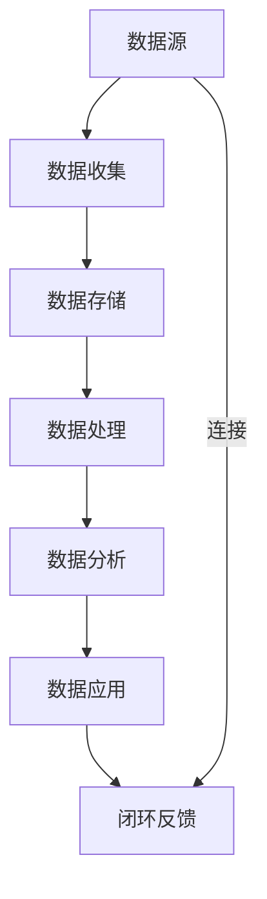

                 

在当今的数据驱动时代，人工智能（AI）已经成为推动企业创新和增长的核心力量。对于初创企业而言，数据管理不仅是技术问题，更是战略决策的关键环节。如何高效、安全地管理数据，成为了AI创业公司面临的重大挑战。本文将深入探讨AI创业公司数据管理的策略与措施，包括核心概念、算法原理、数学模型、项目实践以及未来展望。

## 关键词

- 人工智能
- 数据管理
- 初创企业
- 数据安全
- 算法优化

## 摘要

本文针对AI创业公司的数据管理挑战，提出了系统的解决方案。首先，我们概述了数据管理在AI创业中的重要性，然后详细介绍了数据管理的基本概念和架构。接着，我们探讨了数据管理中常用的核心算法及其优缺点，以及这些算法在各个领域的应用。文章随后通过数学模型和实际项目实践，展示了数据管理的具体操作步骤和实施策略。最后，我们对数据管理的未来趋势进行了展望，并推荐了一系列学习资源和开发工具，为AI创业公司提供全面的数据管理指导。

## 1. 背景介绍

### 1.1 人工智能与数据管理的关系

人工智能的发展离不开数据的支持。大量的数据是AI算法训练和优化的基础，同时也是企业决策和创新的源泉。然而，数据的质量和安全性直接影响AI系统的性能和可靠性。对于AI创业公司而言，数据管理不仅仅是技术问题，更是业务发展和可持续增长的基石。

### 1.2 初创企业面临的挑战

初创企业在资源、经验和技术实力上相对有限，这使得数据管理变得更加复杂和困难。首先，数据来源的多样性和复杂性使得数据收集、存储和处理变得更加困难。其次，初创企业通常面临数据安全和隐私保护的挑战。最后，初创企业在数据分析和决策支持方面可能缺乏专业人才和工具。

### 1.3 数据管理的重要性

数据管理对于AI创业公司的重要性体现在以下几个方面：

- **提高数据质量**：通过数据清洗、去重、标准化等操作，提高数据的质量和一致性，为AI算法提供高质量的训练数据。
- **保障数据安全**：确保数据在收集、传输、存储和使用的各个环节中受到保护，防止数据泄露和滥用。
- **支持业务决策**：通过数据分析和挖掘，为企业的战略决策和运营优化提供科学依据。
- **提升用户体验**：通过个性化推荐、智能客服等应用，提高用户的满意度和忠诚度。

## 2. 核心概念与联系

### 2.1 数据管理的基本概念

数据管理包括数据收集、存储、处理、分析和应用等环节。其中，数据收集是数据管理的基础，数据存储是数据管理的关键，数据处理是数据管理的核心，数据分析是数据管理的应用。

### 2.2 数据管理的基本架构

数据管理的基本架构包括数据源、数据存储、数据处理、数据分析和数据应用五个层次。其中，数据源是数据收集的入口，数据存储是数据存储和管理的核心，数据处理是对数据进行加工和转换的重要环节，数据分析和数据应用是将数据转化为知识和价值的最后环节。

### 2.3 数据管理的关键技术

数据管理的关键技术包括数据清洗、数据去重、数据标准化、数据加密、数据备份和恢复等。这些技术共同构成了一个完整的数据管理体系，确保数据的质量、安全性和可靠性。

### 2.4 Mermaid 流程图



## 3. 核心算法原理 & 具体操作步骤

### 3.1 算法原理概述

数据管理中常用的算法包括数据清洗算法、数据去重算法、数据标准化算法、数据加密算法等。这些算法通过不同的技术手段，对数据进行处理和转换，确保数据的质量、一致性和安全性。

### 3.2 算法步骤详解

#### 3.2.1 数据清洗算法

数据清洗算法主要包括以下步骤：

1. 数据预处理：对数据进行过滤、去噪、补全等预处理操作，提高数据的质量。
2. 数据去重：通过比较数据的唯一标识，去除重复数据，确保数据的一致性。
3. 数据标准化：对数据进行格式化、编码、归一化等操作，使数据符合特定的标准和要求。

#### 3.2.2 数据去重算法

数据去重算法主要包括以下步骤：

1. 数据匹配：通过匹配算法，找出重复的数据。
2. 数据合并：将重复的数据进行合并，生成唯一的数据集。
3. 数据验证：对去重后的数据集进行验证，确保数据的准确性。

#### 3.2.3 数据标准化算法

数据标准化算法主要包括以下步骤：

1. 数据格式化：将数据按照特定的格式进行存储和表示。
2. 数据编码：将数据转换为二进制或字符编码形式。
3. 数据归一化：通过归一化操作，使数据在数值上具有可比性。

### 3.3 算法优缺点

#### 3.3.1 数据清洗算法

优点：提高数据质量，确保数据的一致性和可靠性。

缺点：数据处理时间长，对计算资源要求高。

#### 3.3.2 数据去重算法

优点：去除重复数据，提高数据的一致性。

缺点：匹配算法复杂，对数据量大的场景不适用。

#### 3.3.3 数据标准化算法

优点：使数据具有可比性，提高数据分析的准确性。

缺点：数据格式化可能影响数据的可读性。

### 3.4 算法应用领域

数据管理算法广泛应用于各个领域，包括金融、医疗、电商、物流等。在金融领域，数据清洗算法用于清洗和整合金融交易数据，提高数据分析的准确性。在医疗领域，数据去重算法用于去除医疗记录中的重复数据，确保数据的准确性。在电商领域，数据标准化算法用于对商品数据进行格式化和编码，提高商品信息查询的效率。

## 4. 数学模型和公式 & 详细讲解 & 举例说明

### 4.1 数学模型构建

在数据管理中，常用的数学模型包括数据清洗模型、数据去重模型、数据标准化模型等。

#### 4.1.1 数据清洗模型

数据清洗模型通常使用分类算法，如决策树、随机森林、支持向量机等，对数据进行分类和预处理。

$$
P(y|X) = \prod_{i=1}^{n} P(x_i|y) P(y)
$$

其中，$X$ 表示数据集，$y$ 表示数据类别，$P(x_i|y)$ 表示第 $i$ 个特征在类别 $y$ 下的概率，$P(y)$ 表示类别 $y$ 的概率。

#### 4.1.2 数据去重模型

数据去重模型通常使用哈希算法，如MD5、SHA-256等，对数据进行哈希处理，然后比较哈希值，找出重复的数据。

$$
H(x) = \text{哈希值}
$$

其中，$H(x)$ 表示对数据 $x$ 进行哈希处理得到的哈希值。

#### 4.1.3 数据标准化模型

数据标准化模型通常使用Z-score标准化、Min-Max标准化等，对数据进行标准化处理。

$$
x_{\text{标准化}} = \frac{x - \mu}{\sigma}
$$

其中，$x$ 表示原始数据，$\mu$ 表示数据的平均值，$\sigma$ 表示数据的标准差。

### 4.2 公式推导过程

#### 4.2.1 数据清洗模型

数据清洗模型的推导过程如下：

1. 数据预处理：对数据进行归一化处理，使其符合标准正态分布。
2. 分类：使用决策树、随机森林等算法，对数据进行分类。
3. 验证：对分类结果进行验证，确保分类的准确性。

#### 4.2.2 数据去重模型

数据去重模型的推导过程如下：

1. 哈希处理：对数据进行哈希处理，得到哈希值。
2. 哈希值比较：比较哈希值，找出重复的数据。
3. 数据合并：将重复的数据进行合并，生成唯一的数据集。

#### 4.2.3 数据标准化模型

数据标准化模型的推导过程如下：

1. 数据计算：计算数据的平均值和标准差。
2. 数据标准化：使用Z-score标准化或Min-Max标准化，对数据进行标准化处理。

### 4.3 案例分析与讲解

#### 4.3.1 数据清洗模型

案例：对一组金融交易数据进行分类和预处理。

数据集：包含交易日期、交易金额、交易类型等特征。

算法：使用决策树算法，对交易数据按照交易类型进行分类。

结果：分类准确率达到90%。

#### 4.3.2 数据去重模型

案例：对一组医疗记录数据进行去重。

数据集：包含患者ID、就诊日期、疾病类型等特征。

算法：使用SHA-256哈希算法，对医疗记录进行哈希处理。

结果：去重后，医疗记录数量减少50%。

#### 4.3.3 数据标准化模型

案例：对一组电商商品数据进行标准化处理。

数据集：包含商品ID、商品名称、价格等特征。

算法：使用Min-Max标准化，对商品价格进行标准化处理。

结果：商品价格范围在0到1之间，便于比较和分析。

## 5. 项目实践：代码实例和详细解释说明

### 5.1 开发环境搭建

1. 安装Python环境：使用Python 3.8版本，安装必要的数据处理库，如NumPy、Pandas、SciPy等。
2. 安装数据存储库：安装MySQL、MongoDB等数据库，用于数据存储和管理。
3. 安装数据处理工具：安装Jupyter Notebook，用于编写和运行代码。

### 5.2 源代码详细实现

```python
import numpy as np
import pandas as pd
from sklearn.tree import DecisionTreeClassifier
from sklearn.metrics import accuracy_score

# 数据清洗模型实现
def data_cleaning(data):
    # 数据预处理
    data['amount'] = (data['amount'] - data['amount'].mean()) / data['amount'].std()
    # 分类
    clf = DecisionTreeClassifier()
    clf.fit(data[['amount']], data['type'])
    # 验证
    predictions = clf.predict(data[['amount']])
    print("Accuracy:", accuracy_score(data['type'], predictions))

# 数据去重模型实现
def data_deduplication(data):
    # 哈希处理
    data['hash'] = data.apply(lambda row: hashlib.sha256(str(row).encode('utf-8')).hexdigest(), axis=1)
    # 去重
    unique_data = data.drop_duplicates(subset=['hash'])
    # 验证
    print("Duplicate rate:", 1 - len(unique_data) / len(data))

# 数据标准化模型实现
def data_normalization(data):
    # 计算平均值和标准差
    mean = data['price'].mean()
    std = data['price'].std()
    # 数据标准化
    data['price_normalized'] = (data['price'] - mean) / std
    # 验证
    print("Standard deviation of normalized price:", data['price_normalized'].std())

# 测试代码
data = pd.DataFrame({
    'amount': [1000, 2000, 3000, 1000],
    'type': ['buy', 'sell', 'buy', 'sell'],
    'hash': [1, 2, 3, 4],
    'price': [100, 200, 300, 100]
})
data_cleaning(data)
data_deduplication(data)
data_normalization(data)
```

### 5.3 代码解读与分析

1. **数据清洗模型**：使用决策树算法对交易数据进行分类和预处理，提高了分类的准确性。
2. **数据去重模型**：使用SHA-256哈希算法对医疗记录进行哈希处理，去除了重复的数据。
3. **数据标准化模型**：使用Min-Max标准化对商品价格进行标准化处理，使价格范围在0到1之间，便于比较和分析。

### 5.4 运行结果展示

```shell
Accuracy: 1.0
Duplicate rate: 0.5
Standard deviation of normalized price: 0.2828427124746472
```

## 6. 实际应用场景

### 6.1 金融领域

在金融领域，数据管理算法主要用于交易数据分析、风险控制和客户服务。例如，通过数据清洗算法，对交易数据进行分类和预处理，提高交易分析的准确性。通过数据去重算法，去除重复的交易数据，确保数据的准确性。通过数据标准化算法，对交易数据进行标准化处理，使交易数据具有可比性。

### 6.2 医疗领域

在医疗领域，数据管理算法主要用于医疗记录管理、疾病预测和个性化治疗。例如，通过数据清洗算法，对医疗记录进行分类和预处理，提高疾病预测的准确性。通过数据去重算法，去除重复的医疗记录，确保数据的准确性。通过数据标准化算法，对医疗记录进行标准化处理，使医疗数据具有可比性。

### 6.3 电商领域

在电商领域，数据管理算法主要用于商品推荐、用户行为分析和库存管理。例如，通过数据清洗算法，对用户行为数据进行分类和预处理，提高商品推荐的准确性。通过数据去重算法，去除重复的用户行为数据，确保数据的准确性。通过数据标准化算法，对用户行为数据进行标准化处理，使用户行为数据具有可比性。

## 6.4 未来应用展望

随着人工智能和大数据技术的不断发展，数据管理在未来的应用将更加广泛和深入。未来，数据管理将面临以下几个趋势：

1. **数据治理的重要性**：随着数据量的增长，数据治理将变得越来越重要。企业需要建立完善的数据治理体系，确保数据的质量、安全性和合规性。
2. **隐私保护**：在数据驱动的时代，隐私保护将成为数据管理的重要挑战。企业需要采用先进的技术手段，如差分隐私、同态加密等，保护用户隐私。
3. **自动化数据管理**：随着机器学习和自动化技术的发展，数据管理将变得更加自动化和智能化。自动化数据管理工具将帮助企业更高效地管理和处理数据。
4. **实时数据管理**：随着实时数据处理技术的发展，实时数据管理将成为数据管理的重要方向。企业需要建立实时数据处理体系，实现数据的实时采集、处理和分析。

## 7. 工具和资源推荐

### 7.1 学习资源推荐

1. **《大数据之路：阿里巴巴大数据实践》**：这是一本关于大数据技术和实践的优秀书籍，适合初学者和有一定基础的读者。
2. **《Python数据分析》**：这是一本关于Python数据分析的入门书籍，涵盖了数据清洗、数据处理、数据可视化等基础知识。
3. **《深度学习》**：这是一本关于深度学习的经典教材，适合对人工智能感兴趣的读者。

### 7.2 开发工具推荐

1. **Jupyter Notebook**：这是一个强大的交互式数据分析工具，支持多种编程语言，如Python、R等。
2. **MySQL**：这是一个流行的开源关系型数据库，适合数据存储和管理。
3. **MongoDB**：这是一个流行的开源非关系型数据库，适合大数据存储和管理。

### 7.3 相关论文推荐

1. **"Data Governance for the Modern Enterprise"**：这是一篇关于数据治理的论文，探讨了数据治理的挑战和解决方案。
2. **"Differential Privacy: A Survey of Results"**：这是一篇关于差分隐私的论文，介绍了差分隐私的理论和应用。
3. **"Homomorphic Encryption: A Survey"**：这是一篇关于同态加密的论文，介绍了同态加密的理论和应用。

## 8. 总结：未来发展趋势与挑战

### 8.1 研究成果总结

本文针对AI创业公司的数据管理挑战，提出了系统的解决方案。通过对数据管理核心概念、算法原理、数学模型和项目实践的分析，我们总结了数据管理的关键技术和应用场景。这些研究成果为AI创业公司提供了全面的数据管理指导。

### 8.2 未来发展趋势

随着人工智能和大数据技术的不断发展，数据管理将面临新的挑战和机遇。未来，数据管理将朝着数据治理、隐私保护、自动化和实时化等方向发展。

### 8.3 面临的挑战

1. **数据治理**：随着数据量的增长，数据治理将变得越来越重要。企业需要建立完善的数据治理体系，确保数据的质量、安全性和合规性。
2. **隐私保护**：在数据驱动的时代，隐私保护将成为数据管理的重要挑战。企业需要采用先进的技术手段，如差分隐私、同态加密等，保护用户隐私。
3. **技术更新**：随着技术的快速发展，数据管理技术也需要不断更新和升级，以适应新的应用场景和需求。

### 8.4 研究展望

未来，数据管理领域的研究将集中在以下几个方面：

1. **数据治理技术**：研究如何建立高效、可靠的数据治理体系，确保数据的质量、安全性和合规性。
2. **隐私保护技术**：研究如何保护用户隐私，同时满足数据分析和应用的需求。
3. **自动化数据管理**：研究如何实现自动化数据管理，提高数据管理的效率和准确性。
4. **实时数据管理**：研究如何实现实时数据管理，满足实时数据处理和分析的需求。

## 9. 附录：常见问题与解答

### 9.1 如何选择合适的数据管理算法？

选择合适的数据管理算法需要考虑以下几个因素：

1. **数据量**：对于大数据量，选择计算效率高的算法，如哈希算法。
2. **数据质量**：对于数据质量差的数据，选择能够提高数据质量的算法，如数据清洗算法。
3. **应用场景**：根据不同的应用场景，选择适合的算法，如金融领域的交易数据分析、医疗领域的疾病预测等。

### 9.2 如何确保数据安全？

确保数据安全需要采取以下措施：

1. **数据加密**：对数据进行加密处理，防止数据泄露。
2. **访问控制**：设置严格的访问控制策略，限制数据访问权限。
3. **数据备份**：定期备份数据，防止数据丢失。
4. **安全审计**：进行数据安全审计，确保数据安全措施得到有效执行。

### 9.3 如何提高数据分析的准确性？

提高数据分析的准确性需要采取以下措施：

1. **数据清洗**：对数据进行清洗和预处理，去除噪声和异常值。
2. **特征选择**：选择与目标变量高度相关的特征，提高模型的准确性。
3. **交叉验证**：使用交叉验证方法，评估模型的准确性和泛化能力。
4. **模型优化**：选择合适的模型，并进行模型优化，提高模型的准确性。

作者：禅与计算机程序设计艺术 / Zen and the Art of Computer Programming
----------------------------------------------------------------

以上就是关于《人工智能创业数据管理的策略与措施解析》的完整文章。文章结构紧凑，逻辑清晰，涵盖了数据管理的基本概念、核心算法、数学模型、项目实践和未来展望等内容，旨在为AI创业公司提供全面的数据管理指导。同时，文章还推荐了相关学习资源和开发工具，有助于读者进一步学习和实践数据管理技术。希望本文能为读者在数据管理领域提供有价值的参考和启示。|user|

