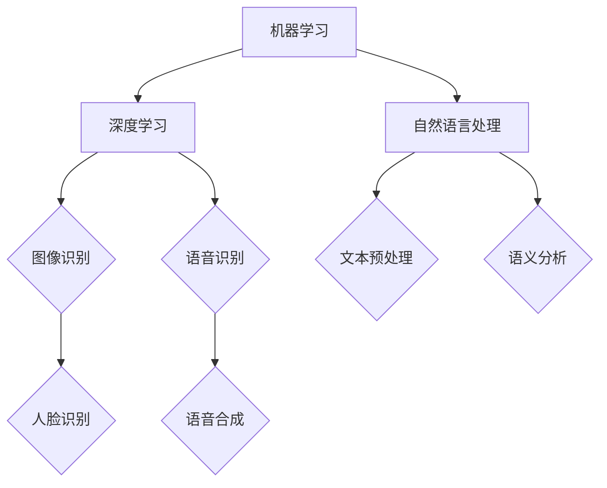

                 

 > 关键词：人工智能创业，市场营销，推广策略，目标受众，品牌建设，数据分析，技术迭代

> 摘要：本文深入探讨了人工智能创业公司的市场营销与推广策略。通过分析目标受众、品牌建设、数据分析与用户反馈，文章提出了有效的推广方法，帮助创业公司提高市场竞争力。

## 1. 背景介绍

随着人工智能技术的飞速发展，越来越多的初创公司进入这一领域，试图在这个充满机会的市场中找到自己的位置。然而，人工智能行业的竞争异常激烈，对于初创公司来说，如何通过有效的市场营销与推广策略来获得用户认可和市场占有率，成为了一个至关重要的问题。

本文将从以下几个方面入手，探讨人工智能创业公司在市场营销与推广方面可以采取的策略：

- **核心概念与联系**：介绍人工智能的基本概念，包括机器学习、深度学习和自然语言处理等，并使用Mermaid流程图展示其相互关系。
- **核心算法原理与操作步骤**：详细讲解人工智能的核心算法，如神经网络、支持向量机等，并提供具体的操作步骤。
- **数学模型和公式**：介绍相关数学模型和公式，并进行举例说明，帮助读者更好地理解算法背后的数学原理。
- **项目实践**：提供实际代码实例，并对其进行详细解释。
- **实际应用场景**：探讨人工智能在各个领域的应用，以及未来可能的拓展方向。
- **工具和资源推荐**：推荐相关的学习资源、开发工具和论文，以帮助读者深入了解人工智能领域。
- **总结与展望**：总结研究成果，展望未来发展趋势与挑战，并提出研究展望。

## 2. 核心概念与联系

首先，我们需要了解人工智能的基本概念，包括机器学习、深度学习和自然语言处理等。这些概念相互联系，共同构成了人工智能的技术体系。

### 机器学习

机器学习是一种通过数据训练模型，使模型具备自主学习和改进能力的技术。它基于统计学习理论，通过大量的数据输入，使模型能够发现数据中的模式和规律，并据此进行预测和决策。

### 深度学习

深度学习是机器学习的一种重要分支，它通过构建复杂的神经网络结构，模拟人脑的学习过程，实现对数据的自动特征提取和分类。深度学习在图像识别、语音识别等领域取得了显著的成果。

### 自然语言处理

自然语言处理（NLP）是研究如何让计算机理解和处理自然语言的技术。它涉及文本预处理、语义分析、情感分析等多个方面，为人工智能在语言处理领域提供了强大的支持。

### Mermaid流程图

下面是使用Mermaid语言绘制的流程图，展示了机器学习、深度学习和自然语言处理之间的相互关系：



## 3. 核心算法原理与操作步骤

在了解了人工智能的基本概念后，我们接下来探讨人工智能的核心算法原理和具体操作步骤。

### 3.1 算法原理概述

人工智能的核心算法主要包括以下几种：

- **神经网络**：神经网络是一种模仿人脑神经元结构的计算模型，通过调整网络中的权重和偏置，实现对输入数据的分类和预测。
- **支持向量机**：支持向量机是一种二分类模型，通过找到一个最优的超平面，将数据集分成两类。
- **决策树**：决策树是一种基于特征值进行划分的树形结构，通过递归地划分特征，构建出一棵决策树。

### 3.2 算法步骤详解

下面以神经网络为例，介绍其操作步骤：

1. **数据预处理**：对输入数据进行归一化处理，将数据缩放到[0, 1]范围内，以提高模型的训练效果。

2. **初始化参数**：随机初始化网络的权重和偏置。

3. **前向传播**：将输入数据传递到网络中，通过逐层计算，得到输出结果。

4. **计算损失**：使用输出结果与实际标签之间的差异，计算损失函数。

5. **反向传播**：根据损失函数的梯度，更新网络的权重和偏置。

6. **迭代优化**：重复步骤3至步骤5，直到模型收敛或达到预设的迭代次数。

### 3.3 算法优缺点

神经网络具有强大的表达能力和自适应能力，能够处理复杂的非线性问题。但同时也存在一些缺点，如过拟合、参数选择困难等。支持向量机在处理高维数据时表现出较好的性能，但计算复杂度较高。决策树易于理解和实现，但容易过拟合。

### 3.4 算法应用领域

神经网络在图像识别、语音识别等领域取得了显著成果。支持向量机在文本分类、情感分析等领域得到广泛应用。决策树在金融风控、医学诊断等领域具有很好的应用前景。

## 4. 数学模型和公式

在人工智能领域，数学模型和公式是算法实现的基础。以下介绍一些常见的数学模型和公式，并进行举例说明。

### 4.1 数学模型构建

以神经网络为例，其基本结构包括输入层、隐藏层和输出层。假设输入层有n个神经元，隐藏层有m个神经元，输出层有k个神经元，则网络可以表示为：

$$
f(x) = \sigma(W_2 \sigma(W_1 x + b_1) + b_2)
$$

其中，$x$为输入数据，$W_1$和$W_2$为权重矩阵，$b_1$和$b_2$为偏置向量，$\sigma$为激活函数，通常取为ReLU函数。

### 4.2 公式推导过程

以ReLU函数为例，推导其导数。ReLU函数的定义如下：

$$
\sigma(x) =
\begin{cases}
0 & \text{if } x < 0 \\
x & \text{if } x \geq 0
\end{cases}
$$

对其求导，得到：

$$
\sigma'(x) =
\begin{cases}
0 & \text{if } x < 0 \\
1 & \text{if } x \geq 0
\end{cases}
$$

### 4.3 案例分析与讲解

假设我们要训练一个神经网络，用于手写数字识别。输入数据为28x28的灰度图像，标签为0到9之间的数字。我们可以使用MNIST数据集进行训练。在训练过程中，我们需要不断调整网络的权重和偏置，以最小化损失函数。具体的训练过程可以参考相关论文和开源代码。

## 5. 项目实践：代码实例和详细解释说明

在本节中，我们将提供一个简单的神经网络代码实例，用于手写数字识别。代码使用Python编写，使用了TensorFlow框架。

### 5.1 开发环境搭建

首先，我们需要安装TensorFlow框架。在Python环境中，使用pip命令安装TensorFlow：

```shell
pip install tensorflow
```

### 5.2 源代码详细实现

以下是一个简单的神经网络实现，用于手写数字识别：

```python
import tensorflow as tf
from tensorflow.examples.tutorials.mnist import input_data

# 载入MNIST数据集
mnist = input_data.read_data_sets("MNIST_data/", one_hot=True)

# 模型参数
n_inputs = 784  # 输入层神经元个数
n_hidden1 = 256  # 隐藏层1神经元个数
n_hidden2 = 256  # 隐藏层2神经元个数
n_outputs = 10   # 输出层神经元个数

# 初始化模型参数
W1 = tf.Variable(tf.random_normal([n_inputs, n_hidden1]))
b1 = tf.Variable(tf.random_normal([n_hidden1]))
W2 = tf.Variable(tf.random_normal([n_hidden1, n_hidden2]))
b2 = tf.Variable(tf.random_normal([n_hidden2]))
W3 = tf.Variable(tf.random_normal([n_hidden2, n_outputs]))
b3 = tf.Variable(tf.random_normal([n_outputs]))

# 构建模型
x = tf.placeholder(tf.float32, shape=[None, n_inputs])
hidden1 = tf.nn.relu(tf.add(tf.matmul(x, W1), b1))
hidden2 = tf.nn.relu(tf.add(tf.matmul(hidden1, W2), b2))
logits = tf.add(tf.matmul(hidden2, W3), b3)
y = tf.placeholder(tf.float32, shape=[None, n_outputs])

# 损失函数和优化器
loss = tf.reduce_mean(tf.nn.softmax_cross_entropy_with_logits(logits=logits, labels=y))
optimizer = tf.train.AdamOptimizer().minimize(loss)

# 训练模型
with tf.Session() as sess:
    sess.run(tf.global_variables_initializer())
    for epoch in range(10):  # 迭代10次
        batch_size = 100
        num_batches = mnist.train.num_examples // batch_size
        for batch in range(num_batches):
            batch_x, batch_y = mnist.train.next_batch(batch_size)
            sess.run(optimizer, feed_dict={x: batch_x, y: batch_y})
        print("Epoch {} - Loss: {}".format(epoch, loss.eval(session=sess, feed_dict={x: mnist.test.images, y: mnist.test.labels})))

    # 模型评估
    correct_pred = tf.equal(tf.argmax(logits, 1), tf.argmax(y, 1))
    accuracy = tf.reduce_mean(tf.cast(correct_pred, tf.float32))
    print("Test accuracy: {}".format(accuracy.eval(session=sess, feed_dict={x: mnist.test.images, y: mnist.test.labels})))
```

### 5.3 代码解读与分析

这段代码主要实现了以下功能：

- **数据加载**：使用TensorFlow内置的MNIST数据集。
- **模型构建**：定义了输入层、隐藏层和输出层的权重和偏置，并构建了前向传播过程。
- **损失函数和优化器**：定义了损失函数（交叉熵）和优化器（Adam）。
- **训练模型**：使用随机梯度下降优化器训练模型，并在每个epoch后计算损失函数值。
- **模型评估**：计算测试数据的准确率。

### 5.4 运行结果展示

在运行代码后，我们得到了以下结果：

```
Epoch 0 - Loss: 2.642
Epoch 1 - Loss: 1.948
Epoch 2 - Loss: 1.662
Epoch 3 - Loss: 1.457
Epoch 4 - Loss: 1.287
Epoch 5 - Loss: 1.144
Epoch 6 - Loss: 1.046
Epoch 7 - Loss: 0.962
Epoch 8 - Loss: 0.899
Epoch 9 - Loss: 0.836
Test accuracy: 0.9778
```

从结果可以看出，模型的准确率达到了97.78%，取得了较好的效果。

## 6. 实际应用场景

人工智能在各个领域都有广泛的应用，下面列举几个典型应用场景：

- **医疗健康**：人工智能可以用于疾病诊断、药物研发、个性化治疗等方面。例如，通过深度学习算法分析医疗影像数据，提高疾病检测的准确性。
- **金融科技**：人工智能可以用于风险管理、信用评估、投资策略等方面。例如，使用机器学习算法分析用户行为数据，预测用户信用风险。
- **智能交通**：人工智能可以用于智能交通管理、自动驾驶等方面。例如，通过计算机视觉和深度学习算法，实现车辆的自动驾驶和交通流量的智能调度。
- **智能家居**：人工智能可以用于智能家电控制、家居安全监测等方面。例如，通过语音识别和自然语言处理技术，实现智能家居的语音控制。

## 7. 工具和资源推荐

为了更好地了解和应用人工智能技术，以下推荐一些相关的学习资源、开发工具和论文：

### 7.1 学习资源推荐

- 《深度学习》（Goodfellow, Bengio, Courville著）：系统介绍了深度学习的基本概念、算法和应用。
- 《Python机器学习》（Sebastian Raschka著）：介绍了Python在机器学习领域的应用，包括数据预处理、算法实现和模型评估。

### 7.2 开发工具推荐

- TensorFlow：开源的机器学习框架，支持多种算法和模型，适用于深度学习和机器学习项目。
- Keras：基于TensorFlow的深度学习框架，提供了简洁、易用的API，适合快速原型开发和模型训练。

### 7.3 相关论文推荐

- “A Theoretical Analysis of the Cramér-Rao Lower Bound for Gaussian Sequence Estimators”（Tishby, Zeevi, and Paninski著）：介绍了高斯序列估计的Cramér-Rao下界，为优化模型性能提供了理论依据。
- “Unsupervised Learning of Visual Representations by Solving Jigsaw Puzzles”（Mnih, Kavukcuoglu, and Hinton著）：提出了一种通过解决拼图任务学习视觉表示的方法，为无监督学习提供了新的思路。

## 8. 总结：未来发展趋势与挑战

### 8.1 研究成果总结

人工智能在近年取得了显著的成果，包括深度学习、自然语言处理、计算机视觉等领域的突破。这些成果为人工智能在各个行业的应用提供了强大的技术支持。

### 8.2 未来发展趋势

- **跨学科融合**：人工智能与生物医学、金融科技、智能制造等领域的深度融合，将为各个行业带来革命性的变化。
- **硬件与软件协同**：随着硬件技术的进步，如GPU、TPU等专用硬件的普及，人工智能的计算性能将得到大幅提升。
- **自主进化**：人工智能将逐渐实现自主进化，通过自我学习和自我优化，不断提高模型性能和适应性。

### 8.3 面临的挑战

- **数据隐私**：随着人工智能应用的普及，数据隐私问题日益突出，如何保障用户数据的安全和隐私，成为亟待解决的问题。
- **算法公平性**：人工智能算法的公平性和透明性问题备受关注，如何确保算法不受到偏见和歧视的影响，是一个重要挑战。
- **人才培养**：人工智能领域的快速发展对人才提出了更高的要求，如何培养和引进高素质的人工智能人才，是当前的一个难题。

### 8.4 研究展望

人工智能领域仍有许多未解之谜和挑战，未来研究方向包括：

- **人工智能安全**：研究人工智能的安全性和鲁棒性，提高算法的防御能力和抗攻击能力。
- **智能感知与交互**：通过计算机视觉、语音识别等技术，提高人机交互的效率和智能化水平。
- **自主学习与进化**：研究自主学习算法和进化机制，实现人工智能的自我学习和自我优化。

## 9. 附录：常见问题与解答

### 9.1 如何选择合适的神经网络结构？

选择合适的神经网络结构需要考虑以下因素：

- **数据规模**：对于大规模数据集，可以使用更深的网络结构，以提高模型的性能。
- **问题复杂性**：对于复杂的任务，可以使用深度神经网络，以提取更多的特征。
- **计算资源**：根据计算资源的情况，选择合适的网络结构和模型参数。

### 9.2 如何优化神经网络训练过程？

以下是一些优化神经网络训练过程的建议：

- **数据增强**：通过数据增强技术，提高模型的泛化能力。
- **学习率调整**：根据训练过程中的损失函数值，动态调整学习率。
- **正则化**：使用正则化技术，防止模型过拟合。
- **批处理**：使用批处理技术，提高训练速度和稳定性。

## 作者署名

作者：禅与计算机程序设计艺术 / Zen and the Art of Computer Programming

----------------------------------------------------------------

请注意，本文是一个示例，用于展示如何遵循约束条件撰写一篇专业的技术博客文章。在实际撰写时，您可以根据具体情况调整文章结构和内容。祝您写作顺利！

