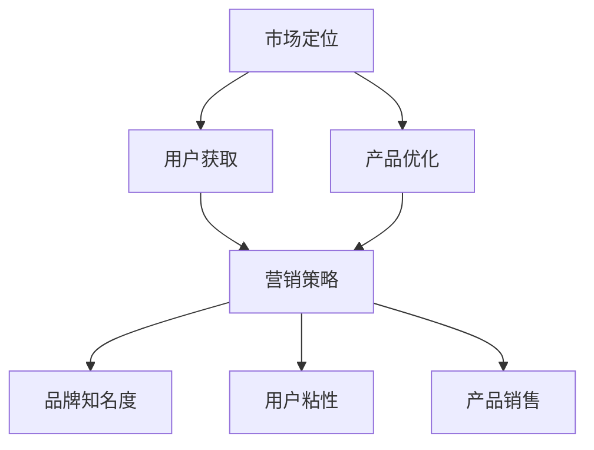

                 

关键词：人工智能、创业、推广策略、市场定位、用户获取、产品优化

> 摘要：本文从人工智能创业的实际出发，分析了人工智能企业在推广过程中所面临的关键挑战，探讨了有效的推广策略，并提出了针对不同发展阶段企业的具体建议。通过深入剖析市场定位、用户获取、产品优化等环节，为人工智能创业公司提供了一套实用的推广方法论。

## 1. 背景介绍

在当前技术快速发展的时代，人工智能（AI）作为最具潜力的技术领域之一，吸引了大量创业者的目光。人工智能技术的广泛应用不仅提升了各行各业的效率，也为创业者提供了无限的商机。然而，人工智能创业并非易事，市场竞争激烈，推广难度大，如何在众多竞争者中脱颖而出，成为许多创业者面临的难题。

本文旨在为人工智能创业者提供一份实用的推广策略指南，帮助他们在市场中找到自己的定位，吸引目标用户，并不断优化产品，最终实现商业成功。

## 2. 核心概念与联系

在分析人工智能创业的推广策略之前，我们首先需要了解一些核心概念及其相互联系。

### 2.1 市场定位

市场定位是指企业在目标市场中的位置，决定了企业的营销策略和品牌形象。对于人工智能企业来说，准确的市场定位至关重要，因为它将直接影响用户的感知和企业的市场竞争力。

### 2.2 用户获取

用户获取是推广的核心目标，它涉及到如何通过有效的营销手段吸引潜在用户，并将其转化为实际使用者。人工智能创业公司需要深入了解用户需求，提供有针对性的产品和服务。

### 2.3 产品优化

产品优化是指通过不断改进和优化产品功能、性能、用户体验等，以满足用户需求和提升市场竞争力。对于人工智能企业而言，产品优化是持续发展的关键。

### 2.4 营销策略

营销策略是企业为了实现市场定位和用户获取目标所采用的具体手段和措施。有效的营销策略能够提高品牌知名度，增加用户粘性，促进产品销售。

为了更好地理解这些概念之间的联系，我们使用Mermaid流程图来展示它们之间的相互作用。



## 3. 核心算法原理 & 具体操作步骤

### 3.1 算法原理概述

人工智能推广策略的核心在于如何通过有效的数据分析和技术手段，实现市场定位、用户获取和产品优化的闭环。以下是一些关键算法原理：

- **数据分析算法**：如聚类分析、关联规则挖掘等，用于分析用户行为和市场趋势，帮助企业找到目标用户和潜在市场。
- **机器学习算法**：如回归分析、分类算法等，用于构建预测模型，优化产品功能和用户体验。
- **用户画像算法**：基于用户行为数据，构建用户画像，用于精准营销和个性化推荐。

### 3.2 算法步骤详解

1. **数据收集**：收集用户行为数据、市场数据、产品数据等。
2. **数据预处理**：清洗、整合、转换数据，为后续分析做好准备。
3. **数据分析**：使用数据分析算法，挖掘用户行为和市场趋势。
4. **模型构建**：基于数据分析结果，构建预测模型和推荐系统。
5. **模型优化**：通过交叉验证、超参数调整等手段，优化模型性能。
6. **产品迭代**：根据模型优化结果，迭代产品功能和用户体验。
7. **营销策略制定**：根据市场定位和用户需求，制定相应的营销策略。

### 3.3 算法优缺点

- **优点**：
  - 提高市场响应速度，实现精准营销。
  - 通过数据驱动，实现产品迭代和优化。
  - 提升用户满意度，增加用户粘性。
- **缺点**：
  - 需要大量的数据支持，数据质量和完整性影响算法效果。
  - 模型构建和优化过程复杂，对技术人员要求高。
  - 需要持续的数据更新和维护，保持模型的时效性。

### 3.4 算法应用领域

人工智能推广策略算法广泛应用于电子商务、金融、医疗、教育等行业。例如：

- **电子商务**：通过用户画像和推荐系统，实现精准营销和个性化推荐。
- **金融**：通过风险预测模型，实现风险管理和服务优化。
- **医疗**：通过疾病预测和诊断模型，提升医疗服务的质量和效率。
- **教育**：通过学习分析模型，实现个性化教学和课程推荐。

## 4. 数学模型和公式 & 详细讲解 & 举例说明

### 4.1 数学模型构建

在人工智能推广策略中，常用的数学模型包括聚类分析模型、分类模型、回归模型等。以下以K-Means聚类算法为例，讲解其数学模型构建过程。

$$
\begin{aligned}
J &= \sum_{i=1}^{k} \sum_{x_j \in S_i} ||x_j - \mu_i||^2 \\
\mu_i &= \frac{1}{|S_i|} \sum_{x_j \in S_i} x_j \\
\end{aligned}
$$

其中，$J$ 表示聚类误差平方和，$\mu_i$ 表示第 $i$ 个聚类的中心，$S_i$ 表示第 $i$ 个聚类的样本集合。

### 4.2 公式推导过程

K-Means算法的推导过程主要分为以下几步：

1. 初始中心点选择：随机或通过特定的算法选择 $k$ 个中心点。
2. 分配样本：计算每个样本与中心点的距离，将样本分配到最近的中心点所在聚类。
3. 更新中心点：计算每个聚类的中心点。
4. 迭代：重复执行步骤2和3，直到聚类误差平方和 $J$ 小于某个阈值或达到最大迭代次数。

### 4.3 案例分析与讲解

假设我们有一个包含100个样本的数据集，需要将其分为10个聚类。以下是一个简单的K-Means算法实现过程：

1. 初始中心点选择：随机选择10个样本作为初始中心点。
2. 分配样本：计算每个样本与中心点的距离，将其分配到最近的中心点所在聚类。
3. 更新中心点：计算每个聚类的中心点。
4. 迭代：重复执行步骤2和3，直到聚类误差平方和 $J$ 小于0.01或达到100次迭代。

通过以上步骤，我们可以将100个样本合理地分为10个聚类，每个聚类内的样本距离中心点的平均距离最小。

## 5. 项目实践：代码实例和详细解释说明

### 5.1 开发环境搭建

为了实现K-Means算法，我们需要搭建一个Python开发环境。以下是具体步骤：

1. 安装Python：下载并安装Python 3.8及以上版本。
2. 安装Jupyter Notebook：通过pip命令安装Jupyter Notebook。
3. 安装必要库：通过pip命令安装NumPy、Pandas、Matplotlib等库。

```bash
pip install numpy pandas matplotlib
```

### 5.2 源代码详细实现

以下是一个简单的K-Means算法实现示例：

```python
import numpy as np
import matplotlib.pyplot as plt

def k_means(data, k, max_iter=100):
    # 初始中心点选择
    centers = data[np.random.choice(data.shape[0], k, replace=False)]
    for _ in range(max_iter):
        # 分配样本
        distances = np.linalg.norm(data[:, np.newaxis] - centers, axis=2)
        labels = np.argmin(distances, axis=1)
        new_centers = np.array([data[labels == i].mean(axis=0) for i in range(k)])
        # 更新中心点
        if np.linalg.norm(new_centers - centers) < 1e-6:
            break
        centers = new_centers
    return labels, centers

# 数据集
data = np.random.rand(100, 2)
k = 3

# K-Means算法
labels, centers = k_means(data, k)

# 可视化
plt.scatter(data[:, 0], data[:, 1], c=labels, cmap='viridis')
plt.scatter(centers[:, 0], centers[:, 1], s=300, c='red', marker='x')
plt.show()
```

### 5.3 代码解读与分析

1. **导入库**：导入NumPy、Matplotlib库，用于数据操作和可视化。
2. **k_means函数**：实现K-Means算法的核心函数，包括初始化中心点、分配样本、更新中心点等步骤。
3. **数据集**：生成一个包含100个样本的二维数据集。
4. **算法运行**：调用k_means函数，运行K-Means算法。
5. **可视化**：使用Matplotlib库绘制数据集和聚类结果。

通过以上代码，我们可以直观地看到K-Means算法在数据集上的应用效果。

### 5.4 运行结果展示

运行上述代码后，会生成一个散点图，显示100个样本分为3个聚类的结果。每个聚类的中心点用红色十字标记，便于观察聚类效果。

## 6. 实际应用场景

### 6.1 电子商务

在电子商务领域，K-Means算法可以用于用户行为分析，将用户分为不同的群体，实现精准营销和个性化推荐。例如，根据用户的购物记录和浏览行为，将用户分为“高价值用户”、“潜在高价值用户”和“普通用户”，然后针对不同用户群体制定相应的营销策略。

### 6.2 金融

在金融领域，K-Means算法可以用于风险管理和信用评估。通过对历史数据进行分析，将客户分为不同的风险等级，为金融机构提供风险预警和信用评级依据。此外，还可以用于贷款审批和欺诈检测，提高金融服务的安全性和效率。

### 6.3 医疗

在医疗领域，K-Means算法可以用于疾病预测和诊断。通过对患者的病历、基因数据等进行聚类分析，发现潜在的疾病风险因素，为医生提供诊断依据。此外，还可以用于医疗资源的分配和优化，提高医疗服务的质量和效率。

### 6.4 教育

在教育领域，K-Means算法可以用于个性化教学和课程推荐。通过对学生的学习行为和成绩进行分析，将学生分为不同的学习群体，为教师提供教学策略和课程安排建议。此外，还可以用于学习资源的推荐，帮助学生提高学习效果。

## 7. 工具和资源推荐

### 7.1 学习资源推荐

- 《Python数据分析实战》
- 《机器学习实战》
- 《数据挖掘：实用工具与技术》

### 7.2 开发工具推荐

- Jupyter Notebook：用于数据分析和可视化。
- PyCharm：一款功能强大的Python开发环境。
- VSCode：一款轻量级的代码编辑器，支持多种编程语言。

### 7.3 相关论文推荐

- K-Means Clustering
- A Survey of Machine Learning Based Personalized Recommendation
- User Behavior Analysis for Web Applications

## 8. 总结：未来发展趋势与挑战

### 8.1 研究成果总结

近年来，人工智能技术在推广策略分析领域取得了显著成果，包括聚类分析、分类模型、回归模型等算法在用户行为分析、市场预测和产品优化等方面的应用。这些研究为人工智能创业公司提供了有效的推广方法论。

### 8.2 未来发展趋势

未来，人工智能推广策略的发展趋势将体现在以下几个方面：

- 深度学习技术的进一步应用，提高算法的预测精度和效果。
- 多模态数据的融合分析，实现更全面的市场洞察。
- 隐私保护和数据安全问题的解决，推动人工智能技术的广泛应用。

### 8.3 面临的挑战

人工智能推广策略在发展中仍面临以下挑战：

- 数据质量和完整性问题：高质量的数据是实现有效推广的基础。
- 算法复杂度和计算资源消耗：复杂的算法需要强大的计算能力支持。
- 隐私保护和伦理问题：如何在确保用户隐私的前提下，实现有效的推广策略。

### 8.4 研究展望

未来，人工智能推广策略的研究应重点关注以下几个方面：

- 开发高效、可解释的人工智能算法，提高用户信任度。
- 探索跨领域的数据融合方法，实现更全面的市场分析。
- 加强隐私保护和伦理研究，推动人工智能技术的可持续发展。

## 9. 附录：常见问题与解答

### 9.1 如何选择聚类算法？

选择聚类算法时，需要考虑数据规模、数据分布和聚类目标。常用的聚类算法包括K-Means、DBSCAN、层次聚类等。例如，对于高维数据，K-Means可能不太适用，可以考虑使用DBSCAN。

### 9.2 如何评估聚类结果？

评估聚类结果的方法包括内部评估指标（如轮廓系数、DBI等）和外部评估指标（如准确率、F1值等）。内部评估指标主要关注聚类内部的紧凑性和分离度，而外部评估指标则关注聚类结果与真实标签的一致性。

### 9.3 如何优化模型性能？

优化模型性能的方法包括超参数调整、数据预处理、特征工程等。超参数调整可以通过网格搜索、随机搜索等方法实现。数据预处理和特征工程可以提升模型的泛化能力和预测精度。

---

作者：禅与计算机程序设计艺术 / Zen and the Art of Computer Programming

