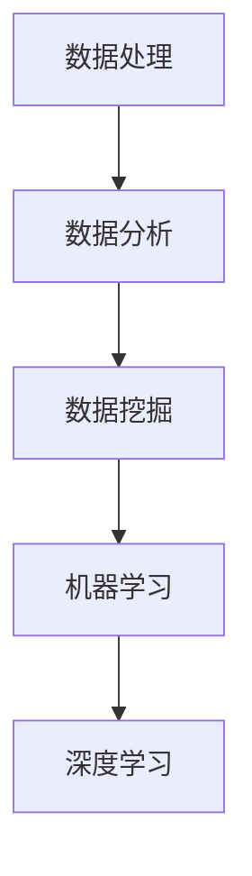

                 

关键词：人工智能、创业、数据、核心地位、数据处理、数据分析、数据挖掘、机器学习、深度学习

> 摘要：在人工智能创业浪潮中，数据的地位愈发重要。本文将深入探讨数据在人工智能创业中的核心地位，从数据处理、数据分析、数据挖掘到机器学习和深度学习，分析数据对人工智能创业成功的关键影响，并提供实际案例和实践建议。

## 1. 背景介绍

随着云计算、大数据、物联网等技术的发展，人工智能（AI）在各个行业中的应用越来越广泛。人工智能创业浪潮随之涌现，许多初创公司纷纷投身其中，寻求通过AI技术实现商业价值。然而，人工智能的繁荣离不开一个核心要素——数据。在人工智能创业过程中，数据的地位愈发重要，成为决定创业成败的关键因素。

数据是人工智能的“粮食”，没有高质量的数据，人工智能算法就无法训练和优化，更难以实现商业应用。因此，如何在创业初期就建立起数据核心地位，成为每一个创业者必须面对的重要问题。

## 2. 核心概念与联系

### 2.1 数据处理

数据处理是人工智能创业的第一步，它包括数据收集、清洗、预处理、存储等环节。数据处理的质量直接影响后续的数据分析和机器学习模型的训练效果。

### 2.2 数据分析

数据分析是利用统计和数据分析方法，从大量数据中发现有用的信息、模式和规律。数据分析在人工智能创业中具有重要作用，可以帮助创业者了解市场需求、用户行为和业务模式。

### 2.3 数据挖掘

数据挖掘是利用机器学习算法，从大量数据中发现未知模式和规律。数据挖掘在人工智能创业中具有广泛应用，如推荐系统、风险控制、欺诈检测等。

### 2.4 机器学习

机器学习是一种通过算法从数据中学习规律和模式，实现自我优化的技术。机器学习在人工智能创业中具有重要意义，可以自动化决策、提高效率和准确性。

### 2.5 深度学习

深度学习是机器学习的一种，通过多层神经网络对数据进行学习和建模。深度学习在人工智能创业中具有广泛应用，如图像识别、自然语言处理、语音识别等。

下面是一个Mermaid流程图，展示了这些核心概念之间的联系：



## 3. 核心算法原理 & 具体操作步骤

### 3.1 算法原理概述

在人工智能创业中，常用的算法包括机器学习算法和深度学习算法。机器学习算法通过训练数据学习规律和模式，深度学习算法通过多层神经网络对数据进行建模。

### 3.2 算法步骤详解

#### 3.2.1 机器学习算法

1. 数据收集：收集相关领域的训练数据。
2. 数据预处理：对数据进行清洗、归一化等处理。
3. 特征提取：从数据中提取有用的特征。
4. 模型训练：利用训练数据训练模型。
5. 模型评估：评估模型的准确性、泛化能力等。
6. 模型优化：根据评估结果优化模型。

#### 3.2.2 深度学习算法

1. 数据收集：收集相关领域的训练数据。
2. 数据预处理：对数据进行清洗、归一化等处理。
3. 网络架构设计：设计合适的神经网络架构。
4. 模型训练：利用训练数据训练模型。
5. 模型评估：评估模型的准确性、泛化能力等。
6. 模型优化：根据评估结果优化模型。

### 3.3 算法优缺点

#### 3.3.1 机器学习算法

优点：算法相对简单，易于实现；适合处理中小规模数据。

缺点：对特征工程依赖较大；泛化能力有限。

#### 3.3.2 深度学习算法

优点：能够自动提取特征，减少人工干预；适用于大规模数据；泛化能力强。

缺点：算法复杂，训练时间较长；对数据质量要求较高。

### 3.4 算法应用领域

机器学习算法和深度学习算法在人工智能创业中的应用非常广泛，包括但不限于以下领域：

1. 推荐系统：基于用户行为数据，为用户推荐感兴趣的商品、内容等。
2. 风险控制：通过分析用户行为数据，识别潜在风险，预防欺诈行为。
3. 欺诈检测：通过分析交易数据，识别异常交易行为，预防欺诈。
4. 自然语言处理：基于文本数据，实现文本分类、情感分析等任务。
5. 图像识别：通过分析图像数据，实现图像分类、目标检测等任务。

## 4. 数学模型和公式 & 详细讲解 & 举例说明

### 4.1 数学模型构建

在人工智能创业中，常用的数学模型包括线性回归、逻辑回归、支持向量机、神经网络等。

#### 4.1.1 线性回归

线性回归模型的基本公式为：

$$
y = \beta_0 + \beta_1x
$$

其中，$y$为因变量，$x$为自变量，$\beta_0$和$\beta_1$为模型参数。

#### 4.1.2 逻辑回归

逻辑回归模型的基本公式为：

$$
P(y=1) = \frac{1}{1 + e^{-(\beta_0 + \beta_1x)}}
$$

其中，$P(y=1)$为因变量为1的概率，$e$为自然底数。

#### 4.1.3 支持向量机

支持向量机的基本公式为：

$$
w \cdot x - b = 0
$$

其中，$w$为模型参数，$x$为样本特征向量，$b$为偏置。

#### 4.1.4 神经网络

神经网络的基本公式为：

$$
a_{i}(l) = \sigma(\sum_{j=1}^{n} w_{ji}a_{j}(l-1) + b_{l})
$$

其中，$a_{i}(l)$为第$l$层的第$i$个神经元输出，$\sigma$为激活函数。

### 4.2 公式推导过程

这里以线性回归为例，介绍公式推导过程。

首先，假设我们有$m$个样本，每个样本包含$n$个特征，以及对应的标签$y$。我们希望找到一个线性模型：

$$
y = \beta_0 + \beta_1x
$$

使得预测值$y'$与真实值$y$的误差最小。

为了求解$\beta_0$和$\beta_1$，我们可以使用最小二乘法。具体步骤如下：

1. 构造损失函数：

$$
J(\beta_0, \beta_1) = \frac{1}{2}\sum_{i=1}^{m}(y_i - y'_i)^2
$$

2. 对损失函数求导：

$$
\frac{\partial J}{\partial \beta_0} = \sum_{i=1}^{m}(y_i - y'_i)
$$

$$
\frac{\partial J}{\partial \beta_1} = \sum_{i=1}^{m}(y_i - y'_i)x_i
$$

3. 令导数为0，求解$\beta_0$和$\beta_1$：

$$
\beta_0 = \frac{1}{m}\sum_{i=1}^{m}y_i - \beta_1\frac{1}{m}\sum_{i=1}^{m}x_i
$$

$$
\beta_1 = \frac{1}{m}\sum_{i=1}^{m}(y_i - y'_i)x_i
$$

### 4.3 案例分析与讲解

假设我们要预测某个城市下一年的空气质量指数（AQI），已知过去5年的数据，包括每年的AQI值和影响AQI的几个因素（如温度、湿度、风速等）。

1. 数据收集：收集过去5年的AQI值和影响因素数据。
2. 数据预处理：对数据进行清洗、归一化等处理。
3. 特征提取：从数据中提取有用的特征，如温度、湿度、风速等。
4. 模型训练：使用线性回归模型进行训练。
5. 模型评估：评估模型的准确性、泛化能力等。
6. 模型优化：根据评估结果优化模型。

通过以上步骤，我们可以得到一个预测下一年的AQI值的线性回归模型。接下来，我们可以利用这个模型预测下一年的AQI值，为环保部门提供决策支持。

## 5. 项目实践：代码实例和详细解释说明

### 5.1 开发环境搭建

1. 安装Python环境。
2. 安装NumPy、Pandas、Scikit-learn等库。

### 5.2 源代码详细实现

```python
import numpy as np
import pandas as pd
from sklearn.linear_model import LinearRegression

# 5.2.1 数据收集
data = pd.read_csv('air_quality.csv')

# 5.2.2 数据预处理
data = data.dropna()

# 5.2.3 特征提取
X = data[['temperature', 'humidity', 'wind_speed']]
y = data['aqi']

# 5.2.4 模型训练
model = LinearRegression()
model.fit(X, y)

# 5.2.5 模型评估
score = model.score(X, y)
print('模型评估分数：', score)

# 5.2.6 模型优化
# 在此基础上，我们可以进一步优化模型，如调整特征权重、增加新特征等。
```

### 5.3 代码解读与分析

1. 导入相关库。
2. 数据收集：从CSV文件中读取数据。
3. 数据预处理：删除缺失值。
4. 特征提取：从数据中提取温度、湿度、风速等特征。
5. 模型训练：使用线性回归模型进行训练。
6. 模型评估：计算模型评估分数。
7. 模型优化：根据评估结果优化模型。

通过以上代码，我们可以实现一个简单的空气质量指数预测模型。接下来，我们可以利用这个模型预测下一年的AQI值，为环保部门提供决策支持。

## 6. 实际应用场景

### 6.1 智能医疗

在智能医疗领域，数据在人工智能创业中发挥着重要作用。通过分析患者的电子健康记录、基因数据、医疗影像等，人工智能可以辅助医生进行诊断、预测疾病风险、个性化治疗方案等。

### 6.2 智能金融

在智能金融领域，数据帮助金融机构进行风险评估、欺诈检测、个性化理财等。通过分析用户行为数据、交易数据等，人工智能可以预测用户需求、优化金融服务。

### 6.3 智能交通

在智能交通领域，数据帮助交通部门进行交通流量预测、拥堵治理、智能停车等。通过分析交通数据、天气数据等，人工智能可以优化交通管理、提高交通效率。

### 6.4 未来应用展望

随着人工智能技术的不断进步，数据在人工智能创业中的应用将越来越广泛。未来，我们可以期待更多基于数据的人工智能应用，如智能教育、智能家居、智能农业等。同时，随着数据隐私和安全问题的日益突出，如何在保护用户隐私的前提下充分利用数据，将成为人工智能创业的重要挑战。

## 7. 工具和资源推荐

### 7.1 学习资源推荐

1. 《Python数据分析基础教程：Numpy学习指南》
2. 《利用Python进行数据分析》
3. 《机器学习实战》
4. 《深度学习》（Goodfellow、Bengio、Courville著）

### 7.2 开发工具推荐

1. Jupyter Notebook：用于编写和运行Python代码。
2. Anaconda：Python开发环境。
3. Scikit-learn：机器学习库。
4. TensorFlow：深度学习框架。

### 7.3 相关论文推荐

1. "Learning to Rank for Information Retrieval"（信息检索中的排序学习）
2. "Deep Learning for Natural Language Processing"（自然语言处理中的深度学习）
3. "Dive into Deep Learning"（深入浅出深度学习）

## 8. 总结：未来发展趋势与挑战

### 8.1 研究成果总结

随着人工智能技术的不断进步，数据在人工智能创业中的地位日益重要。数据处理、数据分析、数据挖掘、机器学习和深度学习等技术为人工智能创业提供了强大的支持。

### 8.2 未来发展趋势

1. 数据驱动：未来的人工智能创业将更加依赖于数据，通过数据分析和挖掘实现商业价值。
2. 模型压缩：为了降低计算成本和存储需求，模型压缩技术将得到广泛应用。
3. 跨学科融合：人工智能与其他学科的融合将带来更多创新应用。

### 8.3 面临的挑战

1. 数据隐私和安全：如何在保护用户隐私的前提下充分利用数据，是人工智能创业面临的重要挑战。
2. 模型可解释性：提高模型的可解释性，帮助用户理解模型的决策过程。
3. 资源分配：如何合理分配计算资源，提高人工智能系统的性能和效率。

### 8.4 研究展望

未来，人工智能创业将朝着更加智能化、高效化、安全化的方向发展。通过不断探索和创新，我们有望实现更多基于数据的人工智能应用，推动人工智能技术的广泛应用。

## 9. 附录：常见问题与解答

### 9.1 如何获取高质量数据？

1. 开源数据集：利用开源数据集进行研究和实验。
2. 数据采购：购买专业的数据服务。
3. 数据采集：自行采集数据，如通过传感器、网络爬虫等。

### 9.2 如何处理大量数据？

1. 分布式计算：利用Hadoop、Spark等分布式计算框架处理大量数据。
2. 数据库：选择合适的数据库，如关系型数据库（MySQL、PostgreSQL）或NoSQL数据库（MongoDB、Redis）。

### 9.3 如何保障数据安全？

1. 加密：对敏感数据进行加密存储和传输。
2. 访问控制：设置合适的访问权限，限制数据访问。
3. 安全审计：定期进行安全审计，确保数据安全。

---

本文由禅与计算机程序设计艺术 / Zen and the Art of Computer Programming 撰写，旨在探讨数据在人工智能创业中的核心地位，并提供相关技术指导和实践建议。希望对广大人工智能创业者和从业者有所启发。

----------------------------------------------------------------

