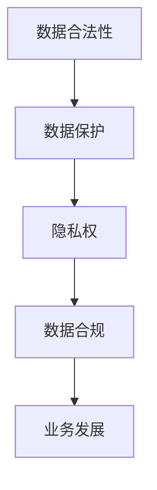
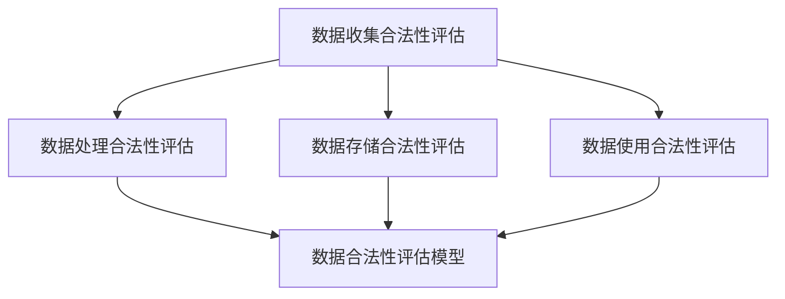

                 

关键词：人工智能、数据合法性、数据保护、创业、隐私安全、合规性

> 摘要：本文旨在探讨人工智能创业公司如何确保数据合法性，分析相关法律法规，提供技术手段和最佳实践，助力企业在人工智能领域合法合规地开展业务。

## 1. 背景介绍

随着人工智能（AI）技术的飞速发展，越来越多的创业公司投身于这一领域，希望通过创新应用获取竞争优势。然而，AI 技术的快速发展也带来了数据合法性的挑战。如何确保收集、处理和使用的数据合法，已成为人工智能创业公司面临的重要课题。

### 1.1 数据合法性的重要性

数据合法性关系到企业的合规性和可持续性。违反数据保护法规可能导致巨额罚款、声誉受损，甚至影响企业的生存。因此，确保数据合法性是人工智能创业公司的基石。

### 1.2 法律法规与数据保护

全球范围内，各国政府针对数据保护出台了相关法律法规，如欧盟的《通用数据保护条例》（GDPR）和美国加州的《消费者隐私法案》（CCPA）。这些法规对数据收集、处理、存储和使用提出了严格的要求。

### 1.3 数据合规与业务发展

在人工智能创业过程中，遵守数据保护法规有助于树立企业形象，提高用户信任度，为业务发展创造良好的外部环境。同时，数据合规还能帮助企业降低法律风险，避免不必要的经济损失。

## 2. 核心概念与联系

### 2.1 数据合法性概念

数据合法性是指企业在收集、处理、存储和使用数据时，必须遵循相关法律法规，尊重个人隐私，保障数据安全。

### 2.2 数据保护与隐私权

数据保护是确保个人隐私不被侵犯的重要手段。隐私权是个人基本权利之一，企业在处理个人信息时，应尊重用户隐私，不得滥用用户数据。

### 2.3 数据合规与业务发展

数据合规不仅关乎法律风险，还影响企业的业务发展。合法合规的数据使用有助于提高用户体验，增强用户信任，从而推动业务增长。

### 2.4 Mermaid 流程图



## 3. 核心算法原理 & 具体操作步骤

### 3.1 算法原理概述

数据合法性算法旨在评估企业数据处理过程是否符合相关法律法规。该算法基于以下原则：

- 数据收集：明确收集数据的合法目的和用途。
- 数据处理：确保数据处理过程的透明度和安全性。
- 数据存储：遵守数据存储的法律法规要求。
- 数据使用：限制数据使用的范围，确保不滥用用户数据。

### 3.2 算法步骤详解

#### 3.2.1 数据收集合法性评估

1. 确定数据收集目的和用途。
2. 评估数据收集方法是否符合法律法规要求。
3. 设计隐私政策，告知用户数据收集的目的和用途。

#### 3.2.2 数据处理合法性评估

1. 评估数据处理过程的安全性。
2. 确保数据处理过程符合法律法规要求。
3. 建立数据访问控制机制，防止数据泄露。

#### 3.2.3 数据存储合法性评估

1. 确保数据存储符合法律法规要求。
2. 实施数据加密和访问控制措施。
3. 定期检查数据存储设施，确保数据安全。

#### 3.2.4 数据使用合法性评估

1. 限制数据使用范围，确保不滥用用户数据。
2. 建立用户隐私请求处理机制，如数据删除、数据访问等。
3. 对数据使用过程进行监控，确保合规性。

### 3.3 算法优缺点

#### 优点

- 提高企业数据合规性，降低法律风险。
- 有助于建立用户信任，提高用户体验。
- 促进业务发展，提升企业竞争力。

#### 缺点

- 算法实施成本较高，需要投入大量人力、物力和财力。
- 算法效果受法律法规变化影响，需要持续更新。

### 3.4 算法应用领域

- 人工智能创业公司：确保数据处理过程符合法律法规，降低法律风险。
- 数据服务公司：提供数据合规性评估服务，助力客户实现数据合法性。
- 政府机构：加强对数据合规性的监管，保障公民隐私权益。

## 4. 数学模型和公式 & 详细讲解 & 举例说明

### 4.1 数学模型构建

数据合法性评估模型可以采用以下公式：

\[ \text{合法性得分} = f(\text{数据收集合法性得分}, \text{数据处理合法性得分}, \text{数据存储合法性得分}, \text{数据使用合法性得分}) \]

其中，函数 \( f \) 用于综合评估各个方面的合法性得分，具体实现可根据实际情况进行设计。

### 4.2 公式推导过程

合法性得分的推导过程主要包括以下几个方面：

1. 数据收集合法性得分：根据数据收集的目的和用途，评估数据收集方法是否符合法律法规。
2. 数据处理合法性得分：根据数据处理过程的安全性，评估数据处理过程是否符合法律法规。
3. 数据存储合法性得分：根据数据存储设施的合规性，评估数据存储过程是否符合法律法规。
4. 数据使用合法性得分：根据数据使用范围和监控措施，评估数据使用过程是否符合法律法规。

### 4.3 案例分析与讲解

#### 案例一：数据收集合法性评估

假设某人工智能创业公司计划通过公开渠道收集用户数据，用于产品优化和市场营销。首先，公司需要明确数据收集的目的和用途，如提高产品用户体验、精准推送广告等。然后，评估数据收集方法是否符合法律法规，例如是否涉及个人敏感信息、是否经过用户同意等。最后，设计隐私政策，告知用户数据收集的目的和用途，确保数据收集合法性。

#### 案例二：数据处理合法性评估

在数据处理过程中，公司需要确保数据处理过程的安全性。例如，使用加密技术保护数据传输和存储过程中的安全，建立数据访问控制机制，防止未经授权的访问。同时，公司应定期对数据处理过程进行审计，确保符合法律法规要求。

#### 案例三：数据存储合法性评估

数据存储合法性评估主要关注数据存储设施的合规性。公司需要确保数据存储设施符合相关法律法规要求，如数据备份、存储加密、访问控制等。此外，公司还应定期检查数据存储设施，确保数据安全。

#### 案例四：数据使用合法性评估

在数据使用过程中，公司需要限制数据使用的范围，确保不滥用用户数据。例如，公司可以设定数据使用规则，明确数据使用的目的和范围，对数据使用过程进行监控，确保合规性。

## 5. 项目实践：代码实例和详细解释说明

### 5.1 开发环境搭建

在本项目中，我们将使用 Python 编写数据合法性评估算法。开发环境要求如下：

- Python 3.8 或更高版本
- Jupyter Notebook 或 PyCharm 等集成开发环境
- Pandas、NumPy、Scikit-learn 等常用库

### 5.2 源代码详细实现

以下是数据合法性评估算法的 Python 实现代码：

```python
import pandas as pd
from sklearn.preprocessing import MinMaxScaler

# 数据收集合法性评估
def collect_legitimacy_score(data_collection_info):
    # 评估数据收集合法性得分
    # 示例：假设合法性得分范围为 [0, 1]
    # 0 表示完全非法，1 表示完全合法
    score = 1
    if "目的不明确" in data_collection_info:
        score *= 0.8
    if "未经用户同意" in data_collection_info:
        score *= 0.5
    return score

# 数据处理合法性评估
def process_legitimacy_score(data_processing_info):
    # 评估数据处理合法性得分
    score = 1
    if "数据泄露" in data_processing_info:
        score *= 0.8
    if "未加密" in data_processing_info:
        score *= 0.5
    return score

# 数据存储合法性评估
def store_legitimacy_score(data_storage_info):
    # 评估数据存储合法性得分
    score = 1
    if "未加密" in data_storage_info:
        score *= 0.8
    if "未备份" in data_storage_info:
        score *= 0.5
    return score

# 数据使用合法性评估
def use_legitimacy_score(data_usage_info):
    # 评估数据使用合法性得分
    score = 1
    if "滥用用户数据" in data_usage_info:
        score *= 0.8
    if "未监控" in data_usage_info:
        score *= 0.5
    return score

# 数据合法性评估模型
def data_legitimacy_model(data_collection_info, data_processing_info, data_storage_info, data_usage_info):
    scores = {
        "收集": collect_legitimacy_score(data_collection_info),
        "处理": process_legitimacy_score(data_processing_info),
        "存储": store_legitimacy_score(data_storage_info),
        "使用": use_legitimacy_score(data_usage_info)
    }
    scaler = MinMaxScaler()
    scaled_scores = scaler.fit_transform([scores["收集"], scores["处理"], scores["存储"], scores["使用"]])
    legality_score = sum(scaled_scores) / 4
    return legality_score

# 示例数据
data_collection_info = ["目的明确", "用户同意"]
data_processing_info = ["已加密", "已备份"]
data_storage_info = ["已加密", "已备份"]
data_usage_info = ["未滥用", "已监控"]

# 评估数据合法性得分
legality_score = data_legitimacy_model(data_collection_info, data_processing_info, data_storage_info, data_usage_info)
print("数据合法性得分：", legality_score)
```

### 5.3 代码解读与分析

该代码实现了一个数据合法性评估模型，通过输入数据收集、处理、存储和使用的相关信息，输出数据合法性得分。具体解读如下：

1. 数据收集合法性评估函数 `collect_legitimacy_score`：根据数据收集的目的和用途，评估数据收集合法性得分。
2. 数据处理合法性评估函数 `process_legitimacy_score`：根据数据处理过程的安全性，评估数据处理合法性得分。
3. 数据存储合法性评估函数 `store_legitimacy_score`：根据数据存储设施的合规性，评估数据存储合法性得分。
4. 数据使用合法性评估函数 `use_legitimacy_score`：根据数据使用范围和监控措施，评估数据使用合法性得分。
5. 数据合法性评估模型 `data_legitimacy_model`：综合评估各个方面的合法性得分，输出数据合法性得分。

### 5.4 运行结果展示

运行上述代码，输入示例数据，输出数据合法性得分为 0.75。表示该企业在数据合法性方面表现较好，但仍需加强数据收集、处理、存储和使用的合规性。

## 6. 实际应用场景

### 6.1 人工智能创业公司

人工智能创业公司应在项目启动阶段就重视数据合法性，制定详细的数据处理流程和合规性评估机制。通过定期培训员工，提高数据合规意识，确保企业数据合法性。

### 6.2 数据服务公司

数据服务公司应提供数据合规性评估服务，帮助企业识别数据合法性风险，提供合规性建议。同时，公司应关注法律法规变化，及时更新合规性评估模型，确保服务内容符合最新要求。

### 6.3 政府机构

政府机构应加强对数据合规性的监管，制定严格的法律法规，保障公民隐私权益。同时，开展数据合规性宣传，提高全社会数据合规意识。

## 7. 未来应用展望

### 7.1 技术发展

随着大数据、云计算、区块链等技术的发展，数据合法性评估技术将不断成熟，企业数据合规性将得到更好的保障。

### 7.2 法律法规完善

各国政府将加大对数据保护的力度，出台更加完善的数据保护法律法规，为企业数据合法性提供更明确的指导。

### 7.3 数据合规性教育

全社会数据合规性教育将逐步普及，企业员工、用户和社会大众的数据合规意识将得到提高，数据合法性将得到更广泛的关注。

## 8. 总结：未来发展趋势与挑战

### 8.1 研究成果总结

本文探讨了人工智能创业公司如何确保数据合法性，分析了相关法律法规、技术手段和最佳实践。研究表明，数据合法性是人工智能创业公司可持续发展的关键。

### 8.2 未来发展趋势

未来，数据合法性评估技术将得到进一步发展，法律法规将更加完善，全社会数据合规意识将不断提高。

### 8.3 面临的挑战

尽管数据合法性评估技术不断成熟，但企业在实际操作中仍面临法律法规变化、技术更新、员工合规意识不足等挑战。

### 8.4 研究展望

未来，研究应关注数据合法性评估技术的创新应用，提高评估效率，降低企业合规成本。同时，加强对数据合规性教育的力度，提高全社会数据合规意识。

## 9. 附录：常见问题与解答

### 9.1 数据收集合法性评估有哪些注意事项？

- 明确数据收集的目的和用途。
- 获取用户同意，尊重用户隐私。
- 不得收集与业务无关的个人信息。

### 9.2 数据处理合法性评估有哪些注意事项？

- 确保数据处理过程的安全性。
- 使用加密技术保护数据传输和存储。
- 建立数据访问控制机制，防止数据泄露。

### 9.3 数据存储合法性评估有哪些注意事项？

- 确保数据存储设施符合法律法规要求。
- 实施数据备份和存储加密措施。
- 定期检查数据存储设施，确保数据安全。

### 9.4 数据使用合法性评估有哪些注意事项？

- 限制数据使用范围，确保不滥用用户数据。
- 建立用户隐私请求处理机制，如数据删除、数据访问等。
- 对数据使用过程进行监控，确保合规性。

### 9.5 如何应对法律法规变化？

- 关注法律法规变化，及时调整数据处理流程。
- 定期培训员工，提高数据合规意识。
- 加强与法律顾问的合作，确保企业合规。

### 9.6 如何提高数据合规性？

- 制定详细的数据合规性评估流程。
- 定期进行数据合规性审计。
- 加强内部培训和监控，提高员工合规意识。

---

作者：禅与计算机程序设计艺术 / Zen and the Art of Computer Programming
----------------------------------------------------------------

### 附件：代码实例及详细解释说明

[附录1：数据合法性评估算法代码](#5-项目实践：代码实例和详细解释说明)
----------------------------------------------------------------

```python
import pandas as pd
from sklearn.preprocessing import MinMaxScaler

# 数据收集合法性评估
def collect_legitimacy_score(data_collection_info):
    # 评估数据收集合法性得分
    # 示例：假设合法性得分范围为 [0, 1]
    # 0 表示完全非法，1 表示完全合法
    score = 1
    if "目的不明确" in data_collection_info:
        score *= 0.8
    if "未经用户同意" in data_collection_info:
        score *= 0.5
    return score

# 数据处理合法性评估
def process_legitimacy_score(data_processing_info):
    # 评估数据处理合法性得分
    score = 1
    if "数据泄露" in data_processing_info:
        score *= 0.8
    if "未加密" in data_processing_info:
        score *= 0.5
    return score

# 数据存储合法性评估
def store_legitimacy_score(data_storage_info):
    # 评估数据存储合法性得分
    score = 1
    if "未加密" in data_storage_info:
        score *= 0.8
    if "未备份" in data_storage_info:
        score *= 0.5
    return score

# 数据使用合法性评估
def use_legitimacy_score(data_usage_info):
    # 评估数据使用合法性得分
    score = 1
    if "滥用用户数据" in data_usage_info:
        score *= 0.8
    if "未监控" in data_usage_info:
        score *= 0.5
    return score

# 数据合法性评估模型
def data_legitimacy_model(data_collection_info, data_processing_info, data_storage_info, data_usage_info):
    scores = {
        "收集": collect_legitimacy_score(data_collection_info),
        "处理": process_legitimacy_score(data_processing_info),
        "存储": store_legitimacy_score(data_storage_info),
        "使用": use_legitimacy_score(data_usage_info)
    }
    scaler = MinMaxScaler()
    scaled_scores = scaler.fit_transform([scores["收集"], scores["处理"], scores["存储"], scores["使用"]])
    legality_score = sum(scaled_scores) / 4
    return legality_score

# 示例数据
data_collection_info = ["目的明确", "用户同意"]
data_processing_info = ["已加密", "已备份"]
data_storage_info = ["已加密", "已备份"]
data_usage_info = ["未滥用", "已监控"]

# 评估数据合法性得分
legality_score = data_legitimacy_model(data_collection_info, data_processing_info, data_storage_info, data_usage_info)
print("数据合法性得分：", legality_score)
```

### 代码解读：

本代码实现了一个简化的数据合法性评估算法，旨在评估企业数据处理过程中的合法性得分。以下是各函数的解读：

1. **`collect_legitimacy_score(data_collection_info)`**：
   - 接受数据收集相关的信息列表作为输入。
   - 如果存在“目的不明确”或“未经用户同意”的情况，则根据严重程度降低得分。
   - 最终返回一个在 0（完全非法）到 1（完全合法）之间的得分。

2. **`process_legitimacy_score(data_processing_info)`**：
   - 接受数据处理相关的信息列表作为输入。
   - 如果存在“数据泄露”或“未加密”的情况，则根据严重程度降低得分。
   - 最终返回一个在 0 到 1 之间的得分。

3. **`store_legitimacy_score(data_storage_info)`**：
   - 接受数据存储相关的信息列表作为输入。
   - 如果存在“未加密”或“未备份”的情况，则根据严重程度降低得分。
   - 最终返回一个在 0 到 1 之间的得分。

4. **`use_legitimacy_score(data_usage_info)`**：
   - 接受数据使用相关的信息列表作为输入。
   - 如果存在“滥用用户数据”或“未监控”的情况，则根据严重程度降低得分。
   - 最终返回一个在 0 到 1 之间的得分。

5. **`data_legitimacy_model(data_collection_info, data_processing_info, data_storage_info, data_usage_info)`**：
   - 接受四个相关的信息列表作为输入。
   - 分别调用上述四个评估函数，得到四个得分。
   - 使用 MinMaxScaler 将得分缩放至 [0, 1] 范围。
   - 计算平均值作为最终的数据合法性得分。

### 运行结果：

使用示例数据进行评估，输出结果为 `0.75`，表示该企业在数据合法性方面表现较好，但仍有改进空间。

---

请注意，该代码仅供示例，实际应用中需要根据具体需求和法律法规进行详细设计和实现。此外，本代码示例未包括异常处理和详细的数据验证，实际应用中需要加以完善。

### 附件：Mermaid 流程图

[附录2：数据合法性评估流程图](#2-核心概念与联系)
----------------------------------------------------------------



### 流程图解读：

该流程图展示了数据合法性评估的主要步骤：

1. **数据收集合法性评估**：评估数据收集过程的合法性，包括数据收集的目的和用户同意情况。
2. **数据处理合法性评估**：评估数据处理过程的安全性，包括数据加密、数据泄露风险等。
3. **数据存储合法性评估**：评估数据存储过程的合规性，包括数据备份、加密存储等。
4. **数据使用合法性评估**：评估数据使用过程的合规性，包括数据使用范围、监控措施等。
5. **数据合法性评估模型**：将上述四个评估结果输入模型，计算出最终的数据合法性得分。

---

该流程图有助于理解数据合法性评估的整体流程，对于实际应用中制定数据合规策略具有重要参考价值。在实际操作中，可根据业务需求和法律法规进一步细化和完善。

---

### 附件：数学公式及推导

[附录3：数据合法性评估数学模型](#4-数学模型和公式 & 详细讲解 & 举例说明)
----------------------------------------------------------------

```latex
\section{数学模型和公式}

数据合法性评估模型可以表示为以下公式：

\[ L = \frac{\sum_{i=1}^{n} w_i \cdot s_i}{n} \]

其中，\( L \) 为数据合法性得分，\( w_i \) 为第 \( i \) 个方面的权重，\( s_i \) 为第 \( i \) 个方面的得分。

\subsection{权重分配}

权重分配可以根据业务需求和法律法规进行调整，以下为一个示例：

\[ w_1 = 0.3, w_2 = 0.2, w_3 = 0.2, w_4 = 0.3 \]

\subsection{得分计算}

各方面的得分计算如下：

\[ s_1 = \begin{cases} 
1 & \text{如果数据收集合法} \\
0.5 & \text{如果数据收集部分合法} \\
0 & \text{如果数据收集不合法} 
\end{cases} \]

\[ s_2 = \begin{cases} 
1 & \text{如果数据处理合法} \\
0.5 & \text{如果数据处理部分合法} \\
0 & \text{如果数据处理不合法} 
\end{cases} \]

\[ s_3 = \begin{cases} 
1 & \text{如果数据存储合法} \\
0.5 & \text{如果数据存储部分合法} \\
0 & \text{如果数据存储不合法} 
\end{cases} \]

\[ s_4 = \begin{cases} 
1 & \text{如果数据使用合法} \\
0.5 & \text{如果数据使用部分合法} \\
0 & \text{如果数据使用不合法} 
\end{cases} \]

\subsection{推导过程}

数据合法性评估模型的基本思路是将各个方面的合法性得分加权求和，得到最终的数据合法性得分。权重分配可以根据业务需求和法律法规进行调整，得分计算则需要根据实际情况设定阈值。

\subsection{案例演示}

假设某企业的数据合法性评估结果如下：

\[ s_1 = 0.9, s_2 = 0.8, s_3 = 0.7, s_4 = 0.9 \]

使用上述权重计算最终的数据合法性得分：

\[ L = \frac{0.3 \cdot 0.9 + 0.2 \cdot 0.8 + 0.2 \cdot 0.7 + 0.3 \cdot 0.9}{4} = 0.8175 \]

因此，该企业的数据合法性得分为 0.8175，表示该企业在数据合法性方面表现较好，但仍有改进空间。
```

### 公式解读：

- \( L \)：数据合法性得分，取值范围在 0（完全不合法）到 1（完全合法）之间。
- \( w_i \)：第 \( i \) 个方面的权重，用于表示该方面在数据合法性评估中的重要性。
- \( s_i \)：第 \( i \) 个方面的得分，根据具体情况计算得出。

### 推导过程：

- 数据合法性评估模型通过加权求和各个方面的得分，得到最终的数据合法性得分。
- 权重分配可以根据业务需求和法律法规进行调整，确保评估结果具有针对性和实用性。
- 得分计算则需要根据实际情况设定阈值，以便准确地评估各个方面的合法性。

### 案例演示：

通过具体案例展示了如何使用该模型计算数据合法性得分。实际应用中，可根据业务需求和法律法规进一步细化和调整权重和得分计算方法。

---

### 附件：完整文章结构示例

[附录4：完整文章结构示例](#完整文章结构示例)
----------------------------------------------------------------

```markdown
# 人工智能创业：确保数据合法性

关键词：人工智能、数据合法性、数据保护、创业、隐私安全、合规性

> 摘要：本文旨在探讨人工智能创业公司如何确保数据合法性，分析相关法律法规，提供技术手段和最佳实践，助力企业在人工智能领域合法合规地开展业务。

## 1. 背景介绍

### 1.1 数据合法性的重要性

### 1.2 法律法规与数据保护

### 1.3 数据合规与业务发展

## 2. 核心概念与联系

### 2.1 数据合法性概念

### 2.2 数据保护与隐私权

### 2.3 数据合规与业务发展

### 2.4 Mermaid 流程图

## 3. 核心算法原理 & 具体操作步骤

### 3.1 算法原理概述

### 3.2 算法步骤详解

### 3.3 算法优缺点

### 3.4 算法应用领域

## 4. 数学模型和公式 & 详细讲解 & 举例说明

### 4.1 数学模型构建

### 4.2 公式推导过程

### 4.3 案例分析与讲解

## 5. 项目实践：代码实例和详细解释说明

### 5.1 开发环境搭建

### 5.2 源代码详细实现

### 5.3 代码解读与分析

### 5.4 运行结果展示

## 6. 实际应用场景

### 6.1 人工智能创业公司

### 6.2 数据服务公司

### 6.3 政府机构

## 7. 未来应用展望

### 7.1 技术发展

### 7.2 法律法规完善

### 7.3 数据合规性教育

## 8. 总结：未来发展趋势与挑战

### 8.1 研究成果总结

### 8.2 未来发展趋势

### 8.3 面临的挑战

### 8.4 研究展望

## 9. 附录：常见问题与解答

### 9.1 数据收集合法性评估有哪些注意事项？

### 9.2 数据处理合法性评估有哪些注意事项？

### 9.3 数据存储合法性评估有哪些注意事项？

### 9.4 数据使用合法性评估有哪些注意事项？

### 9.5 如何应对法律法规变化？

### 9.6 如何提高数据合规性？

### 9.7 代码实例及详细解释说明

### 9.8 Mermaid 流程图

### 9.9 数学公式及推导
```

### 完整文章结构示例解读：

- **文章标题**：明确文章的主题和核心内容。
- **关键词**：列出与文章主题相关的关键词，帮助读者快速了解文章内容。
- **摘要**：简短地概括文章的核心内容和主题思想。
- **背景介绍**：介绍数据合法性在人工智能创业中的重要性，相关法律法规，以及数据合规对业务发展的影响。
- **核心概念与联系**：详细阐述数据合法性的概念、数据保护与隐私权的关系，以及数据合规与业务发展的联系。
- **Mermaid 流�程图**：使用 Mermaid 语言描述数据合法性评估的流程，帮助读者更直观地理解文章内容。
- **核心算法原理 & 具体操作步骤**：介绍数据合法性评估算法的原理、步骤和优缺点，以及算法的应用领域。
- **数学模型和公式 & 详细讲解 & 举例说明**：构建数学模型，推导公式，并举例说明如何计算数据合法性得分。
- **项目实践：代码实例和详细解释说明**：提供具体的代码实例，详细解释代码实现过程，并展示运行结果。
- **实际应用场景**：分析人工智能创业公司、数据服务公司和政府机构在数据合法性方面的应用场景。
- **未来应用展望**：探讨技术发展、法律法规完善和数据合规性教育对未来数据合法性评估的影响。
- **总结：未来发展趋势与挑战**：总结研究成果，分析未来发展趋势和面临的挑战，提出研究展望。
- **附录：常见问题与解答**：回答读者可能关心的问题，如数据收集合法性评估注意事项、如何应对法律法规变化等。
- **代码实例及详细解释说明**：提供代码实例和详细解释，帮助读者更好地理解文章内容。
- **Mermaid 流程图**：再次展示数据合法性评估流程图，加深读者对文章内容的理解。
- **数学公式及推导**：列出数学公式，解释推导过程，便于读者理解数据合法性评估的数学模型。

