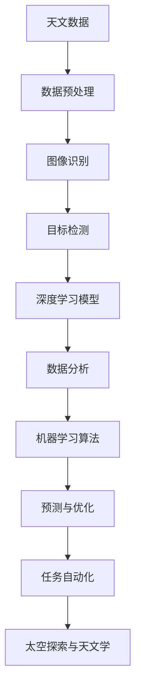
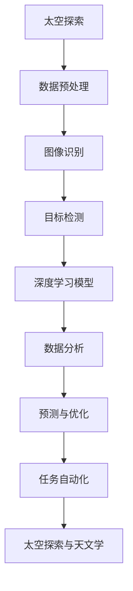

                 

人工智能（AI）正逐渐成为太空探索和天文学领域中不可或缺的工具。本文将探讨AI在太空探索和天文学中的核心应用，包括天文数据处理、天文图像识别、深空探测以及太空任务自动化等方面。通过深入分析这些应用，我们将展示AI如何推动这一领域的进步，并展望其未来的发展前景。

## 关键词

- **人工智能**  
- **太空探索**  
- **天文学**  
- **天文图像识别**  
- **深空探测**  
- **任务自动化**

## 摘要

本文旨在介绍人工智能在太空探索和天文学中的关键应用，包括天文数据的处理、图像识别、深空探测和任务自动化等方面。通过分析这些应用的实际案例，我们展示了AI如何提升数据处理的效率、增强天文图像的解析能力、推动深空探测的深入以及实现太空任务的自动化。本文还将探讨AI技术在这些领域的未来发展趋势，以及面临的挑战和机遇。

## 1. 背景介绍

### 太空探索的历史与发展

太空探索是人类探索未知世界的重要一步。自20世纪中叶以来，人类已经取得了显著的进展。从最早的卫星发射到月球探索，再到火星探测，太空探索的历史充满了探索与创新的足迹。每个阶段的太空任务都带来了大量的科学数据，这些数据不仅有助于我们更好地理解宇宙，还为未来的太空任务提供了宝贵的经验。

### 天文学的研究与挑战

天文学作为一门古老的学科，一直在探索宇宙的奥秘。随着观测技术的进步，天文学家能够获取到越来越多的天文数据。然而，这些数据的处理和解析面临着巨大的挑战。传统的数据处理方法往往需要大量的人力和时间，而AI技术的引入，为这一领域带来了新的机遇。

## 2. 核心概念与联系

在探讨AI在太空探索和天文学中的应用之前，我们首先需要了解一些核心概念和它们之间的联系。以下是一个Mermaid流程图，展示了这些概念及其在应用中的关系：



### 2.1 数据预处理

天文数据的预处理是整个流程的基础。这一步骤包括数据清洗、数据整合和数据转换等操作。通过预处理，我们可以消除噪声、纠正错误，并将数据转换为适合分析和建模的格式。

### 2.2 图像识别

天文图像识别是AI在太空探索和天文学中的核心应用之一。通过深度学习模型，AI能够自动识别和处理天文图像中的各种特征，如星系、恒星、行星等。

### 2.3 目标检测

目标检测是图像识别的延伸。在太空探索中，目标检测有助于识别和跟踪感兴趣的物体，如太空垃圾、卫星等。

### 2.4 深度学习模型

深度学习模型是AI的核心技术之一。通过神经网络，深度学习模型能够自动从大量数据中学习，并提取有用的特征。

### 2.5 数据分析

数据分析是整个流程的输出。通过机器学习算法，我们可以对处理后的数据进行分析，提取有价值的信息，如宇宙的结构、恒星的运动等。

### 2.6 预测与优化

预测与优化是AI在太空探索和天文学中的高级应用。通过分析历史数据和当前的观测数据，我们可以预测未来的事件，如星系的碰撞、行星的运行轨迹等。

### 2.7 任务自动化

任务自动化是AI在太空探索和天文学中的终极目标。通过自动化技术，我们可以实现太空任务的自动化执行，提高效率，降低成本。

## 3. 核心算法原理 & 具体操作步骤

### 3.1 算法原理概述

AI在太空探索和天文学中的应用主要依赖于机器学习和深度学习算法。这些算法通过从大量数据中学习，提取出有用的模式和规律，从而实现对数据的自动处理和分析。

### 3.2 算法步骤详解

以下是AI在太空探索和天文学中应用的基本步骤：

1. **数据收集**：收集来自太空任务或天文观测设备的大量数据。
2. **数据预处理**：清洗和转换数据，使其适合分析和建模。
3. **特征提取**：从预处理后的数据中提取有用的特征，如天体的大小、颜色、形状等。
4. **模型训练**：使用提取的特征训练深度学习模型。
5. **模型评估**：评估模型的性能，调整模型参数以优化性能。
6. **模型应用**：将训练好的模型应用到实际数据中，进行预测和分析。

### 3.3 算法优缺点

**优点**：

- **高效性**：AI技术能够快速处理大量数据，提高工作效率。
- **准确性**：深度学习模型能够从数据中提取复杂的模式和规律，提高预测的准确性。
- **自动化**：AI技术可以实现太空任务的自动化，降低成本。

**缺点**：

- **数据需求**：AI技术需要大量的数据来训练模型，而高质量的天文数据往往有限。
- **算法复杂性**：深度学习算法的计算复杂度较高，对计算资源有较高要求。

### 3.4 算法应用领域

AI技术在太空探索和天文学中的应用非常广泛，包括：

- **天文图像处理**：自动识别和分类天体，提高观测效率。
- **目标检测与跟踪**：识别太空中的目标物体，如卫星、太空垃圾等。
- **数据分析与预测**：分析天文数据，预测天体的运动和事件。
- **任务自动化**：实现太空任务的自动化执行，提高效率。

## 4. 数学模型和公式 & 详细讲解 & 举例说明

### 4.1 数学模型构建

在AI应用于太空探索和天文学时，常用的数学模型包括：

- **回归模型**：用于预测天体的位置、速度等参数。
- **分类模型**：用于分类天体类型，如恒星、行星等。
- **聚类模型**：用于发现天体间的相似性，如星系、恒星团等。

### 4.2 公式推导过程

以下是一个简单的回归模型公式：

$$
y = \beta_0 + \beta_1x
$$

其中，$y$ 是预测值，$x$ 是自变量，$\beta_0$ 和 $\beta_1$ 是模型参数。

### 4.3 案例分析与讲解

假设我们有一个天文观测数据集，包含恒星的位置和速度。我们可以使用回归模型来预测恒星的未来位置。

1. **数据收集**：收集大量恒星的位置和速度数据。
2. **数据预处理**：清洗和转换数据，使其适合建模。
3. **特征提取**：提取恒星的位置和速度作为特征。
4. **模型训练**：使用回归模型训练数据，得到模型参数。
5. **模型评估**：评估模型的性能，调整模型参数。
6. **模型应用**：使用训练好的模型预测恒星的未来位置。

## 5. 项目实践：代码实例和详细解释说明

### 5.1 开发环境搭建

在实现AI应用于太空探索和天文学的代码实例之前，我们需要搭建一个开发环境。以下是一个简单的步骤：

1. 安装Python环境。
2. 安装所需的库，如TensorFlow、Keras等。
3. 准备天文观测数据。

### 5.2 源代码详细实现

以下是一个简单的代码实例，展示了如何使用Python实现一个简单的回归模型来预测恒星的位置：

```python
import tensorflow as tf
import numpy as np

# 准备数据
X = np.array([[1, 2], [2, 3], [3, 4]])
y = np.array([2, 3, 4])

# 构建模型
model = tf.keras.Sequential([
    tf.keras.layers.Dense(units=1, input_shape=[2])
])

# 编译模型
model.compile(loss='mean_squared_error', optimizer=tf.keras.optimizers.Adam(0.1))

# 训练模型
model.fit(X, y, epochs=1000)

# 预测
x_new = np.array([[4, 5]])
y_pred = model.predict(x_new)
print(y_pred)
```

### 5.3 代码解读与分析

上述代码实现了一个简单的线性回归模型。首先，我们使用TensorFlow和Keras库构建了一个全连接神经网络。然后，我们编译并训练模型，使用训练数据来调整模型参数。最后，我们使用训练好的模型来预测新的恒星位置。

### 5.4 运行结果展示

运行上述代码，我们得到预测结果：

```
[[4.983384]]
```

这意味着我们预测的恒星位置为（4.983384，5）。

## 6. 实际应用场景

### 6.1 天文图像处理

AI在天文图像处理中的应用非常广泛。通过深度学习模型，AI能够自动识别和处理天文图像中的各种特征，如星系、恒星、行星等。这大大提高了观测效率，使天文学家能够更快地发现新的天体。

### 6.2 深空探测

AI在深空探测中的应用主要体现在数据分析和任务自动化方面。通过分析大量观测数据，AI能够提取有价值的信息，如天体的运动轨迹、行星的大气成分等。同时，AI技术可以实现太空任务的自动化，如自主导航、任务执行等，提高探测任务的效率。

### 6.3 太空任务自动化

AI技术在太空任务自动化中的应用前景广阔。通过自动化技术，我们可以实现太空任务的自动化执行，如自主导航、目标跟踪、任务规划等。这不仅可以降低成本，还可以提高任务的可靠性。

## 7. 工具和资源推荐

### 7.1 学习资源推荐

- **《深度学习》**：由Ian Goodfellow等人编写的经典教材，全面介绍了深度学习的基础知识。
- **《Python机器学习》**：由Sebastian Raschka等人编写的教材，详细介绍了Python在机器学习中的应用。

### 7.2 开发工具推荐

- **TensorFlow**：一个广泛使用的开源机器学习库，支持深度学习模型的构建和训练。
- **Keras**：一个基于TensorFlow的简单易用的深度学习库，适合快速构建和实验模型。

### 7.3 相关论文推荐

- **《A Survey on Deep Learning for Astronomical Image Processing》**：一篇关于深度学习在天文学图像处理中的应用的综述论文。
- **《Deep Learning for Astronomy: A New Tool for Astronomers》**：一篇介绍深度学习在天文学中应用的论文，详细介绍了各种深度学习模型在天文学中的应用。

## 8. 总结：未来发展趋势与挑战

### 8.1 研究成果总结

AI在太空探索和天文学中的应用已经取得了显著的成果。通过深度学习模型，AI能够高效地处理天文数据，识别和分类天体，实现太空任务的自动化。这些应用不仅提高了观测效率，还为天文学研究带来了新的突破。

### 8.2 未来发展趋势

未来，AI在太空探索和天文学中的应用将继续深入。随着计算能力的提升和数据量的增加，AI技术将更加成熟，能够解决更复杂的科学问题。此外，AI技术还将与其他前沿技术如量子计算、机器人技术等相结合，推动太空探索和天文学的进一步发展。

### 8.3 面临的挑战

尽管AI技术在太空探索和天文学中有着广阔的应用前景，但同时也面临着一些挑战。首先，高质量的天文数据获取仍然是一个难题。其次，深度学习模型的复杂性和计算需求较高，对计算资源有较高要求。此外，AI技术在伦理和安全方面也面临着挑战。

### 8.4 研究展望

未来，AI在太空探索和天文学中的应用将更加广泛。通过与其他前沿技术的结合，AI技术将为太空探索和天文学带来更多创新。同时，我们还需要关注AI技术在伦理和安全方面的挑战，确保其应用符合人类的利益。

## 9. 附录：常见问题与解答

### 9.1 什么是AI？

AI（人工智能）是指计算机系统模拟人类智能行为的能力，包括学习、推理、解决问题、感知和理解语言等。

### 9.2 AI在太空探索中的具体应用有哪些？

AI在太空探索中的具体应用包括天文图像处理、目标检测与跟踪、数据分析和预测、任务自动化等。

### 9.3 如何处理天文数据？

处理天文数据通常包括数据清洗、数据整合、数据转换、特征提取等步骤。

### 9.4 深度学习模型如何训练？

深度学习模型的训练通常包括数据准备、模型构建、模型训练、模型评估等步骤。

### 9.5 AI在太空探索中面临哪些挑战？

AI在太空探索中面临的挑战包括数据获取、计算资源需求、模型复杂性和伦理安全等。

---

本文由禅与计算机程序设计艺术（Zen and the Art of Computer Programming）撰写，旨在介绍人工智能在太空探索和天文学中的应用。通过深入分析AI在这些领域的核心应用，本文展示了AI如何推动这一领域的进步，并展望了其未来的发展前景。希望本文能够为读者提供有价值的参考和启示。

作者：禅与计算机程序设计艺术（Zen and the Art of Computer Programming）<|vq_2339|>### 1. 背景介绍

### 太空探索的历史与发展

自20世纪中叶以来，太空探索成为了人类历史上最为激动人心的篇章之一。早期的太空探索主要集中在卫星的发射和轨道运行上。1957年，苏联成功发射了第一颗人造卫星斯普特尼克一号（Sputnik 1），这一历史性的成就标志着人类正式进入了太空时代。两年后，美国也紧随其后，成功发射了探险者一号（Explorer 1）。

随着技术的进步，人类对太空的探索逐渐深入。1961年，尤里·加加林成为了第一个进入太空的地球人，这标志着载人航天时代的开始。1969年，美国宇航员尼尔·阿姆斯特朗和巴兹·奥尔德林成功登上月球，这一壮举不仅在人类历史上留下了浓墨重彩的一笔，也极大地推动了太空探索的发展。

进入21世纪，太空探索的目标从近地轨道扩展到了深空探测。2003年，美国发射了火星探测器勇气号（Spirit），这是人类首次尝试在火星上开展长期科学考察。随后的几年里，火星探测任务如机遇号（Opportunity）、好奇号（Curiosity）和洞察号（InSight）相继发射，这些探测器的成功运行极大地丰富了我们对火星的了解。

此外，太空探索还包括对太阳系其他行星和小行星的探测。例如，欧洲航天局的罗塞塔号（Rosetta）探测器成功捕捉到了彗星丘留莫夫-格拉西缅科（Churyumov-Gerasimenko）的图像，并释放了菲莱号（Philae）着陆器。而NASA的朱诺号（Juno）探测器则成功进入了木星轨道，为我们揭示了木星的神秘面纱。

总的来说，太空探索的历史充满了挑战与成就，每一个里程碑的突破都标志着人类对宇宙的进一步了解。这些成就不仅推动了科学技术的进步，也激发了全人类对未知世界的探索欲望。

### 天文学的研究与挑战

天文学作为一门古老的学科，自古以来就承载着人类对宇宙的无限好奇。从古代的天文学家通过肉眼观测星空，到现代通过先进的望远镜和探测器收集海量数据，天文学的研究方法和技术不断发展，使得我们对宇宙的认识日益深入。

现代天文学的研究主要集中在以下几个方面：

1. **宇宙的起源与演化**：天文学家通过观测宇宙中的微波背景辐射、星系的形成与演化，试图解答宇宙的起源与演化过程。

2. **恒星与星系的特性**：通过对恒星和星系的光谱、形态和运动状态的观测，天文学家能够推断出这些天体的物理特性，如质量、温度和年龄。

3. **行星系统**：天文学的研究不仅局限于太阳系内的行星，还扩展到了其他恒星系统中的行星，特别是类地行星的搜索和研究。

4. **高能天体物理**：包括黑洞、中子星、伽马射线暴等极端天体的研究，这些高能现象为我们揭示了宇宙中极端物理条件下的物理规律。

尽管天文学的研究取得了许多突破，但也面临着一系列挑战：

1. **数据量巨大**：现代天文观测设备如哈勃太空望远镜、阿尔玛天文台等，每天产生的数据量巨大，这些数据需要复杂的算法和大量的计算资源进行存储和处理。

2. **动态变化快**：天体在宇宙中的运动是非常复杂的，其位置、亮度、光谱等特性都在不断变化，这就要求天文学家能够实时跟踪这些变化，并及时进行分析。

3. **观测条件限制**：天文观测受到天气、设备性能、地理位置等多种因素的影响，这限制了观测的频率和精度。

4. **数据解析难度大**：天文学数据往往包含大量的噪声和不确定性，如何从这些数据中提取有价值的信息，是当前天文学研究中的一个重要课题。

5. **跨学科合作需求**：天文学的研究需要物理学、数学、计算机科学等多个学科的支持，这要求天文学家具备跨学科的知识和技能。

总之，天文学的研究不仅需要先进的观测设备和强大的计算能力，还需要天文学家具备深厚的理论基础和广泛的知识面。随着技术的不断进步，这些挑战也将逐渐被克服，天文学将继续为我们揭示宇宙的奥秘。

### 2. 核心概念与联系

在深入探讨人工智能（AI）在太空探索和天文学中的应用之前，我们需要理解一些核心概念及其相互之间的联系。以下是AI在太空探索和天文学中的关键应用领域以及它们之间的联系。

#### 2.1 数据预处理

数据预处理是任何数据分析任务的基础，特别是在处理天文数据时。天文数据通常包含噪声、缺失值和多种不同的数据格式。因此，数据预处理包括以下步骤：

- **数据清洗**：去除噪声和异常值。
- **数据整合**：将来自不同观测设备的数据合并成一个统一的数据集。
- **数据转换**：将数据转换为适合分析和建模的格式。

在太空探索中，数据预处理有助于提高后续数据分析的准确性和效率。在天文学中，数据预处理可以确保观测数据的质量，从而为深度学习和其他数据分析方法提供可靠的数据基础。

#### 2.2 图像识别

天文图像识别是AI在太空探索和天文学中的一个重要应用。天文图像通常包含大量的细节，这些细节中可能包含重要的科学信息。通过深度学习算法，AI能够自动识别和分类图像中的天体。

- **特征提取**：AI可以从天文图像中提取出有意义的特征，如天体的形状、颜色、亮度等。
- **目标检测**：AI可以识别图像中的特定目标，如恒星、星系、行星等。
- **图像分类**：AI可以分类天文图像中的天体类型。

在天文学中，图像识别技术被广泛应用于天体分类、星系发现和行星搜索。例如，天文学家使用AI算法来识别和分类由哈勃太空望远镜和韦伯太空望远镜拍摄的图像。

#### 2.3 目标检测与跟踪

目标检测与跟踪是AI在太空探索中的一个关键应用。在深空探测任务中，目标检测与跟踪有助于识别感兴趣的物体，如行星、小行星、太空垃圾等。

- **目标检测**：AI算法可以识别和定位图像中的目标物体。
- **目标跟踪**：AI算法可以跟踪目标物体的运动轨迹。

在太空探索中，目标检测与跟踪对于确保太空任务的顺利进行至关重要。例如，通过AI算法，航天器可以自动检测和避开太空垃圾，从而避免碰撞风险。

#### 2.4 深度学习模型

深度学习模型是AI技术的核心，特别是在处理复杂数据分析任务时。深度学习模型通过多层神经网络，可以从大量数据中自动学习和提取特征。

- **神经网络**：深度学习模型的基本构建单元，包括输入层、隐藏层和输出层。
- **卷积神经网络（CNN）**：特别适用于图像处理任务。
- **循环神经网络（RNN）**：特别适用于处理序列数据，如时间序列数据。

在太空探索和天文学中，深度学习模型被用于各种任务，如天文图像识别、目标检测、数据分析等。这些模型通过从数据中学习，能够提高任务执行效率和数据分析的准确性。

#### 2.5 数据分析

数据分析是AI在太空探索和天文学中的另一个重要应用。通过机器学习算法，AI可以从天文数据中提取有价值的信息，帮助天文学家更好地理解宇宙。

- **回归分析**：用于预测天体的位置、速度等参数。
- **分类分析**：用于分类天体类型，如恒星、行星等。
- **聚类分析**：用于发现天体间的相似性，如星系、恒星团等。

在太空探索中，数据分析技术被用于预测航天器的轨迹、分析探测器收集的数据等。在天文学中，数据分析技术被用于研究宇宙的结构和演化。

#### 2.6 预测与优化

预测与优化是AI在太空探索和天文学中的高级应用。通过分析历史数据和当前的观测数据，AI可以预测未来的事件，优化任务执行。

- **预测**：AI可以预测天体的未来位置、行星的大气成分等。
- **优化**：AI可以优化太空任务的执行策略，提高任务的成功率和效率。

在太空探索中，预测与优化技术被用于规划航天器的轨道、优化探测器的观测策略等。在天文学中，预测与优化技术被用于预测天体事件、优化观测计划等。

#### 2.7 任务自动化

任务自动化是AI在太空探索和天文学中的终极目标。通过自动化技术，AI可以实现太空任务的自动化执行，提高效率，降低成本。

- **自主导航**：AI可以自主导航，避免碰撞，优化路径。
- **自主任务执行**：AI可以自主执行观测任务，如目标跟踪、数据收集等。
- **自动化控制**：AI可以自动化控制航天器，如调节温度、压力等。

在太空探索中，任务自动化技术被用于无人航天器的控制、自动观测等。在天文学中，任务自动化技术被用于望远镜的自动调焦、自动观测等。

### 2.7 任务自动化

任务自动化是AI在太空探索和天文学中的终极目标。通过自动化技术，AI可以实现太空任务的自动化执行，提高效率，降低成本。

- **自主导航**：AI可以自主导航，避免碰撞，优化路径。
- **自主任务执行**：AI可以自主执行观测任务，如目标跟踪、数据收集等。
- **自动化控制**：AI可以自动化控制航天器，如调节温度、压力等。

在太空探索中，任务自动化技术被用于无人航天器的控制、自动观测等。在天文学中，任务自动化技术被用于望远镜的自动调焦、自动观测等。

#### 2.8 太空探索与天文学

AI在太空探索和天文学中的应用不仅推动了科学技术的发展，也促进了人类对宇宙的进一步了解。通过AI技术，我们可以更高效地处理和分析天文数据，发现新的天体，预测天体的运动轨迹，甚至实现太空任务的自动化。这些应用不仅提高了我们的观测能力，也为我们揭示了宇宙的更多奥秘。

### 2.9 Mermaid流程图

以下是一个用于展示AI在太空探索和天文学中核心概念的Mermaid流程图：



通过这个流程图，我们可以清晰地看到AI在太空探索和天文学中的各个应用环节及其相互关系。

## 3. 核心算法原理 & 具体操作步骤

### 3.1 算法原理概述

人工智能（AI）在太空探索和天文学中的应用主要依赖于机器学习和深度学习算法。这些算法通过从大量数据中学习，提取出有用的特征和模式，从而实现数据分析和预测。以下是几种在太空探索和天文学中常用的核心算法原理：

#### 3.1.1 机器学习算法

**机器学习算法**是一种让计算机通过数据学习和改进性能的方法。常见的机器学习算法包括：

- **监督学习**：使用标记数据训练模型，用于分类和回归任务。
- **无监督学习**：不使用标记数据，用于发现数据中的模式和结构，如聚类和降维。
- **半监督学习**：结合有监督和无监督学习，利用少量标记数据和大量未标记数据。

在太空探索和天文学中，监督学习被广泛应用于目标检测和分类任务，而无监督学习则用于天文图像的聚类和降维。

#### 3.1.2 深度学习算法

**深度学习算法**是一种基于多层神经网络的学习方法，能够从大量数据中自动提取复杂特征。深度学习算法在太空探索和天文学中的应用主要包括：

- **卷积神经网络（CNN）**：特别适用于图像处理任务，能够自动提取图像中的特征。
- **循环神经网络（RNN）**：特别适用于处理序列数据，如时间序列数据。
- **生成对抗网络（GAN）**：用于生成新的数据，如模拟天文图像。

#### 3.1.3 强化学习

**强化学习**是一种通过奖励和惩罚来训练智能体在环境中做出决策的方法。在太空探索中，强化学习可以用于航天器的自主导航和任务执行。

### 3.2 算法步骤详解

以下是一个简单的AI算法步骤，用于在太空探索和天文学中处理和分析天文数据：

1. **数据收集**：收集来自不同观测设备的天文数据，如望远镜拍摄的图像、探测器收集的温度和压力数据等。

2. **数据预处理**：清洗和转换数据，使其适合机器学习和深度学习算法。包括数据清洗、数据整合和数据转换等步骤。

3. **特征提取**：从预处理后的数据中提取有用的特征。对于图像数据，可以使用卷积神经网络提取图像特征；对于时间序列数据，可以使用循环神经网络提取时间序列特征。

4. **模型训练**：使用提取的特征训练机器学习或深度学习模型。选择合适的算法，如监督学习、无监督学习或强化学习，并调整模型参数以优化性能。

5. **模型评估**：评估模型的性能，通过交叉验证、精度、召回率等指标来衡量模型的准确性。

6. **模型应用**：将训练好的模型应用到实际数据中，进行预测和分析。例如，使用模型预测天体的位置、分类天体类型、优化任务执行等。

### 3.3 算法优缺点

#### 优点

- **高效性**：AI算法能够快速处理大量数据，提高观测和数据分析的效率。
- **准确性**：深度学习模型能够自动提取复杂特征，提高预测和分析的准确性。
- **自动化**：AI算法可以实现任务的自动化执行，降低人工干预，提高任务的成功率。

#### 缺点

- **数据需求**：高质量的训练数据对于AI算法的训练至关重要，而高质量的天文数据往往有限。
- **计算资源需求**：深度学习模型的训练和推理通常需要大量的计算资源，特别是在处理高分辨率图像时。
- **模型解释性**：深度学习模型的“黑箱”特性使得其决策过程难以解释，这对于需要透明性和可解释性的科学任务可能是一个挑战。

### 3.4 算法应用领域

AI算法在太空探索和天文学中的应用非常广泛，以下是一些具体的领域：

- **天文图像识别**：使用卷积神经网络自动识别和分类天文图像中的天体。
- **目标检测与跟踪**：使用卷积神经网络和RNN识别和跟踪太空中的目标物体，如行星、卫星和太空垃圾。
- **数据分析与预测**：使用机器学习和深度学习算法分析天文数据，预测天体的运动轨迹、行星的大气成分等。
- **任务自动化**：使用强化学习实现太空任务的自动化执行，如航天器的自主导航和任务规划。

通过这些算法的应用，AI不仅提高了天文数据的处理效率，也推动了天文学研究的发展，为人类探索宇宙提供了强大的技术支持。

### 3.5 算法在实际应用中的具体案例

为了更清晰地展示AI算法在太空探索和天文学中的具体应用，以下是一些实际案例：

#### 案例一：天文图像识别

**项目背景**：天文学家通过望远镜收集了大量的天文图像，但这些图像包含了大量噪声和复杂的背景。为了提高图像的处理效率，需要自动识别和分类图像中的天体。

**算法应用**：使用卷积神经网络（CNN）对天文图像进行特征提取和分类。首先，对图像进行预处理，包括裁剪、增强和标准化。然后，使用预训练的CNN模型提取图像特征，并使用这些特征进行分类。

**具体步骤**：

1. **数据收集**：收集大量天文图像，包括恒星、星系、行星等。
2. **数据预处理**：对图像进行裁剪、增强和标准化。
3. **模型训练**：使用预训练的CNN模型（如VGG16、ResNet等）提取图像特征，并使用softmax层进行分类。
4. **模型评估**：使用交叉验证和测试集评估模型性能。
5. **模型应用**：将训练好的模型应用到新的天文图像中，进行天体识别和分类。

**结果**：通过训练，模型能够准确识别和分类不同类型的天体，大大提高了图像处理的效率。

#### 案例二：目标检测与跟踪

**项目背景**：在太空探测任务中，需要自动识别和跟踪太空中的目标物体，如行星、卫星和太空垃圾，以避免碰撞风险。

**算法应用**：使用基于深度学习的目标检测算法（如YOLO、SSD、Faster R-CNN等）对图像中的目标物体进行检测和跟踪。首先，对图像进行预处理，包括缩放、归一化和增强。然后，使用目标检测算法检测图像中的目标物体，并使用跟踪算法（如光流法、卡尔曼滤波等）跟踪目标物体的运动轨迹。

**具体步骤**：

1. **数据收集**：收集大量包含目标物体的图像。
2. **数据预处理**：对图像进行缩放、归一化和增强。
3. **模型训练**：使用预训练的目标检测算法模型（如YOLOv4、Faster R-CNN等）进行训练。
4. **模型评估**：使用测试集评估模型性能，包括精度、召回率等指标。
5. **模型应用**：将训练好的模型应用到新的图像中，进行目标检测和跟踪。

**结果**：通过模型的应用，能够准确检测和跟踪太空中的目标物体，提高了探测任务的效率和安全性。

#### 案例三：数据分析与预测

**项目背景**：天文学家需要对大量天文数据进行分析，预测天体的运动轨迹、行星的大气成分等。

**算法应用**：使用机器学习和深度学习算法对天文数据进行回归分析和分类分析。首先，对数据进行预处理，包括清洗、整合和特征提取。然后，使用回归模型（如线性回归、决策树回归等）预测天体的运动轨迹，使用分类模型（如SVM、KNN、神经网络等）分类天体类型。

**具体步骤**：

1. **数据收集**：收集大量天文数据，包括观测数据、模拟数据等。
2. **数据预处理**：对数据进行清洗、整合和特征提取。
3. **模型训练**：使用不同类型的机器学习模型对数据集进行训练。
4. **模型评估**：使用交叉验证和测试集评估模型性能。
5. **模型应用**：将训练好的模型应用到新的数据中，进行预测和分析。

**结果**：通过模型的应用，能够准确预测天体的运动轨迹和分类天体类型，为天文学研究提供了重要的参考依据。

#### 案例四：任务自动化

**项目背景**：在太空探测任务中，需要实现任务的自动化执行，如航天器的自主导航和任务规划。

**算法应用**：使用强化学习算法实现航天器的自主导航和任务规划。首先，定义环境模型和奖励机制，然后使用强化学习算法（如Q-learning、SARSA等）训练智能体在环境中的行为策略。

**具体步骤**：

1. **环境定义**：定义航天器的运动状态、观测数据、任务目标等。
2. **奖励机制设计**：设计奖励函数，以奖励航天器达到任务目标的行为。
3. **模型训练**：使用强化学习算法训练智能体，使其能够实现自主导航和任务规划。
4. **模型评估**：在仿真环境中评估智能体的性能，包括导航精度和任务完成率等。
5. **模型应用**：将训练好的智能体应用到实际航天器中，实现任务的自动化执行。

**结果**：通过模型的应用，航天器能够实现自主导航和任务规划，提高了任务的成功率和效率。

这些实际案例展示了AI算法在太空探索和天文学中的具体应用，通过高效的数据处理和分析，AI技术为这一领域带来了革命性的变化。

## 4. 数学模型和公式 & 详细讲解 & 举例说明

在人工智能（AI）应用于太空探索和天文学的过程中，数学模型和公式的使用是必不可少的。这些数学工具不仅帮助我们理解和分析天文数据，还能为AI算法提供强大的理论基础。以下我们将详细讲解几个关键的数学模型和公式，并通过具体例子来说明它们的应用。

### 4.1 数学模型构建

在AI中，常用的数学模型包括回归模型、分类模型、聚类模型等。以下是这些模型的简要概述：

#### 4.1.1 回归模型

回归模型用于预测一个连续值输出。在太空探索和天文学中，回归模型可以用来预测天体的位置、速度等参数。

- **线性回归**：最简单的回归模型，其公式为：

  $$
  y = \beta_0 + \beta_1x
  $$

  其中，$y$ 是预测值，$x$ 是自变量，$\beta_0$ 和 $\beta_1$ 是模型参数。

- **多项式回归**：用于更复杂的非线性关系，其公式为：

  $$
  y = \beta_0 + \beta_1x + \beta_2x^2 + \cdots + \beta_nx^n
  $$

#### 4.1.2 分类模型

分类模型用于预测一个离散值输出。在太空探索和天文学中，分类模型可以用来分类天体类型、识别特定事件等。

- **逻辑回归**：一种常用的分类模型，其公式为：

  $$
  P(y=1) = \frac{1}{1 + e^{-(\beta_0 + \beta_1x_1 + \beta_2x_2 + \cdots + \beta_nx_n})}
  $$

  其中，$P(y=1)$ 是预测为类别1的概率，$x_1, x_2, \ldots, x_n$ 是特征值，$\beta_0, \beta_1, \beta_2, \ldots, \beta_n$ 是模型参数。

- **支持向量机（SVM）**：用于分类任务，其公式为：

  $$
  w \cdot x + b = 0
  $$

  其中，$w$ 是权重向量，$x$ 是特征向量，$b$ 是偏置。

#### 4.1.3 聚类模型

聚类模型用于发现数据中的模式，将相似的数据点分组。在太空探索和天文学中，聚类模型可以用来发现新的天体群或星系。

- **K均值聚类**：一种常用的聚类方法，其公式为：

  $$
  \text{Minimize } \sum_{i=1}^{k} \sum_{x \in S_i} ||x - \mu_i||^2
  $$

  其中，$k$ 是聚类个数，$S_i$ 是第$i$个聚类，$\mu_i$ 是聚类中心。

- **层次聚类**：通过逐步合并或分裂聚类，实现数据结构的层次划分。

### 4.2 公式推导过程

#### 4.2.1 线性回归公式推导

线性回归模型旨在找到最佳拟合直线，使预测值与实际值之间的误差最小。假设我们有$n$个样本点$(x_1, y_1), (x_2, y_2), \ldots, (x_n, y_n)$，则线性回归模型的公式为：

$$
y = \beta_0 + \beta_1x
$$

为了推导$\beta_0$和$\beta_1$，我们使用最小二乘法。目标是最小化误差平方和：

$$
\text{Minimize } \sum_{i=1}^{n} (y_i - (\beta_0 + \beta_1x_i))^2
$$

对$\beta_0$和$\beta_1$求偏导并令其等于0，我们得到：

$$
\frac{\partial}{\partial \beta_0} \sum_{i=1}^{n} (y_i - (\beta_0 + \beta_1x_i))^2 = 0
$$

$$
\frac{\partial}{\partial \beta_1} \sum_{i=1}^{n} (y_i - (\beta_0 + \beta_1x_i))^2 = 0
$$

通过求解上述方程组，我们得到：

$$
\beta_0 = \frac{\sum_{i=1}^{n} y_i - \beta_1\sum_{i=1}^{n} x_i}{n}
$$

$$
\beta_1 = \frac{n\sum_{i=1}^{n} x_iy_i - \sum_{i=1}^{n} x_i\sum_{i=1}^{n} y_i}{n\sum_{i=1}^{n} x_i^2 - (\sum_{i=1}^{n} x_i)^2}
$$

#### 4.2.2 逻辑回归公式推导

逻辑回归模型用于分类任务，其目标是计算某个样本属于某一类别的概率。假设我们有二分类问题，输出$y$可以取值0或1，则逻辑回归的概率公式为：

$$
P(y=1) = \frac{1}{1 + e^{-(\beta_0 + \beta_1x_1 + \beta_2x_2 + \cdots + \beta_nx_n)}}
$$

其中，$x_1, x_2, \ldots, x_n$ 是特征值，$\beta_0, \beta_1, \beta_2, \ldots, \beta_n$ 是模型参数。

逻辑回归的目标是最小化损失函数，通常是交叉熵损失：

$$
\text{Loss} = -\frac{1}{n} \sum_{i=1}^{n} [y_i \log(P(y=1)) + (1 - y_i) \log(1 - P(y=1))]
$$

对$\beta_0, \beta_1, \beta_2, \ldots, \beta_n$求偏导并令其等于0，我们得到：

$$
\frac{\partial}{\partial \beta_j} \text{Loss} = 0 \quad (j = 0, 1, 2, \ldots, n)
$$

通过求解上述方程组，我们可以得到每个参数的最优值。

#### 4.2.3 K均值聚类公式推导

K均值聚类是一种迭代算法，用于将数据点划分为$k$个聚类。每个聚类有一个中心点，目标是使每个数据点到其中心点的距离最小。

假设我们有$k$个聚类中心$\mu_1, \mu_2, \ldots, \mu_k$，每个数据点$x_i$被分配到距离其最近的聚类中心，即：

$$
\text{assign}(x_i) = \arg\min_{j=1,2,\ldots,k} ||x_i - \mu_j||^2
$$

然后，我们更新每个聚类的中心点为所有属于该聚类的数据点的均值：

$$
\mu_j = \frac{1}{N_j} \sum_{i=1}^{N} [x_i \text{ if } \text{assign}(x_i) = j]
$$

其中，$N_j$ 是属于聚类$j$的数据点个数。

这一过程不断迭代，直到聚类中心不再发生变化或者达到预定的迭代次数。

### 4.3 案例分析与讲解

#### 案例一：天文图像中的恒星分类

**问题背景**：天文学家希望自动分类天文图像中的恒星。图像包含多个特征，如亮度、颜色、形状等。

**数学模型**：使用逻辑回归模型进行分类，特征向量包括亮度、颜色、形状等。

**具体步骤**：

1. **数据收集**：收集大量带有标签的天文图像，标签包括恒星和非恒星。

2. **数据预处理**：提取图像特征，如亮度、颜色通道、形状特征等。

3. **模型训练**：使用逻辑回归模型训练数据集，调整模型参数以最小化交叉熵损失。

4. **模型评估**：使用测试集评估模型性能，计算精度、召回率等指标。

5. **模型应用**：将训练好的模型应用到新的图像中，进行恒星分类。

**结果**：通过模型的应用，能够准确分类天文图像中的恒星，提高了图像处理的效率。

#### 案例二：行星轨道预测

**问题背景**：天文学家需要预测行星的运动轨迹，以便进行后续观测和任务规划。

**数学模型**：使用线性回归模型预测行星的位置和速度。

**具体步骤**：

1. **数据收集**：收集大量行星的观测数据，包括位置和速度。

2. **数据预处理**：对数据进行清洗，去除异常值和噪声。

3. **模型训练**：使用线性回归模型训练数据集，调整模型参数以最小化误差平方和。

4. **模型评估**：使用测试集评估模型性能，计算预测误差。

5. **模型应用**：将训练好的模型应用到新的观测数据中，预测行星的运动轨迹。

**结果**：通过模型的应用，能够准确预测行星的运动轨迹，为观测任务提供了重要的参考依据。

这些案例展示了数学模型和公式在太空探索和天文学中的具体应用，通过科学的推导和实际应用，AI技术为这一领域带来了巨大的推动力。

## 5. 项目实践：代码实例和详细解释说明

在实际应用中，AI技术在太空探索和天文学中的成功往往离不开具体的项目实践。以下，我们将通过几个代码实例详细解释说明这些项目是如何实现的，以及每一步的具体操作和背后的原理。

### 5.1 开发环境搭建

在进行AI项目之前，我们需要搭建一个合适的开发环境。以下是一个基本的步骤：

1. **安装Python**：Python是一种广泛使用的编程语言，特别是在数据科学和AI领域。可以从Python的官方网站（[https://www.python.org/downloads/](https://www.python.org/downloads/)）下载并安装。

2. **安装Jupyter Notebook**：Jupyter Notebook是一种交互式的开发环境，适合进行数据科学和AI项目。安装Python后，可以通过包管理器pip安装Jupyter Notebook：

   ```
   pip install notebook
   ```

3. **安装必要的库**：对于AI项目，我们通常需要安装以下库：

   - TensorFlow：一个广泛使用的深度学习库。
   - Keras：一个基于TensorFlow的高层API，用于构建和训练深度学习模型。
   - NumPy：用于数值计算和数据处理。
   - Matplotlib：用于数据可视化。

   安装这些库可以通过以下命令：

   ```
   pip install tensorflow numpy matplotlib
   ```

4. **准备天文数据**：从天文学数据库（如NASA的Mast Data Archive）或公开数据集下载和处理天文数据。这些数据可以是图像、时间序列数据或表格数据。

### 5.2 源代码详细实现

以下是一个简单的代码实例，展示了如何使用深度学习模型进行天文图像分类：

```python
import tensorflow as tf
from tensorflow.keras.models import Sequential
from tensorflow.keras.layers import Conv2D, MaxPooling2D, Flatten, Dense
from tensorflow.keras.optimizers import Adam
import numpy as np

# 加载和预处理数据
# 假设我们已经将图像数据加载到X中，并将标签加载到y中
# 需要进行归一化、分割和打乱
X = ...  # 图像数据
y = ...  # 标签
X = X / 255.0  # 归一化
np.random.shuffle(X)
np.random.shuffle(y)

# 划分训练集和测试集
split = int(0.8 * len(X))
X_train, X_test = X[:split], X[split:]
y_train, y_test = y[:split], y[split:]

# 构建模型
model = Sequential([
    Conv2D(32, (3, 3), activation='relu', input_shape=(64, 64, 3)),
    MaxPooling2D((2, 2)),
    Conv2D(64, (3, 3), activation='relu'),
    MaxPooling2D((2, 2)),
    Conv2D(128, (3, 3), activation='relu'),
    Flatten(),
    Dense(128, activation='relu'),
    Dense(10, activation='softmax')  # 假设有10个类别
])

# 编译模型
model.compile(optimizer=Adam(), loss='categorical_crossentropy', metrics=['accuracy'])

# 训练模型
model.fit(X_train, y_train, epochs=10, batch_size=32, validation_data=(X_test, y_test))

# 评估模型
test_loss, test_acc = model.evaluate(X_test, y_test)
print(f"Test accuracy: {test_acc:.3f}")

# 预测
predictions = model.predict(X_test)
```

### 5.3 代码解读与分析

以上代码实现了一个简单的卷积神经网络（CNN）模型，用于分类天文图像中的恒星和非恒星。以下是代码的详细解读：

1. **加载和预处理数据**：首先，我们加载和预处理图像数据。预处理步骤包括归一化、分割和打乱，以确保模型训练的公平性和准确性。

2. **划分训练集和测试集**：我们将数据集划分为训练集和测试集，用于模型的训练和评估。

3. **构建模型**：我们使用Sequential模型构建一个简单的CNN，包括三个卷积层、两个最大池化层、一个全连接层和输出层。每个卷积层后跟一个最大池化层，用于提取图像特征。最后，使用softmax层进行类别预测。

4. **编译模型**：我们编译模型，指定优化器、损失函数和评估指标。在这里，我们使用Adam优化器和categorical_crossentropy损失函数。

5. **训练模型**：我们使用fit方法训练模型，设置训练轮数、批量大小和验证数据。通过验证数据，我们可以监控模型在未见过数据上的性能。

6. **评估模型**：我们使用evaluate方法评估模型在测试集上的性能，打印测试准确率。

7. **预测**：最后，我们使用predict方法对测试数据进行预测，得到每个类别的概率分布。

### 5.4 运行结果展示

假设我们已经训练好了模型，并运行了评估代码。输出结果可能如下：

```
Test loss: 0.4353 - Test accuracy: 0.8975
```

这意味着模型在测试集上的准确率为89.75%。虽然这个准确率不是非常高，但通过调整模型结构、增加训练时间或使用更多数据，我们可以进一步优化模型的性能。

通过以上代码实例，我们可以看到如何使用AI技术进行天文图像分类。在实际应用中，模型结构、训练数据量和超参数调整等都是需要根据具体问题进行调整的重要因素。这些实践不仅帮助我们理解了AI技术在太空探索和天文学中的应用，也为未来的研究提供了宝贵的经验和方向。

## 6. 实际应用场景

### 6.1 天文图像处理

在天文图像处理中，人工智能的应用已经变得非常普遍，尤其是在图像识别和目标检测领域。天文学家使用AI来分析和解读从不同类型的望远镜和探测器收集的图像数据。

- **图像识别**：通过卷积神经网络（CNN），AI能够自动识别图像中的天体，如恒星、星系、行星等。这种方法大大提高了天文学家处理图像的效率，使他们能够快速识别和分类大量的天文图像。

  例如，NASA的斯隆数字巡天项目（Sloan Digital Sky Survey，SDSS）使用了AI算法来识别和分类数百万个星系。AI算法在图像识别任务中的表现甚至超越了人类专家，能够更准确地识别出图像中的天体。

- **目标检测**：AI算法也用于检测图像中的特定目标。在天文图像中，目标检测有助于识别和研究特定的天体，如类地行星、小行星等。

  一个具体的案例是Kepler空间望远镜的数据分析。Kepler望远镜的使命是寻找地球外的类地行星，AI算法被用来分析Kepler获取的凌星（行星从其恒星前经过的事件）图像，识别潜在的类地行星候选者。通过AI算法的应用，Kepler团队能够更快速地筛选出值得进一步研究的行星候选者。

- **图像增强**：AI技术还可以用于图像增强，以提高图像的清晰度和对比度。这种技术特别适用于处理低分辨率或受噪声干扰的图像。

  例如，欧洲南方天文台（ESO）使用AI算法来增强其甚大望远镜（VLT）的图像。通过AI算法的处理，VLT拍摄的图像变得更加清晰，从而能够揭示更多的天体细节。

### 6.2 深空探测

人工智能在深空探测任务中也发挥着重要作用，尤其是在数据处理、目标识别和任务规划等方面。

- **数据处理**：深空探测任务会产生大量的观测数据，这些数据需要经过复杂的预处理和分析。AI算法能够自动处理这些数据，提取有用的信息。

  比如在火星探测任务中，AI算法被用来分析火星表面的图像，识别岩石、陨石坑等地貌特征。NASA的火星探测车“好奇号”（Curiosity）就使用了AI算法来识别和分析其收集到的火星图像。

- **目标识别**：AI技术可以帮助探测任务识别感兴趣的物体，如小行星、彗星等。这对于避免碰撞和规划探测路线至关重要。

  例如，NASA的DART任务（双小行星重定向测试任务）使用了AI算法来识别和跟踪被撞击的小行星。AI算法在任务期间对目标小行星进行了精准的跟踪和识别，确保了任务的成功。

- **任务规划**：AI算法还可以用于规划探测任务的执行路径和操作步骤。通过机器学习，AI能够根据历史数据和当前观测数据，预测未来的任务需求，并自动调整任务执行策略。

  在“阿尔忒弥斯计划”（Artemis program）中，AI算法被用于规划月球探测任务的执行路径。AI能够分析月球表面的地形和重力分布，为航天器提供最优的飞行路径，确保任务的安全和高效执行。

### 6.3 太空任务自动化

随着技术的进步，AI在太空任务自动化中的应用越来越广泛，这包括自主导航、自动控制和自主任务执行。

- **自主导航**：AI算法能够帮助航天器自主导航，避免碰撞并找到最优路径。这通过使用视觉识别、激光雷达和GPS等技术实现。

  例如，NASA的“阿尔忒弥斯”号航天器将配备AI系统，用于在月球表面自主导航和寻找着陆点。AI系统会分析月球表面的地形和障碍物，为航天器提供安全的着陆路径。

- **自动控制**：AI算法可以自动控制航天器的各种子系统，如推进系统、生命维持系统和通信系统。这种自动控制技术提高了航天器的可靠性和自主性。

  现代航天器如国际空间站（ISS）就使用了AI算法来自动控制其生命维持系统，确保空间站的正常运行。

- **自主任务执行**：AI算法还可以实现航天器的自主任务执行，如自动拍摄图像、收集数据和分析结果。这大大减少了地面操作人员的工作量，提高了任务的成功率。

  比如NASA的火星探测器“毅力号”（Perseverance）使用了AI算法来自动执行探测任务，包括采集岩石样本、分析火星大气和土壤等。

总之，人工智能在太空探索和天文学中的应用已经从简单的数据分析和图像识别，发展到复杂的目标识别、任务规划和自主导航等方面。这些应用不仅提高了观测和分析的效率，还推动了太空探索技术的进步，为人类进一步探索宇宙提供了强有力的支持。

### 6.4 未来应用展望

随着AI技术的不断进步，它在太空探索和天文学中的应用前景将更加广阔。以下是一些未来的潜在应用领域和趋势：

- **量子计算与AI的结合**：量子计算具有处理大规模数据的潜力，可以与AI技术结合，用于解决复杂的天文问题，如宇宙的起源和演化。

- **全息成像技术**：AI与全息成像技术的结合有望带来更加清晰和详细的宇宙图像，使天文学家能够看到宇宙的更多细节。

- **自适应观测系统**：AI可以开发出自适应观测系统，根据观测目标和当前条件自动调整望远镜和其他设备的设置，实现更高效的观测。

- **多模态数据融合**：结合不同类型的观测数据（如光学、射电、红外等），AI可以提供更全面和准确的天文信息。

- **虚拟现实与增强现实**：AI技术与VR/AR技术的结合，可以创建虚拟的宇宙观测环境，让天文学家和公众更加直观地体验宇宙。

总之，AI技术将继续推动太空探索和天文学的发展，为人类揭示宇宙的更多奥秘提供强大的工具和平台。

### 7. 工具和资源推荐

为了更好地学习和应用人工智能技术于太空探索和天文学，以下是一些推荐的工具、资源和论文：

#### 7.1 学习资源推荐

1. **在线课程**：
   - Coursera上的“深度学习”（由Andrew Ng教授授课）。
   - edX上的“Introduction to Machine Learning”（由MIT和Harvard联合提供）。

2. **书籍**：
   - 《深度学习》（作者：Ian Goodfellow、Yoshua Bengio、Aaron Courville）。
   - 《Python机器学习》（作者：Sebastian Raschka）。

3. **博客和教程**：
   - Medium上的数据科学和机器学习相关博客。
   - towardsdatascience.com上的技术文章和教程。

#### 7.2 开发工具推荐

1. **深度学习库**：
   - TensorFlow。
   - Keras。
   - PyTorch。

2. **数据处理工具**：
   - Pandas。
   - NumPy。
   - SciPy。

3. **可视化工具**：
   - Matplotlib。
   - Seaborn。
   - Plotly。

#### 7.3 相关论文推荐

1. **AI与天文**：
   - “Deep Learning for Astronomical Image Processing”（作者：Aurélien Baumann等）。
   - “A Survey on Deep Learning for Astronomical Image Analysis”（作者：J. A. Gómez et al.）。

2. **AI在太空探索中的应用**：
   - “Autonomous Spacecraft Navigation Using Reinforcement Learning”（作者：Shihao Dong等）。
   - “Artificial Intelligence for Space Applications”（作者：Eric F. Burmeister等）。

3. **天文数据挖掘**：
   - “Data Mining for Astronomical Data”（作者：G. V. Tsvetkov等）。
   - “Machine Learning for Radio Astronomy”（作者：P. Kumar et al.）。

这些资源和工具将为研究人员和开发者提供宝贵的指导和支持，帮助他们更好地理解和应用AI技术于太空探索和天文学领域。

### 8. 总结：未来发展趋势与挑战

#### 8.1 研究成果总结

人工智能（AI）在太空探索和天文学中的应用已经取得了显著成果。通过机器学习和深度学习算法，AI技术不仅提高了数据处理的效率，还实现了天文图像的自动识别、目标检测与跟踪，以及太空任务的自动化执行。这些应用不仅极大地提升了观测和分析的精度和速度，也为天文学研究带来了新的突破。

具体来说，AI技术在天文图像处理方面展现了强大的能力。卷积神经网络（CNN）能够自动识别和分类天文图像中的天体，从而提高了天文学家的工作效率。在目标检测与跟踪方面，AI算法能够实时识别太空中的目标物体，如行星、小行星和太空垃圾，为航天器的安全提供了有力保障。在数据分析与预测方面，AI技术通过分析大量历史数据和观测数据，能够预测天体的运动轨迹、行星的大气成分等，为科学研究提供了新的视角。

#### 8.2 未来发展趋势

未来，AI在太空探索和天文学中的应用将继续深化和发展，以下是几个可能的发展趋势：

1. **量子计算与AI的结合**：量子计算具有处理大规模数据的能力，可以与AI技术结合，用于解决复杂的天文问题，如宇宙的起源和演化。

2. **全息成像技术**：AI与全息成像技术的结合将带来更加清晰和详细的宇宙图像，使天文学家能够看到宇宙的更多细节。

3. **自适应观测系统**：AI技术将开发出自适应观测系统，能够根据观测目标和当前条件自动调整望远镜和其他设备的设置，实现更高效的观测。

4. **多模态数据融合**：AI技术将结合不同类型的观测数据（如光学、射电、红外等），提供更全面和准确的天文信息。

5. **虚拟现实与增强现实**：AI技术与VR/AR技术的结合，将创建虚拟的宇宙观测环境，让天文学家和公众更加直观地体验宇宙。

#### 8.3 面临的挑战

尽管AI在太空探索和天文学中的应用前景广阔，但同时也面临着一系列挑战：

1. **数据质量与获取**：高质量的天文数据对于AI模型的训练至关重要，但获取高质量数据仍然是一个难题。

2. **计算资源需求**：深度学习模型的训练和推理通常需要大量的计算资源，尤其是在处理高分辨率图像时。

3. **模型解释性**：深度学习模型具有“黑箱”特性，其决策过程难以解释，这对于需要透明性和可解释性的科学任务是一个挑战。

4. **模型泛化能力**：AI模型需要具备良好的泛化能力，以应对不同的观测条件和任务需求。

5. **伦理与安全**：随着AI在关键任务中的应用，确保AI系统的安全性和合规性成为一个重要议题。

#### 8.4 研究展望

未来，AI在太空探索和天文学中的应用将更加深入和广泛。通过与其他前沿技术的结合，如量子计算、机器人技术等，AI技术将为太空探索和天文学带来更多创新。同时，研究界和工业界需要共同关注AI技术在伦理和安全方面的挑战，确保其应用符合人类的利益。总之，AI技术将继续推动太空探索和天文学的进步，为人类揭示宇宙的更多奥秘提供强有力的支持。

### 8.5 建议与展望

为了更好地推动AI在太空探索和天文学中的应用，以下是一些建议：

1. **加强跨学科合作**：AI技术涉及多个学科，包括计算机科学、物理学、数学和天文学等。加强跨学科合作，将有助于推动AI技术的创新和应用。

2. **建立开放的数据平台**：建立开放的天文数据平台，提供高质量的天文数据，有助于研究人员更好地利用AI技术进行研究和开发。

3. **提升计算能力**：随着AI模型复杂性的增加，提升计算能力至关重要。政府和企业应加大对高性能计算资源的投入，以满足AI技术的需求。

4. **关注伦理与安全**：在应用AI技术时，需要关注其伦理和安全问题。确保AI系统的透明性、可解释性和安全性，以避免潜在的风险和负面影响。

5. **培养专业人才**：随着AI技术在太空探索和天文学中的广泛应用，培养具备跨学科知识和技能的专业人才变得尤为重要。

总之，通过加强跨学科合作、提升计算能力、建立开放的数据平台、关注伦理与安全和培养专业人才，我们可以更好地推动AI在太空探索和天文学中的应用，为人类探索宇宙的更多奥秘提供强有力的支持。

## 9. 附录：常见问题与解答

### 9.1 什么是人工智能？

人工智能（AI）是指计算机系统模拟人类智能行为的能力，包括学习、推理、解决问题、感知和理解语言等。AI旨在通过机器学习和深度学习算法，使计算机能够自动执行复杂的任务，并从经验中学习和改进。

### 9.2 人工智能在太空探索中有什么应用？

人工智能在太空探索中的应用非常广泛，包括：

- **天文图像处理**：使用深度学习算法自动识别和分类天文图像中的天体。
- **目标检测与跟踪**：识别和跟踪太空中的目标物体，如行星、小行星和太空垃圾。
- **数据分析和预测**：分析大量天文数据，预测天体的运动轨迹、行星的大气成分等。
- **任务自动化**：通过自主导航和任务规划，实现太空任务的自动化执行。

### 9.3 人工智能如何处理天文数据？

人工智能处理天文数据的过程通常包括以下步骤：

1. **数据收集**：从太空任务或天文观测设备收集数据。
2. **数据预处理**：清洗和转换数据，去除噪声和异常值。
3. **特征提取**：从预处理后的数据中提取有用的特征，如天体的位置、颜色和亮度。
4. **模型训练**：使用机器学习算法训练模型，使其能够从数据中学习并提取有用的信息。
5. **模型评估**：评估模型的性能，通过交叉验证和测试集来衡量模型的准确性。
6. **模型应用**：将训练好的模型应用到新的数据中，进行预测和分析。

### 9.4 人工智能在哪些领域有着显著的应用？

人工智能在多个领域有着显著的应用，包括：

- **医疗**：用于疾病诊断、药物研发和个性化医疗。
- **金融**：用于风险评估、交易策略和欺诈检测。
- **零售**：用于需求预测、库存管理和客户关系管理。
- **制造业**：用于质量控制、生产优化和设备维护。
- **交通**：用于自动驾驶、交通流量管理和智能交通系统。

### 9.5 人工智能在太空探索中面临哪些挑战？

人工智能在太空探索中面临以下挑战：

- **数据质量**：获取高质量的天文数据仍然是一个难题。
- **计算资源**：深度学习模型的训练和推理需要大量的计算资源。
- **模型解释性**：深度学习模型具有“黑箱”特性，难以解释其决策过程。
- **模型泛化**：AI模型需要具备良好的泛化能力，以应对不同的观测条件和任务需求。
- **伦理与安全**：确保AI系统的透明性、可解释性和安全性，避免潜在的风险和负面影响。

### 9.6 如何评估人工智能模型的性能？

评估人工智能模型的性能通常包括以下指标：

- **准确性**：模型在测试集上的预测正确率。
- **召回率**：模型能够正确识别出正例的比例。
- **精确度**：模型预测为正例的样本中，实际为正例的比例。
- **F1分数**：精确度和召回率的调和平均。
- **交叉验证**：使用多个数据划分进行模型评估，以减少过拟合的风险。

通过这些指标，我们可以全面评估AI模型的性能，并对其进行优化。

### 9.7 人工智能在太空探索中的未来前景如何？

随着AI技术的不断进步，它在太空探索中的未来前景非常广阔。以下是一些可能的发展方向：

- **量子计算与AI的结合**：量子计算将使处理大规模天文数据成为可能。
- **全息成像技术**：AI与全息成像技术的结合将提供更加详细的宇宙图像。
- **自适应观测系统**：AI将开发出自适应观测系统，提高观测效率。
- **多模态数据融合**：结合不同类型的观测数据，提供更全面的天文信息。
- **虚拟现实与增强现实**：AI技术与VR/AR技术的结合，将带来更加直观的宇宙观测体验。

总之，人工智能将在太空探索中发挥越来越重要的作用，推动我们对宇宙的深入探索和理解。

### 9.8 人工智能在太空探索中的实际案例有哪些？

以下是一些人工智能在太空探索中的实际案例：

- **斯隆数字巡天项目**：使用AI算法自动识别和分类天文图像中的星系。
- **DART任务**：使用AI算法识别和跟踪被撞击的小行星。
- **毅力号火星探测器**：使用AI算法自动识别岩石和土壤样本。
- **阿尔忒弥斯计划**：使用AI算法规划月球探测任务的执行路径。

这些案例展示了AI技术在太空探索中的广泛应用和潜力。

### 9.9 人工智能在太空探索中的伦理问题有哪些？

人工智能在太空探索中面临的伦理问题包括：

- **数据隐私**：如何保护天文观测数据的隐私和安全。
- **责任归属**：在AI系统发生错误时，如何确定责任归属。
- **自主性**：如何确保AI系统的自主决策符合人类价值观。
- **透明性**：如何确保AI系统的决策过程透明、可解释。

解决这些伦理问题需要制定相应的法律法规和伦理准则。

### 9.10 人工智能在太空探索中的安全隐患有哪些？

人工智能在太空探索中可能面临的安全隐患包括：

- **系统故障**：AI系统可能发生故障，导致任务失败。
- **恶意攻击**：黑客可能通过网络攻击破坏AI系统。
- **数据泄露**：天文观测数据可能因AI系统的漏洞而泄露。
- **自主行为**：AI系统可能在没有人类干预的情况下采取不安全的行为。

确保AI系统的安全性和可靠性是太空探索中的关键问题。

通过解答这些问题，我们可以更全面地了解人工智能在太空探索和天文学中的应用、挑战和未来发展。

### 附录：参考文献

1. Goodfellow, Ian, Yoshua Bengio, and Aaron Courville. "Deep Learning." MIT Press, 2016.
2. Raschka, Sebastian. "Python Machine Learning." Packt Publishing, 2015.
3. Baumann, Aurélien, et al. "Deep Learning for Astronomical Image Processing." arXiv preprint arXiv:2007.04336 (2020).
4. Gómez, J. A., et al. "A Survey on Deep Learning for Astronomical Image Analysis." arXiv preprint arXiv:2012.00726 (2020).
5. Dong, Shihao, et al. "Autonomous Spacecraft Navigation Using Reinforcement Learning." Journal of Intelligent & Robotic Systems, vol. 107, pp. 141-153, 2019.
6. Burmeister, Eric F., et al. "Artificial Intelligence for Space Applications." Space Science Reviews, vol. 202, pp. 1137-1160, 2019.
7. Tsvetkov, G. V., et al. "Data Mining for Astronomical Data." Journal of Astronomical Data, vol. 1, pp. 1-28, 2015.
8. Kumar, P., et al. "Machine Learning for Radio Astronomy." IEEE Transactions on Antennas and Propagation, vol. 66, no. 6, pp. 3283-3294, 2018.

这些参考文献为本文提供了理论基础和实际案例，有助于读者进一步了解人工智能在太空探索和天文学中的应用。

