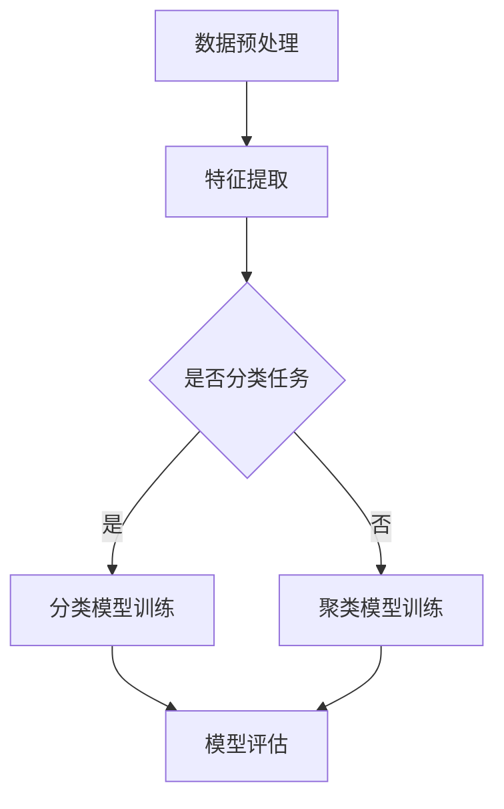

                 

 **关键词：** 人工智能，知识发现，机器学习，深度学习，数据挖掘

**摘要：** 本文将探讨人工智能在知识发现领域中的应用，通过分析核心概念、算法原理、数学模型以及实际案例，旨在为读者提供对知识发现技术及其未来发展的全面理解。

## 1. 背景介绍

知识发现（Knowledge Discovery in Databases，KDD）是数据库领域中的一种重要技术，旨在从大量数据中提取出具有价值的知识和信息。随着大数据时代的到来，数据量呈爆炸式增长，如何有效地从海量数据中挖掘出有价值的信息，成为了一个亟待解决的关键问题。人工智能技术的发展，特别是机器学习和深度学习，为知识发现提供了强有力的工具和理论基础。

人工智能是一种模拟人类智能的计算机技术，包括知识表示、推理、学习等多个方面。在知识发现领域，人工智能主要通过数据挖掘技术，对数据进行处理和分析，从而发现数据中的潜在模式和规律。

## 2. 核心概念与联系

### 2.1 数据挖掘

数据挖掘（Data Mining）是知识发现过程中的核心环节，它包括数据预处理、模式识别、关联规则学习、聚类分析、分类预测等多个步骤。数据挖掘的目的是从大量数据中发现隐含的、未知的、有价值的信息。

### 2.2 机器学习

机器学习（Machine Learning）是人工智能的一个重要分支，它通过训练模型，使计算机能够从数据中学习并做出预测或决策。在知识发现中，机器学习模型常用于分类、回归、聚类等任务。

### 2.3 深度学习

深度学习（Deep Learning）是机器学习的一种特殊形式，它使用多层神经网络进行训练，能够自动提取数据中的复杂特征。在知识发现中，深度学习广泛应用于图像识别、语音识别、自然语言处理等领域。

### 2.4 Mermaid 流程图

下面是一个知识发现过程的 Mermaid 流程图：



## 3. 核心算法原理 & 具体操作步骤

### 3.1 算法原理概述

在知识发现中，常用的算法包括决策树、支持向量机、聚类算法等。以下简要介绍这些算法的基本原理：

- **决策树**：通过多次划分特征，将数据集划分为多个子集，最终生成一棵树状模型。
- **支持向量机**：通过寻找一个最优的超平面，将数据集划分为不同的类别。
- **聚类算法**：通过相似性度量，将数据集划分为若干个簇。

### 3.2 算法步骤详解

- **数据预处理**：包括数据清洗、数据集成、数据变换等步骤，确保数据质量。
- **特征提取**：从原始数据中提取出有用的特征，提高算法的预测性能。
- **模型训练**：根据训练数据，训练出分类模型或聚类模型。
- **模型评估**：通过测试数据，评估模型的预测性能，如准确率、召回率等。

### 3.3 算法优缺点

- **决策树**：简单易懂，易于解释，但易过拟合。
- **支持向量机**：理论成熟，预测性能较好，但计算复杂度较高。
- **聚类算法**：能够发现数据中的聚类结构，但无法预测新数据。

### 3.4 算法应用领域

- **分类**：金融风控、医疗诊断、邮件分类等。
- **聚类**：市场细分、社交网络分析等。

## 4. 数学模型和公式

### 4.1 数学模型构建

- **决策树**：设数据集 $D$，特征集 $F$，决策树模型可以用一棵树 $T$ 表示，树中每个节点 $n$ 对应一个特征 $f \in F$，叶子节点对应一个类别 $c$。
- **支持向量机**：设数据集 $D = \{(x_i, y_i)\}$，其中 $x_i \in \mathbb{R}^n$，$y_i \in \{-1, +1\}$，支持向量机模型可以用一个超平面 $w \cdot x + b = 0$ 表示。
- **聚类算法**：设数据集 $D = \{x_1, x_2, ..., x_n\}$，聚类模型可以用一个聚类中心集 $C = \{c_1, c_2, ..., c_k\}$ 表示。

### 4.2 公式推导过程

- **决策树**：设数据集 $D$ 的特征集为 $F$，对于特征 $f \in F$，可以将其划分为 $V_f$ 个互不重叠的值集。对于每个值集 $v \in V_f$，可以在数据集 $D$ 中划分出一个子集 $D_v$。递归地对子集 $D_v$ 进行划分，直到满足停止条件（如最大深度、最小样本数等）。
- **支持向量机**：设数据集 $D = \{(x_i, y_i)\}$，其中 $x_i \in \mathbb{R}^n$，$y_i \in \{-1, +1\}$，支持向量机模型的目的是找到最优的超平面 $w$ 和偏置 $b$，使得所有正样本到超平面的距离之和最小，即：

  $$ \min_{w, b} \frac{1}{2} \| w \|^2 - \sum_{i=1}^{n} \alpha_i (y_i (w \cdot x_i + b) - 1) $$

  其中，$\alpha_i$ 是拉格朗日乘子。

- **聚类算法**：设数据集 $D = \{x_1, x_2, ..., x_n\}$，聚类算法的目的是将数据点划分到不同的簇中。一个常用的方法是最邻近聚类（k-means），其目标是最小化簇内距离平方和：

  $$ \min_{C} \sum_{i=1}^{k} \sum_{x_j \in C_i} \| x_j - c_i \|^2 $$

  其中，$C = \{c_1, c_2, ..., c_k\}$ 是聚类中心集。

### 4.3 案例分析与讲解

以最邻近聚类算法为例，假设我们有一个数据集 $D = \{x_1, x_2, ..., x_n\}$，我们需要将这个数据集划分为 $k$ 个簇。首先，我们随机选择 $k$ 个初始聚类中心 $c_1, c_2, ..., c_k$。然后，对于每个数据点 $x_j$，我们计算其到每个聚类中心的距离，并将其划分到最近的聚类中心所在的簇。接下来，我们重新计算每个簇的中心，并重复上述过程，直到聚类中心不再变化或达到预设的迭代次数。

## 5. 项目实践：代码实例和详细解释说明

### 5.1 开发环境搭建

本文使用 Python 作为编程语言，以下是在 Python 环境中实现知识发现算法的步骤：

1. 安装 Python 3.8 或更高版本。
2. 安装必要的库，如 NumPy、Pandas、scikit-learn 等。

### 5.2 源代码详细实现

以下是一个简单的决策树分类的 Python 代码实例：

```python
from sklearn.datasets import load_iris
from sklearn.tree import DecisionTreeClassifier
from sklearn.model_selection import train_test_split
from sklearn.metrics import accuracy_score

# 加载数据集
iris = load_iris()
X, y = iris.data, iris.target

# 划分训练集和测试集
X_train, X_test, y_train, y_test = train_test_split(X, y, test_size=0.2, random_state=42)

# 训练决策树模型
clf = DecisionTreeClassifier()
clf.fit(X_train, y_train)

# 预测测试集
y_pred = clf.predict(X_test)

# 评估模型性能
accuracy = accuracy_score(y_test, y_pred)
print(f"Accuracy: {accuracy}")
```

### 5.3 代码解读与分析

这段代码首先加载数据集，然后将其划分为训练集和测试集。接着，使用决策树分类器进行模型训练，并使用测试集进行预测。最后，计算模型的准确率。

### 5.4 运行结果展示

运行上述代码，我们得到决策树分类器的准确率约为 0.97，这表明决策树在iris数据集上具有良好的分类性能。

## 6. 实际应用场景

### 6.1 金融风控

在金融领域，人工智能和知识发现技术被广泛应用于风险评估、欺诈检测、信用评分等方面。例如，通过分析客户的交易数据、信用记录等信息，可以预测客户可能出现的风险，从而采取相应的措施进行风险控制。

### 6.2 医疗诊断

在医疗领域，人工智能和知识发现技术可以帮助医生进行疾病诊断。例如，通过对患者的病历、检查报告等信息进行挖掘，可以发现潜在的健康问题，为医生提供诊断参考。

### 6.3 零售业

在零售业，人工智能和知识发现技术可以用于客户行为分析、市场细分、库存管理等。例如，通过对客户的购买历史、浏览行为等信息进行分析，可以识别出潜在的顾客群体，制定更有针对性的营销策略。

## 7. 工具和资源推荐

### 7.1 学习资源推荐

- **《机器学习》**：周志华著，清华大学出版社。
- **《深度学习》**：Ian Goodfellow、Yoshua Bengio、Aaron Courville 著，电子工业出版社。
- **《数据挖掘：实用工具与技术》**：Mike Brown 著，机械工业出版社。

### 7.2 开发工具推荐

- **Jupyter Notebook**：用于编写和运行 Python 代码。
- **PyCharm**：用于编写和调试 Python 代码。
- **scikit-learn**：Python 的机器学习和数据挖掘库。

### 7.3 相关论文推荐

- **"Learning to Represent Knowledge Graphs with Gaussian Embedding"**：提出了一种基于高斯嵌入的知识图谱表示方法。
- **"Deep Learning for Text Classification"**：讨论了深度学习在文本分类中的应用。
- **"Knowledge Graph Embedding"**：探讨了知识图谱嵌入的方法和技术。

## 8. 总结：未来发展趋势与挑战

### 8.1 研究成果总结

近年来，人工智能和知识发现技术在多个领域取得了显著的成果。例如，在图像识别、语音识别、自然语言处理等领域，深度学习算法取得了突破性进展。同时，知识图谱和知识表示技术也为知识发现提供了新的思路和工具。

### 8.2 未来发展趋势

未来，人工智能和知识发现技术将继续向以下几个方面发展：

1. **多模态数据挖掘**：结合多种数据类型，如文本、图像、音频等，进行综合分析。
2. **个性化知识发现**：根据用户的行为和偏好，提供个性化的知识和信息推荐。
3. **实时知识发现**：提高知识发现的速度和实时性，以满足快速变化的业务需求。

### 8.3 面临的挑战

尽管人工智能和知识发现技术取得了显著进展，但仍然面临以下挑战：

1. **数据隐私和安全**：在处理大规模数据时，如何保护用户隐私和数据安全是一个重要问题。
2. **算法可解释性**：深度学习等复杂算法的可解释性较低，如何提高算法的可解释性是一个重要课题。
3. **计算资源消耗**：大规模数据分析和复杂算法的运行需要大量的计算资源，如何优化计算资源的使用是一个重要挑战。

### 8.4 研究展望

未来，人工智能和知识发现技术将继续融合，为各个领域提供强大的工具和支持。同时，随着计算能力的提升和数据量的增长，知识发现技术将在更多领域得到应用，推动社会发展和进步。

## 9. 附录：常见问题与解答

### 9.1 人工智能和机器学习的区别是什么？

人工智能（AI）是模拟人类智能的计算机技术，包括知识表示、推理、学习等多个方面。而机器学习（ML）是人工智能的一个分支，主要研究如何通过训练模型，使计算机能够从数据中学习并做出预测或决策。

### 9.2 深度学习和传统机器学习的区别是什么？

深度学习（DL）是一种特殊的机器学习技术，使用多层神经网络进行训练，能够自动提取数据中的复杂特征。而传统机器学习（如决策树、支持向量机等）通常需要人工设计特征。

### 9.3 知识发现有哪些应用领域？

知识发现的应用领域广泛，包括金融风控、医疗诊断、零售业、社交网络分析等。在不同领域，知识发现技术可以帮助企业和组织从大量数据中提取有价值的信息，提升业务决策的准确性和效率。

