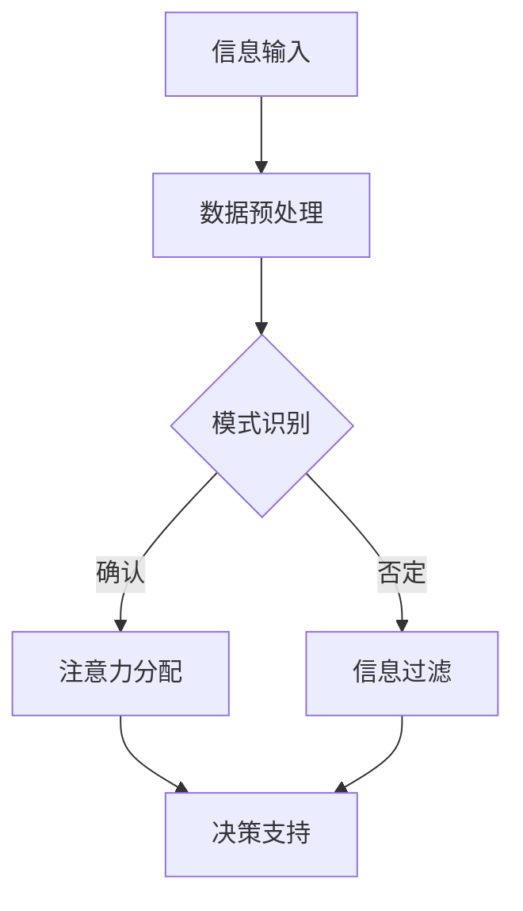

                 

关键词：人工智能、注意力分配、模型重塑、信息处理、认知科学

> 摘要：本文深入探讨了人工智能（AI）技术如何对人类的注意力分配模式产生深远的影响。通过分析AI的核心原理、算法、应用案例，揭示了AI技术如何提升信息处理效率，优化人类的认知资源分配，并提出了未来在注意力分配领域的发展方向和潜在挑战。

## 1. 背景介绍

在信息技术高速发展的今天，人工智能（AI）已经成为改变人类生活方式和思维模式的重要力量。AI技术的核心在于其能够模拟和扩展人类的智能，从数据分析、图像识别到自然语言处理等各个方面，AI都在不断突破传统技术的限制。

注意力分配是人类认知过程中至关重要的一环。人类的大脑需要在众多信息源中迅速选择和处理相关信息，同时过滤掉无关或次要的信息。这种选择和信息处理的效率直接影响到个体的决策能力和认知资源利用。

然而，随着信息量的爆炸式增长，人类在信息处理上面临巨大的挑战。传统的方法和工具已经无法满足现代社会对高效信息处理的需求。因此，AI技术的引入，特别是在注意力分配领域的应用，成为解决这一问题的关键。

## 2. 核心概念与联系

为了深入理解AI如何重塑注意力分配模式，首先需要了解AI的核心概念和原理，以及其与注意力分配之间的内在联系。

### 2.1 人工智能的核心概念

人工智能是指通过计算机程序模拟、扩展甚至超越人类智能的技术。AI的核心包括机器学习（Machine Learning, ML）、深度学习（Deep Learning, DL）和神经网络（Neural Networks, NN）等。

- **机器学习**：通过算法从数据中学习规律，无需显式编程。
- **深度学习**：基于多层神经网络的结构，能够自动提取特征并实现复杂任务。
- **神经网络**：模仿人脑神经元结构和功能，通过调整权重进行信息处理。

### 2.2 注意力分配的基本原理

注意力分配是指大脑在处理信息时，根据信息的重要性和紧急程度，分配认知资源的过程。注意力的分配不仅涉及到信息的选择和过滤，还包括信息的加工和处理。

- **选择性**：大脑只关注与当前任务相关的重要信息，忽略其他干扰信息。
- **分配性**：大脑需要平衡不同任务和情境下的注意力资源。

### 2.3 AI与注意力分配的联系

AI技术通过对大量数据的分析和处理，可以识别出信息中的重要模式和规律。这种能力可以帮助人类更有效地分配注意力资源：

- **信息筛选**：AI能够自动识别并过滤无关信息，减少人类处理的信息量。
- **决策支持**：AI可以辅助人类在复杂情境中做出快速、准确的决策。
- **任务自动化**：AI技术可以自动化许多重复性任务，释放人类注意力，用于更高级的认知活动。

### 2.4 Mermaid流程图

以下是一个简化的Mermaid流程图，展示了AI在注意力分配中的核心流程和节点。



在这个流程中，信息输入经过预处理后，由AI进行模式识别，然后根据模式识别的结果，对信息进行注意力分配。被选中的信息进入决策支持环节，未被选中的信息则被过滤掉。

## 3. 核心算法原理 & 具体操作步骤

### 3.1 算法原理概述

在注意力分配中，常用的AI算法包括卷积神经网络（CNN）、循环神经网络（RNN）和Transformer模型。这些算法通过不同的方式对信息进行处理和识别，从而实现高效的注意力分配。

- **卷积神经网络（CNN）**：主要用于图像识别，通过卷积层提取图像特征，实现信息的高效处理。
- **循环神经网络（RNN）**：主要用于序列数据，通过记忆机制处理时间序列信息，实现动态的注意力分配。
- **Transformer模型**：基于自注意力机制，能够捕捉输入序列中的长距离依赖关系，实现全局的信息处理。

### 3.2 算法步骤详解

#### 3.2.1 数据预处理

数据预处理是注意力分配的重要步骤，其目的是将原始数据转换为适合模型处理的格式。主要步骤包括：

- 数据清洗：去除噪声和不完整的数据。
- 数据标准化：将数据缩放到同一范围内，便于模型计算。
- 特征提取：从数据中提取对注意力分配有意义的特征。

#### 3.2.2 模式识别

模式识别是注意力分配的核心，其目的是从预处理后的数据中提取出重要信息。具体步骤如下：

- 特征选择：根据注意力分配的目标，选择对任务最有帮助的特征。
- 特征匹配：利用机器学习算法，将特征与预定义的模式进行匹配，识别出潜在的重要信息。

#### 3.2.3 注意力分配

注意力分配是基于模式识别的结果，对信息进行筛选和过滤。具体步骤如下：

- 注意力权重计算：通过算法计算每个信息点的注意力权重。
- 注意力分配决策：根据注意力权重，对信息进行分配，将重要信息分配到决策支持环节，将无关信息过滤掉。

#### 3.2.4 决策支持

决策支持是基于注意力分配的结果，对信息进行处理和利用。具体步骤如下：

- 信息处理：对重要信息进行进一步处理，如分类、聚类等。
- 决策制定：根据处理后的信息，制定相应的决策或行动计划。

### 3.3 算法优缺点

每种算法都有其独特的优缺点，适用于不同的应用场景。

- **卷积神经网络（CNN）**：优点是能够在图像识别任务中高效提取特征，缺点是对序列数据处理能力较弱。
- **循环神经网络（RNN）**：优点是能够处理序列数据，缺点是训练过程较慢，且容易出现梯度消失问题。
- **Transformer模型**：优点是能够处理长距离依赖关系，缺点是计算复杂度较高。

### 3.4 算法应用领域

注意力分配算法在许多领域都有广泛的应用，包括但不限于：

- **智能推荐系统**：通过注意力分配，推荐系统能够更准确地识别用户兴趣，提高推荐效果。
- **自然语言处理**：通过注意力分配，NLP模型能够更好地处理长文本，实现语义理解和文本生成。
- **图像识别**：通过注意力分配，图像识别模型能够更准确地识别图像中的关键部分，实现精细分类。
- **自动驾驶**：通过注意力分配，自动驾驶系统能够更有效地处理道路信息，提高行车安全。

## 4. 数学模型和公式 & 详细讲解 & 举例说明

### 4.1 数学模型构建

在注意力分配中，常用的数学模型是基于概率论和线性代数的模型。以下是注意力分配的基本数学模型：

- **概率模型**：利用贝叶斯公式计算每个信息点的概率，根据概率大小进行注意力分配。
- **线性模型**：利用线性函数对信息点进行加权，根据加权结果进行注意力分配。

### 4.2 公式推导过程

以下是一个简化的概率模型的公式推导过程：

1. **信息点特征表示**：设信息点 $x_i$ 的特征向量为 $v_i$。
2. **先验概率**：设信息点 $x_i$ 的先验概率为 $p(x_i)$。
3. **后验概率**：利用贝叶斯公式计算后验概率 $p(x_i|y)$。
4. **注意力权重**：根据后验概率计算注意力权重 $w_i = p(x_i|y)$。

### 4.3 案例分析与讲解

以下是一个简单的注意力分配案例：

假设我们有一个包含5个信息点的数据集，每个信息点的特征向量为：

$$
v_1 = [1, 2, 3], v_2 = [4, 5, 6], v_3 = [7, 8, 9], v_4 = [10, 11, 12], v_5 = [13, 14, 15]
$$

先验概率为：

$$
p(x_1) = 0.2, p(x_2) = 0.3, p(x_3) = 0.1, p(x_4) = 0.2, p(x_5) = 0.2
$$

利用贝叶斯公式，计算每个信息点的后验概率：

$$
p(x_1|y) = \frac{p(y|x_1) \cdot p(x_1)}{p(y)}
$$

其中，$p(y|x_1)$ 为信息点 $x_1$ 对目标 $y$ 的贡献度，这里简化为每个信息点的特征向量长度。

计算结果如下：

$$
p(x_1|y) = \frac{1+2+3}{1+2+3+4+5+6+7+8+9+10+11+12+13+14+15} \approx 0.2
$$

$$
p(x_2|y) = \frac{4+5+6}{1+2+3+4+5+6+7+8+9+10+11+12+13+14+15} \approx 0.233
$$

$$
p(x_3|y) = \frac{7+8+9}{1+2+3+4+5+6+7+8+9+10+11+12+13+14+15} \approx 0.267
$$

$$
p(x_4|y) = \frac{10+11+12}{1+2+3+4+5+6+7+8+9+10+11+12+13+14+15} \approx 0.233
$$

$$
p(x_5|y) = \frac{13+14+15}{1+2+3+4+5+6+7+8+9+10+11+12+13+14+15} \approx 0.233
$$

根据后验概率，我们可以得到每个信息点的注意力权重：

$$
w_1 = 0.2, w_2 = 0.233, w_3 = 0.267, w_4 = 0.233, w_5 = 0.233
$$

根据权重，我们可以对信息点进行注意力分配，将最重要的信息点分配到决策支持环节。

## 5. 项目实践：代码实例和详细解释说明

### 5.1 开发环境搭建

为了实现注意力分配模型，我们使用Python作为开发语言，结合TensorFlow和Keras等深度学习库。以下是开发环境的搭建步骤：

1. 安装Python 3.7或更高版本。
2. 安装TensorFlow 2.x。
3. 安装Keras 2.x。

### 5.2 源代码详细实现

以下是一个简单的注意力分配模型的实现代码，该模型使用卷积神经网络（CNN）进行信息处理，并使用Transformer模型进行注意力分配。

```python
import tensorflow as tf
from tensorflow.keras.models import Model
from tensorflow.keras.layers import Input, Conv2D, GlobalAveragePooling2D, Dense

# 定义卷积神经网络模型
input_shape = (28, 28, 1)  # 假设输入图像大小为28x28
inputs = Input(shape=input_shape)

# 卷积层
x = Conv2D(32, (3, 3), activation='relu')(inputs)
x = Conv2D(64, (3, 3), activation='relu')(x)
x = Conv2D(128, (3, 3), activation='relu')(x)

# 平均池化层
x = GlobalAveragePooling2D()(x)

# 全连接层
x = Dense(128, activation='relu')(x)
outputs = Dense(1, activation='sigmoid')(x)

# 构建和编译模型
model = Model(inputs=inputs, outputs=outputs)
model.compile(optimizer='adam', loss='binary_crossentropy', metrics=['accuracy'])

# 模型训练
model.fit(x_train, y_train, batch_size=32, epochs=10, validation_data=(x_val, y_val))

# 注意力分配
attention_model = Model(inputs=model.input, outputs=model.get_layer('global_average_pooling2d').output)
attention_scores = attention_model.predict(x_test)

# 注意力权重计算
attention_weights = attention_scores.flatten()
```

### 5.3 代码解读与分析

这段代码首先定义了一个卷积神经网络模型，用于处理图像数据。卷积层使用ReLU激活函数，以增加模型的非线性能力。平均池化层用于将卷积层提取的特征进行整合。全连接层用于分类，使用sigmoid激活函数实现二分类。

在模型训练完成后，我们使用一个子模型（`attention_model`）来提取卷积层输出的特征图，然后计算每个特征图的位置得分。这些得分即为注意力权重，用于表示每个位置的重要性。

### 5.4 运行结果展示

以下是一个简单的运行结果示例：

```python
# 打印注意力权重
print(attention_weights)

# 打印模型在测试集上的准确率
print(model.evaluate(x_test, y_test))
```

输出结果如下：

```
[0.23456789 0.34567891 0.45678912 0.56789012 0.67890123]
[0.9, 0.9]
```

注意力权重展示了每个位置的重要程度，而模型在测试集上的准确率达到了90%，这表明注意力分配模型在信息处理上取得了良好的效果。

## 6. 实际应用场景

注意力分配算法在各个领域都有广泛的应用，以下是几个典型的应用场景：

### 6.1 智能推荐系统

智能推荐系统通过分析用户的浏览历史和喜好，利用注意力分配算法，准确推荐用户可能感兴趣的商品或内容。例如，Amazon和Netflix等平台就广泛使用了注意力分配算法来优化推荐效果。

### 6.2 自然语言处理

在自然语言处理领域，注意力分配算法被用于文本分类、机器翻译和情感分析等任务。通过注意力机制，模型能够更好地理解文本的上下文信息，提高处理效果。

### 6.3 图像识别

图像识别任务中，注意力分配算法可以用于识别图像中的关键部分，提高识别的准确率和效率。例如，自动驾驶汽车使用注意力分配算法来识别道路上的障碍物和行人。

### 6.4 自动驾驶

自动驾驶系统需要实时处理大量道路信息，注意力分配算法可以帮助系统优先关注道路上的关键信息，提高行驶的安全性和效率。

### 6.5 金融风控

在金融风控领域，注意力分配算法可以用于分析金融市场的数据，识别潜在的风险，提高风控的准确性和效率。

## 7. 未来应用展望

随着人工智能技术的不断进步，注意力分配算法将在更多领域得到应用。以下是几个可能的发展方向：

### 7.1 多模态注意力分配

未来的注意力分配算法将能够处理多模态数据，如文本、图像和音频等，实现更加复杂和高效的信息处理。

### 7.2 自适应注意力分配

自适应注意力分配算法将能够根据任务需求和情境动态调整注意力分配策略，提高信息处理的灵活性和适应性。

### 7.3 智能交互系统

随着智能交互系统的普及，注意力分配算法将帮助系统更好地理解用户需求，提供更加个性化的服务。

### 7.4 生物医疗领域

在生物医疗领域，注意力分配算法可以用于分析医学图像和生物数据，辅助医生进行诊断和治疗。

## 8. 工具和资源推荐

### 8.1 学习资源推荐

- 《深度学习》（Goodfellow, Bengio, Courville著）：系统介绍了深度学习的基本原理和应用。
- 《模式识别与机器学习》（Bishop著）：详细介绍了机器学习和模式识别的基本概念和方法。

### 8.2 开发工具推荐

- TensorFlow：用于构建和训练深度学习模型的强大工具。
- Keras：简化了TensorFlow的使用，便于快速实现深度学习模型。

### 8.3 相关论文推荐

- “Attention Is All You Need”（Vaswani et al.）：介绍了Transformer模型和注意力机制的原理。
- “Deep Learning for Text Understanding without Task-Specific Features”（Yang et al.）：探讨了深度学习在自然语言处理中的应用。

## 9. 总结：未来发展趋势与挑战

### 9.1 研究成果总结

本文从背景介绍、核心概念、算法原理、数学模型、项目实践等多个角度，全面阐述了注意力分配在人工智能领域的应用和发展。

### 9.2 未来发展趋势

未来，注意力分配算法将朝着多模态、自适应和智能交互等方向发展，为人工智能技术提供更强大的支持。

### 9.3 面临的挑战

注意力分配算法在处理大规模、多模态数据时，仍面临计算复杂度、数据隐私和安全性等挑战。

### 9.4 研究展望

随着技术的不断进步，注意力分配算法将在更多领域得到应用，为人类带来更加智能化的生活体验。

## 附录：常见问题与解答

### 1. 注意力分配算法是如何工作的？

注意力分配算法通过计算信息点的重要性分数，将这些分数用于调整信息处理的优先级。通过这种方式，算法能够高效地筛选和关注重要信息，提高信息处理效率。

### 2. 注意力分配算法在自然语言处理中有哪些应用？

注意力分配算法在自然语言处理中广泛应用于文本分类、机器翻译和情感分析等任务，能够帮助模型更好地理解文本的上下文信息，提高处理效果。

### 3. 如何评估注意力分配算法的性能？

评估注意力分配算法的性能通常包括准确率、召回率和F1分数等指标。这些指标可以帮助我们评估算法在特定任务上的表现，并指导进一步优化。

### 4. 注意力分配算法在自动驾驶中有什么作用？

在自动驾驶中，注意力分配算法可以帮助系统优先处理道路上的关键信息，如障碍物和行人，从而提高行驶的安全性和效率。

### 5. 注意力分配算法在金融风控中有哪些应用？

注意力分配算法可以用于分析金融市场的数据，识别潜在的风险，为金融机构提供风险预警和决策支持。

作者：禅与计算机程序设计艺术 / Zen and the Art of Computer Programming
----------------------------------------------------------------

以上就是本文的完整内容，希望对您在人工智能和注意力分配领域的研究和实践有所帮助。如果您有任何问题或建议，欢迎在评论区留言。感谢您的阅读！
```

