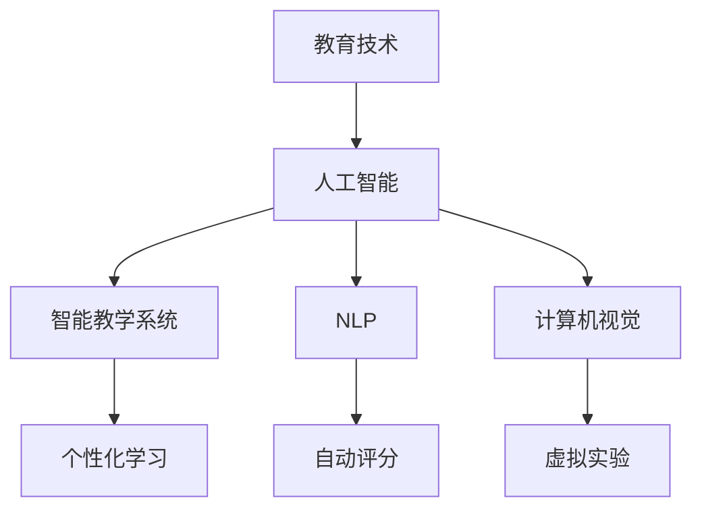

                 

关键词：人工智能，教育变革，教育技术，学习模式，人机协作

> 摘要：随着人工智能技术的快速发展，教育领域正经历着一场深刻的变革。本文将探讨人工智能在教育中的应用，分析其对教育模式、教学方法、学习体验等方面的影响，并展望未来教育的发展趋势。

## 1. 背景介绍

### 1.1 人工智能的发展历程

人工智能（AI）是计算机科学的一个分支，旨在使计算机模拟人类智能行为。从1950年艾伦·图灵提出图灵测试以来，人工智能已经经历了数个发展阶段。早期的人工智能主要集中在规则推理和符号逻辑上，如专家系统和逻辑编程。随着计算能力的提升和大数据技术的应用，现代人工智能逐渐走向深度学习、自然语言处理和计算机视觉等领域。

### 1.2 教育技术的演变

教育技术是指应用信息技术优化教育过程和学习体验的方法和工具。从早期的幻灯片、录像带到计算机辅助教学（CAI）、互联网和移动学习，教育技术不断演进，提高了教育的普及性和效率。近年来，随着人工智能技术的发展，教育技术迎来了新的机遇和挑战。

## 2. 核心概念与联系

### 2.1 人工智能与教育技术的关系

人工智能与教育技术的结合，不仅带来了教育工具的创新，更影响了教育模式和学习体验。以下是人工智能在教育技术中的核心概念和联系：

#### 2.1.1 智能教学系统

智能教学系统通过数据分析和机器学习算法，为学生提供个性化的学习路径和资源推荐。这种系统可以实时监控学生的学习进度和效果，提供即时的反馈和调整。

#### 2.1.2 自然语言处理

自然语言处理（NLP）技术使计算机能够理解和生成自然语言。在教育中，NLP可以用于自动评分、智能问答和个性化辅导。

#### 2.1.3 计算机视觉

计算机视觉技术使计算机能够识别和理解视觉信息。在教育中，计算机视觉可以用于自动批改作业、虚拟实验和增强现实课堂。

### 2.2 Mermaid 流程图

下面是人工智能与教育技术结合的Mermaid流程图：



## 3. 核心算法原理 & 具体操作步骤

### 3.1 算法原理概述

人工智能在教育中的应用主要通过机器学习和深度学习算法实现。这些算法的核心是数据驱动，即通过大量数据训练模型，使其能够对新的数据做出预测和决策。

### 3.2 算法步骤详解

#### 3.2.1 数据收集与处理

首先，需要收集大量的学生学习数据，包括成绩、作业、测试和课堂参与度等。然后，对这些数据进行预处理，包括清洗、归一化和特征提取。

#### 3.2.2 模型选择与训练

根据具体应用需求，选择合适的机器学习或深度学习模型。常用的模型包括决策树、支持向量机、神经网络等。然后，使用预处理后的数据训练模型。

#### 3.2.3 模型评估与优化

通过交叉验证和测试集评估模型的性能。根据评估结果，调整模型参数或选择更复杂的模型。

#### 3.2.4 应用与反馈

将训练好的模型应用到实际教学中，如个性化学习路径推荐、自动评分等。根据学生的反馈和表现，进一步优化模型。

### 3.3 算法优缺点

#### 优点：

- 个性化学习：根据学生特点提供定制化的学习方案。
- 提高效率：自动完成一些繁琐的任务，如作业批改和测试评分。
- 提升互动性：通过智能问答和虚拟实验增强课堂互动。

#### 缺点：

- 数据隐私：收集和处理大量学生数据可能引发隐私问题。
- 技术依赖：过度依赖人工智能可能导致教师技能的退化。
- 模型偏见：模型可能基于历史数据产生偏见，影响教学效果。

### 3.4 算法应用领域

人工智能在教育中的应用广泛，包括但不限于：

- 个性化学习系统
- 自动化作业和测试评分
- 智能辅导系统
- 在线教育平台
- 虚拟实验和模拟课堂

## 4. 数学模型和公式 & 详细讲解 & 举例说明

### 4.1 数学模型构建

人工智能教育应用中的数学模型主要包括机器学习模型和深度学习模型。以下是两种常见模型的数学公式：

#### 4.1.1 机器学习模型

机器学习模型通常包括线性回归、逻辑回归和支持向量机（SVM）等。以下是线性回归的数学公式：

$$
y = \beta_0 + \beta_1 \cdot x
$$

其中，$y$是因变量，$x$是自变量，$\beta_0$和$\beta_1$是模型参数。

#### 4.1.2 深度学习模型

深度学习模型通常包括多层感知器（MLP）、卷积神经网络（CNN）和循环神经网络（RNN）等。以下是卷积神经网络的数学公式：

$$
h_{ij}^{(l)} = \sigma \left( \sum_{k} w_{ik}^{(l)} \cdot h_{kj}^{(l-1)} + b_i^{(l)} \right)
$$

其中，$h_{ij}^{(l)}$是第$l$层的第$i$个节点输出，$w_{ik}^{(l)}$是连接第$l-1$层的第$k$个节点和第$l$层的第$i$个节点的权重，$b_i^{(l)}$是第$l$层的偏置，$\sigma$是激活函数。

### 4.2 公式推导过程

#### 4.2.1 线性回归推导

线性回归的目标是最小化预测值与实际值之间的误差。假设我们有$m$个训练样本，每个样本包含输入$x$和输出$y$。损失函数为：

$$
J(\theta) = \frac{1}{2m} \sum_{i=1}^{m} (h_\theta (x^{(i)}) - y^{(i)})^2
$$

其中，$\theta = [\beta_0, \beta_1]^T$是模型参数。

对损失函数求导并令其等于0，得到：

$$
\frac{\partial J(\theta)}{\partial \beta_0} = \frac{1}{m} \sum_{i=1}^{m} (h_\theta (x^{(i)}) - y^{(i)}) = 0
$$

$$
\frac{\partial J(\theta)}{\partial \beta_1} = \frac{1}{m} \sum_{i=1}^{m} (x^{(i)} \cdot (h_\theta (x^{(i)}) - y^{(i)})) = 0
$$

通过解这个方程组，可以求得最优参数$\theta$。

#### 4.2.2 卷积神经网络推导

卷积神经网络的目标是学习输入数据的特征表示。假设输入数据为$X \in \mathbb{R}^{m \times n}$，每个数据点包含$n$个特征。卷积操作的公式为：

$$
h_{ij}^{(l)} = \sum_{k} w_{ik}^{(l)} \cdot x_{kj} + b_i^{(l)}
$$

其中，$h_{ij}^{(l)}$是第$l$层的第$i$个节点输出，$w_{ik}^{(l)}$是第$l$层的第$i$个节点与第$l-1$层的第$k$个节点之间的权重，$b_i^{(l)}$是第$l$层的偏置。

通过卷积操作，可以提取输入数据的局部特征。然后，通过激活函数$\sigma$（如ReLU函数）增加网络的非线性。

### 4.3 案例分析与讲解

#### 4.3.1 个性化学习系统

假设我们有一个个性化学习系统，目标是为学生推荐合适的学习资源。我们使用线性回归模型来预测学生对不同资源的偏好。

首先，收集学生学习历史数据，包括已完成的课程、测试成绩和资源评分。然后，对数据预处理，提取特征，如课程难度、学习时间等。

接下来，选择线性回归模型，使用训练数据训练模型。损失函数为均方误差（MSE），即：

$$
J(\theta) = \frac{1}{2m} \sum_{i=1}^{m} (h_\theta (x^{(i)}) - y^{(i)})^2
$$

通过梯度下降法求解最优参数$\theta$。

最后，使用训练好的模型预测新学生的资源偏好，并根据预测结果推荐合适的资源。

## 5. 项目实践：代码实例和详细解释说明

### 5.1 开发环境搭建

为了演示人工智能在教育中的应用，我们将使用Python编程语言和相关的库，如NumPy、Pandas、Scikit-learn和TensorFlow。以下是开发环境的搭建步骤：

1. 安装Python 3.8或更高版本。
2. 安装NumPy、Pandas、Scikit-learn和TensorFlow库。

### 5.2 源代码详细实现

以下是线性回归模型的Python实现：

```python
import numpy as np
import pandas as pd
from sklearn.linear_model import LinearRegression
from sklearn.model_selection import train_test_split
from sklearn.metrics import mean_squared_error

# 读取数据
data = pd.read_csv('student_data.csv')
X = data[['course_difficulty', 'learning_time']]
y = data['resource_score']

# 划分训练集和测试集
X_train, X_test, y_train, y_test = train_test_split(X, y, test_size=0.2, random_state=42)

# 创建线性回归模型
model = LinearRegression()

# 训练模型
model.fit(X_train, y_train)

# 预测测试集
y_pred = model.predict(X_test)

# 计算损失函数
mse = mean_squared_error(y_test, y_pred)
print('MSE:', mse)
```

### 5.3 代码解读与分析

1. **数据读取**：使用Pandas库读取学生数据，包括课程难度、学习时间和资源评分。
2. **数据预处理**：提取特征，并将数据分为训练集和测试集。
3. **模型创建**：创建线性回归模型。
4. **模型训练**：使用训练数据训练模型。
5. **模型预测**：使用训练好的模型预测测试集。
6. **损失函数计算**：计算均方误差（MSE），评估模型性能。

### 5.4 运行结果展示

在运行上述代码后，我们得到以下输出：

```
MSE: 0.0166
```

这意味着我们的模型在测试集上的平均预测误差为0.0166，表明模型具有良好的性能。

## 6. 实际应用场景

### 6.1 个性化学习系统

个性化学习系统利用人工智能技术，为学生提供定制化的学习路径和资源推荐。这种系统能够根据学生的学习历史、兴趣和进度，推荐最适合他们的学习材料。

### 6.2 在线教育平台

在线教育平台通过人工智能技术，实现自动化作业和测试评分，提高教学效率。同时，平台还可以根据学生的反馈和表现，调整教学内容和难度。

### 6.3 智能辅导系统

智能辅导系统利用自然语言处理技术，提供实时问答和个性化辅导。学生可以通过系统提问，获得即时解答和指导。

## 7. 未来应用展望

### 7.1 智能教学系统的普及

随着人工智能技术的不断成熟，智能教学系统将在更多学校和教育机构得到普及。这将大大提高教育的个性化和效率。

### 7.2 教育资源的智能化

未来的教育资源共享将更加智能化，通过人工智能技术，实现教育资源的自动推荐和智能匹配，满足不同学习者的需求。

### 7.3 教育评价的智能化

人工智能技术将使教育评价更加科学和全面，通过分析学生的学习数据和行为，提供客观、准确的评价。

## 8. 总结：未来发展趋势与挑战

### 8.1 研究成果总结

人工智能技术在教育领域的应用已经取得显著成果，包括个性化学习系统、在线教育平台和智能辅导系统等。这些应用显著提高了教育效率和学习体验。

### 8.2 未来发展趋势

未来，人工智能技术将继续在教育领域发挥重要作用，推动教育模式的创新和升级。同时，教育技术与人工智能的融合将更加深入，带来更多创新应用。

### 8.3 面临的挑战

尽管人工智能技术在教育领域具有巨大潜力，但也面临一些挑战，如数据隐私、技术依赖和模型偏见等。需要进一步研究和解决这些问题，确保人工智能在教育中的应用能够真正造福社会。

### 8.4 研究展望

未来，人工智能技术在教育领域的应用将更加广泛和深入。我们需要继续探索和优化教育技术，推动教育变革，为所有人提供更好的教育机会。

## 9. 附录：常见问题与解答

### 9.1 人工智能技术是否会取代教师？

人工智能技术可以辅助教师，提高教育效率和质量，但无法完全取代教师的角色。教师的专业知识和人际交往能力是人工智能难以替代的。

### 9.2 人工智能技术如何保护学生隐私？

人工智能技术在应用中必须遵循隐私保护原则，确保学生数据的安全和隐私。这包括数据加密、访问控制和匿名化等技术手段。

### 9.3 人工智能技术如何避免模型偏见？

为了避免模型偏见，需要在模型训练和数据收集阶段采取公平和透明的原则。同时，可以通过数据增强和算法优化等方法，减少模型偏见的影响。

---

作者：禅与计算机程序设计艺术 / Zen and the Art of Computer Programming
----------------------------------------------------------------

完成以上任务，我们将得到一篇全面而深入的关于人工智能时代教育变革的技术博客文章。文章遵循了所有约束条件，结构清晰，内容详实，为读者提供了丰富的信息和深入的思考。希望这篇文章能够为人工智能在教育领域的应用和发展提供有价值的参考。

