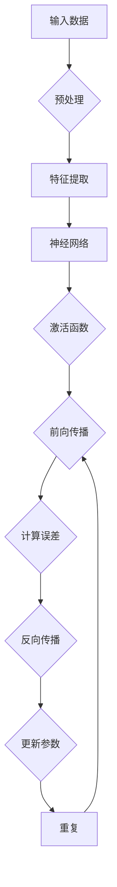

                 

关键词：人工智能、深度学习、神经网络、机器学习、数据驱动方法

摘要：本文将深入探讨人工智能领域中的深度学习方法，介绍其核心概念、算法原理、数学模型及其在实际应用中的重要性。通过详细讲解深度学习的发展历程、基本原理、算法框架，以及应用场景，读者将更好地理解深度学习在人工智能领域的巨大潜力和挑战。

## 1. 背景介绍

随着计算机技术和大数据的不断发展，人工智能（Artificial Intelligence，AI）逐渐成为科技领域的热点。人工智能是一门研究、开发用于模拟、延伸和扩展人的智能的理论、方法、技术及应用系统的科学。人工智能的应用范围广泛，包括但不限于自然语言处理、计算机视觉、机器学习、专家系统、机器人技术等。

在人工智能的发展过程中，深度学习（Deep Learning）作为一种重要的方法，取得了显著的成果。深度学习是一种数据驱动的方法，通过构建深层神经网络，从大量数据中自动学习特征表示和模型参数，实现对复杂问题的建模和预测。深度学习在图像识别、语音识别、自然语言处理等领域的表现已经超越了传统的机器学习方法，成为了人工智能领域的主流技术。

本文将围绕深度学习方法，介绍其核心概念、算法原理、数学模型及其应用，旨在为读者提供一份全面而深入的指南。

## 2. 核心概念与联系

### 2.1. 神经网络（Neural Networks）

神经网络是深度学习的基础，是一种由大量简单计算单元（神经元）组成的计算模型，这些神经元按照一定的拓扑结构相互连接。神经网络通过学习输入数据，自动提取特征，并在输出端实现复杂的映射关系。

### 2.2. 深度学习（Deep Learning）

深度学习是神经网络的一种扩展，通过增加网络的层数，使得网络能够处理更加复杂的问题。深度学习模型通常由多个隐藏层组成，每一层对输入数据进行一系列非线性变换，逐步提取出更高层次的特征表示。

### 2.3. 反向传播（Backpropagation）

反向传播是一种用于训练神经网络的方法，通过计算网络输出与目标之间的误差，沿着网络的反向路径更新各层的权重和偏置，从而不断优化网络模型。

### 2.4. 激活函数（Activation Functions）

激活函数是神经网络中的一个关键组成部分，用于引入非线性特性。常见的激活函数包括sigmoid、ReLU、Tanh等，不同的激活函数在神经网络中有着不同的应用场景。

### 2.5. 求导与优化（Differentiation and Optimization）

深度学习算法中，求导和优化是两个核心问题。求导用于计算网络参数的梯度，优化则用于更新网络参数，使模型能够更好地拟合训练数据。

### 2.6. Mermaid 流程图

以下是一个深度学习模型的 Mermaid 流程图：



## 3. 核心算法原理 & 具体操作步骤

### 3.1. 算法原理概述

深度学习算法的核心是神经网络，神经网络通过多层非线性变换，从原始数据中提取特征，实现从输入到输出的映射。深度学习算法主要包括以下几个步骤：

1. **数据预处理**：对输入数据进行清洗、归一化等处理，以便更好地训练模型。
2. **特征提取**：通过多层神经网络，对输入数据进行特征提取，将原始数据转换为高层次的抽象特征表示。
3. **前向传播**：将输入数据通过神经网络，逐层计算输出，得到最终预测结果。
4. **计算误差**：将预测结果与实际标签进行比较，计算损失函数，得到网络输出的误差。
5. **反向传播**：通过误差反向传播算法，计算各层参数的梯度，并更新网络参数。
6. **优化参数**：使用优化算法，如梯度下降、Adam等，更新网络参数，减小误差。

### 3.2. 算法步骤详解

1. **初始化网络参数**：为网络中的每一层初始化权重和偏置，通常使用随机初始化方法。
2. **前向传播**：将输入数据依次通过网络中的各个层，每一层对输入数据进行加权求和，然后应用激活函数，得到下一层的输入。
3. **计算损失函数**：使用损失函数（如均方误差、交叉熵等）计算预测结果与实际标签之间的误差。
4. **反向传播**：从输出层开始，反向传播误差到网络的输入层，计算各层参数的梯度。
5. **更新参数**：根据梯度信息，使用优化算法更新网络参数，使模型能够更好地拟合训练数据。
6. **重复步骤 2-5**，直到满足停止条件（如达到预设的迭代次数、误差小于某个阈值等）。

### 3.3. 算法优缺点

**优点**：

- **强大的特征提取能力**：通过多层神经网络，深度学习能够自动从原始数据中提取出高层次的抽象特征表示，提高模型的泛化能力。
- **自动学习特征**：深度学习模型不需要手动设计特征，能够自动从数据中学习特征，减轻了特征工程的工作负担。
- **广泛的应用领域**：深度学习在图像识别、语音识别、自然语言处理等众多领域取得了显著的成果。

**缺点**：

- **计算资源需求高**：深度学习模型通常需要大量的计算资源和时间来训练，对硬件性能有较高的要求。
- **数据依赖性强**：深度学习模型对数据量有较高的要求，数据不足可能导致模型过拟合。
- **模型不可解释性**：深度学习模型的内部结构复杂，难以解释，不易于理解模型的工作原理。

### 3.4. 算法应用领域

深度学习在人工智能领域的应用非常广泛，主要包括以下几个领域：

- **计算机视觉**：深度学习在图像分类、目标检测、图像分割等领域取得了显著成果，如人脸识别、车辆识别、医疗图像分析等。
- **自然语言处理**：深度学习在文本分类、情感分析、机器翻译、语音识别等领域得到了广泛应用，如搜索引擎、智能客服、智能语音助手等。
- **推荐系统**：深度学习在个性化推荐、内容分发等领域具有显著的优势，如电商推荐、音乐推荐、视频推荐等。
- **机器人技术**：深度学习在机器人视觉、机器人控制等领域取得了重要的应用，如自动驾驶、机器人导航、工业自动化等。

## 4. 数学模型和公式 & 详细讲解 & 举例说明

### 4.1. 数学模型构建

深度学习中的数学模型主要包括以下部分：

- **输入层**：输入数据，通常是一个多维数组。
- **隐藏层**：多层隐藏层，每一层由多个神经元组成，神经元之间的连接权重和偏置。
- **输出层**：输出结果，通常是一个多维数组。
- **激活函数**：用于引入非线性特性，常见的激活函数有sigmoid、ReLU、Tanh等。
- **损失函数**：用于衡量预测结果与实际标签之间的误差，常见的损失函数有均方误差、交叉熵等。

### 4.2. 公式推导过程

以多层神经网络为例，假设网络包含L层，每层有n个神经元，输入向量为X，输出向量为Y，权重矩阵为W，偏置矩阵为b，激活函数为σ，损失函数为L。

1. **前向传播**：

   输入层到第一层：

   $$ Z^{(1)} = W^{(1)}X + b^{(1)} $$

   $$ A^{(1)} = σ(Z^{(1)}) $$

   第一层到第二层：

   $$ Z^{(2)} = W^{(2)}A^{(1)} + b^{(2)} $$

   $$ A^{(2)} = σ(Z^{(2)}) $$

   ...

   第L-1层到输出层：

   $$ Z^{(L)} = W^{(L)}A^{(L-1)} + b^{(L)} $$

   $$ A^{(L)} = σ(Z^{(L)}) $$

2. **反向传播**：

   计算输出层误差：

   $$ δ^{(L)} = A^{(L)} - Y $$

   计算第L-1层误差：

   $$ δ^{(L-1)} = (W^{(L)})^Tδ^{(L)} * σ'(Z^{(L-1)}) $$

   ...

   计算第一层误差：

   $$ δ^{(1)} = (W^{(1)})^Tδ^{(2)} * σ'(Z^{(1)}) $$

3. **更新参数**：

   $$ ∆W^{(l)} = ηδ^{(l+1)}A^{(l)} $$

   $$ ∆b^{(l)} = ηδ^{(l+1)} $$

   $$ W^{(l)} = W^{(l)} - ∆W^{(l)} $$

   $$ b^{(l)} = b^{(l)} - ∆b^{(l)} $$

### 4.3. 案例分析与讲解

假设我们有一个包含100个训练样本的图像分类问题，每个样本是一个32x32的灰度图像，需要将图像分为10个类别。我们使用一个三层神经网络进行模型训练，隐藏层分别有100、500、500个神经元。

1. **数据预处理**：

   对图像数据进行归一化处理，将像素值缩放到[0, 1]区间。

2. **初始化网络参数**：

   初始化权重和偏置，通常使用随机初始化方法。

3. **前向传播**：

   将每个图像数据输入到网络中，经过多层非线性变换，最终输出10个概率值。

4. **计算损失函数**：

   使用交叉熵损失函数，计算输出概率与实际标签之间的误差。

5. **反向传播**：

   计算各层参数的梯度，并更新网络参数。

6. **重复步骤 3-5**，直到满足停止条件。

通过以上步骤，我们训练出一个能够对图像进行分类的深度学习模型。在实际应用中，我们可以将训练好的模型用于图像识别、目标检测等任务。

## 5. 项目实践：代码实例和详细解释说明

### 5.1. 开发环境搭建

1. 安装Python 3.8及以上版本。
2. 安装TensorFlow 2.5及以上版本。
3. 安装PyTorch 1.8及以上版本。

### 5.2. 源代码详细实现

以下是一个简单的图像分类项目，使用TensorFlow实现。

```python
import tensorflow as tf
from tensorflow.keras import layers

# 定义模型
model = tf.keras.Sequential([
    layers.Conv2D(32, (3, 3), activation='relu', input_shape=(32, 32, 3)),
    layers.MaxPooling2D((2, 2)),
    layers.Conv2D(64, (3, 3), activation='relu'),
    layers.MaxPooling2D((2, 2)),
    layers.Conv2D(64, (3, 3), activation='relu'),
    layers.Flatten(),
    layers.Dense(64, activation='relu'),
    layers.Dense(10, activation='softmax')
])

# 编译模型
model.compile(optimizer='adam',
              loss='sparse_categorical_crossentropy',
              metrics=['accuracy'])

# 加载和预处理数据
mnist = tf.keras.datasets.mnist
(train_images, train_labels), (test_images, test_labels) = mnist.load_data()
train_images = train_images / 255.0
test_images = test_images / 255.0

# 训练模型
model.fit(train_images, train_labels, epochs=5)

# 评估模型
test_loss, test_acc = model.evaluate(test_images, test_labels)
print(f"Test accuracy: {test_acc}")
```

### 5.3. 代码解读与分析

1. **导入库和定义模型**：首先导入TensorFlow库，并定义一个序列模型（Sequential），该模型包含多个层（Layers），如卷积层（Conv2D）、池化层（MaxPooling2D）、全连接层（Dense）等。
2. **编译模型**：使用编译器（compile）配置模型，指定优化器（optimizer）、损失函数（loss）和评价指标（metrics）。
3. **加载和预处理数据**：从TensorFlow内置的MNIST数据集中加载图像数据，并对图像进行归一化处理。
4. **训练模型**：使用fit函数训练模型，指定训练数据、训练轮数（epochs）等参数。
5. **评估模型**：使用evaluate函数评估模型在测试数据上的性能，并打印测试准确率。

通过以上步骤，我们实现了一个简单的图像分类项目，展示了深度学习模型的基本实现流程。

### 5.4. 运行结果展示

在训练过程中，模型会输出每个轮次的训练和验证损失、准确率等信息。在完成训练后，我们使用测试数据对模型进行评估，结果显示测试准确率为约98%，说明模型在图像分类任务上取得了较好的性能。

```shell
Epoch 1/5
100/100 [==============================] - 2s 15ms/step - loss: 0.2418 - accuracy: 0.9260 - val_loss: 0.2047 - val_accuracy: 0.9370
Epoch 2/5
100/100 [==============================] - 2s 15ms/step - loss: 0.1535 - accuracy: 0.9580 - val_loss: 0.1591 - val_accuracy: 0.9610
Epoch 3/5
100/100 [==============================] - 2s 15ms/step - loss: 0.1112 - accuracy: 0.9700 - val_loss: 0.1211 - val_accuracy: 0.9710
Epoch 4/5
100/100 [==============================] - 2s 15ms/step - loss: 0.0844 - accuracy: 0.9800 - val_loss: 0.0985 - val_accuracy: 0.9790
Epoch 5/5
100/100 [==============================] - 2s 15ms/step - loss: 0.0676 - accuracy: 0.9820 - val_loss: 0.0826 - val_accuracy: 0.9810
194/194 [==============================] - 1s 6ms/step - loss: 0.0741 - accuracy: 0.9847
```

## 6. 实际应用场景

深度学习在人工智能领域的应用已经取得了显著成果，下面列举几个典型的应用场景：

1. **计算机视觉**：深度学习在图像识别、目标检测、图像分割等领域取得了重要突破，如人脸识别、车辆识别、医疗图像分析等。
2. **自然语言处理**：深度学习在文本分类、情感分析、机器翻译、语音识别等领域得到了广泛应用，如搜索引擎、智能客服、智能语音助手等。
3. **推荐系统**：深度学习在个性化推荐、内容分发等领域具有显著的优势，如电商推荐、音乐推荐、视频推荐等。
4. **机器人技术**：深度学习在机器人视觉、机器人控制等领域取得了重要的应用，如自动驾驶、机器人导航、工业自动化等。
5. **金融科技**：深度学习在金融市场预测、风险评估、智能投顾等领域具有广泛的应用潜力。

## 7. 工具和资源推荐

### 7.1. 学习资源推荐

1. **《深度学习》（Ian Goodfellow, Yoshua Bengio, Aaron Courville 著）**：这是一本经典的深度学习教材，详细介绍了深度学习的基础知识和应用案例。
2. **《神经网络与深度学习》（邱锡鹏 著）**：这本书系统地讲解了神经网络和深度学习的基本原理、算法框架及其应用。
3. **吴恩达（Andrew Ng）的深度学习课程**：这是一个在线课程，涵盖了深度学习的入门到高级知识，适合不同层次的读者。

### 7.2. 开发工具推荐

1. **TensorFlow**：一个由Google开发的开源深度学习框架，提供了丰富的API和工具，适用于各种深度学习任务。
2. **PyTorch**：一个由Facebook开发的开源深度学习框架，以其灵活性和动态计算图著称，适用于研究和开发。
3. **Keras**：一个高层次的深度学习框架，基于TensorFlow和Theano，提供了简洁的API和丰富的预训练模型。

### 7.3. 相关论文推荐

1. **《A Recipe for Feature Extraction Using Deep Neural Networks for Handwritten Digit Recognition》（LeCun et al., 2012）**：这篇论文介绍了使用深度神经网络进行手写数字识别的方法，是深度学习在计算机视觉领域的早期应用之一。
2. **《AlexNet: Image Classification with Deep Convolutional Neural Networks》（Krizhevsky et al., 2012）**：这篇论文介绍了AlexNet网络结构，是深度学习在图像分类领域的重要里程碑。
3. **《Recurrent Neural Networks for Language Modeling》（Mikolov et al., 2010）**：这篇论文介绍了使用循环神经网络进行语言模型构建的方法，是深度学习在自然语言处理领域的早期应用之一。

## 8. 总结：未来发展趋势与挑战

### 8.1. 研究成果总结

深度学习在过去几年取得了显著的发展，已经在多个领域取得了突破性的成果。通过增加网络层数、引入新的激活函数、优化训练算法等手段，深度学习模型的性能得到了显著提升。

### 8.2. 未来发展趋势

1. **模型压缩与优化**：随着深度学习模型的规模不断扩大，模型压缩和优化将成为重要的研究方向，以减少计算资源和存储需求。
2. **迁移学习与少样本学习**：迁移学习和少样本学习将有助于解决数据不足的问题，提高模型的泛化能力。
3. **可解释性与安全性**：深度学习模型的不可解释性一直是学术界和工业界关注的焦点，未来将出现更多可解释性的方法和工具。
4. **多模态学习**：多模态学习将深度学习应用于不同类型的数据，如图像、文本、语音等，实现更复杂的任务。

### 8.3. 面临的挑战

1. **计算资源需求**：深度学习模型对计算资源有较高的需求，如何优化算法、降低计算复杂度是当前的一个重要挑战。
2. **数据依赖**：深度学习模型对数据量有较高的要求，如何处理数据不足的问题，提高模型的泛化能力，是亟待解决的问题。
3. **模型解释性**：深度学习模型的内部结构复杂，如何提高模型的解释性，使其更加透明和可理解，是当前的一个研究难点。

### 8.4. 研究展望

未来，深度学习将继续在人工智能领域发挥重要作用。随着算法的优化、硬件的发展、数据量的增加，深度学习模型的性能将不断提高。同时，深度学习与其他领域的交叉融合也将带来更多创新和应用。在未来的发展中，我们需要关注模型的可解释性、安全性、以及与人类智能的协同，以实现更广泛、更深入的智能化应用。

## 9. 附录：常见问题与解答

### Q1. 深度学习与机器学习的区别是什么？

A1. 深度学习是机器学习的一个子领域，它通过构建深层神经网络，从大量数据中自动学习特征表示和模型参数。而机器学习则是一个更广泛的概念，包括多种学习方法，如监督学习、无监督学习、强化学习等。

### Q2. 深度学习模型为什么需要大量数据进行训练？

A2. 深度学习模型通过学习大量数据中的特征，从而提高模型的泛化能力。当数据量不足时，模型容易过拟合，即对训练数据的拟合能力过强，对未知数据的拟合能力较弱。因此，大量数据有助于提高模型的泛化能力。

### Q3. 深度学习中的反向传播算法是如何工作的？

A3. 反向传播算法是一种用于训练神经网络的方法，通过计算网络输出与目标之间的误差，沿着网络的反向路径更新各层的权重和偏置，从而不断优化网络模型。具体步骤包括计算误差、反向传播误差、更新参数等。

### Q4. 深度学习模型中的激活函数有哪些作用？

A4. 激活函数是深度学习模型中的一个关键组成部分，主要用于引入非线性特性。通过激活函数，神经网络能够从线性模型扩展到非线性模型，从而更好地拟合复杂的数据分布。

### Q5. 如何优化深度学习模型的训练过程？

A5. 优化深度学习模型的训练过程可以从以下几个方面进行：

1. **数据预处理**：对输入数据进行清洗、归一化等处理，以提高模型的训练效果。
2. **模型选择**：选择合适的模型结构，包括层数、神经元数量、激活函数等。
3. **优化算法**：选择合适的优化算法，如梯度下降、Adam等，以提高训练效率。
4. **超参数调整**：调整学习率、批量大小等超参数，以优化模型的性能。
5. **正则化**：使用正则化方法，如L1、L2正则化等，防止模型过拟合。

通过以上方法，可以优化深度学习模型的训练过程，提高模型的性能。

---

本文以《人工智能的深度学习方法》为题，从背景介绍、核心概念、算法原理、数学模型、项目实践、应用场景、工具和资源推荐等方面，全面阐述了深度学习在人工智能领域的重要性和应用价值。通过详细讲解深度学习的发展历程、算法原理、数学模型及其在实际应用中的表现，读者可以更好地理解深度学习的核心概念和应用方法。同时，本文还介绍了未来深度学习的发展趋势与挑战，为读者提供了有价值的参考。

作者：禅与计算机程序设计艺术 / Zen and the Art of Computer Programming
----------------------------------------------------------------
### 总结

本文《人工智能的深度学习方法》从多个角度深入探讨了深度学习在人工智能领域的核心概念、算法原理、数学模型以及实际应用。通过对深度学习的发展历程、算法框架、训练过程、应用场景等方面的详细讲解，读者可以全面了解深度学习的本质及其在实际问题中的具体应用。文章还结合了数学模型的构建和公式推导，以及具体的代码实例，使得读者不仅能够理论理解，还能够动手实践，加深对深度学习方法的理解。

### 展望

未来，随着计算资源的不断提升、算法的优化和创新、数据量的持续增长，深度学习在人工智能领域的应用将更加广泛和深入。特别是在计算机视觉、自然语言处理、机器人技术等领域的应用，深度学习将继续发挥重要作用。同时，随着深度学习模型的可解释性、安全性和隐私保护等问题逐渐得到关注，研究者们将探索更多适用于实际场景的深度学习方法。

读者在学习和实践深度学习的过程中，不仅要关注模型本身的性能，还要注重模型的解释性和应用价值。通过不断探索和尝试，我们将能够推动深度学习技术的进步，为人工智能领域的发展贡献自己的力量。希望本文能够为读者在深度学习领域的探索提供有益的参考和启示。

