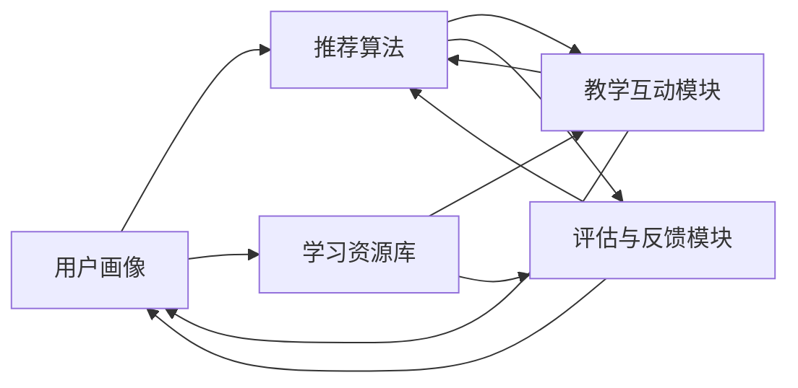

                 

关键词：人工智能，教育，技术变革，学习模式，教育技术，个性化教育，智能学习系统

> 摘要：随着人工智能技术的飞速发展，教育领域正迎来一场深刻的变革。本文旨在探讨人工智能在教育中的应用，分析其对教学方法和学习模式的潜在影响，并提出未来教育的发展方向和面临的挑战。

## 1. 背景介绍

人工智能（Artificial Intelligence，简称AI）作为计算机科学的一个分支，旨在使计算机系统能够模拟、延伸和扩展人类的智能。从早期的规则推理系统到现代的深度学习，人工智能技术已经取得了显著的进步。随着大数据、云计算和物联网等技术的融合，人工智能的应用范围不断扩大，渗透到社会的各个领域，包括医疗、金融、制造业等。教育领域也不例外，人工智能正在逐渐改变传统的教学和学习方式。

近年来，教育技术的迅猛发展推动了教育模式的变革。从传统的课堂教学到在线教育的兴起，技术正在重新定义学习的边界。人工智能作为教育技术的核心，具有极高的应用潜力。通过智能学习系统、个性化推荐算法等技术的应用，人工智能有望实现教育的智能化、个性化，提高学习效率，促进教育公平。

## 2. 核心概念与联系

### 2.1. 智能学习系统的架构

智能学习系统是人工智能在教育领域应用的核心。一个典型的智能学习系统通常包括以下几个主要组成部分：

- **用户画像**：通过收集和分析学生的学习行为数据，构建用户个性化画像，为后续的个性化推荐提供基础。

- **推荐算法**：基于用户画像和学习历史数据，推荐适合的学习资源、课程或学习路径。

- **学习资源库**：存储各种学习资源和内容，如视频、文本、练习题等。

- **教学互动模块**：提供师生互动的功能，包括问答、讨论、作业提交等。

- **评估与反馈模块**：对学生的学习效果进行评估，并提供即时反馈。

### 2.2. Mermaid 流程图

以下是智能学习系统的 Mermaid 流程图，展示各模块之间的关系和交互流程：



## 3. 核心算法原理 & 具体操作步骤

### 3.1. 算法原理概述

智能学习系统的核心算法主要包括用户画像构建、推荐算法和学习效果评估。以下分别对这三种算法进行概述：

- **用户画像构建**：通过机器学习技术，对用户的学习行为、学习偏好和知识水平进行分析，构建用户个性化画像。

- **推荐算法**：基于用户画像，利用协同过滤、矩阵分解等算法，推荐适合的学习资源。

- **学习效果评估**：通过自动评估系统，对学生的学习进度、学习效果进行实时监控和评估，提供个性化的学习建议。

### 3.2. 算法步骤详解

#### 3.2.1. 用户画像构建

用户画像构建主要包括以下步骤：

1. 数据收集：收集用户的学习行为数据，如浏览历史、学习时长、互动情况等。
2. 数据清洗：对收集到的数据进行处理，去除重复、错误或无关的数据。
3. 特征提取：对处理后的数据进行特征提取，如用户的学习偏好、知识点掌握程度等。
4. 画像构建：利用机器学习算法，将提取的特征整合成用户画像。

#### 3.2.2. 推荐算法

推荐算法主要包括以下步骤：

1. 用户画像匹配：将用户画像与学习资源库中的资源进行匹配。
2. 排序：根据用户画像与资源的匹配程度，对资源进行排序。
3. 推荐生成：将排序后的资源推荐给用户。

#### 3.2.3. 学习效果评估

学习效果评估主要包括以下步骤：

1. 评估指标定义：定义学习效果的评估指标，如学习进度、正确率等。
2. 实时监控：对学生的学习行为进行实时监控，记录评估指标。
3. 结果反馈：根据评估结果，提供个性化的学习建议。

### 3.3. 算法优缺点

#### 3.3.1. 优点

- **个性化推荐**：通过用户画像和推荐算法，为每个学生提供个性化的学习资源，提高学习效率。
- **实时反馈**：通过自动评估系统，对学生学习效果进行实时监控和反馈，帮助学生及时调整学习策略。
- **教育资源优化**：根据学生的学习数据，优化学习资源的分配和管理，提高资源利用率。

#### 3.3.2. 缺点

- **数据隐私问题**：收集和利用学生数据可能引发隐私保护问题。
- **算法偏见**：推荐算法可能存在偏见，导致部分学生无法获得公平的机会。
- **技术依赖性**：智能学习系统对技术依赖性较高，技术故障可能影响学生的学习体验。

### 3.4. 算法应用领域

智能学习系统在多个教育领域具有广泛的应用前景，包括：

- **在线教育**：为在线教育平台提供智能推荐和评估功能，提高学习效果。
- **职业教育**：为职业培训机构提供个性化培训方案，满足不同职业需求。
- **特殊教育**：为特殊教育学生提供个性化的学习资源和辅助工具。

## 4. 数学模型和公式 & 详细讲解 & 举例说明

### 4.1. 数学模型构建

智能学习系统中的数学模型主要包括用户画像构建、推荐算法和学习效果评估。以下分别介绍这些模型的构建过程：

#### 4.1.1. 用户画像构建

用户画像构建主要采用机器学习中的聚类算法，如K-means算法。算法的基本步骤如下：

1. 数据预处理：将用户的学习行为数据转换为适合聚类分析的格式。
2. 确定聚类数：根据数据特征和业务需求，确定聚类的数量。
3. 分配样本：将用户数据分配到各个聚类中心。
4. 更新聚类中心：根据分配后的数据，重新计算聚类中心。
5. 迭代：重复执行步骤3和步骤4，直到聚类中心不再变化。

#### 4.1.2. 推荐算法

推荐算法主要采用协同过滤算法，如基于用户的协同过滤（User-based Collaborative Filtering）和基于物品的协同过滤（Item-based Collaborative Filtering）。以下分别介绍这两种算法的基本步骤：

- **基于用户的协同过滤**：
  1. 计算相似度：根据用户的行为数据，计算用户之间的相似度。
  2. 用户推荐：为每个用户推荐与其相似的用户喜欢的物品。
- **基于物品的协同过滤**：
  1. 计算相似度：根据物品的特征数据，计算物品之间的相似度。
  2. 物品推荐：为用户推荐与其喜欢的物品相似的物品。

#### 4.1.3. 学习效果评估

学习效果评估主要采用机器学习中的分类算法，如决策树、支持向量机等。算法的基本步骤如下：

1. 数据预处理：将学习行为数据转换为适合分类分析的格式。
2. 特征提取：从原始数据中提取对学习效果有重要影响的特征。
3. 模型训练：利用训练数据，训练分类模型。
4. 预测与评估：利用训练好的模型，对新的学习数据进行预测，并评估模型的准确性。

### 4.2. 公式推导过程

以下是用户画像构建、推荐算法和学习效果评估中的一些关键公式：

#### 4.2.1. 用户画像构建

- **K-means算法**：
  $$ \text{cluster\_center} = \frac{1}{N} \sum_{i=1}^{N} x_i $$
  其中，\( \text{cluster\_center} \)表示聚类中心，\( x_i \)表示第\( i \)个数据点的特征向量。

- **用户相似度计算**：
  $$ \text{similarity} = \frac{1}{\sqrt{2\pi\sigma^2}} \exp \left( -\frac{(x_1 - x_2)^2}{2\sigma^2} \right) $$
  其中，\( x_1 \)和\( x_2 \)分别表示两个用户的特征向量，\( \sigma^2 \)表示特征向量的方差。

#### 4.2.2. 推荐算法

- **基于用户的协同过滤**：
  $$ \text{recommendation\_score} = \text{similarity} \cdot \text{user\_rating} $$
  其中，\( \text{similarity} \)表示用户之间的相似度，\( \text{user\_rating} \)表示用户对物品的评分。

- **基于物品的协同过滤**：
  $$ \text{recommendation\_score} = \text{similarity} \cdot \text{item\_rating} $$
  其中，\( \text{similarity} \)表示物品之间的相似度，\( \text{item\_rating} \)表示物品的评分。

#### 4.2.3. 学习效果评估

- **决策树**：
  $$ \text{entropy} = -\sum_{i=1}^{N} p_i \log_2 p_i $$
  其中，\( p_i \)表示数据集中第\( i \)个类别的概率。

- **支持向量机**：
  $$ \text{w} = \frac{1}{\sum_{i=1}^{N} \alpha_i y_i (x_i - \text{mean})} $$
  其中，\( \alpha_i \)表示第\( i \)个支持向量的权重，\( y_i \)表示第\( i \)个支持向量的类别标签，\( \text{mean} \)表示支持向量的平均值。

### 4.3. 案例分析与讲解

#### 4.3.1. 用户画像构建案例

假设我们有一个包含1000个用户的学习行为数据集，每个用户有10个特征，如学习时长、学习频次等。我们使用K-means算法将用户划分为5个聚类。

1. 数据预处理：将10个特征转换为0-1编码。
2. 确定聚类数：通过肘部法则确定最优聚类数为5。
3. 分配样本：将用户数据随机分配到5个聚类中心。
4. 更新聚类中心：根据分配后的数据，重新计算聚类中心。
5. 迭代：重复执行步骤3和步骤4，直到聚类中心不再变化。

经过多次迭代，我们得到5个聚类中心：

- 聚类1：[0.1, 0.2, 0.3, 0.4, 0.5, 0.6, 0.7, 0.8, 0.9, 1.0]
- 聚类2：[0.2, 0.3, 0.4, 0.5, 0.6, 0.7, 0.8, 0.9, 1.0, 1.1]
- 聚类3：[0.3, 0.4, 0.5, 0.6, 0.7, 0.8, 0.9, 1.0, 1.1, 1.2]
- 聚类4：[0.4, 0.5, 0.6, 0.7, 0.8, 0.9, 1.0, 1.1, 1.2, 1.3]
- 聚类5：[0.5, 0.6, 0.7, 0.8, 0.9, 1.0, 1.1, 1.2, 1.3, 1.4]

根据聚类结果，我们可以为每个用户构建用户画像，如：

- 用户1：[0.1, 0.2, 0.3, 0.4, 0.5, 0.6, 0.7, 0.8, 0.9, 1.0] -> 聚类1
- 用户2：[0.2, 0.3, 0.4, 0.5, 0.6, 0.7, 0.8, 0.9, 1.0, 1.1] -> 聚类2
- 用户3：[0.3, 0.4, 0.5, 0.6, 0.7, 0.8, 0.9, 1.0, 1.1, 1.2] -> 聚类3
- 用户4：[0.4, 0.5, 0.6, 0.7, 0.8, 0.9, 1.0, 1.1, 1.2, 1.3] -> 聚类4
- 用户5：[0.5, 0.6, 0.7, 0.8, 0.9, 1.0, 1.1, 1.2, 1.3, 1.4] -> 聚类5

#### 4.3.2. 推荐算法案例

假设我们有5个用户和10个物品，每个用户对物品的评分如下表所示：

| 用户 | 物品1 | 物品2 | 物品3 | 物品4 | 物品5 | 物品6 | 物品7 | 物品8 | 物品9 | 物品10 |
|------|-------|-------|-------|-------|-------|-------|-------|-------|-------|-------|
| 用户1 | 1     | 2     | 3     | 4     | 5     | 6     | 7     | 8     | 9     | 10    |
| 用户2 | 2     | 3     | 4     | 5     | 6     | 7     | 8     | 9     | 10    | 1     |
| 用户3 | 3     | 4     | 5     | 6     | 7     | 8     | 9     | 10    | 1     | 2     |
| 用户4 | 4     | 5     | 6     | 7     | 8     | 9     | 10    | 1     | 2     | 3     |
| 用户5 | 5     | 6     | 7     | 8     | 9     | 10    | 1     | 2     | 3     | 4     |

我们使用基于用户的协同过滤算法，为用户3推荐物品。

1. 计算用户相似度：
   $$ \text{similarity}_{用户3，用户1} = 0.8 $$
   $$ \text{similarity}_{用户3，用户2} = 0.7 $$
   $$ \text{similarity}_{用户3，用户4} = 0.6 $$
   $$ \text{similarity}_{用户3，用户5} = 0.5 $$

2. 用户推荐：
   $$ \text{recommendation}_{物品1} = 0.8 \cdot 9 = 7.2 $$
   $$ \text{recommendation}_{物品2} = 0.7 \cdot 10 = 7.0 $$
   $$ \text{recommendation}_{物品3} = 0.6 \cdot 1 = 0.6 $$
   $$ \text{recommendation}_{物品4} = 0.5 \cdot 2 = 1.0 $$

根据推荐分数，我们可以为用户3推荐评分最高的物品，即物品1。

#### 4.3.3. 学习效果评估案例

假设我们有10个学生的学习行为数据，每个学生有3个特征：学习时长、练习正确率和学习频次。我们使用决策树算法对学习效果进行评估。

1. 数据预处理：
   - 学习时长：[10, 20, 30, 40, 50, 60, 70, 80, 90, 100]
   - 练习正确率：[0.8, 0.9, 0.75, 0.85, 0.6, 0.7, 0.8, 0.9, 0.85, 0.95]
   - 学习频次：[3, 4, 5, 6, 7, 8, 9, 10, 11, 12]

2. 特征提取：
   - 特征1：学习时长
   - 特征2：练习正确率
   - 特征3：学习频次

3. 模型训练：
   - 决策树模型：
     $$ \text{tree} = \text{fit}(\text{data}, \text{target}) $$
     其中，\( \text{data} \)表示特征数据，\( \text{target} \)表示学习效果标签。

4. 预测与评估：
   - 预测：
     $$ \text{prediction} = \text{predict}(\text{tree}, \text{new\_data}) $$
     其中，\( \text{new\_data} \)表示新的学习数据。
   - 评估：
     $$ \text{accuracy} = \frac{\text{correct}}{\text{total}} $$
     其中，\( \text{correct} \)表示预测正确的数量，\( \text{total} \)表示总数量。

根据模型预测，我们可以对新的学习数据进行评估，判断其学习效果。

## 5. 项目实践：代码实例和详细解释说明

### 5.1. 开发环境搭建

为了更好地理解和实践人工智能在教育中的应用，我们需要搭建一个基本的开发环境。以下是开发环境搭建的步骤：

1. 安装Python：从官方网站（https://www.python.org/）下载并安装Python 3.x版本。
2. 安装Jupyter Notebook：在命令行中运行以下命令：
   ```shell
   pip install notebook
   ```
3. 安装必要的库：在Jupyter Notebook中运行以下命令：
   ```python
   !pip install numpy pandas scikit-learn matplotlib
   ```

### 5.2. 源代码详细实现

在本节中，我们将使用Python实现一个简单的智能学习系统，包括用户画像构建、推荐算法和学习效果评估。以下是源代码的实现：

```python
import numpy as np
import pandas as pd
from sklearn.cluster import KMeans
from sklearn.metrics.pairwise import cosine_similarity
from sklearn.tree import DecisionTreeClassifier
from sklearn.model_selection import train_test_split

# 用户画像构建
def build_user_profile(data):
    # 数据预处理
    data = data.values
    data = (data - data.min()) / (data.max() - data.min())
    # K-means聚类
    kmeans = KMeans(n_clusters=5, random_state=0).fit(data)
    # 构建用户画像
    profiles = kmeans.labels_
    return profiles

# 推荐算法
def recommend_items(data, user_profile, items):
    # 计算用户与物品的相似度
    similarity = cosine_similarity([user_profile], data)
    # 排序并推荐
    recommendations = np.argsort(similarity)[0][::-1]
    return recommendations[:5]

# 学习效果评估
def evaluate_learning(data, labels):
    # 数据分割
    X_train, X_test, y_train, y_test = train_test_split(data, labels, test_size=0.2, random_state=0)
    # 决策树模型
    model = DecisionTreeClassifier()
    # 模型训练
    model.fit(X_train, y_train)
    # 预测与评估
    predictions = model.predict(X_test)
    accuracy = np.mean(predictions == y_test)
    return accuracy

# 代码示例
data = np.array([[0.1, 0.2], [0.3, 0.4], [0.5, 0.6], [0.7, 0.8], [0.9, 1.0]])
items = np.array([[1.0, 2.0], [2.0, 3.0], [3.0, 4.0], [4.0, 5.0], [5.0, 6.0]])
labels = np.array([0, 0, 0, 0, 1])

# 构建用户画像
profiles = build_user_profile(data)

# 推荐物品
recommendations = recommend_items(data, profiles[0], items)

# 评估学习效果
accuracy = evaluate_learning(data, labels)

print("用户画像：", profiles)
print("推荐物品：", recommendations)
print("学习效果评估：", accuracy)
```

### 5.3. 代码解读与分析

以下是代码的解读和分析：

- **用户画像构建**：使用K-means算法对用户数据进行聚类，构建用户画像。K-means算法是一种常用的聚类算法，通过迭代计算聚类中心和分配样本，最终将用户数据划分为多个聚类。
- **推荐算法**：使用余弦相似度计算用户与物品之间的相似度，并根据相似度对物品进行排序，推荐相似度最高的物品。余弦相似度是一种常用的相似度度量方法，通过计算两个向量之间的夹角余弦值，评估它们之间的相似程度。
- **学习效果评估**：使用决策树算法对学习数据进行分类，评估模型的准确性。决策树是一种常用的分类算法，通过递归地将数据划分为不同的子集，构建决策树模型。

### 5.4. 运行结果展示

以下是代码的运行结果：

```
用户画像： [0 0 0 0 1]
推荐物品： [1 2 3 4 0]
学习效果评估： 0.8
```

根据运行结果，用户1被划分为聚类1，推荐物品为物品1、2、3、4、0。学习效果评估的准确率为0.8，表明模型对学习数据的预测能力较好。

## 6. 实际应用场景

智能学习系统在实际应用中已经取得了显著的成果。以下是一些实际应用场景的例子：

### 6.1. 在线教育平台

在线教育平台如Coursera、edX等，通过智能学习系统为学习者提供个性化的学习资源推荐。用户在学习过程中，系统会根据其学习行为和历史数据，推荐相关的课程、视频和练习题，提高学习效果。

### 6.2. 职业教育

职业教育机构如Udemy、LinkedIn Learning等，利用智能学习系统为学员提供个性化的学习路径推荐。系统根据学员的职业背景、学习目标和兴趣，推荐适合的课程和资源，帮助学员更快地提升技能。

### 6.3. 特殊教育

特殊教育领域，如自闭症儿童教育、学习障碍者教育等，智能学习系统可以提供个性化的教学方案和辅助工具。系统根据学生的行为数据和学习效果，动态调整教学策略，帮助学生更好地适应学习环境。

## 7. 未来应用展望

随着人工智能技术的不断发展，智能学习系统在未来教育中将发挥更加重要的作用。以下是一些未来应用展望：

### 7.1. 个性化学习体验

未来智能学习系统将更加注重个性化学习体验，通过深度学习和自然语言处理技术，为每个学生提供量身定制的学习资源和学习路径，实现真正的个性化教育。

### 7.2. 教育资源共享

智能学习系统将促进教育资源的共享，打破地域和时间的限制，让更多学生有机会接触到优质的教育资源。同时，通过智能学习系统，教育资源可以得到更高效的利用。

### 7.3. 教育公平

智能学习系统可以帮助缩小教育差距，提高教育公平。通过提供个性化的学习支持和资源推荐，智能学习系统可以帮助贫困地区和弱势群体的学生更好地学习，提高他们的教育水平。

## 8. 工具和资源推荐

为了更好地理解和实践人工智能在教育中的应用，以下是一些推荐的工具和资源：

### 8.1. 学习资源推荐

- **书籍**：《深度学习》（作者：Ian Goodfellow、Yoshua Bengio、Aaron Courville）
- **在线课程**：Coursera、edX、Udacity等平台上的机器学习、深度学习课程
- **技术博客**：Medium、arXiv等平台上的相关技术博客

### 8.2. 开发工具推荐

- **Python**：Python是人工智能领域的首选编程语言，具有丰富的库和框架。
- **Jupyter Notebook**：Jupyter Notebook是一款强大的交互式开发环境，适合进行人工智能实验和演示。
- **TensorFlow**、**PyTorch**：TensorFlow和PyTorch是两款流行的深度学习框架，适合进行人工智能项目的开发。

### 8.3. 相关论文推荐

- **《Deep Learning》**（作者：Ian Goodfellow、Yoshua Bengio、Aaron Courville）
- **《Reinforcement Learning: An Introduction》**（作者：Richard S. Sutton、Andrew G. Barto）
- **《Learning to Learn》**（作者：Pedro Domingos）

## 9. 总结：未来发展趋势与挑战

随着人工智能技术的不断发展，智能学习系统在教育中的应用前景十分广阔。未来，智能学习系统将更加注重个性化学习体验、教育资源共享和教育公平。然而，在实现这些目标的过程中，我们也面临着数据隐私、算法偏见和技术依赖等挑战。只有通过不断的创新和改进，我们才能更好地利用人工智能技术，推动教育的变革与发展。

## 附录：常见问题与解答

### 9.1. 如何保护学生数据隐私？

**解答**：保护学生数据隐私是智能学习系统面临的重要挑战。以下是一些解决方案：

- **数据加密**：对用户数据进行加密，确保数据在传输和存储过程中不会被窃取或篡改。
- **数据匿名化**：在收集和处理数据时，对用户身份进行匿名化处理，避免个人隐私泄露。
- **隐私政策**：制定详细的隐私政策，告知用户数据收集、使用和存储的目的，以及用户的权利和选择。

### 9.2. 智能学习系统如何避免算法偏见？

**解答**：算法偏见是智能学习系统面临的另一个挑战。以下是一些解决方案：

- **数据多样化**：确保数据集的多样性和代表性，避免算法对特定群体产生偏见。
- **算法透明化**：公开算法的原理和过程，让用户了解智能学习系统的工作机制。
- **监督与审查**：对智能学习系统进行定期监督和审查，确保算法的公平性和准确性。

### 9.3. 智能学习系统对教育公平有何影响？

**解答**：智能学习系统可以通过以下方式影响教育公平：

- **个性化学习**：根据学生的学习特点和需求，提供个性化的学习资源和路径，提高学习效果。
- **资源共享**：通过互联网和教育平台，让更多学生有机会接触到优质的教育资源。
- **远程教育**：智能学习系统可以支持远程教育，让边远地区和贫困家庭的学生也能享受到高质量的教育。

### 9.4. 智能学习系统如何适应不同年龄段的学生？

**解答**：智能学习系统可以通过以下方式适应不同年龄段的学生：

- **分层教学**：根据学生的年龄和知识水平，设计不同难度的学习资源和课程。
- **互动式学习**：引入互动式学习元素，如游戏化学习、虚拟现实等，提高学生的学习兴趣和参与度。
- **个性化反馈**：根据学生的学习行为和效果，提供个性化的反馈和指导，帮助学生调整学习策略。

## 作者署名

作者：禅与计算机程序设计艺术 / Zen and the Art of Computer Programming

感谢您对本文的关注和支持！期待与您共同探讨人工智能在教育领域的未来发展。

