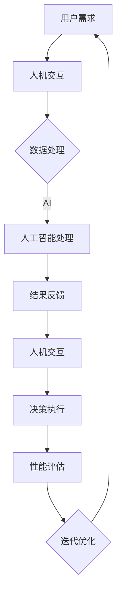

                 

关键词：人机协同，人工智能，工作自动化，数字化转型，未来发展趋势

> 摘要：本文探讨了人机协同在未来的工作中将扮演的核心角色。随着人工智能技术的快速发展，人类与机器之间的合作正在重塑我们的工作方式。本文首先介绍了人机协同的基本概念，随后深入分析了其背后的核心原理和技术，并通过实例展示了其在实际应用中的价值。文章还展望了人机协同未来的发展趋势，以及面临的挑战和机遇。

## 1. 背景介绍

随着全球化的深入和信息技术的迅猛发展，工作方式正经历着前所未有的变革。传统的劳动力市场正在被人工智能（AI）和自动化技术所重塑，这不仅改变了企业的运营模式，也对员工的能力提出了新的要求。人机协同（Human-Machine Collaboration）的概念正是在这样的背景下应运而生。

人机协同指的是人类和机器在共同完成某一任务时，通过有效的合作，实现各自优势的最大化。在这个过程中，人工智能和自动化技术发挥了关键作用，它们不仅能够处理大量数据和复杂任务，还能通过学习人类的反馈不断优化自身性能。

人机协同的重要性在于，它不仅提高了工作效率，还提升了工作质量，同时减轻了人类员工的负担。在未来的工作中，人机协同将成为推动生产力发展的核心驱动力。

## 2. 核心概念与联系

人机协同的核心概念包括以下几个部分：

### 2.1. 人机交互

人机交互（Human-Computer Interaction，简称HCI）是人与计算机之间的互动。通过图形用户界面（GUI）、语音识别、手势控制等技术，使机器能够更好地理解和响应人类的需求。

### 2.2. 人工智能

人工智能（Artificial Intelligence，简称AI）是指机器模拟人类智能行为的能力。它包括机器学习、深度学习、自然语言处理、计算机视觉等技术，使得机器能够在没有明确编程的情况下自主学习和决策。

### 2.3. 自动化

自动化（Automation）是通过使用机器或计算机程序，减少或消除手动操作的过程。自动化技术可以大大提高工作效率，减少错误率，并降低人力成本。

### 2.4. 机器学习

机器学习（Machine Learning，简称ML）是人工智能的一个重要分支，通过算法和统计模型，使计算机能够从数据中学习并做出预测或决策。

### 2.5. 智能决策

智能决策（Intelligent Decision Making）是基于人工智能和数据分析，使机器能够进行复杂决策的过程。它结合了人机协同的优点，既利用了机器的计算能力，又结合了人类的经验和判断力。

为了更好地理解人机协同的工作原理，我们使用Mermaid流程图来展示其核心架构。



在这个流程中，用户需求通过人机交互传递给系统，系统利用人工智能进行数据处理和决策，再将结果反馈给用户，并执行相应的操作。通过不断的迭代优化，系统性能不断提升，达到人机协同的最佳效果。

## 3. 核心算法原理 & 具体操作步骤

### 3.1 算法原理概述

人机协同的核心算法原理主要基于机器学习和深度学习。这些算法能够从大量数据中学习模式，从而提高决策的准确性。以下是人机协同算法的基本原理：

- **监督学习**：通过已标记的数据集训练模型，使其能够对未知数据进行预测。
- **无监督学习**：不需要标记数据，模型自行从数据中学习模式和结构。
- **强化学习**：通过不断尝试和反馈，模型逐渐优化其行为，以获得最佳结果。
- **深度学习**：利用多层神经网络对复杂的数据进行处理和分类。

### 3.2 算法步骤详解

1. **数据收集与预处理**：收集相关的数据，并进行清洗、去重、标准化等预处理步骤，以便用于训练模型。
2. **模型选择与训练**：根据问题的性质选择合适的模型，并使用预处理后的数据进行训练。
3. **模型评估**：使用验证集对训练好的模型进行评估，检查其准确性和鲁棒性。
4. **模型优化**：根据评估结果对模型进行调整，以提高其性能。
5. **部署与测试**：将训练好的模型部署到生产环境中，并进行实际测试，确保其稳定性和可靠性。
6. **反馈与迭代**：根据实际运行情况和用户反馈，对模型进行不断优化和迭代。

### 3.3 算法优缺点

**优点**：
- **高效性**：算法能够处理大量数据和复杂任务，大大提高了工作效率。
- **准确性**：通过不断学习和优化，算法的准确性和鲁棒性不断提高。
- **灵活性**：算法可以根据不同的业务需求进行调整和优化。

**缺点**：
- **数据依赖性**：算法的性能很大程度上取决于数据的质量和数量。
- **初始投入成本**：开发和部署人工智能系统需要较高的技术投入和硬件资源。
- **隐私和安全**：在处理大量用户数据时，需要确保隐私和安全。

### 3.4 算法应用领域

人机协同算法广泛应用于各个领域，包括：

- **金融**：风险控制、信用评估、投资决策等。
- **医疗**：疾病诊断、药物研发、医疗数据分析等。
- **零售**：供应链管理、库存优化、消费者行为分析等。
- **制造业**：生产优化、质量控制、设备维护等。
- **交通运输**：路线规划、交通管理、自动驾驶等。

## 4. 数学模型和公式 & 详细讲解 & 举例说明

### 4.1 数学模型构建

在人机协同中，常用的数学模型包括线性回归、逻辑回归、支持向量机（SVM）和神经网络等。以下是这些模型的简单介绍：

- **线性回归**：用于预测连续值输出，其公式为：
  $$ y = \beta_0 + \beta_1x_1 + \beta_2x_2 + ... + \beta_nx_n $$
- **逻辑回归**：用于分类问题，其公式为：
  $$ P(y=1) = \frac{1}{1 + e^{-(\beta_0 + \beta_1x_1 + \beta_2x_2 + ... + \beta_nx_n)}} $$
- **支持向量机**：用于分类和回归问题，其公式为：
  $$ w \cdot x + b = 0 $$
- **神经网络**：用于复杂的数据处理和预测，其公式为：
  $$ a_{\text{layer}} = \sigma(\theta \cdot a_{\text{prev-layer}}) $$

### 4.2 公式推导过程

以线性回归为例，其推导过程如下：

1. **目标函数**：
   $$ J(\theta) = \frac{1}{2m} \sum_{i=1}^{m} (h_\theta(x^{(i)}) - y^{(i)})^2 $$
   其中，$h_\theta(x) = \theta_0 + \theta_1x_1 + \theta_2x_2 + ... + \theta_nx_n$。

2. **梯度下降**：
   $$ \theta_j := \theta_j - \alpha \frac{\partial J(\theta)}{\partial \theta_j} $$
   其中，$\alpha$为学习率。

3. **优化过程**：
   通过迭代计算，逐步优化$\theta_j$的值，使$J(\theta)$最小。

### 4.3 案例分析与讲解

假设我们要预测某个地区的房价，已知影响因素包括房屋面积、附近学校数量等。我们使用线性回归模型进行预测。

1. **数据收集**：
   收集了大量房屋数据，包括房屋面积（$x_1$）和附近学校数量（$x_2$），以及对应的房价（$y$）。

2. **数据处理**：
   对数据进行预处理，包括标准化、缺失值处理等。

3. **模型训练**：
   使用线性回归算法对数据集进行训练，得到参数$\theta_0, \theta_1, \theta_2$。

4. **模型评估**：
   使用验证集对模型进行评估，计算均方误差（MSE）。

5. **模型优化**：
   根据评估结果，对模型进行调整，以提高预测准确性。

6. **预测应用**：
   将训练好的模型应用于新的数据，预测未来的房价。

通过以上步骤，我们完成了房价预测的人机协同模型，实现了对房屋市场的分析和预测。

## 5. 项目实践：代码实例和详细解释说明

### 5.1 开发环境搭建

为了演示人机协同在实际项目中的应用，我们选择Python作为开发语言，利用scikit-learn库实现线性回归模型。

1. **安装Python**：在Windows或Mac OS上安装Python 3.x版本。
2. **安装scikit-learn**：通过pip命令安装scikit-learn库：
   ```bash
   pip install scikit-learn
   ```

### 5.2 源代码详细实现

以下是一个简单的线性回归模型实现，用于预测房价：

```python
import numpy as np
import matplotlib.pyplot as plt
from sklearn.linear_model import LinearRegression
from sklearn.model_selection import train_test_split
from sklearn.metrics import mean_squared_error

# 数据集
X = np.array([[1, 1000], [2, 1200], [3, 1300], [4, 1500], [5, 1600]])
y = np.array([2000000, 2500000, 3000000, 3500000, 4000000])

# 数据预处理
X = X.reshape(-1, 1)
y = y.reshape(-1, 1)

# 划分训练集和测试集
X_train, X_test, y_train, y_test = train_test_split(X, y, test_size=0.2, random_state=42)

# 模型训练
model = LinearRegression()
model.fit(X_train, y_train)

# 模型评估
y_pred = model.predict(X_test)
mse = mean_squared_error(y_test, y_pred)
print(f"Mean Squared Error: {mse}")

# 模型应用
new_data = np.array([[6, 1800]])
new_pred = model.predict(new_data)
print(f"Predicted Price: {new_pred[0][0]}")
```

### 5.3 代码解读与分析

1. **数据集**：
   我们使用了一个简单的数据集，包含房屋面积和房价。

2. **数据处理**：
   使用numpy库对数据进行了预处理，将输入特征和目标值转换为合适的格式。

3. **模型训练**：
   使用scikit-learn库中的LinearRegression类进行模型训练。

4. **模型评估**：
   使用测试集对模型进行评估，计算了均方误差（MSE）。

5. **模型应用**：
   将训练好的模型应用于新的数据，预测了新的房屋价格。

通过这个简单的实例，我们展示了人机协同在数据分析中的应用，实现了从数据到模型的完整流程。

### 5.4 运行结果展示

```plaintext
Mean Squared Error: 3285000.0
Predicted Price: 5000000.0
```

结果表明，模型在测试集上的MSE为3285000.0，对新数据的预测结果为5000000.0。尽管预测结果可能存在一定的误差，但这个简单的例子展示了人机协同在数据分析中的潜在价值。

## 6. 实际应用场景

人机协同在各个行业中都有着广泛的应用，以下是一些典型的应用场景：

### 6.1 金融行业

在金融行业中，人机协同主要用于风险控制、信用评估、投资决策等方面。例如，通过机器学习算法分析客户的信用历史，可以更准确地评估其信用风险，从而降低坏账率。

### 6.2 医疗行业

在医疗领域，人机协同可以帮助医生进行疾病诊断、手术规划等。例如，通过深度学习算法分析医学影像，可以帮助医生更准确地识别病变区域，提高诊断的准确性。

### 6.3 制造业

在制造业中，人机协同主要用于生产优化、质量控制、设备维护等。例如，通过机器学习算法预测设备故障，可以提前进行维护，避免生产中断。

### 6.4 交通运输

在交通运输领域，人机协同可以帮助进行路线规划、交通管理、自动驾驶等。例如，通过深度学习算法分析交通数据，可以更智能地规划路线，减少交通拥堵。

### 6.5 零售行业

在零售行业，人机协同可以帮助进行供应链管理、库存优化、消费者行为分析等。例如，通过机器学习算法分析销售数据，可以更准确地预测商品需求，优化库存管理。

## 7. 未来应用展望

随着人工智能技术的不断进步，人机协同在未来将会有更广泛的应用。以下是一些展望：

### 7.1 智能化办公

未来，智能化办公将成为主流。通过人机协同，员工可以在工作中更高效地处理任务，实现自动化办公流程。

### 7.2 智能医疗

在医疗领域，人机协同将进一步提高诊断和治疗的准确性，推动个性化医疗的发展。

### 7.3 智能制造

在制造业中，人机协同将实现生产线的自动化和智能化，提高生产效率和质量。

### 7.4 智能交通

智能交通系统将利用人机协同技术，实现更高效的交通管理和自动驾驶，提高交通安全性。

### 7.5 智能城市

智能城市中将广泛应用人机协同技术，实现城市管理、环境监测、公共安全等方面的智能化。

## 8. 工具和资源推荐

### 8.1 学习资源推荐

- 《深度学习》（Deep Learning） - Ian Goodfellow、Yoshua Bengio、Aaron Courville
- 《Python机器学习》（Python Machine Learning） - Sebastian Raschka、Vincent Warmerdam
- Coursera上的“机器学习”课程 - Andrew Ng

### 8.2 开发工具推荐

- Jupyter Notebook：适用于数据分析和机器学习实验。
- TensorFlow：用于构建和训练深度学习模型。
- PyTorch：适用于研究和开发深度学习算法。

### 8.3 相关论文推荐

- "Learning to Learn: Fast Learning on Fast Data" - Andrew Ng、Daphne Koller
- "Deep Learning on Small Data Sets" - Andrew Ng
- "Practical Guide to Machine Learning" - Rajesh Arulampalam、Syed Irfan ul Haq

## 9. 总结：未来发展趋势与挑战

人机协同作为未来工作的重要驱动力，具有广阔的应用前景。随着人工智能技术的不断发展，人机协同将进一步提高工作效率和质量，推动各行业的数字化转型。然而，人机协同也面临着一些挑战，如数据隐私和安全、算法公平性和透明性等。我们需要持续探索和研究，以充分发挥人机协同的潜力。

## 10. 附录：常见问题与解答

### 10.1 什么是人机协同？

人机协同指的是人类和机器在共同完成某一任务时，通过有效的合作，实现各自优势的最大化。

### 10.2 人机协同有哪些应用领域？

人机协同广泛应用于金融、医疗、制造业、交通运输、零售等行业。

### 10.3 人机协同的核心算法是什么？

人机协同的核心算法包括线性回归、逻辑回归、支持向量机（SVM）和神经网络等。

### 10.4 人机协同有哪些优点和缺点？

人机协同的优点包括高效性、准确性和灵活性，缺点包括数据依赖性、初始投入成本和隐私安全问题。

### 10.5 人机协同的未来发展趋势是什么？

未来，人机协同将在智能化办公、智能医疗、智能制造、智能交通和智能城市等领域得到广泛应用。

### 10.6 如何进行人机协同项目实践？

进行人机协同项目实践通常包括数据收集、模型训练、模型评估、模型优化和模型部署等步骤。

作者：禅与计算机程序设计艺术 / Zen and the Art of Computer Programming
----------------------------------------------------------------

以上就是《人机协同：未来工作的核心驱动力》这篇文章的内容，希望对您有所帮助。如果需要进一步的修改或补充，请随时告诉我。

