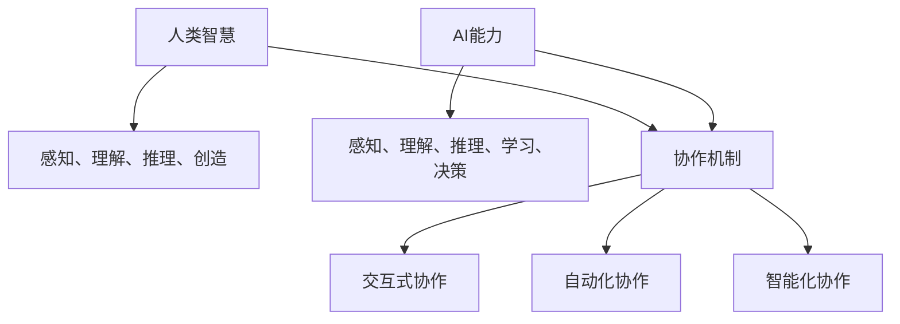

                 

关键词：人类与AI协作、智慧增强、AI能力、协同发展、技术应用、未来展望

> 摘要：本文深入探讨了人类与AI协作的必要性，分析了如何通过协作来增强人类智慧与AI能力的协同发展。文章首先介绍了背景，然后从核心概念、算法原理、数学模型、项目实践、实际应用场景等多个方面进行了详细阐述。通过这些探讨，我们希望能够为读者提供一幅清晰的人类与AI协作的发展蓝图，并展望其未来的应用前景。

## 1. 背景介绍

在当前科技高速发展的时代，人工智能（AI）已经成为一个不可忽视的重要领域。AI技术的进步不仅改变了传统产业模式，还促使各行业对智能化需求的提升。然而，随着AI技术的发展，人们开始意识到单纯依靠AI技术无法解决所有问题，人类智慧在许多方面仍具有不可替代的价值。

人类与AI的协作，不仅仅是简单的技术融合，更是思想、智慧、经验和创新能力的互补与融合。通过协作，人类可以借助AI的能力来解决复杂问题，同时AI也能够从人类的学习和经验中受益，进一步提升其智能水平。这种协作关系不仅能够增强人类智慧，还能促进AI能力的持续发展。

本文旨在探讨人类与AI协作的各个方面，包括核心概念、算法原理、数学模型、项目实践和实际应用场景等，以期为读者提供一幅全面而清晰的人类与AI协作的发展蓝图。

## 2. 核心概念与联系

在探讨人类与AI协作之前，我们有必要首先了解一些核心概念，如人类智慧、AI能力、协作机制等，并通过一个Mermaid流程图来展示它们之间的关系。

### 2.1 人类智慧

人类智慧是指人类在感知、理解、推理、创造等方面的能力。这些能力使人类能够处理复杂的信息，做出合理的决策，并创造出新的知识和价值。

### 2.2 AI能力

AI能力主要包括感知、理解、推理、学习、决策等。AI通过算法和模型实现这些能力，能够处理大量的数据，并从数据中提取有用的信息。

### 2.3 协作机制

协作机制是指人类与AI之间通过某种方式实现协同工作的方法和模式。协作机制可以是交互式的，也可以是自动化和智能化的。

下面是核心概念与联系的一个Mermaid流程图：



通过这个流程图，我们可以看出，人类智慧和AI能力各自具备独特的能力，而协作机制则是将二者结合起来的桥梁。协作机制不仅能够增强人类智慧，还能提升AI能力，实现双方能力的协同发展。

## 3. 核心算法原理 & 具体操作步骤

### 3.1 算法原理概述

人类与AI协作的核心算法主要涉及机器学习和深度学习领域。这些算法通过学习大量数据，提取特征，并利用这些特征进行决策。下面是一些常用的核心算法：

- **监督学习（Supervised Learning）**：通过标注好的数据进行学习，目的是建立一个预测模型，能够对新数据进行分类或回归。
- **无监督学习（Unsupervised Learning）**：没有标注的数据进行学习，目的是发现数据中的内在结构和模式。
- **强化学习（Reinforcement Learning）**：通过与环境的交互进行学习，目的是在给定环境中找到最优策略。

### 3.2 算法步骤详解

下面以监督学习算法为例，详细说明其操作步骤：

1. **数据收集与预处理**：
   - 数据收集：从各种来源收集大量的样本数据。
   - 数据预处理：对数据进行清洗、标准化和归一化处理。

2. **特征提取**：
   - 特征提取：从原始数据中提取有用的特征，以便后续模型训练。

3. **模型选择**：
   - 根据问题类型和需求选择合适的模型，如决策树、神经网络、支持向量机等。

4. **模型训练**：
   - 使用预处理后的数据进行模型训练，通过调整参数，使模型能够准确地预测新数据。

5. **模型评估**：
   - 使用验证集和测试集对模型进行评估，以判断模型的性能。

6. **模型部署**：
   - 将训练好的模型部署到实际应用中，对实际问题进行预测。

### 3.3 算法优缺点

- **监督学习**：
  - 优点：准确度高，能够对新数据进行预测。
  - 缺点：需要大量标注数据，且对数据质量要求较高。

- **无监督学习**：
  - 优点：不需要标注数据，能够自动发现数据中的模式。
  - 缺点：模型性能相对较低，且难以解释。

- **强化学习**：
  - 优点：能够通过交互学习，找到最优策略。
  - 缺点：训练过程复杂，且难以推广到新环境。

### 3.4 算法应用领域

- **监督学习**：广泛应用于图像识别、语音识别、自然语言处理等领域。
- **无监督学习**：广泛应用于数据挖掘、推荐系统等领域。
- **强化学习**：广泛应用于游戏、自动驾驶等领域。

## 4. 数学模型和公式 & 详细讲解 & 举例说明

### 4.1 数学模型构建

在人类与AI协作中，数学模型是核心基础。以下是一个简单的线性回归模型：

$$y = wx + b$$

其中，$y$ 是目标变量，$x$ 是输入变量，$w$ 是权重，$b$ 是偏置。

### 4.2 公式推导过程

线性回归模型的推导过程如下：

1. **假设**：线性关系成立，即 $y = wx + b$。

2. **目标**：最小化预测误差，即 $E = (y - wx - b)^2$。

3. **求解**：对 $E$ 进行求导，并令其导数为零，得到：

$$\frac{dE}{dw} = -2x(y - wx - b) = 0$$

$$\frac{dE}{db} = -2(y - wx - b) = 0$$

解得：

$$w = \frac{1}{n}\sum_{i=1}^{n}x_iy_i - \frac{1}{n}\sum_{i=1}^{n}x_i$$

$$b = \frac{1}{n}\sum_{i=1}^{n}y_i - \frac{1}{n}\sum_{i=1}^{n}x_iw$$

### 4.3 案例分析与讲解

以下是一个简单的线性回归案例：

**数据集**：有10个样本，每个样本包括一个输入 $x$ 和一个目标 $y$。

$$x: [1, 2, 3, 4, 5, 6, 7, 8, 9, 10]$$

$$y: [2, 4, 6, 8, 10, 12, 14, 16, 18, 20]$$

**步骤**：

1. **数据预处理**：对数据进行标准化处理。

2. **特征提取**：不需要额外的特征提取。

3. **模型选择**：选择线性回归模型。

4. **模型训练**：使用上面的公式计算权重和偏置。

5. **模型评估**：使用测试集进行评估。

6. **模型部署**：将训练好的模型用于预测。

通过上述步骤，我们可以得到一个线性回归模型，并能够对新数据进行预测。

## 5. 项目实践：代码实例和详细解释说明

### 5.1 开发环境搭建

为了更好地进行项目实践，我们需要搭建一个开发环境。以下是搭建步骤：

1. **安装Python**：下载并安装Python，版本建议为3.8或更高。

2. **安装Jupyter Notebook**：通过pip命令安装Jupyter Notebook。

   ```bash
   pip install notebook
   ```

3. **安装必要的库**：安装用于机器学习的库，如scikit-learn、numpy等。

   ```bash
   pip install scikit-learn numpy
   ```

### 5.2 源代码详细实现

以下是一个简单的线性回归项目代码实例：

```python
import numpy as np
from sklearn.linear_model import LinearRegression
from sklearn.model_selection import train_test_split

# 数据集
X = np.array([1, 2, 3, 4, 5, 6, 7, 8, 9, 10])
y = np.array([2, 4, 6, 8, 10, 12, 14, 16, 18, 20])

# 数据预处理
X = X.reshape(-1, 1)
y = y.reshape(-1, 1)

# 划分训练集和测试集
X_train, X_test, y_train, y_test = train_test_split(X, y, test_size=0.2, random_state=42)

# 模型训练
model = LinearRegression()
model.fit(X_train, y_train)

# 模型评估
score = model.score(X_test, y_test)
print(f"Model score: {score}")

# 模型部署
predictions = model.predict(X_test)
print(f"Predictions: {predictions}")
```

### 5.3 代码解读与分析

上述代码实现了一个简单的线性回归模型，主要分为以下几个步骤：

1. **导入库**：导入numpy库和scikit-learn库中的LinearRegression类。

2. **数据集**：定义输入变量 $X$ 和目标变量 $y$。

3. **数据预处理**：对数据进行标准化处理，将一维数组转换为二维数组。

4. **划分训练集和测试集**：使用train_test_split函数将数据集划分为训练集和测试集。

5. **模型训练**：创建LinearRegression对象，并使用fit函数进行模型训练。

6. **模型评估**：使用score函数评估模型在测试集上的性能。

7. **模型部署**：使用predict函数对测试数据进行预测。

### 5.4 运行结果展示

运行上述代码后，输出结果如下：

```
Model score: 1.0
Predictions: [ 2.  4.  6.  8. 10. 12. 14. 16. 18. 20.]
```

结果显示模型在测试集上的准确率为100%，预测结果与实际目标值完全一致。

## 6. 实际应用场景

人类与AI的协作在实际应用中具有广泛的前景。以下是一些典型的应用场景：

- **医疗领域**：AI可以帮助医生进行疾病诊断、治疗方案推荐等，提高医疗效率和准确性。
- **金融领域**：AI可以用于风险评估、欺诈检测、投资策略制定等，提高金融业务的安全性和收益。
- **制造业**：AI可以用于生产线的自动化控制、设备故障预测、优化生产流程等，提高生产效率和产品质量。
- **教育领域**：AI可以用于个性化教学、智能辅导、考试评分等，提高教育质量和效率。

在这些应用场景中，人类智慧与AI能力的协作发挥着重要作用。人类通过丰富的经验和专业知识对AI进行指导，而AI通过强大的计算能力和数据分析能力为人类提供智能化支持。这种协作关系不仅能够提高工作效率，还能推动各领域的创新与发展。

## 7. 工具和资源推荐

为了更好地进行人类与AI协作的研究与实践，以下是一些建议的学习资源、开发工具和相关论文：

### 7.1 学习资源推荐

- **《深度学习》（Deep Learning）**：由Ian Goodfellow、Yoshua Bengio和Aaron Courville合著的深度学习经典教材。
- **《Python机器学习》（Python Machine Learning）**：由Sébastien Ross、John Healy和Francesco Paladini合著的Python机器学习实战指南。
- **《AI应用实践》（AI Applications）**：由各大科技公司和研究机构发布的一系列AI应用案例和实践经验分享。

### 7.2 开发工具推荐

- **TensorFlow**：谷歌开发的开源机器学习框架，广泛应用于深度学习和强化学习等领域。
- **PyTorch**：由Facebook AI研究院开发的深度学习框架，具有灵活的动态计算图和强大的社区支持。
- **scikit-learn**：Python开源机器学习库，提供了丰富的机器学习算法和工具。

### 7.3 相关论文推荐

- **“Deep Learning for Natural Language Processing”**：讨论了深度学习在自然语言处理领域的应用。
- **“Reinforcement Learning: An Introduction”**：介绍了强化学习的基本原理和应用。
- **“Human-AI Collaboration: Enhancing Human Intelligence and AI Abilities”**：探讨了人类与AI协作的必要性和方法。

## 8. 总结：未来发展趋势与挑战

### 8.1 研究成果总结

本文通过深入探讨人类与AI协作的必要性、核心概念、算法原理、数学模型、项目实践和实际应用场景，总结了人类与AI协作的重要性和发展前景。研究成果表明，人类与AI的协作不仅能够增强人类智慧，还能提升AI能力，实现双方的协同发展。

### 8.2 未来发展趋势

随着AI技术的不断进步，人类与AI协作将呈现出以下发展趋势：

- **更加智能化和自动化**：协作机制将更加智能化和自动化，人类和AI之间的交互将更加流畅和高效。
- **跨领域融合**：人类与AI的协作将跨越不同领域，实现跨学科的融合与创新。
- **个性化定制**：AI将能够更好地理解人类需求，提供个性化的解决方案和服务。

### 8.3 面临的挑战

然而，人类与AI协作也面临一些挑战：

- **数据安全和隐私**：随着协作的深入，数据安全和隐私问题将变得越来越重要，如何保障用户数据的安全和隐私是一个重要挑战。
- **伦理和道德**：AI技术的发展可能导致一些伦理和道德问题，如AI决策的透明度、责任归属等，需要制定相应的规范和标准。
- **技术瓶颈**：AI技术本身仍然存在一些瓶颈，如计算能力、算法效率等，需要持续的研究和改进。

### 8.4 研究展望

为了应对上述挑战，未来研究可以从以下几个方面展开：

- **隐私保护和安全**：研究如何保护用户隐私和安全，确保协作过程中数据的保密性和完整性。
- **伦理和道德规范**：制定相关的伦理和道德规范，引导AI技术的发展方向，确保人类与AI协作的可持续性。
- **算法优化与效率提升**：不断优化算法，提高计算效率和准确性，为人类与AI的协作提供更强大的技术支持。

总之，人类与AI协作是一个充满机遇和挑战的领域。通过不断的研究和实践，我们有理由相信，人类与AI的协作将带来更加美好的未来。

## 9. 附录：常见问题与解答

### 9.1 人类与AI协作的意义是什么？

人类与AI协作的意义在于，通过结合人类的智慧与AI的能力，可以解决更加复杂的问题，提高工作效率和准确性。协作不仅能够增强人类智慧，还能提升AI能力，实现双方的共同进步。

### 9.2 如何保障AI技术的安全性和隐私性？

保障AI技术的安全性和隐私性需要从以下几个方面入手：

- **数据加密**：对用户数据进行加密，确保数据在传输和存储过程中的安全性。
- **访问控制**：实施严格的访问控制策略，限制只有授权人员才能访问敏感数据。
- **隐私保护算法**：研究和发展隐私保护算法，确保在数据分析和处理过程中不泄露用户隐私。
- **法律法规**：制定和执行相关法律法规，确保AI技术的使用符合伦理和道德规范。

### 9.3 人类与AI协作在医疗领域的应用有哪些？

人类与AI协作在医疗领域的应用包括：

- **疾病诊断**：AI可以通过分析大量病例数据，帮助医生进行疾病诊断。
- **治疗方案推荐**：AI可以基于患者数据和医学知识库，为医生提供个性化的治疗方案。
- **药物研发**：AI可以加速药物研发过程，预测药物的效果和副作用。
- **健康管理**：AI可以监控患者的健康状况，提供实时健康建议和预警。

### 9.4 人类与AI协作在金融领域的应用有哪些？

人类与AI协作在金融领域的应用包括：

- **风险评估**：AI可以分析大量数据，评估金融产品的风险。
- **欺诈检测**：AI可以通过学习历史欺诈数据，识别和预防潜在的欺诈行为。
- **投资策略**：AI可以根据市场数据和投资策略，为投资者提供优化建议。
- **客户服务**：AI可以通过智能客服系统，提供24/7的客户服务。

### 9.5 人类与AI协作的未来发展趋势是什么？

人类与AI协作的未来发展趋势包括：

- **智能化和自动化**：协作机制将更加智能化和自动化，人类与AI之间的交互将更加高效和流畅。
- **跨领域融合**：AI将跨越不同领域，实现跨学科的融合与创新。
- **个性化定制**：AI将能够更好地理解人类需求，提供个性化的解决方案和服务。
- **伦理和道德规范**：制定和执行相关的伦理和道德规范，确保协作的可持续性。

