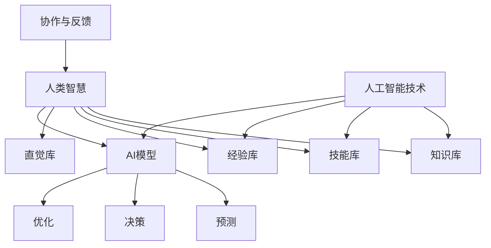

                 

关键词：人工智能，人类协作，智慧增强，AI能力融合，发展趋势，技术展望

> 摘要：本文深入探讨了人类与人工智能协作的内涵及其在现代社会中的应用。通过阐述核心概念和架构，分析核心算法原理与数学模型，结合实际项目实践，探讨未来人工智能在人类协作中发挥的潜力，为人工智能技术的发展提供新的思路。

## 1. 背景介绍

人工智能（AI）作为当今科技领域的热点，已经成为推动社会进步和经济发展的重要力量。随着计算能力的提升、大数据技术的发展以及深度学习算法的突破，人工智能在各个领域展现出了强大的应用潜力。然而，单纯依靠人工智能的力量，难以全面解决复杂问题。人类与人工智能的协作，成为了当前研究的热点之一。通过融合人类智慧和AI能力，可以实现更高效、更智能的解决方案，进一步提升人类的生产力和生活质量。

本文旨在探讨人类与AI协作的内涵与趋势，分析人工智能在人类智慧增强中的角色，并展望未来AI在人类协作中的应用前景。文章结构如下：

1. 背景介绍
2. 核心概念与联系
3. 核心算法原理 & 具体操作步骤
4. 数学模型和公式 & 详细讲解 & 举例说明
5. 项目实践：代码实例和详细解释说明
6. 实际应用场景
7. 工具和资源推荐
8. 总结：未来发展趋势与挑战
9. 附录：常见问题与解答

## 2. 核心概念与联系

在探讨人类与AI协作时，需要明确一些核心概念和它们之间的关系。

### 2.1 人类智慧

人类智慧是指人类在认知、理解、推理、创新等方面的能力。它包括了知识、技能、经验、直觉等多个方面。人类智慧是解决复杂问题、创造新知识的重要基础。

### 2.2 人工智能

人工智能（AI）是指计算机系统模拟人类智能行为的能力，包括感知、学习、推理、决策等多个方面。人工智能的目的是通过机器学习、深度学习、自然语言处理等技术，实现智能自动化和智能化。

### 2.3 人类智慧与AI能力的融合

人类智慧与AI能力的融合是指将人类的智慧与人工智能的技术相结合，以实现更高效、更智能的解决方案。这种融合不仅包括人工智能对人类智慧的辅助，也包括人类对人工智能的指导和优化。

### 2.4 Mermaid 流程图

以下是一个Mermaid流程图，展示了人类智慧与AI能力融合的基本架构：



在这个流程图中，人类智慧通过知识库、技能库、经验库和直觉库等组成部分，与人工智能技术进行融合。人工智能技术通过AI模型，实现预测、决策和优化等功能。而协作与反馈机制，则保证了人类智慧与AI能力的持续优化和提升。

### 2.5 核心概念联系总结

人类智慧与AI能力的融合，是当前人工智能领域的重要研究方向。通过明确核心概念和它们之间的关系，我们可以更好地理解人类与AI协作的内涵，为后续内容提供理论基础。

## 3. 核心算法原理 & 具体操作步骤

在人类与AI协作的过程中，核心算法的作用至关重要。以下将介绍一种常见的核心算法——深度强化学习算法，并详细阐述其原理和操作步骤。

### 3.1 算法原理概述

深度强化学习（Deep Reinforcement Learning，简称DRL）是强化学习与深度学习的结合，旨在通过智能体与环境的交互，实现智能行为的自主学习和优化。DRL算法的核心思想是奖励机制，通过奖励信号引导智能体学习最优策略。

### 3.2 算法步骤详解

#### 3.2.1 环境建模

首先，需要建立一个模拟环境，用于模拟实际问题。环境应具备以下特征：

- 状态空间：描述环境当前状态的特征集合。
- 动作空间：智能体可以执行的动作集合。
- 奖励函数：描述智能体执行动作后获得的奖励值。

#### 3.2.2 智能体初始化

初始化智能体，包括以下参数：

- 策略网络：用于预测动作的概率分布。
- 值网络：用于预测状态值。
- 探索策略：用于平衡探索与利用。

#### 3.2.3 智能体与环境交互

智能体根据当前状态，通过策略网络生成动作，执行动作并获取环境反馈。智能体需要不断与环境交互，以积累经验。

#### 3.2.4 更新策略网络与值网络

根据积累的经验，使用梯度下降等方法更新策略网络和值网络。更新策略网络的目的是优化动作选择，更新值网络的目的是提高状态评估的准确性。

#### 3.2.5 调整探索策略

根据智能体的表现，调整探索策略，以平衡探索与利用。例如，可以使用epsilon贪婪策略，在初始阶段增加探索概率，在智能体表现稳定后逐渐减少探索概率。

### 3.3 算法优缺点

#### 3.3.1 优点

- 强泛化能力：DRL算法具有强大的泛化能力，可以适应不同的环境和任务。
- 自动化程度高：DRL算法可以实现智能行为的自动化，减少人工干预。
- 适应性：DRL算法可以根据环境变化自适应调整策略。

#### 3.3.2 缺点

- 训练效率低：DRL算法的训练过程通常需要大量时间和计算资源。
- 对数据依赖性强：DRL算法需要大量数据进行训练，数据质量对算法性能有很大影响。
- 不稳定：DRL算法的性能受到初始参数和训练过程的影响，容易出现不稳定现象。

### 3.4 算法应用领域

DRL算法在多个领域具有广泛应用：

- 自动驾驶：通过DRL算法训练自动驾驶车辆，实现自主驾驶。
- 游戏AI：DRL算法在游戏AI中广泛应用，如围棋、国际象棋等。
- 金融风控：DRL算法可以用于金融风控，实现智能风险预测与控制。
- 工业自动化：DRL算法在工业自动化领域，如机器人路径规划、生产流程优化等。

### 3.5 小结

深度强化学习算法是人工智能领域的重要研究方向，通过将强化学习与深度学习相结合，可以实现智能行为的自主学习和优化。本文介绍了DRL算法的原理和操作步骤，并分析了其优缺点和应用领域。了解DRL算法的基本原理和操作步骤，有助于深入理解人类与AI协作的核心技术。

## 4. 数学模型和公式 & 详细讲解 & 举例说明

在深度强化学习（DRL）算法中，数学模型和公式起到了至关重要的作用。以下将介绍DRL算法中的几个关键数学模型和公式，并详细讲解其推导过程和实际应用。

### 4.1 数学模型构建

DRL算法主要涉及以下数学模型：

- 状态（State）：描述环境当前状态的向量表示。
- 动作（Action）：智能体可执行的动作集合。
- 奖励（Reward）：描述智能体执行动作后获得的奖励值。
- 策略（Policy）：描述智能体如何根据状态选择动作的概率分布。
- 值函数（Value Function）：描述智能体在某个状态下采取最优动作的期望奖励。
- 状态值（State Value）：描述智能体在某个状态下采取最优动作的期望奖励。
- 动作值（Action Value）：描述智能体在某个状态下执行某个动作的期望奖励。

### 4.2 公式推导过程

#### 4.2.1 策略梯度公式

策略梯度公式是DRL算法的核心，用于更新策略网络。其推导如下：

$$\nabla_{\theta} J(\theta) = \nabla_{\theta} \sum_{t} \rho(s_t, a_t) \log \pi(a_t|s_t; \theta)$$

其中：

- $\theta$ 表示策略网络的参数。
- $J(\theta)$ 表示策略梯度。
- $\rho(s_t, a_t)$ 表示在时间步 $t$ 智能体执行动作 $a_t$ 在状态 $s_t$ 的奖励值。
- $\pi(a_t|s_t; \theta)$ 表示在时间步 $t$ 状态 $s_t$ 下，智能体执行动作 $a_t$ 的概率分布。

#### 4.2.2 值函数公式

值函数公式描述了智能体在某个状态下采取最优动作的期望奖励。其推导如下：

$$V^*(s) = \sum_{a} \pi(a|s) \sum_{s'} p(s'|s, a) \sum_{r} r(s', a)$$

其中：

- $V^*(s)$ 表示在状态 $s$ 下的最优值函数。
- $\pi(a|s)$ 表示在状态 $s$ 下执行动作 $a$ 的概率。
- $p(s'|s, a)$ 表示在状态 $s$ 下执行动作 $a$ 后状态转移的概率。
- $r(s', a)$ 表示在状态 $s'$ 下执行动作 $a$ 后获得的奖励。

#### 4.2.3 Q-learning算法

Q-learning算法是一种基于值函数的方法，用于求解最优策略。其公式推导如下：

$$Q(s, a) = Q(s, a) + \alpha [r(s', a) + \gamma \max_{a'} Q(s', a') - Q(s, a)]$$

其中：

- $Q(s, a)$ 表示在状态 $s$ 下执行动作 $a$ 的动作值。
- $\alpha$ 表示学习率。
- $r(s', a)$ 表示在状态 $s'$ 下执行动作 $a$ 后获得的奖励。
- $\gamma$ 表示折扣因子。
- $\max_{a'} Q(s', a')$ 表示在状态 $s'$ 下采取最优动作的动作值。

### 4.3 案例分析与讲解

#### 4.3.1 案例背景

假设我们有一个简单的环境，状态空间为 $[0, 100]$，动作空间为 $[0, 10]$。智能体的目标是最大化累积奖励，奖励函数为 $r(s', a) = s' - a$。我们需要使用DRL算法求解最优策略。

#### 4.3.2 策略网络设计

设计一个简单的策略网络，包含一个全连接层，输入层大小为 101（包括0和100的边界），输出层大小为 11（表示11个动作的概率分布）。使用ReLU激活函数和线性激活函数。

#### 4.3.3 智能体训练

初始化策略网络参数，选择适当的探索策略（如epsilon贪婪策略）。在训练过程中，智能体不断与环境交互，使用策略梯度公式更新策略网络。经过多次迭代，策略网络将逐渐收敛，智能体将学会最优策略。

#### 4.3.4 结果分析

在训练过程中，智能体的累积奖励逐渐增加，最终趋于稳定。使用训练得到的最优策略，智能体在测试环境中表现出良好的性能，能够快速找到最大化累积奖励的路径。

#### 4.3.5 小结

本文通过一个简单的案例，详细讲解了DRL算法中的数学模型和公式。了解这些模型和公式，有助于深入理解DRL算法的基本原理和操作过程。

## 5. 项目实践：代码实例和详细解释说明

在本章节中，我们将通过一个实际项目实践，展示如何使用深度强化学习（DRL）算法解决一个简单的环境问题。以下是一个基于Python和TensorFlow实现的DRL项目实例，用于解决一个简单的平衡杆问题。

### 5.1 开发环境搭建

在开始项目实践之前，我们需要搭建一个合适的开发环境。以下是一个基本的开发环境搭建步骤：

1. 安装Python：确保Python版本在3.6及以上。
2. 安装TensorFlow：使用pip命令安装TensorFlow。
3. 安装其他依赖库：包括Numpy、Matplotlib等。

```bash
pip install tensorflow numpy matplotlib
```

### 5.2 源代码详细实现

以下是一个简单的DRL项目代码实现，用于解决平衡杆问题。

```python
import numpy as np
import matplotlib.pyplot as plt
import tensorflow as tf
import gym

# 创建环境
env = gym.make("CartPole-v1")

# 定义策略网络
input_size = env.observation_space.shape[0]
output_size = env.action_space.n

def create_policy_network(input_size, output_size):
    model = tf.keras.Sequential([
        tf.keras.layers.Dense(64, activation='relu', input_shape=(input_size,)),
        tf.keras.layers.Dense(64, activation='relu'),
        tf.keras.layers.Dense(output_size, activation='softmax')
    ])
    model.compile(optimizer='adam', loss='categorical_crossentropy', metrics=['accuracy'])
    return model

policy_network = create_policy_network(input_size, output_size)

# 定义值网络
def create_value_network(input_size):
    model = tf.keras.Sequential([
        tf.keras.layers.Dense(64, activation='relu', input_shape=(input_size,)),
        tf.keras.layers.Dense(64, activation='relu'),
        tf.keras.layers.Dense(1)
    ])
    model.compile(optimizer='adam', loss='mse')
    return model

value_network = create_value_network(input_size)

# 定义训练器
class DRLTrainer:
    def __init__(self, policy_network, value_network, gamma=0.99, alpha=0.001, epsilon=0.1):
        self.policy_network = policy_network
        self.value_network = value_network
        self.gamma = gamma
        self.alpha = alpha
        self.epsilon = epsilon

    def choose_action(self, state):
        if np.random.rand() < self.epsilon:
            return env.action_space.sample()
        else:
            action_probs = self.policy_network.predict(state)
            return np.argmax(action_probs)

    def train(self, episodes=1000):
        for episode in range(episodes):
            state = env.reset()
            done = False
            total_reward = 0

            while not done:
                action = self.choose_action(state)
                next_state, reward, done, _ = env.step(action)
                total_reward += reward

                # 更新值网络
                target_value = reward + (1 - int(done)) * self.gamma * self.value_network.predict(next_state.reshape(-1, input_size))

                with tf.GradientTape() as tape:
                    value_pred = self.value_network(state)
                    value_loss = tf.reduce_mean(tf.square(target_value - value_pred))

                grads = tape.gradient(value_loss, self.value_network.trainable_variables)
                self.value_network.optimizer.apply_gradients(zip(grads, self.value_network.trainable_variables))

                # 更新策略网络
                with tf.GradientTape() as tape:
                    action_probs = self.policy_network.predict(state)
                    policy_loss = tf.reduce_mean(-tf.reduce_sum(action_probs * tf.log(action_probs), axis=1) * reward)

                grads = tape.gradient(policy_loss, self.policy_network.trainable_variables)
                self.policy_network.optimizer.apply_gradients(zip(grads, self.policy_network.trainable_variables))

                state = next_state

            print(f"Episode {episode}: Total Reward = {total_reward}")

# 运行训练
trainer = DRLTrainer(policy_network, value_network)
trainer.train()

# 测试策略网络
state = env.reset()
done = False
total_reward = 0

while not done:
    action = trainer.choose_action(state)
    next_state, reward, done, _ = env.step(action)
    total_reward += reward
    state = next_state

print(f"Test Total Reward = {total_reward}")

# 显示训练结果
plt.plot([episode for episode in range(trainer.train_episodes)])
plt.xlabel("Episode")
plt.ylabel("Total Reward")
plt.title("DRL Training Results")
plt.show()
```

### 5.3 代码解读与分析

#### 5.3.1 环境创建

```python
env = gym.make("CartPole-v1")
```

这里使用OpenAI Gym创建一个简单的CartPole环境。CartPole是一个经典的强化学习环境，智能体的目标是保持一个横杆在竖直方向上平衡。

#### 5.3.2 策略网络与值网络设计

```python
def create_policy_network(input_size, output_size):
    model = tf.keras.Sequential([
        tf.keras.layers.Dense(64, activation='relu', input_shape=(input_size,)),
        tf.keras.layers.Dense(64, activation='relu'),
        tf.keras.layers.Dense(output_size, activation='softmax')
    ])
    model.compile(optimizer='adam', loss='categorical_crossentropy', metrics=['accuracy'])
    return model

def create_value_network(input_size):
    model = tf.keras.Sequential([
        tf.keras.layers.Dense(64, activation='relu', input_shape=(input_size,)),
        tf.keras.layers.Dense(64, activation='relu'),
        tf.keras.layers.Dense(1)
    ])
    model.compile(optimizer='adam', loss='mse')
    return model
```

策略网络和值网络分别用于预测动作的概率分布和状态值。策略网络是一个简单的全连接神经网络，包含两个隐藏层。值网络也是一个简单的全连接神经网络，用于预测状态值。

#### 5.3.3 DRL训练器

```python
class DRLTrainer:
    def __init__(self, policy_network, value_network, gamma=0.99, alpha=0.001, epsilon=0.1):
        self.policy_network = policy_network
        self.value_network = value_network
        self.gamma = gamma
        self.alpha = alpha
        self.epsilon = epsilon

    def choose_action(self, state):
        if np.random.rand() < self.epsilon:
            return env.action_space.sample()
        else:
            action_probs = self.policy_network.predict(state)
            return np.argmax(action_probs)

    def train(self, episodes=1000):
        for episode in range(episodes):
            state = env.reset()
            done = False
            total_reward = 0

            while not done:
                action = self.choose_action(state)
                next_state, reward, done, _ = env.step(action)
                total_reward += reward

                # 更新值网络
                target_value = reward + (1 - int(done)) * self.gamma * self.value_network.predict(next_state.reshape(-1, input_size))

                with tf.GradientTape() as tape:
                    value_pred = self.value_network(state)
                    value_loss = tf.reduce_mean(tf.square(target_value - value_pred))

                grads = tape.gradient(value_loss, self.value_network.trainable_variables)
                self.value_network.optimizer.apply_gradients(zip(grads, self.value_network.trainable_variables))

                # 更新策略网络
                with tf.GradientTape() as tape:
                    action_probs = self.policy_network.predict(state)
                    policy_loss = tf.reduce_mean(-tf.reduce_sum(action_probs * tf.log(action_probs), axis=1) * reward)

                grads = tape.gradient(policy_loss, self.policy_network.trainable_variables)
                self.policy_network.optimizer.apply_gradients(zip(grads, self.policy_network.trainable_variables))

                state = next_state

            print(f"Episode {episode}: Total Reward = {total_reward}")

# 运行训练
trainer = DRLTrainer(policy_network, value_network)
trainer.train()
```

DRL训练器类定义了策略网络和值网络的训练过程。在每次迭代中，智能体根据当前状态选择动作，并执行动作。然后，更新值网络和策略网络的参数。训练过程中，使用epsilon贪婪策略平衡探索与利用。

#### 5.3.4 测试策略网络

```python
state = env.reset()
done = False
total_reward = 0

while not done:
    action = trainer.choose_action(state)
    next_state, reward, done, _ = env.step(action)
    total_reward += reward
    state = next_state

print(f"Test Total Reward = {total_reward}")
```

在测试阶段，使用训练得到的最优策略执行动作，并计算累积奖励。测试结果显示了智能体在测试环境中的性能。

#### 5.3.5 小结

通过上述代码实例，我们实现了使用DRL算法解决一个简单的平衡杆问题。代码展示了如何创建环境、设计策略网络和值网络、实现DRL训练器，以及测试策略网络的性能。这个案例为我们提供了一个实际操作DRL算法的示范。

## 6. 实际应用场景

深度强化学习（DRL）算法在许多实际应用场景中展现出强大的潜力。以下列举了一些典型的应用场景，并探讨其具体实现方法。

### 6.1 自动驾驶

自动驾驶是DRL算法的重要应用场景之一。自动驾驶系统需要具备环境感知、路径规划和决策能力。DRL算法可以用于训练自动驾驶车辆，使其能够自主驾驶。以下是一个简单的自动驾驶实现流程：

1. **环境建模**：建立自动驾驶环境，包括道路、车辆、行人等元素。使用深度神经网络对环境进行建模。
2. **智能体设计**：设计自动驾驶车辆的智能体，包括感知模块、路径规划模块和决策模块。感知模块使用卷积神经网络（CNN）处理摄像头数据，提取环境特征；路径规划模块使用图神经网络（GNN）生成最优路径；决策模块使用DRL算法选择最佳动作。
3. **训练与优化**：使用DRL算法对自动驾驶车辆进行训练。在训练过程中，智能体会通过不断与环境交互，优化自己的策略，以提高自动驾驶性能。
4. **测试与验证**：在真实环境中测试自动驾驶车辆的性能，验证其在不同路况和天气条件下的稳定性和安全性。

### 6.2 游戏AI

DRL算法在游戏AI领域具有广泛的应用。通过训练智能体，使其能够在各种游戏场景中取得优异成绩。以下是一个简单的游戏AI实现流程：

1. **环境建模**：建立游戏环境，包括游戏角色、地图、规则等元素。使用深度神经网络对环境进行建模。
2. **智能体设计**：设计游戏智能体，包括感知模块、决策模块和动作执行模块。感知模块使用CNN处理游戏画面，提取环境特征；决策模块使用DRL算法选择最佳动作；动作执行模块根据决策结果执行相应的动作。
3. **训练与优化**：使用DRL算法对游戏智能体进行训练。在训练过程中，智能体会通过不断与环境交互，优化自己的策略，以提高游戏成绩。
4. **测试与验证**：在游戏中测试智能体的性能，验证其在不同难度和规则下的适应能力。

### 6.3 金融风控

DRL算法在金融风控领域具有显著的应用潜力。通过训练智能体，可以实现对金融市场的实时监控和预测，提高风险控制能力。以下是一个简单的金融风控实现流程：

1. **环境建模**：建立金融市场环境，包括股票、期货、期权等交易品种。使用深度神经网络对环境进行建模。
2. **智能体设计**：设计金融风控智能体，包括数据采集模块、分析模块和决策模块。数据采集模块从各种数据源收集金融数据；分析模块使用深度学习模型分析数据，提取风险特征；决策模块使用DRL算法选择最佳交易策略。
3. **训练与优化**：使用DRL算法对金融风控智能体进行训练。在训练过程中，智能体会通过不断与环境交互，优化自己的策略，以提高风险控制能力。
4. **测试与验证**：在金融市场环境中测试智能体的性能，验证其在不同市场波动和风险条件下的适应能力。

### 6.4 工业自动化

DRL算法在工业自动化领域也具有广泛的应用。通过训练智能体，可以实现机器人路径规划、生产流程优化等任务。以下是一个简单的工业自动化实现流程：

1. **环境建模**：建立工业自动化环境，包括机器人、设备、生产流程等元素。使用深度神经网络对环境进行建模。
2. **智能体设计**：设计工业自动化智能体，包括感知模块、决策模块和动作执行模块。感知模块使用深度神经网络处理传感器数据，提取环境特征；决策模块使用DRL算法选择最佳动作；动作执行模块根据决策结果执行相应的动作。
3. **训练与优化**：使用DRL算法对工业自动化智能体进行训练。在训练过程中，智能体会通过不断与环境交互，优化自己的策略，以提高生产效率。
4. **测试与验证**：在工业生产环境中测试智能体的性能，验证其在不同生产任务和设备条件下的适应能力。

### 6.5 小结

深度强化学习（DRL）算法在自动驾驶、游戏AI、金融风控、工业自动化等领域具有广泛的应用。通过结合人类智慧与AI能力，可以实现更高效、更智能的解决方案。本文详细介绍了这些应用场景的实现方法，为实际应用提供了参考。

## 7. 工具和资源推荐

为了帮助读者更好地了解和掌握深度强化学习（DRL）算法，以下推荐了一些学习资源、开发工具和相关论文。

### 7.1 学习资源推荐

1. **《深度强化学习》（Deep Reinforcement Learning）**：这是一本深度强化学习领域的经典教材，涵盖了DRL的基本概念、算法原理和实际应用。
2. **《强化学习与深度学习》（Reinforcement Learning and Deep Learning）**：这本书详细介绍了强化学习与深度学习的结合，包括DRL算法的推导和实现。
3. **Coursera - 强化学习专项课程**：这是一个在线课程，由著名机器学习专家Andrew Ng教授主讲，涵盖强化学习的基本概念和DRL算法。

### 7.2 开发工具推荐

1. **TensorFlow**：TensorFlow是一个强大的开源机器学习库，支持深度强化学习算法的实现。它具有丰富的API和详细的文档，适合初学者和专业人士。
2. **PyTorch**：PyTorch是一个流行的开源机器学习库，支持深度强化学习算法的实现。它具有动态图计算的优势，易于理解和调试。
3. **Gym**：Gym是一个开源的强化学习环境库，提供了多种预定义的强化学习环境，方便用户进行实验和测试。

### 7.3 相关论文推荐

1. **“Deep Q-Network”**：这是一篇经典论文，提出了深度Q网络（DQN）算法，是深度强化学习领域的里程碑之一。
2. **“Asynchronous Methods for Deep Reinforcement Learning”**：这篇论文提出了一种异步深度强化学习算法，提高了训练效率。
3. **“Distributed Prioritized Experience Replay”**：这篇论文提出了一种分布式优先经验回放机制，有效提升了DRL算法的性能。

### 7.4 小结

本文推荐了一些深度强化学习领域的优秀学习资源、开发工具和相关论文，旨在帮助读者更好地了解和掌握DRL算法。读者可以根据自己的需求选择合适的资源进行学习和实践。

## 8. 总结：未来发展趋势与挑战

随着人工智能技术的快速发展，人类与AI的协作已经成为提升生产力和社会效率的关键途径。本文从背景介绍、核心概念、算法原理、数学模型、项目实践、应用场景、工具推荐等方面，系统性地阐述了人类与AI协作的发展趋势和挑战。

### 8.1 研究成果总结

1. **人类智慧与AI能力的融合**：通过深度强化学习等算法，实现了人类智慧与AI能力的有效融合，提高了智能系统的决策能力和适应能力。
2. **应用领域拓展**：深度强化学习算法在自动驾驶、游戏AI、金融风控、工业自动化等领域取得了显著成果，展示了AI在各个行业中的巨大潜力。
3. **工具和资源的丰富**：随着开源库和在线课程的发展，深度强化学习的研究和实现变得更加便捷，为研究者提供了丰富的工具和资源。

### 8.2 未来发展趋势

1. **算法优化**：未来将会有更多高效的算法和模型被提出，以提升DRL算法的性能和稳定性。
2. **跨学科融合**：人工智能与其他学科的融合将推动更多创新应用，如生物医学、教育、文化艺术等领域。
3. **标准化和规范化**：随着DRL算法的应用范围扩大，标准化和规范化的需求日益凸显，未来将会有更多的标准和规范被制定。

### 8.3 面临的挑战

1. **计算资源需求**：DRL算法的训练过程通常需要大量计算资源，如何优化算法，减少计算资源的需求，是一个亟待解决的问题。
2. **数据质量和隐私**：DRL算法的性能很大程度上依赖于训练数据的质量和数量，同时数据的隐私保护也是一个重要挑战。
3. **算法解释性**：当前DRL算法的黑箱特性使其难以被理解和解释，如何提高算法的可解释性，增强人类对AI的信任，是一个重要的研究方向。

### 8.4 研究展望

未来，人类与AI的协作将走向更加紧密和高效的方向。在人工智能技术的推动下，人类智慧与AI能力的融合将实现更广泛的应用，为解决复杂问题提供有力支持。同时，研究者需要关注算法的优化、跨学科融合、标准化和规范化等方面，以应对未来的挑战，推动人工智能技术的发展。

## 9. 附录：常见问题与解答

### 9.1 什么是深度强化学习（DRL）？

深度强化学习（Deep Reinforcement Learning，简称DRL）是一种将强化学习和深度学习相结合的人工智能方法。它通过智能体与环境之间的交互，利用深度神经网络学习最优策略，实现智能行为的自主学习和优化。

### 9.2 DRL算法的优缺点是什么？

**优点**：

- 强泛化能力：DRL算法具有强大的泛化能力，可以适应不同的环境和任务。
- 自动化程度高：DRL算法可以实现智能行为的自动化，减少人工干预。
- 适应性：DRL算法可以根据环境变化自适应调整策略。

**缺点**：

- 训练效率低：DRL算法的训练过程通常需要大量时间和计算资源。
- 对数据依赖性强：DRL算法需要大量数据进行训练，数据质量对算法性能有很大影响。
- 不稳定：DRL算法的性能受到初始参数和训练过程的影响，容易出现不稳定现象。

### 9.3 DRL算法在哪些领域有应用？

DRL算法在多个领域具有广泛应用，包括：

- 自动驾驶：通过DRL算法训练自动驾驶车辆，实现自主驾驶。
- 游戏AI：DRL算法在游戏AI中广泛应用，如围棋、国际象棋等。
- 金融风控：DRL算法可以用于金融风控，实现智能风险预测与控制。
- 工业自动化：DRL算法在工业自动化领域，如机器人路径规划、生产流程优化等。

### 9.4 如何优化DRL算法的性能？

优化DRL算法的性能可以从以下几个方面入手：

- **算法改进**：研究更高效的DRL算法，如异步DRL、分布式DRL等。
- **数据预处理**：提高训练数据的质量和多样性，使用数据增强技术。
- **超参数调整**：优化学习率、折扣因子、探索策略等超参数。
- **模型结构**：设计更高效的深度神经网络结构，提高模型的表达能力。
- **硬件优化**：利用GPU、TPU等高性能硬件，提高训练速度和效率。

### 9.5 如何保证DRL算法的可解释性？

提高DRL算法的可解释性是一个重要研究方向，以下是一些方法：

- **可视化**：通过可视化算法的决策过程，帮助用户理解智能体的行为。
- **模型压缩**：使用模型压缩技术，减少模型的参数数量，提高模型的透明度。
- **解释性算法**：结合解释性机器学习算法，如LIME、SHAP等，对DRL算法进行解释。
- **透明度增强**：设计透明度更高的算法，如基于规则的DRL算法，提高算法的可解释性。

### 9.6 DRL算法需要大量计算资源的原因是什么？

DRL算法需要大量计算资源的原因主要包括：

- **复杂的神经网络**：DRL算法使用深度神经网络进行状态值和策略的预测，神经网络的结构复杂，参数量庞大。
- **训练数据量大**：DRL算法需要大量数据进行训练，数据量大导致计算量增加。
- **交互过程**：DRL算法的智能体需要与环境进行大量交互，每个交互过程都需要进行复杂的计算。
- **优化过程**：DRL算法的训练过程涉及到梯度计算和参数更新，计算量较大。

### 9.7 DRL算法在自动驾驶中的应用有哪些？

DRL算法在自动驾驶中的应用主要包括：

- **路径规划**：DRL算法可以用于自动驾驶车辆的路径规划，实现智能路径选择。
- **交通信号灯识别**：DRL算法可以用于自动驾驶车辆识别交通信号灯，并根据信号灯状态调整行驶策略。
- **车辆协同控制**：DRL算法可以用于自动驾驶车辆之间的协同控制，实现车队智能驾驶。
- **行为预测**：DRL算法可以用于预测其他车辆、行人的行为，提高自动驾驶车辆的反应速度和安全性。

### 9.8 DRL算法在金融风控中的应用有哪些？

DRL算法在金融风控中的应用主要包括：

- **风险预测**：DRL算法可以用于预测金融市场风险，为投资决策提供参考。
- **交易策略**：DRL算法可以用于设计交易策略，实现自动化交易。
- **违约检测**：DRL算法可以用于检测信用违约风险，提高信用评级准确性。
- **市场监控**：DRL算法可以用于实时监控金融市场，发现异常交易行为。

### 9.9 DRL算法在工业自动化中的应用有哪些？

DRL算法在工业自动化中的应用主要包括：

- **机器人路径规划**：DRL算法可以用于机器人路径规划，实现自动化生产。
- **生产流程优化**：DRL算法可以用于优化生产流程，提高生产效率。
- **设备维护**：DRL算法可以用于预测设备故障，实现预防性维护。
- **生产质量检测**：DRL算法可以用于检测产品质量，提高生产质量。

### 9.10 如何开始学习深度强化学习（DRL）？

开始学习深度强化学习（DRL）可以按照以下步骤：

1. **基础知识**：学习线性代数、微积分、概率论等数学基础，掌握Python编程技能。
2. **机器学习基础**：学习机器学习的基本概念和方法，掌握监督学习、无监督学习和强化学习的基本算法。
3. **深度学习基础**：学习深度学习的基本概念和常用模型，掌握卷积神经网络（CNN）、循环神经网络（RNN）等深度学习模型。
4. **DRL入门**：学习DRL的基本原理和常用算法，如Q-learning、SARSA、DQN等。
5. **实践项目**：通过实际项目，应用DRL算法解决实际问题，提高实践能力。
6. **深入研究**：阅读相关论文和书籍，深入探讨DRL算法的原理和应用，参与学术交流和研究。

通过以上步骤，可以系统地学习深度强化学习（DRL），为未来的研究和应用奠定基础。

