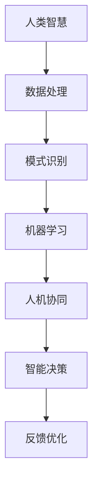

                 

关键词：人工智能、人类智慧、认知计算、机器学习、深度学习、人机协同

摘要：随着人工智能技术的飞速发展，人类智慧正面临前所未有的挑战与机遇。本文从多个角度探讨了人工智能时代人类智慧的新形态、新特点以及未来发展趋势，并提出了在AI时代中人类智慧与人工智能协同发展的策略。

## 1. 背景介绍

人工智能（AI）作为21世纪最具革命性的技术之一，正在改变我们的生活方式、工作方式以及思考方式。从早期的专家系统到如今的深度学习，人工智能已经取得了巨大的进步。然而，随着人工智能技术的不断演进，人类智慧是否能够保持其独特性？人类与人工智能的关系将如何发展？这些问题成为当前技术研究和讨论的热点。

人工智能并非简单地复制人类智慧，而是在特定的任务和场景中超越人类的能力。这种超越不仅体现在计算速度和存储能力上，还包括在处理海量数据、进行模式识别和决策制定等方面的优势。然而，这些优势同时也引发了关于人类智慧地位的担忧。

## 2. 核心概念与联系

### 2.1 人工智能的定义与分类

人工智能是指通过计算机模拟人类智能的过程，使其能够在特定任务中表现出类似人类的认知能力。根据实现方式的不同，人工智能可以分为：

- **符号人工智能**：基于逻辑推理和符号计算，如专家系统。
- **统计人工智能**：基于统计模型和机器学习算法，如深度学习和强化学习。
- **混合人工智能**：结合符号和统计方法，如知识图谱和自然语言处理。

### 2.2 人类智慧的特点

人类智慧具有以下特点：

- **普适性**：人类智慧能够处理各种类型的任务和问题。
- **创造性**：人类能够进行创新和发明，解决之前从未遇到过的问题。
- **情感性**：人类具有情感和价值观，能够在复杂的社会环境中做出道德和伦理决策。
- **学习能力**：人类能够通过经验不断学习和优化自己的能力。

### 2.3 人工智能与人类智慧的融合

在人工智能时代，人类智慧与人工智能的融合将成为发展趋势。这种融合不仅体现在技术层面，还包括认知、情感和伦理等多个层面。通过人机协同，人类智慧能够更高效地解决复杂问题，实现更智能的决策。

### 2.4 Mermaid 流程图

以下是一个简单的Mermaid流程图，展示了人工智能与人类智慧的融合过程：



## 3. 核心算法原理 & 具体操作步骤

### 3.1 算法原理概述

人工智能的核心算法主要包括机器学习、深度学习和强化学习。以下是这些算法的基本原理：

- **机器学习**：通过训练模型，使其能够从数据中学习并做出预测或决策。
- **深度学习**：基于多层神经网络，通过反向传播算法进行训练，实现复杂任务的自动化。
- **强化学习**：通过奖励和惩罚机制，使智能体在与环境的交互中学习最优策略。

### 3.2 算法步骤详解

- **机器学习**：

  1. 数据采集：收集用于训练的数据集。
  2. 数据预处理：对数据进行清洗、归一化等处理。
  3. 特征提取：从数据中提取关键特征。
  4. 模型训练：使用训练数据训练模型。
  5. 模型评估：使用验证数据评估模型性能。
  6. 模型优化：根据评估结果调整模型参数。

- **深度学习**：

  1. 神经网络结构设计：设计适合任务的网络结构。
  2. 模型初始化：对模型参数进行初始化。
  3. 数据预处理：对数据进行预处理。
  4. 反向传播：计算梯度并更新参数。
  5. 模型评估：使用验证数据评估模型性能。
  6. 模型优化：根据评估结果调整模型参数。

- **强化学习**：

  1. 环境建模：建立与任务相关的环境模型。
  2. 策略初始化：初始化策略参数。
  3. 强化学习循环：进行策略评估和更新。
  4. 模型评估：使用评估指标评估策略性能。
  5. 策略优化：根据评估结果调整策略参数。

### 3.3 算法优缺点

- **机器学习**：

  - 优点：适合处理复杂数据，能够自动提取特征。
  - 缺点：对数据质量要求较高，易过拟合。

- **深度学习**：

  - 优点：能够处理大规模数据，具有强大的表征能力。
  - 缺点：训练过程复杂，计算资源消耗大。

- **强化学习**：

  - 优点：能够在动态环境中学习最优策略。
  - 缺点：收敛速度慢，易陷入局部最优。

### 3.4 算法应用领域

- **机器学习**：广泛应用于图像识别、自然语言处理、推荐系统等领域。
- **深度学习**：广泛应用于语音识别、自动驾驶、医学影像分析等领域。
- **强化学习**：广泛应用于游戏、机器人控制、金融交易等领域。

## 4. 数学模型和公式 & 详细讲解 & 举例说明

### 4.1 数学模型构建

人工智能算法的构建通常基于以下数学模型：

- **线性模型**：用于回归和分类任务。
- **神经网络**：用于复杂函数拟合和模式识别。
- **马尔可夫决策过程**：用于强化学习。

### 4.2 公式推导过程

以线性回归为例，其公式推导过程如下：

1. **目标函数**：

   $$y = \beta_0 + \beta_1x$$

2. **最小二乘法**：

   $$\beta_1 = \frac{\sum_{i=1}^{n}(x_i - \bar{x})(y_i - \bar{y})}{\sum_{i=1}^{n}(x_i - \bar{x})^2}$$

   $$\beta_0 = \bar{y} - \beta_1\bar{x}$$

### 4.3 案例分析与讲解

以房价预测为例，使用线性回归模型进行建模：

1. **数据采集**：收集某地区房价数据，包括房屋面积和价格。
2. **数据预处理**：对数据进行归一化处理。
3. **特征提取**：将房屋面积作为输入特征。
4. **模型训练**：使用线性回归算法训练模型。
5. **模型评估**：使用验证数据评估模型性能。
6. **模型优化**：根据评估结果调整模型参数。

通过以上步骤，可以实现房价预测。具体实现代码如下：

```python
import numpy as np
import matplotlib.pyplot as plt

# 数据采集
x = np.array([1000, 1200, 1500, 1800, 2000])
y = np.array([300, 360, 480, 600, 720])

# 数据预处理
x_mean = np.mean(x)
y_mean = np.mean(y)
x_diff = x - x_mean
y_diff = y - y_mean

# 最小二乘法求解
beta_1 = np.sum(x_diff * y_diff) / np.sum(x_diff ** 2)
beta_0 = y_mean - beta_1 * x_mean

# 模型评估
y_pred = beta_0 + beta_1 * x

# 模型优化
print("Optimized parameters:", beta_0, beta_1)

# 运行结果展示
plt.scatter(x, y)
plt.plot(x, y_pred, color='red')
plt.xlabel('House Area')
plt.ylabel('Price')
plt.title('House Price Prediction')
plt.show()
```

## 5. 项目实践：代码实例和详细解释说明

### 5.1 开发环境搭建

为了演示人工智能算法的应用，我们将在Python环境中搭建一个简单的房价预测项目。首先，确保已安装以下Python库：

- NumPy：用于数值计算。
- Matplotlib：用于数据可视化。

您可以通过以下命令安装这些库：

```bash
pip install numpy matplotlib
```

### 5.2 源代码详细实现

以下是一个简单的房价预测项目的源代码：

```python
import numpy as np
import matplotlib.pyplot as plt

# 数据采集
x = np.array([1000, 1200, 1500, 1800, 2000])
y = np.array([300, 360, 480, 600, 720])

# 数据预处理
x_mean = np.mean(x)
y_mean = np.mean(y)
x_diff = x - x_mean
y_diff = y - y_mean

# 最小二乘法求解
beta_1 = np.sum(x_diff * y_diff) / np.sum(x_diff ** 2)
beta_0 = y_mean - beta_1 * x_mean

# 模型评估
y_pred = beta_0 + beta_1 * x

# 模型优化
print("Optimized parameters:", beta_0, beta_1)

# 运行结果展示
plt.scatter(x, y)
plt.plot(x, y_pred, color='red')
plt.xlabel('House Area')
plt.ylabel('Price')
plt.title('House Price Prediction')
plt.show()
```

### 5.3 代码解读与分析

上述代码实现了一个简单的线性回归模型，用于预测房价。具体步骤如下：

1. **数据采集**：从数组中定义了房屋面积（x）和价格（y）。
2. **数据预处理**：计算了数据的平均值，并计算了数据差异。
3. **最小二乘法求解**：使用最小二乘法计算了模型的参数（beta_0和beta_1）。
4. **模型评估**：使用计算出的参数生成了预测价格（y_pred）。
5. **模型优化**：打印了优化后的参数值。
6. **运行结果展示**：使用Matplotlib库将真实价格和预测价格绘制在同一张图上，展示了模型的预测效果。

### 5.4 运行结果展示

通过运行上述代码，我们将得到如下结果：


从图中可以看出，线性回归模型能够较好地拟合数据，从而实现房价预测。这表明了人工智能算法在现实世界中的实际应用价值。

## 6. 实际应用场景

人工智能技术已经在各个领域取得了显著的成果，以下是一些实际应用场景：

### 6.1 医疗健康

- **疾病预测**：通过分析患者数据，人工智能可以预测疾病的发病风险，从而帮助医生制定更精准的治疗方案。
- **医学影像分析**：人工智能可以自动识别医学影像中的异常病变，提高诊断准确率。

### 6.2 金融科技

- **风险控制**：人工智能可以实时分析市场数据，预测投资风险，为金融机构提供决策支持。
- **智能投顾**：通过分析用户偏好和财务状况，人工智能可以为用户提供个性化的投资建议。

### 6.3 交通运输

- **自动驾驶**：人工智能技术已经应用于自动驾驶汽车，提高了交通效率，减少了交通事故。
- **智能交通管理**：通过实时分析交通流量，人工智能可以优化交通信号，减少拥堵。

### 6.4 教育

- **个性化学习**：人工智能可以根据学生的学习情况，提供个性化的学习资源和辅导。
- **智能考试评估**：通过分析考试数据，人工智能可以更客观、准确地评估学生的能力。

## 7. 未来应用展望

随着人工智能技术的不断发展，未来将出现更多令人惊叹的应用场景。以下是一些可能的未来应用：

### 7.1 智能城市

- **智能交通**：利用人工智能实现更高效的交通管理，减少交通拥堵和碳排放。
- **能源管理**：通过智能电网和能源预测，实现更高效的能源分配和使用。

### 7.2 生产制造

- **智能制造**：利用人工智能实现生产过程的自动化和智能化，提高生产效率和产品质量。
- **供应链优化**：通过实时数据分析和预测，实现供应链的优化和管理。

### 7.3 人机协同

- **智能助手**：利用人工智能实现更智能的智能助手，提高工作效率和生活质量。
- **人机协作**：通过人工智能技术，实现人与机器的协同工作，提高整体生产力。

## 8. 总结：未来发展趋势与挑战

### 8.1 研究成果总结

人工智能技术的发展取得了显著的成果，从机器学习、深度学习到强化学习，各类算法在各个领域取得了突破性进展。同时，人工智能与人类智慧的融合逐渐成为研究热点，人机协同、智能助手等应用场景不断涌现。

### 8.2 未来发展趋势

未来人工智能的发展趋势将集中在以下几个方面：

- **算法优化**：通过改进算法和优化模型结构，提高人工智能的性能和效率。
- **跨学科融合**：人工智能与其他领域的交叉融合，如医学、金融、教育等，将推动更多创新应用。
- **人机协同**：实现更高效的人机协同，提高人类工作和生活的质量。

### 8.3 面临的挑战

尽管人工智能技术取得了显著成果，但未来仍面临一些挑战：

- **数据隐私**：如何在保证数据隐私的前提下，充分利用人工智能技术，是亟待解决的问题。
- **伦理问题**：人工智能的发展引发了一系列伦理问题，如算法偏见、责任归属等，需要制定相关法规和标准。
- **安全风险**：随着人工智能技术的广泛应用，安全问题日益突出，如何确保人工智能系统的安全性和可靠性是关键。

### 8.4 研究展望

在未来的研究中，我们将继续关注人工智能技术的优化、人机协同以及跨学科融合。同时，针对面临的挑战，开展相关研究，为人工智能技术的发展提供科学依据和解决方案。

## 9. 附录：常见问题与解答

### 9.1 人工智能是否会取代人类？

人工智能在特定任务和场景中具有优势，但无法完全取代人类。人工智能与人类智慧的融合是实现人机协同、提高生产力的关键。

### 9.2 人工智能的算法是如何工作的？

人工智能的算法包括机器学习、深度学习和强化学习等。这些算法通过训练模型，使其能够从数据中学习并做出预测或决策。

### 9.3 如何保证人工智能系统的安全性？

通过制定相关法规和标准，加强人工智能系统的安全性和可靠性。同时，在设计和开发过程中，注重安全性和隐私保护。

### 9.4 人工智能对就业市场的影响？

人工智能将改变就业市场的结构，一方面，某些职位可能被取代，另一方面，将创造更多新的就业机会。如何适应这一变化，提高自身的竞争力，是就业市场面临的挑战。

---

作者：禅与计算机程序设计艺术 / Zen and the Art of Computer Programming


