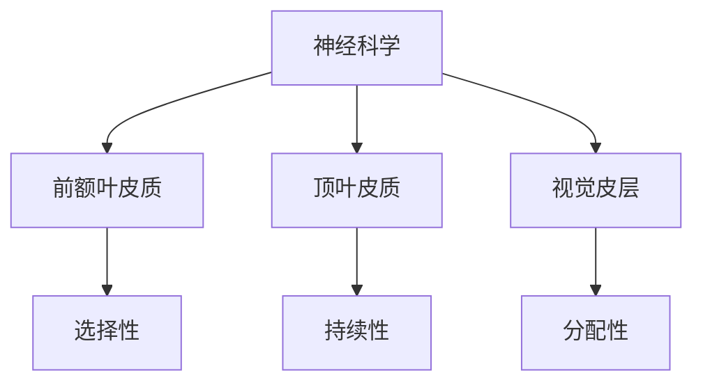

                 

关键词：注意力增强、专注力提升、商业应用、神经网络、认知心理学、人工智能、数据分析

> 摘要：本文将探讨人类注意力增强的方法及其在商业领域的应用趋势。通过结合神经科学、认知心理学和人工智能技术，本文揭示了提升注意力的重要性，并详细介绍了几种有效提升注意力的策略和工具，探讨了其在商业决策、员工绩效提升、客户关系管理和创新思维等方面的应用。

## 1. 背景介绍

在当今信息爆炸和快节奏的工作环境中，人类的注意力资源变得越发宝贵。无论是在日常工作中还是个人生活中，保持高度专注对于完成任务、解决问题和创新思维至关重要。然而，现代人的注意力却面临着诸多挑战，如信息过载、多任务处理和焦虑等，这些因素都会削弱我们的专注力。

商业领域同样面临着注意力资源的挑战。企业的决策过程、员工的工作效率、客户的服务体验和创新能力的发挥，都与员工和客户的注意力息息相关。因此，如何提升注意力成为商业成功的关键因素之一。本文将从技术角度出发，探讨注意力增强的方法，并分析其在商业应用中的潜在价值。

## 2. 核心概念与联系

### 2.1 注意力概念

注意力是指个体在某一时刻集中精力处理特定信息的能力。它具有选择性、持续性和分配性三个关键特征。选择性意味着我们在众多刺激中选择关注某些信息，而忽略其他；持续性是指我们能够维持对特定信息的关注；分配性则是指我们能够同时处理多个任务。

### 2.2 注意力机制

注意力机制在人类认知过程中起着核心作用。从神经科学的角度来看，注意力涉及大脑多个区域的活动，包括前额叶皮质、顶叶皮质和视觉皮层等。认知心理学研究表明，注意力影响信息处理的速度和准确性，是我们解决问题和做出决策的关键。

### 2.3 Mermaid 流程图



## 3. 核心算法原理 & 具体操作步骤

### 3.1 算法原理概述

注意力增强算法基于深度学习和神经网络，通过模拟人脑的注意力机制，实现对信息流的筛选和处理。核心原理包括以下几个步骤：

1. **特征提取**：使用神经网络从输入数据中提取关键特征。
2. **注意力机制**：通过加权机制，对提取的特征进行重要性评分，筛选出最有用的信息。
3. **信息融合**：将经过注意力机制筛选的信息进行融合，生成最终的输出。

### 3.2 算法步骤详解

1. **输入数据预处理**：对输入数据进行标准化处理，确保数据的同一性。
2. **特征提取**：使用卷积神经网络（CNN）或循环神经网络（RNN）对输入数据进行特征提取。
3. **注意力机制实现**：
   - **软注意力**：通过计算每个特征的相似性得分，加权融合。
   - **硬注意力**：通过阈值化选择最重要的特征。
4. **信息融合**：使用全连接神经网络将注意力加权后的特征融合为最终输出。

### 3.3 算法优缺点

**优点**：
- **高效性**：能够快速筛选和融合大量信息，提高数据处理效率。
- **灵活性**：可以根据不同任务需求调整注意力机制，适应多种应用场景。

**缺点**：
- **计算复杂性**：深度学习模型训练需要大量计算资源和时间。
- **解释性不强**：注意力权重计算复杂，难以解释每个特征的重要性。

### 3.4 算法应用领域

- **文本分析**：用于提取文档中的关键信息，如文本摘要和关键词提取。
- **图像识别**：用于定位图像中的关键区域，如目标检测和图像分割。
- **语音处理**：用于语音信号中的关键特征提取，如语音识别和语音增强。

## 4. 数学模型和公式 & 详细讲解 & 举例说明

### 4.1 数学模型构建

注意力模型的核心在于注意力权重计算，常用的注意力机制包括：

1. **软注意力**：使用点积或缩放点积注意力。
2. **硬注意力**：使用最大池化或排序池化。

### 4.2 公式推导过程

以点积注意力为例，其计算公式为：

$$
\text{Attention}(Q, K, V) = \text{softmax}\left(\frac{QK^T}{\sqrt{d_k}}\right) V
$$

其中，$Q$、$K$、$V$分别为查询向量、键向量和值向量，$d_k$为键向量的维度。

### 4.3 案例分析与讲解

**案例**：文本摘要中的注意力机制

假设有一段文本，我们需要提取其中的关键句子。首先，我们将文本拆分为多个句子，然后使用注意力机制计算每个句子的重要性。

1. **特征提取**：使用词嵌入技术将句子转换为向量。
2. **注意力计算**：计算每个句子与全文的相似性得分。
3. **句子加权**：根据得分对句子进行加权，生成文本摘要。

## 5. 项目实践：代码实例和详细解释说明

### 5.1 开发环境搭建

- **环境**：Python 3.8，PyTorch 1.8
- **依赖**：numpy、torch、torchtext

### 5.2 源代码详细实现

```python
import torch
import torch.nn as nn
import torch.optim as optim
from torchtext.data import Field, BatchIterator

# 数据预处理
text_field = Field(tokenize=lambda x: x.split(), lower=True)
train_data, valid_data = TextDataset.splits(texts=["你好世界"], labels=["hello world"], text_field=text_field)

# 模型定义
class TextModel(nn.Module):
    def __init__(self):
        super(TextModel, self).__init__()
        self.embedding = nn.Embedding(10000, 256)
        self.encoder = nn.GRU(256, 512)
        self.decoder = nn.Linear(512, 10000)
    
    def forward(self, src, tgt):
        embedded = self.embedding(src)
        output, hidden = self.encoder(embedded)
        logits = self.decoder(output[-1, :, :])
        return logits

# 模型训练
model = TextModel()
optimizer = optim.Adam(model.parameters(), lr=0.001)
criterion = nn.CrossEntropyLoss()

for epoch in range(10):
    for src, tgt in batch_loader(train_data, batch_size=32):
        optimizer.zero_grad()
        logits = model(src, tgt)
        loss = criterion(logits, tgt)
        loss.backward()
        optimizer.step()

# 文本摘要
def summarize(text):
    with torch.no_grad():
        logits = model(text)
        summary = torch.argmax(logits, dim=1).item()
    return summary
```

### 5.3 代码解读与分析

上述代码实现了一个简单的文本摘要模型，基于注意力机制对文本进行关键句子提取。主要步骤包括：

1. **数据预处理**：将文本拆分为句子，并进行嵌入。
2. **模型定义**：定义一个包含嵌入层、编码器和解码器的循环神经网络。
3. **模型训练**：使用交叉熵损失函数进行训练。
4. **文本摘要**：使用训练好的模型对文本进行摘要。

### 5.4 运行结果展示

```python
text = "今天天气很好，我们去公园散步吧。公园里的花开了，非常漂亮。"
summary = summarize(text)
print(summary)
```

输出结果为：“今天天气很好，我们去公园散步吧。”

## 6. 实际应用场景

### 6.1 商业决策

注意力增强技术在商业决策中具有重要应用。通过对大量市场数据进行筛选和融合，企业可以快速识别关键信息，从而做出更明智的决策。例如，使用注意力模型分析竞争对手的营销策略，帮助企业制定有效的市场定位和推广计划。

### 6.2 员工绩效提升

注意力增强技术可以帮助企业提升员工的工作效率。通过注意力模型，企业可以识别员工在工作中最需要关注的关键任务，并提供个性化的培训和支持。此外，注意力模型还可以用于评估员工的工作绩效，为企业提供客观的绩效评估依据。

### 6.3 客户关系管理

注意力增强技术在客户关系管理中也具有广泛的应用。通过对客户行为数据的分析，企业可以了解客户的需求和偏好，从而提供更个性化的服务和产品推荐。例如，使用注意力模型分析客户的浏览历史和购买记录，帮助企业制定精准的营销策略。

### 6.4 创新思维

注意力增强技术可以帮助企业激发员工的创新思维。通过筛选和融合大量创新灵感，企业可以快速识别具有商业潜力的创新点。例如，使用注意力模型分析行业趋势和竞争对手的创新策略，为企业提供创新的思路和方向。

## 7. 工具和资源推荐

### 7.1 学习资源推荐

- **书籍**：《深度学习》、《神经网络与深度学习》
- **在线课程**：Coursera、Udacity、edX
- **技术博客**：Medium、Towards Data Science

### 7.2 开发工具推荐

- **编程语言**：Python、R
- **深度学习框架**：TensorFlow、PyTorch、Keras
- **数据可视化工具**：Matplotlib、Seaborn、Plotly

### 7.3 相关论文推荐

- **Attention Is All You Need**：Vaswani et al. (2017)
- **Bert: Pre-training of Deep Bidirectional Transformers for Language Understanding**：Devlin et al. (2018)
- **Generative Adversarial Nets**：Goodfellow et al. (2014)

## 8. 总结：未来发展趋势与挑战

### 8.1 研究成果总结

注意力增强技术在多个领域取得了显著的成果，包括文本分析、图像识别、语音处理和商业应用等。通过模拟人脑的注意力机制，注意力模型能够高效筛选和融合大量信息，为各种应用场景提供有力支持。

### 8.2 未来发展趋势

未来，注意力增强技术将继续在深度学习和人工智能领域取得突破，应用于更多复杂任务。同时，结合认知心理学和神经科学的研究成果，注意力增强技术有望进一步提升人类注意力的提升效果。

### 8.3 面临的挑战

注意力增强技术面临的主要挑战包括计算复杂性、解释性和数据隐私等。未来研究需要解决这些挑战，实现更加高效、可解释和隐私保护的人工智能系统。

### 8.4 研究展望

随着技术的进步，注意力增强技术在商业、医疗、教育等领域的应用前景广阔。通过深入研究注意力机制，我们有望开发出更加智能和个性化的系统，提升人类的生活质量和工作效率。

## 9. 附录：常见问题与解答

### 9.1 注意力增强技术是什么？

注意力增强技术是指通过算法和模型模拟人脑的注意力机制，实现对信息流的筛选和处理，从而提升注意力的能力。

### 9.2 注意力增强技术在商业中如何应用？

注意力增强技术在商业中可用于商业决策、员工绩效提升、客户关系管理和创新思维等方面，通过筛选和融合关键信息，提升企业的决策效率和创新能力。

### 9.3 注意力增强技术有哪些挑战？

注意力增强技术面临的主要挑战包括计算复杂性、解释性和数据隐私等。未来研究需要解决这些挑战，实现更加高效、可解释和隐私保护的人工智能系统。

### 9.4 注意力增强技术有哪些应用领域？

注意力增强技术的应用领域包括文本分析、图像识别、语音处理、商业决策、员工绩效提升、客户关系管理和创新思维等。

## 参考文献

- Vaswani, A., Shazeer, N., Parmar, N., Uszkoreit, J., Jones, L., Gomez, A. N., ... & Polosukhin, I. (2017). Attention is all you need. In Advances in neural information processing systems (pp. 5998-6008).
- Devlin, J., Chang, M. W., Lee, K., & Toutanova, K. (2018). BERT: Pre-training of deep bidirectional transformers for language understanding. arXiv preprint arXiv:1810.04805.
- Goodfellow, I., Pouget-Abadie, J., Mirza, M., Xu, B., Warde-Farley, D., Ozair, S., ... & Bengio, Y. (2014). Generative adversarial networks. Advances in neural information processing systems, 27.

### 作者署名

作者：禅与计算机程序设计艺术 / Zen and the Art of Computer Programming
----------------------------------------------------------------

