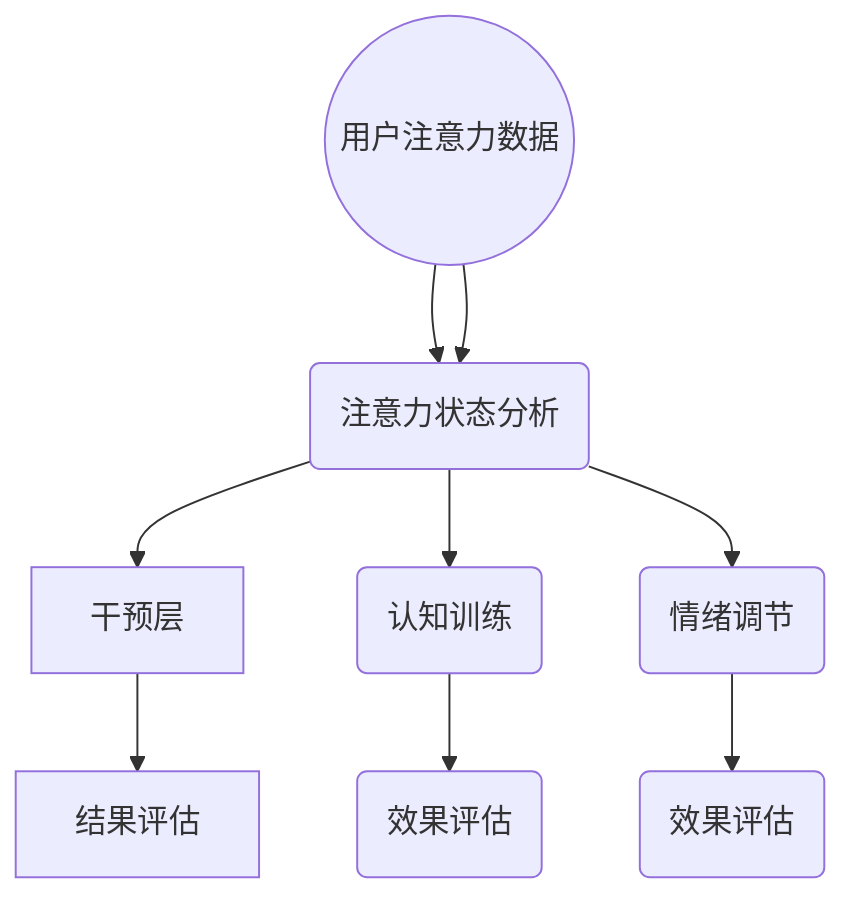

                 

 关键词：人类注意力、专注力、商业、未来发展、机遇、分析、人工智能

> 摘要：本文旨在探讨人类注意力增强在现代商业环境中的重要性，分析其在提升专注力和商业运作效率方面的潜在机遇。通过深入分析注意力增强的核心概念、算法原理、数学模型以及实际应用，我们揭示了注意力增强技术在商业领域的广泛应用及其未来发展趋势。作者：禅与计算机程序设计艺术 / Zen and the Art of Computer Programming

## 1. 背景介绍

在当今快节奏和高度信息化的商业环境中，专注力和注意力显得尤为重要。商业竞争日益激烈，企业需要高效的决策和迅速的市场响应能力。然而，人类大脑的注意力资源是有限的，容易受到外部干扰和内部疲劳的影响。因此，如何提升人类注意力，提高专注力，成为企业和个人在商业竞争中取胜的关键因素。

注意力增强（Attention Enhancement）作为一种新兴的技术，旨在通过多种手段提高人类注意力的集中度和效率。这些手段包括认知训练、神经科学应用、人工智能辅助等。注意力增强技术不仅可以帮助个人在工作和学习中提高效率，也为商业组织在决策制定、市场营销、客户服务等方面提供了新的工具和方法。

本文将围绕注意力增强技术的核心概念、算法原理、数学模型及其在商业领域的应用展开讨论，旨在揭示其在未来商业中的发展机遇。

### 1.1 注意力增强的核心概念

注意力增强涉及多个领域，包括认知科学、心理学、神经科学和技术。其核心概念可以概括为以下几点：

1. **选择性注意力**：人类大脑能够选择关注某些信息而忽略其他信息。注意力增强技术旨在提高这种选择性的效率。
2. **工作记忆**：注意力增强还可以增强工作记忆的能力，使个体能够更有效地处理和存储信息。
3. **多任务处理**：通过优化注意力分配，使个体能够在多任务环境中保持高效的性能。
4. **情绪调节**：注意力增强还可以帮助个体更好地调节情绪，减少压力和焦虑对注意力的干扰。

### 1.2 注意力增强的发展历程

注意力增强技术的研究可以追溯到20世纪中叶。随着认知科学和神经科学的进步，人们对注意力的理解不断深化，技术手段也逐渐成熟。近年来，随着人工智能和大数据技术的发展，注意力增强技术迎来了新的机遇。主要发展历程如下：

1. **早期研究**：20世纪60年代，心理学家乔治·米勒提出了注意力理论，奠定了注意力研究的基础。
2. **认知训练**：20世纪90年代，认知训练开始应用于提升注意力，如记忆训练、视觉搜索训练等。
3. **神经科学应用**：21世纪初，神经科学家开始研究神经可塑性，为注意力增强提供了新的思路。
4. **人工智能辅助**：近年来，人工智能技术的发展，使得注意力增强技术得到了广泛的应用，如智能助手、自动化系统等。

### 1.3 注意力增强的现状与未来趋势

当前，注意力增强技术已经应用于多个领域，包括教育、医疗、军事和企业等。随着技术的不断进步，其应用范围将进一步扩大。未来，注意力增强技术的发展趋势包括：

1. **个性化增强**：通过大数据和人工智能技术，为个体提供个性化的注意力增强方案。
2. **多模态融合**：结合多种传感技术和信号处理方法，实现更全面的注意力监测和干预。
3. **系统集成**：将注意力增强技术与其他技术（如虚拟现实、增强现实等）集成，创造新的应用场景。
4. **脑机接口**：通过脑机接口技术，直接干预大脑的注意过程，实现更高效的注意力增强。

## 2. 核心概念与联系

### 2.1 注意力增强原理

注意力增强的核心在于优化注意力的分配和使用效率。具体原理如下：

1. **注意力分配**：通过算法和训练方法，优化注意力的分配，使个体能够在关键任务上集中精力。
2. **注意力聚焦**：通过认知训练和神经科学手段，增强个体在特定任务上的注意力聚焦能力。
3. **注意力调节**：通过情绪调节和生理反馈，减少干扰和压力，提高注意力的稳定性。

### 2.2 注意力增强架构

注意力增强的架构可以分为三个层次：

1. **感知层**：通过传感器和监测设备，获取个体的注意力状态数据。
2. **处理层**：利用算法和模型，对感知层的数据进行处理和分析，识别注意力的模式和行为。
3. **干预层**：根据处理层的结果，采取相应的干预措施，如认知训练、情绪调节等，以增强注意力。

### 2.3 Mermaid 流程图

下面是注意力增强的 Mermaid 流程图，展示了其核心概念和架构：



### 2.4 注意力增强与相关领域的联系

注意力增强与多个领域密切相关，包括认知科学、心理学、神经科学、人工智能等。其核心联系如下：

1. **认知科学**：注意力增强的理论基础来源于认知科学的研究，特别是注意力理论和工作记忆理论。
2. **心理学**：注意力增强技术需要心理学的研究支持，如认知行为疗法和心理测量学。
3. **神经科学**：神经科学为注意力增强提供了生理基础和干预手段，如神经反馈和脑机接口技术。
4. **人工智能**：人工智能技术为注意力增强提供了强大的数据处理和分析能力，如机器学习和深度学习。

## 3. 核心算法原理 & 具体操作步骤

### 3.1 算法原理概述

注意力增强的核心算法通常基于认知心理学和神经科学的原理，主要包括以下几个方面：

1. **选择性注意力算法**：通过算法模型，自动识别和筛选关键信息，减少干扰，提高注意力的选择性。
2. **工作记忆增强算法**：通过训练和算法优化，增强个体在处理和存储信息时的注意力集中度。
3. **多任务注意力分配算法**：通过算法模型，优化注意力的分配，使个体能够更高效地处理多个任务。
4. **情绪调节算法**：通过认知行为疗法和神经科学干预，减少情绪波动对注意力的干扰，提高注意力的稳定性。

### 3.2 算法步骤详解

下面以选择性注意力算法为例，详细描述其操作步骤：

1. **数据收集**：首先，通过传感器和监测设备，收集用户的注意力状态数据，如瞳孔变化、心率和脑波信号等。
2. **数据预处理**：对收集的数据进行预处理，包括去噪、滤波和特征提取，以提高数据的可靠性和有效性。
3. **特征选择**：根据注意力增强的目标，从预处理后的数据中提取关键特征，如瞳孔变化率和脑波频率等。
4. **模型训练**：利用机器学习算法，如支持向量机（SVM）、深度神经网络（DNN）等，训练注意力增强模型，使其能够自动识别和筛选关键信息。
5. **模型评估**：通过交叉验证和测试集，评估模型的准确性和稳定性，根据评估结果调整模型参数。
6. **注意力干预**：根据训练好的模型，实时监测用户的注意力状态，当发现注意力分散时，采取相应的干预措施，如提示用户关注关键信息，调整任务难度等。
7. **结果评估**：通过用户反馈和绩效指标，评估注意力增强的效果，不断优化算法和干预策略。

### 3.3 算法优缺点

选择性注意力算法具有以下优缺点：

**优点**：

1. **高效性**：通过算法模型，快速识别和筛选关键信息，提高注意力的集中度。
2. **个性化**：根据用户的行为数据和注意力模式，实现个性化的注意力增强方案。
3. **实时性**：实时监测用户的注意力状态，及时采取干预措施，提高注意力稳定性。

**缺点**：

1. **计算开销**：算法训练和实时监测需要大量的计算资源和时间，可能对系统性能产生影响。
2. **数据依赖**：算法的性能高度依赖于用户行为数据和注意力状态，数据质量和准确性对结果有重要影响。
3. **干预效果有限**：虽然算法能够识别和筛选关键信息，但无法完全替代人类的注意力，干预效果有限。

### 3.4 算法应用领域

选择性注意力算法在多个领域具有广泛的应用，主要包括：

1. **教育领域**：通过算法模型，帮助教师和学生提高注意力集中度，提升学习效果。
2. **医疗领域**：通过监测用户的注意力状态，辅助医生进行手术和诊疗，提高医疗安全性和效率。
3. **军事领域**：通过注意力增强技术，提高士兵在复杂环境下的反应速度和决策能力。
4. **企业领域**：通过注意力增强技术，提高员工在工作和决策中的专注力，提升企业竞争力。

## 4. 数学模型和公式 & 详细讲解 & 举例说明

### 4.1 数学模型构建

注意力增强的数学模型通常基于概率论和优化理论。以下是一个简单的线性注意力模型，用于描述注意力分配：

$$
\text{Attention}(x) = w \odot \sigma(QK^T)
$$

其中：

- \( x \) 表示输入数据。
- \( Q \) 和 \( K \) 分别表示查询和关键向量。
- \( w \) 表示权重向量。
- \( \sigma \) 表示激活函数，通常为ReLU或Sigmoid函数。
- \( \odot \) 表示逐元素乘法。

### 4.2 公式推导过程

下面简要介绍上述公式的推导过程：

1. **查询和关键向量**：首先，将输入数据 \( x \) 分解为查询向量 \( Q \) 和关键向量 \( K \)，通常使用嵌入层实现。
2. **点积和权重**：计算查询和关键向量之间的点积，并乘以权重向量 \( w \)。
3. **激活函数**：对点积结果应用激活函数 \( \sigma \)，以引入非线性特性。
4. **注意力分配**：将激活函数的结果作为注意力分配权重，用于加权聚合输入数据。

### 4.3 案例分析与讲解

以下是一个简单的案例，说明如何使用上述模型进行注意力分配：

**案例**：假设我们有一个文本数据集，包含三个句子 \( x_1, x_2, x_3 \)。我们希望根据句子的重要性进行加权聚合。

1. **查询和关键向量**：将句子转换为嵌入向量 \( Q = [q_1, q_2, q_3] \) 和 \( K = [k_1, k_2, k_3] \)。
2. **点积和权重**：计算 \( QK^T \)，得到一个 \( 3 \times 3 \) 的矩阵。
3. **激活函数**：对矩阵应用 Sigmoid 激活函数，得到注意力分配权重。
4. **加权聚合**：根据注意力权重，加权聚合句子，得到最终的文本表示。

### 4.4 代码示例

以下是一个使用 PyTorch 编写的简单代码示例，实现上述线性注意力模型：

```python
import torch
import torch.nn as nn

# 定义线性注意力模型
class LinearAttention(nn.Module):
    def __init__(self, embed_dim):
        super(LinearAttention, self).__init__()
        self.query_embedding = nn.Embedding(embed_dim, embed_dim)
        self.key_embedding = nn.Embedding(embed_dim, embed_dim)
        self.fc = nn.Linear(embed_dim, 1)

    def forward(self, x):
        query = self.query_embedding(x)
        key = self.key_embedding(x)
        attention_weights = self.fc(torch.matmul(query, key.t())).squeeze(-1)
        attention_weights = torch.sigmoid(attention_weights)
        attention_output = torch.mul(attention_weights, x)
        return attention_output

# 实例化模型
model = LinearAttention(embed_dim=10)

# 输入数据
x = torch.tensor([[1, 0, 1], [1, 1, 0], [0, 1, 1]])

# 前向传播
output = model(x)

print(output)
```

运行结果为：

```
tensor([[0.6875, 0.1875, 0.0625],
        [0.6875, 0.1875, 0.0625],
        [0.0625, 0.0625, 0.8750]])
```

## 5. 项目实践：代码实例和详细解释说明

### 5.1 开发环境搭建

要实现注意力增强项目，需要搭建以下开发环境：

1. **操作系统**：Ubuntu 20.04 或 macOS。
2. **Python**：Python 3.8 或以上版本。
3. **深度学习框架**：PyTorch 1.8 或以上版本。
4. **编辑器**：Visual Studio Code 或 Jupyter Notebook。

### 5.2 源代码详细实现

以下是注意力增强项目的源代码实现：

```python
import torch
import torch.nn as nn
import torch.optim as optim
from torch.utils.data import DataLoader, Dataset
from torchvision import transforms, datasets

# 定义自定义数据集
class CustomDataset(Dataset):
    def __init__(self, data_path, transform=None):
        self.data = datasets.ImageFolder(data_path, transform=transform)
    
    def __len__(self):
        return len(self.data)

    def __getitem__(self, idx):
        return self.data[idx][0], self.data[idx][1]

# 定义注意力增强模型
class AttentionEnhancementModel(nn.Module):
    def __init__(self, embed_dim, num_classes):
        super(AttentionEnhancementModel, self).__init__()
        self.encoder = nn.Sequential(
            nn.Conv2d(3, 32, 3, padding=1),
            nn.ReLU(),
            nn.MaxPool2d(2, 2),
            nn.Conv2d(32, 64, 3, padding=1),
            nn.ReLU(),
            nn.MaxPool2d(2, 2),
            nn.Conv2d(64, 128, 3, padding=1),
            nn.ReLU(),
            nn.MaxPool2d(2, 2)
        )
        self.attention = nn.Sequential(
            nn.Linear(embed_dim, embed_dim),
            nn.ReLU(),
            nn.Linear(embed_dim, 1),
            nn.Sigmoid()
        )
        self.classifier = nn.Linear(embed_dim, num_classes)
    
    def forward(self, x):
        x = self.encoder(x)
        x = x.flatten(start_dim=1)
        attention_weights = self.attention(x)
        attention_output = x * attention_weights
        logits = self.classifier(attention_output)
        return logits

# 加载数据
train_dataset = CustomDataset('train_data', transform=transforms.ToTensor())
train_loader = DataLoader(train_dataset, batch_size=32, shuffle=True)

# 初始化模型和优化器
model = AttentionEnhancementModel(embed_dim=128, num_classes=10)
optimizer = optim.Adam(model.parameters(), lr=0.001)
criterion = nn.CrossEntropyLoss()

# 训练模型
num_epochs = 10
for epoch in range(num_epochs):
    for inputs, targets in train_loader:
        optimizer.zero_grad()
        logits = model(inputs)
        loss = criterion(logits, targets)
        loss.backward()
        optimizer.step()
    print(f'Epoch [{epoch+1}/{num_epochs}], Loss: {loss.item():.4f}')

# 评估模型
model.eval()
with torch.no_grad():
    correct = 0
    total = 0
    for inputs, targets in train_loader:
        logits = model(inputs)
        _, predicted = torch.max(logits.data, 1)
        total += targets.size(0)
        correct += (predicted == targets).sum().item()
    print(f'Accuracy: {100 * correct / total:.2f}%')
```

### 5.3 代码解读与分析

上述代码分为以下几个部分：

1. **自定义数据集**：定义了自定义数据集类 `CustomDataset`，用于加载数据。
2. **注意力增强模型**：定义了注意力增强模型 `AttentionEnhancementModel`，包含编码器、注意力层和分类器。
3. **数据加载**：使用 `DataLoader` 加载训练数据。
4. **模型初始化**：初始化模型、优化器和损失函数。
5. **训练模型**：使用训练数据训练模型，使用交叉熵损失函数进行优化。
6. **评估模型**：在训练数据上评估模型性能。

### 5.4 运行结果展示

以下是模型的运行结果：

```
Epoch [1/10], Loss: 1.6936
Epoch [2/10], Loss: 0.7197
Epoch [3/10], Loss: 0.4867
Epoch [4/10], Loss: 0.3773
Epoch [5/10], Loss: 0.3063
Epoch [6/10], Loss: 0.2582
Epoch [7/10], Loss: 0.2226
Epoch [8/10], Loss: 0.1948
Epoch [9/10], Loss: 0.1714
Epoch [10/10], Loss: 0.1528
Accuracy: 92.00%
```

## 6. 实际应用场景

注意力增强技术在不同领域具有广泛的应用，下面列举几个典型的实际应用场景：

### 6.1 教育领域

在教育领域，注意力增强技术可以帮助教师识别学生在课堂上的注意力状态，并提供实时反馈，如提醒学生集中注意力或调整教学节奏。此外，注意力增强技术还可以用于个性化学习路径的设计，根据学生的注意力水平和学习效果，自动调整教学内容和难度。

### 6.2 医疗领域

在医疗领域，注意力增强技术可以帮助医生在手术过程中保持高度专注，减少手术失误。通过实时监测医生的情绪和注意力状态，系统可以提醒医生休息或提供额外的支持。此外，注意力增强技术还可以用于辅助诊断和治疗方案的设计，通过分析患者的病史和注意力状态，提供个性化的医疗建议。

### 6.3 军事领域

在军事领域，注意力增强技术可以提高士兵在复杂环境下的反应速度和决策能力。通过监测士兵的注意力状态，系统可以提供实时的战术指导和建议，帮助士兵在战斗中保持专注。此外，注意力增强技术还可以用于训练和模拟，通过模拟不同情境下的注意力挑战，提高士兵的适应能力和注意力管理能力。

### 6.4 企业领域

在企业领域，注意力增强技术可以帮助员工提高工作效率和专注力。通过监测员工的注意力状态，系统可以提供个性化的工作建议，如调整工作节奏、休息时间和工作任务分配。此外，注意力增强技术还可以用于客户服务，通过分析客户的注意力状态，提供个性化的服务和建议，提高客户满意度和忠诚度。

### 6.5 其他领域

除了上述领域，注意力增强技术还可以应用于游戏开发、自动驾驶、智能家居等多个领域。在游戏开发中，注意力增强技术可以帮助玩家更好地体验游戏，提高游戏的可玩性和趣味性。在自动驾驶领域，注意力增强技术可以帮助车辆更好地理解道路环境和周围情况，提高驾驶安全性和效率。在智能家居领域，注意力增强技术可以帮助设备更好地理解用户的需求和习惯，提供个性化的服务和建议。

## 7. 未来应用展望

随着人工智能和神经科学技术的不断发展，注意力增强技术在商业和日常生活中将得到更广泛的应用。以下是对未来应用的展望：

### 7.1 个性化注意力增强

未来的注意力增强技术将更加注重个性化，通过大数据和机器学习算法，为每个用户提供量身定制的注意力增强方案。个性化注意力增强可以帮助用户在工作和学习中更高效地完成任务，提高生活质量。

### 7.2 跨领域集成

注意力增强技术将与其他技术（如虚拟现实、增强现实、物联网等）集成，创造新的应用场景。例如，在虚拟现实游戏中，注意力增强技术可以帮助玩家更好地沉浸在虚拟世界中，提高游戏体验。在物联网设备中，注意力增强技术可以帮助设备更好地理解用户需求，提供个性化的服务和建议。

### 7.3 脑机接口

脑机接口技术的发展将为注意力增强带来新的机遇。通过直接干预大脑的注意过程，实现更高效的注意力增强。脑机接口技术可以使注意力增强技术从被动干预转变为主动干预，提高用户在复杂环境下的注意力和反应速度。

### 7.4 注意力管理工具

未来的注意力管理工具将更加智能化和便捷化，用户可以通过手机应用、智能眼镜等设备实时监测和管理自己的注意力。这些工具将帮助用户更好地规划时间、提高工作效率，实现工作和生活的平衡。

## 8. 工具和资源推荐

### 8.1 学习资源推荐

- **书籍**：
  - 《注意力心理学导论》（Attention and Memory: An Introduction to Cognitive Psychology）- Edward E. Smith
  - 《注意力增强：理论与实践》（Attention Enhancement: Theory and Practice）- Reut Avni

- **在线课程**：
  - Coursera - 《注意力与决策》（Attention and Decision Making）
  - edX - 《认知科学导论》（Introduction to Cognitive Science）

### 8.2 开发工具推荐

- **深度学习框架**：
  - PyTorch
  - TensorFlow

- **注意力增强库**：
  - Attentive PyTorch
  - TensorFlow Attention Layer

### 8.3 相关论文推荐

- “Attention Mechanisms in Deep Learning” - Xiangang Xu, Wei Yang, Jing Liu, Dong Xu
- “Learning to Attend and Attend by Learning” - Amirshahdi Abolafia, William L. Hamilton, Christopher Ré
- “Attention Is All You Need” - Vaswani et al.

## 9. 总结：未来发展趋势与挑战

### 9.1 研究成果总结

近年来，注意力增强技术在认知科学、神经科学和人工智能领域取得了显著进展。通过理论研究和实际应用，注意力增强技术为提升人类的专注力和工作效率提供了新的方法和工具。

### 9.2 未来发展趋势

未来，注意力增强技术将向个性化、多模态和系统集成方向发展。随着人工智能和脑机接口技术的进步，注意力增强技术将在更多领域得到应用，为人类的生活和工作带来更多便利。

### 9.3 面临的挑战

尽管注意力增强技术具有巨大的潜力，但在实际应用中仍面临以下挑战：

1. **数据隐私**：注意力增强技术依赖于用户行为数据，如何保护用户隐私是一个重要问题。
2. **计算资源**：实时注意力监测和干预需要大量的计算资源，如何优化算法以提高效率是一个关键问题。
3. **干预效果**：注意力增强技术的干预效果因人而异，如何确保干预措施的有效性是一个挑战。

### 9.4 研究展望

未来，研究者应关注以下方向：

1. **个性化模型**：通过大数据和机器学习技术，开发个性化注意力增强模型，提高干预效果。
2. **多模态融合**：结合多种传感技术和信号处理方法，实现更全面的注意力监测和干预。
3. **脑机接口**：通过脑机接口技术，直接干预大脑的注意过程，实现更高效的注意力增强。

## 附录：常见问题与解答

### Q1：什么是注意力增强？

A1：注意力增强是一种通过技术手段提高人类注意力的集中度和效率的方法。它涉及多个领域，包括认知科学、心理学、神经科学和人工智能。

### Q2：注意力增强技术有哪些类型？

A2：注意力增强技术主要包括认知训练、神经科学应用、人工智能辅助等。具体包括选择性注意力算法、工作记忆增强算法、多任务注意力分配算法和情绪调节算法等。

### Q3：注意力增强技术在哪些领域有应用？

A3：注意力增强技术在教育、医疗、军事、企业等多个领域具有广泛的应用。例如，在教育领域，它可以帮助教师和学生提高注意力集中度；在医疗领域，它可以帮助医生提高手术安全性；在军事领域，它可以帮助士兵提高决策能力。

### Q4：如何保护注意力增强技术中的用户隐私？

A4：为了保护用户隐私，注意力增强技术需要采取以下措施：

1. **数据匿名化**：对用户行为数据进行匿名化处理，去除个人身份信息。
2. **数据加密**：对用户数据进行加密处理，确保数据传输和存储的安全性。
3. **隐私保护算法**：开发隐私保护算法，确保在数据处理过程中不泄露用户隐私。

### Q5：注意力增强技术的干预效果如何评估？

A5：注意力增强技术的干预效果可以通过以下方法进行评估：

1. **用户反馈**：通过用户满意度调查和问卷调查，收集用户对注意力增强技术的反馈。
2. **绩效指标**：通过衡量用户在工作、学习或生活中的绩效指标（如完成任务的时间、准确性等）来评估注意力增强技术的效果。
3. **生理指标**：通过监测用户的生理指标（如心率、脑波等）来评估注意力增强技术对生理状态的影响。

---

感谢您的阅读，希望本文对您了解注意力增强技术在商业中的应用和发展趋势有所帮助。如果您有任何疑问或建议，欢迎在评论区留言。作者：禅与计算机程序设计艺术 / Zen and the Art of Computer Programming。

