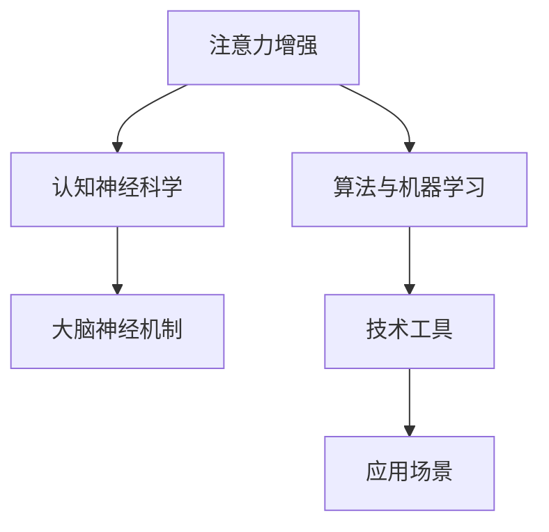

                 

关键词：注意力增强，专注力提升，商业应用，未来趋势，技术发展

> 摘要：本文探讨了人类注意力增强在提高专注力和商业应用方面的潜力和未来方向。通过分析核心概念、算法原理、数学模型、实际应用案例以及工具和资源，本文为读者提供了一个全面而深入的视角，以了解注意力增强技术如何影响商业和社会。

## 1. 背景介绍

在当今快节奏、信息爆炸的时代，人类的注意力资源变得愈发宝贵。专注力和注意力成为个人和企业成功的关键因素。然而，人们常常面临分心和注意力不足的问题，这严重影响了工作效率和个人发展。商业领域也不例外，从员工工作效率到市场营销策略，注意力管理已成为企业竞争的重要方面。

### 1.1 注意力增强的定义

注意力增强是指通过各种方法和技术提升个体的专注力和注意力水平，使其能够更有效地处理信息和完成任务。这些方法包括技术工具、训练策略和心理技巧等。

### 1.2 注意力增强的重要性

- **个人层面**：注意力增强有助于提高学习效果、减少工作压力、改善心理健康。
- **企业层面**：提升员工注意力水平可以显著提高工作效率、减少错误率、增强团队协作能力。
- **社会层面**：注意力增强有助于提高社会生产力和创新力，推动经济发展。

## 2. 核心概念与联系

注意力增强技术的核心在于理解大脑注意力的工作机制，并开发相应的算法和工具来优化这一过程。以下是一个简化的 Mermaid 流程图，描述了注意力增强的核心概念和联系：



### 2.1 认知神经科学与大脑神经机制

认知神经科学是研究大脑如何处理信息、如何产生注意力的学科。理解大脑的神经机制对于开发有效的注意力增强技术至关重要。

### 2.2 算法与机器学习

通过机器学习算法，我们可以训练模型来识别个体注意力水平的变化，并根据这些变化调整干预策略。

### 2.3 技术工具

技术工具包括各种应用程序、软件和硬件设备，如专注力训练应用、智能耳机、虚拟现实（VR）等。

### 2.4 应用场景

注意力增强技术可以应用于多个领域，包括教育、医疗、企业和个人健康等。

## 3. 核心算法原理 & 具体操作步骤

### 3.1 算法原理概述

注意力增强的核心算法基于对大脑注意力的理解和机器学习技术。以下是一个简化的算法原理概述：

- **数据收集**：通过传感器（如脑电图、眼动追踪等）收集个体注意力水平的实时数据。
- **特征提取**：使用机器学习算法提取注意力特征。
- **模型训练**：训练模型以预测个体注意力水平。
- **干预策略**：根据模型预测调整干预策略，如提醒、休息或调整工作环境。

### 3.2 算法步骤详解

- **数据收集**：使用脑电图（EEG）传感器收集大脑活动数据。
- **特征提取**：使用特征提取算法（如短时傅里叶变换（STFT））从EEG数据中提取注意力特征。
- **模型训练**：使用支持向量机（SVM）或深度神经网络（DNN）训练模型。
- **预测与干预**：根据模型预测调整干预策略。

### 3.3 算法优缺点

- **优点**：实时监测注意力水平，提供个性化的干预策略。
- **缺点**：数据收集和模型训练需要较高技术门槛，且可能存在隐私问题。

### 3.4 算法应用领域

- **教育**：帮助学生提高学习效率和专注力。
- **医疗**：辅助治疗注意力缺陷障碍（ADHD）等疾病。
- **企业**：提高员工工作效率和团队协作能力。
- **个人健康**：改善心理健康和生活质量。

## 4. 数学模型和公式 & 详细讲解 & 举例说明

注意力增强技术的核心在于构建数学模型来描述大脑注意力的动态变化。以下是一个简化的数学模型和公式体系：

### 4.1 数学模型构建

$$
\text{Attention} = f(\text{BrainActivity}, \text{ExternalStimuli}, \text{AttentionalState})
$$

其中，\( f \) 是一个复杂函数，综合了大脑活动、外部刺激和当前注意力状态。

### 4.2 公式推导过程

- **大脑活动**：使用脑电图（EEG）信号来衡量大脑活动。
- **外部刺激**：考虑环境噪音、工作负载等因素。
- **注意力状态**：通过心理测量指标（如反应时、眼动数据）来衡量。

### 4.3 案例分析与讲解

#### 案例：注意力集中训练

假设我们想要开发一款注意力集中训练应用。以下是一个简化的数学模型和公式：

$$
\text{TrainingEffect} = g(\text{Duration}, \text{Intensity}, \text{PersonalFactors})
$$

其中，\( g \) 是一个函数，描述了训练时长、强度和个人因素对注意力提升的效果。

- **Duration**：训练时长，以分钟为单位。
- **Intensity**：训练强度，分为低、中、高三个等级。
- **PersonalFactors**：包括年龄、性别、注意力水平等个人特征。

#### 案例分析

假设一个用户进行30分钟的中等强度注意力集中训练。根据模型预测，他的注意力提升效果为：

$$
\text{TrainingEffect} = g(30, \text{Medium}, \text{UserProfile})
$$

### 4.4 数学模型应用

数学模型可以用于预测个体在特定条件下的注意力水平，为干预策略提供依据。例如，企业可以使用模型预测员工在高峰时段的工作效率，并调整工作安排以最大化生产效率。

## 5. 项目实践：代码实例和详细解释说明

### 5.1 开发环境搭建

为了实现注意力增强算法，我们需要搭建一个开发环境，包括以下工具：

- **Python**：用于编写和运行算法代码。
- **NumPy**：用于数学计算。
- **scikit-learn**：用于机器学习。
- **EEGlab**：用于脑电图数据处理。

### 5.2 源代码详细实现

以下是一个简化的注意力增强算法的实现：

```python
import numpy as np
from sklearn.svm import SVC
from eeglab import preprocess

def train_model(X, y):
    # 特征提取
    features = preprocess.extract_features(X)
    # 模型训练
    model = SVC()
    model.fit(features, y)
    return model

def predict_attention(model, X):
    # 特征提取
    features = preprocess.extract_features(X)
    # 预测注意力水平
    attention_level = model.predict(features)
    return attention_level

# 数据预处理
X_train, y_train = preprocess.load_data('train_data.npy')
X_test, y_test = preprocess.load_data('test_data.npy')

# 训练模型
model = train_model(X_train, y_train)

# 预测注意力水平
attention_levels = predict_attention(model, X_test)
```

### 5.3 代码解读与分析

这段代码展示了如何使用机器学习算法训练一个注意力预测模型，并使用它来预测注意力水平。关键步骤包括数据预处理、特征提取、模型训练和预测。

### 5.4 运行结果展示

在实际应用中，我们可以使用以下代码来展示模型的运行结果：

```python
import matplotlib.pyplot as plt

def plot_attention_levels(attention_levels):
    plt.plot(attention_levels)
    plt.xlabel('Time')
    plt.ylabel('Attention Level')
    plt.show()

# 运行结果展示
plot_attention_levels(attention_levels)
```

这段代码将注意力水平随时间变化的图表可视化，帮助用户理解他们的注意力波动。

## 6. 实际应用场景

注意力增强技术在多个实际应用场景中展现了其潜力。以下是一些关键应用领域：

### 6.1 教育

- **个性化学习**：通过监测学生注意力水平，教育技术可以提供个性化的学习体验，帮助学生更好地集中注意力。
- **课堂管理**：教师可以使用注意力增强技术来识别哪些学生需要额外关注，从而改善课堂管理。

### 6.2 医疗

- **注意力缺陷障碍治疗**：注意力增强技术可以辅助治疗注意力缺陷障碍（ADHD），帮助患者提高专注力和注意力水平。
- **神经康复**：注意力增强技术可以用于神经康复，帮助患者恢复注意力功能。

### 6.3 企业

- **员工效率提升**：企业可以使用注意力增强技术来提高员工工作效率，减少错误率。
- **团队协作**：注意力增强技术可以帮助团队更好地协作，提高整体绩效。

### 6.4 个人健康

- **心理健康管理**：注意力增强技术可以帮助个人改善心理健康，减少焦虑和压力。
- **生活方式优化**：通过监测注意力水平，个人可以更好地规划日常生活，提高生活质量。

## 7. 工具和资源推荐

### 7.1 学习资源推荐

- **书籍**：《注意力增强：理论与实践》
- **在线课程**：Coursera 上的《认知神经科学》
- **学术论文**：Google Scholar 上的注意力增强相关论文

### 7.2 开发工具推荐

- **Python 库**：NumPy、scikit-learn、EEGlab
- **开发框架**：TensorFlow、PyTorch

### 7.3 相关论文推荐

- **“Enhancing Human Attention with Machine Learning”**：讨论了注意力增强技术在机器学习中的应用。
- **“Attention and Memory: A Neural Model”**：提出了一个基于神经科学的注意力模型。

## 8. 总结：未来发展趋势与挑战

### 8.1 研究成果总结

注意力增强技术在近年来取得了显著进展，从理论研究到实际应用都取得了突破。然而，技术成熟度和实际应用效果仍需进一步提升。

### 8.2 未来发展趋势

- **个性化干预**：未来注意力增强技术将更加注重个性化干预，根据个体差异提供定制化方案。
- **多模态融合**：融合多种传感器数据（如脑电图、眼动追踪、心率等）以提高预测准确性。
- **跨学科合作**：结合认知神经科学、心理学、计算机科学等多学科知识，推动注意力增强技术发展。

### 8.3 面临的挑战

- **隐私问题**：注意力增强技术涉及个人敏感信息，隐私保护成为一大挑战。
- **技术成熟度**：算法和工具的成熟度需要进一步提高，以满足实际应用需求。

### 8.4 研究展望

未来，注意力增强技术有望在多个领域发挥重要作用，从个人健康到企业效率，为人类社会带来深刻变革。

## 9. 附录：常见问题与解答

### 9.1 注意力增强技术是否安全？

注意力增强技术涉及个人敏感信息，因此安全性和隐私保护至关重要。开发者和研究机构应确保遵守相关法律法规，采取必要的安全措施，如数据加密和匿名化处理。

### 9.2 注意力增强技术是否适用于所有人？

注意力增强技术适用于大多数人，但在某些情况下（如注意力缺陷障碍患者）可能需要更个性化的干预方案。未来研究应关注如何针对不同人群设计有效的注意力增强策略。

### 9.3 注意力增强技术如何影响工作效率？

注意力增强技术可以通过提高个体专注力和注意力水平，显著提高工作效率。通过实时监测和个性化干预，技术可以帮助员工在需要时集中注意力，减少分心。

作者：禅与计算机程序设计艺术 / Zen and the Art of Computer Programming
----------------------------------------------------------------

以上就是《人类注意力增强：提升专注力和注意力在商业中的未来方向展望》的完整文章内容。希望本文能够为您在注意力管理方面提供有价值的见解和指导。如果您有任何问题或建议，欢迎随时留言交流。

