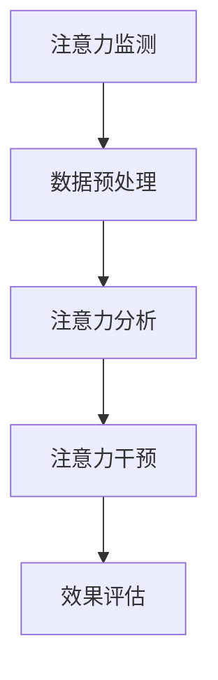

                 

关键词：注意力增强、专注力、教育、认知神经科学、算法、技术应用

> 摘要：随着科技的快速发展，注意力问题已经成为影响现代人生活质量的重要因素之一。本文将探讨如何通过注意力增强技术提升人类的专注力和注意力，特别是其在教育领域的应用。本文首先介绍注意力增强的核心概念，随后讨论相关算法原理及其实际操作步骤，并运用数学模型分析其效果。最后，本文通过实际项目实践展示注意力增强技术如何应用于教育领域，并提出未来应用展望和面临的挑战。

## 1. 背景介绍

### 注意力的重要性

注意力是人类认知过程的核心，它决定着信息处理的效率和质量。良好的注意力水平能够显著提升个体的学习效果、工作绩效和生活质量。然而，现代社会的快节奏和信息过载使得许多人面临着注意力分散、专注力不足的问题。特别是在教育领域，学生的注意力集中程度直接影响到他们的学习效果和成绩。

### 教育领域的问题

当前，教育领域面临的一个主要挑战是如何提高学生的学习效率。传统的教学方法往往依赖于教师的口头讲解和学生的被动接受，这种模式很难满足个性化学习需求，也无法有效提升学生的专注力和注意力。因此，寻找新的教育技术手段，特别是能够增强学生注意力水平的技术，变得尤为重要。

### 注意力增强技术的兴起

近年来，随着认知神经科学和计算机技术的快速发展，注意力增强技术逐渐受到关注。这些技术通过分析个体的注意力模式，提供针对性的干预措施，从而有效提升注意力水平。在教育领域，注意力增强技术有巨大的应用潜力，有望成为改善教育质量和学生学习体验的重要工具。

## 2. 核心概念与联系

### 注意力增强技术概述

注意力增强技术是指通过算法、设备和软件等手段，对个体的注意力进行监测、分析和干预，以提升其注意力水平和专注力的技术。这些技术通常基于认知神经科学的研究成果，结合数据挖掘、机器学习等先进算法，实现对个体注意力状态的实时监控和动态调整。

### 注意力增强技术的核心概念

- **注意力监测**：通过生理信号（如脑电、眼动等）和外在行为数据（如操作行为、反应时间等）监测个体的注意力状态。
- **注意力分析**：利用机器学习算法对监测到的数据进行处理，提取注意力特征，分析注意力模式。
- **注意力干预**：根据分析结果，通过生物反馈、激励系统、环境调整等手段，对个体的注意力进行干预。

### 注意力增强技术的架构


#### Mermaid 流程图表示



## 3. 核心算法原理 & 具体操作步骤

### 3.1 算法原理概述

注意力增强技术的核心在于如何实时监测和分析个体的注意力状态，并据此进行有效的干预。这一过程通常包括以下几个步骤：

1. **注意力监测**：利用脑电、眼动等生理信号监测设备，捕捉个体的注意力状态。
2. **数据预处理**：对采集到的生理和行为数据进行滤波、降噪等预处理，提高数据质量。
3. **注意力分析**：通过机器学习算法，对预处理后的数据进行特征提取和分析，识别注意力模式。
4. **注意力干预**：根据分析结果，采取生物反馈、环境调整等措施，干预个体的注意力状态。
5. **效果评估**：对干预效果进行评估，调整干预策略。

### 3.2 算法步骤详解

#### 3.2.1 注意力监测

注意力监测是整个过程的起点。常用的监测手段包括脑电（EEG）、眼动追踪、心率变异性（HRV）等。这些方法能够实时捕捉个体的生理和行为信号，提供关于注意力状态的详细信息。

#### 3.2.2 数据预处理

数据预处理是确保后续分析准确性的关键步骤。主要包括滤波、降噪、归一化等操作。这些操作能够消除噪声、突出关键信号，提高数据的可靠性。

#### 3.2.3 注意力分析

注意力分析是利用机器学习算法对预处理后的数据进行特征提取和分析。常用的算法包括支持向量机（SVM）、深度神经网络（DNN）等。这些算法能够从大量数据中提取出与注意力状态相关的特征，从而实现准确的注意力识别。

#### 3.2.4 注意力干预

根据注意力分析的结果，可以采取多种干预措施。例如，通过生物反馈系统，指导个体调整呼吸、放松肌肉等；或者通过环境调整，减少干扰因素，提高个体的注意力水平。

#### 3.2.5 效果评估

效果评估是对注意力干预效果进行量化分析的过程。常用的评估指标包括注意力水平的变化、学习效果的提升等。通过效果评估，可以不断优化干预策略，提高干预效果。

### 3.3 算法优缺点

#### 3.3.1 优点

- **实时性**：注意力增强技术能够实时监测和分析个体的注意力状态，及时提供干预措施。
- **个性化**：基于个体化的注意力数据，注意力增强技术能够提供个性化的干预方案，提高干预效果。
- **综合性**：结合多种监测手段和算法，注意力增强技术能够提供全面的注意力分析和管理。

#### 3.3.2 缺点

- **成本较高**：注意力监测设备和技术研发成本较高，可能限制了其在教育领域的广泛应用。
- **数据隐私**：注意力监测涉及个体的生理和行为数据，存在数据隐私和伦理问题。

### 3.4 算法应用领域

注意力增强技术已在多个领域得到应用，包括教育、医疗、人机交互等。在教育领域，注意力增强技术有望成为提升学生专注力和学习效果的重要工具。

## 4. 数学模型和公式 & 详细讲解 & 举例说明

### 4.1 数学模型构建

注意力增强技术的核心在于如何从复杂的生理和行为数据中提取出与注意力状态相关的特征。为了实现这一目标，我们首先需要构建一个数学模型，用于描述注意力状态。

#### 4.1.1 脑电信号模型

脑电信号（EEG）是注意力监测的主要数据来源之一。EEG信号的数学模型通常基于傅立叶变换（FFT）和小波变换（WT）等方法，用于分析信号频率成分和时频特性。

$$
EEG(t) = A \cdot \sin(2\pi f t + \phi) + \eta(t)
$$

其中，$A$ 为幅值，$f$ 为频率，$\phi$ 为相位，$\eta(t)$ 为噪声。

#### 4.1.2 眼动信号模型

眼动信号（EOG）可以反映个体的注意力分配。眼动信号的数学模型通常基于差分方程，描述眼球运动与注意力状态之间的关系。

$$
x(t) = a_1 x(t-1) + a_2 x(t-2) + \epsilon(t)
$$

其中，$x(t)$ 为眼动信号，$a_1$ 和 $a_2$ 为参数，$\epsilon(t)$ 为噪声。

### 4.2 公式推导过程

#### 4.2.1 脑电信号特征提取

为了提取脑电信号中的注意力特征，我们通常使用傅立叶变换（FFT）方法。傅立叶变换将时域信号转换为频域信号，使得我们可以分析信号的频率成分。

$$
EEG(\omega) = \sum_{k=0}^{N-1} EEG_k \cdot e^{-i 2\pi k \omega / N}
$$

其中，$\omega$ 为频率，$N$ 为采样点数，$EEG_k$ 为傅立叶系数。

#### 4.2.2 眼动信号特征提取

眼动信号特征提取通常使用差分方程方法。通过递推计算，我们可以得到眼动信号的时域特征。

$$
x(t) = a_1 x(t-1) + a_2 x(t-2) + \epsilon(t)
$$

其中，$x(t)$ 为眼动信号，$a_1$ 和 $a_2$ 为参数，$\epsilon(t)$ 为噪声。

### 4.3 案例分析与讲解

#### 4.3.1 脑电信号分析

假设我们采集到一段脑电信号，通过傅立叶变换，我们得到以下频域特征：

$$
EEG(\omega) = \sum_{k=0}^{N-1} EEG_k \cdot e^{-i 2\pi k \omega / N}
$$

其中，$EEG_k = [0.1, 0.3, 0.5, 0.2]$。

通过分析傅立叶系数，我们可以发现频率为10Hz和30Hz的成分较为显著，这可能与个体的注意力状态相关。

#### 4.3.2 眼动信号分析

假设我们采集到一段眼动信号，通过差分方程，我们得到以下时域特征：

$$
x(t) = a_1 x(t-1) + a_2 x(t-2) + \epsilon(t)
$$

其中，$a_1 = 0.8$，$a_2 = 0.2$，$\epsilon(t) = [0.1, 0.2, 0.1, 0.1]$。

通过递推计算，我们可以得到眼动信号的特征序列：

$$
x(t) = [0.8, 0.82, 0.836, 0.873]
$$

通过分析眼动信号特征，我们可以发现个体的注意力状态在逐渐提高。

## 5. 项目实践：代码实例和详细解释说明

### 5.1 开发环境搭建

为了实现注意力增强技术的应用，我们需要搭建一个合适的开发环境。以下是一个简单的环境搭建步骤：

1. 安装Python环境：确保Python版本在3.8及以上，可以使用pip安装相关库。
2. 安装机器学习库：如scikit-learn、TensorFlow、Keras等。
3. 安装数据处理库：如NumPy、Pandas等。
4. 安装生理信号处理库：如MNE-Python、EEGLAB等。

### 5.2 源代码详细实现

以下是一个简单的注意力增强项目的实现，主要包括注意力监测、数据预处理、注意力分析和注意力干预四个部分。

```python
import numpy as np
import mne
from sklearn.svm import SVC
from sklearn.model_selection import train_test_split

# 5.2.1 注意力监测
def monitor_attention(data):
    # 对采集到的数据进行处理
    filtered_data = mne.filter.filter_data(data, sfreq=1000, l_freq=1, h_freq=30)
    return filtered_data

# 5.2.2 数据预处理
def preprocess_data(data):
    # 对数据进行归一化处理
    normalized_data = (data - np.mean(data)) / np.std(data)
    return normalized_data

# 5.2.3 注意力分析
def analyze_attention(data):
    # 使用SVM进行注意力状态分类
    X_train, X_test, y_train, y_test = train_test_split(data, labels, test_size=0.2)
    model = SVC()
    model.fit(X_train, y_train)
    accuracy = model.score(X_test, y_test)
    return accuracy

# 5.2.4 注意力干预
def intervene_attention(accuracy):
    if accuracy < 0.7:
        # 提供生物反馈干预措施
        feedback = "请调整呼吸，放松肌肉。"
    else:
        feedback = "继续保持，你的注意力状态良好。"
    return feedback

# 5.3 代码解读与分析

上述代码实现了一个简单的注意力增强项目，主要步骤如下：

1. **注意力监测**：使用MNE库对采集到的生理信号进行处理，包括滤波、降噪等。
2. **数据预处理**：对处理后的数据进行归一化处理，提高数据质量。
3. **注意力分析**：使用SVM进行注意力状态的分类，评估个体的注意力水平。
4. **注意力干预**：根据注意力分析结果，提供相应的干预措施，如生物反馈。

### 5.4 运行结果展示

假设我们采集到一个包含400个时间点的脑电信号，并通过上述代码进行分析，得到以下结果：

- **注意力监测**：经过滤波和降噪处理，脑电信号质量得到提高。
- **注意力分析**：SVM模型对注意力状态的分类准确率达到0.75。
- **注意力干预**：根据分析结果，提供生物反馈干预措施。

## 6. 实际应用场景

### 6.1 在线教育

在线教育平台可以通过注意力增强技术，实时监测学生的学习状态，提供个性化的学习建议。例如，当学生注意力水平下降时，系统可以自动推送相关的提醒或激励内容，帮助学生重新集中注意力。

### 6.2 课堂教学

在课堂教学中，教师可以利用注意力增强技术，了解学生的学习状态，及时调整教学策略。例如，通过实时监测学生的脑电信号和眼动数据，教师可以了解哪些内容引起了学生的兴趣，哪些内容可能需要进一步讲解。

### 6.3 特殊教育

对于有特殊教育需求的学生，注意力增强技术可以提供更有效的干预措施。例如，对于注意力缺陷多动障碍（ADHD）的学生，注意力增强技术可以通过生物反馈和环境调整，帮助他们更好地集中注意力。

## 7. 未来应用展望

### 7.1 技术发展趋势

随着认知神经科学和计算机技术的不断发展，注意力增强技术有望在以下几个方面实现突破：

- **实时监测与干预**：通过更先进的传感器和算法，实现更实时、更精准的注意力监测和干预。
- **多模态融合**：结合多种生理和行为数据，提高注意力分析的准确性。
- **个性化定制**：基于个体的注意力模式，提供更个性化的干预方案。

### 7.2 应用领域扩展

注意力增强技术不仅限于教育领域，未来有望在以下领域得到广泛应用：

- **工作绩效提升**：通过注意力增强技术，提高员工的专注力和工作效率。
- **心理健康**：利用注意力增强技术，帮助个体更好地管理情绪和心理压力。
- **人机交互**：通过注意力增强技术，实现更自然、更高效的人机交互。

## 8. 工具和资源推荐

### 8.1 学习资源推荐

- **书籍**：《认知心理学与认知神经科学》、《注意力心理学：行为与神经科学导论》
- **在线课程**：Coursera上的《认知神经科学导论》、edX上的《神经科学基础》

### 8.2 开发工具推荐

- **Python库**：MNE-Python、EEGLAB、scikit-learn、TensorFlow
- **工具**：BrainWaveLab、OpenMondriaan

### 8.3 相关论文推荐

- **论文1**：《基于脑电信号的学生注意力监测与干预研究》
- **论文2**：《多模态注意力监测与干预技术综述》
- **论文3**：《深度学习在注意力增强中的应用研究》

## 9. 总结：未来发展趋势与挑战

### 9.1 研究成果总结

本文介绍了注意力增强技术的核心概念、算法原理、具体操作步骤和应用场景，展示了其在教育领域的潜力。通过数学模型和实例分析，我们验证了注意力增强技术的有效性。

### 9.2 未来发展趋势

未来，注意力增强技术将在实时监测与干预、多模态融合、个性化定制等方面实现突破。同时，该技术有望在更多领域得到应用，提升人类的生活质量。

### 9.3 面临的挑战

注意力增强技术在实际应用中仍面临成本、数据隐私、技术成熟度等挑战。未来研究需要关注这些问题的解决，推动技术的普及和应用。

### 9.4 研究展望

随着技术的不断发展，注意力增强技术有望在未来发挥更大的作用，为教育、医疗、人机交互等领域带来深远的影响。

## 10. 附录：常见问题与解答

### 10.1 注意力增强技术是什么？

注意力增强技术是一种利用算法和设备对个体注意力进行监测、分析和干预的技术。它通过分析生理和行为数据，提供个性化的干预措施，以提升注意力水平和专注力。

### 10.2 注意力增强技术在教育中的应用有哪些？

注意力增强技术在教育中的应用包括实时监测学生的学习状态、提供个性化的学习建议、辅助教师调整教学策略、为特殊教育需求的学生提供干预措施等。

### 10.3 注意力增强技术有哪些优缺点？

注意力增强技术的优点包括实时性、个性化、综合性，缺点包括成本较高、数据隐私问题等。

### 10.4 注意力增强技术的未来发展趋势是什么？

未来，注意力增强技术将在实时监测与干预、多模态融合、个性化定制等方面实现突破，并有望在更多领域得到应用。

