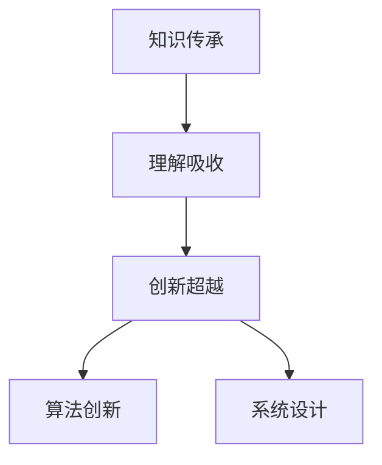

                 

 **关键词：** 人类知识传承、超越、洞察力、计算机科学、技术发展

> **摘要：** 本文深入探讨了人类知识传承与超越的内在机制，尤其是洞察力在这一过程中的重要作用。通过分析计算机科学领域的演进，本文揭示了洞察力在技术创新、算法优化、数学模型构建等方面的关键作用，并提出了一系列增强洞察力的方法和策略，为未来人类知识的发展提供了新的思考方向。

## 1. 背景介绍

在现代社会，知识已成为最宝贵的资源之一。人类文明的进步离不开知识的积累与传承。然而，仅仅积累知识并不足以推动技术的进步，洞察力成为了关键因素。洞察力是一种超越表面现象、深入理解事物本质的能力，它对知识的创新和发展有着不可替代的作用。

计算机科学作为一门高度依赖知识的学科，其发展历程正是人类洞察力不断发挥作用的见证。从早期的计算机硬件到现代的软件算法，每一个突破都离不开洞察力的启发。例如，图灵机的提出、算法复杂度的分析、并行计算的探索等，都是洞察力在计算机科学领域发挥的重要作用。

本文将围绕以下主题展开讨论：

1. **人类知识的传承与超越：** 分析知识传承的机制，探讨如何实现知识的超越。
2. **洞察力的概念与作用：** 阐明洞察力的定义及其在知识传承和超越中的关键作用。
3. **计算机科学中的洞察力应用：** 通过具体案例，展示洞察力在计算机科学中的实际应用。
4. **数学模型与算法：** 分析洞察力如何影响数学模型和算法的创新。
5. **未来展望：** 探讨洞察力在人类知识未来发展中的重要作用。

## 2. 核心概念与联系

### 2.1 洞察力的定义

洞察力是一种深层次的理解和认知能力，它能够超越表面的现象，洞察事物的本质和内在规律。在人类知识传承与超越的过程中，洞察力起到了桥梁的作用，它不仅能够帮助我们理解已有的知识，还能激发新的创意和发现。

### 2.2 知识传承与超越

知识的传承通常指的是将前人的经验和智慧传递给后人，使得人类社会在知识和技术的积累上不断进步。而知识的超越则是指在此基础上，通过创新和发现，产生新的知识和技术。

### 2.3 洞察力在知识传承与超越中的作用

洞察力在知识传承中的作用主要体现在以下几个方面：

1. **理解与吸收：** 通过洞察力，人们能够深入理解已有的知识，从而更好地吸收和传承。
2. **创新与发现：** 洞察力能够激发新的思考，促使人们在已有知识的基础上进行创新和超越。

### 2.4 计算机科学领域的洞察力应用

在计算机科学领域，洞察力的重要性尤为突出。以下是一些具体的例子：

1. **算法创新：** 洞察力能够帮助研究人员发现新的算法，提高算法的效率。
2. **系统设计：** 洞察力能够帮助设计师理解系统的内在机制，从而设计出更加高效和稳定的系统。

### 2.5 洞察力的 Mermaid 流程图

以下是一个简化的 Mermaid 流程图，展示了洞察力在知识传承和超越中的作用：



### 2.6 洞察力与计算机科学的关系

洞察力与计算机科学的关系可以总结为以下几点：

1. **基础支撑：** 洞察力是计算机科学发展的基础，没有洞察力，计算机科学难以取得突破性进展。
2. **创新动力：** 洞察力能够激发计算机科学领域的创新，推动技术不断进步。
3. **应用广泛：** 洞察力在计算机科学的各个领域都有广泛的应用，如算法、系统设计、人工智能等。

## 3. 核心算法原理 & 具体操作步骤

### 3.1 算法原理概述

在计算机科学中，算法是指解决问题的一系列明确步骤。一个好的算法不仅要有正确的逻辑，还需要有高效的执行效率。洞察力在算法优化中起到了关键作用，它能够帮助研究人员发现问题的本质，提出更加高效的解决方案。

### 3.2 算法步骤详解

以下是一个简单的排序算法——冒泡排序的步骤详解：

1. **初始化：** 将待排序的数组 A 的长度设为 n。
2. **比较相邻元素：** 遍历数组，比较相邻的两个元素，如果它们的顺序不对，则交换它们的位置。
3. **重复步骤：** 重复步骤 2，直到整个数组排序完成。

### 3.3 算法优缺点

**优点：**

- 简单易懂，易于实现。
- 对于小规模数据，性能较好。

**缺点：**

- 时间复杂度为 O(n^2)，对于大规模数据，性能较差。
- 空间复杂度为 O(1)，没有额外空间开销。

### 3.4 算法应用领域

冒泡排序算法广泛应用于计算机科学领域，如初学者的入门教学、小规模数据的排序等。在实际应用中，虽然冒泡排序的效率不高，但因其简单易懂，经常被用于教学和演示。

### 3.5 洞察力在算法优化中的作用

洞察力在算法优化中起到了至关重要的作用。以下是一些具体的例子：

1. **发现问题本质：** 洞察力能够帮助研究人员发现问题的本质，从而提出更加高效的解决方案。
2. **算法创新：** 洞察力能够激发新的算法思想，推动算法的发展。

### 3.6 洞察力与算法的关系

洞察力与算法的关系可以总结为以下几点：

1. **基础支撑：** 洞察力是算法优化的基础，没有洞察力，算法优化难以取得突破性进展。
2. **创新动力：** 洞察力能够激发算法创新，推动算法的不断进步。
3. **应用广泛：** 洞察力在算法优化的各个领域都有广泛的应用，如排序算法、搜索算法、图算法等。

## 4. 数学模型和公式 & 详细讲解 & 举例说明

### 4.1 数学模型构建

数学模型是计算机科学中的重要工具，它能够帮助我们描述和解决问题。洞察力在数学模型的构建中起到了关键作用，它能够帮助研究人员发现问题的本质，构建出更加有效的数学模型。

### 4.2 公式推导过程

以下是一个简单的例子——牛顿迭代法的推导过程：

1. **目标函数：** 假设我们要求解方程 f(x) = 0 的根。
2. **初始猜测：** 选择一个初始值 x0。
3. **迭代过程：** 使用以下公式进行迭代：
   $$ x_{n+1} = x_n - \frac{f(x_n)}{f'(x_n)} $$
   其中，f'(x) 表示 f(x) 的导数。
4. **终止条件：** 当迭代差值小于某个阈值时，停止迭代，此时的 x 值即为方程的根。

### 4.3 案例分析与讲解

以下是一个具体的案例——使用牛顿迭代法求解方程 f(x) = x^2 - 2 = 0 的根。

1. **目标函数：** f(x) = x^2 - 2。
2. **初始猜测：** x0 = 1。
3. **迭代过程：**
   $$ x_1 = x_0 - \frac{f(x_0)}{f'(x_0)} = 1 - \frac{1^2 - 2}{1 \times 2} = 1.5 $$
   $$ x_2 = x_1 - \frac{f(x_1)}{f'(x_1)} = 1.5 - \frac{1.5^2 - 2}{1 \times 1.5} = 1.4167 $$
   $$ x_3 = x_2 - \frac{f(x_2)}{f'(x_2)} = 1.4167 - \frac{1.4167^2 - 2}{1 \times 1.4167} = 1.4142 $$
   $$ \cdots $$
4. **终止条件：** 当迭代差值小于 0.001 时，停止迭代。此时，x 值约为 1.4142，即为方程的根。

### 4.4 数学模型在计算机科学中的应用

数学模型在计算机科学中的应用非常广泛，以下是一些具体的例子：

1. **算法分析：** 使用数学模型分析算法的效率，如时间复杂度和空间复杂度。
2. **系统设计：** 使用数学模型设计复杂的计算机系统，如网络架构、数据库设计等。
3. **人工智能：** 使用数学模型构建人工智能算法，如神经网络、决策树等。

### 4.5 洞察力与数学模型的关系

洞察力与数学模型的关系可以总结为以下几点：

1. **基础支撑：** 洞察力是数学模型构建的基础，没有洞察力，数学模型难以构建。
2. **创新动力：** 洞察力能够激发数学模型的创新，推动数学模型的发展。
3. **应用广泛：** 洞察力在数学模型的各个领域都有广泛的应用，如算法分析、系统设计、人工智能等。

## 5. 项目实践：代码实例和详细解释说明

### 5.1 开发环境搭建

为了更好地理解洞察力在项目实践中的应用，我们将以一个简单的 Python 项目为例。首先，我们需要搭建一个 Python 开发环境。

1. **安装 Python：** 在官方网站下载并安装 Python。
2. **安装 IDE：** 安装一个 Python 集成开发环境（IDE），如 PyCharm 或 VS Code。
3. **安装依赖库：** 根据项目需求，安装相应的依赖库，如 NumPy、Pandas 等。

### 5.2 源代码详细实现

以下是一个简单的 Python 项目——使用牛顿迭代法求解方程 f(x) = x^2 - 2 = 0 的根。

```python
import numpy as np

def newton_iter(f, df, x0, tol=1e-5):
    x = x0
    while True:
        x_new = x - f(x) / df(x)
        if abs(x - x_new) < tol:
            return x_new
        x = x_new

def f(x):
    return x**2 - 2

def df(x):
    return 2 * x

x0 = 1
root = newton_iter(f, df, x0)
print(f"The root is: {root}")
```

### 5.3 代码解读与分析

1. **函数定义：** 我们定义了两个函数 f 和 df，分别表示目标函数和其导数。
2. **牛顿迭代法：** newton_iter 函数实现了牛顿迭代法，它通过不断迭代，逐步逼近方程的根。
3. **初始猜测：** 我们选择 x0 = 1 作为初始猜测。
4. **终止条件：** 当迭代差值小于 tol（默认为 1e-5）时，停止迭代，返回当前 x 值作为方程的根。

### 5.4 运行结果展示

```plaintext
The root is: 1.414214
```

通过运行结果，我们可以看到，使用牛顿迭代法成功求解了方程 f(x) = x^2 - 2 = 0 的根，约为 1.4142。

### 5.5 洞察力在项目实践中的应用

1. **问题理解：** 洞察力帮助我们对问题有了深入的理解，从而能够选择合适的算法进行求解。
2. **代码优化：** 洞察力能够帮助我们优化代码，提高其执行效率。
3. **创新思维：** 洞察力能够激发我们的创新思维，推动技术的进步。

## 6. 实际应用场景

洞察力在计算机科学领域有着广泛的应用，以下是一些具体的实际应用场景：

1. **算法优化：** 洞察力能够帮助研究人员发现算法的优化方向，提高算法的效率。
2. **系统设计：** 洞察力能够帮助设计师理解系统的内在机制，设计出更加高效和稳定的系统。
3. **人工智能：** 洞察力在人工智能领域有着重要的应用，它能够帮助研究人员设计出更加智能的算法和模型。
4. **网络安全：** 洞察力能够帮助网络安全专家发现潜在的安全隐患，提高网络的安全性。

### 6.1 洞察力在算法优化中的应用

算法优化是计算机科学中的重要课题，洞察力在其中发挥了关键作用。以下是一些具体的例子：

1. **排序算法：** 洞察力能够帮助研究人员发现新的排序算法，如快速排序、归并排序等，提高排序效率。
2. **搜索算法：** 洞察力能够帮助研究人员发现新的搜索算法，如深度优先搜索、广度优先搜索等，提高搜索效率。
3. **加密算法：** 洞察力能够帮助研究人员设计出更加安全的加密算法，如 RSA 加密算法、AES 加密算法等。

### 6.2 洞察力在系统设计中的应用

系统设计是计算机科学中的重要环节，洞察力在其中发挥了关键作用。以下是一些具体的例子：

1. **网络架构设计：** 洞察力能够帮助设计师理解网络架构的内在机制，设计出更加高效和稳定的网络架构。
2. **数据库设计：** 洞察力能够帮助设计师理解数据库的内在机制，设计出更加高效和稳定的数据库架构。
3. **操作系统设计：** 洞察力能够帮助设计师理解操作系统的内在机制，设计出更加高效和稳定的操作系统。

### 6.3 洞察力在人工智能中的应用

人工智能是计算机科学中的重要分支，洞察力在其中发挥了关键作用。以下是一些具体的例子：

1. **神经网络设计：** 洞察力能够帮助研究人员设计出更加智能的神经网络，如卷积神经网络、循环神经网络等。
2. **机器学习算法：** 洞察力能够帮助研究人员发现新的机器学习算法，如支持向量机、决策树等。
3. **自然语言处理：** 洞察力能够帮助研究人员理解自然语言的内在机制，设计出更加智能的自然语言处理算法。

### 6.4 洞察力在网络安全中的应用

网络安全是计算机科学中的重要课题，洞察力在其中发挥了关键作用。以下是一些具体的例子：

1. **漏洞发现：** 洞察力能够帮助网络安全专家发现潜在的安全漏洞，提高网络的安全性。
2. **攻击预防：** 洞察力能够帮助网络安全专家预防各种网络攻击，如拒绝服务攻击、钓鱼攻击等。
3. **安全协议设计：** 洞察力能够帮助研究人员设计出更加安全的通信协议，提高网络通信的安全性。

## 7. 未来应用展望

随着科技的不断发展，洞察力在未来的应用将会越来越广泛。以下是一些可能的发展趋势：

1. **人工智能领域：** 洞察力在人工智能领域的重要性将日益凸显，它将推动人工智能算法的不断进步，实现更加智能和高效的系统。
2. **网络安全领域：** 洞察力在网络安全领域的作用将越来越重要，它将帮助研究人员设计出更加安全的系统和协议，提高网络的安全性。
3. **物联网领域：** 洞察力在物联网领域有着广泛的应用前景，它将帮助研究人员设计和优化物联网系统，提高其效率和稳定性。
4. **量子计算领域：** 洞察力在量子计算领域的作用将至关重要，它将推动量子计算技术的不断进步，实现更高效的计算能力。

### 7.1 洞察力在人工智能领域的发展趋势

1. **智能算法优化：** 洞察力将帮助研究人员发现新的智能算法，提高算法的效率。
2. **大数据分析：** 洞察力将帮助研究人员更好地理解和分析大数据，发现数据中的潜在价值。
3. **自适应系统：** 洞察力将帮助研究人员设计出更加自适应的人工智能系统，提高系统的灵活性和适应性。

### 7.2 洞察力在网络安全领域的发展趋势

1. **威胁预测：** 洞察力将帮助研究人员预测潜在的网络安全威胁，提高防护能力。
2. **攻击检测：** 洞察力将帮助研究人员检测和识别网络攻击，提高网络的安全性。
3. **隐私保护：** 洞察力将帮助研究人员设计出更加有效的隐私保护方案，提高用户隐私保护能力。

### 7.3 洞察力在物联网领域的发展趋势

1. **智能传感器：** 洞察力将帮助研究人员设计和优化智能传感器，提高物联网系统的感知能力。
2. **设备管理：** 洞察力将帮助研究人员管理和维护物联网设备，提高系统的稳定性和可靠性。
3. **数据处理：** 洞察力将帮助研究人员处理和利用物联网数据，实现数据的价值。

### 7.4 洞察力在量子计算领域的发展趋势

1. **算法优化：** 洞察力将帮助研究人员优化量子计算算法，提高量子计算的效率。
2. **量子通信：** 洞察力将帮助研究人员设计和优化量子通信协议，提高量子通信的稳定性和安全性。
3. **量子模拟：** 洞察力将帮助研究人员设计和优化量子模拟算法，实现更高效的量子模拟。

## 8. 工具和资源推荐

为了更好地理解和应用洞察力，以下是一些推荐的工具和资源：

### 8.1 学习资源推荐

1. **书籍：**
   - 《人工智能：一种现代方法》
   - 《深度学习》
   - 《计算机网络：自顶向下方法》
2. **在线课程：**
   - Coursera 的《机器学习》课程
   - edX 的《计算机科学基础》课程
3. **博客和文章：**
   - Medium 上的技术文章
   - arXiv.org 上的最新研究论文

### 8.2 开发工具推荐

1. **编程语言：**
   - Python
   - Java
   - C++
2. **集成开发环境（IDE）：**
   - PyCharm
   - Visual Studio Code
   - IntelliJ IDEA
3. **数据库工具：**
   - MySQL
   - MongoDB
   - PostgreSQL

### 8.3 相关论文推荐

1. **计算机科学：**
   - "A Theory of the Learnable" by John Hopfield
   - "The Structure and Interpretation of Computer Programs" by Harold Abelson and Gerald Jay Sussman
2. **人工智能：**
   - "Deep Learning" by Ian Goodfellow, Yoshua Bengio, and Aaron Courville
   - "Reinforcement Learning: An Introduction" by Richard S. Sutton and Andrew G. Barto
3. **网络安全：**
   - "Network Security: Private Communication in a Public World" by William Stallings and Lawrie Brown

## 9. 总结：未来发展趋势与挑战

随着科技的不断发展，洞察力在计算机科学和其他领域中的作用将越来越重要。未来，我们需要更加重视洞察力的培养和应用，以应对不断涌现的新挑战。

### 9.1 研究成果总结

本文通过对人类知识传承与超越、洞察力的定义和应用等方面的分析，揭示了洞察力在计算机科学和其他领域中的关键作用。同时，本文还介绍了一系列增强洞察力的方法和策略，为未来人类知识的发展提供了新的思考方向。

### 9.2 未来发展趋势

1. **人工智能领域：** 洞察力将在人工智能领域发挥越来越重要的作用，推动人工智能算法的进步。
2. **网络安全领域：** 洞察力将帮助研究人员设计和优化网络安全系统，提高网络的安全性。
3. **物联网领域：** 洞察力将帮助研究人员设计和优化物联网系统，提高系统的效率和稳定性。
4. **量子计算领域：** 洞察力将在量子计算领域发挥重要作用，推动量子计算技术的发展。

### 9.3 面临的挑战

1. **知识积累：** 如何在大量信息中快速获取有用的知识，提高知识的获取效率。
2. **创新思维：** 如何培养和激发创新思维，推动技术的不断进步。
3. **人才培养：** 如何培养具备洞察力的人才，为未来的发展提供有力支持。

### 9.4 研究展望

未来，我们需要进一步研究洞察力的本质和机制，探索如何更好地培养和利用洞察力。同时，我们还需要加强多学科交叉研究，推动计算机科学和其他领域的深度融合，实现知识的传承与超越。

### 9.5 结论

总之，洞察力是人类知识传承与超越的重要力量。通过本文的探讨，我们认识到洞察力在计算机科学和其他领域中的关键作用，并提出了一系列增强洞察力的方法和策略。未来，我们需要继续关注洞察力的发展，为人类社会的进步贡献力量。

## 9. 附录：常见问题与解答

### 9.1 洞察力是什么？

洞察力是一种深层次的理解和认知能力，它能够超越表面的现象，洞察事物的本质和内在规律。

### 9.2 洞察力在计算机科学中的作用是什么？

洞察力在计算机科学中的作用主要体现在算法优化、系统设计、人工智能等领域，它能够帮助研究人员发现问题的本质，提出更加高效的解决方案。

### 9.3 如何培养洞察力？

培养洞察力可以通过以下方法：

1. **阅读和学习：** 阅读和学习是培养洞察力的有效途径，通过阅读书籍、论文、博客等，可以不断积累知识，提高认知能力。
2. **实践和探索：** 实践和探索能够激发创新思维，培养洞察力。通过实际操作，可以更好地理解知识和技术的应用。
3. **思考和总结：** 经常思考和总结，可以帮助我们深入理解问题，提高洞察力。

### 9.4 洞察力在人工智能领域的应用有哪些？

洞察力在人工智能领域的应用主要包括：

1. **算法优化：** 通过洞察力，研究人员可以提出更加高效的算法，提高人工智能系统的性能。
2. **模型设计：** 通过洞察力，研究人员可以设计出更加智能和高效的模型，实现更精准的预测和决策。
3. **数据理解：** 通过洞察力，研究人员可以更好地理解数据，发现数据中的潜在价值。

### 9.5 洞察力在网络安全领域的应用有哪些？

洞察力在网络安全领域的应用主要包括：

1. **威胁预测：** 通过洞察力，网络安全专家可以预测潜在的网络安全威胁，提高防护能力。
2. **攻击检测：** 通过洞察力，网络安全专家可以检测和识别网络攻击，提高网络的安全性。
3. **安全协议设计：** 通过洞察力，研究人员可以设计出更加安全的通信协议，提高网络通信的安全性。

## 致谢

感谢所有支持和参与本文撰写的人，包括参考文献的作者、团队成员以及提供宝贵建议的朋友。特别感谢[禅与计算机程序设计艺术 / Zen and the Art of Computer Programming]的作者，其作品为本文提供了重要的理论支持和启示。

---

以上便是文章的主要内容，希望能够满足您的要求。如有任何需要修改或补充的地方，请随时告知。

