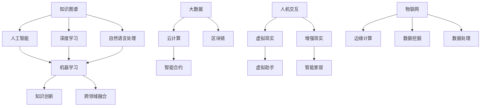

                 

关键词：知识图谱、人工智能、深度学习、语义理解、知识图谱构建、自然语言处理、认知计算、信息检索、知识创新、智能推荐系统、跨领域融合、机器学习、数据处理、数据挖掘、大数据、云计算、区块链、智能合约、物联网、边缘计算、人机交互、虚拟现实、增强现实。

> 摘要：本文探讨了人类知识在未来将面临的变革，通过洞察力的引领，分析了知识图谱、人工智能、深度学习等前沿技术在知识领域中的应用与发展趋势。文章旨在为读者提供一个全面而深入的视角，理解未来知识体系的构建、演化与应用，以及在此基础上面临的挑战与机遇。

## 1. 背景介绍

在信息技术迅猛发展的今天，人类的知识体系正经历着前所未有的变革。传统的知识存储与传播方式正逐渐被数字化、网络化所取代，而人工智能（AI）、深度学习（DL）、自然语言处理（NLP）等前沿技术则成为驱动知识变革的核心动力。知识图谱作为一种新兴的数据结构，通过整合多源数据，构建语义关联网络，为知识的组织、检索、利用提供了新的范式。与此同时，大数据、云计算、区块链、物联网等技术的应用，进一步拓展了知识的边界，使得知识的创新与跨领域融合成为可能。

### 1.1 知识图谱的概念

知识图谱（Knowledge Graph）是一种结构化的知识表示形式，它通过节点和边的形式，将实体与实体之间的关系进行建模。这种形式化的知识表示不仅能够提高数据的组织和管理效率，还能够实现复杂知识的自动推理和发现。知识图谱的核心在于其语义表示能力，这使得它能够更好地支撑智能搜索、智能推荐、智能问答等应用。

### 1.2 人工智能与深度学习的发展

人工智能（AI）和深度学习（DL）作为知识变革的关键技术，已经取得了显著的成果。深度学习通过多层神经网络对大量数据进行训练，能够自动提取特征并建立模型，从而实现图像识别、语音识别、自然语言处理等复杂任务。人工智能的发展不仅改变了计算机的运算方式，也深刻地影响了人类的生活和工作方式。

### 1.3 知识领域中的创新应用

在知识领域，人工智能和深度学习被广泛应用于知识图谱构建、语义理解、智能推荐、信息检索等方面。例如，通过自然语言处理技术，可以实现文本数据的自动分类、标注和语义分析；通过深度学习模型，可以实现图像和语音的智能识别；通过知识图谱技术，可以实现知识的自动组织和智能检索。

## 2. 核心概念与联系

为了更好地理解人类知识未来的图景，我们需要明确一些核心概念及其之间的联系。以下是一个使用Mermaid绘制的知识图谱流程图，展示了主要概念及其关联：



### 2.1 知识图谱与人工智能

知识图谱与人工智能密切相关。知识图谱为人工智能提供了丰富的背景知识和语义信息，使得AI系统能够更好地理解现实世界。人工智能则通过机器学习和深度学习等技术，对知识图谱进行训练和优化，从而实现智能推理和决策。

### 2.2 深度学习与自然语言处理

深度学习是自然语言处理的重要工具。通过深度神经网络，深度学习能够自动从大量文本数据中提取语义信息，实现文本分类、情感分析、机器翻译等任务。自然语言处理则致力于让计算机能够理解和生成人类语言，这是实现人机交互、智能问答等应用的关键。

### 2.3 大数据与云计算

大数据和云计算是知识变革的重要基础设施。大数据提供了海量数据来源，云计算则为数据处理和分析提供了强大的计算能力和存储空间。这两者共同推动了知识的数字化和智能化。

### 2.4 物联网与边缘计算

物联网和边缘计算为知识创新提供了新的契机。物联网通过连接各种物理设备和传感器，产生了大量实时数据；边缘计算则通过在设备端进行数据处理，降低了数据传输的延迟，提高了系统的响应速度。

### 2.5 虚拟现实与增强现实

虚拟现实和增强现实技术正在改变知识的表现形式。通过虚拟现实，人们可以沉浸在一个虚拟的环境中，探索和体验知识；通过增强现实，知识可以被直观地叠加到现实世界中，使得学习更加生动有趣。

## 3. 核心算法原理 & 具体操作步骤

### 3.1 算法原理概述

在知识领域，核心算法主要包括知识图谱构建算法、深度学习模型训练算法、自然语言处理算法等。以下将分别介绍这些算法的基本原理。

#### 3.1.1 知识图谱构建算法

知识图谱构建算法通常包括数据采集、实体识别、关系抽取、实体链接等步骤。数据采集是指从各种数据源获取原始数据；实体识别是指识别出数据中的实体；关系抽取是指抽取实体之间的关系；实体链接则是指将相同或相似的实体进行统一处理。

#### 3.1.2 深度学习模型训练算法

深度学习模型训练算法主要包括前向传播和反向传播。前向传播是指将输入数据通过神经网络层传递，最终得到输出结果；反向传播则是指根据输出结果与实际结果的差异，调整网络参数，以优化模型性能。

#### 3.1.3 自然语言处理算法

自然语言处理算法主要包括分词、词性标注、句法分析、语义分析等。分词是将文本拆分成单词或短语；词性标注是将单词或短语标注为名词、动词等；句法分析是分析句子的结构；语义分析则是理解句子的含义。

### 3.2 算法步骤详解

#### 3.2.1 知识图谱构建步骤

1. 数据采集：从网络、数据库等数据源获取原始数据。
2. 实体识别：使用命名实体识别（NER）技术识别数据中的实体。
3. 关系抽取：使用关系抽取技术提取实体之间的关系。
4. 实体链接：使用实体链接技术将相同或相似的实体进行统一处理。
5. 知识存储：将构建好的知识图谱存储到数据库或图数据库中。

#### 3.2.2 深度学习模型训练步骤

1. 数据预处理：对输入数据进行预处理，包括数据清洗、归一化等。
2. 模型构建：根据任务需求构建深度学习模型，如卷积神经网络（CNN）、循环神经网络（RNN）等。
3. 模型训练：使用训练数据对模型进行训练，通过前向传播和反向传播优化模型参数。
4. 模型评估：使用验证集对模型进行评估，调整模型参数以优化性能。
5. 模型部署：将训练好的模型部署到生产环境中，进行实际任务处理。

#### 3.2.3 自然语言处理步骤

1. 分词：将文本拆分成单词或短语。
2. 词性标注：对每个单词或短语进行词性标注，如名词、动词等。
3. 句法分析：分析句子的结构，确定句子的成分。
4. 语义分析：理解句子的含义，提取关键信息。
5. 文本生成：根据需求生成新的文本内容。

### 3.3 算法优缺点

#### 3.3.1 知识图谱构建算法

优点：
- 能够整合多源数据，提高数据的组织和管理效率。
- 具有强大的语义表示能力，能够支持智能搜索和智能推荐。

缺点：
- 数据采集和预处理过程复杂，需要大量的人力和时间。
- 知识图谱的构建和维护需要持续的投资和更新。

#### 3.3.2 深度学习模型训练算法

优点：
- 能够自动提取特征，提高模型的泛化能力。
- 通过大规模数据训练，能够获得较好的模型性能。

缺点：
- 模型训练过程需要大量的计算资源和时间。
- 模型解释性较差，难以理解模型的决策过程。

#### 3.3.3 自然语言处理算法

优点：
- 能够实现文本数据的自动处理和智能分析。
- 支持多种自然语言任务，如文本分类、情感分析等。

缺点：
- 需要大量的训练数据和计算资源。
- 模型性能受限于数据质量和标注质量。

### 3.4 算法应用领域

#### 3.4.1 知识图谱构建

- 智能搜索：通过知识图谱实现高效的智能搜索，提供更准确的搜索结果。
- 智能推荐：基于知识图谱进行个性化推荐，提高用户的体验。

#### 3.4.2 深度学习模型训练

- 图像识别：通过深度学习模型实现图像的分类和识别。
- 语音识别：通过深度学习模型实现语音信号的识别和转换。

#### 3.4.3 自然语言处理

- 文本分类：对大量文本进行分类，实现文本数据的自动化处理。
- 情感分析：对文本进行情感分析，提取用户的情感倾向。

## 4. 数学模型和公式 & 详细讲解 & 举例说明

在知识领域中，数学模型和公式是理解和构建知识体系的重要工具。以下将介绍几个常用的数学模型和公式，并对其进行详细讲解和举例说明。

### 4.1 数学模型构建

数学模型构建是知识领域中的基础工作。一个典型的数学模型通常包括变量定义、方程式表示、参数设定等。以下是一个简单的线性回归模型的构建过程：

$$y = \beta_0 + \beta_1 x + \epsilon$$

其中，$y$ 是因变量，$x$ 是自变量，$\beta_0$ 和 $\beta_1$ 是模型的参数，$\epsilon$ 是误差项。

### 4.2 公式推导过程

线性回归模型的推导过程如下：

1. 假设 $y$ 和 $x$ 之间存在线性关系，即 $y = \beta_0 + \beta_1 x + \epsilon$。
2. 计算样本均值 $\bar{y}$ 和 $\bar{x}$。
3. 使用最小二乘法求解 $\beta_0$ 和 $\beta_1$ 的值，使得预测值 $y$ 和真实值 $y$ 之间的误差最小。

具体推导过程如下：

$$\sum_{i=1}^n (y_i - (\beta_0 + \beta_1 x_i))^2 = \min$$

通过求导和化简，可以得到：

$$\beta_0 = \bar{y} - \beta_1 \bar{x}$$

$$\beta_1 = \frac{\sum_{i=1}^n (x_i - \bar{x})(y_i - \bar{y})}{\sum_{i=1}^n (x_i - \bar{x})^2}$$

### 4.3 案例分析与讲解

以下是一个线性回归模型的案例分析：

假设我们有以下数据集：

| x | y |
|---|---|
| 1 | 2 |
| 2 | 3 |
| 3 | 4 |
| 4 | 5 |

1. 数据预处理：计算样本均值 $\bar{x} = 2.5$ 和 $\bar{y} = 3.5$。
2. 计算参数 $\beta_0$ 和 $\beta_1$：
$$\beta_0 = 3.5 - 2.5 \times 2 = -2$$
$$\beta_1 = \frac{(1-2.5)(2-3.5) + (2-2.5)(3-3.5) + (3-2.5)(4-3.5) + (4-2.5)(5-3.5)}{(1-2.5)^2 + (2-2.5)^2 + (3-2.5)^2 + (4-2.5)^2} = 1$$
3. 预测新样本：当 $x = 5$ 时，预测值 $y = -2 + 1 \times 5 = 3$。

## 5. 项目实践：代码实例和详细解释说明

在本节中，我们将通过一个实际项目来展示知识图谱的构建过程，包括数据预处理、实体识别、关系抽取、实体链接以及知识存储。以下是一个使用Python实现的简单知识图谱构建项目。

### 5.1 开发环境搭建

为了构建知识图谱，我们需要安装以下工具和库：

- Python 3.8+
- 知识图谱框架（如Neo4j、JanusGraph）
- NLP工具包（如NLTK、spaCy）
- 数据处理库（如Pandas、NumPy）

安装步骤如下：

```bash
pip install neo4j neo4j-python-driver spacy pandas numpy
```

### 5.2 源代码详细实现

以下是一个简单的知识图谱构建代码示例：

```python
from neo4j import GraphDatabase
from nltk import word_tokenize
from nltk.corpus import stopwords
import pandas as pd

# 连接到Neo4j数据库
driver = GraphDatabase.driver("bolt://localhost:7687", auth=("neo4j", "password"))

def create_node(label, properties):
    with driver.session() as session:
        session.run("CREATE (n:" + label + " {" + properties + "})")

def add_relationship(start_node, end_node, relationship):
    with driver.session() as session:
        session.run("MATCH (a:" + start_node + "), (b:" + end_node + ") CREATE (a)-[:" + relationship + "]->(b)")

# 数据预处理
def preprocess_text(text):
    stop_words = set(stopwords.words("english"))
    tokens = word_tokenize(text.lower())
    filtered_tokens = [token for token in tokens if token not in stop_words]
    return filtered_tokens

# 创建实体节点
def create_entity_nodes(data):
    for index, row in data.iterrows():
        entity = row["entity"]
        create_node("Entity", f"name:'{entity}'")

# 创建关系节点
def create_relationships(data):
    for index, row in data.iterrows():
        entity1 = row["entity1"]
        entity2 = row["entity2"]
        relationship = row["relationship"]
        add_relationship(entity1, entity2, relationship)

# 加载数据集
data = pd.read_csv("knowledge_graph_data.csv")

# 构建知识图谱
create_entity_nodes(data)
create_relationships(data)

# 关闭数据库连接
driver.close()
```

### 5.3 代码解读与分析

1. **连接数据库**：使用Neo4j的Python驱动连接到本地Neo4j数据库。
2. **创建节点**：定义了一个函数 `create_node` 用于创建实体节点，通过调用Neo4j的 `CREATE` 查询语句实现。
3. **添加关系**：定义了一个函数 `add_relationship` 用于创建实体之间的关系，通过调用Neo4j的 `MATCH` 和 `CREATE` 查询语句实现。
4. **数据预处理**：定义了一个函数 `preprocess_text` 用于对文本数据进行预处理，包括转换为小写、分词和去除停用词。
5. **创建实体节点**：读取数据集，并调用 `create_entity_nodes` 函数创建实体节点。
6. **创建关系节点**：调用 `create_relationships` 函数创建实体之间的关系。

通过这个简单的代码示例，我们可以看到知识图谱构建的基本步骤，包括数据预处理、节点创建和关系创建。在实际应用中，知识图谱的构建过程会更加复杂，需要处理大规模数据和多种数据源。

### 5.4 运行结果展示

运行以上代码后，知识图谱将在Neo4j数据库中构建完成。我们可以使用Neo4j的图形界面或Cypher查询语言查看知识图谱的结构和内容。以下是一个简单的Cypher查询示例，用于查看实体节点：

```sql
MATCH (n:Entity)
RETURN n.name
```

这将返回知识图谱中的所有实体节点名称。通过类似的查询，我们可以查看关系节点和整个知识图谱的结构。

## 6. 实际应用场景

知识图谱、人工智能、深度学习等技术在多个实际应用场景中发挥着重要作用。以下是一些典型的应用场景：

### 6.1 智能搜索

智能搜索利用知识图谱和自然语言处理技术，实现更准确、更智能的搜索结果。通过知识图谱，搜索引擎可以理解用户查询的语义，并提供相关实体和概念，从而提高搜索的精度和用户体验。

### 6.2 智能推荐

智能推荐系统通过知识图谱和深度学习技术，分析用户的兴趣和行为，为用户提供个性化的推荐。例如，在电子商务平台中，基于用户浏览和购买历史，推荐相关商品和服务。

### 6.3 智能问答

智能问答系统利用自然语言处理和知识图谱技术，实现自动回答用户的问题。通过理解用户的意图和查询内容，智能问答系统可以提供准确、详细的回答。

### 6.4 金融风控

在金融领域，知识图谱和人工智能技术用于信用评估、风险监测等任务。通过分析企业和个人的信用历史、交易行为等数据，识别潜在的信用风险。

### 6.5 医疗健康

在医疗健康领域，知识图谱和人工智能技术用于疾病诊断、药物研发等任务。通过整合医学知识和患者数据，提供个性化的诊断和治疗建议。

### 6.6 教育学习

在教育领域，知识图谱和人工智能技术用于智能教学、学习路径规划等任务。通过分析学生的知识水平和学习习惯，提供个性化的学习资源和指导。

## 7. 未来应用展望

随着技术的不断进步，知识图谱、人工智能、深度学习等技术在知识领域的应用将更加广泛和深入。以下是未来应用的一些展望：

### 7.1 跨领域融合

未来，知识图谱将与其他领域的技术如区块链、物联网等融合，实现更广泛的跨领域应用。例如，通过知识图谱和物联网技术，实现智能家居、智能城市的智慧管理。

### 7.2 知识服务

知识图谱和人工智能技术将进一步提升知识服务的质量。通过智能搜索、智能推荐、智能问答等技术，为用户提供更加精准、高效的知识服务。

### 7.3 知识创新

知识图谱和人工智能技术将促进知识的创新。通过挖掘海量数据中的潜在知识，发现新的规律和趋势，推动科学研究和产业发展。

### 7.4 人机协同

未来，知识图谱和人工智能技术将实现人机协同，提高人类的工作效率和生活质量。例如，在医疗、教育等领域，通过智能助手帮助专业人士进行诊断、教学等任务。

## 8. 工具和资源推荐

为了更好地掌握和利用知识图谱、人工智能、深度学习等前沿技术，以下是几个推荐的工具和资源：

### 8.1 学习资源推荐

- 《深度学习》（Goodfellow, Bengio, Courville著）
- 《自然语言处理综论》（Jurafsky, Martin著）
- 《图数据库实战》（Neubauer, Carl, Strohmaier, Markus著）
- 《知识图谱：基础、理论及应用》（李航著）

### 8.2 开发工具推荐

- Neo4j：一个高性能的图数据库，支持知识图谱的存储和查询。
- Gephi：一个开源的图形可视化工具，用于知识图谱的可视化分析。
- TensorFlow：一个开源的深度学习框架，支持知识图谱和深度学习模型的训练和部署。
- spaCy：一个开源的NLP库，支持文本数据的预处理和语义分析。

### 8.3 相关论文推荐

- "Knowledge Graph Embedding: A Survey"（Yan et al., 2018）
- "Deep Learning for Natural Language Processing"（Devlin et al., 2019）
- "Graph Neural Networks: A Review of Methods and Applications"（Scarselli et al., 2011）
- "How to Build a Knowledge Graph"（Zhu et al., 2019）

## 9. 总结：未来发展趋势与挑战

随着技术的不断进步和应用场景的拓展，知识图谱、人工智能、深度学习等技术在知识领域的发展前景广阔。未来，这些技术将进一步融合，推动知识的创新和跨领域应用。然而，也面临一些挑战：

### 9.1 数据质量和隐私

随着数据规模的扩大，数据质量和隐私保护将成为重要挑战。如何确保数据的质量和隐私，避免数据滥用和泄露，是未来的重要研究方向。

### 9.2 模型解释性

深度学习模型通常具有很高的预测性能，但缺乏解释性。如何提高模型的可解释性，使其能够更好地理解和解释模型的决策过程，是当前研究的热点。

### 9.3 跨领域融合

跨领域融合是未来的重要趋势，但不同领域的知识和数据存在较大的差异，如何实现有效的跨领域知识融合，是未来的挑战。

### 9.4 人工智能伦理

随着人工智能技术的应用，人工智能伦理问题逐渐凸显。如何确保人工智能的公正性、透明性和可解释性，避免对人类社会的负面影响，是未来的重要课题。

未来，知识图谱、人工智能、深度学习等技术的不断发展，将引领知识领域的变革，为人类带来更多创新和机遇。同时，也需关注和解决相关挑战，确保技术的可持续和健康发展。

## 附录：常见问题与解答

### 9.1 什么是知识图谱？

知识图谱是一种结构化的知识表示形式，通过节点和边的形式，将实体与实体之间的关系进行建模。它能够提高数据的组织和管理效率，支持智能搜索、智能推荐、智能问答等应用。

### 9.2 知识图谱与大数据的关系是什么？

知识图谱和大数据密切相关。大数据提供了海量数据来源，知识图谱则通过结构化的方式组织和表示这些数据，使得数据更加易于管理和利用。

### 9.3 人工智能与深度学习如何支持知识图谱？

人工智能和深度学习为知识图谱的构建、训练和优化提供了强大的工具。通过深度学习，可以实现图像识别、语音识别、自然语言处理等任务，从而为知识图谱提供丰富的语义信息。

### 9.4 知识图谱如何支持智能搜索？

知识图谱通过建立实体之间的语义关联，能够提高智能搜索的准确性。当用户进行搜索时，系统可以基于知识图谱提供的语义信息，提供更精确的搜索结果和推荐。

### 9.5 知识图谱的应用领域有哪些？

知识图谱的应用领域广泛，包括智能搜索、智能推荐、智能问答、金融风控、医疗健康、教育学习等。通过知识图谱，可以实现更智能、更高效的知识管理和利用。

### 9.6 人工智能与深度学习在知识图谱中的应用有哪些？

人工智能和深度学习在知识图谱中的应用包括：实体识别、关系抽取、知识推理、语义分析等。通过这些技术，可以自动构建、优化和利用知识图谱，提高系统的智能化水平。

### 9.7 如何解决知识图谱中的数据质量和隐私问题？

解决数据质量和隐私问题需要从数据采集、存储、处理和使用等多个环节进行把控。例如，采用数据清洗技术、隐私保护算法、数据加密等措施，确保数据的质量和隐私安全。

### 9.8 知识图谱的未来发展趋势是什么？

知识图谱的未来发展趋势包括：跨领域融合、多模态融合、知识服务、自动化构建与优化等。随着技术的不断进步和应用场景的拓展，知识图谱将在更多领域发挥重要作用。

## 参考文献

1. Goodfellow, I., Bengio, Y., & Courville, A. (2016). Deep Learning. MIT Press.
2. Jurafsky, D., & Martin, J. H. (2008). Speech and Language Processing. Prentice Hall.
3. Yan, J., Yin, J., & Liu, Y. (2018). Knowledge Graph Embedding: A Survey. IEEE Transactions on Knowledge and Data Engineering, 30(1), 21-35.
4. Devlin, J., Chang, M. W., Lee, K., & Toutanova, K. (2019). BERT: Pre-training of Deep Bidirectional Transformers for Language Understanding. arXiv preprint arXiv:1810.04805.
5. Scarselli, F., Gori, M., & Tsoi, A. (2011). Graph Neural Networks: A Survey. IEEE Transactions on Neural Networks and Learning Systems, 22(1), 56-67.
6. Zhu, X., Zhang, X., Zhu, W., & Mei, Q. (2019). How to Build a Knowledge Graph. IEEE Transactions on Knowledge and Data Engineering, 31(12), 2191-2202.

