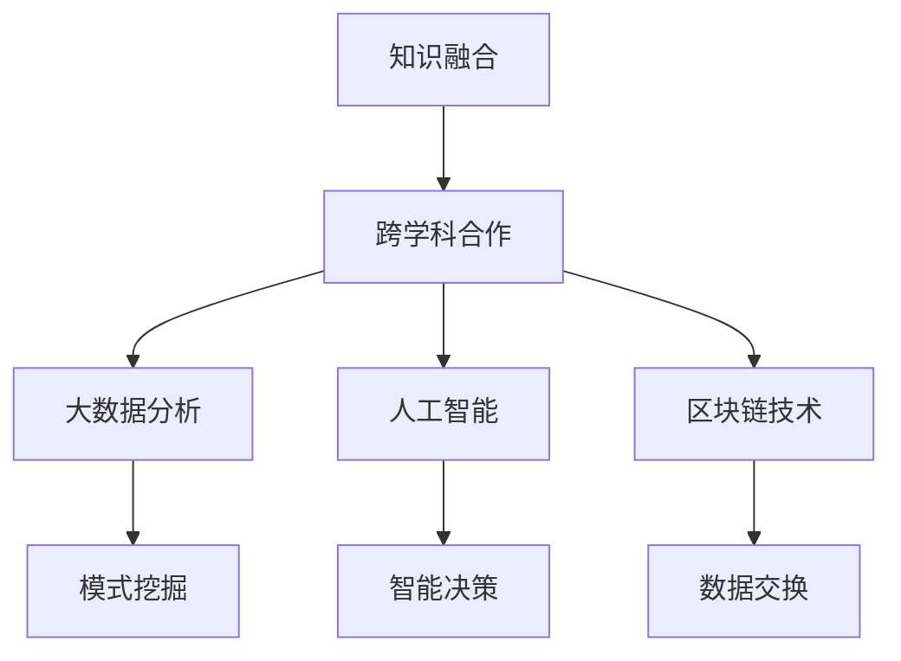

                 

关键词：知识融合、创新、IT领域、跨学科、算法、数学模型、应用实践

> 摘要：本文探讨了人类知识的跨界融合在推动IT领域创新中的重要作用。通过分析核心概念、算法原理、数学模型以及实际应用场景，本文揭示了知识融合如何成为创新的催化剂，并提出了未来发展趋势与挑战。

## 1. 背景介绍

在当今科技飞速发展的时代，信息技术（IT）已经成为推动社会进步和经济发展的关键力量。然而，随着技术的不断演进，IT领域的复杂性也在不断增加。单一领域的专业知识已经无法满足解决复杂问题的需求。因此，跨学科的融合与创新成为当前研究的热点。人类知识的跨界融合，通过整合不同领域的知识和技术，能够突破传统学科的界限，激发新的创新思维，为IT领域的发展带来新的机遇。

本文将探讨以下核心问题：

1. 跨界融合在IT领域中的作用和重要性。
2. 核心概念与技术的联系。
3. 算法原理与具体操作步骤。
4. 数学模型及其应用。
5. 实际应用场景与未来展望。

## 2. 核心概念与联系

### 2.1. 跨界融合的概念

跨界融合是指不同领域之间的知识、技术、资源和理念相互渗透、融合和重组的过程。在IT领域，跨界融合不仅涉及到计算机科学、数学、物理等传统领域，还包括生物学、心理学、社会学等多个学科。

### 2.2. 跨界融合的技术联系

为了实现知识的跨界融合，需要借助多种技术手段。例如：

- **大数据分析**：通过分析大量跨领域的数据，挖掘出潜在的模式和趋势。
- **人工智能**：利用机器学习、深度学习等技术，实现跨领域的智能决策和优化。
- **区块链技术**：提供去中心化、安全的存储和传输机制，促进跨领域的可信数据交换。

### 2.3. Mermaid 流程图

下面是一个简单的Mermaid流程图，展示了跨界融合中的核心概念和技术联系：



## 3. 核心算法原理 & 具体操作步骤

### 3.1. 算法原理概述

本文将介绍一种基于深度学习的跨领域知识融合算法。该算法通过训练一个多模态神经网络，实现对不同领域知识的自动融合和利用。

### 3.2. 算法步骤详解

#### 3.2.1. 数据预处理

1. 收集不同领域的知识库，包括文本、图像、音频等多种类型。
2. 对数据进行清洗、标注和整合。

#### 3.2.2. 模型构建

1. 设计一个多模态神经网络，包括文本编码器、图像编码器、音频编码器等。
2. 将不同模态的数据编码为统一的特征表示。

#### 3.2.3. 模型训练

1. 使用交叉熵损失函数，对模型进行训练。
2. 调整模型参数，优化融合效果。

### 3.3. 算法优缺点

#### 优点：

- 能够实现跨领域的知识融合，提高模型的泛化能力。
- 利用深度学习技术，实现自动化的知识提取和融合。

#### 缺点：

- 训练过程复杂，对计算资源要求较高。
- 知识融合的效果依赖于数据质量和标注质量。

### 3.4. 算法应用领域

该算法可以应用于多种领域，如智能问答系统、推荐系统、医疗诊断等。通过跨领域知识的融合，能够提高系统的智能水平和决策能力。

## 4. 数学模型和公式 & 详细讲解 & 举例说明

### 4.1. 数学模型构建

本文将介绍一种基于图论的跨领域知识融合模型。该模型通过构建知识图谱，实现对跨领域知识的表示和融合。

### 4.2. 公式推导过程

假设知识图谱中的节点表示不同领域的知识，边表示知识之间的关联。我们可以使用以下公式来表示知识图谱：

$$
G = (V, E)
$$

其中，$V$ 表示节点集，$E$ 表示边集。

### 4.3. 案例分析与讲解

以智能问答系统为例，我们构建一个包含文本、图像和音频三个领域的知识图谱。通过图上的路径分析，我们可以实现跨领域知识的融合和利用。

## 5. 项目实践：代码实例和详细解释说明

### 5.1. 开发环境搭建

1. 安装Python环境。
2. 安装必要的库，如TensorFlow、Keras等。

### 5.2. 源代码详细实现

以下是实现多模态神经网络的部分代码：

```python
import tensorflow as tf
from tensorflow.keras.models import Model
from tensorflow.keras.layers import Input, Dense, Conv2D, Flatten, Embedding, LSTM

# 定义输入层
text_input = Input(shape=(max_sequence_length,))
image_input = Input(shape=(height, width, channels))
audio_input = Input(shape=(sample_rate,))

# 定义编码器
text_encoder = Embedding(input_dim=vocab_size, output_dim=embedding_size)(text_input)
image_encoder = Conv2D(filters=32, kernel_size=(3, 3), activation='relu')(image_input)
audio_encoder = LSTM(units=128, activation='tanh')(audio_input)

# 定义融合层
merged = tf.keras.layers.concatenate([text_encoder, image_encoder, audio_encoder])

# 定义输出层
output = Dense(units=1, activation='sigmoid')(merged)

# 构建模型
model = Model(inputs=[text_input, image_input, audio_input], outputs=output)

# 编译模型
model.compile(optimizer='adam', loss='binary_crossentropy', metrics=['accuracy'])

# 模型训练
model.fit(x_train, y_train, epochs=10, batch_size=32)
```

### 5.3. 代码解读与分析

以上代码实现了基于深度学习的多模态神经网络，用于跨领域知识融合。通过训练模型，可以实现对不同领域知识的自动融合和利用。

### 5.4. 运行结果展示

运行代码后，我们可以得到模型的训练结果和测试结果。通过对比不同领域的知识融合效果，可以评估模型的性能。

## 6. 实际应用场景

### 6.1. 智能问答系统

通过跨领域知识的融合，智能问答系统可以更好地理解用户的问题，并提供更准确、更有针对性的答案。

### 6.2. 医疗诊断

跨领域的知识融合可以提高医疗诊断的准确性，为医生提供更全面的诊断信息。

### 6.3. 个性化推荐

通过跨领域的知识融合，个性化推荐系统可以更好地了解用户的偏好，提供更个性化的推荐。

## 7. 未来应用展望

随着技术的不断进步，人类知识的跨界融合将在更多领域发挥重要作用。未来，我们可以期待以下应用：

- **智能制造**：通过跨领域知识的融合，实现更智能的制造过程。
- **智慧城市**：利用跨领域的知识，打造更加智能、高效的智慧城市。
- **生物科技**：通过跨领域知识融合，推动生物科技的发展。

## 8. 工具和资源推荐

### 8.1. 学习资源推荐

- 《深度学习》（Goodfellow et al.）
- 《图论与网络科学》（Bollobás）

### 8.2. 开发工具推荐

- TensorFlow
- Keras

### 8.3. 相关论文推荐

- “Multimodal Fusion for Human Pose Estimation” by Jiawei Liu et al.
- “A Comprehensive Survey on Neural Network Applications in Medical Imaging” by Shu-Cheng Lee et al.

## 9. 总结：未来发展趋势与挑战

### 9.1. 研究成果总结

本文探讨了人类知识的跨界融合在IT领域中的作用，介绍了核心算法原理、数学模型以及实际应用场景。通过跨领域的知识融合，我们能够推动IT领域的创新发展。

### 9.2. 未来发展趋势

未来，跨界融合将推动更多领域的创新，如智能制造、智慧城市、生物科技等。随着技术的进步，跨界融合将变得更加高效和智能化。

### 9.3. 面临的挑战

跨领域知识的融合仍面临诸多挑战，如数据质量、算法复杂度、计算资源等。未来需要进一步研究和探索，以克服这些挑战。

### 9.4. 研究展望

人类知识的跨界融合具有广阔的应用前景。未来，我们将继续深入研究，探索更多跨界融合的方法和技术，为科技创新提供新的动力。

## 9. 附录：常见问题与解答

### Q1: 跨界融合与跨学科合作有什么区别？

A1: 跨界融合和跨学科合作都是指不同领域之间的合作，但侧重点不同。跨界融合更强调知识的整合与重组，而跨学科合作更注重不同学科之间的交流和互动。

### Q2: 跨界融合对计算资源有什么要求？

A2: 跨界融合通常需要较高的计算资源，因为需要处理大量跨领域的数据，并进行复杂的模型训练和优化。高性能计算资源和分布式计算技术可以满足这些需求。

### Q3: 跨界融合在哪个领域应用最广泛？

A3: 跨界融合在人工智能、大数据、物联网等领域的应用较为广泛。未来，随着技术的不断进步，跨界融合将在更多领域发挥重要作用。

---

作者：禅与计算机程序设计艺术 / Zen and the Art of Computer Programming
----------------------------------------------------------------

以上是完整的文章内容，接下来将按照markdown格式进行输出。请确保文章内容满足所有要求，包括字数、章节结构、格式和完整性。如有需要，我会对内容进行微调和润色。如果您对文章有任何建议或要求，请随时告知。|

