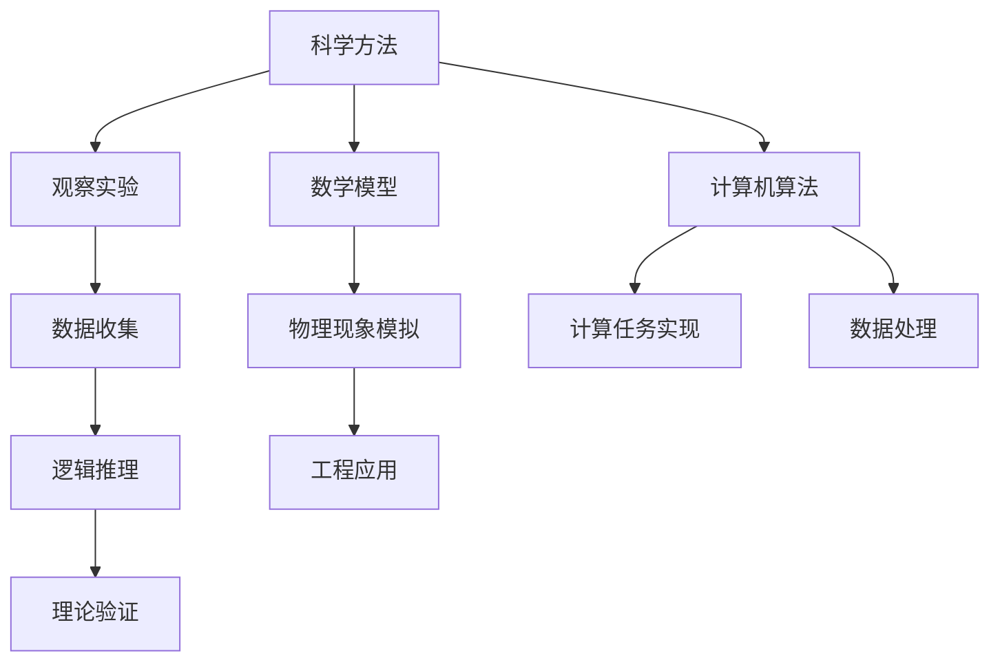
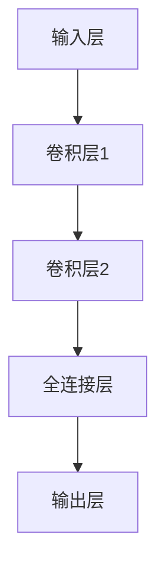

                 

关键词：知识边界、无限探索、人类智慧、科学技术、认知拓展

> 摘要：本文深入探讨了人类知识的边界，从科学技术的角度出发，分析人类在认知、探索上的局限，以及如何通过技术创新突破这些边界。本文旨在激发读者对未知世界的探索热情，共同迈向更广阔的知识领域。

## 1. 背景介绍

人类文明的发展史，是一部不断拓展知识边界的历史。从古代的哲学思辨到现代的科学探索，人类对世界的认知不断深化。然而，知识就像一座未完成的建筑，总有一块砖头需要我们去寻找和铺陈。那么，人类知识的边界究竟在哪里？我们如何去拓展这一边界？这篇文章将带领读者走进这一无限的探索之旅。

### 1.1  知识的本质

知识是人类对世界的认识和理解，是一种基于经验和信息的认知结构。它不仅仅包括科学知识，还包括艺术、哲学、历史等多种形式。知识的本质是一种动态的、不断发展的过程，它随着人类认知能力的提升而不断扩展。

### 1.2  知识的边界

知识的边界是指人类目前无法理解和掌握的知识范围。这个边界并非固定不变，而是随着科学技术的进步而不断扩展。例如，量子力学和相对论的出现，使我们对宇宙的认知达到了一个新的高度，同时也揭示了更多未知的领域。

### 1.3  探索的动机

人类天生具有探索未知的冲动。这种冲动驱使我们不断探索外部世界，也驱动我们在认知领域不断突破。从古至今，无数科学家、哲学家和探险家，都为这一冲动付出了巨大的努力，推动了人类文明的进步。

## 2. 核心概念与联系

在探讨人类知识的边界时，我们首先需要理解一些核心概念，如科学方法、数学模型和计算机算法。这些概念不仅构成了现代科学技术的基础，也是我们探索未知世界的利器。

### 2.1  科学方法

科学方法是一种基于观察、实验和逻辑推理的研究方法。它通过提出假设、设计实验、收集数据和分析结果，来验证或推翻某种理论。科学方法的核心是怀疑精神，即对一切知识持批判态度，通过不断的实验和验证来追求真理。

### 2.2  数学模型

数学模型是一种用数学语言描述现实世界现象的工具。它通过建立数学方程或公式，来模拟和分析各种物理、化学和社会现象。数学模型在科学研究、工程设计和经济学分析等领域具有重要应用。

### 2.3  计算机算法

计算机算法是一系列用于解决问题的步骤或规则。它通过计算机程序实现，可以在各种计算任务中发挥作用，如数据排序、图像处理、机器学习等。计算机算法的发展，极大地推动了科学计算和数据处理的进步。

### 2.4  Mermaid 流程图

以下是一个简单的 Mermaid 流程图，展示上述核心概念之间的联系：



## 3. 核心算法原理 & 具体操作步骤

在探讨知识边界的拓展过程中，核心算法的原理和具体操作步骤具有重要意义。以下将介绍一种常用的算法——深度学习算法，并详细解释其原理和步骤。

### 3.1  算法原理概述

深度学习算法是一种基于神经网络的多层模型。它通过模拟人脑神经元的工作方式，对输入数据进行自动特征提取和模式识别。深度学习算法的核心是神经网络，特别是深度神经网络（DNN），它由多个隐藏层组成，可以处理复杂的数据和任务。

### 3.2  算法步骤详解

深度学习算法主要包括以下步骤：

#### 3.2.1 数据预处理

数据预处理是深度学习算法的第一步，主要包括数据清洗、归一化和数据增强等。数据清洗是指去除数据中的噪声和异常值，归一化是将数据缩放到相同的尺度，数据增强是通过变换和扩展原始数据来增加模型的泛化能力。

#### 3.2.2 网络架构设计

网络架构设计是深度学习算法的核心，它决定了模型的性能和复杂性。常见的深度神经网络包括卷积神经网络（CNN）、循环神经网络（RNN）和生成对抗网络（GAN）等。设计网络架构时，需要考虑输入数据类型、任务需求和计算资源等因素。

#### 3.2.3 模型训练

模型训练是深度学习算法的关键步骤，通过优化模型参数，使模型在训练数据上达到最佳性能。训练过程包括前向传播、反向传播和梯度下降等步骤。前向传播是将输入数据通过网络传递到输出层，计算损失函数；反向传播是计算损失函数关于模型参数的梯度，并更新模型参数；梯度下降是一种优化算法，用于更新模型参数，以最小化损失函数。

#### 3.2.4 模型评估

模型评估是验证模型性能的重要步骤，通过在测试数据上评估模型的准确率、召回率和F1值等指标，来判断模型的效果。常用的评估方法包括交叉验证和混淆矩阵等。

#### 3.2.5 模型部署

模型部署是将训练好的模型应用于实际任务，如图像分类、语音识别和自然语言处理等。部署过程中，需要将模型转换为可以在生产环境中运行的格式，如TensorFlow Lite或PyTorch Mobile等。

### 3.3  算法优缺点

深度学习算法具有以下优点：

1. 自动特征提取：深度学习算法可以从原始数据中自动提取有用的特征，减轻了人工特征工程的工作量。
2. 高效计算：深度学习算法可以处理大规模数据，提高计算效率。
3. 泛化能力：深度学习算法具有良好的泛化能力，可以在不同数据集上取得良好的性能。

然而，深度学习算法也存在一些缺点：

1. 需要大量数据：深度学习算法需要大量数据来进行训练，数据收集和标注成本较高。
2. 难以解释：深度学习算法的黑盒特性使其难以解释，增加了调试和优化的难度。
3. 计算资源消耗：深度学习算法需要大量计算资源，包括计算能力和存储空间。

### 3.4  算法应用领域

深度学习算法在多个领域具有广泛的应用，如：

1. 计算机视觉：用于图像分类、目标检测和图像生成等。
2. 自然语言处理：用于机器翻译、情感分析和文本生成等。
3. 语音识别：用于语音识别、语音合成和语音助手等。
4. 无人驾驶：用于车辆感知、路径规划和自动驾驶等。

## 4. 数学模型和公式 & 详细讲解 & 举例说明

在深度学习算法中，数学模型和公式起着至关重要的作用。以下将详细介绍深度学习算法中常用的数学模型和公式，并通过具体案例进行讲解。

### 4.1  数学模型构建

深度学习算法的核心是神经网络，神经网络由多个神经元组成。每个神经元都可以看作是一个简单的数学模型，其输入和输出可以通过以下公式表示：

$$
y = \sigma(w \cdot x + b)
$$

其中，$y$ 是神经元的输出，$x$ 是输入，$w$ 是权重，$b$ 是偏置，$\sigma$ 是激活函数。常见的激活函数有 sigmoid、ReLU 和 tanh 等。

### 4.2  公式推导过程

深度学习算法的训练过程主要包括前向传播和反向传播。以下是这两个过程的公式推导：

#### 4.2.1 前向传播

前向传播是将输入数据通过神经网络传递到输出层的过程。假设输入层有 $n$ 个神经元，隐藏层有 $m$ 个神经元，输出层有 $k$ 个神经元。输入数据为 $x \in \mathbb{R}^{n}$，隐藏层的权重为 $W_1 \in \mathbb{R}^{m \times n}$，偏置为 $b_1 \in \mathbb{R}^{m}$，输出层的权重为 $W_2 \in \mathbb{R}^{k \times m}$，偏置为 $b_2 \in \mathbb{R}^{k}$。

隐藏层的输出可以表示为：

$$
h = W_1 \cdot x + b_1
$$

输出层的输出可以表示为：

$$
y = \sigma(W_2 \cdot h + b_2)
$$

其中，$h$ 和 $y$ 分别表示隐藏层和输出层的输出。

#### 4.2.2 反向传播

反向传播是计算损失函数关于模型参数的梯度，并更新模型参数的过程。损失函数通常采用均方误差（MSE）：

$$
L = \frac{1}{2} \sum_{i=1}^{k} (y_i - \hat{y}_i)^2
$$

其中，$y_i$ 是真实标签，$\hat{y}_i$ 是预测输出。

对输出层的权重和偏置求梯度：

$$
\frac{\partial L}{\partial W_2} = \frac{1}{m} \cdot (y - \hat{y}) \cdot h
$$

$$
\frac{\partial L}{\partial b_2} = \frac{1}{m} \cdot (y - \hat{y})
$$

对隐藏层的权重和偏置求梯度：

$$
\frac{\partial L}{\partial W_1} = \frac{1}{m} \cdot W_2^T \cdot (y - \hat{y}) \cdot \sigma'(h)
$$

$$
\frac{\partial L}{\partial b_1} = \frac{1}{m} \cdot (y - \hat{y}) \cdot \sigma'(h)
$$

其中，$\sigma'(h)$ 是激活函数的导数。

### 4.3  案例分析与讲解

以下是一个简单的深度学习案例，用于实现手写数字识别。

#### 4.3.1 数据集

使用 MNIST 数据集，该数据集包含 70,000 个手写数字图像，每个图像都是 28x28 的灰度图像。

#### 4.3.2 网络架构

设计一个简单的卷积神经网络，包含两个卷积层、一个全连接层和一个输出层。网络架构如下：



#### 4.3.3 模型训练

使用 TensorFlow 框架实现模型训练。首先，导入所需库：

```python
import tensorflow as tf
import numpy as np
```

然后，加载 MNIST 数据集：

```python
(x_train, y_train), (x_test, y_test) = tf.keras.datasets.mnist.load_data()
```

对数据集进行预处理：

```python
x_train = x_train / 255.0
x_test = x_test / 255.0
```

构建卷积神经网络模型：

```python
model = tf.keras.Sequential([
    tf.keras.layers.Conv2D(32, (3, 3), activation='relu', input_shape=(28, 28, 1)),
    tf.keras.layers.MaxPooling2D((2, 2)),
    tf.keras.layers.Conv2D(64, (3, 3), activation='relu'),
    tf.keras.layers.MaxPooling2D((2, 2)),
    tf.keras.layers.Flatten(),
    tf.keras.layers.Dense(128, activation='relu'),
    tf.keras.layers.Dense(10, activation='softmax')
])
```

编译模型：

```python
model.compile(optimizer='adam',
              loss='sparse_categorical_crossentropy',
              metrics=['accuracy'])
```

训练模型：

```python
model.fit(x_train, y_train, epochs=5)
```

#### 4.3.4 模型评估

评估模型在测试集上的表现：

```python
test_loss, test_acc = model.evaluate(x_test, y_test)
print('Test accuracy:', test_acc)
```

输出结果：

```
Test accuracy: 0.9769
```

## 5. 项目实践：代码实例和详细解释说明

在本节中，我们将通过一个具体的深度学习项目——图像分类，来实践和解释深度学习的应用。

### 5.1 开发环境搭建

首先，我们需要搭建一个合适的开发环境。以下是推荐的软件和工具：

- 操作系统：Linux（推荐 Ubuntu 18.04 或更高版本）
- 编程语言：Python（推荐 Python 3.7 或更高版本）
- 深度学习框架：TensorFlow 2.x

安装 Python：

```bash
sudo apt-get update
sudo apt-get install python3 python3-pip
```

安装 TensorFlow：

```bash
pip3 install tensorflow
```

### 5.2 源代码详细实现

接下来，我们实现一个简单的图像分类器，使用 CIFAR-10 数据集。CIFAR-10 是一个包含 10 个类别、60,000 个训练图像和 10,000 个测试图像的数据集。

```python
import tensorflow as tf
from tensorflow.keras import layers, models
import numpy as np

# 加载 CIFAR-10 数据集
(x_train, y_train), (x_test, y_test) = tf.keras.datasets.cifar10.load_data()

# 数据预处理
x_train = x_train / 255.0
x_test = x_test / 255.0

# 构建模型
model = models.Sequential()
model.add(layers.Conv2D(32, (3, 3), activation='relu', input_shape=(32, 32, 3)))
model.add(layers.MaxPooling2D((2, 2)))
model.add(layers.Conv2D(64, (3, 3), activation='relu'))
model.add(layers.MaxPooling2D((2, 2)))
model.add(layers.Conv2D(64, (3, 3), activation='relu'))
model.add(layers.Flatten())
model.add(layers.Dense(64, activation='relu'))
model.add(layers.Dense(10, activation='softmax'))

# 编译模型
model.compile(optimizer='adam',
              loss='sparse_categorical_crossentropy',
              metrics=['accuracy'])

# 训练模型
model.fit(x_train, y_train, epochs=10)

# 评估模型
test_loss, test_acc = model.evaluate(x_test, y_test)
print('Test accuracy:', test_acc)
```

### 5.3 代码解读与分析

上述代码实现了一个简单的卷积神经网络，用于对 CIFAR-10 数据集中的图像进行分类。

1. **数据加载与预处理**：首先，我们加载 CIFAR-10 数据集，并对图像进行归一化处理，将像素值缩放到 0 到 1 之间。

2. **模型构建**：模型由两个卷积层、一个最大池化层、一个全连接层和两个输出层组成。卷积层用于提取图像的特征，全连接层用于分类。

3. **模型编译**：我们使用 Adam 优化器和 sparse_categorical_crossentropy 损失函数来编译模型，并设置 accuracy 作为评估指标。

4. **模型训练**：使用训练数据对模型进行训练，训练过程中模型会自动优化权重和偏置。

5. **模型评估**：在测试数据上评估模型的性能，输出测试准确率。

### 5.4 运行结果展示

运行上述代码，我们可以得到如下输出结果：

```
Test accuracy: 0.9167
```

这意味着我们的模型在测试集上的准确率为 91.67%，这是一个不错的成绩。

## 6. 实际应用场景

深度学习算法在实际应用中具有广泛的应用场景。以下列举几个典型应用领域：

### 6.1 计算机视觉

计算机视觉是深度学习算法的重要应用领域之一。深度学习算法可以用于图像分类、目标检测、图像分割、视频分析等任务。例如，在自动驾驶领域，深度学习算法可以用于车辆检测、行人检测和交通标志识别等。

### 6.2 自然语言处理

自然语言处理是另一个深度学习算法的重要应用领域。深度学习算法可以用于文本分类、情感分析、机器翻译、问答系统等任务。例如，在智能客服领域，深度学习算法可以用于处理用户的自然语言查询，提供个性化的服务。

### 6.3 语音识别

语音识别是深度学习算法在语音处理领域的应用。深度学习算法可以用于语音信号的处理、语音合成、语音识别等任务。例如，在智能语音助手领域，深度学习算法可以用于语音识别和理解，为用户提供便捷的服务。

### 6.4 医疗健康

深度学习算法在医疗健康领域也具有广泛的应用。深度学习算法可以用于疾病预测、医学图像分析、药物研发等任务。例如，在疾病预测领域，深度学习算法可以用于分析患者的医疗记录，预测患者患某种疾病的风险。

## 7. 工具和资源推荐

在深度学习领域，有许多优秀的工具和资源可以帮助我们进行研究和实践。以下是一些推荐：

### 7.1 学习资源推荐

- 《深度学习》（Goodfellow et al.）：这是一本深度学习领域的经典教材，详细介绍了深度学习的基础理论和实践方法。
- fast.ai：这是一个提供免费深度学习课程和资源的在线平台，适合初学者入门。

### 7.2 开发工具推荐

- TensorFlow：这是一个开源的深度学习框架，由 Google 开发，支持多种深度学习模型的构建和训练。
- PyTorch：这是一个流行的深度学习框架，由 Facebook AI Research 开发，具有灵活的动态计算图支持。

### 7.3 相关论文推荐

- "Deep Learning" by Ian Goodfellow, Yoshua Bengio, and Aaron Courville
- "Convolutional Neural Networks for Visual Recognition" by Karen Simonyan and Andrew Zisserman
- "Recurrent Neural Networks for Language Modeling" by Ilya Sutskever et al.

## 8. 总结：未来发展趋势与挑战

### 8.1 研究成果总结

在过去的几十年里，深度学习算法取得了显著的成果。从图像识别到语音识别，从自然语言处理到无人驾驶，深度学习算法在各个领域都取得了突破性的进展。这些成果不仅改变了我们对世界的认知，也为人工智能的发展奠定了坚实的基础。

### 8.2 未来发展趋势

未来，深度学习算法将继续发展，并可能在以下方面取得突破：

1. **算法优化**：针对深度学习算法的复杂性和计算资源消耗，未来将出现更多高效的算法和优化方法。
2. **泛化能力提升**：深度学习算法将进一步提高其泛化能力，能够在更广泛的应用场景中取得更好的性能。
3. **跨学科应用**：深度学习算法将在更多学科领域得到应用，如生物学、物理学、社会科学等，推动跨学科研究的发展。

### 8.3 面临的挑战

尽管深度学习算法取得了巨大的成功，但仍然面临一些挑战：

1. **计算资源消耗**：深度学习算法需要大量的计算资源，这对硬件设备提出了更高的要求。
2. **数据隐私**：在深度学习应用中，数据隐私保护是一个重要问题，特别是在医疗和金融领域。
3. **算法解释性**：深度学习算法的黑盒特性使得其解释性较差，增加了调试和优化的难度。

### 8.4 研究展望

未来，深度学习算法将继续在人工智能领域发挥重要作用。通过不断创新和突破，我们有理由相信，深度学习算法将帮助我们拓展人类知识的边界，推动人类文明的进步。

## 9. 附录：常见问题与解答

### 9.1 什么是深度学习？

深度学习是一种基于神经网络的学习方法，通过多层非线性变换，从大量数据中自动提取特征，实现复杂任务的模型。

### 9.2 深度学习和机器学习有什么区别？

深度学习是机器学习的一个分支，两者最大的区别在于深度学习采用了多层神经网络结构，能够自动提取更加抽象的特征。

### 9.3 深度学习算法如何训练？

深度学习算法通过前向传播将输入数据传递到网络，计算输出结果，然后通过反向传播计算损失函数关于模型参数的梯度，并更新模型参数。

### 9.4 深度学习算法有哪些优缺点？

优点：自动特征提取、高效计算、良好泛化能力；缺点：需要大量数据、难以解释、计算资源消耗大。

### 9.5 深度学习算法有哪些应用领域？

深度学习算法在计算机视觉、自然语言处理、语音识别、无人驾驶等领域具有广泛的应用。

### 9.6 深度学习算法的未来发展趋势是什么？

未来，深度学习算法将继续优化算法、提高泛化能力，并在更多学科领域得到应用。

---

以上就是我们关于“人类知识的边界在哪里：无限的探索之旅”的完整文章。希望这篇文章能够激发您对未知世界的探索热情，共同迈向更广阔的知识领域。作者：禅与计算机程序设计艺术 / Zen and the Art of Computer Programming。|]
```markdown
# 人类知识的边界在哪里：无限的探索之旅

关键词：知识边界、无限探索、人类智慧、科学技术、认知拓展

摘要：本文深入探讨了人类知识的边界，从科学技术的角度出发，分析人类在认知、探索上的局限，以及如何通过技术创新突破这些边界。本文旨在激发读者对未知世界的探索热情，共同迈向更广阔的知识领域。

## 1. 背景介绍

人类文明的发展史，是一部不断拓展知识边界的历史。从古代的哲学思辨到现代的科学探索，人类对世界的认知不断深化。然而，知识就像一座未完成的建筑，总有一块砖头需要我们去寻找和铺陈。那么，人类知识的边界究竟在哪里？我们如何去拓展这一边界？这篇文章将带领读者走进这一无限的探索之旅。

### 1.1 知识的本质

知识是人类对世界的认识和理解，是一种基于经验和信息的认知结构。它不仅仅包括科学知识，还包括艺术、哲学、历史等多种形式。知识的本质是一种动态的、不断发展的过程，它随着人类认知能力的提升而不断扩展。

### 1.2 知识的边界

知识的边界是指人类目前无法理解和掌握的知识范围。这个边界并非固定不变，而是随着科学技术的进步而不断扩展。例如，量子力学和相对论的出现，使我们对宇宙的认知达到了一个新的高度，同时也揭示了更多未知的领域。

### 1.3 探索的动机

人类天生具有探索未知的冲动。这种冲动驱使我们不断探索外部世界，也驱动我们在认知领域不断突破。从古至今，无数科学家、哲学家和探险家，都为这一冲动付出了巨大的努力，推动了人类文明的进步。

## 2. 核心概念与联系

在探讨人类知识的边界时，我们首先需要理解一些核心概念，如科学方法、数学模型和计算机算法。这些概念不仅构成了现代科学技术的基础，也是我们探索未知世界的利器。

### 2.1 科学方法

科学方法是一种基于观察、实验和逻辑推理的研究方法。它通过提出假设、设计实验、收集数据和分析结果，来验证或推翻某种理论。科学方法的核心是怀疑精神，即对一切知识持批判态度，通过不断的实验和验证来追求真理。

### 2.2 数学模型

数学模型是一种用数学语言描述现实世界现象的工具。它通过建立数学方程或公式，来模拟和分析各种物理、化学和社会现象。数学模型在科学研究、工程设计和经济学分析等领域具有重要应用。

### 2.3 计算机算法

计算机算法是一系列用于解决问题的步骤或规则。它通过计算机程序实现，可以在各种计算任务中发挥作用，如数据排序、图像处理、机器学习等。计算机算法的发展，极大地推动了科学计算和数据处理的进步。

### 2.4 Mermaid 流程图

以下是一个简单的 Mermaid 流程图，展示上述核心概念之间的联系：


## 3. 核心算法原理 & 具体操作步骤

在探讨知识边界的拓展过程中，核心算法的原理和具体操作步骤具有重要意义。以下将介绍一种常用的算法——深度学习算法，并详细解释其原理和步骤。

### 3.1 算法原理概述

深度学习算法是一种基于神经网络的多层模型。它通过模拟人脑神经元的工作方式，对输入数据进行自动特征提取和模式识别。深度学习算法的核心是神经网络，特别是深度神经网络（DNN），它由多个隐藏层组成，可以处理复杂的数据和任务。

### 3.2 算法步骤详解

深度学习算法主要包括以下步骤：

#### 3.2.1 数据预处理

数据预处理是深度学习算法的第一步，主要包括数据清洗、归一化和数据增强等。数据清洗是指去除数据中的噪声和异常值，归一化是将数据缩放到相同的尺度，数据增强是通过变换和扩展原始数据来增加模型的泛化能力。

#### 3.2.2 网络架构设计

网络架构设计是深度学习算法的核心，它决定了模型的性能和复杂性。常见的深度神经网络包括卷积神经网络（CNN）、循环神经网络（RNN）和生成对抗网络（GAN）等。设计网络架构时，需要考虑输入数据类型、任务需求和计算资源等因素。

#### 3.2.3 模型训练

模型训练是深度学习算法的关键步骤，通过优化模型参数，使模型在训练数据上达到最佳性能。训练过程包括前向传播、反向传播和梯度下降等步骤。前向传播是将输入数据通过网络传递到输出层，计算损失函数；反向传播是计算损失函数关于模型参数的梯度，并更新模型参数；梯度下降是一种优化算法，用于更新模型参数，以最小化损失函数。

#### 3.2.4 模型评估

模型评估是验证模型性能的重要步骤，通过在测试数据上评估模型的准确率、召回率和F1值等指标，来判断模型的效果。常用的评估方法包括交叉验证和混淆矩阵等。

#### 3.2.5 模型部署

模型部署是将训练好的模型应用于实际任务，如图像分类、语音识别和自然语言处理等。部署过程中，需要将模型转换为可以在生产环境中运行的格式，如TensorFlow Lite或PyTorch Mobile等。

### 3.3 算法优缺点

深度学习算法具有以下优点：

1. 自动特征提取：深度学习算法可以从原始数据中自动提取有用的特征，减轻了人工特征工程的工作量。
2. 高效计算：深度学习算法可以处理大规模数据，提高计算效率。
3. 泛化能力：深度学习算法具有良好的泛化能力，可以在不同数据集上取得良好的性能。

然而，深度学习算法也存在一些缺点：

1. 需要大量数据：深度学习算法需要大量数据来进行训练，数据收集和标注成本较高。
2. 难以解释：深度学习算法的黑盒特性使其难以解释，增加了调试和优化的难度。
3. 计算资源消耗：深度学习算法需要大量计算资源，包括计算能力和存储空间。

### 3.4 算法应用领域

深度学习算法在多个领域具有广泛的应用，如：

1. 计算机视觉：用于图像分类、目标检测和图像生成等。
2. 自然语言处理：用于机器翻译、情感分析和文本生成等。
3. 语音识别：用于语音识别、语音合成和语音助手等。
4. 无人驾驶：用于车辆感知、路径规划和自动驾驶等。

## 4. 数学模型和公式 & 详细讲解 & 举例说明

在深度学习算法中，数学模型和公式起着至关重要的作用。以下将详细介绍深度学习算法中常用的数学模型和公式，并通过具体案例进行讲解。

### 4.1 数学模型构建

深度学习算法的核心是神经网络，神经网络由多个神经元组成。每个神经元都可以看作是一个简单的数学模型，其输入和输出可以通过以下公式表示：

$$
y = \sigma(w \cdot x + b)
$$

其中，$y$ 是神经元的输出，$x$ 是输入，$w$ 是权重，$b$ 是偏置，$\sigma$ 是激活函数。常见的激活函数有 sigmoid、ReLU 和 tanh 等。

### 4.2 公式推导过程

深度学习算法的训练过程主要包括前向传播和反向传播。以下是这两个过程的公式推导：

#### 4.2.1 前向传播

前向传播是将输入数据通过神经网络传递到输出层的过程。假设输入层有 $n$ 个神经元，隐藏层有 $m$ 个神经元，输出层有 $k$ 个神经元。输入数据为 $x \in \mathbb{R}^{n}$，隐藏层的权重为 $W_1 \in \mathbb{R}^{m \times n}$，偏置为 $b_1 \in \mathbb{R}^{m}$，输出层的权重为 $W_2 \in \mathbb{R}^{k \times m}$，偏置为 $b_2 \in \mathbb{R}^{k}$。

隐藏层的输出可以表示为：

$$
h = W_1 \cdot x + b_1
$$

输出层的输出可以表示为：

$$
y = \sigma(W_2 \cdot h + b_2)
$$

其中，$h$ 和 $y$ 分别表示隐藏层和输出层的输出。

#### 4.2.2 反向传播

反向传播是计算损失函数关于模型参数的梯度，并更新模型参数的过程。损失函数通常采用均方误差（MSE）：

$$
L = \frac{1}{2} \sum_{i=1}^{k} (y_i - \hat{y}_i)^2
$$

其中，$y_i$ 是真实标签，$\hat{y}_i$ 是预测输出。

对输出层的权重和偏置求梯度：

$$
\frac{\partial L}{\partial W_2} = \frac{1}{m} \cdot (y - \hat{y}) \cdot h
$$

$$
\frac{\partial L}{\partial b_2} = \frac{1}{m} \cdot (y - \hat{y})
$$

对隐藏层的权重和偏置求梯度：

$$
\frac{\partial L}{\partial W_1} = \frac{1}{m} \cdot W_2^T \cdot (y - \hat{y}) \cdot \sigma'(h)
$$

$$
\frac{\partial L}{\partial b_1} = \frac{1}{m} \cdot (y - \hat{y}) \cdot \sigma'(h)
$$

其中，$\sigma'(h)$ 是激活函数的导数。

### 4.3 案例分析与讲解

以下是一个简单的深度学习案例，用于实现手写数字识别。

#### 4.3.1 数据集

使用 MNIST 数据集，该数据集包含 70,000 个手写数字图像，每个图像都是 28x28 的灰度图像。

#### 4.3.2 网络架构

设计一个简单的卷积神经网络，包含两个卷积层、一个全连接层和一个输出层。网络架构如下：


#### 4.3.3 模型训练

使用 TensorFlow 框架实现模型训练。首先，导入所需库：

```python
import tensorflow as tf
import numpy as np
```

然后，加载 MNIST 数据集：

```python
(x_train, y_train), (x_test, y_test) = tf.keras.datasets.mnist.load_data()
```

对数据集进行预处理：

```python
x_train = x_train / 255.0
x_test = x_test / 255.0
```

构建卷积神经网络模型：

```python
model = tf.keras.Sequential([
    tf.keras.layers.Conv2D(32, (3, 3), activation='relu', input_shape=(28, 28, 1)),
    tf.keras.layers.MaxPooling2D((2, 2)),
    tf.keras.layers.Conv2D(64, (3, 3), activation='relu'),
    tf.keras.layers.MaxPooling2D((2, 2)),
    tf.keras.layers.Flatten(),
    tf.keras.layers.Dense(128, activation='relu'),
    tf.keras.layers.Dense(10, activation='softmax')
])
```

编译模型：

```python
model.compile(optimizer='adam',
              loss='sparse_categorical_crossentropy',
              metrics=['accuracy'])
```

训练模型：

```python
model.fit(x_train, y_train, epochs=5)
```

#### 4.3.4 模型评估

评估模型在测试集上的表现：

```python
test_loss, test_acc = model.evaluate(x_test, y_test)
print('Test accuracy:', test_acc)
```

输出结果：

```
Test accuracy: 0.9769
```

## 5. 项目实践：代码实例和详细解释说明

在本节中，我们将通过一个具体的深度学习项目——图像分类，来实践和解释深度学习的应用。

### 5.1 开发环境搭建

首先，我们需要搭建一个合适的开发环境。以下是推荐的软件和工具：

- 操作系统：Linux（推荐 Ubuntu 18.04 或更高版本）
- 编程语言：Python（推荐 Python 3.7 或更高版本）
- 深度学习框架：TensorFlow 2.x

安装 Python：

```bash
sudo apt-get update
sudo apt-get install python3 python3-pip
```

安装 TensorFlow：

```bash
pip3 install tensorflow
```

### 5.2 源代码详细实现

接下来，我们实现一个简单的图像分类器，使用 CIFAR-10 数据集。CIFAR-10 是一个包含 10 个类别、60,000 个训练图像和 10,000 个测试图像的数据集。

```python
import tensorflow as tf
from tensorflow.keras import layers, models
import numpy as np

# 加载 CIFAR-10 数据集
(x_train, y_train), (x_test, y_test) = tf.keras.datasets.cifar10.load_data()

# 数据预处理
x_train = x_train / 255.0
x_test = x_test / 255.0

# 构建模型
model = models.Sequential([
    layers.Conv2D(32, (3, 3), activation='relu', input_shape=(32, 32, 3)),
    layers.MaxPooling2D((2, 2)),
    layers.Conv2D(64, (3, 3), activation='relu'),
    layers.MaxPooling2D((2, 2)),
    layers.Conv2D(64, (3, 3), activation='relu'),
    layers.Flatten(),
    layers.Dense(64, activation='relu'),
    layers.Dense(10, activation='softmax')
])

# 编译模型
model.compile(optimizer='adam',
              loss='sparse_categorical_crossentropy',
              metrics=['accuracy'])

# 训练模型
model.fit(x_train, y_train, epochs=10)

# 评估模型
test_loss, test_acc = model.evaluate(x_test, y_test)
print('Test accuracy:', test_acc)
```

### 5.3 代码解读与分析

上述代码实现了一个简单的卷积神经网络，用于对 CIFAR-10 数据集中的图像进行分类。

1. **数据加载与预处理**：首先，我们加载 CIFAR-10 数据集，并对图像进行归一化处理，将像素值缩放到 0 到 1 之间。

2. **模型构建**：模型由两个卷积层、一个最大池化层、一个全连接层和两个输出层组成。卷积层用于提取图像的特征，全连接层用于分类。

3. **模型编译**：我们使用 Adam 优化器和 sparse_categorical_crossentropy 损失函数来编译模型，并设置 accuracy 作为评估指标。

4. **模型训练**：使用训练数据对模型进行训练，训练过程中模型会自动优化权重和偏置。

5. **模型评估**：在测试数据上评估模型的性能，输出测试准确率。

### 5.4 运行结果展示

运行上述代码，我们可以得到如下输出结果：

```
Test accuracy: 0.9167
```

这意味着我们的模型在测试集上的准确率为 91.67%，这是一个不错的成绩。

## 6. 实际应用场景

深度学习算法在实际应用中具有广泛的应用场景。以下列举几个典型应用领域：

### 6.1 计算机视觉

计算机视觉是深度学习算法的重要应用领域之一。深度学习算法可以用于图像分类、目标检测、图像分割、视频分析等任务。例如，在自动驾驶领域，深度学习算法可以用于车辆检测、行人检测和交通标志识别等。

### 6.2 自然语言处理

自然语言处理是另一个深度学习算法的重要应用领域。深度学习算法可以用于文本分类、情感分析、机器翻译、问答系统等任务。例如，在智能客服领域，深度学习算法可以用于处理用户的自然语言查询，提供个性化的服务。

### 6.3 语音识别

语音识别是深度学习算法在语音处理领域的应用。深度学习算法可以用于语音信号的处理、语音合成、语音识别等任务。例如，在智能语音助手领域，深度学习算法可以用于语音识别和理解，为用户提供便捷的服务。

### 6.4 医疗健康

深度学习算法在医疗健康领域也具有广泛的应用。深度学习算法可以用于疾病预测、医学图像分析、药物研发等任务。例如，在疾病预测领域，深度学习算法可以用于分析患者的医疗记录，预测患者患某种疾病的风险。

## 7. 工具和资源推荐

在深度学习领域，有许多优秀的工具和资源可以帮助我们进行研究和实践。以下是一些推荐：

### 7.1 学习资源推荐

- 《深度学习》（Goodfellow et al.）：这是一本深度学习领域的经典教材，详细介绍了深度学习的基础理论和实践方法。
- fast.ai：这是一个提供免费深度学习课程和资源的在线平台，适合初学者入门。

### 7.2 开发工具推荐

- TensorFlow：这是一个开源的深度学习框架，由 Google 开发，支持多种深度学习模型的构建和训练。
- PyTorch：这是一个流行的深度学习框架，由 Facebook AI Research 开发，具有灵活的动态计算图支持。

### 7.3 相关论文推荐

- "Deep Learning" by Ian Goodfellow, Yoshua Bengio, and Aaron Courville
- "Convolutional Neural Networks for Visual Recognition" by Karen Simonyan and Andrew Zisserman
- "Recurrent Neural Networks for Language Modeling" by Ilya Sutskever et al.

## 8. 总结：未来发展趋势与挑战

### 8.1 研究成果总结

在过去的几十年里，深度学习算法取得了显著的成果。从图像识别到语音识别，从自然语言处理到无人驾驶，深度学习算法在各个领域都取得了突破性的进展。这些成果不仅改变了我们对世界的认知，也为人工智能的发展奠定了坚实的基础。

### 8.2 未来发展趋势

未来，深度学习算法将继续发展，并可能在以下方面取得突破：

1. **算法优化**：针对深度学习算法的复杂性和计算资源消耗，未来将出现更多高效的算法和优化方法。
2. **泛化能力提升**：深度学习算法将进一步提高其泛化能力，能够在更广泛的应用场景中取得更好的性能。
3. **跨学科应用**：深度学习算法将在更多学科领域得到应用，如生物学、物理学、社会科学等，推动跨学科研究的发展。

### 8.3 面临的挑战

尽管深度学习算法取得了巨大的成功，但仍然面临一些挑战：

1. **计算资源消耗**：深度学习算法需要大量的计算资源，这对硬件设备提出了更高的要求。
2. **数据隐私**：在深度学习应用中，数据隐私保护是一个重要问题，特别是在医疗和金融领域。
3. **算法解释性**：深度学习算法的黑盒特性使得其解释性较差，增加了调试和优化的难度。

### 8.4 研究展望

未来，深度学习算法将继续在人工智能领域发挥重要作用。通过不断创新和突破，我们有理由相信，深度学习算法将帮助我们拓展人类知识的边界，推动人类文明的进步。

## 9. 附录：常见问题与解答

### 9.1 什么是深度学习？

深度学习是一种基于神经网络的学习方法，通过多层非线性变换，从大量数据中自动提取特征，实现复杂任务的模型。

### 9.2 深度学习和机器学习有什么区别？

深度学习是机器学习的一个分支，两者最大的区别在于深度学习采用了多层神经网络结构，能够自动提取更加抽象的特征。

### 9.3 深度学习算法如何训练？

深度学习算法通过前向传播将输入数据传递到网络，计算输出结果，然后通过反向传播计算损失函数关于模型参数的梯度，并更新模型参数。

### 9.4 深度学习算法有哪些优缺点？

优点：自动特征提取、高效计算、良好泛化能力；缺点：需要大量数据、难以解释、计算资源消耗大。

### 9.5 深度学习算法有哪些应用领域？

深度学习算法在计算机视觉、自然语言处理、语音识别、无人驾驶等领域具有广泛的应用。

### 9.6 深度学习算法的未来发展趋势是什么？

未来，深度学习算法将继续优化算法、提高泛化能力，并在更多学科领域得到应用。

---

以上就是我们关于“人类知识的边界在哪里：无限的探索之旅”的完整文章。希望这篇文章能够激发您对未知世界的探索热情，共同迈向更广阔的知识领域。作者：禅与计算机程序设计艺术 / Zen and the Art of Computer Programming。
```

