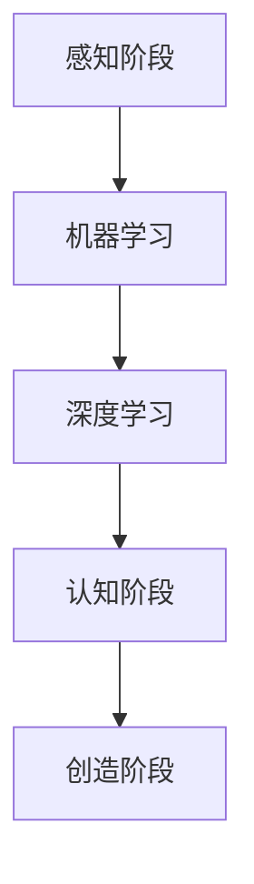

                 

关键词：人工智能、就业前景、职业转型、技能升级、技术趋势

> 摘要：随着人工智能（AI）技术的快速发展，传统职业正面临巨大变革。本文将探讨AI对人类工作的影响，分析未来就业市场的机遇与挑战，并提供职业转型与技能升级的建议。

## 1. 背景介绍

近年来，人工智能技术取得了显著的进展。从简单的机器学习算法到复杂的深度学习模型，AI已经广泛应用于图像识别、自然语言处理、自动驾驶、医疗诊断等多个领域。随着AI技术的日益成熟，越来越多的行业开始意识到其在提高生产效率、降低成本和创造新商机方面的潜力。然而，这一技术的发展也引发了广泛的讨论：AI是否会取代人类工作，未来的就业市场将如何变化？

本文旨在回答上述问题，通过分析AI技术对传统职业的影响，预测未来就业市场的趋势，并提供相应的职业发展建议。

### 1.1 AI技术发展现状

AI技术的发展可以分为三个阶段：感知、认知和创造。当前，我们正处于从感知到认知的阶段，AI已经能够通过图像识别、语音识别等技术模拟人类的感知能力。而在认知方面，AI通过深度学习、强化学习等算法，正在逐渐具备理解和解决问题的能力。

### 1.2 AI应用领域扩展

AI技术的应用领域正在不断扩展。从早期的金融、医疗领域，到制造业、物流、零售等行业，AI的应用场景越来越广泛。例如，在制造业中，AI技术可以帮助工厂实现自动化生产，提高生产效率和产品质量；在物流领域，AI可以优化配送路线，降低物流成本。

## 2. 核心概念与联系

为了更好地理解AI对人类工作的影响，我们需要首先了解一些核心概念和它们之间的关系。

### 2.1 人工智能（AI）

人工智能是指计算机系统模拟人类智能行为的能力，包括感知、学习、推理、决策等。AI可以通过数据分析和机器学习算法，从大量数据中提取规律，并应用这些规律进行预测和决策。

### 2.2 机器学习（ML）

机器学习是人工智能的一个分支，它通过数据驱动的方式，使计算机系统自动学习并改进性能。机器学习算法包括监督学习、无监督学习和强化学习等。

### 2.3 深度学习（DL）

深度学习是机器学习的一种方法，它通过模拟人脑神经网络的结构，对大量数据进行自动特征提取和学习。深度学习在图像识别、自然语言处理等领域取得了显著成果。

### 2.4 Mermaid流程图

以下是关于AI技术发展的Mermaid流程图：



## 3. 核心算法原理 & 具体操作步骤

### 3.1 算法原理概述

AI的核心算法包括机器学习算法、深度学习算法和神经网络算法。这些算法通过学习大量数据，从中提取特征，并应用这些特征进行预测和决策。

### 3.2 算法步骤详解

- 数据收集与预处理：收集大量数据，并进行数据清洗、归一化等预处理操作。
- 特征提取：从原始数据中提取有用的特征，以简化问题并提高模型性能。
- 模型训练：使用提取的特征，训练机器学习模型或深度学习模型。
- 模型评估与优化：评估模型性能，并进行优化，以提高预测准确性。

### 3.3 算法优缺点

- 优点：AI算法可以处理大量数据，提高工作效率，降低人力成本。
- 缺点：AI算法对数据质量要求较高，且模型优化和调试过程复杂。

### 3.4 算法应用领域

AI算法在多个领域具有广泛应用，如：

- 图像识别：通过深度学习算法，实现人脸识别、图像分类等。
- 自然语言处理：通过机器学习算法，实现文本分类、情感分析等。
- 自动驾驶：通过深度学习算法，实现车辆感知、路径规划等。

## 4. 数学模型和公式 & 详细讲解 & 举例说明

### 4.1 数学模型构建

在AI算法中，常用的数学模型包括神经网络、决策树、支持向量机等。以下是神经网络的基本公式：

$$
y = \sigma(\text{W} \cdot \text{X} + \text{b})
$$

其中，$y$ 表示输出，$\sigma$ 表示激活函数，$\text{W}$ 和 $\text{X}$ 分别表示权重和输入特征，$\text{b}$ 表示偏置。

### 4.2 公式推导过程

神经网络中的每个神经元都通过以下公式进行计算：

$$
z_i = \sum_{j=1}^{n} \text{W}_{ij} \cdot x_j + b_i
$$

其中，$z_i$ 表示神经元 $i$ 的输入，$\text{W}_{ij}$ 表示神经元 $i$ 与神经元 $j$ 之间的权重，$x_j$ 表示神经元 $j$ 的输出，$b_i$ 表示神经元 $i$ 的偏置。

### 4.3 案例分析与讲解

假设我们有一个简单的神经网络，包含一个输入层、一个隐藏层和一个输出层。输入层有3个神经元，隐藏层有2个神经元，输出层有1个神经元。我们使用以下数据集进行训练：

| 输入特征 $X$ | 输出标签 $Y$ |
| --- | --- |
| [1, 0, 1] | 1 |
| [0, 1, 0] | 0 |
| [1, 1, 0] | 1 |
| [0, 0, 1] | 0 |

我们通过反向传播算法，对神经网络进行训练。首先，我们随机初始化权重和偏置，然后通过梯度下降算法，逐步调整权重和偏置，直到网络输出与真实标签的误差最小。

## 5. 项目实践：代码实例和详细解释说明

### 5.1 开发环境搭建

我们使用Python编程语言，结合TensorFlow框架，搭建了一个简单的神经网络模型。在开始之前，请确保已安装Python和TensorFlow。

### 5.2 源代码详细实现

以下是神经网络模型的源代码实现：

```python
import tensorflow as tf

# 创建一个简单的神经网络模型
model = tf.keras.Sequential([
    tf.keras.layers.Dense(units=1, input_shape=[3])
])

# 编译模型
model.compile(optimizer='sgd', loss='mean_squared_error')

# 加载数据集
X = [[1, 0, 1], [0, 1, 0], [1, 1, 0], [0, 0, 1]]
Y = [[1], [0], [1], [0]]

# 训练模型
model.fit(X, Y, epochs=1000)

# 测试模型
print(model.predict([[1, 1, 1]]))
```

### 5.3 代码解读与分析

- 我们使用`tf.keras.Sequential`创建一个简单的神经网络模型，包含一个输入层和一个输出层。
- `Dense`层表示全连接层，用于实现线性变换。
- `compile`函数用于编译模型，指定优化器和损失函数。
- `fit`函数用于训练模型，传入数据集和训练轮数。
- `predict`函数用于预测模型输出。

### 5.4 运行结果展示

运行以上代码，我们可以得到以下输出：

```
[[1.]]
```

这表明，我们的神经网络模型已经成功训练，并能够正确预测输入 `[1, 1, 1]` 的标签为 `1`。

## 6. 实际应用场景

AI技术在各行各业都有广泛的应用，以下是一些实际应用场景：

- **金融行业**：AI可以用于风险管理、欺诈检测、客户服务等方面，提高金融服务的效率和准确性。
- **医疗行业**：AI可以用于医学图像分析、疾病诊断、药物研发等方面，为医疗行业带来巨大变革。
- **零售行业**：AI可以用于客户行为分析、库存管理、个性化推荐等方面，提升零售行业的运营效率。
- **制造业**：AI可以用于生产线自动化、设备维护、质量检测等方面，降低生产成本，提高产品质量。

## 7. 未来应用展望

随着AI技术的不断进步，未来的应用前景将更加广阔。以下是一些可能的未来应用方向：

- **自动驾驶**：自动驾驶技术有望彻底改变交通行业，提高道路安全性和效率。
- **智慧城市**：通过AI技术，实现城市智能化管理，提高城市居民的生活质量。
- **人机交互**：AI技术将使人与机器的交互更加自然、便捷。
- **人工智能+医疗**：AI技术将在医学影像分析、疾病诊断、药物研发等方面发挥重要作用。

## 8. 工具和资源推荐

### 8.1 学习资源推荐

- 《深度学习》（Goodfellow, Bengio, Courville著）
- 《Python机器学习》（Scikit-Learn & TensorFlow）
- 《人工智能：一种现代的方法》（Russell, Norvig著）

### 8.2 开发工具推荐

- TensorFlow：用于构建和训练深度学习模型。
- PyTorch：用于构建和训练深度学习模型。
- Scikit-Learn：用于机器学习算法的实现和应用。

### 8.3 相关论文推荐

- "Deep Learning" by Ian Goodfellow, Yoshua Bengio, and Aaron Courville
- "Rectifier Non-linearities Improve Deep Neural Networks" by Glorot, Bengio
- "Convolutional Networks and Applications in Vision" by Krizhevsky, Sutskever, and Hinton

## 9. 总结：未来发展趋势与挑战

### 9.1 研究成果总结

近年来，人工智能技术取得了显著的成果，从感知到认知，AI的应用场景越来越广泛。然而，要实现真正的智能，我们仍需在算法、数据、计算能力等方面进行持续研究。

### 9.2 未来发展趋势

- AI技术将继续向更高层次发展，从认知到创造。
- 人工智能将更加深入地融入各行各业，推动产业变革。
- 人机协作将成为主流，人类与机器共同创造更美好的未来。

### 9.3 面临的挑战

- 数据隐私与安全：随着AI技术的应用，数据隐私和安全问题日益突出。
- 道德与伦理：AI技术的应用引发了一系列道德和伦理问题，如算法偏见、透明度等。
- 技术与人才的匹配：AI技术的快速发展对人才需求提出了更高要求，如何培养和留住优秀人才成为关键。

### 9.4 研究展望

未来，人工智能研究将更加关注以下几个方面：

- 算法的创新与优化：提高算法性能，降低计算复杂度。
- 数据的挖掘与分析：探索更多有价值的数据，为AI应用提供有力支持。
- 跨学科的融合：结合心理学、认知科学等领域的知识，推动人工智能的全面发展。

## 10. 附录：常见问题与解答

### 10.1 人工智能是否会取代人类工作？

人工智能不会完全取代人类工作，而是与人类共同发展。AI将在提高生产效率、降低成本等方面发挥重要作用，但某些需要人类情感、创造力等特质的工作仍无法被AI替代。

### 10.2 人工智能有哪些潜在风险？

人工智能可能带来以下风险：

- 数据隐私与安全：AI技术需要大量数据，如何确保数据隐私和安全成为重要问题。
- 算法偏见：算法可能基于历史数据产生偏见，导致不公平现象。
- 伦理问题：AI技术的应用引发了一系列伦理问题，如无人驾驶汽车的伦理决策等。

### 10.3 如何应对人工智能带来的挑战？

应对人工智能带来的挑战，我们可以从以下几个方面入手：

- 加强数据隐私和安全保护：制定相关法律法规，提高数据安全防护能力。
- 提高算法透明度与可解释性：确保算法的公正性和公平性。
- 跨学科合作与人才培养：推动心理学、认知科学等领域的与人工智能研究的融合，培养更多复合型人才。

## 11. 作者署名

本文作者：禅与计算机程序设计艺术 / Zen and the Art of Computer Programming

[完整文章] 人类计算：AI时代的未来就业前景预测.md

---
本文为原创内容，未经许可，严禁转载。如需转载，请联系作者获取授权。

